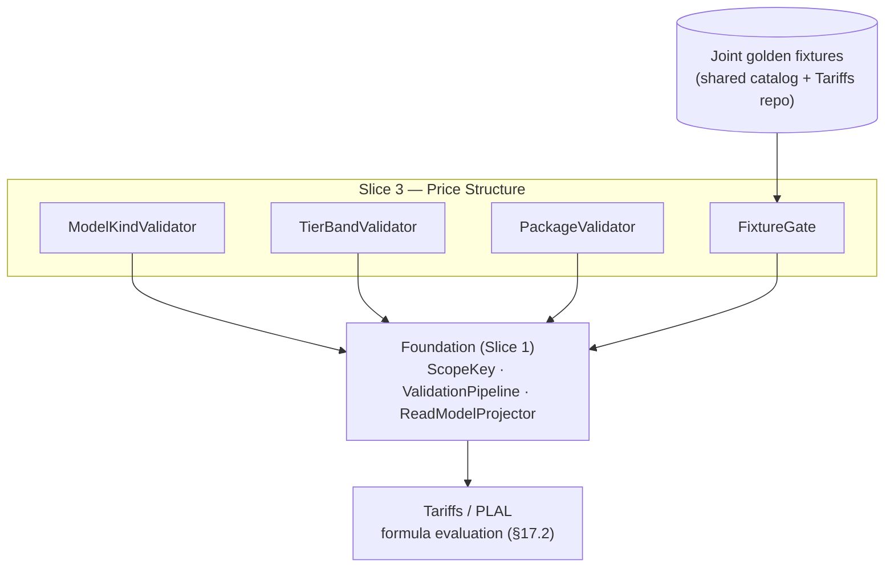

<!-- CONFLUENCE_TITLE: [BSS]: Pricing — Price Structure & Model Kinds (Design, Slice 3) -->
<!-- Related: ../PRD.md, ../DESIGN.md, ./01-foundation.md | Owners: BSS Product Catalog team -->

# DESIGN — Price Structure & Model Kinds (Slice 3)

<!-- toc -->

- [1. Context](#1-context)
  - [1.1 Overview](#11-overview)
  - [1.2 Purpose](#12-purpose)
  - [1.3 Actors](#13-actors)
  - [1.4 References](#14-references)
  - [1.5 Scope](#15-scope)
  - [1.6 Constraints & Assumptions](#16-constraints--assumptions)
  - [1.7 Naming & Design-Introduced Names](#17-naming--design-introduced-names)
  - [1.8 Context & Dependencies](#18-context--dependencies)
- [2. Actor Flows (CDSL)](#2-actor-flows-cdsl)
  - [Author Price Rows](#author-price-rows)
- [3. Processes / Business Logic (CDSL)](#3-processes--business-logic-cdsl)
  - [Model-Kind Validation](#model-kind-validation)
  - [Tier-Band Validation](#tier-band-validation)
  - [Package Pricing Validation](#package-pricing-validation)
  - [Level Aggregation Authoring (D-44)](#level-aggregation-authoring-d-44)
  - [Conformance Fixture Gate](#conformance-fixture-gate)
- [4. States (CDSL)](#4-states-cdsl)
  - [Price Row State Machine](#price-row-state-machine)
- [5. API Surface](#5-api-surface)
- [6. Data Model](#6-data-model)
- [7. Events & Alarms](#7-events--alarms)
- [8. Definitions of Done](#8-definitions-of-done)
  - [Explicit Model Kind](#explicit-model-kind)
  - [Tier Bands](#tier-bands)
  - [Package Pricing](#package-pricing)
  - [Level Aggregation](#level-aggregation)
  - [Conformance Gate](#conformance-gate)
- [9. Acceptance Criteria](#9-acceptance-criteria)
- [10. Non-Functional Considerations](#10-non-functional-considerations)

<!-- /toc -->

## 1. Context

### 1.1 Overview

This slice owns the **structure of a price row**: the explicit `modelKind`
(`flat | per_unit | graduated | volume | package`), tier-band validation under the
`[fromQty, toQty)` convention, package (block) pricing fields, the usage evaluation-policy
placement rules (`tierAggregationWindow`, `billingGranularity`), and the **joint
golden-conformance-fixture gate** that blocks publish of any `modelKind` Tariffs cannot
provably evaluate. Rows live on the Foundation's canonical scope key and publish through the
Foundation pipeline; the **math is never computed here** — Tariffs applies the formula per
the §17.2 conformance mapping.

**Traces to**: `cpt-cf-bss-pricing-fr-model-kind`, `cpt-cf-bss-pricing-fr-tier-validation`,
`cpt-cf-bss-pricing-fr-package-pricing`, `cpt-cf-bss-pricing-fr-model-kind-conformance`,
`cpt-cf-bss-pricing-fr-price-amount-validation`, `cpt-cf-bss-pricing-fr-per-seat`

### 1.2 Purpose

Guarantee that every published price row is **unambiguously evaluable**: the model kind is
explicit and frozen (no rating-time default), tier bands cannot overlap, gap, or close the top (any quantity is always rateable — D-17), package fields are structurally exclusive with tier fields, and no kind
publishes without a version-controlled joint fixture proving catalog↔Tariffs agreement —
eliminating the class of silent mispricing bugs at band edges and kind mismatches.

### 1.3 Actors

| Actor | Role in Slice |
|-------|---------------|
| `cpt-cf-bss-pricing-actor-finance-manager` | Authors amounts, model kinds, tier bands |
| `cpt-cf-bss-pricing-actor-rating` | Consumes `modelKind` + bands + evaluation policy; resolves policy fields deterministically; co-owns golden fixtures (consolidated gear — rating ADR-0002) |
| `cpt-cf-bss-pricing-actor-subscriptions` | Supplies `subscription_seat_count` for `per_unit` rows at rating time |

### 1.4 References

- **PRD**: [PRD.md](../PRD.md) — §6.2, §17.1 (structure kinds), §17.2 (conformance mapping), §17.4 (validation rules)
- **Design**: [01-foundation.md](./01-foundation.md) — scope key (§4.1), publish contract (§4.2), money constraint
- **Dependencies**: Foundation (Slice 1); co-required with plan-definition (Slice 2) — the cycle shape decides which `chargeKind` rows a plan needs; reserved-capacity attributes extend the usage row in Slice 10.

### 1.5 Scope

**In scope**: `modelKind` enum + explicitness; `[fromQty, toQty)` band validation (ascending,
non-overlapping, contiguous, always-open top — D-17); `package` fields + structural exclusivity;
`per_unit` `quantitySource` persistence; evaluation-policy placement (usage-only fields);
amount/currency/precision validation (delegating the shared checks to the Foundation);
the conformance-fixture publish gate.

**Out of scope**: formula evaluation, graduated-vs-volume math, round-up math (Tariffs);
tier resets / `Q` derivation semantics (Tariffs; catalog persists the window enum only);
reserved-rate attributes and derived meters (Slice 10); price overlays/overlays (Slice 9);
windows (Slice 7).

### 1.6 Constraints & Assumptions

Inherits Foundation C-set. Slice-3-specific:

| # | Topic | Assumption (default) | Source |
|---|-------|----------------------|--------|
| Q1 | Band convention | Half-open `[fromQty, toQty)`; the top band is **always open** (`toQty = null`) — a closed top fails publish (`TIER_TOP_CLOSED`, D-17): quantity capping is owned by entitlement **quotas** (Subscriptions enforces), per-period fee caps are Tariffs Future | PRD §6.2; D-17 |
| Q2 | Aggregation derivation | `tierAggregationWindow` defines **when** `Q` resets; derivation is the row's authorable `aggregationFunction ∈ {sum (default), peak, time_weighted}` (**D-44**, launch): non-`sum` folds gauge samples per `aggregationGranularity {hour, day}` granule (max / step-integral) and `Q` = Σ granule folds — **additive**, so band math, supersession continuity, and `bandOffsetQ` are untouched; frozen in `pricingSnapshotRef`; `last`/`unique` Future; no composite co-occurrence at launch | PRD §1.4; D-44; rating T-D-17 |
| Q3 | Volume semantics | Catalog `volume` maps to Tariffs **Variant A only** (single rate on total `Q`); Variant B (per-tier block fee) is dropped and not authorable | PRD §17.2 |
| Q4 | Fixture repo | Golden fixtures are version-controlled in a shared catalog+Tariffs repo **before code**; the publish gate reads a per-tenant-independent fixture registry | PRD §13 |
| Q5 | Zero amounts | `0` is a valid amount (free tier, `trial`/`intro`, first graduated band); negatives rejected (typed credit rows are Future) | PRD §17.4 |
| Q6 | Included allowance | Authored `includedAllowance {quantity, rolloverPolicy}` (D-45) **compiles at publish**: `none` → `$0` first band `[0, N)` + frozen first-class marker (band math unchanged); `carry` → D-43 per-period promotional grant (Billing executes; no catalog balance). `sum` rows only; never combined with an authored `$0` first band (double-free, publish-blocked) | PRD §1.4/§6.10; D-45 |

### 1.7 Naming & Design-Introduced Names

Reuses the PRD glossary; inherits Foundation mechanics. Not restated.

Design-introduced names (Slice 3):

| Name | Meaning |
|------|---------|
| `ModelKindValidator` | Registered rules: explicit kind, kind-specific required/forbidden fields |
| `TierBandValidator` | Registered rules: ordering, non-overlap, contiguity, top-band policy under Q1 |
| `PackageValidator` | Registered rules: `packageSize`/`packagePrice` presence + structural exclusivity with tier-band fields |
| `FixtureGate` | The publish-time check that the row's `modelKind` (and reservation / `level-aggregation` variants, D-44) has a green joint golden fixture |

### 1.8 Context & Dependencies

**Consumed:** the fixture registry (Q4). **Produced:** the price-structure portion of the read
model — `modelKind`, ordered bands, `packageSize`/`packagePrice`,
`quantitySource`, evaluation-policy fields — frozen in `pricingSnapshotRef` for Tariffs.

## 2. Actor Flows (CDSL)

### Author Price Rows

- [ ] `p1` - **ID**: `cpt-cf-bss-pricing-flow-price-author`

**Actor**: `cpt-cf-bss-pricing-actor-finance-manager`

**Success Scenarios**:
- A draft price row is authored on the canonical scope key with an explicit `modelKind` and its kind-specific fields; `PriceCreated` emits per row
- Tiered rows carry ordered `[fromQty, toQty)` bands; usage rows carry `billingGranularity` (+ `tierAggregationWindow` when tiered); a tiered row MAY additionally carry the Slice-10 `tierQualificationWindow` primitive (`current` \| `trailing_period`, D-40 / [`design/10-advanced-primitives.md`](./10-advanced-primitives.md)) — a **third, orthogonal** window that qualifies the rate tier from the prior period and locks it, distinct from `tierAggregationWindow` (counter reset) and `billingGranularity` (billing cadence)

**Error Scenarios**:
- Duplicate active scope key without supersession → `DUPLICATE_SCOPE_KEY` (409, Foundation)
- Tiered row without a `modelKind` → `MODEL_KIND_MISSING` (422)
- Precision above the currency's ISO 4217 minor unit → `PRECISION_EXCEEDED` (422, Foundation)

**Steps**:
1. [ ] - `p1` - API: POST /v1/pricing/plans/{planId}/prices (draft row; idempotency key honored; scope-key axes defaulted by the Foundation `ScopeKey`) - `inst-pr-create`
2. [ ] - `p1` - Persist `modelKind` + kind-specific fields (bands / package / `quantitySource`); shared amount/currency/precision checks run in the Foundation - `inst-pr-fields`
3. [ ] - `p1` - PATCH while `draft`; published rows are append-only (change = supersession, Foundation §4.3) - `inst-pr-mutate`
4. [ ] - `p1` - **RETURN** 201 (draft row, ETag). **Validation split (D-21):** all **row-local** checks run at save *and* re-run at publish — model-kind shape (explicit kind, kind×chargeKind matrix, required/forbidden fields), band-set geometry (ordering, overlap, gap/contiguity, zero-width, open top), precision, evaluation-policy placement, scope-key duplication (PRD AC #12's "save/publish MUST fail" for band geometry is satisfied at save). **Aggregate/cross-entity** checks run at publish only: fixtures, window coverage, phase coverage, hybrid completeness, meter injectivity - `inst-pr-return`

## 3. Processes / Business Logic (CDSL)

### Model-Kind Validation

- [ ] `p1` - **ID**: `cpt-cf-bss-pricing-algo-model-kind`

**Input**: a draft price row at publish
**Output**: pass, or enumerated fail-closed violations

**Steps**:
1. [ ] - `p1` - `modelKind ∈ {flat, per_unit, graduated, volume, package}` MUST be explicit; a tiered row with no kind MUST NOT publish ("tiered (unspecified)" is not publishable, §17.1); no implicit default exists at rating time - `inst-mk-explicit`
2. [ ] - `p1` - **Kind-specific required fields**: `per_unit` → unit price + (**non-usage rows**) `quantitySource` (`subscription_seat_count | manual`, and the fixed quantity for `manual`; a `per_unit` **usage** row takes its quantity from the meter — `quantitySource` forbidden, 2026-07-28 review fix, flagged for veto); `graduated`/`volume` → ≥ 1 tier band; `package` → `packageSize`/`packagePrice`; `flat` → single amount - `inst-mk-required`
3. [ ] - `p1` - **Kind-specific forbidden fields**: tier-band fields absent on `flat`/`per_unit`/`package`; `tierAggregationWindow`/`billingGranularity` are **usage-row only** — presence on `flat` (never a usage row — see 3a) or `per_unit` **non-usage** rows fails publish (§17.4 evaluation-policy placement; a `per_unit` usage row carries `billingGranularity` like every usage row — 2026-07-28 review fix) - `inst-mk-forbidden`
3a. [ ] - `p1` - **Kind×chargeKind matrix (D-18; completed 2026-07-28 review fix, flagged for veto)** — the full legality matrix: `flat` and `per_unit` are legal on **non-usage** rows; `per_unit`, `graduated`, `volume`, `package` are legal on **`usage`** rows (a `per_unit` usage row is the plain untiered metered rate — unit price × metered `Q`, `billingGranularity` required like every usage row, no `quantitySource`); `flat` on a `usage` row, and `graduated`/`volume`/`package` on a `recurring`/`one_time`/`one_time_setup` row, fail publish (`MODEL_KIND_CHARGEKIND_MISMATCH`): the tier machinery presupposes a metered quantity stream, and no `Q` semantics exist for non-usage rows. Tiered per-seat pricing (bands over seat count on recurring rows) is Future scope (§17.8) - `inst-mk-chargekind`
4. [ ] - `p1` - The catalog computes **no** charge: kinds are flags Tariffs maps to formulas one-to-one per §17.2; catalog `volume` = Variant A only (Q3) - `inst-mk-nocompute`

### Tier-Band Validation

- [ ] `p1` - **ID**: `cpt-cf-bss-pricing-algo-tier-bands`

**Input**: a `graduated`/`volume` row's band set
**Output**: an ordered, gapless, non-overlapping band set in the read model (+ top-band policy)

**Steps**:
1. [ ] - `p1` - Bands sorted ascending by `fromQty`; any overlap fails; any gap fails (contiguity under `[fromQty, toQty)`: next `fromQty` = previous `toQty`); each band MUST satisfy `toQty > fromQty` when `toQty` is non-null (`TIER_BAND_EMPTY`); an advisory (non-blocking) warning is emitted when any band's effective unit price exceeds the previous band's (non-volume-discount pattern) — carried in the Foundation validation report's `warnings[]` channel - `inst-tb-order`
2. [ ] - `p1` - First band starts at the row's quantity origin (`fromQty = 0`); a `$0` first band is valid (Q5) — since D-45 the **preferred** authoring of "N included" is the first-class `includedAllowance` (Slice 10 `AllowanceCompiler` compiles it into this same `$0`-band shape + a frozen marker); a hand-authored `$0` band stays legal but carries no marker, and combining both on one row is the double-free publish failure (`ALLOWANCE_DOUBLE_FREE`, Q6) - `inst-tb-first`
3. [ ] - `p1` - **Top band is always open (D-17)**: `toQty = null` REQUIRED on the top band; a closed top fails publish (`TIER_TOP_CLOSED`) — "price undefined above X" is never the commercial intent: quantity capping is an entitlement **quota** (grant set; Subscriptions enforces), per-period fee caps are Tariffs Future (§17.8), and a different price above X is simply another band. Any quantity is therefore always rateable on a tiered row — "sold but unrateable" is impossible by construction - `inst-tb-top`
4. [ ] - `p1` - Tiered usage rows MUST carry `tierAggregationWindow` (`calendar_month | invoice_period | subscription_lifetime | per_event`); derivation of the in-window `Q` is the row's `aggregationFunction` per Q2/D-44 — `sum` (default) window-sum, or the non-`sum` granule fold (`peak`/`time_weighted`, authoring rules in this slice's Level Aggregation algorithm) whose sum-of-folds `Q` is additive, so band math is unchanged either way - `inst-tb-window`
5. [ ] - `p1` - **Band units (normative):** `fromQty`/`toQty` are expressed in **billable units after `billingGranularity` quantization** (e.g. `per_hour` → band quantities are hours, never raw seconds); the read model documents the unit so catalog and Tariffs cannot diverge on it - `inst-tb-units`
6. [ ] - `p1` - **Window continuity across supersession (normative):** the tier counter `Q` is derived per **`(subscription, meter, dimensionKey, window)`** (the canonical 4-tuple agreed with Rating — SEAMS M7; `dimensionKey` = the empty tuple until OSS dimensional emission lands, so undimensioned plans read as the single empty-tuple counter) — it belongs to the subscription's usage history, **not** to a price-row version. Superseding a row (new bands, new price) does **NOT** reset an in-window counter, and `subscription_lifetime` `Q` in particular survives every supersession/versioning; the new row's bands are simply applied to the continued `Q`. Requires its own joint golden fixture (a supersession mid-window scenario) in the Slice 3 conformance registry - `inst-tb-window-continuity`

### Package Pricing Validation

- [ ] `p2` - **ID**: `cpt-cf-bss-pricing-algo-package`

**Input**: a `modelKind=package` row
**Output**: `packageSize`/`packagePrice` in the read model; structural exclusivity enforced

**Steps**:
1. [ ] - `p2` - `packageSize > 0` (units per block) and `packagePrice ≥ 0` (per block) MUST be present; tier-band fields MUST be absent; publish rejects otherwise - `inst-pk-fields`
2. [ ] - `p2` - The round-up math (`blocks = ceil(used / packageSize)`, `charge = blocks × packagePrice`) is **Tariffs-owned**; the read model exposes the two fields only - `inst-pk-math`

### Level Aggregation Authoring (D-44)

- [ ] `p1` - **ID**: `cpt-cf-bss-pricing-algo-level-aggregation`

**Input**: a usage price row's `aggregationFunction` / `aggregationGranularity` / `maxHold` declaration
**Output**: the frozen level-aggregation policy in the read model / `pricingSnapshotRef`; publish blocked on any invalid combination

**Steps**:
1. [ ] - `p1` - A usage row MAY author **`aggregationFunction ∈ {sum (default), peak, time_weighted}`** and, for non-`sum`, **`aggregationGranularity ∈ {hour (default), day}`** (D-44). Presence of either field on a non-usage row, or an unknown value, fails publish (`LEVEL_FIELDS_INVALID`); both freeze into `pricingSnapshotRef` — the catalog authors the policy and never computes a fold (Rating owns the granule fold per rating T-D-17) - `inst-la-fields`
2. [ ] - `p1` - **Unit consistency (publish check):** on a non-`sum` row the meter MUST be **level-shaped** (collector `gauge` kind — verified against the registry's metering-unit declaration) and the **sample unit = the level unit** (GB, cloudlet); the row's **billable** unit is `level unit × granule duration` — level·granule-**hours** for `granularity = hour` (GB·h, cloudlet·h), level·granule-**days** for `granularity = day` (GB·day) — declared by the SKU exactly as a composite output unit is. A non-`sum` row whose meter is not gauge-kind, or whose SKU-declared billable unit does not match `level unit × granule` **for the row's declared granularity**, fails publish (`LEVEL_UNIT_MISMATCH`); tier-band quantities on such a row are expressed in the billable (level·granule-hour) unit per `inst-tb-units` - `inst-la-units`
3. [ ] - `p1` - **`maxHold` (design-owned value, D-44):** a non-`sum` row MUST declare `maxHold` — an integer count of granules `≥ 1` (`max_hold_granules`; no default: the sampling-gap bound is a commercial statement and is authored explicitly, fail-closed). Missing or `< 1` fails publish, and so does `maxHold` **present on a `sum` row** (it has no gap-fold to bound — forbidden, not ignored) — both `LEVEL_FIELDS_INVALID`. Semantics are frozen for Rating: `hold_last` carries the last sample level across a gap for at most `maxHold` granules, beyond which the level reads **0** and the operator signal raises (fail-visible, never guessed — rating-side execution) - `inst-la-maxhold`
4. [ ] - `p1` - **No composite co-occurrence (launch):** a non-`sum` `aggregationFunction` on a row whose meter is a **derived (composite) meter** fails publish (`LEVEL_COMPOSITE_FORBIDDEN`) — composite inputs stay window-sum at launch (D-44). Reservation on a non-`sum` row is **capacity flavor only** (consumption fails `LEVEL_RESERVATION_CONSUMPTION_FORBIDDEN` — D-53, owned by Slice 10 `inst-rv-level`) - `inst-la-composite`
5. [ ] - `p1` - **Fixture gate:** the `level-aggregation` variant (granule fold, late-sample re-fold, `maxHold` gap — PRD §13/§17.2) is a registered `FixtureGate` variant: publish of any non-`sum` row without the green joint fixture is blocked (`FIXTURE_MISSING`), exactly like a `modelKind` variant - `inst-la-fixture`
6. [ ] - `p1` - `includedAllowance` never co-occurs with a non-`sum` row (D-45 launch constraint — the Slice 10 `AllowanceCompiler` rejects it, `ALLOWANCE_ON_NON_SUM`) - `inst-la-allowance`

### Conformance Fixture Gate

- [ ] `p1` - **ID**: `cpt-cf-bss-pricing-algo-fixture-gate`

**Input**: a publishing row's `modelKind` (and, from Slice 10, its reservation variant)
**Output**: pass, or a publish block naming the missing fixture

**Steps**:
1. [ ] - `p1` - The `FixtureGate` resolves the row's kind against the **joint golden conformance fixture registry** (Q4); publish of any `modelKind` lacking a green joint fixture is **blocked** - `inst-fx-gate`
2. [ ] - `p1` - `package` (repeating-block) and `per_unit` (external-quantity) each require their own joint fixture before first publish; the reservation variant of a usage row requires its own fixture (Slice 10 registers it into this gate) - `inst-fx-kinds`
3. [ ] - `p1` - The §17.2 table is the **single kind-to-formula source of truth**; catalog and Tariffs MUST NOT diverge from it — the gate is the enforcement point on the catalog side - `inst-fx-sot`

## 4. States (CDSL)

### Price Row State Machine

- [ ] `p1` - **ID**: `cpt-cf-bss-pricing-state-price-row`

**States**: draft, published, superseded
**Initial State**: draft (mutable, deletable)

**Transitions**:
1. [ ] - `p1` - **FROM** draft **TO** published **WHEN** the Foundation pipeline (incl. this slice's validators + the `FixtureGate`) passes and the publish commits; the row becomes append-only - `inst-ps-publish`
2. [ ] - `p1` - **FROM** published **TO** superseded **WHEN** a supersession within the same canonical scope key closes this row's window and opens the successor's (Foundation §4.3; no in-place mutation, no overlap) - `inst-ps-supersede`
3. [ ] - `p1` - There is no deleted state for published rows; only never-published `draft` rows are deletable - `inst-ps-nodelete`

## 5. API Surface

| Method | Path | Purpose | Idempotency |
|--------|------|---------|-------------|
| `POST` | `/v1/pricing/plans/{planId}/prices` | Create a draft price row on the scope key | client idempotency key |
| `PATCH` | `/v1/pricing/plans/{planId}/prices/{priceId}` | Update a draft row | ETag |
| `DELETE` | `/v1/pricing/plans/{planId}/prices/{priceId}` | Delete a **draft** row (published rows: 409) | — |
| `GET` | `/v1/pricing/plans/{planId}/prices` | List rows (draft for authors; published via read model) | — |

**Problem responses (RFC 9457):** `MODEL_KIND_MISSING` (422), `TIER_BANDS_OVERLAP` /
`TIER_BANDS_GAP` (422), `TIER_BAND_EMPTY` (422 — `toQty ≤ fromQty` on a non-open band),
`TIER_TOP_CLOSED` (422 — the top band must be open; capping belongs to quotas / per-period caps, D-17), `PACKAGE_FIELDS_INVALID` (422),
`EVAL_POLICY_MISPLACED` (422), `MODEL_KIND_CHARGEKIND_MISMATCH` (422 — `graduated`/`volume`/`package` on a non-usage row, or `flat` on a usage row; D-18 + 2026-07-28 review fix), `EVAL_POLICY_MISSING` (422 — `tierAggregationWindow` unset on a
tiered usage row, or `billingGranularity` unset on a usage row; the error references the
allowed values per the PRD Glossary), `QUANTITY_SOURCE_MISSING` (422), `FIXTURE_MISSING` (422),
`AMOUNT_PLACEMENT_INVALID` (422 — `amount_minor` NULL on `flat`/`per_unit`, or non-NULL on
`graduated`/`volume`/`package` where the money lives in the band/package column; §6 per-kind
amount matrix, 2026-07-28 review fix),
`LEVEL_FIELDS_INVALID` (422 — `aggregationFunction`/`aggregationGranularity` on a non-usage
row, an unknown value, a non-`sum` row with `maxHold` missing or `< 1`, or `maxHold` present
on a `sum` row; D-44),
`LEVEL_UNIT_MISMATCH` (422 — non-`sum` row on a non-gauge meter, or the SKU-declared billable
unit ≠ level unit × granule; D-44), `LEVEL_COMPOSITE_FORBIDDEN` (422 — non-`sum` on a derived
(composite) meter; launch, D-44),
`DUPLICATE_SCOPE_KEY` (409 — Foundation-owned, referenced here), `PRECISION_EXCEEDED` (422 —
Foundation-owned, referenced here; [`01-foundation.md`](./01-foundation.md) §3.3).
`ALLOWANCE_DOUBLE_FREE` and `ALLOWANCE_ON_NON_SUM` are **Slice-10-owned** (the
`AllowanceCompiler`), referenced here from `inst-tb-first`/`inst-la-allowance` — never
redefined. The publish-time report enumerates all violations.

## 6. Data Model

This slice populates the Foundation-owned `pricing_price` and owns `pricing_price_tier_band` (tenant-scoped,
SecureORM; published rows append-only per Foundation §4.3):

**`pricing_price` (Foundation-owned; Slice-3 columns)**:

| Column | Type | Notes |
|--------|------|-------|
| `model_kind` | `enum` | `flat \| per_unit \| graduated \| volume \| package`; NOT NULL on publish |
| `amount_minor` | `bigint` | Foundation-declared, **per-kind semantics owned here** (2026-07-28 review fix, flagged for veto): REQUIRED (`≥ 0`, at the currency's ISO 4217 precision) on `flat` — the single amount — and on `per_unit`, where it **is** the unit price; **MUST be NULL** on `graduated`/`volume` (money lives in `pricing_price_tier_band.unit_price_minor`) and on `package` (money lives in `package_price_minor`), so no row carries two competing prices. A non-NULL `amount_minor` on a band/package kind, or a NULL on `flat`/`per_unit`, fails publish (`AMOUNT_PLACEMENT_INVALID`); the "Amount ≥ 0" and precision checks apply to whichever column carries money for the kind |
| `quantity_source` | `enum` | `subscription_seat_count \| manual`; required for **non-usage** `per_unit`, forbidden on `per_unit` usage rows (the meter supplies `Q` — 2026-07-28 review fix) |
| `manual_quantity` | `bigint` | required when `quantity_source = manual`; frozen in snapshot |
| `package_size` | `bigint` | `> 0`; `package` only |
| `package_price_minor` | `bigint` | `≥ 0`; `package` only |
| `tier_aggregation_window` | `enum` | `calendar_month \| invoice_period \| subscription_lifetime \| per_event`; tiered usage rows only |
| `billing_granularity` | `enum` | `per_second \| per_minute \| per_hour \| per_day \| whole_unit`; all usage rows |
| `aggregation_function` | `enum` | `sum (default) \| peak \| time_weighted`; usage rows only (D-44); frozen in snapshot |
| `aggregation_granularity` | `enum` | `hour (default) \| day`; non-`sum` rows only (D-44); the granule of the rating-side fold |
| `max_hold_granules` | `int` | `≥ 1`; REQUIRED on non-`sum` rows, forbidden otherwise (D-44 `hold_last` bound — beyond it the level reads 0 + operator signal, rating-side); frozen in snapshot |
| `meter` | `ref` | the published `meteringUnit` a usage row prices; feeds the Slice-2 injectivity rule |
| `dimension_key` | `text` | dimension discriminator on the `(meter, dimensionKey)` line (Slice-2 injectivity); **`NOT NULL DEFAULT ''`** — the empty string is the "empty tuple" sentinel, so the Slice-2 injectivity partial `UNIQUE` collides undimensioned rows instead of treating them as distinct NULLs (2026-07-28 review fix, flagged for veto). Launch posture (SEAMS M6 joint wording, closed 2026-07-28): *declaration + freeze are in scope now (the catalog persists `dimension_key` structurally, Rating freezes the declared set in the snapshot); pricing dimension **values** are OSS-emission-gated* — rating design/03 §4.2 carries the same sentence |

**`pricing_price_tier_band`** (FK `price_id`; `graduated`/`volume` rows only):

| Column | Type | Notes |
|--------|------|-------|
| `band_id` | `uuid` | PK |
| `price_id` | `uuid` | FK |
| `from_qty` | `bigint` | inclusive; ascending, contiguous |
| `to_qty` | `bigint` | exclusive; NULL = open top |
| `unit_price_minor` | `bigint` | `≥ 0` (`0` valid — Q5); unit prices only, no per-band flat fee (Q3) |

**`pricing_conformance_fixture_registry`** (read-side of the shared fixture repo, Q4): `model_kind` /
`variant`, `fixture_ref`, `status` (`green | missing | stale`). The `FixtureGate` reads it at
publish. The `variant` axis also keys **cross-cutting scenario fixtures** (e.g.
`variant = supersession_continuity` on the tiered kinds, per `inst-tb-window-continuity`);
the continuity fixture **gates the first publish of any tiered usage kind** (alongside that
kind's own fixture) — ratified, D-22. This table is **tenant-global** — an explicit,
documented carve-out from the SecureORM tenant-binding rule (Foundation §3.1): the fixture
corpus is a property of the *gear build*, not of any tenant, so the gate must read the same
rows for every tenant (a tenant-scoped copy would let one tenant's missing fixture pass
another's publish). It is therefore **read-only to all API paths** — no tenant-facing write
endpoint exists; rows are populated by **`FixtureRegistrySync`**, a gear background task
(Foundation §3.4) that reconciles the table against the shared fixtures repo at startup and
on refresh, marking a fixture `stale` when its `fixture_ref` no longer matches the corpus
(2026-07-28 review fix, flagged for veto).

Key constraints: `CHECK (package_size > 0)`; `CHECK (unit_price_minor >= 0)`;
`CHECK (to_qty IS NULL OR to_qty > from_qty)` (no zero-width bands); structural exclusivity —
band rows forbidden unless `model_kind IN ('graduated','volume')`, enforced by a trigger or a
composite FK on `(price_id, model_kind)` (cross-table, not expressible as a row CHECK); the
package-fields-forbidden-with-bands half is a row CHECK on `pricing_price`; per-row band
contiguity/non-overlap enforced by the `TierBandValidator` at publish (order-dependent, not
expressible as a row CHECK); unique `(price_id, from_qty)`.

## 7. Events & Alarms

No new event names: `PriceCreated` on row authoring, `PriceUpdated` on supersession
(Foundation frozen set). A publish blocked by the `FixtureGate` is a synchronous 422; a
**stale** fixture (registry drift after publish) raises the operational alarm
`pricing.conformance.fixture_stale` (Warn) — the mispricing-risk signal that the §17.2
source-of-truth table and the fixture repo have diverged.

## 8. Definitions of Done

### Explicit Model Kind

- [ ] `p1` - **ID**: `cpt-cf-bss-pricing-dod-model-kind`

Every price row **MUST** persist an explicit `modelKind` with its kind-specific
required/forbidden field sets enforced at publish (per-unit `quantitySource`; usage-only
evaluation-policy placement); a tiered row without a kind **MUST NOT** publish; the catalog
computes no charge.

**Implements**: `cpt-cf-bss-pricing-algo-model-kind`, `cpt-cf-bss-pricing-flow-price-author`

**Touches**:
- API: `POST/PATCH /v1/pricing/plans/{planId}/prices`
- DB: `pricing_price` (model-kind columns)
- Entities: `ModelKindValidator`

### Tier Bands

- [ ] `p1` - **ID**: `cpt-cf-bss-pricing-dod-tier-bands`

Tier bands **MUST** validate ascending, non-overlapping, contiguous under `[fromQty, toQty)`
with an **always-open top** (`toQty = null`; a closed top fails publish — `TIER_TOP_CLOSED`,
D-17: capping is owned by entitlement quotas / per-period caps) and no zero-width bands
(`toQty > fromQty`); tiered usage rows **MUST** carry `tierAggregationWindow`; band quantities are expressed in
billable units after `billingGranularity` quantization (the read model documents the unit).

**Implements**: `cpt-cf-bss-pricing-algo-tier-bands`

**Touches**:
- DB: `pricing_price_tier_band`
- Entities: `TierBandValidator`

### Package Pricing

- [ ] `p2` - **ID**: `cpt-cf-bss-pricing-dod-package`

A `package` row **MUST** persist `packageSize > 0` and `packagePrice ≥ 0` with tier-band
fields absent (publish rejects otherwise); the read model exposes the two fields and Tariffs
owns the round-up math.

**Implements**: `cpt-cf-bss-pricing-algo-package`

**Touches**:
- DB: `pricing_price` (package columns)
- Entities: `PackageValidator`

### Level Aggregation

- [ ] `p1` - **ID**: `cpt-cf-bss-pricing-dod-level-aggregation`

A usage row **MAY** author `aggregationFunction ∈ {sum (default), peak, time_weighted}` with
`aggregationGranularity ∈ {hour (default), day}` and a REQUIRED `maxHold` (granules, ≥ 1) on
non-`sum` rows, all frozen in `pricingSnapshotRef`; publish **MUST** fail on: level fields on
a non-usage row or invalid values (`LEVEL_FIELDS_INVALID`), a non-`sum` row whose meter is not
gauge-kind or whose SKU-declared billable unit ≠ level unit × granule
(`LEVEL_UNIT_MISMATCH`), non-`sum` on a composite meter (`LEVEL_COMPOSITE_FORBIDDEN`), and a
non-`sum` row without the green `level-aggregation` joint fixture (`FIXTURE_MISSING`). The
catalog never computes a fold — Rating owns the granule fold (T-D-17); the launch product set
(cloudlet peak-per-hour, storage GB-month time-weighted) is authorable from this slice alone.

**Implements**: `cpt-cf-bss-pricing-algo-level-aggregation`

**Touches**:
- DB: `pricing_price` (`aggregation_function`, `aggregation_granularity`, `max_hold_granules`)
- Entities: `FixtureGate`, the registered level-authoring validators

### Conformance Gate

- [ ] `p1` - **ID**: `cpt-cf-bss-pricing-dod-conformance`

Publish of any `modelKind` lacking a green joint golden fixture **MUST** be blocked;
`package` and `per_unit` each carry their own fixture before first publish, and the
**supersession-continuity** scenario fixture (`inst-tb-window-continuity`) is registered on
the tiered kinds; the §17.2 mapping is the single kind-to-formula source of truth.

**Implements**: `cpt-cf-bss-pricing-algo-fixture-gate`

**Touches**:
- DB: `pricing_conformance_fixture_registry`
- Entities: `FixtureGate`

## 9. Acceptance Criteria

Delta over the Foundation testing architecture.

Unit:

- [ ] Band-edge cases: adjacent bands share the boundary exactly once (`[0,100) [100,null)`); overlap and gap both fail; a zero-width band (`toQty = fromQty`) fails (`TIER_BAND_EMPTY`); a closed top band fails (`TIER_TOP_CLOSED`); `$0` first band passes; a band whose effective unit price exceeds the previous band's emits the advisory warning (publish succeeds)
- [ ] Band units follow `billingGranularity` quantization (a `per_hour` row's bands count hours; a raw-seconds band definition is rejected/normalized per the documented unit)
- [ ] Kind field matrices: each kind's required/forbidden set; `per_unit` without `quantitySource` fails; `manual` without quantity fails; eval-policy fields on a `flat` non-usage row fail; `graduated` on a `recurring` row fails (`MODEL_KIND_CHARGEKIND_MISMATCH`)
- [ ] Amount placement: a `flat` row without `amountMinor` and a `graduated` row carrying one both fail (`AMOUNT_PLACEMENT_INVALID`); a `per_unit` row's `amountMinor` is its unit price; a `package` row prices only via `packagePriceMinor`
- [ ] Package exclusivity: bands + package fields together fail; `packageSize = 0` fails
- [ ] Level fields (D-44): `aggregationFunction` on a recurring row fails (`LEVEL_FIELDS_INVALID`); a `peak` row without `maxHold` (or `maxHold = 0`) fails; `maxHold` on a `sum` row fails; a `time_weighted` row on a counter (non-gauge) meter fails (`LEVEL_UNIT_MISMATCH`); a SKU billable unit of `GB` on a `peak`+`hour` row fails (expected `GB·h`); `peak` on a composite meter fails (`LEVEL_COMPOSITE_FORBIDDEN`)

Integration (testcontainers):

- [ ] A graduated 3-band row publishes and its ordered bands + window appear in the read model exactly as authored
- [ ] A `volume` row publishes as Variant A (no per-band fee field exists to author)
- [ ] Publish with a `package` row while the registry lacks the package fixture is blocked (`FIXTURE_MISSING`); flipping the registry green unblocks
- [ ] Superseding a published row creates a new row + closes the window; UPDATE/DELETE of the published row is rejected by the DB role/trigger
- [ ] The supersession-continuity fixture (`variant = supersession_continuity`) is registered green for the tiered kinds before their first publish; a mid-window supersession scenario keeps the tier counter `Q` continuous
- [ ] A `peak`/`hour` row (cloudlet) and a `time_weighted`/`hour` row (storage GB-month) each publish only with the green `level-aggregation` fixture (`FIXTURE_MISSING` otherwise); the frozen `aggregationFunction`/`aggregationGranularity`/`maxHold` triple appears in the read model exactly as authored; a `time_weighted`/**`day`** row validates its billable unit as level·granule-**days** (GB·day — the `day` granule case, not only `hour`)

API:

- [ ] RFC 9457 mapping for the §5 codes; the publish report enumerates all violations

## 10. Non-Functional Considerations

- **Performance**: band validation is O(n log n) per row at publish (authoring path); read-path exposure is a pre-sorted band array in the projected read model (no sort at rating time). Max bands per row is part of the plan/tier size caps — committed launch defaults (100/row — ratified 2026-07-28, [`../PRD.md`](../PRD.md) §14).
- **Observability / metrics**: `pricing_fixture_gate_blocks_total{model_kind}`, `pricing_tier_validation_failures_total{rule}`, fixture-registry staleness gauge.
- **Security & AuthZ**: price-row mutation requires the catalog-authoring scope; amount changes flow through the governance slice's materiality check.
- **Risks & open items**: fixture repo/process is cross-team (catalog + Tariffs) and MUST exist **before code** (Q4; PRD §13 gate); Tariffs sign-off that its non-overlap and formula matrix use the identical §17.2/§2.2 keys (ADR `cpt-cf-bss-pricing-adr-canonical-scope-key` confirmation item).
