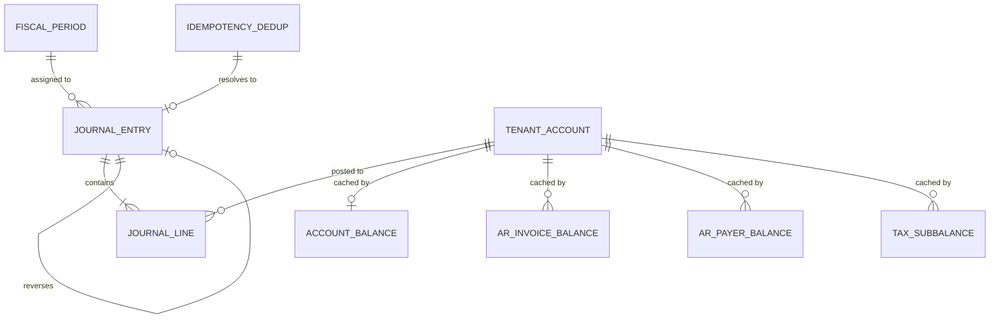
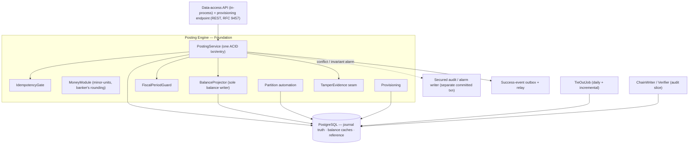
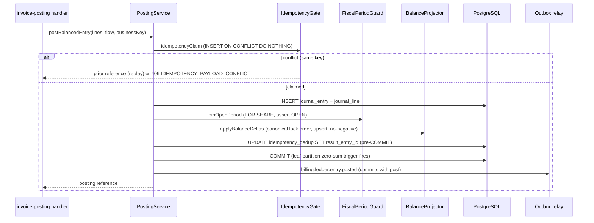

<!-- migration-note: migrated from the legacy Virtuozzo design set to the gears-sdlc design-slice layout (cpt-* sub-IDs). This is the Repository-Foundation (shared double-entry engine); it also carries the naming/glossary-alignment discipline (§4.1) and the three ledger-wide normative statements (§4.2–4.4). Sibling slice designs 01a–07 live in this folder — see README.md for the index. Original preserved unchanged at vhp-architecture docs/bss/design/DESIGN-billing-ledger-balances-202606091200/ (files 00 naming-alignment, 01 repository-foundation). Confluence metadata preserved below. -->
<!-- CONFLUENCE_TITLE: [BSS]: Billing Ledger — Repository-foundation (shared double-entry engine) + Naming Alignment (Design) -->
<!-- Related: PRD.md | Upstream: Rating, Subscriptions, Catalog, Contracts, AMS provisioning | Downstream: ERP/GL, Payments | Owners: @vstudzinskyi (BSS Billing Platform team) -->

# DESIGN — Repository-Foundation (shared double-entry engine) (Slice 1)

- [ ] `p3` - **ID**: `cpt-cf-bss-ledger-design-foundation`

<!-- toc -->

- [1. Architecture Overview](#1-architecture-overview)
  - [1.1 Architectural Vision](#11-architectural-vision)
  - [1.2 Architecture Drivers](#12-architecture-drivers)
  - [1.3 Architecture Layers](#13-architecture-layers)
- [2. Principles and Constraints](#2-principles-and-constraints)
  - [2.1 Design Principles](#21-design-principles)
  - [2.2 Constraints](#22-constraints)
- [3. Technical Architecture](#3-technical-architecture)
  - [3.1 Domain Model](#31-domain-model)
  - [3.2 Component Model](#32-component-model)
  - [3.3 API Contracts](#33-api-contracts)
  - [3.4 Internal Dependencies](#34-internal-dependencies)
  - [3.5 External Dependencies](#35-external-dependencies)
  - [3.6 Interactions and Sequences](#36-interactions-and-sequences)
  - [3.7 Database Schemas and Tables](#37-database-schemas-and-tables)
  - [3.8 Deployment Topology](#38-deployment-topology)
- [4. Additional Context](#4-additional-context)
  - [4.1 Naming, Glossary Discipline and Module Alignment](#41-naming-glossary-discipline-and-module-alignment)
  - [4.2 Foundation Schema Ownership (normative)](#42-foundation-schema-ownership-normative)
  - [4.3 Call-Driven Ingestion Model (normative)](#43-call-driven-ingestion-model-normative)
  - [4.4 Ledger-Ownership Predicate (normative)](#44-ledger-ownership-predicate-normative)
- [5. Traceability](#5-traceability)

<!-- /toc -->

## 1. Architecture Overview

### 1.1 Architectural Vision

The Billing Ledger is a double-entry, AR, ASC 606-compatible posting subledger. It starts **at invoice post** — it never re-rates usage or evaluates tariffs (that is upstream in Rating/Metering) — and it owns the **posted financial subledger** as the system of record for balances, AR, revenue recognition, and the audit/tamper trail feeding ERP/GL export.

The chosen architecture is the **Hybrid append-only journal**: `journal_line` is the immutable single source of truth, balances are an in-transaction **derived cache**, and a daily **tie-out** recomputes the cache from the lines and proves it exactly (zero tolerance). This design document is the **Repository-foundation** — it owns the shared posting engine, the schema, the universal posting invariants, the total lock order, and the in-process data-access API that every handler slice posts through. It owns **no domain policy**: what lines to build, which accounts to target, and what a balance shortfall means all live in a handler feature (invoice-posting, payments-allocation, and the rest), each of which calls this Foundation's API under the invariants defined here.

The whole ledger is **one deployable modular monolith** (`billing-ledger`). Every posting flow must share one ACID transaction, one total lock order, and one `PostingService`; splitting handlers into separate processes would turn in-transaction invariants into distributed transactions, so the handlers are **modules**, not microservices. The same image runs in two runtime roles — `ledger-api` (synchronous posting and reads) and `ledger-workers` (tie-out, chain writer/verifier, ERP-export re-driver, outbox relay, out-of-order queue appliers) — against one PostgreSQL cluster per residency cell.

### 1.2 Architecture Drivers

#### Functional Drivers

| Requirement | Design Response |
|-------------|-----------------|
| `cpt-cf-bss-ledger-fr-balanced-journal-entries` | Deferrable leaf-partition `CONSTRAINT TRIGGER` re-checks `SUM(DR) = SUM(CR)` exactly (zero tolerance) per `(currency, currency_scale)`, `COUNT(line) ≥ 1`, single `payer_tenant_id` at COMMIT; `MoneyModule` residual assignment makes every built entry exact so commit needs no tolerance. |
| `cpt-cf-bss-ledger-fr-posting-immutability` | `journal_entry`/`journal_line` are append-only: `REVOKE UPDATE, DELETE` from the app role plus `BEFORE UPDATE OR DELETE` triggers; corrections only via the line-negation reversal path. |
| `cpt-cf-bss-ledger-fr-reversal-canonical-pattern` | Strict line-negation reversal (side-flip, positive amount); partial `UNIQUE` on `(tenant, reverses_period_id, reverses_entry_id)` enforces at-most-once reversal; reversing a reversal is forbidden (handler-level, `CANNOT_REVERSE_REVERSAL`). |
| `cpt-cf-bss-ledger-fr-idempotency-per-flow` / `cpt-cf-bss-ledger-fr-idempotent-replay-contract` | `idempotency_dedup` PK `(tenant_id, flow, business_id)` is both the at-most-once gate and the replay-response source; `payload_hash` covers only canonical financial content. |
| `cpt-cf-bss-ledger-fr-negative-balance-invariants` | Conditional DB `CHECK` on the guarded class set plus application re-assert on the `RETURNING` value; violation rolls back and pages Revenue Assurance. |
| `cpt-cf-bss-ledger-fr-money-rounding-scale` | Centralized `MoneyModule`: `BIGINT` minor units, banker's (half-to-even) rounding, per-`(tenant, currency)` scale registry, deterministic residual assignment, over-range hard error. |
| `cpt-cf-bss-ledger-fr-tenant-isolation-posting` | SecureORM scopes every query to the caller's tenant (MVP); no-mixed-payer-tenant enforced at commit; no-mixed-legal-entity is structural (`legal_entity_id` on `journal_entry` only). |
| `cpt-cf-bss-ledger-fr-multi-axis-attribution` | `journal_line` carries `payer_tenant_id` / `seller_tenant_id` / `resource_tenant_id` axes; payer resolution runs upstream, the ledger records and enforces the structural invariants. |
| `cpt-cf-bss-ledger-fr-account-classes` | `account_class` enum declared centrally in final form; a class is declared here and activated by its owning handler. |
| `cpt-cf-bss-ledger-fr-account-lifecycle-posting` | GL-account `lifecycle_state` gate (`ACCOUNT_CLOSED`) plus payer-level `payer_state` gate (`PAYER_CLOSED`); closure with open/positive balance requires dual approval and an audit marker. |
| `cpt-cf-bss-ledger-fr-accounting-periods-close` | `FiscalPeriodGuard` pins `fiscal_period FOR SHARE` and asserts `OPEN` inside the post txn; minimal OPEN→CLOSED transition + pre-close gate ship in MVP; full framework in reconciliation-export. |
| `cpt-cf-bss-ledger-fr-audit-retrieval` / `cpt-cf-bss-ledger-fr-immutable-audit-logs` | Who/when/source/correlation retrievable from `journal_entry`; PII lives in the secured audit store keyed on `entry_id` (audit-immutability-observability). |
| `cpt-cf-bss-ledger-fr-ar-tie-out` | Daily `TieOutJob` recomputes every balance grain from `journal_line`, matches exactly, re-checks no-negative and per-entry zero-sum independently, and blocks close on variance/open exceptions. |

#### NFR Allocation

| NFR ID | NFR Summary | Allocated To | Design Response | Verification Approach |
|--------|-------------|--------------|-----------------|-----------------------|
| `cpt-cf-bss-ledger-nfr-posting-performance` | Read p95 ≤ 200 ms; write p95 ≤ 500 ms; ≥ 2,000 invoices/min; ≤ 60 min/100k | `PostingService`, `BalanceProjector`, balance caches | One ACID txn of ~6–12 single-row indexed ops; single indexed cache-row reads (no aggregation); pipelined payer-partitioned workers | Load tests (§3.7 testing); `ar_payer_balance` hot-row ceiling gates commit (B3, Mode S) |
| `cpt-cf-bss-ledger-nfr-availability` | ≥ 99.9% | Deployment topology | Multi-AZ Postgres; no external blocking dependency on the post path (C3) | E2E / operational failover scenario |
| `cpt-cf-bss-ledger-nfr-tamper-evidence-cadence` | Tamper-evidence cadence | `TamperEvidence` seam, ChainWriter/Verifier | Append-only role + triggers; reserved `row_hash`/`prev_hash`; pluggable hash-chain (Mode S in MVP) | See audit-immutability-observability |
| `cpt-cf-bss-ledger-nfr-data-residency` | Data residency | Deployment topology | One PostgreSQL cluster per residency cell; `period_id` range partitioning pins residency | Operational |
| `cpt-cf-bss-ledger-nfr-rto-rpo` | RTO/RPO | Deployment topology | Multi-AZ Postgres with replicas; posting path never leaves the primary | Operational / DR drill |

Status: `cpt-cf-bss-ledger-nfr-posting-performance` targets are **committed as v1 SLOs** (B11, 2026-06-10); only the single-tenant hot-row ceiling (B3) remains an engineering gate — see §3.8.

#### Key ADRs

| ADR ID | Decision Summary |
|--------|------------------|
| `cpt-cf-bss-ledger-adr-book-ownership-predicate` | Only **selling** legal entities (tenant types `platform` + `partner`) own billing books, close periods, and hold an `export_target`; buyer-type tenants are `payer`/`resource` only. |

### 1.3 Architecture Layers

- [ ] `p3` - **ID**: `cpt-cf-bss-ledger-tech-stack`

```text
Handler slices (modules)   invoice-post · payments · adjustments · recognition · fx · audit · recon
        │  (in-process data-access API: postBalancedEntry / applyBalanceDeltas / …)
        ▼
Posting Engine (Foundation) PostingService · IdempotencyGate · MoneyModule · BalanceProjector
                            FiscalPeriodGuard · Partition automation · Provisioning · TamperEvidence seam
        │
        ▼
PostgreSQL                 journal_entry / journal_line (truth) · balance caches · reference data
```

| Layer | Responsibility | Technology |
|-------|----------------|------------|
| Presentation | REST intake behind the inbound API gateway (provisioning endpoint here; handler post/read surfaces in feature docs); RFC 9457 problem responses; OAuth 2.0 | Rust, REST/OpenAPI, inbound API gateway (C4) |
| Application | Handler modules build balanced lines and call the Foundation API; each is a bounded feature | Rust modules in the `billing-ledger` monolith |
| Domain | The Foundation posting engine, invariants, total lock order, money model | Rust; GTS + Rust domain structs |
| Infrastructure | Append-only journal, derived caches, reference tables, outbox, partition automation | PostgreSQL (single primary + replicas), SecureORM |

## 2. Principles and Constraints

### 2.1 Design Principles

#### Hybrid append-only journal

- [ ] `p2` - **ID**: `cpt-cf-bss-ledger-principle-hybrid-append-only-journal`

`journal_line` is the immutable source of truth; balances are a **derived, rebuildable cache**, never authoritative; a daily tie-out proves the cache against the lines. A rebuild reads one MVCC snapshot ordered by a commit-visible total order, writes a shadow table, then atomically swaps, so live reads never observe a half-rebuilt state.


#### One ACID transaction per entry

- [ ] `p2` - **ID**: `cpt-cf-bss-ledger-principle-single-posting-transaction`

`PostingService.post(entry)` executes **one** PostgreSQL transaction at READ COMMITTED. Per-document atomicity is the rollback unit: a failed post leaves no partial posted state. SERIALIZABLE is deliberately avoided (retry storms on the hot path); correctness comes from a total, fixed lock-acquisition order plus DB constraints.

#### Foundation owns the seam, handlers own the behavior

- [ ] `p2` - **ID**: `cpt-cf-bss-ledger-principle-foundation-seam-not-behavior`

The Foundation provides the engine seam (post, project balances, guard invariants) and never a domain behavior. Every domain flow (leg shape, account mapping, recognition timing, FX conversion, refund clearing) lives in a handler feature that posts through the data-access API.

#### BalanceProjector is the sole balance writer

- [ ] `p2` - **ID**: `cpt-cf-bss-ledger-principle-sole-balance-writer`

The projector is the **only** writer of the balance caches and owns the total lock order: a caller hands it a set of deltas and the projector sorts them into the canonical lock key before any upsert, so deadlock-freedom is a property of one module, not a convention. Direct balance-table DML is `REVOKE`d from the app role and asserted by an architecture test, so a new slice physically cannot lock out of order.

#### Naming discipline (one term per idea)

- [ ] `p2` - **ID**: `cpt-cf-bss-ledger-principle-naming-discipline`

One primary term per concept, CI-enforced (§4.1): the posted subledger is `journal_entry`/`journal_line` and MUST NOT be called `LedgerEntry`; `UNALLOCATED` (unallocated cash) MUST NOT be conflated with `REUSABLE_CREDIT`; `SUSPENSE` is mapping-exception parking only; chargeback holds park in `DISPUTE_HOLD`, never `SUSPENSE`/`UNALLOCATED`.

### 2.2 Constraints

#### Tenant isolation via SecureORM (C1)

- [ ] `p2` - **ID**: `cpt-cf-bss-ledger-constraint-secureorm-tenant-isolation`

All multi-tenant tables MUST be tenant-scoped. In MVP this is enforced at the data-access layer via the platform SecureORM (every query scope-bound to the caller's tenant); DB-level PostgreSQL RLS keyed on `current_setting('app.tenant_id')` is the eventual hardening target but is **not** an MVP migration requirement — the shipped migrations declare no `CREATE POLICY`.

**ADRs**: `cpt-cf-bss-ledger-adr-book-ownership-predicate`

#### Backwards-compatible migrations (C2)

- [ ] `p2` - **ID**: `cpt-cf-bss-ledger-constraint-backwards-compatible-migrations`

Schema migrations MUST be backwards compatible; additive columns are allowed. This is why the tamper-evidence columns (`row_hash`/`prev_hash`) are reserved up front (A3) — though adding them later would itself be a permitted additive migration.

#### PostgreSQL is the store, no bus on the posting path (C3)

- [ ] `p2` - **ID**: `cpt-cf-bss-ledger-constraint-postgres-no-bus-on-posting-path`

Single primary + replicas; **no external event store / streaming bus on the posting path**. The success-event outbox relay runs off the posting path (at-least-once, async).


#### API exposure via the inbound API gateway (C4)

- [ ] `p2` - **ID**: `cpt-cf-bss-ledger-constraint-api-gateway-exposure`

API exposure follows the inbound API gateway pattern; REST, JSON, OAuth 2.0, tenant from the authenticated context, versioned under `/v1`.

**Blocker assumptions** (recorded with the PRD's draft direction; each confirmed by PM/Finance): A2 NFR latency/throughput (resolved via B11 — v1 SLOs, only B3 hot-row ceiling open); A3 tamper-evidence mechanism (append-only + reserved hash columns; mechanism owned by audit-immutability-observability); A4 money column type (`BIGINT` minor units, keep BIGINT, high-precision-beyond-headroom currencies out of scope); A6 material-backdating threshold (default 5 business days, range [1..30], no silent clamp).

## 3. Technical Architecture

### 3.1 Domain Model

**Technology**: PostgreSQL tables; GTS + Rust domain structs.

**Core Entities**:

- [ ] `p2` - **ID**: `cpt-cf-bss-ledger-entity-journal`

Truth = `journal_entry` + `journal_line`; `account_balance` / `ar_invoice_balance` / `ar_payer_balance` / `tax_subbalance` / `unallocated_balance` / `reusable_credit_subbalance` are derived caches; the rest is reference data. The Foundation owns these shared core tables; handler slices own their own domain tables (see each feature doc) and never `ALTER` these.



| Entity | Description | Kind |
|--------|-------------|------|
| `journal_entry` | Append-only posted-journal header: `entry_id`, `tenant_id`, `legal_entity_id`, `period_id` (YYYYMM partition key), `entry_currency`, `source_doc_type`, `source_business_id`, `reverses_entry_id`/`reverses_period_id` (reversals only), `posted_at_utc`, `effective_at`, `origin` (SYSTEM\|USER), `posted_by_actor_id` (no PII), `correlation_id`, `rounding_evidence`, `created_seq`, reserved `row_hash`/`prev_hash` (A3). | Truth |
| `journal_line` | Append-only posted line, **sole source of truth**: `line_id`, `entry_id`, `tenant_id`, `period_id`, `payer_tenant_id`, `seller_tenant_id` (nullable), `resource_tenant_id` (nullable, showback), `account_id`, `account_class` (snapshot), `gl_code`, `side` (DR\|CR), `amount_minor` (CHECK > 0), `currency`, `currency_scale`, `invoice_id`, `due_date` (AR lines), `revenue_stream`, `mapping_status` (RESOLVED\|PENDING), `functional_amount_minor`/`functional_currency` (nullable, native), tax dimensions (`tax_jurisdiction`/`tax_filing_period`/`tax_rate_ref`, TAX_PAYABLE lines only), reserved `legal_entity_id`, item traceability (`invoice_item_ref`/`sku_or_plan_ref`/`price_id`/`pricing_snapshot_ref`/`po_allocation_group`), `credit_grant_event_type` (REUSABLE_CREDIT lines only). | Truth |
| `tenant_account` | Chart-of-accounts row: `account_id`, `tenant_id`, `legal_entity_id`, `account_class`, `currency`, `revenue_stream` (nullable), `normal_side` (DR\|CR), `may_go_negative`, `lifecycle_state` (OPEN\|CLOSED — GL-account state only). | Reference |
| `account_balance` | Derived cache per `(tenant, account, currency)`: normal-side-positive `balance_minor`, `account_class`/`normal_side` denormalized, `last_entry_seq`, `version`. | Cache |
| `ar_invoice_balance` | Derived AR grain per `(tenant, payer, account, invoice)`: `balance_minor`, `currency` (denormalized), `original_posted_at`, `due_date` (aging basis — days past due). | Cache |
| `ar_payer_balance` | Derived payer-aggregate AR grain per `(tenant, payer, account, currency)`: `balance_minor`. | Cache |
| `tax_subbalance` | Derived Tax grain per `(tenant, account, jurisdiction, filing-period)`: `balance_minor` (MAY go negative during reversal). | Cache |
| `unallocated_balance` / `reusable_credit_subbalance` | Counter sub-balance caches; carry `functional_balance_minor`/`functional_currency` natively; grain meaning and draw order owned by the activating handler. | Cache |
| `idempotency_dedup` | Business-key at-most-once gate and idempotent-replay source: `(tenant_id, flow, business_id)` PK, `payload_hash`, `result_entry_id` (set pre-COMMIT), `posted_at_utc`, `status`, `retain_until`. | Reference |
| `fiscal_period` | Period state per `(tenant_id, legal_entity_id, period_id)`: `fiscal_tz`, `status` (OPEN\|CLOSED). | Reference |
| `payer_state` | Payer lifecycle per `(tenant_id, payer_tenant_id)`: `lifecycle_state` (OPEN\|CLOSED), `closed_with_open_balance`, `approved_by`, `changed_at`. **Absence = OPEN**. | Reference |
| `currency_scale_registry` | Per-`(tenant, currency)` minor-unit scale: `minor_units`, `source`; ISO-4217 defaults + non-ISO/crypto overrides; scale immutable once a posting exists. | Reference |
| `tenant_posting_lock` | Tenant-termination no-new-post flag per `tenant_id`: `locked`, `reason_code`, set/cleared audit columns. **Absence = not locked**. | Reference |
| `event_outbox` | Success-event outbox written in the post txn: `outbox_id`, `tenant_id`, `event_kind`, `payload` (PII-free), `created_at`, `dispatched_at` (nullable). | Reference |

**Relationships**: `journal_entry` → `journal_line` (contains, 1:N); `journal_entry` → `journal_entry` (reverses, at-most-once); `fiscal_period` → `journal_entry` (assigned to); `tenant_account` → balance caches (cached by). The period link uses the natural key `(tenant_id, legal_entity_id, period_id)` — no surrogate `fiscal_period_id`. Reversal lineage is **not** a DB self-FK (a self-FK on a partitioned table blocks `DETACH`/`DROP PARTITION`); the reversal path validates the original exists instead.

 The `account_class` enum is declared centrally here in FINAL form (full enum in §3.7); a class is activated by the owning handler. None of the declared-only classes are posted by the Foundation itself — it persists whatever balanced lines a handler hands it.

### 3.2 Component Model



#### PostingService

- [ ] `p2` - **ID**: `cpt-cf-bss-ledger-component-posting-service`

**Why it exists**: the single per-entry transaction that all handlers post through, so every flow shares one atomicity boundary, one lock order, and one set of commit-time invariants.

**Responsibility scope**: opens one READ COMMITTED transaction; runs the pre-transaction gates (tenant-termination `tenant_posting_lock` → `TENANT_POSTING_LOCKED`; entry-size bound ≤ 1,000 lines → `LEDGER_ENTRY_TOO_LARGE`); then the normative sequence: (1) idempotency claim (`INSERT... ON CONFLICT DO NOTHING`), (2) build + insert `journal_entry`/`journal_line`, (3) period guard (`fiscal_period FOR SHARE`, assert OPEN), (4) lifecycle asserts (`ACCOUNT_CLOSED`, `PAYER_CLOSED`, `CREDIT_RESIDUAL_UNDISPOSED`) + balance projection in the single deterministic lock order, (5) no-negative guard, (6) finalize dedup (`result_entry_id` pre-COMMIT), (7) COMMIT fires the deferrable leaf-partition constraint trigger. Success events go to the outbox that commits with the post; conflicting-payload captures and invariant alarms are written on a separate committed transaction so they survive an aborting post.

**Responsibility boundaries**: builds no lines and resolves no accounts (handlers do); embeds no domain policy.

**Related components**: `cpt-cf-bss-ledger-component-idempotency-gate`, `cpt-cf-bss-ledger-component-fiscal-period-guard`, `cpt-cf-bss-ledger-component-balance-projector` — calls; `cpt-cf-bss-ledger-component-outbox-relay` — publishes to.

#### IdempotencyGate

- [ ] `p2` - **ID**: `cpt-cf-bss-ledger-component-idempotency-gate`

At-most-once + idempotent-replay (AC #19), sourcing the prior reference from `idempotency_dedup`, never a ledger scan. Replay (same key, matching `payload_hash`) returns the prior reference; conflict (same key, different payload) hard-errors `IDEMPOTENCY_PAYLOAD_CONFLICT` and captures the conflicting payload to the secured store on a separate, bounded-retried, fail-closed transaction. `payload_hash` covers only canonical financial content (business key, `effectiveAt`, per-line resolved mapping inputs / `amount_minor` / `currency` / `side` / `payer_tenant_id` / classification / tax dimensions / item refs, plus tax totals; lines sorted; amounts as minor-unit integers); transport/envelope fields excluded. Replay-under-concurrency: the loser blocks on the in-progress dedup row, then replays (winner commits) or posts (winner aborts). Retention ≈ 7 years for the business-key row.

#### MoneyModule

- [ ] `p2` - **ID**: `cpt-cf-bss-ledger-component-money-module`

Single centralized money implementation so every handler rounds identically. `BIGINT` minor units (A4); scale from the currency-scale registry (ISO-4217 defaults USD/EUR = 2, JPY = 0, BHD = 3, plus tenant non-ISO/crypto overrides); scale **immutable once any posting exists** for `(tenant, currency)` (`CURRENCY_SCALE_LOCKED`). Banker's (half-to-even) rounding by default; tenant override only via audited effective-dated policy; internal compute may carry +4 decimals, never retained. Residual-minor-unit assignment is a pure deterministic function: "last segment" = greatest `(period_id, segment_no)` then canonical-last built line by `(account_class rank, line_id)`; "largest open invoice" tie-broken by `(amount_minor DESC, invoice_id ASC)`. Over-range → `AMOUNT_OUT_OF_RANGE` (AC #16).

#### BalanceProjector

- [ ] `p2` - **ID**: `cpt-cf-bss-ledger-component-balance-projector`

The **sole** writer of the balance caches; owns the §PostingService step-4 total lock order by sorting supplied deltas into the canonical lock key `(table_rank, tenant_id, account_id, currency, payer_tenant_id, invoice_id)` before any upsert. `balance_minor` stored normal-side-positive (`delta = +amount_minor` when `line.side == account.normal_side`, else `-amount_minor`); updates via per-grain `INSERT... ON CONFLICT DO UPDATE... RETURNING`, which creates-on-first-touch and locks atomically (no lost-update / duplicate-key race). Maintains `account_balance` / `ar_invoice_balance` / `ar_payer_balance` / `tax_subbalance` and the counter sub-balances (`applyCounterDelta`, `>= 0` guard + handler-supplied underflow disposition hook). Enforces no-negative on the guarded set at both AR grains and `account_balance`; **Tax payable MAY go negative** (excluded from the aggregate check, guarded at its sub-grain). Role-sign rule: a normal-side-credit class going negative emits a **Warn** alarm (no rollback).

**Related components**: `cpt-cf-bss-ledger-component-posting-service` — invoked by; `cpt-cf-bss-ledger-component-tieout-job` — cross-checked by.

#### FiscalPeriodGuard

- [ ] `p2` - **ID**: `cpt-cf-bss-ledger-component-fiscal-period-guard`

Posting timestamp stored in UTC; period assignment uses the tenant's fiscal-calendar timezone (AC #20). Joins `fiscal_period` by `(tenant_id, legal_entity_id, period_id)` inside the post txn, locks `FOR SHARE`, asserts OPEN (`pinOpenPeriod`). Routine post into a closed period → `PERIOD_CLOSED`; posting an effective date into a closed period requires a formal reopen → re-close under dual control, not a per-posting approval. Clock skew > ±15 min warns, > ±24 h rejects (`CLOCK_SKEW_QUARANTINE`) with re-submission via the material-backdating exception path. Tradeoff: `FOR SHARE` held through COMMIT can let a period close wait on the longest in-flight post; mitigation is close-quiesce/drain, and `ledger_period_close_wait_seconds` is a metric.

#### TieOutJob

- [ ] `p2` - **ID**: `cpt-cf-bss-ledger-component-tieout-job`

The PRD-mandated daily reconciliation (AC #7): recompute **every** balance grain from `journal_line` and compare to the cache — must match **exactly (zero tolerance)**. All-grain recompute catches a credit-class projector sign/delta drift invisible to an AR-only tie-out. Independent per-entry re-check recomputes `SUM(DR) − SUM(CR)` / `COUNT(line)` / `COUNT(DISTINCT payer_tenant_id)` per entry — a separate code path from the commit trigger, catching an entry committed into a partition whose trigger was missing/disabled/buggy. Blocks period close on (a) any nonzero variance, (b) any unresolved `mapping_status = PENDING`, or (c) any per-entry re-check failure. Incremental watermark between daily runs re-projects critical classes (AR, Contract-liability) on a short interval via a visibility-aware `created_seq` watermark.

#### TamperEvidence seam, ChainWriter and Verifier

- [ ] `p2` - **ID**: `cpt-cf-bss-ledger-component-tamper-evidence-seam`

The Foundation asserts the store is append-only and exposes a pluggable tamper-evidence seam (A3): `created_seq` gives append-assignment order; `row_hash`/`prev_hash` are declared and reserved (`bytea NULL`) so a hash-chain attaches later as an additive change. **Caveat**: `created_seq` is monotonic by *assignment*, not commit order, and gaps on rollback — so any advancing `created_seq > N` cursor (ERP export watermark, incremental tie-out) MUST be **visibility-aware** (bounded by `pg_snapshot_xmin(pg_current_snapshot)`); the outbox relay is exempt (drains all visible undispatched rows). The mechanism choice, ChainWriter/Verifier, secured audit store internals, GDPR erasure, and retention are owned by the **audit-immutability-observability** feature; see [features/audit-immutability-observability.md](./02-audit-immutability-observability.md).

#### Partition automation and Provisioning

- [ ] `p2` - **ID**: `cpt-cf-bss-ledger-component-provisioning`

Partition automation attaches the deferrable balance trigger to every new monthly leaf partition; partition creation + trigger attach run in **one DDL transaction**, so a trigger-less leaf partition is unrepresentable. Provisioning (`provisionLegalEntity`, §3.3) seeds a **seller** legal-entity's reference rows (chart of accounts, non-ISO/crypto currency scales, fiscal-calendar config + initial OPEN `fiscal_period` and its partition) in one idempotent, additive transaction; subsequent periods open via internal automation. Only seller legal-entities are provisioned (§4.4); buyer tenants need no setup (`payer_state` absence = OPEN). Provisioning MUST complete before the first post — the ledger only asserts these at post time, never creates reference rows implicitly.

#### Handler slices (post through the Foundation)

Each handler is a module of the monolith that builds balanced lines and calls the data-access API; its domain design and owned tables live in its feature doc.

- [ ] `p2` - **ID**: `cpt-cf-bss-ledger-component-invoice-posting-handler` — invoice-post leg shape (DR AR / CR Revenue + Contract-liability + Tax), account mapping, suspense routing, AR aging, full reversal. See [features/invoice-posting.md](./01a-invoice-posting.md).
- [ ] `p2` - **ID**: `cpt-cf-bss-ledger-component-payments-allocation-handler` — settlement, allocation (Mode A), chargebacks/disputes, wallet. See [features/payments-allocation.md](./03-payments-allocation.md).
- [ ] `p2` - **ID**: `cpt-cf-bss-ledger-component-asc606-recognition-handler` — recognition schedules + recognition runs, ScheduleBuilder. See [features/asc606-recognition.md](./04-asc606-recognition.md).
- [ ] `p2` - **ID**: `cpt-cf-bss-ledger-component-adjustments-notes-refunds-handler` — credit/debit notes, refunds, manual governance. See [features/adjustments-notes-refunds.md](./05-adjustments-notes-refunds.md).
- [ ] `p2` - **ID**: `cpt-cf-bss-ledger-component-fx-multicurrency-handler` — functional currency, realized FX, rate snapshots. See [features/fx-multicurrency.md](./06-fx-multicurrency.md).
- [ ] `p2` - **ID**: `cpt-cf-bss-ledger-component-audit-observability-handler` — tamper chain, freeze, secured store, PII/erasure, alarm catalog. See [features/audit-immutability-observability.md](./02-audit-immutability-observability.md).
- [ ] `p2` - **ID**: `cpt-cf-bss-ledger-component-reconciliation-export-handler` — reconciliations, ERP export, period close gate. See [features/reconciliation-export.md](./07-reconciliation-export.md).

### 3.3 API Contracts

- [ ] `p2` - **ID**: `cpt-cf-bss-ledger-interface-data-access-api`

The Foundation exposes an **in-process data-access API** to handlers; they never touch truth or cache tables directly (enforced by `REVOKE`, §3.7). The only externally-exposed HTTP endpoint is the provisioning seed; the handler-facing post/reverse/read HTTP surfaces are owned by the handler slices and funnel into this API. All money fields are `{ "amountMinor": <integer>, "currency": "USD", "scale": 2 }` — never floats. See PRD interfaces `cpt-cf-bss-ledger-interface-posting-intake` and `cpt-cf-bss-ledger-interface-ledger-inquiry`.

**Data-access API (in-process)**:

| API | Responsibility |
|-----|----------------|
| `postBalancedEntry(lines[], flow, businessKey)` | Single post entry point: opens the ACID transaction, claims idempotency, inserts handler-supplied balanced lines, runs lifecycle/period gates, drives the projector, commits under the leaf-partition zero-sum trigger. Returns the posting reference (or prior reference on replay). |
| `applyBalanceDeltas(deltas[])` | The sole balance writer: sorts deltas into the canonical lock key, upserts each grain, enforces no-negative on the guarded set. |
| Read-then-write ordering — via `SERIALIZABLE`/SSI, no explicit locked-read op | There is **no** distinct read-under-lock-order operation. The whole post runs in one `SERIALIZABLE` transaction; a read-then-write caller is kept correct by Postgres SSI — an overlapping write-write conflict aborts the loser, which retries the whole post — rather than by pre-locking grain rows in a canonical order. Reads take no row lock. |
| `idempotencyClaim(flow, businessId, payloadHash)` | The step-1 at-most-once claim + replay resolution against `idempotency_dedup`. |
| `pinOpenPeriod(tenant, legalEntity)` | The in-transaction `fiscal_period FOR SHARE` + OPEN assertion. |
| `provisionLegalEntity` | Seeds a seller legal-entity's reference rows; idempotent + additive; surfaced over HTTP below. |
| `applyCounterDelta(counterRef, signedDelta)` | Generic signed-delta apply against a counter sub-balance with `>= 0` CHECK + handler-supplied underflow disposition hook. |

- [ ] `p2` - **ID**: `cpt-cf-bss-ledger-interface-provisioning-endpoint`

**Provisioning endpoint** (REST, behind the inbound API gateway):

| Method | Path | Description | Stability |
|--------|------|-------------|-----------|
| `POST` | `/v1/ledger/legal-entities/{legalEntityId}/provisioning` | Seller billing-onboarding: one atomic, idempotent, additive seed — chart of accounts (`lifecycle_state = OPEN`), non-ISO/crypto `currency_scale_registry` rows, fiscal-calendar config + initial `fiscal_period` and its partition. Body `{ accounts[], currencyScales[], fiscalCalendar{timezone, granularity, fyStart} }`; `billing-setup` scope. Idempotent + additive on per-row natural keys. | stable |

**Handler HTTP surfaces** (defined in feature docs, not here): invoice post/reverse and AR aging (invoice-posting); settlement/allocation/chargeback (payments-allocation); credit/debit notes, refunds (adjustments-notes-refunds); recognition runs (asc606-recognition); FX revaluation (fx-multicurrency); audit-pack/erasure/freeze (audit-immutability-observability); reconciliation/export/period-close (reconciliation-export).

**Problem responses (RFC 9457)**: `application/problem+json` with `{ type, title, status, detail, instance, code, tenantId? }`. Engine-invariant `code`s: `LEDGER_ENTRY_UNBALANCED` (422), `LEDGER_ENTRY_EMPTY` (422), `MIXED_PAYER_TENANT` (422), `MISSING_PAYER` (422), `MIXED_LEGAL_ENTITY` (422, reserved), `IDEMPOTENCY_PAYLOAD_CONFLICT` (409), `NEGATIVE_BALANCE_VIOLATION` (409), `PERIOD_CLOSED` (409), `ACCOUNT_CLOSED` (409), `PAYER_CLOSED` (422), `CREDIT_RESIDUAL_UNDISPOSED` (422), `CURRENCY_SCALE_LOCKED` (409), `CLOCK_SKEW_QUARANTINE` (422), `TENANT_POSTING_LOCKED` (409), `LEDGER_ENTRY_TOO_LARGE` (413), `AMOUNT_OUT_OF_RANGE` (422). Domain-specific codes are owned by handler slices.

### 3.4 Internal Dependencies

All inter-gear communication is call-driven (§4.3): upstream modules **call the ledger's REST endpoints**; the ledger consumes no bus and has no inbound consumer/dispatcher.

| Dependency Gear | Interface Used | Purpose |
|-----------------|----------------|---------|
| Billing Orchestration / Invoice | REST call to the invoice-post endpoint | Delivers the materialized posted invoice manifest for posting and the recon control feed |
| Rating / Subscriptions (via adapter) | REST call | The Rating-side adapter maps `ChargeAdjustment` → `POST /credit-notes`; the ledger never re-rates |
| Tax Engine | Inline on the posting request | `TaxBreakdown` carried on the post call (not a separate ingestion) |
| Payments / PSP | REST call | `PaymentSettled` / dispute / settlement-return → payments-allocation endpoints; approved `Refund` → `POST /refunds` |
| AMS / billing-setup | `provisionLegalEntity` / provisioning endpoint | Owns the `tenant ↔ commercial-account ↔ legal-entity` mapping and triggers seller provisioning; owns functional currency |
| Catalog / Contracts | Snapshots carried on posts | `glCode` + tax-category snapshots, PO tags, SSP overrides (consumed, not called back) |

**Dependency rules**: no circular deps; always via versioned contracts / SDK clients; no cross-category sideways deps except through contracts; only integration/adapter gears talk to external systems; `SecurityContext` propagated across all in-process calls.

### 3.5 External Dependencies

| Dependency | Interface Used | Purpose |
|------------|----------------|---------|
| ERP / GL (downstream) | `cpt-cf-bss-ledger-contract-erp-export` — idempotent export | Period-close-gated export of posted entries per selling legal entity (reconciliation-export owns the cursor and export records) |
| PostgreSQL | SecureORM / SQL | The store: append-only journal, derived caches, reference tables, outbox (C3) |

### 3.6 Interactions and Sequences

#### Invoice post through the Foundation

**ID**: `cpt-cf-bss-ledger-seq-post-through-foundation`

**Use cases**: `cpt-cf-bss-ledger-usecase-ledger-inquiry` (balance visibility after post)

**Actors**: `cpt-cf-bss-ledger-actor-billing-orchestration`



#### Idempotent replay under concurrency

**ID**: `cpt-cf-bss-ledger-seq-idempotent-replay`

**Actors**: `cpt-cf-bss-ledger-actor-billing-orchestration`

The loser on a same-`business_id` conflict blocks on the in-progress dedup row; when the winner COMMITs it reads a populated `result_entry_id` and returns the prior reference; when the winner ABORTs, the loser's own `INSERT` succeeds and it takes the post path (not replay).

#### Reversal

**ID**: `cpt-cf-bss-ledger-seq-reversal`

Strict line-negation: side-flipped copy with positive amounts; the partial `UNIQUE` on `(tenant, reverses_period_id, reverses_entry_id)` guarantees at-most-once reversal; reversals post at current effective time. The domain reversal flow is invoice-posting; the Foundation enforces the append-only / line-negation shape.

#### Provisioning seed

**ID**: `cpt-cf-bss-ledger-seq-provisioning-seed`

**Actors**: `cpt-cf-bss-ledger-actor-billing-orchestration`

AMS/billing-setup calls `POST /v1/ledger/legal-entities/{id}/provisioning`; the Foundation seeds chart of accounts, currency scales, fiscal-calendar config, and the initial OPEN period + partition in one transaction; a re-call is additive (existing rows no-op).

#### Tie-out and close gate

**ID**: `cpt-cf-bss-ledger-seq-tieout-close-gate`

**Use cases**: `cpt-cf-bss-ledger-usecase-reconciliation-review`

**Actors**: `cpt-cf-bss-ledger-actor-revenue-assurance`

Daily `TieOutJob` recomputes all grains from `journal_line`, runs the independent per-entry re-check, and blocks period close on any nonzero variance, unresolved `PENDING` mapping, or per-entry failure; variance tickets Revenue Assurance.

### 3.7 Database Schemas and Tables

- [ ] `p3` - **ID**: `cpt-cf-bss-ledger-db-foundation-schema`

> **⚠️ v1 implementation status (design ↔ code reconciliation).** Three DDL-highlights items below are **NOT in v1 — deferred post-v1**, and the code reflects that:
> - **Range partitioning of `journal_entry` / `journal_line`** (by `period_id`) is **deferred**: v1 ships plain (non-partitioned) tables. Consequently the "per-leaf-partition" property of the zero-sum trigger, `DETACH`/`DROP PARTITION` retention pruning, and residency-by-partition are **not** realised in v1 (the zero-sum trigger runs table-level with identical semantics). Requires 7-year-retention / residency drivers to prioritise.
> - **`REVOKE UPDATE, DELETE` on the journal + balance-write `REVOKE` encapsulation** is **deferred**: v1 enforces immutability with the `BEFORE UPDATE OR DELETE` triggers only (and `BalanceProjector` as the sole writer *by convention* + architecture test), **without** the DB-role `REVOKE` layer. A privileged DB role can therefore still bypass at the SQL layer in v1 (noted as residual, §3.9 hot-row block). Adding the `REVOKE` grants is post-v1 hardening.
> - **`event_outbox`** (and the success-event relay) is **deferred** with the parked event layer (no event broker in v1): the outbox table + relay are not built, so success events are not emitted transactionally in v1. See §3.6 / the event-layer parking.
>
> The schema is otherwise stated in its **FINAL** form so handler slices never `ALTER` it — every cross-slice column and guard is **Foundation-owned from the start** (§4.2). Handler-owned tables (`payment_settlement`, `recognition_schedule`, `credit_note`/`debit_note`, `refund`, `rate_snapshot`, `pending_event_queue`, `export_record`, `chain_state`, …) are defined in their feature docs. DDL highlights:

- **Partitioning + composite keys.** *(v1: NOT partitioned — deferred post-v1; see the status note above. The composite keys below ship as designed.)* `journal_entry` / `journal_line` partitioned by `period_id` (YYYYMM range) for 7-year retention, residency pinning, tie-out pruning. PK `journal_entry (tenant_id, period_id, entry_id)`; `journal_line (tenant_id, period_id, line_id)` with `period_id` denormalized; FK `journal_line → journal_entry` on `(tenant_id, period_id, entry_id)`. Period link uses the natural key `(tenant_id, legal_entity_id, period_id)`.
- **Immutability.** *(v1: `BEFORE UPDATE OR DELETE` triggers ship; the `REVOKE` layer is deferred post-v1 — see the status note above.)* `REVOKE UPDATE, DELETE ON journal_entry, journal_line FROM <app_role>` + `BEFORE UPDATE OR DELETE` triggers that `RAISE EXCEPTION`. Corrections only via line-negation reversal.
- **Balance-write encapsulation.** *(v1: `BalanceProjector` is the sole writer by convention + architecture test; the `REVOKE` on direct balance-table DML is deferred post-v1.)* Direct `INSERT`/`UPDATE` on `account_balance`, `ar_invoice_balance`, `ar_payer_balance`, `tax_subbalance`, `unallocated_balance`, `reusable_credit_subbalance` is `REVOKE`d; the only granted write path is `BalanceProjector` (behind `applyBalanceDeltas`/`applyCounterDelta`), which sorts deltas into the total lock order — making the lock order structural.
- **`account_class` enum (declared centrally, activated by the owning handler):** `AR, CASH_CLEARING, UNALLOCATED, REUSABLE_CREDIT, CONTRACT_LIABILITY, REVENUE, TAX_PAYABLE, SUSPENSE, DISPUTE_HOLD, REFUND_CLEARING, CONTRA_REVENUE, GOODWILL, DISPUTE_LOSS_EXPENSE, PSP_FEE_EXPENSE, FX_GAIN_LOSS, FX_UNREALIZED`. The `source_doc_type`/`flow` enums are likewise declared centrally with all handler values: `INVOICE_POST, REVERSAL, MAPPING_CORRECTION, PAYMENT_SETTLE, PAYMENT_ALLOCATE, CHARGEBACK, CREDIT_APPLY, SETTLEMENT_RETURN, MANUAL_ADJUSTMENT, SCHEDULE_BUILD, RECOGNITION, CREDIT_NOTE, DEBIT_NOTE, REFUND, FX_REVALUATION, FX_REVAL_REVERSAL` — so a handler never needs an additive `ALTER TYPE`.
- **Balanced + ≥1-line + single-payer.** `CONSTRAINT TRIGGER... DEFERRABLE INITIALLY DEFERRED` (AFTER INSERT) on **each leaf partition** of `journal_entry` (not the parent). Partition `CREATE TABLE... PARTITION OF` + `CREATE CONSTRAINT TRIGGER` in **one DDL transaction** — a trigger-less leaf partition is unrepresentable. Asserts `SUM(DR) = SUM(CR)` exactly per `(currency, currency_scale)`, `COUNT(line) ≥ 1`, single `payer_tenant_id`; anchoring on the entry row makes the zero-line case fire. Single-legal-entity is structural (`legal_entity_id` on `journal_entry` only); `journal_line.legal_entity_id` reserved nullable.
- **No-negative (conditional) — full guarded set from the start.** `CHECK (account_class NOT IN ('AR','CASH_CLEARING','UNALLOCATED','CONTRACT_LIABILITY','DISPUTE_HOLD','REFUND_CLEARING') OR balance_minor >= 0)` on `account_balance` (incl. `DISPUTE_HOLD` per Slice 2, `REFUND_CLEARING` per Slice 3, now Foundation-owned); `CHECK (balance_minor >= 0)` on `ar_invoice_balance`, `ar_payer_balance`, `unallocated_balance`, `reusable_credit_subbalance`. `tax_subbalance` has **no** aggregate ≥ 0 check (guarded at its grain against the filing window).
- **Amount sign.** `CHECK (amount_minor > 0)` on `journal_line`; relaxed for functional-only lines: `CHECK (amount_minor > 0 OR (amount_minor = 0 AND functional_amount_minor IS NOT NULL))`.
- **(Slice 5, native) Functional-column balance check.** The leaf-partition trigger additionally asserts `SUM(DR functional_amount_minor) = SUM(CR functional_amount_minor)` exactly per `functional_currency` group on entries carrying functional amounts. Conversion policy owned by fx-multicurrency; the Foundation owns the columns + check.
- **Revenue-stream column.** `CHECK (account_class NOT IN ('REVENUE','CONTRACT_LIABILITY') OR revenue_stream IS NOT NULL)` (AC #26).
- **Single-currency-entry seam.** The trigger asserts every `journal_line.currency = entry_currency` unless a functional-only line; per-`(currency, currency_scale)` grouping is the multi-currency-ready seam, relaxed by fx-multicurrency.
- **Idempotency.** `PRIMARY KEY (tenant_id, flow, business_id)` on `idempotency_dedup`; `result_entry_id` populated before COMMIT.
- **CoA uniqueness.** `UNIQUE (tenant_id, legal_entity_id, account_class, currency, COALESCE(revenue_stream,'-'))`.
- **Reversal lineage.** `reverses_period_id` column; partial `UNIQUE (tenant_id, reverses_period_id, reverses_entry_id) WHERE reverses_entry_id IS NOT NULL`. Not a DB self-FK (would block `DETACH`/`DROP PARTITION`).
- **Currency-scale integrity.** Table `currency_scale_registry (tenant_id, currency, minor_units, source)`, PK `(tenant_id, currency)`, RLS-scoped. A non-ISO currency needs a row before its first posting (seeded by AMS provisioning); ISO resolves from defaults. Scale immutable once a posting exists (`CURRENCY_SCALE_LOCKED`).
- **Indexes.** `journal_line (tenant_id, account_id, currency)`; `journal_line (tenant_id, payer_tenant_id, invoice_id)`; `journal_entry (tenant_id, source_doc_type, source_business_id)`; `journal_entry (tenant_id, created_seq)`; `journal_line (tenant_id, invoice_id, invoice_item_ref)`; covering `journal_entry (tenant_id, entry_id) INCLUDE (period_id)`; partial `journal_entry (tenant_id, posted_at_utc, created_seq) WHERE row_hash IS NULL` (chain-writer scan); partial `event_outbox (created_at) WHERE dispatched_at IS NULL` (relay scan).
- **Money.** `amount_minor BIGINT` (A4); over-range guarded before the BIGINT bound; `functional_amount_minor BIGINT` native.
- **Tamper-evidence seam.** `journal_entry.row_hash bytea NULL`, `prev_hash bytea NULL`, `created_seq BIGSERIAL` (A3). PKs UUIDv7 for `entry_id`/`line_id`.
- **Tax dimensions.** `journal_line.tax_jurisdiction`, `tax_filing_period`, `tax_rate_ref` nullable; `CHECK (account_class <> 'TAX_PAYABLE' OR (tax_jurisdiction IS NOT NULL AND tax_filing_period IS NOT NULL))`.
- **Success-event outbox.** *(v1: NOT built — deferred post-v1 with the parked event layer; no event broker in v1, so success events are not emitted transactionally. See the status note above.)* `event_outbox (outbox_id, tenant_id, event_kind, payload jsonb PII-free, created_at, dispatched_at nullable)` written in the post txn; a separate async relay publishes per-tenant FIFO ordered by `created_seq` and stamps `dispatched_at`. Off the posting path (C3 holds).
- **Item traceability.** `journal_line.invoice_item_ref`, `sku_or_plan_ref`, `price_id`, `pricing_snapshot_ref`, `po_allocation_group` nullable; join the Slice 6 canonical hash list.
- **Credit-grant event type.** `journal_line.credit_grant_event_type` — two-sided `CHECK ((account_class = 'REUSABLE_CREDIT') = (credit_grant_event_type IS NOT NULL))`.
- **(Slice 5) Functional-column caches.** `unallocated_balance` and `reusable_credit_subbalance` carry `functional_balance_minor BIGINT` / `functional_currency char` natively.
- **AR aging basis.** `journal_line.due_date` (AR lines) + `ar_invoice_balance.due_date`; aging read computes days-past-due (handler-owned).
- **Payer lifecycle.** `payer_state (tenant_id, payer_tenant_id, lifecycle_state, closed_with_open_balance, approved_by, changed_at)`, PK `(tenant_id, payer_tenant_id)`, RLS-scoped; consulted only by payer-posting flows. **Absence = OPEN**.
- **Tenant posting lock.** `tenant_posting_lock (tenant_id, locked, reason_code, set_by, set_at, cleared_by, cleared_at)`, PK `tenant_id`, RLS-scoped. **Absence = not locked**; set/cleared only by tenant-termination workflow; distinct from the Slice 6 tamper `scope_freeze`.
- **Tenant scoping (C1).** Every table tenant-scoped via SecureORM (MVP); DB-level RLS is the eventual hardening target, not an MVP migration requirement.

**Testing architecture** (per `design-standards.md`, correctness is the value of the ledger): Unit — `MoneyModule` (banker's rounding, ISO-4217 scale, residual determinism, over-range), reversal side-flip, period assignment in tenant fiscal tz. Integration (testcontainers Postgres) — append-only enforcement, deferrable leaf-partition trigger at COMMIT (balanced exact / zero-line rejected / mixed-payer rejected), conditional no-negative across the full guarded set, Tax-payable allowed negative at sub-grain, 1,001-line entry rejected, closed-payer `PAYER_CLOSED` while another flow still posts, `credit_grant_event_type` two-sided CHECK, role-sign Warn alarm, idempotency PK at-most-once, `result_entry_id` pre-commit, RLS isolation, closed-period `FOR SHARE` gate, `TENANT_POSTING_LOCKED`, open-exception blocks close, atomic partition provisioning (forced attach failure leaves no partition), all-grain tie-out catches injected credit-class drift, `CURRENCY_SCALE_LOCKED`, `currency ≠ entry_currency` rejected. API — RFC 9457 mapping per code, replay/conflict with durable audit capture surviving abort, provisioning idempotent + additive, audit-retrieval who/when/source/correlation (AC #8). E2E — provision → post → read → reverse → tie-out with no mocks. Concurrency — same-key posts (exactly one effect), two concurrent reversals (exactly one), first-touch upsert race, post vs period-close, `applyCounterDelta` underflow hook, architecture test that balance tables are mutated only through `BalanceProjector`. **Must NOT be mocked**: PostgreSQL constraints/triggers/RLS, the money type, the idempotency PK.

### 3.8 Deployment Topology

- [ ] `p3` - **ID**: `cpt-cf-bss-ledger-topology-modular-monolith`

One deployable service `billing-ledger` (modular monolith), two runtime roles from the same image: **`ledger-api`** (synchronous posting + reads) and **`ledger-workers`** (TieOutJob, chain writer/Verifier, ERP-export re-driver, outbox relay, out-of-order queue appliers — each singleton-per-scope via advisory locks). One PostgreSQL cluster **per residency cell** (data-residency NFR, Slice 6 G3); read replicas serve inquiry/recon reads; the posting path never leaves the primary. Multi-AZ Postgres backs the availability and RTO/RPO NFRs; there is no external blocking dependency on the post path (C3).

**Known risks / hot-row ceiling (B3).** A single-tenant bill run credits the tenant's Revenue / Contract-liability rows + the `ar_payer_balance` payer-aggregate row on every invoice; the upsert row lock serializes these within a tenant. Revenue and Tax-payable are **shardable** (Revenue's only aggregate control is the Warn-only role-sign rule; Tax is guarded at the sub-grain), merged periodically. **Contract liability is the only truly non-shardable credit singleton** (hard no-negative aggregate gate), but it is inert at the engine level (a hot row only for recognition). So the **only active non-shardable hot row at the engine level is `ar_payer_balance`** — its ceiling MUST be load-tested with **Mode S enabled** before commit (target single-tenant peak 2,000/min). Fallback if below target (designed, unbuilt pending B3): per-worker partial sums on `ar_payer_balance` merged on a short interval, the payer-aggregate no-negative gate moving to the merge step while `ar_invoice_balance` keeps its per-invoice CHECK. Pre-chain immutability is app-level (`REVOKE` + triggers, bypassable by privileged DB roles); narrowed by shipping the Mode S tamper chain in MVP, residual restricted operationally.

## 4. Additional Context

### 4.1 Naming, Glossary Discipline and Module Alignment

This is the canonical owner of naming/glossary discipline (was Slice 8; introduces no runtime component — it is CI-enforced discipline). One primary term per concept; synonyms stay prose-only labels for the **same** account class, never a second mechanism.

| Idea | Primary term (use this) | Synonym (prose only) | Do not |
|------|-------------------------|----------------------|--------|
| ASC deferral / obligation bucket | **Contract liability** (`CONTRACT_LIABILITY`) | "deferred revenue" | use two different accounting meanings for the two phrases |
| Inbound funds not yet on specific invoices | **Unallocated cash** (`UNALLOCATED`) | "unapplied pool", "suspense pool" | call all such balances "customer credit"; post them to `SUSPENSE` |
| Durably on-account / reusable / wallet | **Reusable customer credit** (`REUSABLE_CREDIT`) | "on-account credit" | conflate with Unallocated cash (the split is not optional) |
| Mapping-exception parking | **`SUSPENSE`** account class | — | use it for inbound funds or chargeback holds |
| Chargeback cash hold | **`DISPUTE_HOLD`** account class | "dispute hold" | park the hold in `SUSPENSE` or `UNALLOCATED` |
| Payment-dispute flow family | **dispute** = the case (`dispute_id`); **chargeback** = the posting flow | — | use the two words interchangeably |
| Posted financial subledger entry | **`journal_entry` / `journal_line`** | "the ledger" (prose) | call it `LedgerEntry` |
| Correction shape | **strict line-negation reversal** | — | "storno" / "gross-replace" (ERP-presentation only) |

`REUSABLE_CREDIT` is declared in the base `account_class` enum and **activated by payments-allocation**; later classes (`DISPUTE_HOLD`, `PSP_FEE_EXPENSE`, …) extend the enum additively. Composite `business_id` literals are snake_case (`dispute_id:cycle:phase`, `psp_refund_id:phase`, `invoice_id:correction_id`, `schedule_id:segment_no`) — never camelCase.

**`LedgerEntry` naming resolution (✅ 2026-06-15; removed from manifest 2026-06-16).** The manifest §4.2 `LedgerEntry` entry was an **erroneous/dangling name** (no data model, no events, absent from the Rating PRD) → **removed from the manifest**; the Billing posted subledger is `journal_entry`/`journal_line` and MUST NOT be called `LedgerEntry`. The error-code namespace is separate: `LEDGER_ENTRY_UNBALANCED` / `LEDGER_ENTRY_EMPTY` are error codes, not the resource name, and the naming lint scopes to resource/type names only.

**CI enforcement** (this discipline is enforced by CI, not runtime tests): traceability validation; naming-discipline lint (`LedgerEntry` for a posted entry, "deferred revenue" as a distinct mechanism, "customer credit" for Unallocated cash); suspense lint; composite-id / dispute lint; proof-matrix + decomposition coverage. **Module boundaries**: Usage ≠ Rated ≠ Invoice (distinct stores); Rating is upstream of invoice post (the ledger consumes the posted InvoiceItem + `TaxBreakdown`, never re-rates); customer-facing history is the Invoice/Payment services' SoR; worked-example amounts are illustrative, not normative.

**Two numbering axes (never conflate):** PRD section shorthand S1–S8 (S1 Invoice post · S2 Payment · S3 Credit note · S4 Debit note · S5 Refund · S6 Recognition schedule · S7 = ASC 606 Compliance · S8 = Cross-cutting) vs design slice numbers 1–8 (1 posting-engine-core · 2 payments-allocation · 3 adjustments-notes-refunds · 4 asc606-recognition · 5 fx-multicurrency · 6 audit-immutability-observability · 7 reconciliation-export · 8 naming-alignment). They do **not** line up (PRD S7 = ASC 606 Compliance but design Slice 7 = reconciliation-export; recognition is PRD S6 but design Slice 4).

### 4.2 Foundation Schema Ownership (normative)

**Cross-slice schema mutations are eliminated (full extraction).** The Repository-foundation owns **all shared schema + migrations in full from the start** — the no-negative guarded set (incl. `DISPUTE_HOLD`, `REFUND_CLEARING`), the dual-column commit trigger, the functional cache columns, and the complete `account_class` / `source_doc_type` / `flow` enums. Handler slices own **only their own domain tables** (`payment_settlement`, `recognition_schedule`, `credit/debit_note`, `refund`, `rate_snapshot`, `pending_event_queue`, `export_record`, `chain_state`, …) and **post through the Foundation data-access API** (`postBalancedEntry` / `applyBalanceDeltas` / `applyCounterDelta` / `idempotencyClaim` / `pinOpenPeriod` / `provisionLegalEntity`; read-then-write ordering is handled by `SERIALIZABLE`/SSI, not a locked-read op). There are **no cross-slice `ALTER`s** and no migration-ordering dependency between slices — the only ordering is Foundation-first.

### 4.3 Call-Driven Ingestion Model (normative)

The ledger is **call-driven**, consistent with C3 (no external event store / streaming bus on the posting path) + the inbound API gateway. Upstream facts are delivered by **upstream modules calling the ledger's REST endpoints**; the ledger does **not** consume a bus and has **no inbound consumer/dispatcher**. Where a "Consumed" line names a fact whose natural source is an upstream event, the upstream module (or its own adapter) translates that event into the REST call — the mapping is owned upstream, not in the ledger.

| Consumed fact | Delivered by | Ledger endpoint |
|---|---|---|
| approved `Refund` (phases) | Payments → REST call | `POST /refunds` (adjustments-notes-refunds) |
| `ChargeAdjustment` → credit note | Rating-side adapter maps → REST call | `POST /credit-notes` (adjustments-notes-refunds) |
| `TaxBreakdown` | Tax Engine — inline on the posting request | carried on the post call |
| `PaymentSettled` / dispute / settlement-return | Payments → REST call | payments-allocation |
| issued-invoice manifest | Invoice/Orchestration → control feed | recon feed (reconciliation-export), not a posting source |

Idempotency/ordering use the existing `idempotency_dedup` + per-endpoint business keys; **no** new inbound contract. "Consumed events" in any feature doc means "consumed **facts** delivered via REST calls."

### 4.4 Ledger-Ownership Predicate (normative)

ADR: `cpt-cf-bss-ledger-adr-book-ownership-predicate`. VHP tenants are **typed** (`tenant_type` on the platform `TenantInfo`). **Only selling entities own billing books** (AR / Revenue / Contract liability) and therefore have an `export_target` + period close + functional currency; **buyer-type tenants own no books** — they appear only as `payer` / `resource` on lines.

- The ledger-owner `tenant_id` — the RLS/owner axis, the `export_target` holder, the period-close unit, and the functional-currency carrier — **is a selling legal-entity / commercial-account.**
- The predicate "this tenant owns books" resolves from `tenant_type` (AMS/GTS) + the commercial-account mapping; buyer-types are `payer`/`resource` only.
- **Two distinct hierarchies — do NOT conflate:** the **buyer hierarchy** (org → department) drives payer resolution / AR consolidation; the **seller hierarchy** (platform → partner → reseller) is the book-ownership / subtree-read axis. Different axes on the same tenant tree.
- The `tenant ↔ commercial-account ↔ legal-entity` mapping (1:1 or 1:N) is owned by **AMS / Catalog / billing-setup, not the ledger**; FX (one functional currency per legal entity) hangs off it.
- **Hardening.** The tenant-type catalogue (`vhp-core-am/config/tenant-types.yaml`) defines `platform`, `partner`, `organization` (hierarchy via `x-gts-traits.allowed_parent_types`); there is no `individual` type yet and no `seller`/`buyer` enum. **Predicate:** book-owning **seller** = `platform` + `partner`; **buyer** = `organization` (+ a future `individual`). **Recommended mechanism:** AMS adds an `x-gts-traits.owns_billing_books: true` trait to the `platform`/`partner` type schemas; the ledger reads that trait rather than hardcoding a type list. ⏳ **Pending (AMS):** confirm platform + partner are the intended sellers, then add the trait.


## 5. Traceability

- **PRD**: [PRD.md](../PRD.md)
- **ADR**: [ADR/](../ADR/) — `cpt-cf-bss-ledger-adr-book-ownership-predicate`
- **Index / decomposition**: [README.md](./README.md)
- **Features**: the slice designs `01a`–`07` in this folder
