<!-- migration-note: converted from the legacy Virtuozzo DESIGN slice format to the gears-sdlc design-slice layout (cpt-* sub-IDs, CDSL flows/algos/states). Original preserved unchanged at vhp-architecture: docs/bss/design/DESIGN-billing-ledger-balances-202606091200/02-DESIGN-billing-ledger-audit-immutability-observability-202606091700.md.. -->
<!-- CONFLUENCE_TITLE: [BSS]: Billing Ledger — Audit, Immutability & Observability (Design, Slice 6) -->
<!-- Related: 01-repository-foundation.md (Repository-foundation component model), PRD.md | Upstream: Slices 1-5/7 (emit alarms + posted facts) | Downstream: reconciliation-export (Slice 7), Finance/Audit consumers -->

# DESIGN — Audit, Immutability & Observability (Slice 6)

<!-- toc -->

- [1. Context](#1-context)
  - [1.1 Overview](#11-overview)
  - [1.2 Purpose](#12-purpose)
  - [1.3 Actors](#13-actors)
  - [1.4 References](#14-references)
  - [1.5 Scope Boundaries](#15-scope-boundaries)
  - [1.6 Constraints & Assumptions](#16-constraints--assumptions)
  - [1.7 Design-Introduced Names](#17-design-introduced-names)
- [2. Actor Flows (CDSL)](#2-actor-flows-cdsl)
  - [Verify Tamper Evidence & Freeze Scope](#verify-tamper-evidence--freeze-scope)
  - [Retrieve Audit Trail & Document History](#retrieve-audit-trail--document-history)
  - [Export Audit Pack (Cross-Tenant Elevation)](#export-audit-pack-cross-tenant-elevation)
  - [Apply GDPR Erasure](#apply-gdpr-erasure)
  - [Record Re-Identification](#record-re-identification)
  - [Annotate Entry Metadata (Controlled Non-Financial Change)](#annotate-entry-metadata-controlled-non-financial-change)
- [3. Processes / Business Logic (CDSL)](#3-processes--business-logic-cdsl)
  - [Chain Tip Advance (ChainWriter)](#chain-tip-advance-chainwriter)
  - [Canonical Row Hash](#canonical-row-hash)
  - [Chain Verification (Verifier)](#chain-verification-verifier)
  - [Tamper Freeze Guard](#tamper-freeze-guard)
  - [Cross-Tenant Access Gate](#cross-tenant-access-gate)
  - [Policy Version Guard](#policy-version-guard)
  - [Chain Checkpointing, Rotation & Restore Re-Anchor](#chain-checkpointing-rotation--restore-re-anchor)
- [4. States (CDSL)](#4-states-cdsl)
  - [Scope Freeze State Machine](#scope-freeze-state-machine)
  - [Payer PII Map State Machine](#payer-pii-map-state-machine)
- [5. Definitions of Done](#5-definitions-of-done)
  - [Tamper-Evidence Chain](#tamper-evidence-chain)
  - [Write-Path Freeze](#write-path-freeze)
  - [Secured Audit Store](#secured-audit-store)
  - [Cross-Tenant Elevation Gate](#cross-tenant-elevation-gate)
  - [PII Minimization & Erasure](#pii-minimization--erasure)
  - [Controlled Metadata Annotation](#controlled-metadata-annotation)
  - [Policy-Version Immutability](#policy-version-immutability)
  - [Alarm Catalog Ownership](#alarm-catalog-ownership)
  - [Retention, Archival & Checkpoints](#retention-archival--checkpoints)
- [6. Acceptance Criteria](#6-acceptance-criteria)
- [7. Additional Context](#7-additional-context)
  - [7.1 REST API Surface (feature-owned endpoints)](#71-rest-api-surface-feature-owned-endpoints)
  - [7.2 Problem Responses (RFC 9457)](#72-problem-responses-rfc-9457)
  - [7.3 Events Surface](#73-events-surface)
  - [7.4 Data Model (feature-owned tables)](#74-data-model-feature-owned-tables)
  - [7.5 Alarm Catalog (normative)](#75-alarm-catalog-normative)
  - [7.6 Security & AuthZ](#76-security--authz)
  - [7.7 Feature Metrics](#77-feature-metrics)
  - [7.8 NFR Mapping](#78-nfr-mapping)
  - [7.9 Testing Architecture](#79-testing-architecture)
  - [7.10 Risks, Open Questions & Deferred Work](#710-risks-open-questions--deferred-work)
  - [7.11 Decision Log (Needs Discussion)](#711-decision-log-needs-discussion)
  - [7.12 References](#712-references)

<!-- /toc -->

## 1. Context

### 1.1 Overview

Makes the Billing Ledger **tamper-evident, immutable, auditable, and privacy-compliant**: the posted-journal store carries a verifiable **per-tenant hash chain** with a serialized chain tip; financial facts are append-only with corrections via compensating entries; a hash-chained **secured audit store** holds investigation-grade forensics; PII is minimized on operational surfaces and reconcilable with GDPR erasure; policy/snapshot versions make history reproducible; a chain-verification failure **freezes** the affected write scope; and a single normative **alarm catalog** governs every slice's invariants (PRD § Immutable audit logs, § Cross-cutting requirements; AC #8/#15/#17/#19/#22; manifest §9).

This feature reuses the PRD glossary and **inherits from the Foundation** (see 01-repository-foundation.md §Component Model): append-only journal (REVOKE UPDATE/DELETE + trigger), the reserved tamper-evidence seam (`created_seq` BIGSERIAL, `row_hash`, `prev_hash`), the index `journal_entry(tenant_id, created_seq)`, the **separate-committed** audit/alarm transaction, the total fixed lock order, and the idempotent-replay contract. **This slice owns the cross-cutting governance**: it **activates** the tamper-evidence chain, defines the **secured audit store**, **PII/erasure**, **policy-versioning immutability**, **audit retrieval**, **retention/archival**, and the **full alarm catalog**. Aligns with manifest **§9 Security, Compliance, and Audit**.

**Partition vs chain scope (corrected).** Slice 1 physically **partitions** `journal_entry`/`journal_line` by `period_id` (YYYYMM). The tamper **chain scope is the tenant**, not the partition: the chain is ordered across all of a tenant's period partitions. `created_seq` is a single global BIGSERIAL assigned at INSERT (gaps on rollback) — it is **metadata only**; the authoritative previous-link comes from a serialized per-tenant **chain tip**, never from `created_seq` arithmetic.

**Canonical slice numbering:** 1 posting-engine-core, 2 payments-allocation, 3 adjustments-notes-refunds, 4 asc606-recognition, 5 fx-multicurrency, **6 audit-immutability-observability (this feature)**, 7 reconciliation-export, 8 other.

**Traces to**: `cpt-cf-bss-ledger-fr-immutable-audit-logs`, `cpt-cf-bss-ledger-fr-posting-immutability`, `cpt-cf-bss-ledger-fr-audit-retrieval`, `cpt-cf-bss-ledger-fr-right-to-erasure`, `cpt-cf-bss-ledger-fr-policy-versioning-immutability`, `cpt-cf-bss-ledger-fr-negative-balance-invariants`, `cpt-cf-bss-ledger-fr-idempotent-replay-contract`, `cpt-cf-bss-ledger-fr-manual-adjustment-governance`, `cpt-cf-bss-ledger-fr-tenant-isolation-posting`, `cpt-cf-bss-ledger-nfr-tamper-evidence-cadence`, `cpt-cf-bss-ledger-nfr-data-residency`, `cpt-cf-bss-ledger-nfr-rto-rpo`, `cpt-cf-bss-ledger-nfr-availability`

### 1.2 Purpose

Implements **Slice 6 (audit / immutability / observability)** of the Billing Ledger PRD — the cross-cutting governance layer over Slices 1–5/7: verifiable immutability of posted financial facts (hash chain + freeze), the investigation-grade secured audit store, GDPR-compatible PII handling under ≥7-year retention, reproducible history under policy versioning, and the normative alarm catalog every posting slice emits into.

**Requirements**: `cpt-cf-bss-ledger-fr-immutable-audit-logs`, `cpt-cf-bss-ledger-fr-posting-immutability`, `cpt-cf-bss-ledger-fr-audit-retrieval`, `cpt-cf-bss-ledger-fr-right-to-erasure`, `cpt-cf-bss-ledger-fr-policy-versioning-immutability`, `cpt-cf-bss-ledger-nfr-tamper-evidence-cadence`

**Use cases**: `cpt-cf-bss-ledger-usecase-ledger-inquiry`, `cpt-cf-bss-ledger-usecase-exception-resolution`

### 1.3 Actors

| Actor | Role in Feature |
|-------|-----------------|
| `cpt-cf-bss-ledger-actor-auditor` | Tenant-scoped audit retrieval + document history; audit-pack export; tamper-status review; clears freezes with Architecture; DPO/investigator-scoped erasure and re-identification requests |
| `cpt-cf-bss-ledger-actor-finance-ops` | Controlled non-financial metadata changes (single-control MVP); consumes inquiry drill-downs |
| `cpt-cf-bss-ledger-actor-revenue-assurance` | Receives routed alarms per the catalog (negative-balance, suspense, attribution drift, dormant credit, …) |
| `cpt-cf-bss-ledger-actor-cfo` | Consumer of audit-pack / inquiry outputs for external audit and compliance sign-off |
| `cpt-cf-bss-ledger-actor-erp-gl` | Downstream consumer whose export keys must stay immutable under policy/GL-mapping version changes (AC #15; export generation owned by Slice 7) |

### 1.4 References

- **PRD**: [PRD.md](../PRD.md) — § Immutable audit logs, § Cross-cutting requirements, § Edge cases (right-to-erasure), § Observability — invariant alarms, AC #8/#12/#15/#17/#19/#22; manifest §9
- **Design**: [01-repository-foundation.md](./01-repository-foundation.md) — see 01-repository-foundation.md §Component Model (Foundation append-only journal, tamper seam, separate-committed alarm transaction, outbox relay, tamper chain components)
- **Dependencies**: `invoice-posting` and the other posting slices (they *emit* alarms + posted facts; this feature governs storage/verification/retrieval/freeze); Repository-foundation (engine mechanics)

### 1.5 Scope Boundaries

**In scope**:

- immutable financial store + tamper-evident audit (HIGH)
- journal auditability (system vs user-initiated) + immutability of posted financial facts
- controlled non-financial-metadata change
- secured audit store
- no-direct-PII on operational surfaces
- right-to-erasure vs ≥7-year retention + policy-governed recorded re-identification (AC #22, RD)
- policy-versioning historical immutability incl. export-key immutability (AC #15)
- tenant-scoped audit retrieval + audited elevated cross-tenant access (AC #8)
- negative-balance + idempotent-replay alarms (AC #17/#19) + the full alarm catalog
- tamper-verification-failure alarm + **write-path freeze**
- retention/archival + queryability + chain rotation
- inquiry/audit-pack export with full linkage
- RTO/RPO + geo-redundancy/tenant-data-residency (incl. WORM archive) + tamper-verify cadence NFRs

**Out of scope / Non-goals**:

- **The posting flows themselves** (S1–S6) — Slices 1–5/7 (they *emit* alarms + posted facts; this feature governs storage/verification/retrieval/freeze).
- **Reconciliation / ERP export / export-key generation + period-close orchestration** — Slice 7 (this feature supplies the alarm catalog + audit pack + the export-key-immutability rule it must honor).
- **Platform-wide audit/observability infrastructure** (org SIEM, OTel collectors, central monitoring) — this feature defines the **contract**, not the internals.
- **Engine mechanics** — Slice 1 / Foundation.

**Feature boundary & inputs.** **Consumed:** posted journal entries (to chain + verify); invariant alarms + conflicting-payload captures + manual-adjustment reason/actor (to the secured audit store). **Produced:** chain-verification results + freeze; tenant-scoped audit retrieval + audit pack; erasure tombstones; the normative alarm catalog. Downstream consumers: Finance / Audit (inquiry + audit-pack export), Platform SIEM / OTel / monitoring (contract only), CRM / DPO (PII resolution + erasure).

**Component summary.** The chain tip is advanced **in the post transaction (Mode S — MVP mode, 2026-06-15)**; the async micro-batch `ChainWriter` (**Mode A**) is the **post-MVP** optimization that removes the post-txn chain lock (same seam, no migration); `Verifier` re-walks on cadence; `TamperFreezeGuard` blocks posts to a frozen scope; `SecuredAuditStore` is the RBAC + chained forensic store; `PiiMinimizer` + `ErasureHandler` handle PII; `PolicyVersionGuard` enforces historical immutability; `AlarmCatalog` + Router owns alarm routing; `InquiryService` + `AuditPackExporter` serve Finance/Audit.

### 1.6 Constraints & Assumptions

Inherits Slice 1 C1–C4. Slice-6-specific (defaults; open items → §7.11):

| # | Topic | Assumption (default) | Source |
|---|-------|----------------------|--------|
| G1 | Tamper-evidence mechanism | **Hash-chained** posted journal (per-tenant, serialized chain tip) + **WORM / immutable-object** archival; production MUST be tamper-evident, sandboxes MAY relax. Pluggable per the seam. **✅ Ratified 2026-06-17 (decision 3.A): `H` = SHA-256; WORM = S3 Object Lock (or cloud-equivalent immutable object store).** | PRD |
| G2 | Tamper-verify cadence | **On-write incremental** `prev_hash` linkage check (near-free) **+** periodic full re-walk **+** on-read spot checks. Sampled-only is **non-compliant** as the sole production mechanism. **✅ Ratified 2026-06-16: full re-walk = daily over the entire live chain; ≤ 24 h detection window; global (not per-tenant); archive via signed checkpoints.** | PRD |
| G3 | Data residency / geo-redundancy | **🔮 Deferred post-MVP: tenant data residency is out of MVP scope.** v1 ships a **single installation** — all data lives where the platform is deployed; there is **no** region-pinning and **no** cells. Multi-AZ + RTO/RPO (G5) stay in scope. **Design retained for the post-MVP rollout:** region-pinning of posted journal + secured audit + PII map + WORM/cold archive (no copy crosses the boundary in primary/replica/DR/archive; cross-region replication disabled on the archive), via **regional deployment cells** (one PostgreSQL cluster + workers + archive per boundary, tenant pinned wholly to one cell at onboarding — `period_id` partitioning cannot pin a tenant inside a shared cluster). **Consequence:** a tenant with a hard residency requirement **cannot be onboarded in MVP** (Sales/Legal must know). `period_id` partitioning stays regardless (retention/tie-out, residency-independent). | PRD |
| G4 | Mutable non-financial attributes | A **fixed allow-list** (description/memo, dispute marker, export/recon flags) MAY change **only** via an append-only `metadata_change_log` (current-value view), **never** as updatable columns on journal tables; financial fields **never**. **Ratified 2026-06-10 — closed list of exactly three (§7.11 G4).** (See the `entry_annotation` Variant C remodel note in §7.4.) | PRD |
| G5 | RTO / RPO | RTO ≤ 60 min; RPO ≤ 5 min per region (baseline inherited). | PRD |
| G6 | Retention | ≥ legal/contractual minimum (**default ≥ 7 years**) for journal lines + internal references (not the bound human PII). | PRD |

**Global config artifacts vs cells (G3 corollary).** Platform-level configuration artifacts (statutory registry, R1/R2 value tables, Tax-Engine view matrix, FX provider config) are **globally versioned** and distributed to every cell with a **version watermark**; postings **stamp the consumed version** (extends the Slice 4 `policy_ref` pattern). A cell lagging the watermark is detectable, never a silent behavior change.

### 1.7 Design-Introduced Names

| Name | Meaning |
|------|---------|
| `chain_state` | Per-tenant **chain tip** `(tenant_id, last_row_hash, last_entry_id, last_period_id, last_seq)` — advanced by the ChainWriter (Mode A) or serialized in the post txn (Mode S — MVP reads the tip lockless under **SERIALIZABLE**/SSI; the literal `FOR UPDATE` row lock is deferred until SecureORM exposes a locking read) so each new `row_hash` links the prior committed one linearly; `last_period_id` advances atomically with `last_entry_id`. |
| **Tamper-evidence chain** | `row_hash = H(domain_sep ‖ canonical-financial-fields ‖ prev_hash)`; `prev_hash` = the tenant's `chain_state.last_row_hash`. Default mechanism (pluggable). |
| `scope_freeze` | A flag the Verifier (or manual override) sets on a tenant/scope when chain verification fails; checked **on write** to reject further posts. |
| **Secured audit store** | RBAC-restricted, **hash-chained / WORM** investigation-grade store (manifest §9): forensics, conflicting-payload captures, cross-tenant + re-identification + erasure records, PII where policy requires. |
| **Payer-tenant-id ↔ PII map** | `payer_tenant_id` (the actual journal_line column) → human PII pointer (secured store / CRM); erasure **tombstones** the reverse-lookup. |

## 2. Actor Flows (CDSL)

### Verify Tamper Evidence & Freeze Scope

- [ ] `p1` - **ID**: `cpt-cf-bss-ledger-flow-tamper-verify`

**Actor**: `cpt-cf-bss-ledger-actor-auditor` (responds to the Verifier's finding; the re-walk itself runs on schedule — see `cpt-cf-bss-ledger-algo-chain-verify`)

**Success Scenarios**:
- Daily full re-walk over the entire live chain completes with no mismatch; `billing.ledger.tamper.verified` emitted; tamper-status reflects the latest result
- A verification mismatch sets a `scope_freeze` row, raises the `tamper-verify-failed` alarm (Critical: page Audit + Architecture), and the next in-scope post is rejected

**Error Scenarios**:
- Post attempted against a frozen scope → `TAMPER_VERIFICATION_FAILED` (409 on write; surfaced read-side too)
- Freeze cleared without Audit/Architecture sign-off — not possible: the freeze is **sticky** until cleared, and set/clear each write a `freeze-set-clear` secured-audit record

**Steps**:
1. [ ] - `p1` - Scheduled Verifier: run chain verification per `cpt-cf-bss-ledger-algo-chain-verify` (on-write linkage + daily full re-walk + on-read spot checks; G2) - `inst-tv-run`
2. [ ] - `p1` - **IF** a verification mismatch is found: INSERT a `scope_freeze` row (scope = tenant or tenant+period_id; `set_by = Verifier` or manual) and raise the **tamper-evidence-verification-failure** alarm — **Critical: page Audit + Architecture**; emit `billing.ledger.tamper.failed` - `inst-tv-freeze`
3. [ ] - `p1` - `TamperFreezeGuard` runs inside every post transaction (a `FiscalPeriodGuard`-adjacent step): a post to a frozen scope is rejected with `TAMPER_VERIFICATION_FAILED` per `cpt-cf-bss-ledger-algo-tamper-freeze-guard` - `inst-tv-guard`
4. [ ] - `p1` - Auditor reviews via API: GET /v1/ledger/audit/tamper-status (latest chain-verification result + freeze state per scope; Audit scope, **cross-tenant** endpoint) - `inst-tv-status`
5. [ ] - `p1` - The freeze is **sticky** until Audit/Architecture clears it; clearing records `cleared_by` + `cleared_at` and writes a `freeze-set-clear` secured-audit record in the same transaction - `inst-tv-clear`
6. [ ] - `p1` - **RETURN** verification result; frozen scope remains write-blocked until cleared - `inst-tv-return`

### Retrieve Audit Trail & Document History

- [ ] `p1` - **ID**: `cpt-cf-bss-ledger-flow-audit-retrieval`

**Actor**: `cpt-cf-bss-ledger-actor-auditor`

**Success Scenarios**:
- For a posted entry: **who** (`posted_by_actor_id`/`origin`), **when** (`posted_at_utc`), **source linkage**, **correlation** — retrievable, **tenant-scoped by default** (AC #8)
- One source document's full posting history — linked entries, reversals, notes, allocations, refunds, schedules — aggregated via the existing linkage columns
- `InquiryService` filters by payer/period/account-class/legal-entity and drills **balance → journal entry → source document** (PRD UI § Ledger inquiry)

**Error Scenarios**:
- Cross-tenant read without elevation → `CROSS_TENANT_ACCESS_DENIED` (403)

**Steps**:
1. [ ] - `p1` - API: GET /v1/ledger/audit/journal-entries/{entryId} — audit retrieval: who/when/source/correlation (AC #8); tenant-scoped; takes **no** `tenantId` (tenant from the authenticated context → scope predicate) - `inst-ar-entry`
2. [ ] - `p1` - API: GET /v1/ledger/audit/documents/{sourceDocType}/{sourceBusinessId}/history — one document's posting history: linked entries, reversals, notes, allocations, refunds, schedules; tenant-scoped - `inst-ar-history`
3. [ ] - `p1` - **IF** the read must widen beyond the caller's home tenant: route through `cpt-cf-bss-ledger-algo-cross-tenant-gate` (forensic-gated); routine parent→sub-tenant reads instead use the Respect-subtree widening (no forensic record; §7.6) - `inst-ar-elevation`
4. [ ] - `p1` - **RETURN** 200 audit trail / document history - `inst-ar-return`

### Export Audit Pack (Cross-Tenant Elevation)

- [ ] `p1` - **ID**: `cpt-cf-bss-ledger-flow-audit-pack-export`

**Actor**: `cpt-cf-bss-ledger-actor-auditor`

**Success Scenarios**:
- Audit pack (CSV/PDF) exported asynchronously with the **full linkage chain** for external auditors; `billing.ledger.audit_pack.exported` emitted
- Cross-tenant pack request with valid `target_scope` + `reason` writes the same-txn `cross-tenant-access` record before any foreign row is returned

**Error Scenarios**:
- `target_scope` ≠ home tenant with no `reason` → `MISSING_INVESTIGATION_REASON` (400, pre-read)
- Role not Finance/Audit/DPO → `CROSS_TENANT_ACCESS_DENIED` (403)

**Steps**:
1. [ ] - `p1` - API: POST /v1/ledger/audit/packs (filter → full-linkage CSV/PDF; async; Finance/Audit scope; **cross-tenant** endpoint carrying the elevation contract) - `inst-ap-api`
2. [ ] - `p1` - **IF** `target_scope` ≠ home tenant: execute `cpt-cf-bss-ledger-algo-cross-tenant-gate` (authorize role → require `reason` + `target_scope` pre-read → same-txn `SECURED_AUDIT_RECORD(event_type=cross-tenant-access)` → only then read foreign rows) - `inst-ap-gate`
3. [ ] - `p1` - `AuditPackExporter` assembles the pack with the full linkage chain (balance → journal entry → source document) and exports asynchronously (≤ 15 min target, decision 7) - `inst-ap-assemble`
4. [ ] - `p1` - **RETURN** 202 Accepted (async export); emit `billing.ledger.audit_pack.exported` - `inst-ap-return`

Example — audit pack for a non-home tenant under dispute (snake_case wire):

```http
POST /v1/ledger/audit/packs
X-Investigation-Reason: Dispute #4821 - chargeback review
Content-Type: application/json

{ "target_scope": "0192f7a0-acme-7c1d-9e2b-000000000001",
  "reason_code": "DISPUTE_INVESTIGATION",
  "filter": { "period_id": "202605", "account_class": "AR" } }
```

### Apply GDPR Erasure

- [ ] `p1` - **ID**: `cpt-cf-bss-ledger-flow-pii-erasure`

**Actor**: `cpt-cf-bss-ledger-actor-auditor` (DPO scope)

**Success Scenarios**:
- Journal lines + internal references **remain intact and queryable**; `payer_pii_map` is **tombstoned** (`erased=true`) so `payer_tenant_id → PII` yields a tombstone; the erasure is recorded as a **chained** `SECURED_AUDIT_RECORD(event_type=erasure)` (non-repudiable); the chain **still verifies**

**Error Scenarios**:
- Caller without DPO scope → `CROSS_TENANT_ACCESS_DENIED` (403)
- Missing `reason` / `target_scope` on cross-tenant call → `MISSING_INVESTIGATION_REASON` (400)

**Steps**:
1. [ ] - `p1` - API: POST /v1/ledger/audit/erasure (DPO scope; **cross-tenant** endpoint; journal lines untouched) - `inst-er-api`
2. [ ] - `p1` - DB: UPDATE `payer_pii_map` SET `erased = true` (tombstone) for `(tenant_id, payer_tenant_id)`; the reverse-lookup now yields a tombstone - `inst-er-tombstone`
3. [ ] - `p1` - INSERT chained `SECURED_AUDIT_RECORD(event_type=erasure)` in the same transaction - `inst-er-record`
4. [ ] - `p1` - The tamper chain hashes **only** financial fields + internal refs (PII excluded), so erasure never breaks it; the **≥7-year retention applies to journal lines + references, not the bound PII** (AC #22, RD) - `inst-er-chain-safe`
5. [ ] - `p1` - **RETURN** 200; emit `billing.ledger.erasure.applied` - `inst-er-return`

**PII minimization rules (normative, AC #22).** **Operational surfaces** carry **no direct PII** — the PRD's concrete prohibited fields are **customer name, email, phone, payment-instrument details, street address** (PRD). Internal identifiers only (tenant, `payer_tenant_id`, business-doc ids, correlation id); actor as system/authenticated-user id **without profile attributes**. Posted journal lines reference the **immutable internal `payer_tenant_id`**, never raw PII.

### Record Re-Identification

- [ ] `p1` - **ID**: `cpt-cf-bss-ledger-flow-reidentification`

**Actor**: `cpt-cf-bss-ledger-actor-auditor` (DPO/investigator scope)

**Success Scenarios**:
- Resolving a tombstoned/active `payer_tenant_id` to human PII for an authorized investigation is **policy-governed and recorded** as a `SECURED_AUDIT_RECORD(event_type=re-identification, actor, reason, scope)` — same pattern as cross-tenant access (PRD)

**Error Scenarios**:
- Unauthorized role or missing reason → rejected pre-read (403 / 400)

**Steps**:
1. [ ] - `p1` - API: POST /v1/ledger/audit/reidentify (DPO/investigator scope; **cross-tenant** endpoint carrying the elevation contract) - `inst-ri-api`
2. [ ] - `p1` - Execute `cpt-cf-bss-ledger-algo-cross-tenant-gate` with `event_type = re-identification` — the same-txn audit record is a precondition of the read - `inst-ri-gate`
3. [ ] - `p1` - **RETURN** 200 resolved PII pointer; emit `billing.ledger.reidentification.recorded` - `inst-ri-return`

### Annotate Entry Metadata (Controlled Non-Financial Change)

- [ ] `p1` - **ID**: `cpt-cf-bss-ledger-flow-metadata-annotate`

**Actor**: `cpt-cf-bss-ledger-actor-finance-ops`

**Success Scenarios**:
- An allow-listed non-financial attribute (G4) is changed via the annotation overlay; before/after + actor + reason recorded; journal tables untouched

**Error Scenarios**:
- Field maps to a journal **financial** column → `IMMUTABLE_FINANCIAL_FIELD` (409, rejected **before any DB write**)
- Field not on the G4 allow-list → `ATTRIBUTE_NOT_MUTABLE` (400)

**Steps**:
1. [ ] - `p1` - API: PATCH /v1/ledger/journal-entries/{entryId}/metadata (controlled change to an **allow-listed non-financial** attribute; never financial fields). (Post-remodel the action is renamed `metadata` → `annotate`, surface `PATCH …/annotation`; see §7.4 `entry_annotation`) - `inst-ma-api`
2. [ ] - `p1` - Validate at the **API layer**: **IF** the field maps to a journal **financial** column **RETURN** 409 `IMMUTABLE_FINANCIAL_FIELD` **before any DB write** - `inst-ma-financial`
3. [ ] - `p1` - **IF** the field is not on the G4 allow-list **RETURN** 400 `ATTRIBUTE_NOT_MUTABLE` - `inst-ma-allowlist`
4. [ ] - `p1` - Posted **financial** facts are append-only (Slice 1 REVOKE UPDATE/DELETE + trigger); corrections are compensating/reversal entries only. **Non-financial** metadata is **never** an updatable column on the journal tables — it lives in the annotation overlay (originally an append-only `metadata_change_log` + current-value view; remodeled to `entry_annotation`, §7.4), so the Slice 1 REVOKE stays intact and the **tamper chain does not cover** the mutable-metadata table - `inst-ma-overlay`
5. [ ] - `p1` - Record the change **history** (before/after + actor + reason) in the secured-audit chain as a `metadata-change` record - `inst-ma-history`
6. [ ] - `p1` - **(✅ 2026-06-24, @vstudzinskyi) MVP is single-control:** one actor authorized by the `(entry, metadata)` PEP gate, with the change recorded (actor + reason + before/after); a two-person **dual-control** (requester ≠ approver) is **not enforced in MVP** — the G4 set is a closed, narrow, non-financial allow-list, the log is append-only and reversible by a further edit, and the actor+reason record carries accountability; dual-control is deferred post-MVP pending a Finance requirement (§7.11) - `inst-ma-single-control`
7. [ ] - `p1` - Every posted entry records **system-generated vs user-initiated** (Slice 1 `origin` + `posted_by_actor_id`) - `inst-ma-origin`
8. [ ] - `p1` - **RETURN** 200 updated annotation - `inst-ma-return`

## 3. Processes / Business Logic (CDSL)

### Chain Tip Advance (ChainWriter)

- [ ] `p1` - **ID**: `cpt-cf-bss-ledger-algo-chain-writer`

**Input**: A committing posted journal entry (Mode S) or the set of committed-but-unchained entries (`row_hash IS NULL`, Mode A)

**Output**: Entry sealed into the per-tenant tamper chain (`row_hash`, `prev_hash`, `prev_entry_id`, `prev_period_id`); `chain_state` advanced

**Scope = tenant.** The chain links a tenant's posted entries in **chain-tip acquisition order** (which may differ from `created_seq` order under concurrency / backdating), **across** period partitions (physical partition key = `period_id`; chain key = `tenant_id`).

**(🔄 revised 2026-06-15) Chaining mode — MVP ships synchronous (Mode S); async (Mode A) is the post-MVP optimization.** The per-tenant chain tip can be advanced two ways; **the seam is identical** (`row_hash`/`prev_hash`/`prev_entry_id` + `chain_state`), so Mode A is addable later **without migration**. The 2026-06-15 decision: **MVP = Mode S only**; **Mode A deferred post-MVP**.

**Steps**:
1. [ ] - `p1` - **Mode S — synchronous in-txn tip (MVP mode — 2026-06-15):** serialize `chain_state(tenant_id, last_row_hash, last_entry_id, last_period_id, last_seq)` inside the post transaction — **(impl note, 2026-06-24)** the MVP reads the tip **lockless** and relies on the post's **SERIALIZABLE** isolation (SSI aborts the loser of two concurrent seals, which retries from a fresh tip); the literal `FOR UPDATE` row lock is **deferred** until SecureORM exposes a locking read (`bss-ledger` `ChainStateRepo`) - `inst-cw-mode-s`
2. [ ] - `p1` - Record on the entry: `prev_hash` = the read `last_row_hash`; `(prev_period_id, prev_entry_id)` = the read `(last_period_id, last_entry_id)` (resolvable composite back-pointer — `last_period_id` lives on the tip, so filling the pointer never scans partitions); compute `row_hash` per `cpt-cf-bss-ledger-algo-canonical-hash`; `chain_state` advances on commit. **Zero unchained window** (the chain is complete at commit) - `inst-cw-seal`
3. [ ] - `p1` - **Known cost (accepted for MVP):** the chain-tip row is a **per-tenant hot row** — a per-tenant serializer on top of the Slice 1 credit-side singletons — acquired **last** in the deterministic lock order (after idempotency_dedup → fiscal_period → balance rows → recognition/exposure). **B3 load-test MUST run with Mode S enabled** (with sync-replication lock-hold inflation), load-tested like `ar_payer_balance`; if throughput is insufficient, Mode A is the planned post-MVP remedy - `inst-cw-hot-row`
4. [ ] - `p2` - **Mode A — async micro-batch chain writer (🔮 deferred post-MVP):** removes the per-tenant post-txn serialization: a single per-tenant worker (advisory-locked singleton in `ledger-workers`) reads committed-but-unchained entries (`row_hash IS NULL`) on an MVCC snapshot in the deterministic total order the Foundation defines for cache rebuild (`posted_at_utc`, `created_seq` tiebreak), computes `prev_hash`/`row_hash`/`prev_entry_id` in batches via a narrow `SECURITY DEFINER` chain-writer function (REVOKE UPDATE intact; chain columns set **only from NULL**, never overwritten), and advances `chain_state` atomically. **No lock in the post txn**; trade-off = a bounded committed-but-unchained window with `ledger_chain_lag_seconds` alarming above a threshold. Acceptable because the **primary** immutability control is the Slice 1 REVOKE + trigger (the chain is *evidence*) and `scope_freeze` is unchanged. **Added post-MVP without migration** when Mode S throughput needs it - `inst-cw-mode-a`
5. [ ] - `p1` - In **both** modes the chain is strictly linear (no two entries share a `prev_entry_id`) and **gap-tolerant**: a rolled-back entry never enters the chain, so `created_seq` gaps do not break it (the chain follows the explicit back-pointer, never `created_seq` arithmetic). Tip and back-pointer resolution into the partitioned journal (Verifier restart, pointer fill) uses Slice 1's covering index `journal_entry(tenant_id, entry_id) INCLUDE (period_id)` — never an all-partition scan - `inst-cw-linear`
6. [ ] - `p1` - **RETURN** sealed entry + advanced tip - `inst-cw-return`

### Canonical Row Hash

- [ ] `p1` - **ID**: `cpt-cf-bss-ledger-algo-canonical-hash`

**Input**: A posted journal entry with its lines, the tenant's current `prev_hash`

**Output**: Byte-reproducible `row_hash`

**Canonical hash (byte-reproducible, normative field list):**

```text
row_hash = H(domain_sep ‖ tenant_id ‖ entry_id ‖ period_id ‖ legal_entity_id ‖ entry_currency
  ‖ source_doc_type ‖ source_business_id ‖ reverses_entry_id ‖ reverses_period_id
  ‖ effective_at ‖ posted_at_utc ‖ origin ‖ posted_by_actor_id
  ‖ for-each-line in line_id order(
      account_id, account_class, gl_code /* "account as posted" is financially binding */,
      side, amount_minor, currency, currency_scale, functional_amount_minor, functional_currency,
      payer_tenant_id, seller_tenant_id, resource_tenant_id, invoice_id, revenue_stream,
      tax_jurisdiction, tax_filing_period, tax_rate_ref, ar_status, mapping_status,
      rate_snapshot_ref, credit_grant_event_type, invoice_item_ref, sku_or_plan_ref,
      price_id, pricing_snapshot_ref, po_allocation_group
        /* financially binding tax/AR/mapping/FX-evidence/item-traceability fields */,
      legal_entity_id /* reserved per-line override — always NULL in v1;
        hashed now so the encoding never re-freezes */)
  ‖ prev_hash)
```

**Steps**:
1. [ ] - `p1` - Encode all fields **length-prefixed, fixed integer widths, NULL-safe** (NULL encodes as a distinct marker, never as an empty value) - `inst-ch-encoding`
2. [ ] - `p1` - The field set covers the period assignment (`period_id`), the AC #8 "who" (`origin`, `posted_by_actor_id`), and **all three tenant axes** (payer/seller/resource) - `inst-ch-coverage`
3. [ ] - `p1` - Exclude free-form jsonb and **any PII** from the hashed set (so erasure never breaks the chain) - `inst-ch-pii-excluded`
4. [ ] - `p1` - `H` per G1 (**SHA-256** default, ratified decision 3.A) - `inst-ch-alg`
5. [ ] - `p1` - The byte-reproducibility **test vector MUST be regenerated** for this extended field list before any implementation freezes the encoding - `inst-ch-test-vector`
6. [ ] - `p1` - **RETURN** `row_hash` - `inst-ch-return`

### Chain Verification (Verifier)

- [ ] `p1` - **ID**: `cpt-cf-bss-ledger-algo-chain-verify`

**Input**: `chain_state` tip per tenant; live chain + cold WORM segments (via checkpoints)

**Output**: Verification result; on mismatch → `scope_freeze` + `tamper-verify-failed` alarm

**Steps**:
1. [ ] - `p1` - **On-write incremental check (G2):** in Mode A the continuous linkage check is performed by the chain writer itself (each batch verifies the prior tip before extending) plus the lag alarm; in Mode S it is the on-write `chain_state` read under lock (near-free) - `inst-cv-on-write`
2. [ ] - `p1` - **Periodic full re-walk** (default **daily**, ratified 2026-06-16: entire live chain, genesis → tip, **global** not per-tenant, ≤ 24 h detection window; tampering an old row is only caught by physically re-reading it): the Verifier **re-walks by following the explicit `prev_entry_id` back-pointer** from the `chain_state` tip; `journal_entry(tenant_id, created_seq)` is only a fetch/scan helper, **not** the link order - `inst-cv-rewalk`
3. [ ] - `p1` - **On-read spot checks** complete the cadence; **sampled-only is non-compliant** as the sole production mechanism - `inst-cv-spot`
4. [ ] - `p1` - Cold WORM archive is attested via **signed checkpoints** on demand / within the access SLA (per `cpt-cf-bss-ledger-algo-chain-checkpoint-rotation`) - `inst-cv-archive`
5. [ ] - `p1` - **IF** mismatch: set `scope_freeze`, raise `tamper-verify-failed` (Critical — freeze write path on scope; page Audit + Architecture) per `cpt-cf-bss-ledger-flow-tamper-verify` - `inst-cv-freeze`
6. [ ] - `p1` - **Sandboxes** MAY relax tamper evidence where documented and no customer financial truth is stored - `inst-cv-sandbox`
7. [ ] - `p1` - **RETURN** verification result (surfaced at `GET /v1/ledger/audit/tamper-status`) - `inst-cv-return`

### Tamper Freeze Guard

- [ ] `p1` - **ID**: `cpt-cf-bss-ledger-algo-tamper-freeze-guard`

**Input**: A post transaction (tenant, period)

**Output**: Pass, or rejection with `TAMPER_VERIFICATION_FAILED`

**Steps**:
1. [ ] - `p1` - Inside every post transaction (a `FiscalPeriodGuard`-adjacent step): DB read `scope_freeze` for `(tenant_id, scope, period_id)` — `period_id = 'ALL'` sentinel covers tenant-wide freezes - `inst-fg-check`
2. [ ] - `p1` - **IF** a matching freeze row exists **RETURN** 409 `TAMPER_VERIFICATION_FAILED` (the freeze is sticky until Audit/Architecture clears it) - `inst-fg-reject`
3. [ ] - `p1` - **RETURN** pass (post proceeds) - `inst-fg-pass`

### Cross-Tenant Access Gate

- [ ] `p1` - **ID**: `cpt-cf-bss-ledger-algo-cross-tenant-gate`

**Input**: Request with `target_scope` (bare tenant UUID), `reason` (`X-Investigation-Reason` header + machine-readable `reason_code`), caller role

**Output**: Widened read scope after a same-transaction forensic record, or rejection

**Cross-tenant elevation is gated by the audit write:** the only data-access path that widens the isolation scope MUST, in the **same transaction**, INSERT a `SECURED_AUDIT_RECORD(event_type=cross-tenant-access, actor, reason, scope)` **before** any cross-tenant row is returned; a failed audit write **fails the read**. Enforced in one guarded gateway function, not caller discipline.

**Steps**:
1. [ ] - `p1` - Applies on any request whose `target_scope` ≠ home tenant (the four cross-tenant endpoints: audit packs, tamper-status, erasure, reidentify) - `inst-xt-applies`
2. [ ] - `p1` - Authorize the role (Finance/Audit/DPO) → **ELSE RETURN** 403 `CROSS_TENANT_ACCESS_DENIED` - `inst-xt-role`
3. [ ] - `p1` - Require `reason` + `target_scope` → **ELSE RETURN** 400 `MISSING_INVESTIGATION_REASON`, **before any read** - `inst-xt-reason`
4. [ ] - `p1` - In the **same transaction**, INSERT `SECURED_AUDIT_RECORD(event_type = cross-tenant-access | re-identification, actor, reason, scope)` — a failed insert fails the whole request - `inst-xt-record`
5. [ ] - `p1` - Only then return foreign rows. Mechanically, the gateway widens the scope by `SET LOCAL app.elevated_ids = <target, resolved with BarrierMode::Ignore>` **in the same transaction, after** the `cross-tenant-access` insert succeeds (a failed insert aborts the txn → `elevated_ids` is never set → no foreign row is visible); in the MVP SecureORM model the widening is carried in the compiled `AccessScope` (§7.4). Routine parent→sub-tenant reads instead use `app.subtree_ids` / the Respect-subtree (`BarrierMode::Respect`) and write **no** forensic record - `inst-xt-widen`
6. [ ] - `p1` - This read path acquires **no** `chain_state` lock (it posts no journal entry); the secured store's own chain-tip append (if serialized) is on the **audit-store** chain and creates no deadlock edge with the journal `chain_state` - `inst-xt-no-deadlock`
7. [ ] - `p1` - Increment `ledger_cross_tenant_access_total{reason_code}` - `inst-xt-metric`
8. [ ] - `p1` - **RETURN** the widened, audited read - `inst-xt-return`

**Wire contract.** Each cross-tenant endpoint MUST carry: **`target_scope`** — the **tenant id** being opened (a bare tenant UUID; request-body field for `POST`, query param for `GET /tamper-status`). Distinct from any result `filter`: scope = *whose* ledger is opened; filter = *what* rows to return. The wire contract uses **`snake_case`** (the platform DE0203 override the gear applies), and `target_scope` is the **bare tenant id** — **not** a nested `{ payerTenantId }`. **`reason`** — human text in the **`X-Investigation-Reason`** header **and** a machine-readable **`reason_code`** (feeds `ledger_cross_tenant_access_total{reason_code}`). Ordinary tenant-scoped paths (`journal-entries/{entryId}`, `documents/.../history`, `metadata`) take **no** `tenantId`.

### Policy Version Guard

- [ ] `p1` - **ID**: `cpt-cf-bss-ledger-algo-policy-version-guard`

**Input**: A posting that **references/corrects a prior posting** (`reverses_entry_id`, or a credit/debit note linking a closed-period originating invoice)

**Output**: Enforcement of AC #15 historical-immutability rules

Posted lines are the historical record; never recomputed in place. `PolicyVersionGuard` enforces the **substantive** rule (the pure in-place UPDATE block is already Slice 1's REVOKE). It intercepts the note/refund/recognition/reversal handlers (Slices 3/4).

**Steps**:
1. [ ] - `p1` - **(— split by dimension, aligned with the PRD)** The correction MUST reuse the original posting's pinned **evidence** refs — pricing/SSP snapshots, PO/allocation-group refs - `inst-pv-evidence`
2. [ ] - `p2` - The correction MUST use the policy version **in effect at the note's own posting** for the note's **own processing** — rounding, GL mapping, period assignment - `inst-pv-note-time`
3. [ ] - `p2` - **Tax:** the note's fresh `TaxBreakdown` is computed for the **original** document's **tax date** (rate/jurisdiction actually charged), not the current rate — it reverses/extends the tax that was charged, so a later rate change never alters it - `inst-pv-tax-date`
4. [ ] - `p2` - The recognized-vs-unreleased **split basis and recognition-schedule state are evaluated at the note's own effective time** (Slice 3 §4.2, PRD S3/AC #24) — never the state pinned at the original post **(corrected 2026-06-11, PRD-review)** - `inst-pv-recognition`
5. [ ] - `p1` - Closed-period corrections take the **dual-control / backdating** exception path - `inst-pv-dual-control`
6. [ ] - `p1` - **(— deferred) MVP scope:** the `PolicyVersionGuard` enforces only the **evidence-ref-reuse** half (step 1). The remaining obligations — note-time policy for the note's own processing, tax computed at the **original** document's tax date, and recognition split/schedule state at the **note's** effective time — are owned by the Slice 3/4 note/refund/recognition handlers and are **deferred with them** (not present in MVP); recorded here so AC #15's tax-date and recognition-at-note-time rules are not lost - `inst-pv-mvp-scope`
7. [ ] - `p1` - **Idempotent export keys for completed periods are also immutable** under a policy/GL-mapping version change (AC #15) — a re-export of the same key yields identical business amounts (AC #12, PRD); export-key generation is owned by Slice 7 - `inst-pv-export-key`
8. [ ] - `p1` - **RETURN** pass/reject per the rules above - `inst-pv-return`

### Chain Checkpointing, Rotation & Restore Re-Anchor

- [ ] `p1` - **ID**: `cpt-cf-bss-ledger-algo-chain-checkpoint-rotation`

**Input**: Rotating period partitions (Slice 1 DETACH/DROP for retention); restore events

**Output**: Verifiable chain across rotation/archival/restore; `partition-detach-blocked` alarm on gate violation

**Steps**:
1. [ ] - `p1` - **Retention (G6):** journal lines + internal references kept ≥ legal minimum (default ≥7y) - `inst-cr-retention`
2. [ ] - `p1` - **Archival + rotation:** posted journals remain **queryable**; cold storage allowed if integrity (chain still verifiable) + access SLA are met. To keep the chain verifiable across rotation, store **periodic signed chain checkpoints** over a **chain-contiguous range** — `(tenant_id, from_row_hash, to_row_hash, covered_entry_count)` every N links (`period_id` is a **label only**, since entries from one period can be non-contiguous in chain order under backdating/late posts) - `inst-cr-checkpoints`
3. [ ] - `p1` - A dropped/cold segment is attested via its checkpoint; on retention expiry the checkpoint anchors the remaining live chain so verification does not fail for a missing back-pointer target. Cold segments are reachable by the Verifier within the access SLA - `inst-cr-attest`
4. [ ] - `p1` - **Detach gate (normative):** a period partition MAY be detached only when (a) **every** entry in it has `row_hash` set and (b) every chain range overlapping it is **fully covered by a signed checkpoint and retired**, or **fully live**; otherwise rotation halts and raises `partition-detach-blocked` (§7.5). Slice 1's rotation references this gate - `inst-cr-detach-gate`
5. [ ] - `p1` - **Restore & chain re-anchor:** the cell restore runbook is owned by Slice 7 (deterministic export `transaction_id` from `(tenant, sourceId, source document version)`; export re-enabled only after a mandatory Ledger↔ERP reconciliation). This feature owns the **chain re-anchor**: after any restore, the chain is **re-anchored at the last WORM checkpoint at or before the restore point** — the Verifier treats that checkpoint as the anchor for the restored range, the ChainWriter resumes from the re-anchored tip, and the re-anchor is recorded as a `SECURED_AUDIT_RECORD(event_type=restore-event)` - `inst-cr-restore`
6. [ ] - `p1` - **RETURN** rotation/restore completed with chain verifiability preserved - `inst-cr-return`

## 4. States (CDSL)

### Scope Freeze State Machine

- [ ] `p1` - **ID**: `cpt-cf-bss-ledger-state-scope-freeze`

**States**: UNFROZEN, FROZEN, CLEARED

**Initial State**: UNFROZEN (no `scope_freeze` row for the scope)

**Transitions**:
1. [ ] - `p1` - **FROM** UNFROZEN **TO** FROZEN **WHEN** the Verifier detects a chain-verification mismatch (or a manual override is set): `scope_freeze(tenant_id, scope = tenant | tenant+period_id, period_id ('ALL' sentinel for tenant-wide), reason, frozen_at, set_by)` inserted; `tamper-verify-failed` raised; a `freeze-set-clear` secured-audit record written in the same transaction - `inst-st-frz-set`
2. [ ] - `p1` - **WHILE** FROZEN: `TamperFreezeGuard` rejects every in-scope post with `TAMPER_VERIFICATION_FAILED` (409); the freeze is **sticky** - `inst-st-frz-block`
3. [ ] - `p1` - **FROM** FROZEN **TO** CLEARED **WHEN** Audit/Architecture clears it: `cleared_by` + `cleared_at` recorded; a `freeze-set-clear` secured-audit record written in the same transaction - `inst-st-frz-clear`

### Payer PII Map State Machine

- [ ] `p1` - **ID**: `cpt-cf-bss-ledger-state-pii-map`

**States**: ACTIVE, ERASED

**Initial State**: ACTIVE (`payer_pii_map` row with `erased = false`, mapping `payer_tenant_id → pii_ref`)

**Transitions**:
1. [ ] - `p1` - **FROM** ACTIVE **TO** ERASED **WHEN** a GDPR erasure request is applied (`POST /v1/ledger/audit/erasure`): tombstone `erased = true`; chained `SECURED_AUDIT_RECORD(event_type=erasure)`; journal lines + internal references remain intact and queryable; the chain still verifies - `inst-st-pii-erase`
2. [ ] - `p1` - **FROM** ERASED **TO** (re-identified read) **WHEN** an authorized, policy-governed re-identification resolves the tombstoned id — not a state change on the row; every resolution is recorded as `SECURED_AUDIT_RECORD(event_type=re-identification)` - `inst-st-pii-reid`

## 5. Definitions of Done

### Tamper-Evidence Chain

- [ ] `p1` - **ID**: `cpt-cf-bss-ledger-dod-tamper-chain`

The system **MUST** activate the Slice 1 tamper seam as a per-tenant hash chain: Mode S in-txn tip advance under SERIALIZABLE/SSI (MVP), byte-reproducible SHA-256 canonical hash over the normative field list (NULL-safe, length-prefixed, PII-excluded), strictly linear and gap-tolerant linkage via the `prev_entry_id` back-pointer, with Mode A (async micro-batch writer, only-from-NULL chain columns, `SECURITY DEFINER`) addable post-MVP without migration.

**Implements**:
- `cpt-cf-bss-ledger-algo-chain-writer`
- `cpt-cf-bss-ledger-algo-canonical-hash`

**Touches**:
- DB: `chain_state`, `journal_entry` (`row_hash`, `prev_hash`, `prev_entry_id`, `prev_period_id` — activated seam)
- Entities: `ChainState`, `ChainWriter`

### Write-Path Freeze

- [ ] `p1` - **ID**: `cpt-cf-bss-ledger-dod-tamper-freeze`

The system **MUST** run chain verification per the G2 cadence (on-write linkage + daily global full re-walk + on-read spot checks), set a sticky `scope_freeze` on mismatch, reject in-scope posts with `TAMPER_VERIFICATION_FAILED`, and record freeze set/clear (with `cleared_by`/`cleared_at`) as same-transaction secured-audit records.

**Implements**:
- `cpt-cf-bss-ledger-flow-tamper-verify`
- `cpt-cf-bss-ledger-algo-chain-verify`
- `cpt-cf-bss-ledger-algo-tamper-freeze-guard`
- `cpt-cf-bss-ledger-state-scope-freeze`

**Touches**:
- API: `GET /v1/ledger/audit/tamper-status`
- DB: `scope_freeze`, `chain_state`
- Entities: `Verifier`, `TamperFreezeGuard`

### Secured Audit Store

- [ ] `p1` - **ID**: `cpt-cf-bss-ledger-dod-secured-audit-store`

The system **MUST** provide an RBAC-restricted, itself tamper-evident (own per-tenant hash chain, same construction, or cryptographically signed append entries using platform secret-store keys; included in the G2 verify cadence; WORM/append-only) investigation-grade store holding: conflicting-payload captures (AC #19), manual-adjustment reason/actor, controlled-metadata before/after, cross-tenant access, re-identification, erasure events; plus `account-lifecycle-change` (payer closure incl. the AC #21 closed-with-open-balance marker + dual approval; payer lifecycle owned by Slice 1), `exception-resolution` (`APPROVED_EXCEPTION` transitions with reason + actor, Slice 7), `freeze-set-clear`, `config-change` (tenant policy/config version changes), and `restore-event`. Each such record MUST be written **in the same transaction as the guarded action**. Retention per G6; PII where policy requires.

**Implements**:
- `cpt-cf-bss-ledger-algo-cross-tenant-gate`
- `cpt-cf-bss-ledger-flow-pii-erasure`
- `cpt-cf-bss-ledger-flow-metadata-annotate`

**Touches**:
- DB: `secured_audit_record`
- Entities: `SecuredAuditStore`

### Cross-Tenant Elevation Gate

- [ ] `p1` - **ID**: `cpt-cf-bss-ledger-dod-cross-tenant-elevation`

The system **MUST** keep audit retrieval tenant-scoped by default and gate every cross-tenant widening behind the single guarded gateway: role check (403 `CROSS_TENANT_ACCESS_DENIED`), mandatory `target_scope` + `reason` pre-read (400 `MISSING_INVESTIGATION_REASON`), same-transaction forensic record before any foreign row, snake_case wire contract with bare-tenant-id `target_scope` and `X-Investigation-Reason` + `reason_code`.

**Implements**:
- `cpt-cf-bss-ledger-algo-cross-tenant-gate`
- `cpt-cf-bss-ledger-flow-audit-pack-export`
- `cpt-cf-bss-ledger-flow-reidentification`

**Touches**:
- API: `POST /v1/ledger/audit/packs`, `GET /v1/ledger/audit/tamper-status`, `POST /v1/ledger/audit/erasure`, `POST /v1/ledger/audit/reidentify`
- DB: `secured_audit_record`
- Entities: `AccessScope`, guarded gateway

### PII Minimization & Erasure

- [ ] `p1` - **ID**: `cpt-cf-bss-ledger-dod-pii-erasure`

The system **MUST** keep operational surfaces free of direct PII (prohibited: customer name, email, phone, payment-instrument details, street address; internal identifiers only), reference only the immutable internal `payer_tenant_id` on journal lines, tombstone `payer_pii_map` on GDPR erasure while journal lines + references stay intact, queryable, and chain-verifiable for ≥7 years, and record erasure and policy-governed re-identification as chained secured-audit records.

**Implements**:
- `cpt-cf-bss-ledger-flow-pii-erasure`
- `cpt-cf-bss-ledger-flow-reidentification`
- `cpt-cf-bss-ledger-state-pii-map`

**Touches**:
- API: `POST /v1/ledger/audit/erasure`, `POST /v1/ledger/audit/reidentify`
- DB: `payer_pii_map`, `secured_audit_record`
- Entities: `PiiMinimizer`, `ErasureHandler`

### Controlled Metadata Annotation

- [ ] `p1` - **ID**: `cpt-cf-bss-ledger-dod-metadata-annotation`

The system **MUST** allow changes only to the closed G4 allow-list of non-financial attributes via the annotation overlay (never as updatable journal columns), rejecting financial-field writes pre-write (`IMMUTABLE_FINANCIAL_FIELD`) and non-allow-listed attributes (`ATTRIBUTE_NOT_MUTABLE`), recording before/after + actor + reason in the secured-audit chain, single-control in MVP.

**Implements**:
- `cpt-cf-bss-ledger-flow-metadata-annotate`

**Touches**:
- API: `PATCH /v1/ledger/journal-entries/{entryId}/metadata` (post-remodel: `…/annotation`)
- DB: `entry_annotation`, `secured_audit_record`
- Entities: `EntryAnnotation`

### Policy-Version Immutability

- [ ] `p1` - **ID**: `cpt-cf-bss-ledger-dod-policy-version-guard`

The system **MUST** enforce, for postings that reference/correct prior postings, reuse of the original posting's pinned evidence refs (pricing/SSP snapshots, PO/allocation-group refs) — the MVP half of AC #15 — with note-time policy, original-tax-date tax, and recognition-state-at-note-time deferred to Slices 3/4; export keys for completed periods stay immutable under policy/GL-mapping version changes.

**Implements**:
- `cpt-cf-bss-ledger-algo-policy-version-guard`

**Touches**:
- DB: `journal_entry` / `journal_line` (read; pinned refs), policy/version refs
- Entities: `PolicyVersionGuard`

### Alarm Catalog Ownership

- [ ] `p1` - **ID**: `cpt-cf-bss-ledger-dod-alarm-catalog`

The system **MUST** own the normative alarm catalog (§7.5) — canonical `alarmCategory` tokens, severities, and required behaviors for every slice's invariants — with alarms emitted by the posting slices via the Slice 1 separate-committed audit/alarm transaction and rolled up in `ledger_alarm_total{category,severity}`.

**Implements**:
- `cpt-cf-bss-ledger-flow-tamper-verify`

**Touches**:
- DB: `secured_audit_record` (alarm-linked forensics)
- Entities: `AlarmCatalog`, `AlarmRouter`

### Retention, Archival & Checkpoints

- [ ] `p1` - **ID**: `cpt-cf-bss-ledger-dod-retention-rotation`

The system **MUST** keep journal lines + internal references ≥7 years, keep archived/cold journals queryable and chain-verifiable via periodic signed chain-contiguous checkpoints, enforce the partition-detach gate (raising `partition-detach-blocked` otherwise), and re-anchor the chain at the last WORM checkpoint after any restore, recording a `restore-event`.

**Implements**:
- `cpt-cf-bss-ledger-algo-chain-checkpoint-rotation`

**Touches**:
- DB: `chain_state`, signed chain checkpoints, WORM archive (S3 Object Lock or cloud-equivalent)
- Entities: `ChainCheckpoint`, `Verifier`

## 6. Acceptance Criteria

A **delta over the Foundation testing architecture** (levels + mocking inherited).

- [ ] **Unit:** canonical hash serialization is byte-reproducible (NULL-safe length-prefixed, fixed widths, line order) — the byte-reproducibility test vector regenerated for the extended field list, incl. NULL-safe encoding of the new nullable fields; PII excluded from the hashed field set; G4 allow-list enforcement; PII-on-operational-surface detector against the concrete prohibited-field list
- [ ] **Integration (testcontainers):** **(Mode S — MVP)** posted entry links the tenant chain tip under `chain_state` lock (concurrent commits never share a `prev_hash`; a rolled-back entry leaves no chain gap); **(Mode A — post-MVP)** the micro-batch ChainWriter chains committed entries in the deterministic order, sets chain columns only from NULL, resumes after crash/restart with no gap or double-link, and a breached lag threshold raises `chain-lag`; Verifier detects a tampered row → sets `scope_freeze` → next in-scope post is rejected (`TAMPER_VERIFICATION_FAILED`); a financial-field PATCH is rejected pre-write (`IMMUTABLE_FINANCIAL_FIELD`); an allow-listed metadata change logs before/after without touching journal tables; cross-tenant read denied without elevation, allowed only with a same-txn audit record (and **fails the read if the audit write fails**); GDPR erasure tombstones the PII map while journal lines stay intact + queryable + the chain still verifies; re-identification is recorded; a closed-period correction reuses the original posting's pinned evidence refs (pricing/SSP, PO/allocation) while its own processing uses note-time policy and schedule state at the note's effective time (split, correction; AC #15)
- [ ] **API:** RFC 9457 mapping for each code; audit retrieval returns who/when/source/correlation; audit-pack full linkage; tamper-status + freeze state; a cross-tenant request with `targetScope` ≠ home tenant but no `reason` is rejected **pre-read** with `MISSING_INVESTIGATION_REASON` (400), and a valid elevation writes the same-txn `cross-tenant-access` record before any foreign row is returned
- [ ] **Audit & lineage (PRD obligation):** source-document linkage, tenant-scoped retrieval, erasure tombstone, tamper verification — covered
- [ ] **Concurrency:** **(Mode S — MVP)** chain-tip serialization (the hot row) under concurrent posts; deadlock-free with `chain_state` last in the lock order. **(Mode A — post-MVP)** the advisory-locked writer singleton: two workers never extend the same tenant chain concurrently
- [ ] **What must NOT be mocked:** the append-only REVOKE+trigger, the real hash-chain computation, the **SecureORM tenant-scope predicate** (the MVP isolation control), and the secured-store RBAC — the correctness guarantees
- [ ] **NFR verification (every §7.8 row):** (G1) Verifier detects a tampered row (Integration above); (G2) cadence re-walk + on-write linkage; (G3) residency-pinned storage never crosses the boundary incl. DR **and WORM archive** (post-MVP); (G5) RTO/RPO failover drill; (G6) a journal line + ref survives past `retain_until` and archival keeps the chain verifiable; (Audit-read availability) the API audit-retrieval test against the ratified targets (retrieval p95 ≤ 2 s, inquiry ≤ 5 s, export async ≤ 15 min — decision 7, 2026-06-17)

## 7. Additional Context

### 7.1 REST API Surface (feature-owned endpoints)

REST per `rest-api-design`, behind the inbound API gateway; reads tenant-scoped (scope predicate); cross-tenant requires elevated, audited context. The four endpoints marked *cross-tenant* below carry the **elevation contract** (explicit `targetScope` + mandatory `reason`) defined in the Cross-Tenant Access Gate algo; ordinary tenant-scoped paths take **no** `tenantId` (tenant from the authenticated context → scope predicate).

| Method | Path | Purpose | Notes |
|--------|------|---------|-------|
| `GET` | `/v1/ledger/audit/journal-entries/{entryId}` | Audit retrieval: who/when/source/correlation (AC #8). | tenant-scoped; |
| `GET` | `/v1/ledger/audit/documents/{sourceDocType}/{sourceBusinessId}/history` | One document's posting history: linked entries, reversals, notes, allocations, refunds, schedules. | tenant-scoped |
| `POST` | `/v1/ledger/audit/packs` | Export an audit pack (filter → full-linkage CSV/PDF). | async; Finance/Audit scope · **cross-tenant** |
| `GET` | `/v1/ledger/audit/tamper-status` | Latest chain-verification result + freeze state per scope. | Audit scope · **cross-tenant** |
| `POST` | `/v1/ledger/audit/erasure` | Apply a GDPR erasure (tombstone PII map; chained audit record). | DPO scope; journal lines untouched · **cross-tenant** |
| `POST` | `/v1/ledger/audit/reidentify` | Authorized re-identification (recorded). | DPO/investigator scope · **cross-tenant** |
| `PATCH` | `/v1/ledger/journal-entries/{entryId}/metadata` | Controlled change to an **allow-listed non-financial** attribute (append-only log). | single-control MVP (dual-control deferred); never financial fields; |

### 7.2 Problem Responses (RFC 9457)

`CROSS_TENANT_ACCESS_DENIED` (403), `MISSING_INVESTIGATION_REASON` (400 — cross-tenant elevation without a `reason` / `targetScope`, rejected pre-read), `IMMUTABLE_FINANCIAL_FIELD` (409 — financial field, rejected pre-write) **[NOT emitted in v1 — see note]**, `ATTRIBUTE_NOT_MUTABLE` (400 — not on G4 allow-list) **[NOT emitted in v1 — see note]**, `TAMPER_VERIFICATION_FAILED` (409 on write to a frozen scope; surfaced read-side too).

> **⚠️ v1 status:** `IMMUTABLE_FINANCIAL_FIELD` and `ATTRIBUTE_NOT_MUTABLE` are **not emitted by v1 code** — the Variant-C annotation remodel (§7.4, 2026-06-26) narrowed the PATCH surface to a typed `EntryAnnotationRequestDto` whose sole field is `description`, so a financial-field or non-allow-listed PATCH is **structurally impossible** (it can't be expressed in the request body) rather than validated-and-rejected with these discriminators. A malformed body is a generic 400 body-rejection. These two codes are therefore **retired from the v1 contract**; re-introducing them would require re-widening the annotation DTO, which is not planned. **(✅ 2026-06-24)** `MISSING_INVESTIGATION_REASON` and `ATTRIBUTE_NOT_MUTABLE` are architecturally **422 Unprocessable Entity**, but the platform `CanonicalError` model has **no 422 category**, so both map to **400** (`FailedPrecondition`) carrying their wire code — the **code string is the discriminator** consumers match on, not the status.

### 7.3 Events Surface

This feature **consumes** the `billing.ledger.invariant.alarm` stream (all slices) and routes per the catalog (§7.5). It **emits**: `billing.ledger.tamper.verified` / `billing.ledger.tamper.failed` (→ freeze), `billing.ledger.erasure.applied`, `billing.ledger.reidentification.recorded`, `billing.ledger.audit_pack.exported`. All PII-free on the wire; investigation-grade detail stays in the secured audit store.

**(✅ Ratified 2026-06-24) MVP = dormant (contract-only).** The five payloads (`LedgerTamperVerified`, `LedgerTamperFailed`, `LedgerErasureApplied`, `LedgerReidentificationRecorded`, `LedgerAuditPackExported`) are defined and serde-round-trip-tested so the wire shape is frozen, but **no broker producer is wired** — the gear ships `events_enabled = false` (`module.rs`) because the platform GTS event-type model is incomplete. **Source of truth is unaffected:** every fact already lives in the secured-audit / tamper-evidence chain; these structs are the future relay shape. Consumers MUST NOT subscribe for alerting in MVP — read the audit API. The producer wires when the platform GTS event-type model lands.

### 7.4 Data Model (feature-owned tables)

Activates `journal_entry.row_hash`/`prev_hash`; adds `chain_state`, `scope_freeze`, `secured_audit_record`, `payer_pii_map`, `entry_annotation` (the controlled-annotation overlay; **Variant C remodel** replaced the earlier `metadata_change_log` — see the dedicated bullet below). Tenant-scoped via the **SecureORM scope predicate** (C1); the secured audit store has stricter forensic RBAC. The posted `journal_entry`/`journal_line` stay financial-facts-only; the chain columns + `created_seq` were reserved by Slice 1.

```mermaid
erDiagram
    JOURNAL_ENTRY_CHAIN {
        uuid entry_id "Slice 1 (FK)"
        bigint created_seq "Slice 1; scan helper only"
        bytea row_hash "ACTIVATED"
        bytea prev_hash "ACTIVATED = prior tip row_hash"
        uuid prev_entry_id "resolvable back-pointer"
        string prev_period_id "composite pointer part"
    }
    CHAIN_STATE {
        uuid tenant_id
        bytea last_row_hash "chain tip; Mode S MVP: serialized via SERIALIZABLE/SSI (FOR UPDATE deferred)"
        uuid last_entry_id "tip entry (back-pointer target)"
        string last_period_id "tip entry period; advanced atomically with last_entry_id"
        bigint last_seq
    }
    SCOPE_FREEZE {
        uuid tenant_id
        string scope "tenant | tenant+period_id"
        string period_id "'ALL' sentinel for tenant-wide (NOT NULL)"
        string reason
        timestamptz frozen_at
        string set_by "Verifier | manual"
        string cleared_by
        timestamptz cleared_at
    }
    SECURED_AUDIT_RECORD {
        uuid audit_id
        uuid tenant_id
        string event_type "conflict-capture | metadata-change | cross-tenant-access | manual-adjustment | erasure | re-identification | account-lifecycle-change | exception-resolution | freeze-set-clear | config-change | restore-event | period-reopen"
        string actor_ref
        string reason_code
        jsonb before_after
        uuid correlation_id
        bytea row_hash "own hash chain / signed"
        bytea prev_hash
        timestamptz at_utc
        timestamptz retain_until
    }
    PAYER_PII_MAP {
        uuid tenant_id
        uuid payer_tenant_id "renamed from payer_id - the actual journal_line column"
        string pii_ref
        bool erased "tombstone"
    }
    METADATA_CHANGE_LOG {
        uuid change_id "PK"
        uuid tenant_id "RLS scope"
        uuid target_id "entry/line id"
        string target_period_id "resolves into the partitioned journal"
        string target_kind "ENTRY | LINE"
        string attribute "G4 allow-listed"
        jsonb before_after
        string actor_ref
        timestamptz at_utc
    }
```



Key constraints:

- **Isolation mechanism — SecureORM scope predicate (✅ 2026-06-24, @vstudzinskyi):** MVP tenant isolation for **every** table here (posted journal, `chain_state`, `scope_freeze`, `secured_audit_record`, `payer_pii_map`, `entry_annotation`) is the **application-layer SecureORM scope predicate** — the compiled `AccessScope` bound to the `tenant_id` column (`WHERE tenant_id IN`), the same C1 control Slice 1 applies on every query. The hierarchy / elevation **widening semantics are unchanged** and are carried **in that compiled `AccessScope`**, not in DB session vars: own tenant always visible; the §7.6 resolver widens a routine read to the caller's Respect-subtree (decision 2.B, ACTIVE in MVP); the forensic-gated gateway widens to a cross-barrier target. **Fail-closed:** an unset / failed resolver narrows to own-tenant. Isolation axis = `tenant_id` (operating/owner tenant); `payer/seller/resource` are **descriptive** line axes, never the isolation key. Elsewhere in this doc "RLS" / "widens RLS scope" reads as this SecureORM predicate in MVP.
- **Postgres RLS Variant B — deferred post-MVP defense-in-depth backstop:** the database-kernel backstop is **deferred post-MVP**; when it ships it is **additive** to the SecureORM predicate above (no API/contract change) and takes this shape — an additive, fail-closed policy reading per-request `SET LOCAL` session vars:

  ```sql
  USING (
       tenant_id = current_setting('app.tenant_id')::uuid
    OR tenant_id = ANY (coalesce(string_to_array(current_setting('app.subtree_ids', true), ',')::uuid[], '{}'))
    OR tenant_id = ANY (coalesce(string_to_array(current_setting('app.elevated_ids',  true), ',')::uuid[], '{}'))
  )
  ```

  Own tenant is always visible from `app.tenant_id` (independent of the resolver — own-tenant reads never fail if AuthZ is down). `app.subtree_ids` (Respect subtree, routine, **no** forensic record) and `app.elevated_ids` (Ignore, forensic-gated) only **widen**. All three are **`SET LOCAL`** (transaction-scoped → pool-safe; auto-cleared at commit). Unset optional vars → empty array → no widening (fail-closed: a forgotten var narrows, never leaks). Guardrail: a resolved subtree above the §7.7 threshold raises `subtree-too-large` (switch that tenant to a closure-table predicate, Variant C). This backstop mirrors the MVP SecureORM widening exactly (subtree via `app.subtree_ids`, cross-barrier via `app.elevated_ids`), so activating it post-MVP changes no behavior — it only adds the kernel-level defense-in-depth.
- **Tamper chain:** per-tenant; **(🔄 revised 2026-06-15)** **MVP = Mode S** — `chain_state(tenant_id, last_row_hash, last_entry_id, last_period_id, last_seq)` serialized in the post txn (lock-order rank **last**, after all Slice 1–5 ranks) — **(impl note, 2026-06-24)** the MVP reads the tip **lockless** under **SERIALIZABLE** (SSI aborts the loser; the literal `FOR UPDATE` is **deferred** until SecureORM exposes a locking read); **Mode A** — `chain_state` advanced by an async micro-batch chain writer (no post-txn lock; chain columns written only-from-NULL via a `SECURITY DEFINER` function; `ledger_chain_lag_seconds` alarmed) — **deferred post-MVP** (same seam, no migration). In both: each entry stores `prev_hash` **and** a resolvable `prev_entry_id` (composite `(tenant_id, prev_period_id, prev_entry_id)`); `row_hash` over the canonical field list (NULL-safe length-prefixed, PII-excluded, incl. `gl_code` + the fields); **re-walk follows the `prev_entry_id` back-pointer from the tip** (`journal_entry(tenant_id, created_seq)` is only a scan helper — link order = chain order, not `created_seq`); `last_period_id` advances atomically with `last_entry_id`, and pointer/tip resolution uses Slice 1's covering index `journal_entry(tenant_id, entry_id) INCLUDE (period_id)`; WORM/immutable archival (G1); partition detach gated per the checkpoint/rotation algo.
- `scope_freeze` PK `(tenant_id, scope, period_id)` with `period_id = 'ALL'` (NOT-NULL sentinel) for tenant-wide scope; checked by `TamperFreezeGuard` inside every post txn; sticky until cleared; `cleared_by` + `cleared_at` recorded; set and clear each write a `freeze-set-clear` secured-audit record in the same transaction.
- `secured_audit_record` append-only + **own hash chain / signed** + WORM; PK `audit_id`; indexed `(tenant_id, correlation_id)`, `(tenant_id, event_type, at_utc)`; `retain_until` ≥ G6; event types per the ER diagram above, each written in the same transaction as the guarded action.
- `payer_pii_map` PK `(tenant_id, payer_tenant_id)`; `erased` tombstone; **no PII on `journal_line`**.
- `entry_annotation` — **(controlled-metadata Variant C remodel, 2026-06-26; supersedes the earlier append-only `metadata_change_log` of)** the typed controlled-annotation overlay. **MUTABLE current-state**, upserted in place — PK `(tenant_id, target_id, target_kind (ENTRY|LINE))`, columns `target_period_id`, typed `description` (the sole G4 attribute kept; `dispute_marker` / `export_recon_flag` removed — disputed stays owned by `ledger_dispute` via `dispute × write`, recon is Slice 7), `actor_ref`, `updated_at`. The change **HISTORY** (before/after + actor + reason) lives in the **secured-audit chain** as `metadata-change` records, so this overlay holds **no** append-only log of its own (the old duplicate is gone). `tenant_id` tenant-scoped (C1, SecureORM predicate); **separate** from journal tables (Slice 1 REVOKE intact); **not** covered by the tamper chain; **no** append-only trigger (current-state, unlike the journal / audit chains). Annotation write path acquires **no** balance/fiscal/idempotency lock → no new balance-lock rank. (Action renamed `metadata` → `annotate`; surface `PATCH …/annotation`. Detail: the gear's `…-metadata-remodel-variant-c-design.md`. The controlled-metadata / `metadata_change_log` / `IMMUTABLE_FINANCIAL_FIELD` / `ATTRIBUTE_NOT_MUTABLE` prose elsewhere predates this remodel and reads as this overlay.)
- **Residency (G3) — 🔮 deferred post-MVP:** v1 ships a single installation with **no** region-pinning. **In the post-MVP cell model:** posted journal + secured audit + PII map + **WORM/cold archive** for a residency-pinned tenant are region-pinned (cross-region replication **disabled** on the archive) in primary/replica/DR/archive.

### 7.5 Alarm Catalog (normative)

This feature owns the **normative alarm catalog**; alarms are **emitted by the posting slices** via the Slice 1 separate-committed audit/alarm transaction. Each row lists the canonical `alarmCategory` token(s) (→ the §7.7 `{category}` metric label):

| Alarm (catalog) | `alarmCategory` token(s) | Severity | Required behavior |
|------|------|----------|-------------------|
| Zero-sum violation | `zero-sum` | Critical | Alert + block posts in scope |
| Negative-balance class violation (AC #17) — incl. Slice 2 chargeback negative-Cash (balanced loss line + RA) | `negative-balance`, `chargeback-cash-negative` | Critical (NO) / Warn (bounded) | Route to Revenue Assurance |
| Revenue-role sign violation — normal-side-negative `account_balance` on REVENUE / CONTRA_REVENUE / GOODWILL | `negative-balance` | Warn | Evaluated by the balance projector + TieOutJob (Slice 1); route to Revenue Assurance |
| Recognition double-credit / over-recognition | `recognition-double-credit`, `over-recognition` | Critical | Alert Finance Ops + block schedule |
| FX snapshot — three states | `fx-snapshot-missing` / `fx-snapshot-stale-allowed` / `fx-snapshot-stale-blocked` | Critical(block) / Warn(posts) / Critical(block,422) | Block on missing & stale-blocked; mark stale-allowed |
| Idempotency-key collision (AC #19) | `idempotency-collision` | Critical | Reject conflicting payload, capture both to secured audit, alert |
| Negative tax sub-balance beyond filing window | `negative-tax-subbalance` | Critical | Route to Revenue Assurance |
| Credit-note split blocked (ambiguous) | `credit-note-split-blocked` | Warn → Page | Block split, queue exception |
| Refund quarantined (refund-before-payment) | `refund-quarantined` | Warn → Page | Hold until matched |
| Recognition period queued (out-of-order) | `recognition-period-queued` | Warn → Page | Operator review |
| Reconciliation variance (Slice 7) | `reconciliation-variance` | Warn → Page | Block period close above tolerance |
| Failed export with age (Slice 7) | `export-failed-aged` | Warn → Page | Retry; never drop posted facts |
| Aged allocation / unallocated / refund-clearing / dispute-phase queue | `aged-allocation-queue`, `aged-unallocated`, `refund-clearing-aged`, `dispute-phase-queued` | Warn → Page | Operator review |
| Stage-1 refund without stage-2/reversal | `stage1-refund-orphan` | Warn → Page | Page Revenue Assurance |
| Bill-run partial-failure threshold exceeded | `billrun-partial-failure` | Warn → Page | Pause affected run; operator review |
| Tamper-evidence verification failure | `tamper-verify-failed` | Critical | Freeze write path on scope; page Audit + Architecture |
| Chain lag above threshold — Mode A unchained window **— post-MVP (fires once Mode A ships)** | `chain-lag` | Warn → Page | Investigate the chain writer; unchained > threshold behaves like a verification gap |
| Partition detach blocked by the rotation gate | `partition-detach-blocked` | Warn → Page | Hold rotation until chaining + checkpoint coverage complete |
| Outbox relay publication lag above threshold | `relay-lag` | Warn → Page | Investigate the relay worker; undispatched outbox rows age and downstream consumers starve |
| Clock skew outside window | `clock-skew` | Warn → Page | Apply clock-skew handling |
| Attempted write-off outside scope | `attempted-write-off` | Critical | Reject, capture actor + intended posting, alert RA + Finance Ops |
| Payer-attribution drift, cross-barrier — *detective; preventive write-path guard deferred (Variant C)* — **INACTIVE in MVP** | `payer-attribution-drift` | Warn → Page | **Out-of-band daily sweep** (not the write path): resolves each recent entry's `resource_tenant`'s nearest `self_managed` ancestor-or-self from the platform tenant tree and flags any entry whose recorded `payer_tenant_id` differs (cross-billing-boundary mis-attribution); route to Revenue Assurance. The detective complement to the deferred Variant C guard — closes the "no detective control" gap behind. |
| Open FX AR not revalued at close, Mode B | `fx-revaluation-incomplete` | Critical | Block period close (Slice 7; AC #30/#33); page Revenue Assurance + Finance when open foreign-currency AR has no completed revaluation run for the closing period |
| Dormant credit on an open account | `dormant-open-credit` | Warn → Page | Credit residual (`UNALLOCATED` / `REUSABLE_CREDIT`) with no owner activity beyond the tenant dormancy threshold; route to Finance for a disposition election (unclaimed-property surfacing; escheatment filing deferred post-MVP) |
| Subtree resolution too large **— post-MVP** | `subtree-too-large` | Warn → Page | Caller subtree exceeds the §7.7 GUC guardrail; switch that tenant to a closure-table predicate (Variant C) |
| Subtree resolution degraded **— post-MVP** | `subtree-resolution-degraded` | Warn | AuthZ resolver unavailable; caller fell back to own-tenant only; investigate the resolver |

Exact metric names/thresholds/routing/burn-rate are Design/NFR (per-slice metrics feed this catalog).

**(✅ Ratified 2026-06-24) `payer-attribution-drift` detective sweep — MVP = inactive no-op.** `AttributionSweepJob::run` logs and returns `Ok`; resolving `resource_tenant_id` → nearest `self_managed` ancestor needs the `TenantResolverClient`, not wired into the gear (hermetic-test constraint). No `serve` ticker is scheduled (so the gear never runs a job that can only no-op). **Preventive coverage stands:** `MixedPayer`/`MissingPayer` on the post hot path. Activate (sweep + ticker) when the resolver is wired.

### 7.6 Security & AuthZ

Inherits Slice 1 tenant isolation (C1) — the **SecureORM scope predicate**; the Postgres RLS Variant B backstop is deferred post-MVP (§7.4). The ledger acts as a platform **PEP**: it maps the logical scope property `owner_tenant_id` → `journal_entry.tenant_id`, and for hierarchy-aware reads resolves the caller's visible subtree via the **AuthZ Resolver Plugin** `HierarchyClient` (`BarrierMode::Respect`, cached) into the caller's compiled `AccessScope` (the SecureORM predicate; the `app.subtree_ids` session var is the deferred RLS-backstop carrier) — **no local `tenant_closure` projection**. If the resolver is unavailable, the subtree is left unresolved and the caller sees **only** its own tenant, flagged degraded (`subtree-resolution-degraded`, §7.7). **(decision 2.B)** This is **active in MVP** — the resolver **is** called per request; a parent reads its own Respect-subtree by default. **Role policy:** subtree reads use the caller's existing read/audit RBAC scope widened to the Respect-subtree (no new grant); cross-barrier reads of a self-managed child's ledger still require the forensic elevation (`BarrierMode::Ignore` + forensic record). (§7.11 G7.) The **secured audit store** is a separate forensic RBAC domain; cross-tenant access and re-identification require elevated context **recorded** with actor/reason/scope as a precondition of the read. Erasure is DPO-scoped; controlled-metadata changes are single-control + logged in MVP (dual-control deferred, §7.11); PII never on operational surfaces (concrete prohibited list in the erasure flow). Tamper-chain hash/signing material lives in the platform secret store (manifest §9), not in the ledger.

### 7.7 Feature Metrics

`ledger_tamper_verify_runs_total` / `_failures_total`, `ledger_tamper_chain_length`, `ledger_chain_tip_lock_wait_seconds` (hot-row, Mode S), `ledger_chain_lag_seconds` (Mode A unchained-window age; feeds the `chain-lag` alarm), `ledger_outbox_relay_lag_seconds` (oldest undispatched outbox row age; feeds the `relay-lag` alarm), `ledger_scope_freeze_active` (gauge), `ledger_audit_pack_export_duration_seconds`, `ledger_cross_tenant_access_total{reasonCode}` (— keyed by the elevation `reasonCode`), `ledger_reidentification_total`, `ledger_erasure_applied_total`, `ledger_metadata_change_total{attribute}`, `ledger_alarm_total{category,severity}` (catalog-wide rollup keyed by the §7.5 tokens). `ledger_subtree_size` (resolved subtree cardinality per request; feeds the `subtree-too-large` guardrail) and `ledger_subtree_resolution_degraded_total` (resolver-unavailable own-tenant fallbacks). Thresholds wire to §7.8 + the tamper-failure alarm.

### 7.8 NFR Mapping

NFR rows are keyed by the §1.6 G-IDs (whose PRD sources are listed in §1.6).

| NFR (G-ID) | Mechanism | Status |
|------------|-----------|--------|
| Tamper-evidence in production (G1) | per-tenant hash chain (**SHA-256**) + chain_state tip + WORM archival (**S3 Object Lock** / cloud-equivalent) | ✅ Ratified 2026-06-17 (decision 3.A) |
| Tamper-verify cadence (G2) | on-write linkage + **daily** full re-walk (entire live chain, ≤ 24 h window) + on-read spot checks | ✅ Ratified 2026-06-16 |
| Data residency / geo-redundancy (G3) | region-pinned posted/audit/PII/**archive** (post-MVP, via cells); cross-region replication disabled on archive | 🔮 **Deferred post-MVP** — v1 single installation; multi-AZ + RTO/RPO (G5) still in scope |
| RTO / RPO (G5) | RTO ≤ 60 min; RPO ≤ 5 min per region | Baseline inherited |
| Retention (G6) | ≥ 7y journal lines + refs (not PII); signed rotation checkpoints | G6 default |
| Audit retrieval / availability | audit retrieval (entry / document-history) **p95 ≤ 2 s**; inquiry queries **p95 ≤ 5 s**; audit-pack export **async, ≤ 15 min** | ✅ Design default set 2026-06-17 (decision 7); PM to confirm before GA |

### 7.9 Testing Architecture

A **delta over the Foundation testing architecture** (levels + mocking inherited). The concrete test matrix — Unit / Integration / API / Audit & lineage / Concurrency / must-not-mock / NFR verification — is captured as the checklist in [6. Acceptance Criteria](#6-acceptance-criteria).

### 7.10 Risks, Open Questions & Deferred Work

- **G2 cadence — ✅ ratified 2026-06-16** (daily, global, ≤ 24 h). **G3 residency — 🔮 deferred post-MVP:** v1 is a single installation with no region-pinning; the mechanism (cells, region-pinning incl. archive) is designed and parked for the post-MVP rollout, so this is no longer a launch-blocking NFR.
- **(🔄 2026-06-15)** **Chain-tip hot row is the MVP contention point** — MVP ships **Mode S** (in-txn tip), a per-tenant serializer; **B3 load-test MUST run with Mode S enabled**, alongside `ar_payer_balance`, including sync-replication lock-hold inflation. **Mode A (post-MVP)** removes the chain lock and shifts the risk to bounded, alarmed **chain lag**; it is the planned remedy if Mode S throughput is insufficient.
- **Tamper mechanism (G1)** — **✅ ratified 2026-06-17 (decision 3.A): SHA-256 + S3 Object Lock** (cloud-equivalent immutable object store). The G4 mutable-attribute list is **ratified 2026-06-10** (closed list of three, §7.11 G4).
- **Audit-read/inquiry/export availability** — **✅ design default set 2026-06-17 (decision 7):** retrieval p95 ≤ 2 s, inquiry p95 ≤ 5 s, export async ≤ 15 min; PM to confirm before GA (§7.8/§7.11).
- **(decision 2.B) Tenant-hierarchy reads ACTIVE in MVP** — Variant B resolver called per request; adds a read-path dependency on the AuthZ Resolver Plugin; narrows PRD (Product to be notified).
- **Isolation mechanism ratified 2026-06-24:** MVP tenant isolation is the **application-layer SecureORM scope predicate** (the control the gear actually implements). **Postgres RLS Variant B** (the database-kernel defense-in-depth backstop) is **deferred post-MVP** — additive when it ships, no contract change. The ADR is unchanged; this records the MVP mechanism + the parked backstop as a tracked follow-up.
- **Controlled-metadata single-control ratified 2026-06-24:** MVP controlled-metadata PATCH is single-control (one PEP-authorized actor, recorded); two-person dual-control is deferred post-MVP pending a Finance requirement. Signs off the implementation's single-control behavior.
- **AC #15 note-time/tax/recognition obligations deferred 2026-06-24:** the `PolicyVersionGuard` enforces only the evidence-ref-reuse half; the note-time-policy, tax-at-original-tax-date, and recognition-state-at-note-effective-time rules are owned by the Slice 3/4 handlers and are **deferred with those slices** (not present in MVP). Recorded so AC #15 isn't lost.
- **Deferred:** platform SIEM/OTel/monitoring internals (contract only); reconciliation/export alarms catalogued here but owned by Slice 7; export-key generation Slice 7; **Postgres RLS Variant B** kernel backstop (above); **controlled-metadata dual-control** (above); **AC #15 note-time/tax/recognition obligations** (above, Slices 3/4).

### 7.11 Decision Log (Needs Discussion)

Inherits Slice 1 open items. Slice-6-specific:

| Item | Decision (default) | Status | Owner |
|------|--------------------|--------|-------|
| Tamper-evidence mechanism | hash-chain (per-tenant tip) + WORM; pluggable; **SHA-256 + S3 Object Lock (or cloud-equivalent immutable object store)** | ✅ **Ratified 2026-06-17 (@vstudzinskyi, decision 3.A)** | PM + Architecture |
| Chaining mode | **MVP = Mode S only** (synchronous in-txn tip); **Mode A (async micro-batch writer) deferred post-MVP** — same seam (`row_hash`/`prev_hash`/`chain_state`), added later without migration | 🔄 **Revised 2026-06-15** — supersedes the 2026-06-10 "Mode A default". B3 load-test runs **with Mode S enabled** | Architecture + Audit |
| Residency physical model | regional deployment cells (one PG cluster per boundary, tenant pinned at onboarding) | 🔮 **Deferred post-MVP** — cells / per-region clusters / cross-region-archive ban are post-MVP; v1 = single installation. `period_id` partitioning stays (retention/tie-out, residency-independent) | Architecture + DPO |
| Tamper-verify cadence | on-write linkage + daily full re-walk + on-read spot checks; **per-run scope: the entire live chain** (genesis → tip; tampering an old row is only caught by physically re-reading it); cold WORM archive attested via signed checkpoints on demand/SLA | ✅ **Ratified 2026-06-16 (Architecture + Audit): daily, global (not per-tenant), ≤ 24 h detection window** | Architecture + Audit |
| Data residency / regions (incl. WORM archive) | region-pinned all copies; cross-region replication disabled on archive | 🔮 **Deferred post-MVP** — no region-pinning in v1; mechanism kept for the post-MVP cell rollout; a hard-residency tenant can't onboard in MVP | Architecture + DPO |
| Mutable non-financial attribute list | allow-list: description/memo, dispute marker, export/recon flags — **closed list of exactly three**; any extension is a separate Design + Finance decision | ✅ Ratified 2026-06-10 | Design + Finance |
| Audit-read / inquiry / export availability + latency | audit retrieval p95 ≤ 2 s; inquiry p95 ≤ 5 s; export async ≤ 15 min (decision 7) | ✅ Default set 2026-06-17; PM to confirm before GA | PM |
| RTO / RPO | RTO ≤ 60 min; RPO ≤ 5 min | ✅ Baseline inherited | — |
| Retention | default ≥ 7y journal lines + refs (not PII) | ✅ Accepted default | — |
| Tenant-hierarchy reads (subtree RLS) | **ACTIVE in MVP (decision 2.B, 2026-06-17)** — middleware resolves `app.subtree_ids` per request (AuthZ Resolver Plugin, `BarrierMode::Respect`); additive, fail-closed RLS; **no** local `tenant_closure`. A parent reads its own Respect-subtree; cross-barrier reads stay forensic-elevated. Role policy = caller's read/audit RBAC scope widened to the Respect-subtree. Escape hatch to Variant C (closure predicate) for very large subtrees via `subtree-too-large` | ✅ **Activated 2026-06-17** — narrows PRD; **Product to be notified** | Architecture (done) + Product (notify) |
| Tenant-isolation mechanism | **MVP = application-layer SecureORM scope predicate** (`AccessScope` → `WHERE tenant_id IN`) — the control the gear implements. Hierarchy/elevation widening is carried in the compiled `AccessScope` (subtree per §7.6, cross-barrier per the gate); fail-closed to own-tenant. **Postgres RLS Variant B** (kernel backstop) **deferred post-MVP** — additive when it ships, no contract change. ADR unchanged | ✅ **Ratified 2026-06-24** — source uses SecureORM | Architecture |
| Controlled-metadata dual-control | **MVP = single-control** — one actor via the `(entry, metadata)` PEP gate, recorded (actor + reason + before/after) on the append-only log. Two-person **dual-control (requester ≠ approver) deferred post-MVP** pending a Finance requirement. Rationale: closed non-financial G4 allow-list (3 attrs), append-only + edit-reversible, actor+reason accountability — a stateful two-person approval is disproportionate for the MVP surface | ✅ **Ratified 2026-06-24** — signs off the code's single-control deviation; Finance to confirm if dual-control is required for GA | Design + Finance |
| AC #15 note-time/tax/recognition obligations | **Deferred with Slices 3/4.** The `PolicyVersionGuard` enforces only the evidence-ref-reuse half; note-time policy for the note's own processing, tax at the **original** doc's tax date, and recognition split/schedule state at the **note's** effective time are owned by the Slice 3/4 note/refund/recognition handlers (not present in MVP) | 🔮 **Deferred post-MVP** — tracked so AC #15 isn't lost | Slices 3/4 |
| §7.3 event payloads (5) — `LedgerTamperVerified`, `LedgerTamperFailed`, `LedgerErasureApplied`, `LedgerReidentificationRecorded`, `LedgerAuditPackExported` | **MVP = dormant (contract-only).** The five payloads are defined and serde-round-trip-tested so the wire shape is frozen, but **no broker producer is wired** — the gear ships `events_enabled = false` (`module.rs`) because the platform GTS event-type model is incomplete. **Source of truth is unaffected:** every fact already lives in the secured-audit / tamper-evidence chain; these structs are the future relay shape. Consumers MUST NOT subscribe for alerting in MVP — read the audit API | ✅ **Ratified 2026-06-24** — signs off the dormant-seam deferral; producer wires when the platform GTS event-type model lands | Architecture |
| `payer-attribution-drift` detective sweep (§7.5) | **MVP = inactive no-op.** `AttributionSweepJob::run` logs and returns `Ok`; resolving `resource_tenant_id` → nearest `self_managed` ancestor needs the `TenantResolverClient`, not wired into the gear (hermetic-test constraint). No `serve` ticker is scheduled (so the gear never runs a job that can only no-op). **Preventive coverage stands:** `MixedPayer`/`MissingPayer` on the post hot path. The `payer-attribution-drift` alarm route is marked **INACTIVE in MVP** in the alarm catalog | ✅ **Ratified 2026-06-24** — signs off the no-op detective seam; activate (sweep + ticker) when the resolver is wired | Architecture |

### 7.12 References

- **Repository-foundation** (see 01-repository-foundation.md §Component Model) — append-only, tamper seam `created_seq`/`row_hash`/`prev_hash`, `journal_entry(tenant_id, created_seq)` index, separate-committed alarm txn, period_id partitioning, AC #8/#15/#17/#19/#22 origins.
- [PRD.md](../PRD.md) — § Immutable audit logs, § Cross-cutting requirements, § Edge cases (right-to-erasure), § Observability — invariant alarms, AC #8/#12/#15/#17/#19/#22; manifest §9.
- Billing Module / Billing System PRDs — module + program context (SOX, GDPR, audit trails); legacy refs preserved in the source design.
