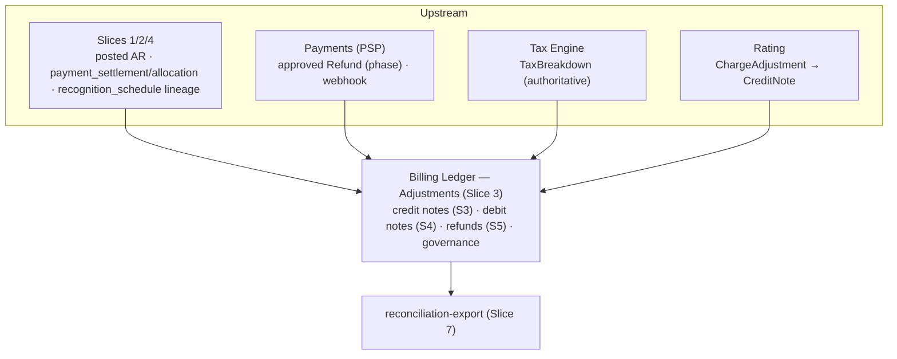
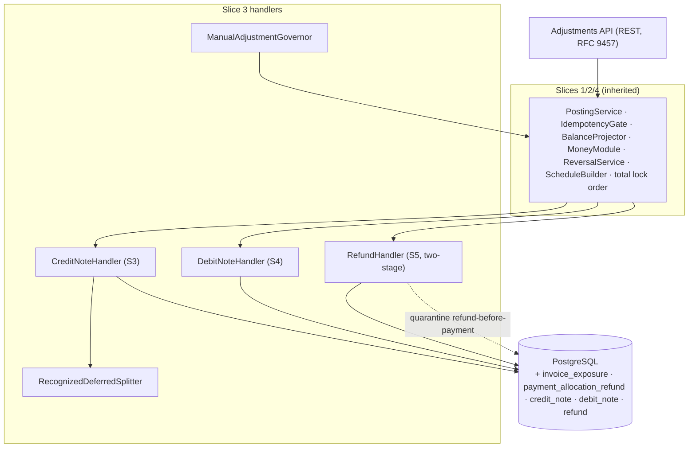

<!-- migration-note: converted from the legacy VHP architecture design slice to the gears-sdlc design-slice format. Original preserved unchanged at vhp-architecture/docs/bss/design/DESIGN-billing-ledger-balances-202606091200/05-DESIGN-billing-ledger-adjustments-notes-refunds-202606091500.md (Slice 3 — Adjustments: Credit/Debit Notes & Refunds). Inherited engine mechanics (PostingService, IdempotencyGate, BalanceProjector, commit trigger, TieOutJob, outbox relay) are specified in ./01-repository-foundation.md. -->
<!-- CONFLUENCE_TITLE: [BSS]: Billing Ledger — Credit/Debit Notes & Refunds (Design, Slice 3) -->

# DESIGN — Adjustments — Credit/Debit Notes & Refunds (Slice 3)

<!-- toc -->

- [1. Context](#1-context)
  - [1.1 Overview](#11-overview)
  - [1.2 Purpose](#12-purpose)
  - [1.3 Actors](#13-actors)
  - [1.4 References](#14-references)
  - [1.5 Scope](#15-scope)
  - [1.6 Constraints & Assumptions](#16-constraints--assumptions)
  - [1.7 Naming & Design-Introduced Names](#17-naming--design-introduced-names)
  - [1.8 Context & Dependencies](#18-context--dependencies)
- [2. Actor Flows (CDSL)](#2-actor-flows-cdsl)
  - [Post Credit Note](#post-credit-note)
  - [Post Debit Note](#post-debit-note)
  - [Record Refund Phase](#record-refund-phase)
  - [Post Refund with Paired Credit Note](#post-refund-with-paired-credit-note)
  - [Post Governed Manual Adjustment](#post-governed-manual-adjustment)
  - [Read Exposure and Refund State](#read-exposure-and-refund-state)
- [3. Processes / Business Logic (CDSL)](#3-processes--business-logic-cdsl)
  - [Recognized vs Deferred Split and Schedule Reduction](#recognized-vs-deferred-split-and-schedule-reduction)
  - [Credit-Note Headroom Cap](#credit-note-headroom-cap)
  - [Refund Cap Lifecycle](#refund-cap-lifecycle)
  - [Refund-of-Refund Direction](#refund-of-refund-direction)
  - [Tax and Revenue-Adjustment Routing](#tax-and-revenue-adjustment-routing)
  - [Manual-Adjustment Governance](#manual-adjustment-governance)
  - [Refund-Before-Payment Quarantine](#refund-before-payment-quarantine)
  - [Caps, Lock Order and Out-of-Order](#caps-lock-order-and-out-of-order)
- [4. States (CDSL)](#4-states-cdsl)
  - [Refund Phase State Machine](#refund-phase-state-machine)
  - [Refund Clearing State Machine](#refund-clearing-state-machine)
- [5. API Surface](#5-api-surface)
- [6. Data Model](#6-data-model)
- [7. Events & Alarms](#7-events--alarms)
- [8. Definitions of Done](#8-definitions-of-done)
  - [Credit Note Posting](#credit-note-posting)
  - [Debit Note Posting](#debit-note-posting)
  - [Refund Lifecycle and Clearing](#refund-lifecycle-and-clearing)
  - [Refund-with-Credit-Note Composite](#refund-with-credit-note-composite)
  - [Governed Manual Adjustments](#governed-manual-adjustments)
  - [Guarded Counters and Slice Tables](#guarded-counters-and-slice-tables)
  - [Quarantine and Out-of-Order Handling](#quarantine-and-out-of-order-handling)
  - [Adjustment Inquiry Endpoints](#adjustment-inquiry-endpoints)
- [9. Acceptance Criteria](#9-acceptance-criteria)
- [10. Non-Functional Considerations](#10-non-functional-considerations)

<!-- /toc -->

## 1. Context

### 1.1 Overview

Post-invoice adjustments for the billing ledger: credit notes (S3), debit notes (S4), refunds (S5), and the manual-adjustment governance around them — **without ever mutating posted invoice line financials** (AC #3). Corrections are **new compensating entries** only, in the one canonical **strict line-negation** shape. Crucially, **every adjustment that touches a guarded balance also updates the authoritative counter/schedule that guards it** in the same ACID transaction — so a credited-back deferred amount can never be re-recognized, and refunds can never over-restore AR.

**Traces to**: `cpt-cf-bss-ledger-fr-credit-note-adjustment`, `cpt-cf-bss-ledger-fr-credit-note-cumulative-cap`, `cpt-cf-bss-ledger-fr-debit-note-charge`, `cpt-cf-bss-ledger-fr-refund-balance-first`, `cpt-cf-bss-ledger-fr-manual-adjustment-governance`, `cpt-cf-bss-ledger-fr-reversal-canonical-pattern`, `cpt-cf-bss-ledger-fr-posting-immutability`, `cpt-cf-bss-ledger-fr-balanced-journal-entries`, `cpt-cf-bss-ledger-fr-idempotency-per-flow`, `cpt-cf-bss-ledger-fr-idempotent-replay-contract`, `cpt-cf-bss-ledger-fr-out-of-order-event-handling`, `cpt-cf-bss-ledger-fr-negative-balance-invariants`, `cpt-cf-bss-ledger-fr-exception-suspense-handling`, `cpt-cf-bss-ledger-fr-account-classes`, `cpt-cf-bss-ledger-nfr-posting-performance`

### 1.2 Purpose

Give Finance and upstream systems a safe, governed way to correct posted invoices and record cash returned to customers: credit notes reduce revenue/AR at the correct recognized/deferred split, debit notes add charges, refunds return cash balance-first through a two-stage clearing account, and every path is capped, idempotent, dual-controlled above threshold, and append-only. Free-form GL vouchers and bad-debt write-off stay out of scope by construction — attempts are rejected, captured, and paged.

**Use cases**: `cpt-cf-bss-ledger-usecase-exception-resolution`, `cpt-cf-bss-ledger-usecase-ledger-inquiry`

### 1.3 Actors

| Actor | Role in Feature |
|-------|-----------------|
| `cpt-cf-bss-ledger-actor-billing-orchestration` | Posts credit/debit notes against posted invoices (call-driven REST intake) |
| `cpt-cf-bss-ledger-actor-payments-psp` | Calls the refund endpoint with approved refund phase outcomes (`initiated`, `confirmed`, `rejected`, `voided`); source of refund-approval provenance |
| `cpt-cf-bss-ledger-actor-rating-subscriptions` | A Rating-side adapter maps `ChargeAdjustment` to `POST /credit-notes` (mapping owned upstream; never a re-rate in the ledger) |
| `cpt-cf-bss-ledger-actor-tax-engine` | Provides the authoritative `TaxBreakdown` carried inline on the posting request — never recomputed by the ledger |
| `cpt-cf-bss-ledger-actor-finance-ops` | Prepares governed manual adjustments and the `unknown_final` disposition; reads exposure/refund state |
| `cpt-cf-bss-ledger-actor-finance-approver` | Approves refunds/credit notes above the D2 dual-control threshold and all governed manual postings (preparer ≠ approver) |
| `cpt-cf-bss-ledger-actor-revenue-assurance` | Receives attempted-write-off, negative-tax-subbalance, stage-1-orphan, and refund-clearing-aged alarms |

### 1.4 References

- **PRD**: [PRD.md](../PRD.md) — § Posting rules S3/S4/S5, § Reversal canonical pattern, § Manual adjustments, § Tax posting extensions, § Revenue adjustment routing, § Refund-of-refund/oversize credit notes, AC #3/#6/#14/#17/#24
- **Design**: [01-repository-foundation.md](./01-repository-foundation.md) — see §Component Model for the Foundation engine (`postBalancedEntry`, `applyBalanceDeltas`, `applyCounterDelta`, `idempotencyClaim`, commit trigger, `BalanceProjector`, `TieOutJob`, outbox relay; read-then-write ordering via `SERIALIZABLE`/SSI)
- **Dependencies**: Foundation posting engine (Slice 1); payments-allocation (Slice 2: `payment_settlement`/`payment_allocation`, Cash/Unallocated/Reusable classes, `pending_event_queue`, ChargebackHandler); asc606-recognition (Slice 4: `recognition_schedule`/`recognition_segment`, `ScheduleBuilder`); downstream reconciliation-export (Slice 7: exception queue, close gate)

### 1.5 Scope

**In scope**:

- S3 credit notes (contra-revenue + recognized/unreleased-deferred split with **recognition-schedule reduction** + split-basis recording + block-on-ambiguous + AR-only goodwill + cumulative/headroom cap + split credit leg on paid invoices, AC #3/#24)
- S4 debit notes (tax evidence + direct-split deferred **with schedule-build hook**, AC #3)
- S5 refunds (Pattern A unallocated/on-account, Pattern B restore-AR, two-stage Refund clearing, aggregate + per-invoice caps, dual-control, idempotency by `(tenant, PSP refund id, phase)`, PSP-rejected/voided reversal, refund-of-refund, stuck-clearing `unknown_final` disposition, refund-with-credit-note atomic composite, AC #6)
- canonical reversal
- manual-adjustment governance (segregation of duties, approval thresholds, dual-control, reason code, allow-listed account set, AC #14)
- tax routing + per-`(jurisdiction, filing-period)` tax sub-balance guard (AC #17) + per-`(rate,jurisdiction,filing-period)` disaggregation
- revenue-adjustment routing
- Rating ChargeAdjustment→CreditNote
- refund-before-payment quarantine
- refund-clearing aging + stage-1-orphan alarm

**Out of scope**:

- **Bad debt / write-off / recovery / collections case management** — out of scope (PRD, § Resolved decisions); not a policy-versioning default. An attempt to write off via CONTRA_REVENUE-without-revenue-reduction or to zero AR via a non-goodwill path MUST reject + page (see [Manual-Adjustment Governance](#manual-adjustment-governance)).
- **Free-form GL vouchers** — out of scope (PRD); only **governed** adjustments are in scope.
- **PSP refund rails / processing / webhook crypto** — Payments; the ledger **records** the approved refund **outcome** (PRD).
- **Recognition releases (S6)** — Slice 4 (time-based revenue adjustments route there); this feature **reduces** the recognition schedule when crediting deferred revenue but does not run releases.
- **FX**, **ERP export / jurisdiction net-presentation** — Slices 5/7 (see [fx-multicurrency](./06-fx-multicurrency.md)).
- **Engine mechanics** — Slice 1 (01-repository-foundation.md); **settlement/allocation/chargeback/wallet** — Slice 2.

### 1.6 Constraints & Assumptions

Inherits Slice 1 C1–C4 + A1–A6, Slice 2 P1–P5, Slice 4 R1–R6. Slice-3-specific:

| # | Topic | Assumption (default) | Source |
|---|-------|----------------------|--------|
| D1 | Two-stage refund | Initiation ≠ PSP settlement is the **default** (two-stage via `REFUND_CLEARING`); single-step `…/Cash` only where PSP/tenant guarantees atomic, no clearing residual. | PRD |
| D2 | Dual-control thresholds | Refunds/credit notes above a tenant-configured amount require preparer/approver dual-control. Platform default **≥ 1,000 USD-equivalent**; tenant range **[100.. 1,000,000]**; out-of-range config **rejected** (no silent clamp). Ratified 2026-06-10. **(🔄 2026-06-15)** For a **non-USD** operation the USD-equivalent comparison uses the **same rate snapshot as the operation itself** (not a separate "fresh" rate) — deterministic + anti-circumvention. **(Impl note 2026-06-29 — gap:** the gate currently values the comparand at the **gate-time** rate; honoring the operation-snapshot rule needs the originating operation to expose its locked rate — the `payment_settlement` row carries **no** rate today, so a refund has no stored snapshot to value against. Storing the locked rate on settle (then valuing the threshold at it) is the open remediation; until then FX drift between settlement and gate time can mis-classify a near-threshold cross-currency refund.**)** | PRD; needs-discussion D2 |
| D3 | Goodwill/AR-only class | AR-only credits debit `GOODWILL` (non-revenue); the authoritative AR floor is the Slice 1 `ar_invoice_balance` NO-negative `CHECK`, **not** `invoice_exposure` (which caps contra/headroom only). **(Impl note 2026-06-29:** goodwill is **AR-only** and **cannot mint `REUSABLE_CREDIT`** — a goodwill credit that would exceed open AR (incl. any amount on a fully-paid invoice) is **rejected**, not walleted; and in impl goodwill is **additionally** subject to the `invoice_exposure` headroom cap — a deliberately **conservative** second ceiling that can only ever tighten, never over-relieve.**)** | PRD |
| D4 | S4 deferred → schedule | An S4 debit note that creates deferred Contract liability triggers the Slice 4 `ScheduleBuilder` in the **same atomic unit** (same rule Slice 1 applies to S1), so no deferred balance exists without a schedule. | PRD; Slice 4 §4.2 |

### 1.7 Naming & Design-Introduced Names

Reuses the PRD glossary and **inherits engine mechanics from the Foundation** (see 01-repository-foundation.md §Component Model): `PostingService`, append-only journal, **strict line-negation reversal** (the one canonical correction shape), `IdempotencyGate` (3-column `idempotency_dedup` PK + idempotent-replay incl. **conflicting-payload hard-error + secured-audit capture**, AC #19), `MoneyModule`, `BalanceProjector` (upsert + conditional no-negative), `FiscalPeriodGuard`, leaf-partition commit trigger, the **total fixed lock order**, `TieOutJob`. Builds on **Slice 2**'s `payment_settlement` / `payment_allocation` (this feature maintains the refund counters via the Foundation `applyCounterDelta` primitive — no DDL; columns owned by Slice 2) + the Cash/Unallocated/Reusable classes; on **Slice 4**'s `recognition_schedule`/`recognition_segment` (a credit note that reduces deferred revenue prospectively reduces them). Not restated.

**Canonical slice numbering:** 1 posting-engine-core, 2 payments-allocation, **3 adjustments-notes-refunds (this feature)**, 4 asc606-recognition, 5 fx-multicurrency, 6 audit-immutability-observability, 7 reconciliation-export, 8 other. The `source_doc_type` / idempotency `flow` values `CREDIT_NOTE | DEBIT_NOTE | REFUND | MANUAL_ADJUSTMENT` (the last for governed manual postings, ·) and the `account_class` literals `CONTRA_REVENUE` (debit-normal), `REFUND_CLEARING` (**credit-normal** liability), `GOODWILL` (non-revenue debit) are **Foundation-declared** (Foundation data model); this feature **uses** them. Book: Contra/adjustments.

Design-introduced names (Slice 3):

| Name | Meaning |
|------|---------|
| `invoice_exposure` | Per-invoice guarded counter `(tenant, invoice_id, original_total_minor, debit_note_total_minor, credit_note_total_minor)` with `CHECK (credit_note_total_minor ≤ original_total_minor + debit_note_total_minor)` — the **headroom cap** serialization point (AC #24). |
| `payment_allocation_refund` | Per-`(payment, invoice)` guarded counter `(tenant, payment_id, invoice_id, allocated_minor, refunded_minor)` with `CHECK (refunded_minor ≤ allocated_minor)` — the **per-invoice refund cap** serialization point (AC #6, PRD). Created + `allocated_minor`-maintained by **Slice 2's AllocationHandler at allocation time** (migration moved to Slice 2); this feature adds the `refunded_minor` consumption + `CHECK`s. A refund against a `(payment, invoice)` pair with no counter row simply means "nothing allocated" → `REFUND_EXCEEDS_ALLOCATED`. |
| `credit_note` / `debit_note` | Records linking a note to its originating posted invoice + the recognized/deferred split basis. |
| `refund` | Ledger record of an approved refund: PSP refund id, **mandatory origin `payment_id` + `currency` — both patterns**, phase (incl. terminal `unknown_final`), pattern (A/B), amounts, clearing state, optional forward link. |

### 1.8 Context & Dependencies

**Consumed (call-driven — delivered via REST calls, not a bus; C3 / README "Ingestion model"):** posted invoice + recognized/deferred state + owning `recognition_schedule` (Slices 1/4); `payment_settlement`/`payment_allocation` (Slice 2, for refund caps); approved `Refund` with `phase ∈ {initiated, confirmed, rejected, voided}` — **Payments calls the refund endpoint** (the fifth phase `unknown_final` is a ledger-side dual-control disposition, not a PSP event — see [Record Refund Phase](#record-refund-phase)); `TaxBreakdown` (authoritative — never recomputed) carried **inline on the posting request**; `ChargeAdjustment` — **a Rating-side adapter maps it to `POST /credit-notes`** (mapping owned upstream; never a re-rate in the ledger). **Produced:** compensating journal entries, refund-clearing / negative-tax / write-off-attempt alarms.

All handlers (and governed manual postings via `GOV`) post **through** the inherited `PostingService` (atomic, lock-ordered, idempotent, append-only).

## 2. Actor Flows (CDSL)

### Post Credit Note

- [ ] `p1` - **ID**: `cpt-cf-bss-ledger-flow-credit-note`

**Actor**: `cpt-cf-bss-ledger-actor-billing-orchestration` (also `cpt-cf-bss-ledger-actor-rating-subscriptions` via the upstream ChargeAdjustment adapter)

**Success Scenarios**:
- Credit note against a posted invoice posts a single balanced compensating entry (contra-revenue + contract-liability + tax + AR/wallet), reduces the recognition schedule, and records the split basis
- Credit note on a fully-paid invoice credits `AR` up to open AR and the remainder to `REUSABLE_CREDIT` in the same entry
- AR-only goodwill credit debits `GOODWILL` bounded by the `ar_invoice_balance` floor

**Error Scenarios**:
- Originating posted invoice absent → 404 (generic resource not-found; **no distinct wire `code`** — the platform CanonicalError model has no code slot on a 404, see the Problem-responses note)
- Recognized/deferred split indeterminable → 422 `CREDIT_NOTE_SPLIT_AMBIGUOUS` + exception-queue row (no silent pro-rata)
- Over the headroom/cumulative cap → 422 `CREDIT_NOTE_EXCEEDS_HEADROOM`
- Above the D2 threshold without approval → 409 `DUAL_CONTROL_REQUIRED`
- Same idempotency key with conflicting payload → hard error + secured-audit capture (AC #19)

**Steps**:
1. [ ] - `p1` - API: POST /v1/ledger/credit-notes (body: `credit_note_id`, origin invoice + item ref, `revenue_stream`, amount incl. tax, inline `TaxBreakdown`, `reason_code`, approver ref where required) - `inst-cn-api`
2. [ ] - `p1` - Authorize billing-poster scope; **IF** amount incl. tax ≥ the D2 dual-control threshold **AND** no approver (preparer ≠ approver) **RETURN** 409 `DUAL_CONTROL_REQUIRED` - `inst-cn-dual-control`
3. [ ] - `p1` - Idempotency: claim `(tenant, CREDIT_NOTE, credit_note_id)` — identical replay returns the prior reference; conflicting payload hard-errors + secured-audit capture (AC #19) - `inst-cn-idem`
4. [ ] - `p1` - DB: resolve the originating posted invoice; **IF** absent **RETURN** 404 (generic resource not-found — **no distinct wire `code`**; MUST link the originating posted invoice; preserve PO/recognition-schedule lineage) - `inst-cn-origin`
5. [ ] - `p1` - Algorithm: derive the recognized/deferred split via `cpt-cf-bss-ledger-algo-credit-note-recognized-deferred-split`; **IF** ambiguous **RETURN** 422 `CREDIT_NOTE_SPLIT_AMBIGUOUS` + `exception_queue` row of type `SPLIT_AMBIGUOUS` (Slice 7) - `inst-cn-split`
6. [ ] - `p1` - Algorithm: enforce the headroom/cumulative cap via `cpt-cf-bss-ledger-algo-credit-note-headroom-cap`; **IF** over cap **RETURN** 422 `CREDIT_NOTE_EXCEEDS_HEADROOM` - `inst-cn-headroom`
7. [ ] - `p1` - Compose the compensating entry (strict posting shape; zero-amount Contract-liability placeholder lines are **rejected** at post-time validation, inherited S1 / AC #4): DR `CONTRA_REVENUE` (reduce recognized revenue, ex-tax) · DR `CONTRACT_LIABILITY` (reduce unreleased deferred, ex-tax) · DR `TAX_PAYABLE` (reverse tax) · CR `AR` (incl. tax, up to current open AR) · CR `REUSABLE_CREDIT` (remainder beyond open AR on a paid invoice, `credit_grant_event_type = CREDIT_NOTE`) - `inst-cn-compose`
8. [ ] - `p1` - **IF** AR-only goodwill (no revenue restatement): debit `GOODWILL` (D3) instead — MUST NOT use `CONTRA_REVENUE` when no recognized revenue is reduced; not bad-debt; bounded by the `ar_invoice_balance` NO-negative floor (a goodwill credit exceeding open AR is **rejected**, never walleted) - `inst-cn-goodwill`
9. [ ] - `p1` - Same ACID txn under the unified lock order: post via `PostingService`; reduce the owning `recognition_schedule` (deferred portion); update `invoice_exposure.credit_note_total_minor`; seed the wallet sub-grain (`reusable_credit_subbalance`, Slice 2) for any `REUSABLE_CREDIT` remainder - `inst-cn-txn`
10. [ ] - `p1` - DB: insert the `credit_note` row (amounts, recognized/deferred parts, `split_basis_ref`, `reason_code`) — **never** change posted invoice rows (compensating only) - `inst-cn-record`
11. [ ] - `p1` - Outbox: `billing.ledger.credit_note.posted` - `inst-cn-event`
12. [ ] - `p1` - **RETURN** 201 Created (credit note + entry reference) - `inst-cn-return`

### Post Debit Note

- [ ] `p1` - **ID**: `cpt-cf-bss-ledger-flow-debit-note`

**Actor**: `cpt-cf-bss-ledger-actor-billing-orchestration`

**Success Scenarios**:
- Additional charge after a posted invoice posts the S1-mirroring direct split; a deferred portion builds a recognition schedule in the same atomic unit (D4); the headroom cap is raised

**Error Scenarios**:
- Originating posted invoice absent → 404 (generic resource not-found; **no distinct wire `code`** — the platform CanonicalError model has no code slot on a 404, see the Problem-responses note)
- Payer closed → 422 `PAYER_CLOSED` (debit notes inherit the Foundation payer-close gate)
- Conflicting idempotent replay → hard error + secured-audit capture (AC #19)

**Steps**:
1. [ ] - `p1` - API: POST /v1/ledger/debit-notes (body: `debit_note_id`, origin invoice ref, amount incl. tax, inline `TaxBreakdown`, PO/deferral context) - `inst-dn-api`
2. [ ] - `p1` - Idempotency: claim `(tenant, DEBIT_NOTE, debit_note_id)` (AC #19 replay contract) - `inst-dn-idem`
3. [ ] - `p1` - DB: resolve the originating posted invoice (MUST link business context); **IF** absent **RETURN** 404 (generic resource not-found — **no distinct wire `code`**); **IF** payer closed **RETURN** 422 `PAYER_CLOSED` - `inst-dn-origin`
4. [ ] - `p1` - Validate posted tax evidence: MUST carry `TaxBreakdown` → `TAX_PAYABLE`, never recomputed - `inst-dn-tax`
5. [ ] - `p1` - Compose the direct split (mirrors S1; no zero-placeholder CL line; if fully recognized, no CL line): DR `AR` (incl. tax) · CR `REVENUE` (recognized at post) · CR `CONTRACT_LIABILITY` (deferred per PO, if any) · CR `TAX_PAYABLE` - `inst-dn-compose`
6. [ ] - `p1` - **IF** a deferred CL credit exists: trigger the Slice 4 `ScheduleBuilder` **in the same atomic unit (D4)** so the new deferred balance is immediately recognizable (no stuck liability) - `inst-dn-schedule`
7. [ ] - `p1` - Same ACID txn: post via `PostingService` (balanced-or-rollback; **never** change posted rows); raise the headroom: `invoice_exposure.debit_note_total_minor += amount` - `inst-dn-txn`
8. [ ] - `p1` - DB: insert the `debit_note` row; Outbox: `billing.ledger.debit_note.posted` - `inst-dn-record`
9. [ ] - `p1` - **RETURN** 201 Created - `inst-dn-return`

### Record Refund Phase

- [ ] `p1` - **ID**: `cpt-cf-bss-ledger-flow-refund`

**Actor**: `cpt-cf-bss-ledger-actor-payments-psp` (phases `initiated`/`confirmed`/`rejected`/`voided`); `cpt-cf-bss-ledger-actor-finance-ops` + `cpt-cf-bss-ledger-actor-finance-approver` (ledger-side dual-control `unknown_final` disposition)

**Success Scenarios**:
- Stage-1 initiation posts Pattern A (unallocated/on-account) or Pattern B (restore AR) against `REFUND_CLEARING`, consuming the caps before money leaves
- Stage-2 PSP confirmation drains `REFUND_CLEARING` to `CASH_CLEARING`
- PSP `rejected`/`voided` line-negates stage-1 and frees the caps
- Refund-of-refund posts a new S5 entry linked via `relates_to_refund_id` with counter effect by economic direction

**Error Scenarios**:
- Over the aggregate money-out cap → 422 `REFUND_EXCEEDS_SETTLED`
- Over the per-`(payment, invoice)` cap (or no allocation counter row) → 422 `REFUND_EXCEEDS_ALLOCATED`
- Above the D2 threshold without approval → 409 `DUAL_CONTROL_REQUIRED`
- Refund before the original payment → 202 Accepted with body status token `refund-quarantined` (never posted)

**Steps**:
1. [ ] - `p1` - API: POST /v1/ledger/refunds (body: `psp_refund_id`, `phase`, `pattern` (A_UNALLOCATED | B_RESTORE_AR), **mandatory** origin `payment_id` + `currency` — both patterns, `invoice_id` (required for Pattern B), `amount_minor`, optional `relates_to_refund_id`) - `inst-rf-api`
2. [ ] - `p1` - Idempotency: claim `(tenant, REFUND, psp_refund_id:phase)` — `business_id = psp_refund_id:phase`, single string in the Slice 1 `(tenant_id, flow, business_id)` PK (shape unchanged) - `inst-rf-idem`
3. [ ] - `p1` - **IF** the origin payment is unresolvable (refund before the original payment): quarantine via `cpt-cf-bss-ledger-algo-refund-quarantine`; **RETURN** 202 Accepted, body token `refund-quarantined` + correlation handle (no SCREAMING_SNAKE code on a 202) - `inst-rf-quarantine`
4. [ ] - `p1` - **IF** amount ≥ the D2 dual-control threshold **AND** no approval **RETURN** 409 `DUAL_CONTROL_REQUIRED` (USD-equivalent comparison per D2) - `inst-rf-dual-control`
5. [ ] - `p1` - **IF** `phase = initiated` (stage-1): consume caps via `cpt-cf-bss-ledger-algo-refund-cap-lifecycle` (caps enforced **before** money leaves); over-cap **RETURN** 422 `REFUND_EXCEEDS_SETTLED` / `REFUND_EXCEEDS_ALLOCATED` - `inst-rf-stage1-caps`
   1. [ ] - `p1` - **IF** Pattern A (unallocated/on-account): DR `UNALLOCATED` (or `REUSABLE_CREDIT`) · CR `REFUND_CLEARING`. **No P&L.** The mandatory `payment_id` + `currency` resolve the origin `payment_settlement` row and exactly one `(tenant, payer, currency)` pool row — no pooled ambiguity - `inst-rf-pattern-a`
   2. [ ] - `p1` - **IF** Pattern B (after allocation, restore AR): DR `AR` · CR `REFUND_CLEARING`. **No** Revenue/Contra. **Refund lines never debit `CONTRACT_LIABILITY`** — unreleased-deferred restatement on a refunded invoice is carried by a paired S3 credit note, not the refund journal (PRD) - `inst-rf-pattern-b`
6. [ ] - `p1` - **IF** `phase = confirmed` (stage-2): **IF** an OPEN dispute exists on the origin payment, hold stage-2 in `pending_event_queue` until the dispute resolves; **ELSE** post DR `REFUND_CLEARING` · CR `CASH_CLEARING` (single-step `…/Cash` only under D1) - `inst-rf-stage2`
7. [ ] - `p1` - **IF** `phase ∈ {rejected, voided}` after stage-1: reverse stage-1 via **strict line-negation** (`reverses_entry_id`), restoring the pre-initiation state, clearing `REFUND_CLEARING`, and **decrementing** the cap counters in the same txn; idempotent per `(tenant, psp_refund_id, phase)` - `inst-rf-reject`
8. [ ] - `p1` - **IF** `phase = unknown_final` (— terminal, **ledger-side dual-control disposition**, not a PSP event): clear the open `REFUND_CLEARING` amount to a **documented loss line** + write a `secured_audit_record` (Slice 6). **(Impl note 2026-06-29 — deferred:** the interim implementation **parks the stuck clearing to `SUSPENSE`** with the secured-audit record and leaves the money-out cap consumed; **terminal loss attribution to a documented loss line is a deferred governed step** (a Slice-7+ exception-queue disposition), not yet posted.**)** - `inst-rf-unknown-final`
9. [ ] - `p1` - **IF** `relates_to_refund_id` set (refund-of-refund): apply counter effect by economic direction via `cpt-cf-bss-ledger-algo-refund-of-refund-direction` (🔄) - `inst-rf-of-rf`
10. [ ] - `p1` - DB: upsert the `refund` row (phase, pattern, clearing state, links); partial/split refunds hit the correct balances, each balanced + idempotent - `inst-rf-record`
11. [ ] - `p1` - Outbox: `billing.ledger.refund.recorded` (`phase`, incl. `unknown_final`) - `inst-rf-event`
12. [ ] - `p1` - **RETURN** 200/201 (refund record + clearing state) - `inst-rf-return`

### Post Refund with Paired Credit Note

- [ ] `p1` - **ID**: `cpt-cf-bss-ledger-flow-refund-with-credit-note`

**Actor**: `cpt-cf-bss-ledger-actor-billing-orchestration` / `cpt-cf-bss-ledger-actor-payments-psp`

**Success Scenarios**:
- Where the refund pairs with a revenue/tax restatement, the atomic composite posts the S5 refund and the paired S3 credit note in **one transaction as two linked entries** — AR is never overstated between the two

**Error Scenarios**:
- Any component failing its own validation (headroom, split, caps, dual-control) fails the whole composite — both entries commit or neither

**Steps**:
1. [ ] - `p1` - API: POST /v1/ledger/refund-with-credit-note (body: full refund payload + full credit-note payload) - `inst-rwcn-api`
2. [ ] - `p1` - Idempotency: claim **both** component keys (`psp_refund_id:phase` + `credit_note_id`) **atomically** - `inst-rwcn-idem`
3. [ ] - `p1` - Run the credit-note validations (`cpt-cf-bss-ledger-flow-credit-note` steps) and the refund validations (`cpt-cf-bss-ledger-flow-refund` steps) - `inst-rwcn-validate`
4. [ ] - `p1` - Post both entries in **one transaction**, two linked entries — the refund carries the paired `credit_note_id`; **RETURN** 201 on commit, or the failing component's problem response with nothing committed - `inst-rwcn-commit`

### Post Governed Manual Adjustment

- [ ] `p1` - **ID**: `cpt-cf-bss-ledger-flow-manual-adjustment`

**Actor**: `cpt-cf-bss-ledger-actor-finance-ops` (preparer), `cpt-cf-bss-ledger-actor-finance-approver` (approver; preparer ≠ approver)

**Success Scenarios**:
- A defined business action posts a governed manual adjustment constrained to the allow-listed account-class set, with reason code + actor recorded (AC #14), satisfying the Slice 1 invariants (balanced, append-only, idempotent)

**Error Scenarios**:
- Account class outside the allow-list, or a write-off/revenue-touching shape → 422 `MANUAL_ADJUSTMENT_NOT_ALLOWED`; attempted-write-off shape additionally captures the actor + pages
- Missing dual-control on a high-risk/over-threshold action → 409 `DUAL_CONTROL_REQUIRED`

**Steps**:
1. [ ] - `p1` - API: POST /v1/ledger/manual-adjustments (body: action type, lines, reason, approver ref) — - `inst-ma-api`
2. [ ] - `p1` - Idempotency: claim `(tenant, MANUAL_ADJUSTMENT, adjustmentId)` - `inst-ma-idem`
3. [ ] - `p1` - Algorithm: validate governance via `cpt-cf-bss-ledger-algo-manual-adjustment-governance` (named business action, allow-listed classes, segregation of duties, thresholds, mandatory reason code + actor, attempted-write-off structural guard) - `inst-ma-governance`
4. [ ] - `p1` - **IF** rejected as attempted write-off: **RETURN** 422 `MANUAL_ADJUSTMENT_NOT_ALLOWED`, capture actor, raise the `attempted-write-off` Critical alarm + page Revenue Assurance / Finance Ops (PRD) - `inst-ma-reject`
5. [ ] - `p1` - Post through the inherited `PostingService` (balanced, append-only, idempotent); Outbox: `billing.ledger.manual_adjustment.posted` (·) - `inst-ma-post`
6. [ ] - `p1` - **RETURN** 201 Created - `inst-ma-return`

### Read Exposure and Refund State

- [ ] `p2` - **ID**: `cpt-cf-bss-ledger-flow-adjustment-inquiry`

**Actor**: `cpt-cf-bss-ledger-actor-finance-ops`

**Success Scenarios**:
- Remaining credit-note headroom + true remaining AR read from the exposure/balance caches; refund + clearing state read by id

**Steps**:
1. [ ] - `p2` - API: GET /v1/ledger/invoices/{invoiceId}/exposure — cache read of `invoice_exposure` + `ar_invoice_balance`; the headroom GET reflects **true remaining AR** (goodwill floor, D3) - `inst-inq-exposure`
2. [ ] - `p2` - API: GET /v1/ledger/refunds/{refundId} — read the `refund` row + clearing state - `inst-inq-refund`
3. [ ] - `p2` - **RETURN** 200 (exposure / refund read models) - `inst-inq-return`

## 3. Processes / Business Logic (CDSL)

### Recognized vs Deferred Split and Schedule Reduction

- [ ] `p1` - **ID**: `cpt-cf-bss-ledger-algo-credit-note-recognized-deferred-split`

**Input**: credit-note target (posted invoice item, PO/allocation group), effective time
**Output**: recognized vs unreleased-deferred split (per revenue stream) + recorded `split_basis_ref`, or block-on-ambiguous

**Steps**:
1. [ ] - `p1` - Derive the split (`RecognizedDeferredSplitter`) from the targeted posted invoice item, PO/allocation group, and **recognition-schedule state** (Slice 4) at the credit-note effective time - `inst-split-derive`
2. [ ] - `p1` - **IF** the split is ambiguous: **RETURN** block — RFC 9457 code `CREDIT_NOTE_SPLIT_AMBIGUOUS` + an `exception_queue` row of type `SPLIT_AMBIGUOUS` (Slice 7), **no silent pro-rata** (PRD) - `inst-split-ambiguous`
3. [ ] - `p1` - **FOR EACH** revenue stream on a multi-stream invoice item: split the deferred reduction **per revenue_stream** so each `CONTRACT_LIABILITY` debit (and the schedule it reduces) keeps the **same stream** as the line it reduces (Slice 4 one-schedule-per-stream); **IF** the per-stream split is indeterminable, **block-on-ambiguous** - `inst-split-stream`
4. [ ] - `p1` - **Schedule reduction (critical).** When the credit note debits `CONTRACT_LIABILITY` for a deferred portion, in the **same ACID txn** **reduce the owning `recognition_schedule`**: decrement `total_deferred_minor` over the **not-yet-released remainder** (mirroring Slice 4 re-version semantics — already-released segments are never recomputed), or mark the schedule `REPLACED`/versioned. This guarantees a later S6 run cannot re-recognize the credited-back amount (remaining releasable = reduced Contract liability for that obligation) - `inst-split-schedule`
5. [ ] - `p1` - Bound the deferred-portion debit by the schedule's remaining releasable amount (`total_deferred_minor − recognized_minor`); Slice 4's `recognized_minor ≤ total_deferred_minor` `CHECK` — now also written by S3 under the lock order — is the authoritative guard against over-reducing an in-flight schedule. `recognition_schedule`/`recognition_segment` are acquired in the shared lock order. *(Slice 4 lists S3 credit notes as an authorized prospective-reduction trigger.)* - `inst-split-bound`
6. [ ] - `p1` - **RETURN** the split + record `split_basis_ref` (PO/allocation group + schedule state at effective time) on the `credit_note` row - `inst-split-return`

### Credit-Note Headroom Cap

- [ ] `p1` - **ID**: `cpt-cf-bss-ledger-algo-credit-note-headroom-cap`

**Input**: tenant, invoice, credit-note amount (incl. tax)
**Output**: cap consumed under the lock order, or `CREDIT_NOTE_EXCEEDS_HEADROOM`

**Steps**:
1. [ ] - `p1` - DB: seed `invoice_exposure.original_total_minor` **at first touch** = the invoice's posted AR (incl. tax) read from `journal_line`, via `INSERT … ON CONFLICT DO UPDATE` (Slice 1 first-touch upsert, so concurrent creators serialize, no duplicate-key) - `inst-cap-seed`
2. [ ] - `p1` - Enforce (AC #24): new credit note (incl. tax) ≤ `original_total + Σ S4 debit notes − Σ prior credit notes` — the DB `CHECK (credit_note_total_minor ≤ original_total_minor + debit_note_total_minor)` on the locked `invoice_exposure` row, under the lock order (never handler-only) - `inst-cap-check`
3. [ ] - `p1` - **IF** over cap **RETURN** `CREDIT_NOTE_EXCEEDS_HEADROOM` (422) — routes via goodwill/non-revenue or out-of-scope, never silently through S3 - `inst-cap-reject`
4. [ ] - `p1` - The cap is unchanged by the split credit leg — it bounds total credit-note exposure regardless of the AR/wallet leg split. **Ratified 2026-06-15:** remainder → wallet (`REUSABLE_CREDIT`); converting it to **cash** is a **separate S5 withdrawal on the customer's request, never automatic** (needs-discussion D9) - `inst-cap-k2`

### Refund Cap Lifecycle

- [ ] `p1` - **ID**: `cpt-cf-bss-ledger-algo-refund-cap-lifecycle`

**Input**: refund stage-1 initiation or stage-1 reversal; origin `payment_id` + `currency` (both patterns)
**Output**: cap counters consumed/freed atomically with the posting

**Steps**:
1. [ ] - `p1` - Resolve the origin `payment_settlement` row from the **mandatory** `payment_id` + `currency` (PSP refunds always reference an origin transaction; confirmation pending, needs-discussion D7) - `inst-rcap-resolve`
2. [ ] - `p1` - At **stage-1 initiation**, under the rank-1 `payment_settlement` row lock with `CHECK`s evaluated post-delta (caps enforced **before** money leaves): - `inst-rcap-stage1`
   1. [ ] - `p1` - **Both patterns**: increment `refunded_minor` — total money-out cap `CHECK (refunded_minor + clawed_back_minor ≤ settled_minor)` (`clawed_back_minor` maintained by Slice 2's ChargebackHandler) - `inst-rcap-both`
   2. [ ] - `p1` - **Pattern A**: additionally increment `refunded_unallocated_minor` — spendable headroom `CHECK (allocated_minor + refunded_unallocated_minor ≤ settled_minor)` (a refunded payment's cash can never also be allocated) - `inst-rcap-a`
   3. [ ] - `p1` - **Pattern B**: additionally increment the per-`(payment,invoice)` counter `payment_allocation_refund.refunded_minor` (`CHECK ≤ allocated_minor`); a missing counter row means "nothing allocated" → `REFUND_EXCEEDS_ALLOCATED` - `inst-rcap-b`
3. [ ] - `p1` - A **stage-1 reversal** (PSP `rejected`/`voided`) **decrements** the same counters in the same txn that line-negates stage-1 and clears `REFUND_CLEARING` - `inst-rcap-reversal`
4. [ ] - `p1` - Counters are maintained via the Foundation `applyCounterDelta` primitive — no DDL on the Slice-2-owned tables - `inst-rcap-primitive`

### Refund-of-Refund Direction

- [ ] `p1` - **ID**: `cpt-cf-bss-ledger-algo-refund-of-refund-direction`

**Input**: a new S5 entry with its **own** `psp_refund_id` and full phase lifecycle, linked via `relates_to_refund_id` (records the relationship — **NOT** a strict line-negation; canonical key shape unchanged, PRD)
**Output**: money-out counter effect **set by economic direction, not the lifecycle template** (🔄)

**Steps**:
1. [ ] - `p1` - **IF** claw-back (canonical, money returns to the merchant): **decrement** the origin `payment_settlement.refunded_minor` (and `refunded_unallocated_minor` for a Pattern-A origin; `payment_allocation_refund.refunded_minor` for Pattern-B) under the rank-1 lock, in the posting txn, so the total money-out cap (`refunded_minor + clawed_back_minor ≤ settled_minor`) reflects **net** refunded and a legitimate claw-back never spuriously trips it; `REFUND_CLEARING` drains in the reverse direction - `inst-rofr-clawback`
2. [ ] - `p1` - **IF** additional outbound refund (money leaves again): **increment** as a normal stage-1 refund, subject to the same cap - `inst-rofr-outbound`
3. [ ] - `p1` - **Out-of-order / excess claw-back (deferred, never hard-fail).** **IF** the decrement **would take a money-out counter below zero** — the PSP claw-back event arrives **before/without** its matching prior outbound-refund stage-1 (so `refunded_minor`/`refunded_unallocated_minor`/`payment_allocation_refund.refunded_minor` has not yet been incremented), or claws back **more than was refunded** — MUST **NOT** apply the decrement and MUST **NOT** hard-abort the post on the `CHECK (… ≥ 0)`. **Defer** via the existing out-of-order mechanism: persist the payload in Slice 2's `pending_event_queue` and **retry** once the matching outbound-refund stage-1 lands and the decrement no longer underflows - `inst-rofr-underflow`
4. [ ] - `p1` - **IF** a claw-back never reconciles past the aging threshold: **escalate to the `exception_queue`** (Slice 7; additive type `CLAWBACK_UNDERFLOW`) + Finance/Revenue-Assurance alert — never auto-posted, never silently dropped. This mirrors how Slice 2 defers out-of-order money-out events (e.g. `CHARGEBACK_ON_REFUNDED`) rather than aborting. The `CHECK (refunded_minor ≥ 0)` **remains as defense-in-depth** — it should never fire in normal flow precisely because an underflowing claw-back is **deferred, not applied** - `inst-rofr-escalate`
5. [ ] - `p1` - **Open (needs-discussion D8):** which of the two the PSP's refund-of-refund event represents is ⏳ to be confirmed with Payments; the canonical default is **claw-back/decrement** - `inst-rofr-open`

### Tax and Revenue-Adjustment Routing

- [ ] `p1` - **ID**: `cpt-cf-bss-ledger-algo-adjustment-tax-routing`

**Input**: an adjustment scenario (commercial revenue, goodwill, cash return, time-based)
**Output**: the correct flow (S3/S4/S5/S6) + tax posting dimensions

Routing table:

| Scenario | Path |
|----------|------|
| Commercial revenue (pricing/usage) | **S3** — Contra-revenue (recognized) + Contract liability (unreleased) + AR + tax |
| Goodwill / AR-only (no P&L restate) | **non-revenue debit** (`GOODWILL`); never Contra-revenue/bad-debt |
| Cash return to customer | **S5** (A/B); P&L via paired **S3** as needed |
| Time-based (deferral release) | **S6** (Slice 4) |

**Steps**:
1. [ ] - `p1` - Route tax: commercial revenue + its tax = S3/S4; cash+PSP-only = S5; **tax-only** adjustments via S3/S4 with `TaxBreakdown` (never an orphan suspense line) - `inst-tax-route`
2. [ ] - `p1` - Mid-period rate change decomposes to **mixed-rate lines**; S3/S4 tax lines carry **rate + jurisdiction + filing-period** dimensions so posted tax stays **disaggregable per `(rate, jurisdiction, filing-period)`** for filing reconciliation (PRD) - `inst-tax-dims`
3. [ ] - `p1` - Compute a note's `TaxBreakdown` for the **original** invoice's **tax date** (rate/jurisdiction actually charged), not the current rate — it reverses/extends the tax that was charged, so a later rate change never alters the note's tax (refines the policy-version split for the tax dimension). Per-jurisdiction rounding granularity is owned by the tax engine; the ledger accepts `TaxBreakdown` as authoritative - `inst-tax-date`
4. [ ] - `p1` - **Tax sub-balance guard (inherited from Slice 1, activated here).** S3/S4/S5 are the first flows that **debit** `TAX_PAYABLE`. Per Slice 1's deferred decision: in-window negatives are **permitted** (a legitimate reversal); a `tax_subbalance` negative **beyond** the `(jurisdiction, filing-period)` filing window (fallback tenant fiscal period) MUST **alarm Revenue Assurance** per AC #17 / PRD - `inst-tax-guard`
5. [ ] - `p1` - **S3+S5 pairing.** Where a refund accompanies a revenue/tax restatement, the **atomic composite** is the default shape and the S5 record carries the paired `credit_note_id`; the reconciliation control alarms on an S5-without-paired-S3 **in all jurisdictions whenever the refund's business reason is a product credit** — not only where tax-on-refund applies (Slice 7 recon) - `inst-tax-pairing`

### Manual-Adjustment Governance

- [ ] `p1` - **ID**: `cpt-cf-bss-ledger-algo-manual-adjustment-governance`

**Input**: a governed manual posting request (action type, lines, reason, actor, approver)
**Output**: pass, or reject (+ capture + page on attempted write-off)

**Steps**:
1. [ ] - `p1` - **Free-form GL is out of scope** (PRD). Only **governed** adjustments post outside the automated S1–S6 paths, constrained to an **allow-listed account-class set** (suspense, rounding, the named governed actions) - `inst-gov-allowlist`
2. [ ] - `p1` - A governed manual posting **MUST NOT** directly debit `REVENUE` or credit/debit `CONTRACT_LIABILITY` outside S3/S4/S6 (revenue-affecting changes route through the S3/S4 builders) - `inst-gov-revenue`
3. [ ] - `p1` - **(/ S3-minor) Allow-list ownership:** in MVP the allow-list (account-class set + named actions) is **code** — every new governed action is a deliberate, reviewed **deploy** (smallest, safest surface for a financial guard; the set changes rarely). A data/config-driven allow-list and its **meta-governance** (who may edit the allow-list, dual-control on that edit) is **deferred** - `inst-gov-ownership`
4. [ ] - `p1` - Enforce per defined business action: **segregation of duties** (preparer ≠ approver), amount/entity **approval thresholds**, **dual-control** for high-risk actions, and a **mandatory reason code + actor** (AC #14) - `inst-gov-sod`
5. [ ] - `p1` - **Attempted write-off guard:** any attempt to use `CONTRA_REVENUE` with no recognized-revenue reduction, or to zero AR via a non-goodwill path, MUST **reject + capture actor + page** Revenue Assurance / Finance Ops (PRD, Critical alarm) - `inst-gov-writeoff`
6. [ ] - `p1` - **(/ S3-minor) Detection (structural).** A `CONTRA_REVENUE` line is legitimate **only** when the **same entry** (or its linked original via the note's reference) also **reduces recognized `REVENUE` for the same `revenue_stream`** — i.e. the contra is paired with a real revenue reduction. A `CONTRA_REVENUE` that reduces **AR without a paired revenue reduction** (a disguised bad-debt write-off, out of scope) is the attempted-write-off shape → reject + capture + page. The check is on the **composition of the entry's legs** (contra-paired-with-revenue vs contra-against-AR-only), evaluated at post time — not a balance lookup - `inst-gov-structural`
7. [ ] - `p1` - Governed postings still satisfy the Slice 1 invariants (balanced, append-only, idempotent) - `inst-gov-invariants`

### Refund-Before-Payment Quarantine

- [ ] `p1` - **ID**: `cpt-cf-bss-ledger-algo-refund-quarantine`

**Input**: a refund whose original payment is unresolvable
**Output**: quarantined payload (never posted) + later de-quarantine re-validation

**Steps**:
1. [ ] - `p1` - A **refund before the original payment** has no resolvable original → **quarantine**, **never post** (PRD) — distinct from Slice 2's *queue-and-apply* - `inst-q-quarantine`
2. [ ] - `p1` - DB: persist the quarantined payload in Slice 2's `pending_event_queue` (PII-free payload + PSP correlation id) — no in-memory-only holds - `inst-q-persist`
3. [ ] - `p1` - **De-quarantine re-validates**: all caps ([Caps, Lock Order and Out-of-Order](#caps-lock-order-and-out-of-order)), the **then-current** D2 dual-control threshold, and dispute state; over-threshold items route to approval — **never auto-post** - `inst-q-revalidate`
4. [ ] - `p1` - API response for the quarantined intake: **202 Accepted** with the kebab-case body status token **`refund-quarantined`** + correlation handle; **no SCREAMING_SNAKE code on a 202** — deferral-status convention shared with Slices 2/4 - `inst-q-response`

### Caps, Lock Order and Out-of-Order

- [ ] `p1` - **ID**: `cpt-cf-bss-ledger-algo-adjustment-caps-lock-order`

**Input**: any Slice 3 posting touching guarded counters
**Output**: all guarded counters enforced by DB `CHECK` on a locked row (never handler-only), acquired in the single global lock order

**Guarded counters**:
1. [ ] - `p1` - **Credit-note headroom:** `invoice_exposure.credit_note_total_minor ≤ original_total_minor + debit_note_total_minor` (AC #24); `original_total_minor` seeded at first touch via `INSERT … ON CONFLICT DO UPDATE` - `inst-lock-headroom`
2. [ ] - `p1` - **Aggregate money-out:** on `payment_settlement` — `allocated_minor + refunded_unallocated_minor ≤ settled_minor` (Pattern-A spendable headroom) **and** `refunded_minor + clawed_back_minor ≤ settled_minor` (total money-out; `clawed_back_minor` per Slice 2) - `inst-lock-moneyout`
3. [ ] - `p1` - **Per-`(payment,invoice)` refund:** `payment_allocation_refund.refunded_minor ≤ allocated_minor` (AC #6 — the dedicated counter; `payment_allocation` itself stays INSERT-only) - `inst-lock-perinvoice`
4. [ ] - `p1` - **AR floor for goodwill:** the Slice 1 `ar_invoice_balance` NO-negative `CHECK` (goodwill + S3 cannot jointly over-reduce AR); the headroom GET reflects true remaining AR - `inst-lock-arfloor`

**Lock order & out-of-order**:
5. [ ] - `p1` - **Unified total lock order** (one global order across all slices; shared ranks unchanged — invoice before payer, recognition after balance caches): `payment_settlement` → `account_balance` → `ar_invoice_balance` → `ar_payer_balance` → `unallocated_balance` → `reusable_credit_subbalance` → `tax_subbalance` → `recognition_schedule` → `recognition_segment` → `invoice_exposure` → `payment_allocation_refund`, then by `(tenant_id, …key…)`. Slice 3's new ranks append **after** the shared/recognition tables, so a handler that locks both account-balance rows and recognition/exposure rows always acquires them in this single order (no inversion vs Slices 1/2/4) - `inst-lock-order`
6. [ ] - `p1` - **Out-of-order:** refund-before-payment quarantines per `cpt-cf-bss-ledger-algo-refund-quarantine`; underflowing claw-backs defer per `cpt-cf-bss-ledger-algo-refund-of-refund-direction` - `inst-lock-ooo`

## 4. States (CDSL)

### Refund Phase State Machine

- [ ] `p1` - **ID**: `cpt-cf-bss-ledger-state-refund-phase`

**States**: initiated, confirmed, rejected, voided, unknown_final
**Initial State**: initiated (stage-1; caps consumed before money leaves)

**Transitions**:
1. [ ] - `p1` - **FROM** initiated **TO** confirmed **WHEN** the PSP confirms settlement (stage-2 posts DR `REFUND_CLEARING` · CR `CASH_CLEARING`; held in `pending_event_queue` while an OPEN dispute exists on the origin payment) - `inst-rst-confirm`
2. [ ] - `p1` - **FROM** initiated **TO** rejected **WHEN** the PSP rejects — stage-1 is reversed via strict line-negation (`reverses_entry_id`), `REFUND_CLEARING` cleared, cap counters decremented - `inst-rst-reject`
3. [ ] - `p1` - **FROM** initiated **TO** voided **WHEN** the PSP voids — same reversal semantics as rejected - `inst-rst-void`
4. [ ] - `p1` - **FROM** initiated **TO** unknown_final **WHEN** the PSP can produce no final state — a terminal, ledger-side dual-control disposition, not a PSP event; clears open `REFUND_CLEARING` to a documented loss line + `secured_audit_record` (interim impl: parks to `SUSPENSE`, cap left consumed; loss attribution deferred) - `inst-rst-unknown`
5. [ ] - `p1` - Each phase transition is a distinct idempotency claim `(tenant, psp_refund_id, phase)`; `confirmed`, `rejected`, `voided`, `unknown_final` are terminal - `inst-rst-idem`

### Refund Clearing State Machine

- [ ] `p1` - **ID**: `cpt-cf-bss-ledger-state-refund-clearing`

**States**: PENDING, SETTLED, REVERSED
**Initial State**: PENDING (stage-1 initiation credits `REFUND_CLEARING`)

**Transitions**:
1. [ ] - `p1` - **FROM** PENDING **TO** SETTLED **WHEN** stage-2 PSP confirmation debits `REFUND_CLEARING` and credits `CASH_CLEARING` — `REFUND_CLEARING` must drain to exactly zero, never negative (stage-1 `CR` → stage-2 `DR` keeps the cached balance ≥ 0 throughout) - `inst-rcs-settle`
2. [ ] - `p1` - **FROM** PENDING **TO** REVERSED **WHEN** the PSP rejects/voids stage-1 (line-negation) or the `unknown_final` disposition clears the stuck amount - `inst-rcs-reverse`
3. [ ] - `p1` - **WHILE** PENDING beyond the tenant aging threshold (default **7 days → Warn, 14 days → Page**, ratified 2026-06-10): raise the aging alarm; a stage-1 entry without a matching stage-2 or stage-1 reversal beyond the threshold **pages Revenue Assurance**, in addition to the aging alarm; the same thresholds raise the **close-blocking** exception `STUCK_REFUND_CLEARING` (additive `exception_queue.type`; close gate Slice 7); `REFUND_CLEARING` joins the Slice 7 Payments↔PSP reconciliation - `inst-rcs-aging`

## 5. API Surface

REST per `rest-api-design`, behind the inbound API gateway; money as `{amountMinor, currency, scale}`. The inherited AC #19 contract applies to all Slice 3 flows (`CREDIT_NOTE`/`DEBIT_NOTE`/`REFUND`/`MANUAL_ADJUSTMENT`): same key + identical payload → prior reference; same key + **conflicting** payload → hard-error + **secured-audit capture**.

| Method | Path | Purpose | Idempotency |
|--------|------|---------|-------------|
| `POST` | `/v1/ledger/credit-notes` | Post a credit note against a posted invoice. | per `credit_note_id` |
| `POST` | `/v1/ledger/debit-notes` | Post a debit note (additional charge). | per `debit_note_id` |
| `POST` | `/v1/ledger/refunds` | Record a refund phase outcome (two-stage; incl. the dual-control `unknown_final` disposition). | `(tenant, psp_refund_id, phase)` |
| `POST` | `/v1/ledger/refund-with-credit-note` | Atomic composite: S5 refund + paired S3 credit note in **one transaction**, two linked entries. | both component keys (`psp_refund_id:phase` + `credit_note_id`) claimed atomically |
| `POST` | `/v1/ledger/manual-adjustments` | Post a **governed** manual adjustment: named business action, allow-listed account-class set only, preparer ≠ approver (dual-control above threshold), mandatory reason code + actor. Body: action type, lines, reason, approver ref. | per `(tenant, MANUAL_ADJUSTMENT, adjustmentId)` |
| `GET` | `/v1/ledger/invoices/{invoiceId}/exposure` | Read remaining credit-note headroom + true remaining AR. | cache read |
| `GET` | `/v1/ledger/refunds/{refundId}` | Read refund + clearing state. | — |

**Problem responses (RFC 9457):** `CREDIT_NOTE_EXCEEDS_HEADROOM` (422), `CREDIT_NOTE_SPLIT_AMBIGUOUS` (422 → exception queue), `REFUND_EXCEEDS_SETTLED` (422), `REFUND_EXCEEDS_ALLOCATED` (422), a note whose originating invoice is absent → **404 generic resource not-found with NO distinct wire `code`** (the platform `CanonicalError` model has no `code` slot on a 404 — a machine code lives only on 400/409/429 category contexts; consumers distinguish this miss by the 404 on the note endpoint + `resource_type`, not a `NOTE_INVOICE_NOT_FOUND` string, which is therefore **retired** from this contract), `PAYER_CLOSED` (422 — debit notes inherit the Foundation payer-close gate), `DUAL_CONTROL_REQUIRED` (409), **`MANUAL_ADJUSTMENT_NOT_ALLOWED` (422 —: account class outside the allow-list, or a write-off/revenue-touching shape; rejection also triggers the capture + page where it matches the attempted-write-off guard)**. **Quarantine (non-problem):** refund-before-payment → **`202 Accepted`** with a kebab-case body status token **`refund-quarantined`** + correlation handle; **no SCREAMING_SNAKE code on a 202** — deferral-status convention shared with Slices 2/4.

## 6. Data Model

Adds `invoice_exposure`, `credit_note`, `debit_note`, `refund` (Slice-3-owned tables). The money-out counters it consumes — `refunded_minor` + `refunded_unallocated_minor` on `payment_settlement`, `refunded_minor` on `payment_allocation_refund` — are **declared by Slice 2** (Slice 2 owns those tables + `allocated_minor`/`clawed_back_minor` maintenance); Slice 3 **maintains** the refund counters via the Foundation `applyCounterDelta` primitive and adds **no DDL** to Slice 2's tables. Tenant-scoped RLS (C1).

**`invoice_exposure`** (PK `(tenant_id, invoice_id)`):

| Column | Type | Notes |
|--------|------|-------|
| `tenant_id` | `uuid` | PK part; RLS scope |
| `invoice_id` | `string` | PK part |
| `currency` | `char` | |
| `original_total_minor` | `bigint` | seeded at first touch = posted AR incl. tax (from `journal_line`, `INSERT … ON CONFLICT DO UPDATE`) |
| `debit_note_total_minor` | `bigint` | raised by each S4 debit note |
| `credit_note_total_minor` | `bigint` | `CHECK (credit_note_total_minor ≤ original_total_minor + debit_note_total_minor)` — the headroom cap (AC #24) |

**`payment_allocation_refund`** (PK `(tenant_id, payment_id, invoice_id)`; created + `allocated_minor`-maintained by Slice 2's AllocationHandler):

| Column | Type | Notes |
|--------|------|-------|
| `tenant_id` | `uuid` | PK part |
| `payment_id` | `string` | PK part |
| `invoice_id` | `string` | PK part |
| `allocated_minor` | `bigint` | maintained by Slice 2 at allocation time |
| `refunded_minor` | `bigint` | `CHECK (refunded_minor ≤ allocated_minor)` **and** `CHECK (refunded_minor ≥ 0)` (defense-in-depth against double / out-of-order decrement); incremented at refund stage-1, decremented on stage-1 reversal |

**`credit_note`**:

| Column | Type | Notes |
|--------|------|-------|
| `credit_note_id` | `uuid` | business id; `UNIQUE (tenant_id, <business id>)` |
| `tenant_id` | `uuid` | |
| `origin_invoice_id` | `string` | originating posted invoice (mandatory link) |
| `origin_invoice_item_ref` | `string` | |
| `revenue_stream` | `enum` | matches the line(s) it reduces |
| `currency` | `char` | |
| `amount_minor` | `bigint` | incl. tax |
| `recognized_part_minor` | `bigint` | |
| `deferred_part_minor` | `bigint` | |
| `split_basis_ref` | `string` | PO/allocation group + schedule state at effective time |
| `reason_code` | `string` | |

**`debit_note`**:

| Column | Type | Notes |
|--------|------|-------|
| `debit_note_id` | `uuid` | business id; `UNIQUE (tenant_id, <business id>)` |
| `tenant_id` | `uuid` | |
| `origin_invoice_id` | `string` | |
| `currency` | `char` | |
| `amount_minor` | `bigint` | incl. tax |
| `recognized_part_minor` | `bigint` | |
| `deferred_part_minor` | `bigint` | |

**`refund`** (`UNIQUE (tenant_id, psp_refund_id, phase)`; `business_id = psp_refund_id:phase`):

| Column | Type | Notes |
|--------|------|-------|
| `refund_id` | `uuid` | |
| `tenant_id` | `uuid` | |
| `psp_refund_id` | `string` | |
| `phase` | `enum` | `initiated \| confirmed \| rejected \| voided \| unknown_final` |
| `pattern` | `enum` | `A_UNALLOCATED \| B_RESTORE_AR` |
| `payment_id` | `string` | **MANDATORY both patterns** — origin payment; `NOT NULL` |
| `invoice_id` | `string` | null for Pattern A; required for Pattern B |
| `currency` | `char` | **MANDATORY both patterns**; `NOT NULL` |
| `amount_minor` | `bigint` | |
| `clearing_state` | `enum` | `PENDING \| SETTLED \| REVERSED` |
| `relates_to_refund_id` | `uuid` | refund-of-refund forward link; counter effect by economic direction — claw-back decrements |
| `reverses_entry_id` | `uuid` | ONLY for PSP-rejected stage-1 line-negation; distinct from `relates_to_refund_id` |

Key constraints (beyond the column tables):

- `payment_settlement` `CHECK (allocated_minor + refunded_unallocated_minor ≤ settled_minor)`, `CHECK (refunded_minor + clawed_back_minor ≤ settled_minor)`, `CHECK (refunded_minor ≥ 0)`, `CHECK (refunded_unallocated_minor ≥ 0)`; existing Slice 2 `CHECK`s stay; same stage-1-increment / reversal-decrement lifecycle (`clawed_back_minor` maintained by Slice 2). The `≥ 0` CHECKs are defense-in-depth: an underflowing claw-back/decrement is **deferred**, so these never fire in normal flow.
- `REFUND_CLEARING` is **credit-normal** and is part of the **Foundation's no-negative `account_balance` guarded set** — the Foundation declares the full set `CHECK (account_class NOT IN ('AR','CASH_CLEARING','UNALLOCATED','CONTRACT_LIABILITY','DISPUTE_HOLD','REFUND_CLEARING') OR balance_minor >= 0)` from the start, so there is **no cross-slice `ALTER`** and no guard-drop risk. Slice 3 only **posts to** the class via the Foundation API. `REUSABLE_CREDIT` stays **out** of the set (sub-grain-guarded). `REFUND_CLEARING` must drain to exactly zero and never go negative (stage-1 `CR` → stage-2 `DR`); aged unsettled balances alarm.
- `source_doc_type` / `flow` values `CREDIT_NOTE | DEBIT_NOTE | REFUND | MANUAL_ADJUSTMENT` (·) and `account_class` literals `CONTRA_REVENUE | REFUND_CLEARING | GOODWILL` are **Foundation-declared**; Slice 3 uses them (additive C2 enum: `CONTRA_REVENUE` debit-normal, `REFUND_CLEARING` credit-normal liability, `GOODWILL` non-revenue debit).
- **Unified lock order**: `recognition_schedule`/`recognition_segment` (shared with Slice 4) then `invoice_exposure` then `payment_allocation_refund`, appended after the shared balance caches — disjoint ranks, single global order.
- **No posted-invoice mutation:** all adjustments are new compensating entries (inherited append-only).

## 7. Events & Alarms

Success via the Slice 1 outbox: `billing.ledger.credit_note.posted`, `billing.ledger.debit_note.posted`, `billing.ledger.refund.recorded` (`phase`, incl. `unknown_final`), `billing.ledger.manual_adjustment.posted` (·). Alarms via the separate committed audit/alarm txn: `billing.ledger.invariant.alarm` with `alarmCategory ∈ {refund-clearing-aged, stage1-refund-orphan, credit-note-split-blocked, refund-quarantined, negative-tax-subbalance, attempted-write-off}`. PII-free.

## 8. Definitions of Done

### Credit Note Posting

- [ ] `p1` - **ID**: `cpt-cf-bss-ledger-dod-credit-note-posting`

The system **MUST** post credit notes as single balanced compensating entries (DR `CONTRA_REVENUE` / DR `CONTRACT_LIABILITY` / DR `TAX_PAYABLE` / CR `AR` up to open AR / CR `REUSABLE_CREDIT` remainder), with recognized/deferred split derivation, same-txn recognition-schedule reduction, split-basis recording, block-on-ambiguous, AR-only goodwill via `GOODWILL`, and the headroom/cumulative cap.

**Implements**:
- `cpt-cf-bss-ledger-flow-credit-note`
- `cpt-cf-bss-ledger-algo-credit-note-recognized-deferred-split`
- `cpt-cf-bss-ledger-algo-credit-note-headroom-cap`

**Touches**:
- API: `POST /v1/ledger/credit-notes`
- DB: `credit_note`, `invoice_exposure`, `recognition_schedule`, `reusable_credit_subbalance`
- Entities: `CreditNote`, `InvoiceExposure`

### Debit Note Posting

- [ ] `p1` - **ID**: `cpt-cf-bss-ledger-dod-debit-note-posting`

The system **MUST** post debit notes as the S1-mirroring direct split (DR `AR` / CR `REVENUE` / CR `CONTRACT_LIABILITY` / CR `TAX_PAYABLE`) with mandatory posted tax evidence, the same-atomic-unit `ScheduleBuilder` hook for deferred portions (D4), and headroom raising on `invoice_exposure`.

**Implements**:
- `cpt-cf-bss-ledger-flow-debit-note`
- `cpt-cf-bss-ledger-algo-adjustment-tax-routing`

**Touches**:
- API: `POST /v1/ledger/debit-notes`
- DB: `debit_note`, `invoice_exposure`, `recognition_schedule`
- Entities: `DebitNote`

### Refund Lifecycle and Clearing

- [ ] `p1` - **ID**: `cpt-cf-bss-ledger-dod-refund-lifecycle`

The system **MUST** record refund phase outcomes balance-first (Pattern A unallocated / Pattern B restore-AR), through the two-stage `REFUND_CLEARING` default, consuming aggregate + per-`(payment,invoice)` caps at stage-1 under the rank-1 lock, line-negating rejected/voided stage-1 with cap decrement, supporting the `unknown_final` dual-control disposition, refund-of-refund by economic direction, and the dispute hold on stage-2.

**Implements**:
- `cpt-cf-bss-ledger-flow-refund`
- `cpt-cf-bss-ledger-algo-refund-cap-lifecycle`
- `cpt-cf-bss-ledger-algo-refund-of-refund-direction`
- `cpt-cf-bss-ledger-state-refund-phase`
- `cpt-cf-bss-ledger-state-refund-clearing`

**Touches**:
- API: `POST /v1/ledger/refunds`, `GET /v1/ledger/refunds/{refundId}`
- DB: `refund`, `payment_settlement` (counters via `applyCounterDelta`), `payment_allocation_refund`, `pending_event_queue`
- Entities: `Refund`

### Refund-with-Credit-Note Composite

- [ ] `p1` - **ID**: `cpt-cf-bss-ledger-dod-refund-with-credit-note`

The system **MUST** post the S5 refund and its paired S3 credit note in one transaction as two linked entries (the refund carries the paired `credit_note_id`), claiming both idempotency keys atomically, committing both entries or neither.

**Implements**:
- `cpt-cf-bss-ledger-flow-refund-with-credit-note`

**Touches**:
- API: `POST /v1/ledger/refund-with-credit-note`
- DB: `refund`, `credit_note`, `idempotency_dedup`
- Entities: `Refund`, `CreditNote`

### Governed Manual Adjustments

- [ ] `p1` - **ID**: `cpt-cf-bss-ledger-dod-manual-adjustment-governance`

The system **MUST** restrict manual postings to governed, allow-listed business actions with segregation of duties, approval thresholds, dual-control, mandatory reason code + actor (AC #14), and the structural attempted-write-off guard (reject + capture + page).

**Implements**:
- `cpt-cf-bss-ledger-flow-manual-adjustment`
- `cpt-cf-bss-ledger-algo-manual-adjustment-governance`

**Touches**:
- API: `POST /v1/ledger/manual-adjustments`
- DB: `journal_entry`/`journal_line` (via `PostingService`), `secured_audit_record`
- Entities: `ManualAdjustment`

### Guarded Counters and Slice Tables

- [ ] `p1` - **ID**: `cpt-cf-bss-ledger-dod-adjustment-guarded-counters`

The system **MUST** enforce every cap as a DB `CHECK` on a locked row (never handler-only) — headroom, aggregate money-out, per-`(payment,invoice)` refund, AR floor — acquired in the unified total lock order with Slice 3 ranks appended after the shared/recognition tables.

**Implements**:
- `cpt-cf-bss-ledger-algo-adjustment-caps-lock-order`
- `cpt-cf-bss-ledger-algo-credit-note-headroom-cap`
- `cpt-cf-bss-ledger-algo-refund-cap-lifecycle`

**Touches**:
- DB: `invoice_exposure`, `payment_allocation_refund`, `payment_settlement`, `ar_invoice_balance`
- Entities: `InvoiceExposure`, `PaymentAllocationRefund`

### Quarantine and Out-of-Order Handling

- [ ] `p1` - **ID**: `cpt-cf-bss-ledger-dod-refund-quarantine`

The system **MUST** quarantine refund-before-payment (persisted in `pending_event_queue`, 202 + `refund-quarantined` token, never posted), re-validate caps + then-current D2 threshold + dispute state on de-quarantine, defer underflowing claw-backs instead of aborting, and escalate never-reconciling claw-backs to `exception_queue` (`CLAWBACK_UNDERFLOW`).

**Implements**:
- `cpt-cf-bss-ledger-algo-refund-quarantine`
- `cpt-cf-bss-ledger-algo-refund-of-refund-direction`

**Touches**:
- API: `POST /v1/ledger/refunds` (202 path)
- DB: `pending_event_queue`, `exception_queue`
- Entities: `Refund`

### Adjustment Inquiry Endpoints

- [ ] `p2` - **ID**: `cpt-cf-bss-ledger-dod-adjustment-inquiry`

The system **MUST** expose the invoice exposure read (remaining headroom + true remaining AR) and the refund + clearing-state read as cache reads.

**Implements**:
- `cpt-cf-bss-ledger-flow-adjustment-inquiry`

**Touches**:
- API: `GET /v1/ledger/invoices/{invoiceId}/exposure`, `GET /v1/ledger/refunds/{refundId}`
- DB: `invoice_exposure`, `ar_invoice_balance`, `refund`
- Entities: `InvoiceExposure`, `Refund`

## 9. Acceptance Criteria

Delta over the Foundation testing architecture (same levels + mocking + concurrency policy inherited).

Unit:

- [ ] Recognized/deferred split + block-on-ambiguous + per-stream split; headroom-cap math; refund pattern A/B selection; S4 direct-split; tax routing + disaggregation dims; manual-adjustment allow-list + reason/actor

Integration (testcontainers):

- [ ] S3 reduces Contra-revenue + Contract liability + Tax + AR, never touches posted rows; **after an S3 deferred-portion credit, an S6 run cannot release the credited-back amount** (schedule `total_deferred` reduced)
- [ ] Headroom `CHECK` blocks over-cap (incl. after debit notes raise it); split-ambiguous **blocks**
- [ ] Goodwill uses `GOODWILL` and goodwill + S3 cannot jointly over-reduce AR (`ar_invoice_balance` floor)
- [ ] S4 deferral → schedule exists → S6 can release (D4)
- [ ] S5 Pattern A (no P&L) / B (restore AR), never debits Contract liability; two-stage Refund clearing + `REFUND_CLEARING` drains to zero (never negative)
- [ ] PSP-rejected stage-1 line-negated **and** caps decremented; aggregate + per-`(payment,invoice)` refund `CHECK`s block over-refund
- [ ] Refund-of-refund posts a new S5 with `relates_to_refund_id`; a **claw-back** refund-of-refund **decrements** the origin money-out counters (net refunded falls; the money-out cap is not spuriously tripped), while an **additional outbound** refund-of-refund increments under the cap
- [ ] **An out-of-order / excess claw-back whose decrement would drive a money-out counter below zero is DEFERRED to `pending_event_queue` (not aborted on the `CHECK (… ≥ 0)`) and applies on retry once the matching outbound-refund stage-1 lands** — and a never-reconciling claw-back escalates to `exception_queue` (`CLAWBACK_UNDERFLOW`) + alert
- [ ] Tax-subbalance negative beyond filing window alarms; attempted-write-off rejects + pages
- [ ] Pattern A refund consumes `refunded_unallocated` headroom — allocating the same payment's refunded cash blocks; credit note on a fully-paid invoice credits the `REUSABLE_CREDIT` remainder and seeds the wallet sub-grain; `unknown_final` dual-control disposition clears `REFUND_CLEARING` to a loss line + secured-audit record; refund-with-credit-note composite commits both entries or neither

API:

- [ ] RFC 9457 mapping for each code; idempotent-replay incl. **conflicting-payload hard-error + audit capture** for CREDIT_NOTE/DEBIT_NOTE/REFUND/MANUAL_ADJUSTMENT; refund-before-payment → 202 with body token `refund-quarantined`

Ordering & exception:

- [ ] Refund-before-payment **quarantines** (persisted in `pending_event_queue`); de-quarantine re-validates caps + the then-current D2 threshold + dispute state; stage-1-orphan + refund-clearing-aged alarms fire; aged clearing raises `STUCK_REFUND_CLEARING`

Concurrency (unified lock order):

- [ ] Concurrent credit notes on one invoice can't exceed headroom (serialize on `invoice_exposure`); concurrent refunds of one payment can't exceed settled nor race a concurrent allocation past the combined money-out caps (`payment_settlement`) nor a `(payment,invoice)` allocation (`payment_allocation_refund`); N concurrent stage-1 initiations summing over the cap → exactly one passes; a rejected stage-1 frees the cap to its pre-initiation value; cross-table deadlock-freedom with the appended ranks

NFR verification:

- [ ] (1) write p95 → load test; (2) `invoice_exposure` / `payment_settlement` hot-row load test (B3); (3) negative-tax / refund-clearing-aged / stage1-orphan alarms

## 10. Non-Functional Considerations

- **Performance / NFR mapping**: Inherits Slice 1 targets (B2 resolved 2026-06-10 via B11 — PRD draft committed as v1 SLOs, gated by the B3 load test; B3 remains open). Slice-3-specific: note/refund posts are single balanced entries (write p95 ≤ 500 ms); **negative-tax-subbalance (AC #17)**, refund-clearing aging, and stage-1-orphan are MUST-alarm (PRD § Observability). Availability/immutability inherited. Traces to `cpt-cf-bss-ledger-nfr-posting-performance`, `cpt-cf-bss-ledger-nfr-availability`.
- **Security & AuthZ**: Inherits Slice 1: RLS, append-only, PII-minimized events. Credit/debit notes, refunds, and governed manual adjustments require the billing-poster scope; refunds/notes above the D2 threshold and all governed manual postings require **dual-control** (segregation of duties); every manual posting carries reason code + actor (AC #14) and is constrained to the allow-listed account set. The ledger trusts Payments-module refund-approval provenance.
- **Observability / Feature metrics**: `ledger_credit_note_total` / `_blocked_total{reason}`, `ledger_debit_note_total`, `ledger_refund_total{phase,pattern}`, `ledger_refund_clearing_balance_minor` (gauge), `ledger_refund_clearing_aged_seconds`, `ledger_stage1_refund_orphan_total`, `ledger_refund_unknown_final_total`, `ledger_credit_note_headroom_reject_total`, `ledger_refund_quarantine_depth`, `ledger_negative_tax_subbalance_total`, `ledger_attempted_writeoff_total`. Thresholds wire to the NFR mapping + the alarms.
- **Risks & deferred work**: **Recognized/deferred split + schedule reduction** depends on Slice 4 schedule state being current at credit-note time; block-on-ambiguous is the safety net. **Hot rows** `invoice_exposure` (per invoice), `payment_settlement` / `payment_allocation_refund` (per payment) mirror earlier slices' contention; same load-test obligation (B3). **Deferred:** bad-debt/write-off/recovery (separate PRD); FX on cross-currency refunds (Slice 5 — [fx-multicurrency](./06-fx-multicurrency.md)); ERP export + jurisdiction net-presentation + S3+S5-pairing reconciliation (Slice 7).
- **Needs discussion** (inherits Slices 1/2/4 open items; slice-specific):

| Item | Decision (default) | Status | Owner |
|------|--------------------|--------|-------|
| Two-stage vs single-step refund | two-stage (REFUND_CLEARING) default; single-step only when atomic | ✅ Accepted default | — |
| Dual-control threshold | default **≥ 1,000 USD-equivalent**, tenant range [100.. 1,000,000], out-of-range config **rejected** (no clamp); stricter default chosen over the proposed 10,000 | ✅ Ratified 2026-06-10 — duplicate rows merged | Finance |
| Goodwill/AR-only class + AR floor | non-revenue `GOODWILL`; AR floor = `ar_invoice_balance` CHECK | ✅ Accepted default | — |
| S4 deferred → schedule-build hook | S4 deferral triggers Slice 4 ScheduleBuilder in same txn | ✅ Accepted default | — |
| Refund-clearing aging threshold | tenant-policy window; default **7 days → Warn, 14 days → Page**; the same thresholds raise `STUCK_REFUND_CLEARING` | ✅ Ratified 2026-06-10 | Finance |
| `payment_allocation_refund` ownership | Slice 2 creates + maintains `allocated_minor` at allocation time; this feature consumes | ✅ Proposed default | — |
| Manual-adjustments API | `POST /v1/ledger/manual-adjustments`, allow-listed classes, dual-control, idempotent per adjustment id | ✅ Proposed default | — |
| Origin payment ref on money-out events | `payment_id` + `currency` mandatory on every refund — confirm PSP/bank refund/return events always carry the origin payment reference | ⏳ Confirm with Payments | Payments team |
| Refund-of-refund semantic | counter effect by economic direction — **canonical default = claw-back → decrement** money-out; additional-outbound increments. Confirm which the PSP refund-of-refund event represents | ⏳ Confirm with Payments | Payments team |
| Paid-invoice credit-note remainder | remainder → wallet (`REUSABLE_CREDIT`, `credit_grant_event_type = CREDIT_NOTE`); converting to **cash** = a separate S5 withdrawal on request, **never automatic**. | ✅ Ratified 2026-06-15 | Finance |
