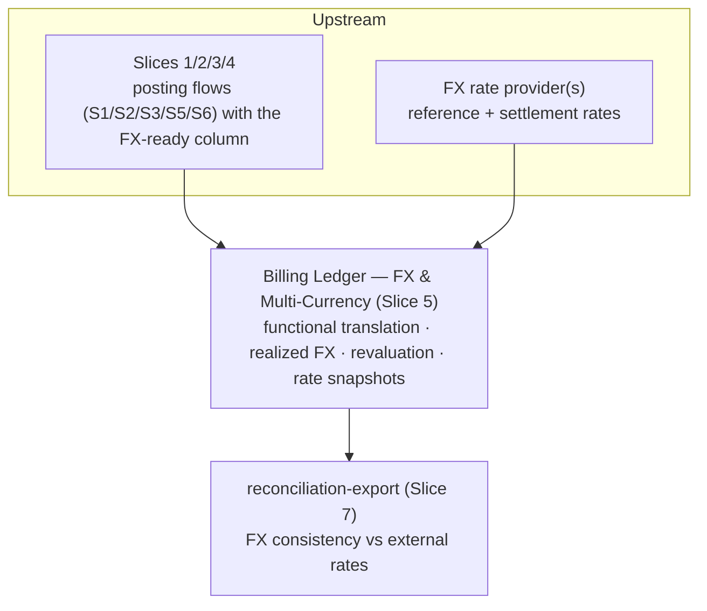
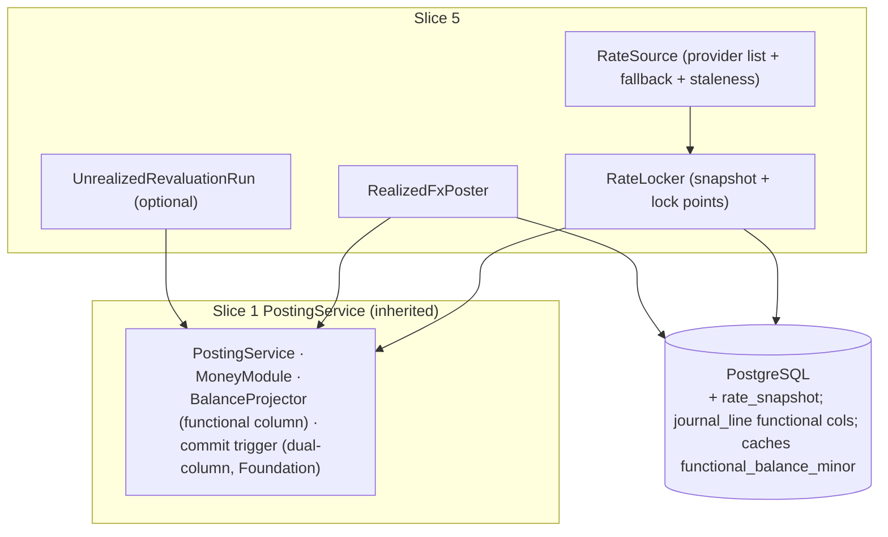

<!-- migration-note: converted from the legacy VHP architecture design slice to the gears-sdlc design-slice format. Original preserved unchanged at vhp-architecture/docs/bss/design/DESIGN-billing-ledger-balances-202606091200/06-DESIGN-billing-ledger-fx-multicurrency-202606091600.md (Slice 5 — FX & Multi-Currency). Inherited engine mechanics (PostingService, IdempotencyGate, MoneyModule, BalanceProjector, dual-column commit trigger, TieOutJob, outbox relay) are specified in ./01-repository-foundation.md. -->
<!-- CONFLUENCE_TITLE: [BSS]: Billing Ledger — FX & Multi-Currency (Design, Slice 5) -->

# DESIGN — FX & Multi-Currency (Slice 5)

<!-- toc -->

- [1. Context](#1-context)
  - [1.1 Overview](#11-overview)
  - [1.2 Purpose](#12-purpose)
  - [1.3 Actors](#13-actors)
  - [1.4 References](#14-references)
  - [1.5 Scope](#15-scope)
  - [1.6 Constraints & Assumptions](#16-constraints--assumptions)
  - [1.7 Naming & Design-Introduced Names](#17-naming--design-introduced-names)
  - [1.8 Context & Dependencies](#18-context--dependencies)
- [2. Actor Flows (CDSL)](#2-actor-flows-cdsl)
  - [Trigger Unrealized Revaluation Run](#trigger-unrealized-revaluation-run)
  - [Read Rate Snapshots and Functional Balances](#read-rate-snapshots-and-functional-balances)
- [3. Processes / Business Logic (CDSL)](#3-processes--business-logic-cdsl)
  - [Rate Snapshot and Lock Points](#rate-snapshot-and-lock-points)
  - [Rate Source, Staleness and Fallback](#rate-source-staleness-and-fallback)
  - [Dual-Currency Balance and Functional Translation](#dual-currency-balance-and-functional-translation)
  - [Realized FX Gain/Loss](#realized-fx-gainloss)
  - [Unrealized Revaluation Run](#unrealized-revaluation-run)
- [4. States (CDSL)](#4-states-cdsl)
  - [Rate Snapshot State Machine](#rate-snapshot-state-machine)
  - [Revaluation Entry State Machine](#revaluation-entry-state-machine)
- [5. API Surface](#5-api-surface)
- [6. Data Model](#6-data-model)
- [7. Events & Alarms](#7-events--alarms)
- [8. Definitions of Done](#8-definitions-of-done)
  - [Functional Translation on Every Line](#functional-translation-on-every-line)
  - [Rate Snapshot Store and Lock Points](#rate-snapshot-store-and-lock-points)
  - [Rate Source Sync, Staleness and Fallback](#rate-source-sync-staleness-and-fallback)
  - [Realized FX Posting](#realized-fx-posting)
  - [Unrealized Revaluation and Reversal](#unrealized-revaluation-and-reversal)
  - [FX Inquiry Endpoints](#fx-inquiry-endpoints)
- [9. Acceptance Criteria](#9-acceptance-criteria)
- [10. Non-Functional Considerations](#10-non-functional-considerations)

<!-- /toc -->

## 1. Context

### 1.1 Overview

The ledger posts and reports in **multiple currencies**: each line carries its **transaction** amount and a **functional** translation at a **locked, snapshotted** rate; every entry balances in **both** columns; **realized FX** posts when a position closes at a different rate; **unrealized revaluation** is an optional, idempotent, next-period-reversed run; and rate-source failure/staleness is handled deterministically (PRD § Multi-currency and foreign exchange; AC #13/#18).

**This feature removes the single-currency assumption** that Slices 1–4 carried (their money invariants were built FX-ready). It changes **no** existing transaction-currency posting shape; it adds the **functional-currency translation**, the realized-FX line, rate snapshots, and the realized/unrealized rules.

**Traces to**: `cpt-cf-bss-ledger-fr-multi-currency-fx`, `cpt-cf-bss-ledger-fr-fx-rate-source-failure`, `cpt-cf-bss-ledger-fr-money-rounding-scale`, `cpt-cf-bss-ledger-fr-balanced-journal-entries`, `cpt-cf-bss-ledger-fr-posting-immutability`, `cpt-cf-bss-ledger-fr-reversal-canonical-pattern`, `cpt-cf-bss-ledger-fr-idempotency-per-flow`, `cpt-cf-bss-ledger-fr-accounting-periods-close`, `cpt-cf-bss-ledger-nfr-posting-performance`

### 1.2 Purpose

Give each tenant (legal entity) correct functional-currency books over multi-currency documents: a deterministic, auditor-reproducible locked rate on every posting, realized gain/loss exactly when a foreign-currency position closes, ASC 830 / IAS 21-compatible period-end remeasurement for Mode B tenants, and a deterministic answer when the rate source is unreachable or stale — never a silent rate re-pick and never a retro-translation of posted history.

**Use cases**: `cpt-cf-bss-ledger-usecase-ledger-inquiry`

### 1.3 Actors

| Actor | Role in Feature |
|-------|-----------------|
| `cpt-cf-bss-ledger-actor-billing-orchestration` | Posting flows (S1/S2/S3/S5/S6) whose entries get the functional translation + rate lock attached |
| `cpt-cf-bss-ledger-actor-payments-psp` | Settlement-side rate evidence; PSP/bank feed is the ratified fallback rate provider |
| `cpt-cf-bss-ledger-actor-finance-ops` | Triggers optional unrealized revaluation runs (finance scope); configures provider list / staleness policy |
| `cpt-cf-bss-ledger-actor-erp-gl` | Mode A: the ERP GL revalues (revaluation off); Mode B: BSS is ledger of record (revaluation default-on) |
| `cpt-cf-bss-ledger-actor-auditor` | Reads immutable rate snapshots; locked rates are deterministic + auditor-reproducible |
| `cpt-cf-bss-ledger-actor-revenue-assurance` | Receives missing/stale FX snapshot alarms |

### 1.4 References

- **PRD**: [PRD.md](../PRD.md) — § Multi-currency and foreign exchange, § FX rate-source failure and staleness, AC #13/#18, Examples B/C, negative-Tax
- **Design**: [01-repository-foundation.md](./01-repository-foundation.md) — see §Component Model for the Foundation engine (`postBalancedEntry`, `applyBalanceDeltas`, `idempotencyClaim`, dual-column commit trigger, `BalanceProjector`, `TieOutJob`, outbox relay; read-then-write ordering via `SERIALIZABLE`/SSI)
- **Dependencies**: Foundation posting engine (Slice 1: `MoneyModule`, dual-column schema + commit trigger); payments-allocation (Slice 2: settlement / allocation / chargeback FX lock points; Unallocated carried functional value); adjustments-notes-refunds (Slice 3: refund realized FX; tax sub-grain — [adjustments-notes-refunds](./05-adjustments-notes-refunds.md)); asc606-recognition (Slice 4: recognition does not re-lock FX; schedule currency as posted); downstream reconciliation-export (Slice 7: FX consistency vs external rates)

### 1.5 Scope

**In scope** — FX scope per PRD AC #13/#18, § Multi-currency and foreign exchange, § FX rate-source failure and staleness, and Examples B/C:

- transaction vs functional currency
- dual-currency balance
- rate snapshot + lock points (S1/S2/S6)
- realized vs unrealized FX
- deterministic FX rounding
- provider-unreachable + staleness + immutable snapshots + multi-provider fallback
- `FX_GAIN_LOSS`/`FX_UNREALIZED`
- the Slice-3 tax-sub-balance (`(jurisdiction, filing-period)` MAY-go-negative) FX interaction
- missing/stale FX snapshot alarms

**Out of scope**:

- **The FX rate provider itself** (integration, feeds) — external; the ledger **consumes** rates and snapshots them. Provider selection ratified 2026-06-10: **ECB primary, PSP/bank feed fallback** (needs-discussion F1).
- **Pricing-side FX / rate-lock governance** — Catalog (PRD module boundary); this feature manages **AR-side** FX gain/loss and posting-time locks.
- **ERP FX export / FX-consistency-vs-external-rate reconciliation** — Slice 7.
- **Engine mechanics / existing transaction-currency posting shapes** — Slices 1–4 (unchanged).
- **Platform / group-currency consolidation across tenants (or legal entities)** — **out of scope**. The ledger is strictly per-tenant: each books in its **own** functional currency; there is **no** platform/group reporting currency and **no** cross-tenant / cross-legal-entity FX re-translation here. Group consolidation lives **downstream** — the corporate ERP/GL after the Slice 7 export, or a BI layer that reads per-tenant functional balances and re-translates. If consolidated platform reporting becomes a product requirement it needs its **own owner**, not this feature.
- **Cross-currency allocation** — applying settled cash in currency X to an invoice posted in currency Y is **not in MVP**: Slice 2 rejects it at the API (`ALLOCATION_CURRENCY_MISMATCH`) because such an entry cannot balance per `(currency, currency_scale)` group without a designed conversion mechanism. When the business needs it, the shape is a **conversion event**: two same-currency balanced legs (close X-position / open Y-position) bridged by FX lines, locked at a documented conversion rate — a future extension of this feature (needs-discussion F6, ratified 2026-06-15: reject in MVP; conversion event **deferred post-MVP**). This feature's realized-FX rule therefore only ever deals with **document vs functional** currency differences.

### 1.6 Constraints & Assumptions

Inherits Slice 1 C1–C4 + A1–A6 (A4 money type applies per currency), Slices 2/3/4 assumptions. Slice-5-specific:

| # | Topic | Assumption (default) | Source |
|---|-------|----------------------|--------|
| F1 | FX provider primary + fallback | Tenant-configured provider list; **ECB / central bank primary** (reference), **PSP / bank feed fallback** (settlement evidence); fallback order deterministic + recorded on the snapshot. **Ratified 2026-06-10 (needs-discussion F1).** | PRD |
| F2 | Unrealized revaluation | **Default-on for Mode B** (BSS = ledger of record) with multi-currency monetary positions; **off for Mode A** (ERP revalues) — a dedicated **idempotent, next-period-reversed** revaluation of **all foreign-currency monetary grains** `{AR, UNALLOCATED, REUSABLE_CREDIT}` (`CONTRACT_LIABILITY` excluded — non-monetary), per ASC 830/IAS 21, never a silent recompute of S1. | PRD |
| F3 | Stale-rate thresholds | **G10 currencies: > 24 h = stale**; other currencies tenant policy with an **upper bound 7 days**; a tenant threshold above 7 days MUST be **rejected at config time** (no silent clamp, Slice 1 config-validation pattern). Stale rates carry `stale=true`. | PRD |
| F4 | Provider-unreachable at S1 | Post **blocks** until a rate is available, **except** where tenant policy explicitly allows fallback to the last-good rate marked `stale=true`; silent fallback without the marker is forbidden. | PRD |
| F5 | Functional-currency scope | One functional currency **per legal entity** (Slice 1: default one legal entity per tenant). One functional rate per entry for the base translation. | PRD |

### 1.7 Naming & Design-Introduced Names

Reuses the PRD glossary and **inherits engine mechanics from the Foundation** (see 01-repository-foundation.md §Component Model): `PostingService`, append-only journal + strict line-negation reversal, `IdempotencyGate`, `MoneyModule` (banker's rounding, fixed-precision minor units, residual-cent rules), `BalanceProjector`, `FiscalPeriodGuard`, leaf-partition commit trigger, total fixed lock order, `TieOutJob`. The **Foundation owns the dual-column (transaction + functional) schema natively** — `functional_amount_minor` / `functional_currency` on `journal_line` and the `functional_*` columns on the shared balance caches, plus the dual-column commit-trigger check and the relaxed `amount_minor` CHECK for functional-only lines. **This feature populates them and owns** `rate_snapshot` + the `journal_line.rate_snapshot_ref` FK. Not restated.

**Canonical slice numbering:** 1 posting-engine-core, 2 payments-allocation, 3 adjustments-notes-refunds, 4 asc606-recognition, **5 fx-multicurrency (this feature)**, 6 audit-immutability-observability, 7 reconciliation-export, 8 other. `FX_GAIN_LOSS` and `FX_UNREALIZED` (`account_class`) and `FX_REVALUATION | FX_REVAL_REVERSAL` (`source_doc_type` / idempotency `flow`) are **Foundation-declared**; this feature only **uses** them.

Design-introduced names (Slice 5):

| Name | Meaning |
|------|---------|
| **Transaction (document) currency** | Currency of the invoice / payment / refund (`journal_line.amount_minor` / `currency`). |
| **Functional currency** | Reporting currency of the **legal entity** (`journal_line.functional_amount_minor` / `functional_currency` at the locked rate). |
| **Functional-only line** | A line with `amount_minor = 0` and `functional_amount_minor > 0` — used for `FX_GAIN_LOSS` and the functional residual plug; it participates **only** in the functional-balance check. |
| `rate_snapshot` | Immutable record of a locked FX rate: `rate_id`, provider, base/quote, rate, `as_of`, `stale` flag, fallback order. |
| `FX_GAIN_LOSS` / `FX_UNREALIZED` | Realized-FX class (sign-by-role) / unrealized-revaluation contra class (reverses next period). |

### 1.8 Context & Dependencies



**Consumed:** posting events from Slices 1–4 (each line's transaction amount + the legal-entity functional currency); FX rates from the provider(s). **Functional-currency source of truth:** the legal-entity's functional currency is **owned by account-management / legal-entity setup (AMS)** — the same selling legal-entity / commercial-account that owns the books (Slice 7 ledger-ownership predicate), one functional currency per legal entity. The ledger **consumes it immutably per posting** — a posting's functional currency is fixed at post time; changing a legal entity's functional currency is a rare, upstream-owned event that **does not retro-translate** posted history. **Produced:** the functional translation on every line, `FX_GAIN_LOSS`/`FX_UNREALIZED` postings, `rate_snapshot` records, missing/stale-rate alarms.



Every posting flow (S1/S2/S3/S5/S6) calls `RateLocker` to attach a `rate_snapshot` + functional translation; `RealizedFxPoster` adds the `FX_GAIN_LOSS` functional-only line when a position closes.

## 2. Actor Flows (CDSL)

FX is mostly internal — it attaches to the existing posting flows of Slices 1–4 (see [Processes / Business Logic](#3-processes--business-logic-cdsl)). The actor-facing surfaces are the revaluation trigger and the read endpoints.

### Trigger Unrealized Revaluation Run

- [ ] `p1` - **ID**: `cpt-cf-bss-ledger-flow-fx-revaluation-run`

**Actor**: `cpt-cf-bss-ledger-actor-finance-ops` (finance scope; Mode B tenants — default-on; off for Mode A where `cpt-cf-bss-ledger-actor-erp-gl` revalues)

**Success Scenarios**:
- Period-end run revalues all foreign-currency monetary grains `{AR, UNALLOCATED, REUSABLE_CREDIT}` at the period-end rate into a dedicated `FX_UNREALIZED` entry of functional-only lines; a first-of-next-period `FX_REVAL_REVERSAL` JE reverses it
- Re-trigger with the same `(tenant, period_id, revaluation_scope)` is an idempotent replay (`runId` is a retry token, not the dedup key)

**Error Scenarios**:
- No acceptable local rate for a covered pair → `FX_RATE_UNAVAILABLE` (409)
- Stale rate where tenant policy forbids fallback → `FX_RATE_STALE_NOT_ALLOWED` (422)

**Steps**:
1. [ ] - `p1` - API: POST /v1/ledger/fx/revaluation-runs (body: `period_id`, `revaluation_scope`, `runId`) - `inst-reval-api`
2. [ ] - `p1` - Authorize the finance scope; idempotency: claim `(tenant, FX_REVALUATION, period_id:scope)` — the `runId` is a retry token **within** that key - `inst-reval-idem`
3. [ ] - `p1` - Algorithm: execute the run via `cpt-cf-bss-ledger-algo-fx-unrealized-revaluation` - `inst-reval-run`
4. [ ] - `p1` - Outbox: `billing.ledger.fx.revaluation_completed` - `inst-reval-event`
5. [ ] - `p1` - **RETURN** 202/201 (run reference); the reversal posts later as a fresh first-of-next-period JE (`FX_REVAL_REVERSAL`, `billing.ledger.fx.revaluation_reversed`) - `inst-reval-return`

### Read Rate Snapshots and Functional Balances

- [ ] `p2` - **ID**: `cpt-cf-bss-ledger-flow-fx-inquiry`

**Actor**: `cpt-cf-bss-ledger-actor-auditor`, `cpt-cf-bss-ledger-actor-finance-ops`

**Success Scenarios**:
- An immutable rate snapshot is read by `rateId` (deterministic, auditor-reproducible: provider, `as_of`, `fallback_order`, `stale` flag, triangulation method where applicable)
- Balances are read in functional valuation from the `functional_balance_minor` cache

**Steps**:
1. [ ] - `p2` - API: GET /v1/ledger/fx/rate-snapshots/{rateId} — read the immutable snapshot (read-only reference) - `inst-fxinq-snapshot`
2. [ ] - `p2` - API: GET /v1/ledger/balances?valuation=functional — cache read from `functional_balance_minor` - `inst-fxinq-balances`
3. [ ] - `p2` - **RETURN** 200 (snapshot / functional balances) - `inst-fxinq-return`

## 3. Processes / Business Logic (CDSL)

### Rate Snapshot and Lock Points

- [ ] `p1` - **ID**: `cpt-cf-bss-ledger-algo-rate-snapshot`

**Input**: a posting flow (S1/S2/S3/S5/S6) entry + the legal-entity functional currency
**Output**: `rate_snapshot_ref` + `functional_amount_minor` stamped on every line at the locked rate

**Steps**:
1. [ ] - `p1` - `RateLocker` snapshots a rate and stamps `rate_snapshot_ref` + `functional_amount_minor` per the lock policy in effect; **no silent re-pick** at render/reconciliation without a new business event that re-locks (PRD). **One functional rate per entry** for the base translation - `inst-rl-lock`
2. [ ] - `p1` - **S1 invoice post:** rate in effect at post - `inst-rl-s1`
3. [ ] - `p1` - **S2 settlement / allocation:** lock on settle. On allocation that **closes** a position, **no new base rate is locked** — each closing account is relieved at its **own carried functional value** and the net difference posts to `FX_GAIN_LOSS` (→ realized FX, `cpt-cf-bss-ledger-algo-fx-realized-gain-loss`) - `inst-rl-s2`
4. [ ] - `p1` - **S6 recognition:** does **NOT** re-lock — schedule currency = as posted (Slice 4); FX on recognition is a **translation**, not a new realized event, unless a documented catch-up posts a new JE - `inst-rl-s6`
5. [ ] - `p1` - **Tax jurisdiction rate.** Tax is translated at the **entry** functional rate (one rate per entry). **IF** a jurisdiction mandates a different tax-FX rate, that difference routes to a **separate documented JE**, never mixed into one balanced entry at two rates - `inst-rl-tax`
6. [ ] - `p1` - Functional translation uses the Slice 1 `MoneyModule` (banker's rounding; +4 compute decimals not retained) - `inst-rl-money`

### Rate Source, Staleness and Fallback

- [ ] `p1` - **ID**: `cpt-cf-bss-ledger-algo-fx-rate-source-fallback`

**Input**: currency pair + tenant provider/staleness policy at lock time
**Output**: an immutable `rate_snapshot` (provider, `as_of`, `fallback_order`, `stale` flag), or a blocking condition

**Steps**:
1. [ ] - `p1` - **(🔄) Rate feed (post-path-local).** Acquire rates by a **background sync job** — per-provider poll cadence (ECB publishes once per TARGET business day; retry; a staleness watermark per pair), writing a **local rates store** (the "latest known rates", distinct from the per-lock `rate_snapshot` frozen on each entry) - `inst-rs-sync`
2. [ ] - `p1` - `RateSource` resolves at lock time by a **LOCAL read** of that store — **no synchronous provider call on the posting path** (consistent with Slice 1 C3 and Slice 4: a provider outage must not take down posting). A provider being unreachable fails the **sync job** (alarmed), not a post; `FX_RATE_UNAVAILABLE` therefore means **"no acceptable local rate for the pair"**, not "provider TCP timeout" - `inst-rs-local`
3. [ ] - `p1` - Resolve from a **tenant-configured provider list** with a **deterministic** default order **over the local store**; record the chosen provider + `as_of` + `fallback_order` on the immutable `rate_snapshot` - `inst-rs-resolve`
4. [ ] - `p1` - **Fallback concept 1 — secondary-provider live rate:** a lower-priority provider returns a **live** rate → snapshot records `fallback_order`, `stale = false`, **no block** - `inst-rs-fallback-live`
5. [ ] - `p1` - **Fallback concept 2 — no acceptable local rate** (the sync store has no fresh-enough rate for the pair — e.g. the sync job has been failing): the post **blocks** (`FX_RATE_UNAVAILABLE`, 409), **except** where tenant policy explicitly allows the last-good rate, snapshotted with `stale = true`. This is a **local-store** condition, not a live provider call from the post path; the provider-unreachability itself is handled by the sync job + its alarm. **Silent** fallback without the marker is forbidden - `inst-rs-fallback-stale`
6. [ ] - `p1` - **Staleness:** measured from the snapshot `as_of`. G10 > 24 h = stale; others tenant policy ≤ 7 days (over-7-day config rejected at config time, no silent clamp). **IF** a stale rate where tenant policy **forbids** fallback → `FX_RATE_STALE_NOT_ALLOWED` (422, blocks). A stale-allowed snapshot raises the **stale** alarm (Warn). A stale fallback reuses the original rate `as_of` (staleness measured from `as_of`) - `inst-rs-staleness`
7. [ ] - `p1` - **Rate revision after publish:** snapshots immutable; a later revision MUST NOT alter prior postings — corrections post as new compensating entries (Slice 3 / Slice 1 reversal); a provider's later revision is a **new** row (PRD) - `inst-rs-revision`
8. [ ] - `p1` - **(🔄 2026-06-15) ECB reference-rate specifics** (ECB is the ratified primary source, F1): (a) **non-publication dates** — ECB publishes once per TARGET business day, so on weekends / holidays use the **last published** rate, recorded on the snapshot; (b) **non-EUR pairs** (`X→Y`, neither EUR) — compute by **triangulation through EUR** (`X→EUR→Y`) and record the triangulation method on the snapshot. Both keep the locked rate deterministic and auditor-reproducible - `inst-rs-ecb`

### Dual-Currency Balance and Functional Translation

- [ ] `p1` - **ID**: `cpt-cf-bss-ledger-algo-fx-dual-currency-balance`

**Input**: any journal entry (transaction lines + functional translations + functional-only lines)
**Output**: an entry that balances in **both** columns, enforced by the Foundation dual-column commit trigger

**Steps**:
1. [ ] - `p1` - Every entry MUST balance in **both** columns. The **Foundation's** leaf-partition commit trigger natively enforces **two** assertions (dual-column): (1) **Transaction balance** — `SUM(DR.amount_minor) = SUM(CR.amount_minor)` per `(currency, currency_scale)`, **over lines that carry a transaction amount** (`amount_minor > 0`), unchanged from Slice 1; (2) **Functional balance** — `SUM(DR.functional_amount_minor) = SUM(CR.functional_amount_minor)` exactly, **over all lines** (including functional-only lines) - `inst-dual-checks`
2. [ ] - `p1` - **Functional-only lines** (`FX_GAIN_LOSS`, the functional residual plug) carry `amount_minor = 0` and `functional_amount_minor > 0`; they are excluded from check (1) and included in check (2). The **Foundation's** `amount_minor` CHECK is natively the relaxed form `CHECK (amount_minor > 0 OR (amount_minor = 0 AND functional_amount_minor > 0))` - `inst-dual-fonly`
3. [ ] - `p1` - **Functional rounding residual.** Per-line translation (`amount_minor × rate`, banker's rounding) can leave a per-entry functional residual even when the transaction column is exact. A **single deterministic plug** carries it: the residual (|residual| ≤ lines − 1 minor units) attaches to the entry's **anchor line** (AR for AR-anchored entries) or to a single capped `FX_GAIN_LOSS`/rounding line, so check (2) closes **by construction** rather than failing. (This is the FX extension of Slice 1 `MoneyModule` residual-cent determinism.) - `inst-dual-residual`
4. [ ] - `p1` - The Slice 1 "exact, no tolerance **at commit**" rule holds on both columns. Rounding-only variance on the functional column is absorbed into the inherited daily `TieOutJob` tolerance (extended to the functional column); **FX-consistency-vs-external-rate** variance is a separate Slice 7 reconciliation control - `inst-dual-tieout`
5. [ ] - `p1` - **Reversal of functional-only lines.** Strict line-negation ("same account, flipped side, positive amount") is extended for the relaxed CHECK: a functional-only line (`amount_minor = 0`, `functional_amount_minor > 0`) reverses as a functional-only line with the **side flipped, `amount_minor` still 0, and the same positive `functional_amount_minor`** (carrying the original `rate_snapshot_ref` — no re-lock). Both commit checks hold by construction: the reversal's transaction-column groups mirror the original's, and its functional column nets the original's - `inst-dual-reversal`
6. [ ] - `p1` - `BalanceProjector` maintains `functional_balance_minor` + `functional_currency` on the shared caches in the same transaction, locking the **same rows** in the canonical order (**no new lock-order rank**) - `inst-dual-projector`

### Realized FX Gain/Loss

- [ ] `p1` - **ID**: `cpt-cf-bss-ledger-algo-fx-realized-gain-loss`

**Input**: a receipt, settlement, allocation, refund, or chargeback close where document ≠ functional currency
**Output**: a single `FX_GAIN_LOSS` functional-only line in the **same atomic entry** as the originating close

**Steps**:
1. [ ] - `p1` - **Realized FX MUST post** on receipt, settlement, allocation, refund, or chargeback when the document and functional currency differ (PRD). **Normative rule:** realized FX closes the **functional** balance of **every** account whose **transaction** balance reaches zero on the close, each valued at **that account's own carried (locked) functional value**; the **net** difference posts to a single `FX_GAIN_LOSS` functional-only line so the functional column balances - `inst-rfx-rule`
2. [ ] - `p1` - **IF** a **partial** close (e.g. allocate 60 of 120 EUR): compute realized FX **pro-rata on the closed portion** (the relieved fraction valued at its carried rate vs the closing value); a full close is the special case where the whole position is relieved - `inst-rfx-partial`
3. [ ] - `p1` - **Carried-value source, normative:** read the carried functional value of a position from its balance-cache grain — per-invoice AR from `ar_invoice_balance`; the Unallocated pool from `unallocated_balance`; the wallet sub-grain from `reusable_credit_subbalance` (Slice 2) — each carrying `functional_balance_minor`. Value a partial relief **pro-rata at the grain's weighted-average carried rate** (`functional_balance_minor / balance_minor` at relief time, banker's rounding via `MoneyModule`); decrement the relieved functional amount from the grain in the same transaction - `inst-rfx-carried`
4. [ ] - `p1` - **(/ S5-minor) Lot-relief is an accounting policy, ratified deliberately:** **weighted-average (WAC)** is chosen over **FIFO** / **specific-lot** because it is **deterministic** from the cache grain (no per-lot tracking, no `journal_line` rescan). This is a conscious accounting-policy choice — to be confirmed acceptable to the target jurisdictions/auditors — **not** an implementation detail; switching method would change reported gain/loss. Rescanning `journal_line` per allocation and any cross-grain (e.g. cross-payer) averaging are **forbidden** — they produce a different gain/loss - `inst-rfx-wac`
5. [ ] - `p1` - Chargeback Lost/Won/Partial closes (Slice 2 ChargebackHandler) invoke `RealizedFxPoster` identically to allocation when document ≠ functional currency - `inst-rfx-chargeback`
6. [ ] - `p1` - The realized-FX line is part of the **same atomic entry** as the originating close (no separate dedup; governed by the originating flow's idempotency key) - `inst-rfx-atomic`

**Worked example C** (USD functional, EUR invoice — PRD Example C; the PRD example shows only the AR leg; the complete treatment below also closes the cash leg, netting to the realized FX):

```text
S1 (post) at 1.10:   DR AR 120 EUR (=132.00 USD); CR Revenue 100 EUR (=110.00 USD);
                     CR Tax payable 20 EUR (=22.00 USD).
                     (This is also Example B's two-step structure extended with per-step FX locks.)
S2 settle at 1.08:   DR Cash 120 EUR (=129.60 USD) / CR Unallocated 120 EUR (=129.60 USD).
                     Unallocated carried at 129.60 USD
                     (unallocated_balance.functional_balance_minor for the grain).
S2 allocate:         transaction legs DR Unallocated 120 EUR / CR AR 120 EUR (balanced in EUR).
                     Each account is relieved at ITS OWN carried functional value, read from its
                     cache grain: DR Unallocated 129.60 USD (closes Unallocated to 0),
                     CR AR 132.00 USD (closes AR to 0). Had the grain held two settlements at
                     different rates, a partial allocation would relieve at the grain's
                     weighted-average carried rate. The functional column is short 2.40 on the
                     DR side → DR FX loss 2.40 USD (functional-only line).
                     Net realized FX = 2.40 USD loss.
S6 recognition:      schedule currency = EUR (as posted); recognition does NOT re-lock;
                     FX handled at translation.
```

The original PRD Example C was illustrative and booked only the AR-leg 3.60 (omitting the offsetting 1.20 cash-leg gain); the **normative net is 2.40**, and the PRD Example C was corrected to net both legs (✅ resolved 2026-06-11, — needs-discussion).

### Unrealized Revaluation Run

- [ ] `p1` - **ID**: `cpt-cf-bss-ledger-algo-fx-unrealized-revaluation`

**Input**: `(tenant, period_id, revaluation_scope)` for a Mode B tenant with open multi-currency monetary positions
**Output**: a dedicated `FX_UNREALIZED` entry of functional-only lines + a first-of-next-period reversal JE

**Steps**:
1. [ ] - `p1` - **Default-on for Mode B** tenants (BSS = ledger of record) with open multi-currency AR; **off for Mode A**, where the ERP GL revalues (F2, — ASC 830/IAS 21 requires period-end remeasurement in whatever ledger produces the reporting balances) - `inst-ureval-mode`
2. [ ] - `p1` - When active, revalue **all foreign-currency monetary positions** at the period-end rate into a dedicated entry `DR/CR FX_UNREALIZED` (a contra class, sign-by-role) vs each position's functional balance — **never** a silent recompute of S1 - `inst-ureval-post`
3. [ ] - `p1` - **(🔄)** `revaluation_scope` enumerates the covered grains **`{AR, UNALLOCATED, REUSABLE_CREDIT}`** — open AR **and** the Slice 2 monetary caches `unallocated_balance` + `reusable_credit_subbalance` (both carry `functional_balance_minor`; both are monetary — owed back to / held for the customer), so a foreign-currency prepayment or wallet held across a period boundary is remeasured too (ASC 830 / IAS 21 remeasures **all** monetary items). **`CONTRACT_LIABILITY` is deliberately excluded** — it is **non-monetary** (a deferred performance obligation), which ASC 830/IAS 21 does not remeasure - `inst-ureval-scope`
4. [ ] - `p1` - Compose the revaluation entry of **functional-only** lines (`amount_minor = 0`): it adjusts the functional column only and passes transaction-balance check (1) trivially (zero in-scope lines) - `inst-ureval-fonly`
5. [ ] - `p1` - **Idempotency** per `(tenant, period_id, revaluation_scope)` (the `runId` is a retry token **within** that key, not the dedup key); `flow = FX_REVALUATION`, `business_id = period_id:scope` - `inst-ureval-idem`
6. [ ] - `p1` - **Reversal** is **not** a strict line-negation: it is a fresh **first-of-next-period** JE with its own `source_doc_type = FX_REVAL_REVERSAL`, posting in the next **OPEN** period, **idempotent per `(tenant, FX_REVAL_REVERSAL, period_id:scope)`** of the original revaluation period (mirroring the run key) — so it is exempt from the once-per-entry and closed-period constraints and posts cleanly (at most once) after close. Only **realized** FX is permanent - `inst-ureval-reversal`

## 4. States (CDSL)

### Rate Snapshot State Machine

- [ ] `p2` - **ID**: `cpt-cf-bss-ledger-state-fx-rate-snapshot`

**States**: live, stale
**Initial State**: live (`stale = false` at snapshot creation from a fresh-enough local rate; a lower-priority provider's live rate is still `live`, with `fallback_order` recorded)

**Transitions**:
1. [ ] - `p1` - **FROM** live **TO** stale **WHEN** the rate's age measured from `as_of` exceeds the threshold (F3: G10 > 24 h; others tenant policy ≤ 7 days) — a **new** snapshot minted from the last-good rate under tenant-allowed fallback carries `stale = true` (Warn alarm); where tenant policy forbids fallback the post blocks (`FX_RATE_STALE_NOT_ALLOWED`) and no snapshot is used - `inst-snap-stale`
2. [ ] - `p1` - `rate_snapshot` rows themselves are **immutable** — no UPDATE/DELETE transitions; a provider's later revision is a **new** row and MUST NOT alter prior postings - `inst-snap-immutable`

### Revaluation Entry State Machine

- [ ] `p2` - **ID**: `cpt-cf-bss-ledger-state-fx-revaluation-entry`

**States**: posted, reversed
**Initial State**: posted (the period-end `FX_REVALUATION` entry, functional-only lines)

**Transitions**:
1. [ ] - `p1` - **FROM** posted **TO** reversed **WHEN** the first-of-next-period `FX_REVAL_REVERSAL` JE posts in the next OPEN period (idempotent per `(tenant, FX_REVAL_REVERSAL, period_id:scope)`; not a strict line-negation) — only **realized** FX is permanent - `inst-reval-state-reverse`

## 5. API Surface

FX is mostly internal (attached to existing posts). New surfaces:

| Method | Path | Purpose | Idempotency |
|--------|------|---------|-------------|
| `POST` | `/v1/ledger/fx/revaluation-runs` | Trigger an optional unrealized revaluation for a period. | per `(tenant, period_id, revaluation_scope)`; `runId` is a retry token |
| `GET` | `/v1/ledger/fx/rate-snapshots/{rateId}` | Read an immutable rate snapshot. | — |
| `GET` | `/v1/ledger/balances?valuation=functional` | Read balances in functional currency (from `functional_balance_minor` cache). | cache read |

**Problem responses (RFC 9457):** `FX_RATE_UNAVAILABLE` (409 — all providers unreachable, no allowed stale fallback), `FX_RATE_STALE_NOT_ALLOWED` (422 — stale rate where tenant forbids fallback). Posting flows otherwise return their own slice's codes; an FX line is part of the same entry.

## 6. Data Model

This feature owns **`rate_snapshot`** and the `journal_line.rate_snapshot_ref` FK; it **populates** the Foundation-owned functional columns (`functional_amount_minor`/`functional_currency` on `journal_line`, `functional_*` on the caches) and posts the Foundation-declared `FX_GAIN_LOSS`/`FX_UNREALIZED` classes. Tenant-scoped RLS (C1).

**`rate_snapshot`** (PK `rate_id`; `UNIQUE (tenant_id, base_currency, quote_currency, provider, as_of, fallback_order)`; **immutable**):

| Column | Type | Notes |
|--------|------|-------|
| `rate_id` | `uuid` | PK |
| `tenant_id` | `uuid` | RLS scope |
| `base_currency` | `char` | |
| `quote_currency` | `char` | |
| `rate_micro` | `bigint` | rate at fixed precision |
| `as_of` | `timestamptz` | rate timestamp; drives staleness |
| `provider` | `string` | chosen provider (F1 list) |
| `stale` | `bool` | `true` only for tenant-allowed last-good fallback |
| `fallback_order` | `int` | deterministic fallback position, recorded |

**`journal_line` FX columns** (Slice 1 `journal_line`, FK `line_id`):

| Column | Type | Notes |
|--------|------|-------|
| `amount_minor` | `bigint` | transaction; 0 for functional-only lines |
| `currency` | `char` | transaction (document) currency |
| `functional_amount_minor` | `bigint` | **ACTIVATED** by this feature (Foundation-owned column) |
| `functional_currency` | `char` | **ADDED** (Foundation-owned column) |
| `rate_snapshot_ref` | `uuid` | **ADDED by this feature**, FK `rate_snapshot` |

**Balance-cache FX columns** (Slice 1/2 cache rows — `account_balance`, `ar_invoice_balance`, `ar_payer_balance`, `unallocated_balance`, `reusable_credit_subbalance`):

| Column | Type | Notes |
|--------|------|-------|
| `balance_minor` | `bigint` | transaction (Slice 1/2) |
| `functional_balance_minor` | `bigint` | **ADDED** (Foundation-owned) — each position cache grain carries its own **carried functional value**; realized FX reads it from the grain — never by rescanning `journal_line`, never by a cross-payer average |
| `functional_currency` | `char` | **ADDED** (Foundation-owned) |

Key constraints:

- `rate_snapshot` **immutability enforced** like Slice 1: `REVOKE UPDATE, DELETE … FROM <app_role>` + `BEFORE UPDATE/DELETE` trigger that RAISEs (a revision can only INSERT a new row). A stale fallback reuses the original rate `as_of` (staleness measured from `as_of`).
- **The Foundation commit trigger (dual-column, native, on every leaf partition):** check (1) transaction balance per `(currency, currency_scale)` over `amount_minor > 0` lines; check (2) functional balance over all lines; both exact (no commit tolerance).
- `journal_line` `CHECK` relaxed: `amount_minor > 0 OR (amount_minor = 0 AND functional_amount_minor > 0)` (permits functional-only FX/residual lines).
- `functional_balance_minor` + `functional_currency` are **Foundation-owned columns** on the shared caches; maintained by `BalanceProjector` in the same txn (same rows → **no new lock-order rank**); `TieOutJob` recomputes the functional column from `journal_line.functional_amount_minor`. Realized FX relieves a position grain pro-rata at its **weighted-average carried rate**. **(/ S5-minor) Grain caveat:** these functional columns sit on a cache grain **without `legal_entity_id`** — correct only under the v1 default of **one legal entity per tenant**. A multi-legal-entity tenant would mix two functional currencies in one cache row; **`legal_entity_id` MUST enter the functional cache grain** before multi-legal-entity is enabled.
- `FX_GAIN_LOSS` (sign-by-role, not NO-negative) and `FX_UNREALIZED` (contra, reverses next period) are **Foundation-declared** `account_class` literals; `FX_REVALUATION | FX_REVAL_REVERSAL` are **Foundation-declared** `source_doc_type`/`flow` values. Revaluation `business_id = period_id:scope`.
- Functional translation uses the Slice 1 `MoneyModule` (banker's rounding; +4 compute decimals not retained); the per-entry functional residual is a single deterministic plug line.
- **Tax payable MAY go negative** per `(jurisdiction, filing-period)` (Slice 3 sub-grain guard); tax posted in transaction currency per `TaxBreakdown`, translated at the entry rate.

## 7. Events & Alarms

Success FX is part of the originating flow's outbox event (no separate event for the realized-FX line). New: `billing.ledger.fx.revaluation_completed` / `billing.ledger.fx.revaluation_reversed` (F2; — renamed from `revaluation_run` to keep the past-tense event convention). Alarms via the separate committed audit/alarm txn: `billing.ledger.invariant.alarm` with `alarmCategory ∈ {fx-snapshot-missing, fx-snapshot-stale-allowed, fx-snapshot-stale-blocked}` — **missing → Critical (blocks)**, **stale-allowed → Warn (posts successfully)**, **stale-not-allowed → Critical (blocks, 422)**. The two **blocking** states map to the API-surface codes (missing → `FX_RATE_UNAVAILABLE` 409; stale-blocked → `FX_RATE_STALE_NOT_ALLOWED` 422); stale-allowed has no error code. PII-free.

## 8. Definitions of Done

### Functional Translation on Every Line

- [ ] `p1` - **ID**: `cpt-cf-bss-ledger-dod-fx-functional-translation`

The system **MUST** stamp every journal line of every posting flow (S1/S2/S3/S5/S6) with `functional_amount_minor`, `functional_currency`, and `rate_snapshot_ref` at the locked rate, balance every entry in both columns via the Foundation dual-column commit trigger, carry the per-entry functional rounding residual on a single deterministic plug line, and reverse functional-only lines side-flipped with the original `rate_snapshot_ref`.

**Implements**:
- `cpt-cf-bss-ledger-algo-fx-dual-currency-balance`
- `cpt-cf-bss-ledger-algo-rate-snapshot`

**Touches**:
- DB: `journal_line` (functional columns + `rate_snapshot_ref`), `account_balance`/`ar_invoice_balance`/`ar_payer_balance`/`unallocated_balance`/`reusable_credit_subbalance` (`functional_balance_minor`)
- Entities: `JournalLine`, `RateSnapshot`

### Rate Snapshot Store and Lock Points

- [ ] `p1` - **ID**: `cpt-cf-bss-ledger-dod-fx-rate-snapshot`

The system **MUST** lock exactly one functional rate per entry at the defined lock points (S1 at post; S2 on settle; allocation closes relieve at carried value with no new base rate; S6 never re-locks), persist each lock as an immutable `rate_snapshot` row, and never silently re-pick a rate without a new business event.

**Implements**:
- `cpt-cf-bss-ledger-algo-rate-snapshot`
- `cpt-cf-bss-ledger-state-fx-rate-snapshot`

**Touches**:
- DB: `rate_snapshot`, `journal_line.rate_snapshot_ref`
- Entities: `RateSnapshot`

### Rate Source Sync, Staleness and Fallback

- [ ] `p1` - **ID**: `cpt-cf-bss-ledger-dod-fx-rate-source`

The system **MUST** acquire rates via the background sync job into a local rates store (no synchronous provider call on the posting path), resolve deterministically over the tenant-configured provider list with recorded `fallback_order`, enforce the F3 staleness thresholds (G10 24 h; others ≤ 7 d, over-7-d config rejected), block with `FX_RATE_UNAVAILABLE`/`FX_RATE_STALE_NOT_ALLOWED` per policy, mark allowed fallbacks `stale=true`, and handle ECB non-publication dates + EUR triangulation on the snapshot.

**Implements**:
- `cpt-cf-bss-ledger-algo-fx-rate-source-fallback`

**Touches**:
- DB: local rates store, `rate_snapshot`
- Entities: `RateSnapshot`, `RateSource`

### Realized FX Posting

- [ ] `p1` - **ID**: `cpt-cf-bss-ledger-dod-fx-realized`

The system **MUST** post realized FX on receipt, settlement, allocation, refund, or chargeback when document ≠ functional currency: close each zero-transaction-balance account at its own carried functional value read from its cache grain, value partial reliefs pro-rata at the grain's weighted-average carried rate (WAC — a ratified accounting policy), and post the net difference as a single `FX_GAIN_LOSS` functional-only line inside the originating atomic entry.

**Implements**:
- `cpt-cf-bss-ledger-algo-fx-realized-gain-loss`

**Touches**:
- DB: `journal_line` (FX_GAIN_LOSS functional-only lines), `ar_invoice_balance`, `unallocated_balance`, `reusable_credit_subbalance`
- Entities: `RealizedFxPoster`

### Unrealized Revaluation and Reversal

- [ ] `p1` - **ID**: `cpt-cf-bss-ledger-dod-fx-revaluation`

The system **MUST** run the Mode-B period-end revaluation over the monetary grains `{AR, UNALLOCATED, REUSABLE_CREDIT}` (`CONTRACT_LIABILITY` excluded — non-monetary) as an idempotent `FX_REVALUATION` entry of functional-only lines, reversed by a fresh first-of-next-period `FX_REVAL_REVERSAL` JE idempotent per the mirrored run key, never silently recomputing S1.

**Implements**:
- `cpt-cf-bss-ledger-flow-fx-revaluation-run`
- `cpt-cf-bss-ledger-algo-fx-unrealized-revaluation`
- `cpt-cf-bss-ledger-state-fx-revaluation-entry`

**Touches**:
- API: `POST /v1/ledger/fx/revaluation-runs`
- DB: `journal_entry`/`journal_line` (FX_UNREALIZED), `idempotency_dedup`
- Entities: `UnrealizedRevaluationRun`

### FX Inquiry Endpoints

- [ ] `p2` - **ID**: `cpt-cf-bss-ledger-dod-fx-inquiry`

The system **MUST** expose the immutable rate-snapshot read and the functional-valuation balance read (from the `functional_balance_minor` cache).

**Implements**:
- `cpt-cf-bss-ledger-flow-fx-inquiry`

**Touches**:
- API: `GET /v1/ledger/fx/rate-snapshots/{rateId}`, `GET /v1/ledger/balances?valuation=functional`
- DB: `rate_snapshot`, balance caches
- Entities: `RateSnapshot`

## 9. Acceptance Criteria

Delta over the Foundation testing architecture (levels + mocking inherited).

Unit:

- [ ] Functional translation at a locked rate; realized-FX net math (Example C: AR 132.00 + Unallocated 129.60 → DR FX loss 2.40, both close to 0); weighted-average carried-rate pro-rata relief (two settlements at different rates, partial allocation); functional rounding-residual plug determinism; stale-threshold logic (G10 24 h vs tenant ≤ 7 d; over-7-d config rejected)

Integration (testcontainers):

- [ ] An EUR invoice under USD functional posts a balanced entry in **both** columns (the Foundation's dual-column commit trigger)
- [ ] A functional-only `FX_GAIN_LOSS` line passes the relaxed `amount_minor` CHECK and balances the functional column
- [ ] A full cross-currency settle→allocate closes **both** AR and Unallocated functional balances to **zero** with a 2.40 FX line
- [ ] Provider-unreachable at S1 **blocks** (`FX_RATE_UNAVAILABLE`) unless tenant allows a `stale=true` snapshot; secondary-provider live rate does **not** block (stale=false)
- [ ] A later provider rate revision does **not** alter a prior posting; `rate_snapshot` UPDATE/DELETE rejected

API:

- [ ] RFC 9457 mapping for `FX_RATE_UNAVAILABLE` / `FX_RATE_STALE_NOT_ALLOWED`; functional-valuation cache read; revaluation-run idempotent per `(tenant, period_id, scope)`

Ordering & exception:

- [ ] Optional revaluation is idempotent + reversed by a next-period `FX_REVAL_REVERSAL` JE (not a line-negation); the three snapshot alarm states fire correctly

Concurrency:

- [ ] Functional-column projection locks the same `account_balance` rows in the inherited order (no new deadlock surface)

NFR verification:

- [ ] (1) write p95 with the extra FX line → inherited load test (Foundation NFR targets); (2) fx-snapshot missing/stale-allowed/stale-blocked alarms

## 10. Non-Functional Considerations

- **Performance / NFR mapping**: Inherits Slice 1 targets (e.g. write p95 ≤ 500 ms — the Foundation NFR mapping). Slice-5-specific: missing FX snapshot **blocks** the post (Critical); stale-allowed is Warn; stale-not-allowed blocks (422) (AC #18). FX adds at most one functional-only line per entry → negligible latency impact on the inherited write-p95 target. Traces to `cpt-cf-bss-ledger-nfr-posting-performance`.
- **Security & AuthZ**: Inherits Slice 1: RLS, append-only, PII-minimized events. Triggering revaluation runs requires the finance scope; rate snapshots are read-only references. The ledger trusts the provider feed's authenticity (provider auth is upstream/ops).
- **Observability / Feature metrics**: `ledger_fx_realized_minor{functional_currency}`, `ledger_fx_snapshot_missing_total`, `ledger_fx_snapshot_stale_allowed_total`, `ledger_fx_snapshot_stale_blocked_total`, `ledger_fx_revaluation_duration_seconds` (— aligned with the `revaluation_completed` event rename), `ledger_fx_provider_fallback_total{provider}`. Thresholds wire to the NFR mapping + the snapshot alarms.
- **Risks & deferred work**: **FX provider** — **ratified 2026-06-10: ECB primary, PSP/bank feed fallback**; the snapshot/lock/realized-FX mechanics are stable. The **Foundation's dual-column commit trigger** (functional balance, two checks) + the relaxed `amount_minor` CHECK are Foundation-owned (native, on every leaf partition); this feature posts functional-only lines that exercise them; covered by integration tests. **Deferred:** FX consistency reconciliation vs external rates + ERP FX export → Slice 7; pricing-side FX/rate-lock → Catalog; cross-currency conversion event → deferred post-MVP.
- **Needs discussion** (inherits Slices 1–4 open items; slice-specific):

| Item | Decision (default) | Status | Owner |
|------|--------------------|--------|-------|
| **FX provider primary + fallback list** | ECB/central-bank reference + PSP/bank settlement; deterministic fallback order | ✅ Ratified 2026-06-10: **ECB primary, PSP/bank feed fallback** | PM Team |
| Unrealized revaluation on/off | **default-on for Mode B** (BSS = ledger of record), **off for Mode A** (ERP revalues); idempotent + next-period-reversed; scope `{AR, UNALLOCATED, REUSABLE_CREDIT}` — consistent with F2 / the revaluation run | ✅ Accepted default | — |
| Stale-rate thresholds | G10 24 h; others ≤ 7 d (over-7-d config rejected) | ✅ Accepted default | — |
| Provider-unreachable policy | block by default; stale fallback only if tenant allows (marked) | ✅ Accepted default | — |
| Functional currency / one rate per entry | one functional currency per legal entity; one functional rate per entry | ✅ Accepted default | — |
| PRD Example C numbers | realized FX = **2.40** (same-currency allocation is not an FX event; Unallocated fully clears) | ✅ **Resolved 2026-06-11** — PRD Example C corrected | PM |
| Cross-currency allocation | **out of MVP** (Slice 2 rejects, `ALLOCATION_CURRENCY_MISMATCH`); the conversion-event mechanism is a **deferred post-MVP** extension of this feature | ✅ **Ratified 2026-06-15** — reject in MVP; conversion event deferred post-MVP | PM + Architecture |
