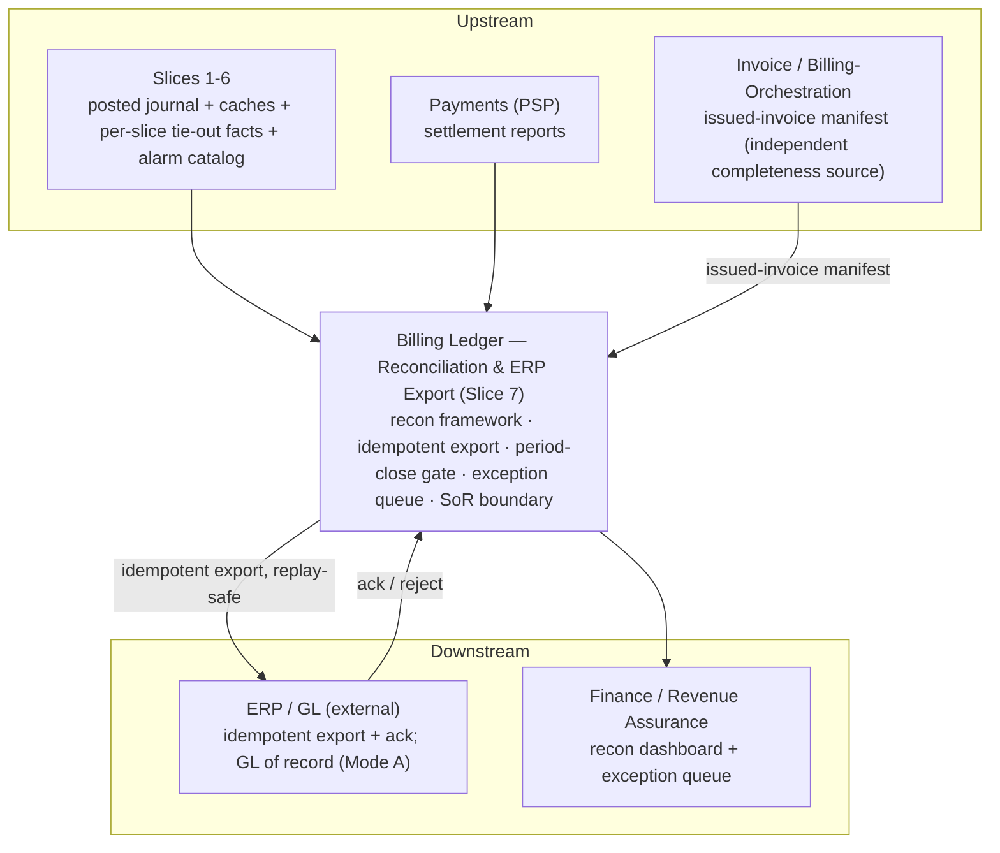
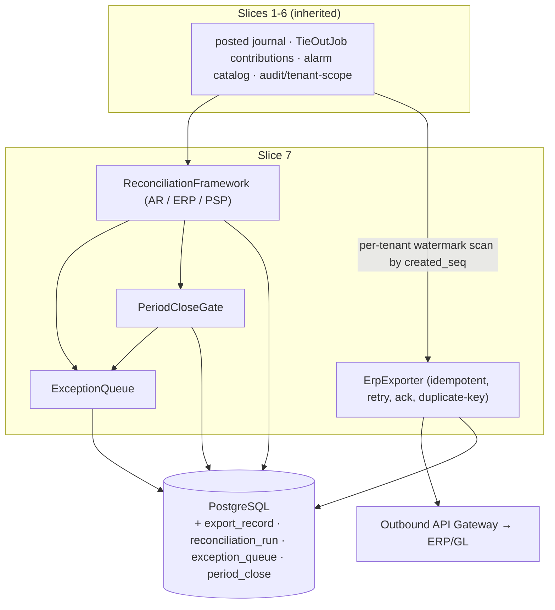

<!-- migration-note: converted from the legacy Virtuozzo design format to the gears-sdlc design-slice layout (cpt-* sub-IDs, CDSL flows/algos/states). Original preserved unchanged at vhp-architecture: docs/bss/design/DESIGN-billing-ledger-balances-202606091200/07-DESIGN-billing-ledger-reconciliation-export-202606091800.md. Confluence metadata preserved below. -->
<!-- CONFLUENCE_TITLE: [BSS]: Billing Ledger — Reconciliation & ERP Export (Design, Slice 7) -->
<!-- Related: Slices 1-6 | Upstream: Slices 1-6 (posted facts, caches, per-slice tie-out contributions, alarm catalog), Payments (PSP settlement) | Downstream: ERP/GL (external), Finance/Revenue Assurance -->

# DESIGN — Reconciliation & ERP Export (Slice 7)

**Owners:** @vstudzinskyi (BSS Billing Platform team)

<!-- toc -->

- [1. Context](#1-context)
  - [1.1 Overview](#11-overview)
  - [1.2 Purpose](#12-purpose)
  - [1.3 Actors](#13-actors)
  - [1.4 References](#14-references)
  - [1.5 Scope](#15-scope)
  - [1.6 Constraints & Assumptions](#16-constraints--assumptions)
  - [1.7 Naming Conventions](#17-naming-conventions)
  - [1.8 System Context](#18-system-context)
  - [1.9 SoR Boundary & Operating Modes](#19-sor-boundary--operating-modes)
- [2. Actor Flows (CDSL)](#2-actor-flows-cdsl)
  - [API Surface](#api-surface)
  - [Trigger Reconciliation Run](#trigger-reconciliation-run)
  - [Finance-Initiated Period Close](#finance-initiated-period-close)
  - [Resolve or Approve Exception](#resolve-or-approve-exception)
  - [Trigger ERP Export / Read Export Status](#trigger-erp-export--read-export-status)
- [3. Processes / Business Logic (CDSL)](#3-processes--business-logic-cdsl)
  - [Reconciliation Framework Checks](#reconciliation-framework-checks)
  - [AR to Derived Tie-Out](#ar-to-derived-tie-out)
  - [Ledger to ERP Reconciliation](#ledger-to-erp-reconciliation)
  - [Payments to PSP Tie](#payments-to-psp-tie)
  - [Invoice Completeness Check](#invoice-completeness-check)
  - [ERP Export Watermark Scan](#erp-export-watermark-scan)
  - [ERP Export Replay & Duplicate-Key Disposition](#erp-export-replay--duplicate-key-disposition)
  - [Restore & Re-Sync Runbook](#restore--re-sync-runbook)
- [4. States (CDSL)](#4-states-cdsl)
  - [Period Close State Machine](#period-close-state-machine)
  - [Export Record State Machine](#export-record-state-machine)
  - [Exception State Machine](#exception-state-machine)
- [5. Data Model (Owned Tables)](#5-data-model-owned-tables)
  - [5.1 export_record](#51-export_record)
  - [5.2 reconciliation_run](#52-reconciliation_run)
  - [5.3 exception_queue](#53-exception_queue)
  - [5.4 period_close](#54-period_close)
  - [5.5 Cross-Table Rules](#55-cross-table-rules)
- [6. Definitions of Done](#6-definitions-of-done)
  - [Reconciliation Framework](#reconciliation-framework)
  - [Idempotent ERP Export](#idempotent-erp-export)
  - [Period Close Gate](#period-close-gate)
  - [Exception Queue](#exception-queue)
  - [Restore & Re-Sync](#restore--re-sync)
  - [Owned Data Model](#owned-data-model)
  - [Observability](#observability)
  - [Security & AuthZ](#security--authz)
- [7. Acceptance Criteria](#7-acceptance-criteria)
- [8. Non-Functional Considerations](#8-non-functional-considerations)
  - [8.1 Events Surface](#81-events-surface)
  - [8.2 Feature Metrics](#82-feature-metrics)
  - [8.3 NFR Mapping](#83-nfr-mapping)
  - [8.4 Security & AuthZ Details](#84-security--authz-details)
- [9. Risks, Open Questions & Deferred Work](#9-risks-open-questions--deferred-work)
- [10. Needs Discussion](#10-needs-discussion)
- [11. References](#11-references)

<!-- /toc -->

## 1. Context

### 1.1 Overview

The Billing Ledger **proves itself correct and hands off to the corporate GL**: daily/period reconciliation (AR ledger ↔ derived projection, Ledger ↔ ERP trial balance, Payments ↔ PSP); **idempotent, replay-safe ERP/GL export** with ack + variance; a **period-close gate** that blocks on variance or open exceptions; and the **SoR boundary** (BSS subledger authoritative; ERP downstream) — never shadow-editing a posting to match a failed ERP, never dropping a posted fact (PRD § Reconciliation flows, § Source-of-truth, § Accounting periods and close; AC #7/#12; manifest §4.4).

This is canonical **slice 7** of the billing-ledger design set (canonical slice numbering: 1 posting-engine-core, 2 payments-allocation, 3 adjustments-notes-refunds, 4 asc606-recognition, 5 fx-multicurrency, 6 audit-immutability-observability, **7 reconciliation-export (this feature)**, 8 other). It posts **no new financial journal entries** (BSS-originated corrections flow through S3/S4/reversal in the adjustments feature); it reads, exports, reconciles, and **gates close**.

### 1.2 Purpose

Slice 7 owns the cross-module reconciliation framework, the ERP/GL export, the SoR boundary, and the period-close gate. It aggregates the per-slice **TieOutJob** contributions (AR-affecting posted facts from S1/S2/S3/S4 + FX), consumes the Slice 6 **alarm catalog** (`reconciliation-variance`, `export-failed-aged`) + secured audit store + tenant-scoping/elevated-access, the Slice 1 append-only journal + idempotent-replay contract, and the Slice 5 functional-balance column. Not restated where inherited.

> **⚠️ v1 implementation status (design ↔ code reconciliation).** The **reconciliation / tie-out / period-close-gate half of this slice IS in v1** (`reconciliation_run`, `exception_queue`, `period_close`, the AR↔derived / Payments↔PSP / invoice-completeness checks, the close gate). The **ERP/GL export half is NOT in v1 — deferred post-v1**, and the code omits it entirely. Specifically deferred:
> - **`POST /v1/ledger/exports` and `GET /v1/ledger/exports/{exportId}`** (§4 REST) — no routes in v1.
> - **`export_record` table** (§5.1) and the **`ErpExporter` / ERP-export watermark scan** (§ Export flow / watermark scan) — not built; only 3 of the "four owned tables" ship (`reconciliation_run`, `exception_queue`, `period_close`).
> - **`EXPORT_PAYLOAD_CONFLICT` (409)** problem code and the **`EXPORT_FAILURE`** exception-queue type — not emitted in v1.
> - **`LEDGER_ERP` and `GL`** `reconciliation_run.check_type` values — v1 supports only `AR_DERIVED`, `PAYMENTS_PSP`, `INVOICE_COMPLETENESS`; the ERP/GL tie-out check types are deferred.
> - **`billing.ledger.export.acked`** event — deferred with the ERP-export half (and the parked event layer).
> - **`RECONCILIATION_VARIANCE` as a forced-close problem response** (the "422 if a blocking variance is forced" path) — v1 has no force-close override; a blocked close returns `PERIOD_CLOSE_BLOCKED` (409) and the variance is surfaced as an alarm/exception only.
>
> Rationale: v1 operates the BSS subledger as authoritative and gates close on tie-out + exceptions; the ERP/GL hand-off (Mode A export + ack) is scheduled post-v1. Everything below describing the export surface is design-forward, not v1.

**Requirements**: `cpt-cf-bss-ledger-fr-ar-tie-out`, `cpt-cf-bss-ledger-fr-erp-export-idempotency`, `cpt-cf-bss-ledger-fr-accounting-periods-close`, `cpt-cf-bss-ledger-fr-exception-suspense-handling`, `cpt-cf-bss-ledger-nfr-availability`, `cpt-cf-bss-ledger-nfr-rto-rpo`

**Integration contract**: `cpt-cf-bss-ledger-contract-erp-export`

### 1.3 Actors

| Actor | Role in Feature |
|-------|-----------------|
| `cpt-cf-bss-ledger-actor-finance-approver` | Tenant Finance role: initiates period close; approves exceptions (incl. `GL_WRITEOFF_VARIANCE` acknowledge-to-approve); dual-control on period reopen |
| `cpt-cf-bss-ledger-actor-revenue-assurance` | Reviews reconciliation variance reports and the recon dashboard; triages variance tickets; close-block escalation workflow |
| `cpt-cf-bss-ledger-actor-finance-ops` | Works the exception queue: resolves or approves exceptions with reason + actor |
| `cpt-cf-bss-ledger-actor-erp-gl` | External ERP/GL: receives idempotent exports via the outbound gateway; returns ack/reject; GL of record in Mode A |
| `cpt-cf-bss-ledger-actor-payments-psp` | Supplies PSP settlement reports for the Payments↔PSP tie (control feed) |
| `cpt-cf-bss-ledger-actor-billing-orchestration` | Delivers the issued-invoice manifest and the bill-run-finished assertion — call-driven control feeds, never posting sources |
| `cpt-cf-bss-ledger-actor-cfo` | Cross-tenant recon rollups under Slice 6 elevated + audited context |

### 1.4 References

- **PRD**: [PRD.md](../PRD.md) — § Reconciliation flows, § Source-of-truth (BSS/ERP, modes A/B), § Accounting periods and close, § Exceptions, § ERP duplicate-key disposition, AC #7/#12, manifest §4.4
- **Design**: [01-repository-foundation.md](./01-repository-foundation.md) — the shared Foundation (journal, balance caches, commit trigger, lock order, idempotency, money, provisioning, data-access API) and the `ReconciliationFramework` / `ErpExporter` / `PeriodCloseGate` / `ExceptionQueue` components
- **Dependencies** (canonical slices → feature specs): S1 → [invoice-posting.md](./01a-invoice-posting.md), S2 → [payments-allocation.md](./03-payments-allocation.md), S3 → [adjustments-notes-refunds.md](./05-adjustments-notes-refunds.md), S4 → [asc606-recognition.md](./04-asc606-recognition.md), S5 → [fx-multicurrency.md](./06-fx-multicurrency.md), S6 → [audit-immutability-observability.md](./02-audit-immutability-observability.md); the repository Foundation is covered by [01-repository-foundation.md](./01-repository-foundation.md). "Slice N" references in this document resolve accordingly.

### 1.5 Scope

**Non-Goals / Out of Scope:**

- **Full ERP as SoR** — optional; the manifest allows BSS-as-SoR with export (PRD). Slice 7 designs the **export + reconciliation boundary**, not the ERP internals.
- **BSS-originated financial corrections** — posted via S3/S4/reversal (Slice 3); Slice 7 **detects** the need (variance) and tickets, it does not post journal entries.
- **Customer-facing transaction history** — the Invoice/Payment services are SoR for human-readable history (PRD); the ledger is for finance/audit/tax/recon.
- **The per-slice posting tie-out contributions** — defined in Slices 1–5 (§4.10 etc.); Slice 7 **aggregates** them into the reconciliation framework + close gate.
- **Engine mechanics / alarm catalog definition** — Slices 1/6.

**In Scope:**

- dual-posting SoR (BSS subledger authoritative, ERP GL of record/mirror; modes A/B; no-shadow-edit; retry-no-drop; default variance ownership; Invoice/Payment customer-history SoR; RD-bss-erp)
- reconciliation flows tenant-scoped (AR↔derived tie-out + tolerance + variance-blocks-close AC #7; Ledger↔ERP idempotent export + ack/retry + variance report + failed-batch-queue; Payments↔PSP settlement tie)
- idempotent ERP export keyed by tuple + duplicate-key disposition (AC #12)
- period close (Finance-initiated, block on variance/open exceptions)
- exceptions (settled-no-match, export-failure, recon-mismatch, **missed-posting / invoice-completeness — **, late-payment-in-closed-period)
- reconciliation dashboard + exception queue UIs
- reconciliation-variance + failed-export-age alarms
- ERP-export-SLA + period-close-window NFRs
- net-vs-gross tax **views** in reconciliation

### 1.6 Constraints & Assumptions

Inherits Slices 1–6 (incl. B1 tax-presentation **resolved = gross** at posting). Slice-7-specific (defaults; open items → [§10](#10-needs-discussion)):

| # | Topic | Assumption (default) | Source |
|---|-------|----------------------|--------|
| X1 | Export idempotency key | `(tenantId, sourceId, exportTarget, transactionId)`; export grain per Design (often invoice or journal entry). A re-export of the same key yields **identical business amounts** (AC #12); same key + different business amounts → alarm + block that key. (PRD spells the key with `invoiceId`; Design generalizes to `sourceId` under the PRD grain-per-Design allowance.) | PRD |
| X2 | Operating mode | **Default Mode A** (ERP = GL of record, BSS = authoritative subledger + exporter); BSS owns export replay + BSS-originated corrections; Finance owns GL-side true-up (RD-bss-erp). Mode is **deployment config**. **RACI made permanent 2026-06-10** (no longer an interim default). | PRD |
| X3 | Tax presentation **views** | Posting is **gross** (B1 resolved). Reconciliation supports **both gross and net/tax-split** views; **ratified 2026-06-10:** the per-jurisdiction view matrix is **Tax Engine config**, Slice 7 is a read-side consumer; default gross until the matrix fills. | PRD |
| X4 | AR tie-out tolerance | ≤ **1 minor unit per 1,000 posted lines** for rounding-only variance, **statutory floors override**; immaterial-rounding bucket + statutory registry per Design. | PRD |
| X5 | ERP export SLA / period-close window | **Ratified 2026-06-10:** journal-post → ERP ack **p95 ≤ 15 min** (X5a); close window **≤ 3 business days** (X5b). | PRD |

### 1.7 Naming Conventions

Reuses the PRD glossary and **inherits from Slices 1–6**. Design-introduced names (Slice 7):

| Name | Meaning |
|------|---------|
| `export_record` **[NOT in v1 — deferred post-v1]** | One idempotent export of a posted artifact to a target, keyed `(tenantId, sourceId, exportTarget, transactionId)`; carries a `business_amount_hash` for same-key conflict detection. |
| `reconciliation_run` | One reconciliation check execution (AR↔derived, Payments↔PSP, invoice-completeness **in v1**; `Ledger↔ERP` / `GL` check types **deferred post-v1**) with a variance result. |
| `exception_queue` | Open exceptions that **block period close** (settled-no-match, export-failure **[`EXPORT_FAILURE` type NOT in v1 — deferred with the ERP-export half]**, mapping-gap, recon-mismatch, PSP-variance, split-ambiguous, recognition-policy-conflict, unscheduled-deferral, stuck-refund-clearing). `GL_WRITEOFF_VARIANCE` is an **acknowledge-to-approve** type: once Finance approves it, it does **not** block close. |
| `period_close` | Per-`(tenant, legal_entity, period)` close lifecycle (OPEN → CLOSING → CLOSED) with blocking reasons. |
| **Operating mode A / B** | A: ERP = GL of record, BSS = subledger+exporter. B: BSS = ledger of record, ERP = mirror. Deployment config. |

### 1.8 System Context

**Consumed:** posted journal + balance caches + **AR-affecting posted facts (S1–S4)** + the Slice 5 functional-balance column / FX-consistency control; PSP settlement reports (Payments); the **Invoice/Orchestration issued-invoice manifest** — the independent upstream source for the invoice-completeness check, a control feed only, never a posting source; the Slice 6 alarm catalog + secured audit + tenant-scoping. **(Ingestion model — call-driven):** the inbound control feeds (issued-invoice manifest, PSP settlement reports, and the post-MVP ERP trial-balance feed) are **call-driven** — the owning module delivers them via REST/control-feed, never an inbound bus on the post path (C3); these are control feeds, never posting sources. **Produced:** idempotent ERP exports; reconciliation variance reports; period-close gating; exception queue.

Component layout (components are specified in [01-repository-foundation.md](./01-repository-foundation.md)):

`ReconciliationFramework` runs the daily/period checks; `ErpExporter` is fed by a per-tenant watermark scan over committed entries ([ERP Export Watermark Scan](#erp-export-watermark-scan)) and exports via the outbound API gateway (replay-safe); `PeriodCloseGate` blocks close on variance/open exceptions; `ExceptionQueue` holds blocking items.

### 1.9 SoR Boundary & Operating Modes

- **Boundary-first SoR (manifest §4.4):** Billing is **SoR: BSS** for posted invoices + posted billing financials; the BSS subledger is authoritative for AR/revenue/contract-liability/posted-tax. Exports to ERP/GL are idempotent + replay-safe via the **outbound API gateway**.
- **Modes (X2):** **A** (default) — ERP = GL of record, BSS = subledger + exporter; **B** — BSS = ledger of record, ERP = mirror. Deployment config; the rules below hold in both.
- **No shadow-edit:** BSS does **not** edit a posted journal to match a failed ERP posting — variance is reported and, if a correction is genuinely needed, it is a BSS-originated **S3/S4/reversal** (Slice 3), never an in-place edit. **Retry, no drop:** BSS owns re-drive of failed exports with the same key; a posted fact is never dropped because export failed. **Variance ownership (permanent RACI, ratified 2026-06-10):** Finance owns GL-side true-up; BSS owns export re-drive and only corrections entered in BSS (S3/S4/reversal).
- **Customer-facing history** is the Invoice/Payment services' SoR, **not** the ledger (PRD).

## 2. Actor Flows (CDSL)

**Use cases**: `cpt-cf-bss-ledger-usecase-reconciliation-review`, `cpt-cf-bss-ledger-usecase-exception-resolution`

### API Surface

REST per `rest-api-design`, behind the inbound API gateway (reads); exports go via the **outbound** gateway. Reads tenant-scoped; cross-tenant elevated+audited (Slice 6).

| Method | Path | Purpose | Idempotency |
|--------|------|---------|-------------|
| `POST` | `/v1/ledger/reconciliation-runs` | Trigger/schedule a reconciliation check for a period/scope. | per `(tenant, period_id, check_type, runId)` |
| `GET` | `/v1/ledger/reconciliation-runs/{runId}` | Read variance result. | — |
| `POST` | `/v1/ledger/exports` | Export posted artifacts to a target. **[NOT in v1 — deferred post-v1; see status note §1.2]** | per `(tenant, sourceId, exportTarget, transactionId)` |
| `GET` | `/v1/ledger/exports/{exportId}` | Read export status + ack. **[NOT in v1 — deferred post-v1]** | — |
| `GET` | `/v1/ledger/exceptions` | List open exceptions (dashboard/queue). | tenant-scoped |
| `POST` | `/v1/ledger/legal-entities/{legalEntityId}/periods/{periodId}/closure` | Finance-initiated period close (gated). Was `{periodId}:close` — colon custom methods don't route on axum 0.8 / matchit 0.8.4 (dynamic suffix unsupported). | per `(tenant, legal_entity, period_id)` |

**Problem responses (RFC 9457):** `EXPORT_PAYLOAD_CONFLICT` (409 — same key, different business amounts) **[NOT in v1 — deferred with the ERP-export half]**, `PERIOD_CLOSE_BLOCKED` (409 — variance/open exceptions; body lists blocked reasons), `RECONCILIATION_VARIANCE` (surfaced as alarm/exception in v1; **the "422 if a blocking variance is forced" force-close path is NOT in v1 — deferred**), `CROSS_TENANT_ACCESS_DENIED` (403, Slice 6). A successful export replay returns the prior export reference (not an error).

### Trigger Reconciliation Run

- [ ] `p1` - **ID**: `cpt-cf-bss-ledger-flow-reconciliation-run`

**Actor**: `cpt-cf-bss-ledger-actor-revenue-assurance` (also scheduled daily/period by the system)

**Success Scenarios**:
- A reconciliation check runs for the period/scope, records `variance_minor` + `within_tolerance`, and completes `DONE`
- Result is readable at `GET /v1/ledger/reconciliation-runs/{runId}` and on the recon dashboard

**Error Scenarios**:
- Out-of-tolerance variance → exception opened, Revenue Assurance ticketed, close blocked (`RECONCILIATION_VARIANCE` surfaced)
- Cross-tenant scope without Slice 6 elevated context → 403 `CROSS_TENANT_ACCESS_DENIED`

**Steps**:
1. [ ] - `p1` - API: POST /v1/ledger/reconciliation-runs (period/scope, `check_type`), idempotent per `(tenant, period_id, check_type, runId)` - `inst-recon-api`
2. [ ] - `p1` - DB: INSERT `reconciliation_run` (status=RUNNING, tenant-scoped RLS) - `inst-recon-insert`
3. [ ] - `p1` - Algorithm: dispatch by `check_type` — AR_DERIVED → `cpt-cf-bss-ledger-algo-recon-ar-derived-tie-out`; LEDGER_ERP / GL → `cpt-cf-bss-ledger-algo-recon-ledger-erp`; PAYMENTS_PSP → `cpt-cf-bss-ledger-algo-recon-payments-psp-tie`; INVOICE_COMPLETENESS → `cpt-cf-bss-ledger-algo-recon-invoice-completeness` - `inst-recon-dispatch`
4. [ ] - `p1` - DB: UPDATE `reconciliation_run` with `variance_minor`, `within_tolerance` (tolerance per X4; statutory floors override), status=DONE (or FAILED) - `inst-recon-record`
5. [ ] - `p1` - **IF** variance exceeds tolerance - `inst-recon-if-variance`
   1. [ ] - `p1` - DB: INSERT `exception_queue` row (`RECON_MISMATCH` or check-specific type); alert + ticket Revenue Assurance; feed the close gate (**blocks close**) - `inst-recon-exception`
   2. [ ] - `p1` - Raise `reconciliation-variance` alarm (Warn → Page; Slice 6 catalog) - `inst-recon-alarm`
6. [ ] - `p1` - Emit `billing.ledger.reconciliation.completed` (`check_type`, `variance`) via the Slice 1 outbox - `inst-recon-event`
7. [ ] - `p1` - **RETURN** run result (variance report; gross and net/tax-split views per X3) - `inst-recon-return`

### Finance-Initiated Period Close

- [ ] `p1` - **ID**: `cpt-cf-bss-ledger-flow-period-close`

**Actor**: `cpt-cf-bss-ledger-actor-finance-approver` (tenant Finance role, Slice 6 RBAC)

**Success Scenarios**:
- All gates pass; `fiscal_period` flips OPEN → CLOSED together with `period_close` CLOSING → CLOSED in the same commit; `billing.ledger.period.closed` emitted

**Error Scenarios**:
- Variance above tolerance or open blocking exceptions → 409 `PERIOD_CLOSE_BLOCKED` with `blocked_reasons` listed
- An in-period post outruns the CLOSING recompute watermark → close fails back to CLOSING and the recompute re-runs pre-lock

**Close mechanics (normative, two-phase — recompute before the lock, cheap checks under it):**

**Steps**:
1. [ ] - `p1` - API: POST /v1/ledger/legal-entities/{legalEntityId}/periods/{periodId}/closure, idempotent per `(tenant, legal_entity, period_id)`; requires the tenant Finance role - `inst-close-api`
2. [ ] - `p1` - **CLOSING (pre-lock):** the expensive work runs while `fiscal_period` stays OPEN — a **period-scoped `reconciliation_run` computed in the close window** (not merely the latest nightly run), recording its **watermark** = the max in-period `created_seq` it covered - `inst-close-precompute`
3. [ ] - `p1` - **Flip (in-lock):** the close transaction takes the Foundation `fiscal_period` row `FOR UPDATE` and re-checks only **cheap monotonic predicates** - `inst-close-lock`
   1. [ ] - `p1` - recon watermark ≥ the then-current max in-period `created_seq` - `inst-close-check-watermark`
   2. [ ] - `p1` - zero OPEN close-blocking `exception_queue` rows - `inst-close-check-exceptions`
   3. [ ] - `p1` - no `journal_line.mapping_status = PENDING` (Slice 1 §4.2) - `inst-close-check-mapping`
   4. [ ] - `p1` - every recognition segment due ≤ N is `DONE` (Slice 4 §4.3) - `inst-close-check-recognition`
4. [ ] - `p1` - **IF** all predicates pass: flip `fiscal_period` `OPEN → CLOSED` together with `period_close CLOSING → CLOSED` in the **same commit**. **No recompute runs under the lock.** - `inst-close-flip`
5. [ ] - `p1` - **ELSE IF** any in-period post outran the watermark: the close **fails back to CLOSING** and the recompute re-runs pre-lock - `inst-close-failback`
6. [ ] - `p1` - **ELSE**: record blocked reasons on `period_close.blocked_reasons`; **RETURN** 409 `PERIOD_CLOSE_BLOCKED` (body lists blocked reasons); escalation via the Revenue Assurance workflow - `inst-close-blocked`
7. [ ] - `p1` - Emit `billing.ledger.period.closed` via the Slice 1 outbox - `inst-close-event`
8. [ ] - `p1` - **RETURN** close result - `inst-close-return`

Concurrent posts take the same `fiscal_period` lock (`FOR SHARE`, Foundation §4.9) to assert OPEN, so they serialize against the flip only for the **cheap** in-lock checks — posting write p95 is unaffected by the recompute; under a sustained bill run the close drains via a bounded `lock_timeout` / drain window until the watermark catches up (promoted from a Foundation §4.9 risk note to a committed close mechanism). **(Impl note 2026-06-29 — realization:** the toolkit `SecureORM` exposes no row-lock primitive, so the literal `FOR UPDATE` / `FOR SHARE` two-phase is realized as a single-active **`coord` lease + one `SERIALIZABLE` (SSI) transaction** — the pre-close tie-out reads the journal lines a concurrent post writes, so Postgres SSI aborts the loser, which is **correctness-equivalent** for the close-vs-post race (pinned by a concurrency testcontainer). Consequently the recompute currently runs **inside** the txn; the design's **recompute-outside-lock** optimization and its **"posting p95 unaffected"** NFR are a **tracked follow-up**, not yet realized.**)**

Close is **blocked** while:

- AR-derived (or any) reconciliation **variance for the period exceeds tolerance** (X4); or
- required **exception queues** are open (unmapped accounts, failed exports above threshold, unresolved PSP variance, stuck refund clearing, unscheduled deferrals); or
- any **recognition segment due ≤ N is not `DONE`** — the period-N gate waits for the period's recognition run; a release entry posts with the segment's `period_id` while N is OPEN, and a segment that nonetheless misses close posts into the current open period with the original period as audit linkage (mechanism owned by Slice 4 §4.3/§4.6); or
- **open foreign-currency AR not revalued (Mode B):** a **Mode B** ledger-owner (BSS = ledger of record) with **open multi-currency AR** cannot close until the period's **FX revaluation run has completed** for that owner — an un-revalued open-FX-AR position blocks close and raises `fx-revaluation-incomplete`. In **Mode A** the ERP runs revaluation; the Slice 7 BSS↔ERP FX reconciliation confirms it happened (the mode config flag alone is **not** evidence). Owns PRD AC #33; the revaluation run itself is Slice 5 §4.5.

**(🔄 2026-06-15; 🔄) Close-after-bill-run — in-ledger gate.** Orchestration MUST complete the period's **bill run before close is initiated**, so earned-but-unbilled usage does not sit outside the period (the contract-asset gap is out of scope for MVP, PRD § Deferred). **In-ledger enforcement:** the close gate checks a per-`(tenant, period)` **bill-run-finished assertion** — a **call-driven control signal** Orchestration posts when the period's bill run completes (call-driven ingestion; a control feed, never a posting source). **Close blocks** until that assertion is present, so a period whose billing **never ran** cannot close silently — covering *not-yet-run* billing, complementing the `MISSED_POSTING` check that covers *lost* posts. **Residual MVP risk (normative, stated in the close-gate contract):** until **both** the bill-run-finished signal **and** the manifest feed are live, completeness leans on runbook discipline — close cannot fully guarantee that the period's billing both ran and arrived.

**Late / closed-period handling:** material backdating into a closed period follows the Slice 1 `FiscalPeriodGuard` exception path; a late-arriving payment with a closed-period settlement timestamp **posts to the current open period** with the closed period as audit linkage (Slice 1 clock-skew / closed-period policy + source-timestamp metadata). A payment in period N+1 allocated to a **closed-period-N** open invoice is reconciled at the **AR-class grain cumulatively per payer** (the AR tie-out is not period-isolated), and the Payments↔PSP tie nets such cross-period allocations so neither period shows a phantom variance. The close window is committed (X5b): **≤ 3 business days**.

### Resolve or Approve Exception

- [ ] `p1` - **ID**: `cpt-cf-bss-ledger-flow-exception-resolution`

**Actor**: `cpt-cf-bss-ledger-actor-finance-ops` (Operations/Finance; approvals: `cpt-cf-bss-ledger-actor-finance-approver`)

**Success Scenarios**:
- Exception resolved (or Finance-approved) with reason + actor; close unblocks when no blocking rows remain

**Error Scenarios**:
- Aged blocking exception → alarm pages before the close window

**Steps**:
1. [ ] - `p1` - API: GET /v1/ledger/exceptions (dashboard/queue, tenant-scoped) - `inst-exc-list`
2. [ ] - `p1` - Operator resolves per exception type (routing rules below); resolution requires Operations/Finance role with reason + actor - `inst-exc-resolve`
3. [ ] - `p1` - **IF** type is `GL_WRITEOFF_VARIANCE`: Finance **acknowledges → `APPROVED_EXCEPTION`**; it then does **not** block close (tracked until the bad-debt successor PRD ships) - `inst-exc-glwriteoff`
4. [ ] - `p1` - DB: UPDATE `exception_queue.status` (OPEN → ACK → RESOLVED / APPROVED_EXCEPTION) - `inst-exc-update`
5. [ ] - `p1` - **RETURN** updated exception; close gate re-evaluates open blocking rows - `inst-exc-return`

`ExceptionQueue` holds blocking items (Operations/Finance resolve or approve):

- **Settled-no-match:** a settled payment with no allocation match stays in unallocated (Slice 2) until matched/refunded/on-account; aged → alert.
- **Export failure:** retry-safe, alert, queue — no silent drop ([ERP Export Replay & Duplicate-Key Disposition](#erp-export-replay--duplicate-key-disposition)).
- **Reconciliation mismatch:** variance report + ticket; **blocks close** until resolved or an approved exception is recorded.
- **Mapping gap / suspense:** the Slice 1 `mapping_status=PENDING` (route-to-suspense) lines surface here and block close (Slice 1 §4.2).
- **Stuck refund clearing (`STUCK_REFUND_CLEARING`, close-blocking):** a stage-1 refund whose `REFUND_CLEARING` stays unrelieved beyond the aging thresholds (**7 d Warn, 14 d Page**) opens this exception (emitted by the Slice 3 aging alarm and by the [Payments to PSP Tie](#payments-to-psp-tie)). Resolution is the Slice 3 dual-control terminal `unknown_final` disposition (clears `REFUND_CLEARING` to a documented loss line + secured-audit record, Slice 3 §4.4); Slice 7 detects and blocks, never posts.
- **Routed from other slices:** `SPLIT_AMBIGUOUS` (Slice 3 §4.2 split-ambiguity), `RECOGNITION_POLICY_CONFLICT` and `UNSCHEDULED_DEFERRAL` (Slice 4 §4.2) park here and block close like any open exception.
- **Missed posting (`MISSED_POSTING`, close-blocking):** an `invoiceId` in the upstream issued-invoice manifest with **no** committed `INVOICE_POST` entry (lost / never-delivered post message), or a manifest count / amount-total mismatch. Opened by the independent invoice-completeness check, keyed by the missing `invoiceId`. Resolution is the upstream's **idempotent re-post** (Slice 1 at-most-once makes replay safe) or a Finance-approved exception. Blocks close; a `MISSED_POSTING` aged past the configurable threshold pages via `reconciliation-variance` so it is caught well before the close window.

### Trigger ERP Export / Read Export Status

> **⚠️ NOT in v1 — this entire flow (and the [ERP Export Watermark Scan](#erp-export-watermark-scan) / [Replay & Duplicate-Key Disposition](#erp-export-replay--duplicate-key-disposition) / [Idempotent ERP Export](#idempotent-erp-export) sections) is deferred post-v1.** See the status note in §1.2. v1 has no `/exports` surface, no `export_record`, no `ErpExporter`, no `EXPORT_PAYLOAD_CONFLICT` / `EXPORT_FAILURE`, and no `billing.ledger.export.acked`.

- [ ] `p1` - **ID**: `cpt-cf-bss-ledger-flow-erp-export`

**Actor**: `cpt-cf-bss-ledger-actor-erp-gl` (target; export operations require the integration/finance scope). Normally driven by the background watermark scan; the endpoint triggers/re-drives explicitly.

**Success Scenarios**:
- Posted artifacts exported to the target; ERP ack matched; `export_record` → ACKED; `billing.ledger.export.acked` emitted
- A successful export replay returns the prior export reference (not an error)

**Error Scenarios**:
- Same key + different business amounts → 409 `EXPORT_PAYLOAD_CONFLICT`, alarm, key blocked
- ERP reject → actionable reason → `EXPORT_FAILURE` exception; retry queue, never dropped

**Steps**:
1. [ ] - `p1` - API: POST /v1/ledger/exports (posted artifacts → target), idempotent per `(tenant, sourceId, exportTarget, transactionId)` (X1) - `inst-exp-api`
2. [ ] - `p1` - Algorithm: create/refresh `PENDING` `export_record` rows via `cpt-cf-bss-ledger-algo-erp-export-cursor` (background feed) or this explicit request - `inst-exp-feed`
3. [ ] - `p1` - Algorithm: export + ack + replay/duplicate-key handling via `cpt-cf-bss-ledger-algo-erp-export-replay` - `inst-exp-drive`
4. [ ] - `p1` - API: GET /v1/ledger/exports/{exportId} — read export status + ack - `inst-exp-status`
5. [ ] - `p1` - **RETURN** export status (`PENDING | ACKED | FAILED`, `ack_ref`) - `inst-exp-return`

## 3. Processes / Business Logic (CDSL)

### Reconciliation Framework Checks

Tenant-scoped by default (cross-tenant rollups are Slice-6 elevated, audited). Checks:

| Check | Sources | Outcome |
|-------|---------|---------|
| **AR ↔ derived (AC #7)** | AR cache vs recomputed sum of **actual AR-class `journal_line` deltas** (signs from the posted lines, **not** inferred from flow/phase names): **(S1 + S4 + AR-restoring refunds + chargeback Lost/Partial-or-split + AR-restoring reversals) − S2 allocations − S3 credit notes − CreditApplication Apply-to-AR − reversing entries**. AR-neutral and **excluded**: the dispute-opened sub-class move, the AR-reclass variant of chargeback-Won, and the Grant-credit wallet shape. | Variance > tolerance (X4) → alert + ticket Revenue Assurance + **block close** |
| **Ledger ↔ ERP** | **MVP = ack-level** — each exported entry reconciled to its ERP **ack** (failed / aged → exception). **Full BSS-TB vs ERP-TB reconciliation is post-MVP**: it needs an inbound **ERP trial-balance feed** (cadence, ERP→BSS account mapping, storage) that is **not yet designed** (the recurring inbound-feed concern). | MVP: export/ack variance (`export-failed-aged`). Post-MVP: trial-balance variance report per mode / RACI (X2) |
| **Payments ↔ PSP** | Ledger Cash/clearing + **`REFUND_CLEARING`** (each stage-1 refund tied to its PSP refund settlement/outcome) + unallocated pool vs PSP settlement reports (net of allocations) | Variance **beyond a rounding tolerance** (shares the X4 budget — exact-match is brittle for cross-system penny rounding) → exception; unrelieved stage-1 clearing past the aging thresholds → `STUCK_REFUND_CLEARING` |
| **GL / invoice-completeness** *(anchored to the block-close missed-posting obligation; the invoice-completeness leg is specified below)* | **GL:** BSS GL postings vs ERP ack. **Invoice-completeness:** the **independent** Invoice/Orchestration **issued-invoice manifest** (issued `invoiceId` set + control totals) vs the set posted to the ledger | GL: missed-posting / incompleteness exception. Invoice-completeness: a `MISSED_POSTING` exception per missing `invoiceId` → **blocks close** |

Variance/tolerance: X4 (rounding-only ≤ 1 minor unit per 1,000 lines; statutory floors override). FX-consistency-vs-external-rate variance (the Slice 5 deferred control) lives here. Tax: reconciliation supports **gross and net/tax-split views** (X3); per-`(rate, jurisdiction, filing-period)` disaggregation from Slice 3 feeds filing reconciliation.

### AR to Derived Tie-Out

- [ ] `p1` - **ID**: `cpt-cf-bss-ledger-algo-recon-ar-derived-tie-out`

**Input**: tenant, period/scope; AR cache; posted `journal_line`s

**Output**: `variance_minor` + `within_tolerance`; out-of-tolerance → exception + close block

**Steps**:
1. [ ] - `p1` - DB: read the AR balance cache for the scope - `inst-ar-read-cache`
2. [ ] - `p1` - DB: recompute the derived AR projection as the sum of **actual AR-class `journal_line` deltas** — signs from the posted lines, **not** inferred from flow/phase names - `inst-ar-recompute`
3. [ ] - `p1` - Apply the formula: (S1 + S4 + AR-restoring refunds + chargeback Lost/Partial-or-split + AR-restoring reversals) − S2 allocations − S3 credit notes − CreditApplication Apply-to-AR − reversing entries - `inst-ar-formula`
4. [ ] - `p1` - Exclude AR-neutral shapes: the dispute-opened sub-class move, the AR-reclass variant of chargeback-Won, and the Grant-credit wallet shape - `inst-ar-exclusions`
5. [ ] - `p1` - Compare cache vs projection; evaluate tolerance per X4 (≤ 1 minor unit per 1,000 posted lines rounding-only; statutory floors override; immaterial-rounding bucket + statutory registry) - `inst-ar-tolerance`
6. [ ] - `p1` - **IF** variance > tolerance: alert + ticket Revenue Assurance + **block close** - `inst-ar-block`
7. [ ] - `p1` - **RETURN** variance result (cumulative per payer at the AR-class grain — the tie-out is not period-isolated) - `inst-ar-return`

### Ledger to ERP Reconciliation

- [ ] `p1` - **ID**: `cpt-cf-bss-ledger-algo-recon-ledger-erp`

**Input**: `export_record` set for the scope; ERP acks

**Output**: export/ack variance; exceptions for failed/aged exports

**Steps**:
1. [ ] - `p1` - **MVP = ack-level:** reconcile each exported entry to its ERP **ack** - `inst-erp-ack-level`
2. [ ] - `p1` - **IF** an export is failed or aged: open an exception; raise `export-failed-aged` - `inst-erp-failed-aged`
3. [ ] - `p1` - **RETURN** export/ack variance report - `inst-erp-return`
4. [ ] - `p3` - **Post-MVP (🔮):** full BSS-TB vs ERP-TB reconciliation — needs an inbound **ERP trial-balance feed** (cadence, ERP→BSS account mapping, storage) that is **not yet designed**; trial-balance variance report per mode / RACI (X2) - `inst-erp-postmvp`

### Payments to PSP Tie

- [ ] `p1` - **ID**: `cpt-cf-bss-ledger-algo-recon-payments-psp-tie`

**Input**: ledger Cash/clearing + `REFUND_CLEARING` + unallocated pool; PSP settlement reports

**Output**: variance beyond rounding tolerance → exception; aged clearing → `STUCK_REFUND_CLEARING`

**Steps**:
1. [ ] - `p1` - Compare ledger Cash/clearing + **`REFUND_CLEARING`** (each stage-1 refund tied to its PSP refund settlement/outcome) + unallocated pool vs PSP settlement reports (net of allocations) - `inst-psp-compare`
2. [ ] - `p1` - **IF** variance beyond a rounding tolerance (shares the X4 budget — exact-match is brittle for cross-system penny rounding): open an exception - `inst-psp-variance`
3. [ ] - `p1` - **IF** stage-1 clearing unrelieved past the aging thresholds (7 d Warn, 14 d Page): open `STUCK_REFUND_CLEARING` - `inst-psp-stuck`
4. [ ] - `p1` - Net cross-period allocations (payment in N+1 against a closed-period-N open invoice) so neither period shows a phantom variance - `inst-psp-crossperiod`
5. [ ] - `p1` - **RETURN** tie result - `inst-psp-return`

### Invoice Completeness Check

- [ ] `p1` - **ID**: `cpt-cf-bss-ledger-algo-recon-invoice-completeness`

**Input**: the Invoice/Orchestration **issued-invoice manifest** per `(tenant, period)` (issued `invoiceId` set + control totals: count + summed gross amount); the ledger's committed `INVOICE_POST` `source_business_id` set

**Output**: `MISSED_POSTING` exceptions (close-blocking); control-total mismatch flags

**Invoice completeness — upstream→ledger (normative).** The ledger is **passive** — it posts what it receives (Foundation §2) — so a post message that is lost, dropped, or never emitted creates **no** entry, and neither idempotency (at-most-once on a business key — catches **duplicates**, not **omissions**) nor the internal AR tie-out (cache↔lines, both derived from the **same** posted lines) can see the gap. This check closes that hole with an **independent** source.

**Steps**:
1. [ ] - `p1` - Receive the issued-invoice manifest per `(tenant, period)` from Invoice/Billing-Orchestration — the authoritative set of `invoiceId`s it issued, with **control totals** (count + summed gross amount); a **control feed only**, never a posting source, delivered call-driven - `inst-cmpl-manifest`
2. [ ] - `p1` - Compute the **set difference** `issued − posted` (posted = the `INVOICE_POST` `source_business_id`s committed to `journal_entry`) and reconcile the control totals - `inst-cmpl-setdiff`
3. [ ] - `p1` - **FOR EACH** issued `invoiceId` with no committed entry — or on a count / amount-total mismatch - `inst-cmpl-foreach`
   1. [ ] - `p1` - DB: open a **`MISSED_POSTING`** exception (`exception_queue`) keyed by the missing `invoiceId`; **blocks period close** until the post arrives (the upstream's **idempotent** re-post — Slice 1 at-most-once makes replay safe) or a Finance-approved exception is recorded - `inst-cmpl-exception`
4. [ ] - `p1` - **Latency:** run **near-real-time** off a per-tenant watermark over the manifest — a `MISSED_POSTING` aged past a configurable threshold pages via the `reconciliation-variance` alarm, so detection is **not** deferred to the close window — **and** again as the mandatory pre-close gate - `inst-cmpl-latency`
5. [ ] - `p1` - **RETURN** completeness result - `inst-cmpl-return`

The manifest is **not** customer-facing invoice history (that SoR stays with the Invoice/Payment services, [§1.5](#15-scope)) and the ledger never posts from it — it posts only the validated `INVOICE_POST` it receives. **Independence is load-bearing:** the manifest MUST come from the issuing service, never be re-derived from the ledger's own posted set, or the check becomes circular and cannot detect an omission. **Launch-blocking dependency:** the manifest-feed delivery is a **launch-blocking cross-team commitment** (owner: Invoice/Orchestration) — to be scheduled now. Until it lands the `MISSED_POSTING` check is **inert** and the close gate cannot guarantee no lost posts; that residual risk is stated in the close-gate contract ([Finance-Initiated Period Close](#finance-initiated-period-close)).

### ERP Export Watermark Scan

- [ ] `p1` - **ID**: `cpt-cf-bss-ledger-algo-erp-export-cursor`

**Input**: committed journal entries ordered by `(tenant, created_seq)`; per-tenant watermark

**Output**: `PENDING` `export_record` rows (the feed for `ErpExporter`)

**Feed (what creates `export_record`, normative):** a per-tenant **watermark scan** over committed journal entries ordered by `(tenant, created_seq)` creates `PENDING` `export_record` rows.

**Steps**:
1. [ ] - `p1` - DB: scan committed journal entries ordered by `(tenant, created_seq)` above the per-tenant watermark - `inst-scan-read`
2. [ ] - `p1` - **The watermark MUST be visibility-aware**, not a raw `created_seq > N` cursor: `created_seq` is assigned at INSERT, not COMMIT (Foundation §4.11), so a lower-seq entry can commit *after* a higher-seq one (large entry, hot-row lock wait, sync-replication lag); a raw cursor would advance past it and **never export that committed entry** — a silently missing financial fact in ERP - `inst-scan-visibility`
3. [ ] - `p1` - Advance the scan only up to the **snapshot xmin horizon** (`pg_snapshot_xmin(pg_current_snapshot)`) — never past a `created_seq` that could still belong to an in-flight transaction; entries above the horizon are exported on the next pass - `inst-scan-horizon`
4. [ ] - `p1` - DB: INSERT `PENDING` `export_record` rows for the covered entries - `inst-scan-insert`
5. [ ] - `p1` - Guarantee: an **original is always exported before its reversal** (a reversal's `created_seq` is strictly greater than its original's, and a reversal cannot exist until its original committed) - `inst-scan-ordering`
6. [ ] - `p1` - **RETURN** advanced watermark. This scan — not outbox consumption — is the completeness source for the 15-min SLA (X5a). Internal outbox consumption (per-tenant FIFO publication by `created_seq`, consumer registry with idempotency keys + lag alarms) is owned by Foundation §7.2 - `inst-scan-return`

### ERP Export Replay & Duplicate-Key Disposition

- [ ] `p1` - **ID**: `cpt-cf-bss-ledger-algo-erp-export-replay`

**Input**: `export_record` rows not in terminal `ACKED` state

**Output**: `ACKED` / `FAILED` export records; `EXPORT_FAILURE` exceptions; `EXPORT_PAYLOAD_CONFLICT` alarms

`ErpExporter` exports posted artifacts via the outbound API gateway, keyed by `(tenantId, sourceId, exportTarget, transactionId)` (X1):

**Steps**:
1. [ ] - `p1` - **Idempotent + replay-safe (AC #12):** a successful replay is **indistinguishable** from the first success (same business amounts to GL). The `export_record` carries a `business_amount_hash`; a replay with the **same key + same hash** is a no-op success - `inst-rep-idem`
2. [ ] - `p1` - **IF** same key + different hash: raise an alarm and **block further exports of that key** pending operator review (mirrors the Slice 1 AC #19 conflict pattern); 409 `EXPORT_PAYLOAD_CONFLICT` - `inst-rep-conflict`
3. [ ] - `p1` - **Ack:** ERP returns an ack matched to `transaction_id`, **at-most-once**; on reject, an actionable reason → exception (`EXPORT_FAILURE`) - `inst-rep-ack`
4. [ ] - `p1` - **Retry / no drop (durable):** exports are driven from a durable **outbox row written in the same transaction** that persists/updates `export_record`; a re-driver re-picks any `export_record` not in terminal `ACKED` state, keyed by the PK so re-drive is idempotent (same key+hash = no-op at ERP). A posted source fact **MUST NOT** be deleted; failed batches **MUST** queue for retry; an aged failed export raises the `export-failed-aged` alarm (Slice 6 catalog) - `inst-rep-retry`
5. [ ] - `p1` - **ERP duplicate-key disposition:** **IF** ERP returns "already posted" for a key BSS believes is fresh (state-store restore, ack-loss retry): treat as **idempotent success** — reconcile `export_record` to `ACKED` **without** posting new BSS journal lines; log both BSS + ERP state for audit; a mismatched payload for the same key alarms + blocks further exports of that key - `inst-rep-dupkey`
6. [ ] - `p1` - Same-key-different-amount detection on the duplicate-key path requires the ERP duplicate response to carry the prior amount/hash; where the connector cannot, the divergence **would** be caught by the pre-close Ledger↔ERP trial-balance reconciliation — but **that full TB reconciliation is post-MVP** (it needs the undefined inbound ERP-TB feed), so in **MVP** a same-key-different-amount on a connector that cannot return the prior amount/hash is a **documented detection gap** pending the ERP-TB feed; the local `business_amount_hash` still catches BSS-side payload drift for the same key ([§10](#10-needs-discussion)) - `inst-rep-gap`
7. [ ] - `p1` - **(/ S7-minor) Connector-capability requirement (stated):** an ERP connector **SHOULD** return the prior amount/hash on a duplicate-key "already posted" response so BSS can detect same-key-different-amount at the connector level; this capability is **documented per connector**, and where a connector lacks it the MVP detection gap above applies (full TB-recon detection is the post-MVP backstop) - `inst-rep-connector`
8. [ ] - `p1` - **RETURN** export outcome + emit `billing.ledger.export.acked` on success - `inst-rep-return`

### Restore & Re-Sync Runbook

- [ ] `p1` - **ID**: `cpt-cf-bss-ledger-algo-restore-resync`

**Input**: a cell restore (PITR/backup) that can rewind ledger state behind already-acked ERP exports and already-published events

**Output**: re-synced export state; re-anchored tamper chain; `restore-event` audit record

Normative recovery sequence:

**Steps**:
1. [ ] - `p1` - **Deterministic export identity:** the export `transaction_id` is **derived deterministically from `(tenant, sourceId, source document version)`** — never minted fresh — so a post-restore re-post of the same source document reproduces the same export key and the ERP duplicate-key disposition resolves it as idempotent success (no silent ERP double-posting) - `inst-rst-identity`
2. [ ] - `p1` - **Export freeze + mandatory reconciliation:** after any restore, export for the affected scope is **disabled**; it is re-enabled **only after a mandatory Ledger↔ERP reconciliation** over the affected periods. ERP acks newer than the restore point are reconciled into `export_record` as `ACKED` (duplicate-key disposition), never re-driven blindly - `inst-rst-freeze`
3. [ ] - `p1` - **Chain re-anchor + audit:** the tamper-evidence chain is re-anchored at the last WORM checkpoint at or before the restore point, and a `restore-event` secured-audit record is written — both owned by Slice 6 (§4.8 checkpoints, §4.4 secured audit) - `inst-rst-chain`

## 4. States (CDSL)

### Period Close State Machine

- [ ] `p1` - **ID**: `cpt-cf-bss-ledger-state-period-close`

**States**: OPEN, CLOSING, CLOSED, REOPENED

**Initial State**: OPEN

**Transitions**:
1. [ ] - `p1` - **FROM** OPEN **TO** CLOSING **WHEN** the tenant Finance role initiates close (POST …/periods/{periodId}/closure); the pre-lock period-scoped recompute runs - `inst-pc-open-closing`
2. [ ] - `p1` - **FROM** CLOSING **TO** CLOSED **WHEN** all in-lock cheap monotonic predicates pass; flips together with the Foundation `fiscal_period` `OPEN → CLOSED` in the same commit - `inst-pc-closing-closed`
3. [ ] - `p1` - **FROM** CLOSING **TO** CLOSING **WHEN** an in-period post outruns the recompute watermark — close fails back and the recompute re-runs pre-lock (no recompute under the lock) - `inst-pc-failback`
4. [ ] - `p1` - **FROM** CLOSED **TO** REOPENED **WHEN** a formal reopen is approved — flips `fiscal_period` back to `OPEN`; gated by dual-control and written as a Slice 6 `period-reopen` secured-audit record (who/when/why); no posting carries a closed-period effective date without this transition - `inst-pc-reopen`
5. [ ] - `p1` - **FROM** REOPENED **TO** CLOSING **WHEN** post-reopen corrections are posted and close is re-initiated (`REOPENED→CLOSING→CLOSED`) - `inst-pc-reclose`

### Export Record State Machine

- [ ] `p1` - **ID**: `cpt-cf-bss-ledger-state-export-record`

**States**: PENDING, ACKED, FAILED

**Initial State**: PENDING

**Transitions**:
1. [ ] - `p1` - **FROM** PENDING **TO** ACKED **WHEN** ERP acks the export matched to `transaction_id` (at-most-once), or ERP returns duplicate-key "already posted" (idempotent success, no new BSS lines), or a post-restore ack newer than the restore point is reconciled in - `inst-ex-acked`
2. [ ] - `p1` - **FROM** PENDING **TO** FAILED **WHEN** ERP rejects with an actionable reason → `EXPORT_FAILURE` exception - `inst-ex-failed`
3. [ ] - `p1` - **FROM** FAILED **TO** PENDING **WHEN** the re-driver re-picks the record (any non-`ACKED` state; PK-keyed, idempotent re-drive); failed rows queue for retry and are never deleted; aged → `export-failed-aged` - `inst-ex-redrive`

`ACKED` is terminal. Same key + different `business_amount_hash` blocks further exports of that key pending operator review (no state advance).

### Exception State Machine

- [ ] `p1` - **ID**: `cpt-cf-bss-ledger-state-exception-queue`

**States**: OPEN, ACK, RESOLVED, APPROVED_EXCEPTION

**Initial State**: OPEN

**Transitions**:
1. [ ] - `p1` - **FROM** OPEN **TO** ACK **WHEN** Operations/Finance acknowledges the exception (reason + actor recorded) - `inst-eq-ack`
2. [ ] - `p1` - **FROM** OPEN **TO** RESOLVED / **FROM** ACK **TO** RESOLVED **WHEN** the underlying cause clears (e.g. upstream idempotent re-post clears `MISSED_POSTING`; `unknown_final` disposition clears `STUCK_REFUND_CLEARING`) - `inst-eq-resolved`
3. [ ] - `p1` - **FROM** OPEN/ACK **TO** APPROVED_EXCEPTION **WHEN** Finance approves per policy — for `GL_WRITEOFF_VARIANCE` this is the normal acknowledge-to-approve path, after which it does **not** block close - `inst-eq-approved`

Open rows **block period close** — **except** `GL_WRITEOFF_VARIANCE` once `APPROVED_EXCEPTION`.

## 5. Data Model (Owned Tables)

Adds `export_record`, `reconciliation_run`, `exception_queue`, `period_close`; tenant-scoped RLS (C1). This feature posts **no** financial journal entries → **no balance-cache lock rank**. (Per the schema-ownership rule, handler slices own only their own domain tables and post through the Foundation data-access API; there are no cross-slice `ALTER`s.)

### 5.1 export_record

| Column | Type | Notes |
|--------|------|-------|
| `tenant_id` | uuid | PK part |
| `source_id` | string | PK part — invoiceId or journal entry id |
| `export_target` | string | PK part — ERP system id |
| `transaction_id` | string | PK part — derived deterministically from `(tenant, sourceId, source document version)` (restore runbook) |
| `business_amount_hash` | string | detects same-key conflicting payload (→ alarm + block key) |
| `status` | enum | `PENDING \| ACKED \| FAILED` |
| `ack_ref` | string | ERP ack reference |
| `retry_count` | int | re-drive counter |
| `last_attempt_at` | timestamptz | backs the re-driver scan |

PK `(tenant_id, source_id, export_target, transaction_id)` — the idempotency key (X1, AC #12). Failed → retry queue, never deleted. Partial index `(tenant_id, last_attempt_at) WHERE status <> 'ACKED'` backs the re-driver scan, the `export-failed-aged` alarm, and the 15-min SLA (X5a).

### 5.2 reconciliation_run

| Column | Type | Notes |
|--------|------|-------|
| `run_id` | uuid | run identity |
| `tenant_id` | uuid | tenant-scoped (RLS) |
| `period_id` | string | period scope |
| `check_type` | enum | `AR_DERIVED \| LEDGER_ERP \| PAYMENTS_PSP \| GL \| INVOICE_COMPLETENESS` |
| `variance_minor` | bigint | per X4 |
| `within_tolerance` | bool | per X4 |
| `status` | enum | `RUNNING \| DONE \| FAILED` |
| `at_utc` | timestamptz | run timestamp |

An out-of-tolerance run opens an `exception_queue` row and feeds the close gate.

### 5.3 exception_queue

| Column | Type | Notes |
|--------|------|-------|
| `exception_id` | uuid | identity |
| `tenant_id` | uuid | tenant-scoped (RLS) |
| `type` | enum | `SETTLED_NO_MATCH \| EXPORT_FAILURE \| MAPPING_GAP \| RECON_MISMATCH \| PSP_VARIANCE \| SPLIT_AMBIGUOUS \| RECOGNITION_POLICY_CONFLICT \| UNSCHEDULED_DEFERRAL \| STUCK_REFUND_CLEARING \| SETTLEMENT_RETURN_OVER_ALLOCATED \| CHARGEBACK_ON_REFUNDED \| GL_WRITEOFF_VARIANCE \| MISSED_POSTING` |
| `ref` | string | reference to the offending artifact (e.g. missing `invoiceId`) |
| `status` | enum | `OPEN \| ACK \| RESOLVED \| APPROVED_EXCEPTION` |
| `opened_at` | timestamptz | opening time (aging thresholds) |

Types SETTLED_NO_MATCH / EXPORT_FAILURE / MAPPING_GAP / RECON_MISMATCH / PSP_VARIANCE, extended additively (C2) with SPLIT_AMBIGUOUS (emitted by Slice 3 §4.2), RECOGNITION_POLICY_CONFLICT + UNSCHEDULED_DEFERRAL (Slice 4 §4.2), STUCK_REFUND_CLEARING (Slice 3 aging / Slice 7 PSP tie), SETTLEMENT_RETURN_OVER_ALLOCATED + CHARGEBACK_ON_REFUNDED (Slice 2 §4.2/§4.5 — money-out routes), GL_WRITEOFF_VARIANCE (— a BSS↔ERP AR variance from a GL-side write-off while bad-debt is out of BSS scope), MISSED_POSTING (— an issued invoice with no committed `INVOICE_POST`, from the invoice-completeness check); open rows **block period close** — **except** `GL_WRITEOFF_VARIANCE`, which Finance **acknowledges → `APPROVED_EXCEPTION`** and which then does **not** block close (tracked until the bad-debt successor PRD ships). **(/ S7-minor) Running-divergence expectation (stated):** each approved `GL_WRITEOFF_VARIANCE` leaves the BSS subledger AR **knowingly overstating** vs ERP by the written-off amount — a **standing, accumulating** BSS↔ERP gap until the bad-debt PRD lands. **Finance owns monitoring its growth** via the aggregate of open/approved `GL_WRITEOFF_VARIANCE` rows (a reported running total, not a silently growing drift).

### 5.4 period_close

| Column | Type | Notes |
|--------|------|-------|
| `tenant_id` | uuid | PK part |
| `legal_entity_id` | uuid | PK part |
| `period_id` | string | PK part |
| `status` | enum | `OPEN \| CLOSING \| CLOSED \| REOPENED` |
| `initiated_by` | string | tenant Finance role |
| `blocked_reasons` | jsonb | recorded blocking reasons |
| `closed_at` | timestamptz | close completion |

PK `(tenant_id, legal_entity_id, period_id)`; `OPEN→CLOSING→CLOSED`; close consistent with the Foundation `fiscal_period` (close flips both, gated by this feature). Changing a CLOSED period requires a formal **reopen**: `CLOSED→REOPENED` (flips `fiscal_period` back to `OPEN`) → post → `REOPENED→CLOSING→CLOSED`, gated by dual-control and written as a Slice 6 `period-reopen` secured-audit record (who/when/why); no posting carries a closed-period effective date without this transition.

### 5.5 Cross-Table Rules

- **No shadow-edit:** **no** application-role path updates a posted `journal_line`/`journal_entry` to match ERP (Slice 1 REVOKE + BEFORE UPDATE/DELETE trigger); owner/superuser/migration access is out-of-band and **detected, not prevented**, via the Slice 6 tamper-evidence chain + `scope_freeze`. Corrections are S3/S4/reversal.
- `exception_queue` + `reconciliation_run` are tenant-scoped (RLS).

## 6. Definitions of Done

### Reconciliation Framework

- [ ] `p1` - **ID**: `cpt-cf-bss-ledger-dod-recon-framework`

The system **MUST** run the tenant-scoped reconciliation checks (AR↔derived per AC #7, Ledger↔ERP ack-level MVP, Payments↔PSP incl. `REFUND_CLEARING`, GL / invoice-completeness per) with X4 tolerance + statutory floors, opening exceptions and blocking close on out-of-tolerance variance, and supporting gross and net/tax-split views (X3).

**Implements**:
- `cpt-cf-bss-ledger-flow-reconciliation-run`
- `cpt-cf-bss-ledger-algo-recon-ar-derived-tie-out`
- `cpt-cf-bss-ledger-algo-recon-ledger-erp`
- `cpt-cf-bss-ledger-algo-recon-payments-psp-tie`
- `cpt-cf-bss-ledger-algo-recon-invoice-completeness`

**Touches**:
- API: `POST /v1/ledger/reconciliation-runs`, `GET /v1/ledger/reconciliation-runs/{runId}`
- DB Table: `reconciliation_run`, `exception_queue`
- Entities: `ReconciliationRun`

### Idempotent ERP Export

- [ ] `p1` - **ID**: `cpt-cf-bss-ledger-dod-erp-export`

The system **MUST** export posted artifacts via the outbound API gateway keyed by `(tenantId, sourceId, exportTarget, transactionId)` (X1), fed by the visibility-aware per-tenant watermark scan (snapshot xmin horizon, original-before-reversal ordering), replay-safe (same key+hash = no-op success; same key+different hash → alarm + block key), with ERP ack matching, the duplicate-key "already posted" idempotent-success disposition, and durable retry with no drop.

**Implements**:
- `cpt-cf-bss-ledger-flow-erp-export`
- `cpt-cf-bss-ledger-algo-erp-export-cursor`
- `cpt-cf-bss-ledger-algo-erp-export-replay`
- `cpt-cf-bss-ledger-state-export-record`

**Touches**:
- API: `POST /v1/ledger/exports`, `GET /v1/ledger/exports/{exportId}`
- DB Table: `export_record` (+ outbox row in the same transaction)
- Entities: `ExportRecord`

### Period Close Gate

- [ ] `p1` - **ID**: `cpt-cf-bss-ledger-dod-period-close-gate`

The system **MUST** gate Finance-initiated close with the two-phase mechanism (period-scoped recompute pre-lock with watermark; cheap monotonic in-lock predicates; flip `fiscal_period` + `period_close` in the same commit; fail back to CLOSING when a post outruns the watermark), blocking on: variance above tolerance, open blocking exceptions, `mapping_status = PENDING` lines, recognition segments due ≤ N not `DONE`, Mode B un-revalued open-FX AR (PRD AC #33, `fx-revaluation-incomplete`), and a missing bill-run-finished assertion. Reopen requires dual-control + `period-reopen` secured audit. Close window ≤ 3 business days (X5b).

**Implements**:
- `cpt-cf-bss-ledger-flow-period-close`
- `cpt-cf-bss-ledger-state-period-close`

**Touches**:
- API: `POST /v1/ledger/legal-entities/{legalEntityId}/periods/{periodId}/closure`
- DB Table: `period_close`, `fiscal_period` (Foundation-owned; flipped together), `exception_queue`, `reconciliation_run`
- Entities: `PeriodClose`

### Exception Queue

- [ ] `p1` - **ID**: `cpt-cf-bss-ledger-dod-exception-queue`

The system **MUST** hold blocking exceptions across all routed types (incl. those emitted by Slices 2/3/4), enforce close-blocking semantics (with the `GL_WRITEOFF_VARIANCE` acknowledge-to-approve carve-out and its reported running total), support resolution/approval with reason + actor, and page on aged blocking exceptions before the close window.

**Implements**:
- `cpt-cf-bss-ledger-flow-exception-resolution`
- `cpt-cf-bss-ledger-state-exception-queue`

**Touches**:
- API: `GET /v1/ledger/exceptions`
- DB Table: `exception_queue`
- Entities: `Exception`

### Restore & Re-Sync

- [ ] `p1` - **ID**: `cpt-cf-bss-ledger-dod-restore-resync`

The system **MUST** implement the restore runbook: deterministic export `transaction_id` derivation from `(tenant, sourceId, source document version)`, post-restore export freeze with re-enable gated on a mandatory Ledger↔ERP reconciliation over affected periods, ack reconciliation via the duplicate-key disposition (never blind re-drive), and Slice 6 chain re-anchor + `restore-event` audit record.

**Implements**:
- `cpt-cf-bss-ledger-algo-restore-resync`

**Touches**:
- DB Table: `export_record`
- Entities: `ExportRecord`

### Owned Data Model

- [ ] `p1` - **ID**: `cpt-cf-bss-ledger-dod-recon-data-model`

The system **MUST** create the four owned tables with the constraints of [§5](#5-data-model-owned-tables): `export_record` PK/idempotency + partial index, `reconciliation_run` tolerance fields, the full additive `exception_queue` type set, `period_close` PK + reopen lifecycle, tenant-scoped RLS (C1), and the no-shadow-edit guarantee (REVOKE + trigger; tamper-evidence detection for out-of-band access).

**Implements**:
- `cpt-cf-bss-ledger-state-export-record`
- `cpt-cf-bss-ledger-state-exception-queue`
- `cpt-cf-bss-ledger-state-period-close`

**Touches**:
- DB Table: `export_record`, `reconciliation_run`, `exception_queue`, `period_close`

### Observability

- [ ] `p1` - **ID**: `cpt-cf-bss-ledger-dod-recon-observability`

The system **MUST** emit the outbox success events and wire the Slice 6 alarms (`reconciliation-variance` Warn → Page + block close above tolerance; `export-failed-aged` Warn → Page, retry never drop) and the feature metrics of [§8.2](#82-feature-metrics), PII-free.

**Implements**:
- `cpt-cf-bss-ledger-flow-reconciliation-run`
- `cpt-cf-bss-ledger-flow-erp-export`

**Touches**:
- Events: `billing.ledger.export.acked`, `billing.ledger.reconciliation.completed`, `billing.ledger.period.closed`

### Security & AuthZ

- [ ] `p1` - **ID**: `cpt-cf-bss-ledger-dod-recon-security`

The system **MUST** enforce the [§8.4](#84-security--authz-details) rules: RLS + tenant-scoped reads, Slice 6 elevated + audited cross-tenant rollups, seller-only book ownership, role gating (Finance close, integration/finance export, Operations/Finance exception resolution with reason + actor), outbound ERP credentials in the platform secret store, PII-free on the wire.

**Implements**:
- `cpt-cf-bss-ledger-flow-period-close`
- `cpt-cf-bss-ledger-flow-exception-resolution`
- `cpt-cf-bss-ledger-flow-erp-export`

**Touches**:
- API: all feature endpoints

## 7. Acceptance Criteria

Testing is a **delta over Foundation §11** (levels + mocking inherited; ERP/PSP are true external clients — mocked at API level, real DB). **What MUST NOT be mocked:** the DB constraints (export PK, RLS), the real reconciliation recompute, and the Slice 1 append-only REVOKE.

**Unit:**

- [ ] AR tie-out recompute formula (incl. dispute-opened AR-neutral exclusion)
- [ ] export-key + business_amount_hash
- [ ] close-gate blocked-reason aggregation
- [ ] tolerance/statutory-floor logic

**Integration (testcontainers):**

- [ ] AR cache ↔ recomputed projection tie-out within tolerance
- [ ] an injected variance opens an exception + **blocks close**
- [ ] export idempotency: same key+hash = no-op success; **same key + different hash → `EXPORT_PAYLOAD_CONFLICT` + block key**
- [ ] ERP duplicate-key "already posted" → idempotent success, no new BSS lines
- [ ] failed export queues + retries + never deletes source
- [ ] Payments↔PSP tie (incl. `REFUND_CLEARING`)
- [ ] an aged stage-1 refund (unrelieved `REFUND_CLEARING` past threshold) opens `STUCK_REFUND_CLEARING` + blocks close
- [ ] close of N blocks while a recognition segment due ≤ N is not `DONE`
- [ ] a post that outruns the CLOSING recompute watermark fails the close back to CLOSING (no recompute under the lock)
- [ ] the exporter watermark scan exports an original strictly before its reversal
- [ ] late-arriving closed-period payment posts to current open period
- [ ] an issued-invoice-manifest `invoiceId` with **no** committed `INVOICE_POST` opens a `MISSED_POSTING` exception and **blocks close**; a manifest count / gross-total mismatch is flagged; the upstream idempotent re-post clears the exception
- [ ] **no path can edit a posted journal_line** to match ERP (REVOKE holds)

**API:**

- [ ] RFC 9457 mapping for each problem code
- [ ] period-close blocked response lists reasons
- [ ] export replay returns prior reference

**Reconciliation (PRD obligation):**

- [ ] AR tie-out, Ledger↔ERP, Payments↔PSP, **upstream→ledger invoice-completeness**, rounding/FX variance, close-block-above-tolerance — all covered

**Restore/replay (PRD obligation):**

- [ ] a post-restore re-post re-derives the same export `transaction_id` → the ERP duplicate-key disposition fires (idempotent success, no ERP double-post)
- [ ] export re-enable is gated on the mandatory post-restore Ledger↔ERP reconciliation
- [ ] chain re-anchor + `restore-event` audit record covered by the Slice 6 suite

**Concurrency:**

- [ ] concurrent exports of the same key → exactly one effect (PK)
- [ ] a close attempt racing with a new in-period post is gated consistently (the Foundation `fiscal_period` FOR SHARE)

**NFR verification:**

- [ ] (X5a/X5b) ERP-export end-to-end SLA + close-window timing against the committed numbers (p95 ≤ 15 min; ≤ 3 business days)
- [ ] (X4) tie-out tolerance; recon-variance + failed-export alarms
- [ ] reconciliation/variance availability + availability/immutability verified via inherited Slice 1/6 suites (no slice-7-specific number)

## 8. Non-Functional Considerations

### 8.1 Events Surface

Success via the Slice 1 outbox: `billing.ledger.export.acked`, `billing.ledger.reconciliation.completed` (`check_type`, `variance`), `billing.ledger.period.closed`. Alarms via the Slice 6 catalog (separate-committed): `reconciliation-variance` (Warn → Page; block close above tolerance), `export-failed-aged` (Warn → Page; retry, never drop). PII-free.

### 8.2 Feature Metrics

`ledger_reconciliation_variance_minor{check_type}`, `ledger_reconciliation_runs_total` / `_out_of_tolerance_total`, `ledger_export_acked_total` / `_failed_total`, `ledger_export_failed_age_seconds`, `ledger_export_payload_conflict_total`, `ledger_period_close_blocked_total{reason}`, `ledger_period_close_duration_days`, `ledger_exception_queue_depth{type}`. Thresholds wire to [§8.3](#83-nfr-mapping) + the recon-variance / failed-export alarms.

### 8.3 NFR Mapping

| NFR | Mechanism | Status |
|-----|-----------|--------|
| ERP export end-to-end SLA (X5a) | idempotent export via outbound gateway + ack matching | **Committed 2026-06-10: p95 ≤ 15 min** |
| Period close window (X5b) | gated close; pre-close reconciliation | **Committed 2026-06-10: ≤ 3 business days** |
| AR tie-out tolerance (X4) | daily recompute vs cache; statutory floors | X4 default |
| Reconciliation / variance availability | tenant-scoped reads; dashboard | Inherited (read-path, no committed number — see Slice 6) |
| Availability / immutability | inherited Slices 1/6 (`cpt-cf-bss-ledger-nfr-availability`) | Inherited |

### 8.4 Security & AuthZ Details

Inherits Slices 1/6: RLS; reads tenant-scoped; cross-tenant rollups (platform CFO recon) require Slice 6 elevated + audited context. **Ledger-owner = seller.** The owning `tenant_id` — the RLS/owner axis, the `export_target` holder, and the period-close unit — **is a selling legal-entity / commercial-account** (the ledger-ownership predicate, ADR-0001); buyer-type tenants appear only as `payer`/`resource` and own **no** books / close / `export_target`. The buyer hierarchy (payer resolution, Slice 2) is a **different axis** from this seller hierarchy. (Seller types = `platform` + `partner`, buyer = `organization` — verified in the AMS tenant-type catalogue `vhp-core-am/config/tenant-types.yaml`; book-ownership is read from a proposed `x-gts-traits.owns_billing_books` trait, not a hardcoded list — see ADR-0001 / `01-repository-foundation.md` §4.4. ⏳ AMS to add the trait + confirm the seller set.) Provisioning of a seller legal-entity's books — seeding the chart of accounts (`tenant_account`), the first `fiscal_period`, and currency scales — is defined in **Foundation §4.12** via the idempotent `POST /v1/ledger/legal-entities/{id}/provisioning` (triggered by AMS/billing-setup **before** the first post); Slice 7 owns only the `export_target` configuration for that legal-entity, which must be in place before the first close/export. Period close requires the **tenant Finance role**; export operations the integration/finance scope; exception resolution Operations/Finance with reason + actor. Outbound ERP credentials live in the platform secret store. PII-free on the wire.

## 9. Risks, Open Questions & Deferred Work

- **NFR numbers (X5a/X5b) — committed 2026-06-10:** export→ack p95 ≤ 15 min; close window ≤ 3 business days.
- **Tax presentation views (X3) — resolved 2026-06-10:** the per-jurisdiction matrix is Tax Engine config; Slice 7 renders per the matrix, default gross until filled. No longer blocks this slice.
- **Variance-ownership RACI (X2) — made permanent 2026-06-10:** tenant Finance owns GL-side true-up; BSS owns export re-drive + BSS-originated corrections (S3/S4/reversal only).
- **Deferred:** ERP internals / full-ERP-SoR (out of scope); customer-facing history (Invoice/Payment services).

## 10. Needs Discussion

Inherits Slices 1–6 open items. Slice-7-specific:

| Item | Decision (default) | Status | Owner |
|------|--------------------|--------|-------|
| Net vs gross tax **views** + recon tolerance | gross posting (B1); recon supports gross + net/split views; per-jurisdiction matrix = **Tax Engine config**, Slice 7 read-side consumer, default gross until filled | ✅ Ratified 2026-06-10 | PM Team |
| ERP export end-to-end SLA | **p95 ≤ 15 min** journal-post → ERP ack | ✅ Ratified 2026-06-10 | PM + Finance |
| Period close window | **≤ 3 business days** from period end to close-complete | ✅ Ratified 2026-06-10 | Finance |
| Operating mode + variance-ownership RACI | Mode A default; RACI **permanent**: tenant Finance — GL-side true-up; BSS — export re-drive + BSS-originated corrections (S3/S4/reversal, no shadow-edit) | ✅ Ratified 2026-06-10 | Product + Architecture |
| Export grain | per Design (invoice or journal entry) | ✅ Accepted default | — |
| AR tie-out tolerance | ≤ 1 minor unit / 1,000 lines; statutory floors | ✅ Accepted default | — |
| Upstream→ledger invoice completeness | Independent Invoice/Orchestration **issued-invoice manifest** (issued `invoiceId` set + control totals) reconciled `issued − posted`; gap → close-blocking `MISSED_POSTING`; near-real-time watermark + Page alarm **and** pre-close gate | ✅ Direction A accepted 2026-06-16; **🔴 manifest-feed delivery is launch-blocking — to be scheduled with Invoice/Orchestration; check inert until then** | Architecture + Invoice/Orchestration |
| Close-after-bill-run signal | close gate checks a per-`(tenant, period)` **bill-run-finished** assertion (call-driven control signal from Orchestration); blocks close without it — replaces runbook-only | ✅ In-ledger gate designed 2026-06-17; **signal delivery to be scheduled with Invoice/Orchestration (launch-blocking with)** | Architecture + Invoice/Orchestration |
| Ledger↔ERP recon depth | **MVP = ack-level**; full BSS-TB vs ERP-TB reconciliation + the inbound **ERP trial-balance feed** (cadence, ERP→BSS mapping, storage) **deferred post-MVP**; the same-key-different-amount duplicate-key fallback is post-MVP too (connector-capability gap stated) | 🔮 **Deferred post-MVP** — ack-level ships; TB recon + ERP-TB feed designed later | Architecture + ERP-integration |

## 11. References

- Slices 1–6 (posted facts, per-slice tie-out contributions, alarm catalog, audit/tenant-scope, FX functional column): [invoice-posting.md](./01a-invoice-posting.md), [payments-allocation.md](./03-payments-allocation.md), [adjustments-notes-refunds.md](./05-adjustments-notes-refunds.md), [asc606-recognition.md](./04-asc606-recognition.md), [fx-multicurrency.md](./06-fx-multicurrency.md), [audit-immutability-observability.md](./02-audit-immutability-observability.md); repository Foundation: [01-repository-foundation.md](./01-repository-foundation.md). (Legacy design set: `DESIGN-billing-ledger-repository-foundation-202606091200` … `-audit-immutability-observability-202606091700`.)
- [PRD.md](../PRD.md) (legacy `PRD-billing-ledger-balances-202604041200`) — § Reconciliation flows, § Source-of-truth (BSS/ERP, modes A/B), § Accounting periods and close, § Exceptions, § ERP duplicate-key disposition, AC #7/#12, manifest §4.4.
- `PRD-billing-module-202601120119`, `PRD-billing-system-202601120119` — module + program context (reconciliation framework, ERP integration).
