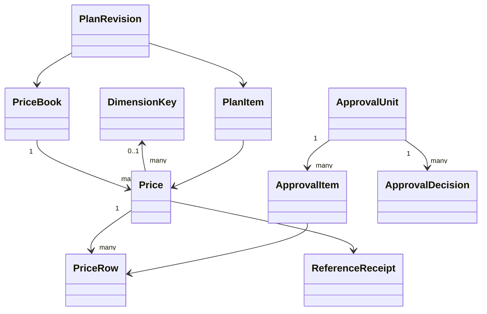
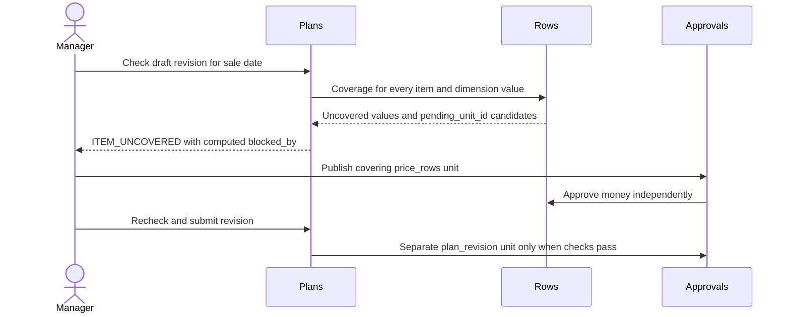

<!-- CONFLUENCE_TITLE: [BSS]: Pricing — PriceBook Design -->
<!-- Related: ./PRD.md, ./DECISIONS.md, ./design/ | Owners: BSS Pricing team -->

# DESIGN — Pricing: PriceBook

- [ ] `p1` - **DESIGN implementation status**

<!-- toc -->

- [1. Architecture Overview](#1-architecture-overview)
  - [1.1 Architectural Vision](#11-architectural-vision)
  - [1.2 Architecture Drivers](#12-architecture-drivers)
  - [1.3 Architecture Layers](#13-architecture-layers)
- [2. Principles & Constraints](#2-principles--constraints)
  - [2.1 Design Principles](#21-design-principles)
  - [2.2 Constraints](#22-constraints)
- [3. Technical Architecture](#3-technical-architecture)
  - [3.1 Domain Model](#31-domain-model)
  - [3.2 Component Model](#32-component-model)
  - [3.3 API Contracts](#33-api-contracts)
  - [3.4 Internal Dependencies](#34-internal-dependencies)
  - [3.5 External Dependencies](#35-external-dependencies)
  - [3.6 Interactions & Sequences](#36-interactions--sequences)
  - [3.7 Database schemas & tables](#37-database-schemas--tables)
- [4. Additional context](#4-additional-context)
- [5. Traceability](#5-traceability)

<!-- /toc -->

## 1. Architecture Overview

### 1.1 Architectural Vision

Products owns the SKU registry and reference barrier; Pricing owns per-currency books and immutable approved
money chains. A shared approval engine governs proposed business content through gear-local transactions.
Plans/promotions/migration requests arrive in phase 3; consumer resolution and quote arrive in phase 4.
This is the target design, not a claim that the legacy pricing implementation has already been replaced.

Authority is the PriceBook spec §2, §2.2 and §13, then [DECISIONS](DECISIONS.md), then code, then prose.
The plan's D-399 deviation removes the phase 2 SkuChanged listener; current SKU facts come from ProductsClient.

### 1.2 Architecture Drivers

| Requirement | Driver | Satisfied by |
| --- | --- | --- |
| `cpt-cf-bss-pricing-fr-dimension-registry` | A tenant registry stores dimension keys and their allowed values, seeded with region: with nothing stored, GET /dimension-keys reads region with no values, and the first price naming it stores the seed in its own transaction. A key has no values yet or at least two (DIM_VALUES_FEW). | Books & Prices, phase 2; §3 and slice 02. |
| `cpt-cf-bss-pricing-fr-price-book` | A book has a tenant-unique code, name, immutable currency and optional valid_from/valid_until dates. | Books & Prices, phase 2; §3 and slice 02. |
| `cpt-cf-bss-pricing-fr-price-key` | Inside a book there is one price per (sku_id, charge_kind, period), with null period normalized for uniqueness. | Books & Prices, phase 2; §3 and slice 02. |
| `cpt-cf-bss-pricing-fr-price-row` | Draft rows carry model, price_json, dates, optional dim_value and min_fee, eligibility all or new, note and author. | Rows, Windows & Dimension, phase 2; §3 and slice 03. |
| `cpt-cf-bss-pricing-fr-chain-windows` | Windows are half-open and close independently for each (price_id, dim_value), including the null default chain. | Rows, Windows & Dimension, phase 2; §3 and slice 03. |
| `cpt-cf-bss-pricing-fr-pair-guard` | On a usage chain, a successor preserves model kind, package size and SKU metering as of each row's start (D-402). | Rows, Windows & Dimension, phase 2; §3 and slice 03. |
| `cpt-cf-bss-pricing-fr-min-fee` | The floor belongs to a row per subscription per billing period, aggregating every value and slice rated by that row. | Rows, Windows & Dimension, phase 2; §3 and slice 03. |
| `cpt-cf-bss-pricing-fr-temporary-pair` | A temporary change on an existing chain creates two rows in one approval unit. | Rows, Windows & Dimension, phase 2; §3 and slice 03. |
| `cpt-cf-bss-pricing-fr-publish-changes` | Publish changes lists all draft rows of one book with full money, window, chain, predecessor and impact information, all pre-selected. | Approvals, phase 2; §3 and slice 05. |
| `cpt-cf-bss-pricing-fr-approval-units` | Use bss-approval for price_rows now and plan_revision, promotion and migration in phase 3. | Approvals, phase 2; §3 and slice 05. |
| `cpt-cf-bss-pricing-fr-reference-protocol` | Before reserve, claim the key and persist a create_price op; reserve with Products, re-read the SKU, commit the price with reference_state = confirmation_pending and op written, then confirm and atomically finish the op and answer the key (D-401). | Rows, Windows & Dimension, phase 2; §3 and slice 03. |
| `cpt-cf-bss-pricing-fr-book-export` | Provide one read-only JSON export of a tenant-scoped book with its prices and rows. | Books & Prices, phase 2; §3 and slice 02. |
| `cpt-cf-bss-pricing-fr-settings` | Tenant settings provide default billing timing, rounding, GL code, tax category and invoice-line templates by SKU type. | Books & Prices, phase 2; §3 and slice 02. |
| `cpt-cf-bss-pricing-fr-events` | Persist PriceRowsPublished and ApprovalUnitDecided with state and audit in the toolkit outbox, using broker TypedEvent envelopes; include PriceReferenceLost for a failed reference confirmation that proves release. | Read Contract & Events, phase 2; §3 and slice 07. |
| `cpt-cf-bss-pricing-fr-plans` | A plan has immutable published revisions; each revision binds one book and contains paid, optional or included items, availability, minimal Grants and optional sold-as bundle SKU. | Plans, phase 3; §3 and slice 04. |
| `cpt-cf-bss-pricing-fr-promotions` | A dated percentage promotion targets plans and recurring or recurring-plus-usage charges. | Promotions & Migrations, phase 3; §3 and slice 06. |
| `cpt-cf-bss-pricing-fr-migrations` | An approved migration_request records target plan/revision, subscription ids, next_renewal or explicit date, and the period-aware preview, then emits SubscriptionMigrationRequested. | Promotions & Migrations, phase 3; §3 and slice 06. |
| `cpt-cf-bss-pricing-fr-resolve` | GET /pricing/v1/resolve accepts plan_revision_id, date and optional pins and returns each item's full default/value chain matrix and active promotion (id, version), without totals. | Read Contract & Events, phase 4; §3 and slice 07. |
| `cpt-cf-bss-pricing-fr-price-row-read` | GET /pricing/v1/price-rows/{id} serves a pinned row forever, including closed, superseded and keep_for_bound rows. | Read Contract & Events, phase 4; §3 and slice 07. |
| `cpt-cf-bss-pricing-fr-quote` | GET /pricing/v1/quote is the Studio preview with quantities and optional-item choices, returning totals. | Read Contract & Events, phase 4; §3 and slice 07. |
| `cpt-cf-bss-pricing-nfr-authz` | Every door authenticates and enforces deny-by-default pricing:read, author, submit, approve or settings through PolicyEnforcer. | Foundation, phase 2; §3 and slice 01. |
| `cpt-cf-bss-pricing-nfr-audit` | Append tenant, actor, subject, correlation and before/after facts with each governed act. | Foundation, phase 2; §3 and slice 01. |
| `cpt-cf-bss-pricing-nfr-tenant-isolation` | Every repository uses SecureORM and PDP-derived AccessScope; child rows are reached through scoped parents. | Foundation, phase 2; §3 and slice 01. |
| `cpt-cf-bss-pricing-nfr-two-backends` | The fresh migration chain, constraints and transactional rules work on SQLite and Postgres. | Foundation, phase 2; §3 and slice 01. |
| `cpt-cf-bss-pricing-nfr-idempotency-concurrency` | All pricing POSTs require Idempotency-Key; PATCH/PUT require If-Match. | Foundation, phase 2; §3 and slice 01. |

| Architectural decision | Effect |
| --- | --- |
| `cpt-cf-bss-pricing-adr-book-per-currency` | Books own currency and price identity; plans select a book. |
| `cpt-cf-bss-pricing-adr-row-chains-per-dimension-value` | Windows normalize per value with default fallback. |
| `cpt-cf-bss-pricing-adr-one-approval-unit-shape` | One engine, independent subjects, generation-aware review. |
| `cpt-cf-bss-pricing-adr-reference-reservation` | Synchronous reserve, local commit and durable confirm/release recovery. |

### 1.3 Architecture Layers

REST doors → pure domain rules and ApprovalSubjects → SecureORM repositories and shared approval Store.
Ports isolate ProductsClient, the broker and clock. Infrastructure wires configuration, authz, scoped transactions,
toolkit outbox dispatch and durable reference retry. Pure book/price/row/money rules port the prototype with
half-open band boundaries corrected by D-387. There is no domain filesystem dependency or SKU cache.

## 2. Principles & Constraints

### 2.1 Design Principles

**ID**: `cpt-cf-bss-pricing-principle-book-money-independent`

Book money and revision structure are independent facts. A rejected revision does not undo approved rows.
Bindings preserve the money row and dated SKU descriptors needed to replay an invoice.

**ID**: `cpt-cf-bss-pricing-principle-reserve-before-write`

Reserve before a durable reference; release only after durable cancellation or removal. A timeout is not proof
of rollback. Products keeps an unresolved reservation live and refuses retirement while it exists.

**ID**: `cpt-cf-bss-pricing-principle-business-content-fingerprint`

Hash proposed item business content and common date, excluding locks, versions and operational metadata.
Drift refreshes the unit, making old decisions stale; reviewers must see and vote on the new generation.

### 2.2 Constraints

**ID**: `cpt-cf-bss-pricing-constraint-two-backends`

SQLite and Postgres share invariants and scoped repository behavior. The migration chain starts at 000001;
stand data is not migrated. Both schema goldens and real writer races are implementation gates.

**ID**: `cpt-cf-bss-pricing-constraint-no-row-locks`

SecureORM has no FOR UPDATE. Conditional versions and pending ownership serialize subjects; Postgres uses
serializable transactions for chain changes. Retry serialization once, with SQLite lock-upgrade errors using the
same bounded transaction retry path. Clone attempt inputs and re-read guards inside each attempt.

**ID**: `cpt-cf-bss-pricing-constraint-one-replay-store`

Require Idempotency-Key for POST and If-Match for PATCH/PUT. A 24-hour scoped replay store owns claims and
responses; no approval-unit key exists. A retry cannot allocate an unrelated price/ref_id before consulting replay.

## 3. Technical Architecture

### 3.1 Domain Model

PriceBook contains Price; Price contains PriceRow chains keyed by nullable dim_value. SKU type determines
charge_kind; period is recurring-only. A row carries a pricing model and inputs, min_fee, eligibility, dates,
state and approval attribution. It contains no frozen descriptors. PlanRevision, PlanItem, Promotion and
MigrationRequest are phase 3 types; phase 4 assembles Resolution and Quote outputs.



Approved rows are immutable money facts. Conditional normalization may close predecessor windows and set
keep_for_bound when the successor is new; it cannot rewrite money or remove historical pins. Value chains can
end explicitly. Tier arithmetic uses decimal/money types without binary float rounding and [from, to) bands.
Every decimal of a price (amount, rate, package size and price, tier up_to and rate) travels as a JSON string;
a JSON number is refused 400 AMOUNT_INVALID, because reading it would round it through f64.
Min-fee accounting groups by row/subscription/period across values and slices before promotions.

### 3.2 Component Model

#### Books

**ID**: `cpt-cf-bss-pricing-component-books`

Phase 2: dimension registry, settings, book validity, price identity and read-only export.

#### Rows

**ID**: `cpt-cf-bss-pricing-component-rows`

Phase 2: row models, chain normalization, pair guard, minimum fees and temporary pairs.

#### Approvals

**ID**: `cpt-cf-bss-pricing-component-approvals`

Phase 2 price_rows subject and unit doors; phase 3 plan_revision, promotion and migration subjects. Shared Store and engine, generation refresh, SoD and atomic terminal acts.

#### Reservations client

**ID**: `cpt-cf-bss-pricing-component-reservations-client`

Phase 2: ProductsClient reserve/re-read/write/confirm and durable cancellation/release. Persist reference loss. Phase 3 extends the protocol to plan_item and sold_as.

#### Events

**ID**: `cpt-cf-bss-pricing-component-events`

Phase 2 core TypedEvent payloads and toolkit outbox dispatcher; phase 3 adds plan, promotion and migration-request events.

#### Plans

**ID**: `cpt-cf-bss-pricing-component-plans`

Phase 3: revision composition, sale-date checks, blocked_by, clone and retirement prerequisites.

#### Promotions and migrations

**ID**: `cpt-cf-bss-pricing-component-promotions`

Phase 3: nonoverlapping versioned promotions and approved migration requests, without executing subscription moves.

#### Read contract

**ID**: `cpt-cf-bss-pricing-component-read-contract`

Phase 4: resolve matrix, renewal walk, period bindings, durable pin reads and Studio quote; versioned Products reads at binding time.

### 3.3 API Contracts

The mounted authoring base is `/bss-pricing/v1`. Every mutation passes authenticated PolicyEnforcer scope,
headers + Bytes, preconditions::parse_body and correlation::establish. OperationBuilder registers matching
OpenAPI success/error schemas. POST requires Idempotency-Key; PATCH/PUT require If-Match. Queue reads return
stored snapshots and live impact: every GET /approval-units item, GET /approval-units/{id} and the GET
publish-changes listing carry the same impact object, {rows, prices, plans, subscriptions}; in phase 2 plans and
subscriptions read "unavailable until phase 3". Never label unavailable phase 3 impact as a measured zero.

| Area | Phase | Operations below the authoring base |
| --- | --- | --- |
| Books | 2 | POST/GET /price-books; GET/PATCH /price-books/{id}; GET /price-books/{id}/prices; GET /price-books/{id}/export |
| Prices | 2 | POST /price-books/{id}/prices with sku_id, period?, dimension_key?; PATCH /prices/{id} for invoice_line_override and permitted dimension_key changes; DELETE /prices/{id} answers 204 once removed, deleting its draft and rejected rows with it; approved or pending rows refuse 409 PRICE_ROWS_IN_USE |
| Rows | 2 | POST /prices/{id}/rows; PATCH/DELETE /rows/{id} draft only, by its author (D-404); POST /rows/{id}/submit; POST /price-books/{id}/publish-changes with row_ids? and common_effective_date? |
| Approval units | 2 | GET /approval-units?state&kind&ref_id; GET /approval-units/{id}; POST /approval-units/{id}/approve or /reject with generation, /withdraw by submitter |
| Policy/settings | 2 | GET/PUT /approval-policy, /settings, /dimension-keys |
| Plans | 3 | POST/GET /plans; POST /plans/{id}/revisions; PATCH /plan-revisions/{id}; GET /plan-revisions/{id}/checks; POST /plan-revisions/{id}/submit; POST /plans/{id}/clone, /retire, /migrations |
| Promotions | 3 | POST /promotions; PATCH /promotions/{id} draft; POST /promotions/{id}/submit, /end-today, /cancel |

The consumer surface named by spec §7.1 is `GET /pricing/v1/resolve` and `GET /pricing/v1/price-rows/{id}`.
Phase 4 explicitly wires those paths and golden contracts; it also provides `GET /pricing/v1/quote` for Studio.
Fields/query parameters are snake_case, including plan_revision_id, price_row_id, dim_value, dim_used, sku_version,
billing_timing, rounding_policy, promotion_id and promotion_version. Resolve returns inputs, not totals.

| Condition | Response |
| --- | --- |
| Products unavailable before reservation/write | 503 REGISTRY_UNAVAILABLE; no price |
| SKU fenced / retiring or retired / deprecated / draft for a new price | 409 SKU_FENCED (Products' reserve refusal, passed through) / SKU_RETIRING / SKU_DEPRECATED / SKU_DRAFT |
| Bundle SKU, or a SKU type that no longer matches the charge kind | 409 BUNDLE_SKU_NOT_PRICEABLE / CHARGE_KIND_SKU_TYPE |
| Products refuses a dated SKU read (for example no SKU read) | Products' own status and code; only unavailability is 503 REGISTRY_UNAVAILABLE (D-402) |
| Usage-chain structure changed | 400 CHAIN_MODEL_CHANGED (D-403) |
| A temporary's return (or closed end) no longer matches the approved chain | 400 PAIR_RETURN_STALE at submit; APPLY_REFUSED at apply (D-391) |
| Invalid dimension or row window | DIM_KEY_INVALID, DIM_VALUES_FEW, DIM_VALUE_UNKNOWN, DIM_NOT_DECLARED, WINDOW_START_IN_PAST or WINDOW_OVERLAP; validation rejection |
| Money sent as a JSON number; NUL in body text | 400 AMOUNT_INVALID; 400 VALIDATION |
| Removing a registry key a price names / a value a row uses | 409 DIMENSION_KEY_IN_USE / DIM_VALUE_IN_USE |
| Edit or delete of a row that is not an unlocked draft (a pending row included) | 409 ROW_NOT_DRAFT |
| Stale If-Match, or a conditional write that lost its version | 409 STALE_REVISION |
| A row another pending unit owns, at submit; a contended unit | 409 ROW_LOCKED_PENDING; 409 UNIT_CONTENDED |
| Transaction still contended after its bounded retries | 409 CONTENDED; UNIT_CONTENDED at an approval-unit door (submit, publish-changes, approve, reject, withdraw) |
| Author approval; a draft row edited or deleted by anyone but its author | 403 SOD_VIOLATION; 403 NOT_DRAFT_AUTHOR (D-404) |
| Generation changed or content drift | 400 GENERATION_MISMATCH or committed UNIT_STALE with current generation |
| Duplicate vote / terminal unit / wrong withdrawer | 409 DUPLICATE_VOTE / UNIT_ALREADY_DECIDED; 403 NOT_SUBMITTER |
| Apply environment changed | APPLY_REFUSED, transaction rolls back |
| Released receipt on confirm | 409 REFERENCE_RELEASED from Products; the price stays confirmation_pending and a rereserve_price op re-reserves it; lost only when the SKU is fenced, retiring or retired (D-401) |

Canonical toolkit RFC-9457 Problem carries code, field and message, retaining typed DbErr for retry classification.
Malformed body/precondition failures occur before domain work. A body string (value or key) that contains a NUL
character is 400 VALIDATION at parse_body, before any database work, so SQLite and Postgres answer alike. All four existing route censuses must agree with
mounted operations, permissions and preconditions; no Json<T> extractor replaces the retained pricing door shape.

### 3.4 Internal Dependencies

bss-approval supplies the engine, policy selection, Store contract, generation-aware decisions and prefixed DDL.
Repositories accept &impl DBRunner so state, items, replay, audit and outbox share the caller's transaction.
Toolkit database retries use per-attempt cloned inputs. Broker TypedEvent defines the durable event envelope;
outbox_migrations_with_prefix("bss_pricing_outbox") belongs in DatabaseCapability, with a live dispatcher.

### 3.5 External Dependencies

Products registers LocalReferenceRegistry::for_owner("pricing") during init under the
PricingReferenceRegistry ClientHub key. Pricing lazily resolves ReferenceRegistryV1 at each use; absence
returns 503 REGISTRY_UNAVAILABLE and does not prevent boot. Ownership is bound by Products, never by
request input. This is an explicit same-binary, same-deployment trust boundary. Calls use the caller's
subject for audit and record the bound owner. PRICING_SYSTEM_ACTOR with subject type bss-pricing.system
uses only the operation tenant's scope and is audited as system; other system subjects are refused.
A future out-of-process transport uses the REST reference_principals mapping and pricing's configured
service_principal_id credentials with the same semantics; that transport is not implemented here.
The fresh sku_for_write read accepts every lifecycle; sku_version_as_of resolves the version in force
at each row start for the D-402 pair guard.
Reserve is idempotent on the live logical reference, not on a released receipt. The same tenant and SKU must be
bound to the receipt and object. Products versions?as_of provides descriptor history in phase 4. There is no
SkuChanged listener/local SKU read model in phase 2 (D-399). Subscriptions migration execution and Rating
adaptation are independent programmes; approval here cannot claim a subscription moved.

### 3.6 Interactions & Sequences

#### Publish changes

**ID**: `cpt-cf-bss-pricing-seq-publish-changes`

```mermaid
sequenceDiagram
  actor Author
  actor Reviewer
  participant Pricing
  participant DB
  Author->>Pricing: Select draft rows and common_effective_date
  Pricing->>DB: Replay check; transaction claim, collect, validate, unit, items, conditional ownership
  Pricing->>DB: Submission audit; quorum zero applies in same transaction
  Pricing-->>Author: Unit snapshot and generation
  Reviewer->>Pricing: Approve with generation and new client key
  Pricing->>DB: Conditional unit version; check SoD; recollect fingerprint
  alt Content drift
    Pricing->>DB: Refresh items/snapshot/hash; bump generation; stale earlier votes; commit receipt
    Pricing-->>Reviewer: UNIT_STALE with new generation
  else Quorum reached
    Pricing->>DB: Revalidate chains; normalize windows; approve; audit and toolkit outbox; commit
    Pricing-->>Reviewer: Approved
  else More votes needed
    Pricing->>DB: Commit current-generation vote
    Pricing-->>Reviewer: Pending
  end
```

A generation mismatch counts no vote. Apply failures roll back. Unit writes use version predicates and price
chains are acquired in ascending id before rows, preventing inverse ordering across batches. Rejection and
withdrawal clear only owned pending locks and emit the terminal event without PriceRowsPublished.

#### Reserve, write, confirm

**ID**: `cpt-cf-bss-pricing-seq-reserve-write-confirm`

```mermaid
sequenceDiagram
  participant Caller
  participant Pricing
  participant Products
  participant DB
  participant Retry
  Caller->>Pricing: Create price, Idempotency-Key
  Pricing->>DB: Replay first; Tx A claim key, mint price_id, create_price op reserving
  Pricing->>Products: Reserve SKU reference (price, price_id), idempotently
  Products-->>Pricing: reservation_id or fence/unavailable error
  Pricing->>Products: Re-read SKU type and lifecycle
  alt Write permitted
    Pricing->>DB: Tx B price + reservation_id + reference_state confirmation_pending; op written
    Pricing->>Products: Confirm receipt
    alt Confirmation success
      Pricing->>DB: Tx C price confirmed, op done, key answered
    else Timeout or transient failure
      Retry->>Products: Resume written op with bounded backoff; never release on timeout
    else REFERENCE_RELEASED
      Pricing->>DB: Price stays confirmation_pending, rereserve_price op, op done, key answered
    end
  else Refusal after reserve
    Pricing->>DB: Op cancelling, persist outcome
    Retry->>Products: Release after cancellation is durable
    Retry->>DB: Op done, key answered
  end
```

Concurrent replays resolve to the same logical object or a nonmutating conflict. Tx A durably names the
reference before reserve: a crash between reserve and Tx B is recoverable by repeating the idempotent reserve.
An unknown commit outcome is reconciled before cancellation. Deletion removes the price and inserts a
delete_price op in releasing in one transaction, then release finishes the op. Every op not done is retried
with bounded backoff and never dropped. The ticker also checks confirmed prices through states(): a released
receipt on a live price starts a rereserve_price op when the SKU is not fenced, else the price becomes lost,
new rows fail PRICE_REFERENCE_LOST and PriceReferenceLost is emitted. A receipt released before its confirm
starts the same op; lost prices are re-reserved once their SKU admits a reservation again. No timeout
releases a reservation.

#### Temporary pair

**ID**: `cpt-cf-bss-pricing-seq-temporary-pair`

```mermaid
sequenceDiagram
  actor Author
  participant Rows
  participant Approvals
  participant DB
  Author->>Rows: Draft temporary_until for one chain
  Rows->>DB: Read existing chain and versionAt at end
  alt Existing chain
    Rows->>DB: Persist promo plus return with same dim_value and pair links
  else Previously unowned value
    Rows->>DB: Persist one closed row; no return copy of default
  end
  Author->>Approvals: Submit atomic set; optional common date
  Approvals->>DB: Shift both dates preserving duration; validate; conditional lock
  Approvals->>DB: On apply re-read chains; normalize per value; audit/outbox; commit
```

#### Blocked revision (phase 3)

**ID**: `cpt-cf-bss-pricing-seq-blocked-revision`



blocked_by is never a stored dependency graph or automatic submission trigger. Plan and row approval outcomes
remain independent. Rejecting the revision leaves the approved money visible to existing revisions on the book.

### 3.7 Database schemas & tables

This is the target Postgres schema shape in bss; SQLite omits bss., maps uuid/date/timestamptz/jsonb to text and
bytea to blob, preserving checks and indexes. Mutable tenant entities carry concurrency versions and timestamps.
Tenant-scoped parent checks accompany entity-id foreign keys. Approval children are accessed through scoped units.
The actual migrations are authored in phase 2c with schema goldens on both backends, not in Part 2a.

The four approval tables are exactly `bss_approval::ddl::up` with prefix `pricing_` (spec §6 with §2.2
corrections: no unit idempotency_key or unique key index); the schema goldens pin that shape on both backends.
The shared DDL supports all Pricing subject kinds; only price_rows is executable in phase 2. Plan/promotion/
migration tables are intentionally absent here and are added in phase 3, documented in slices 04 and 06.

```sql
CREATE TABLE bss.pricing_settings (
  tenant_id uuid PRIMARY KEY, default_timing text NOT NULL CHECK (default_timing IN ('advance','arrears')),
  default_rounding text NOT NULL, default_gl text, default_tax_category text,
  invoice_line_templates jsonb NOT NULL, version bigint NOT NULL DEFAULT 1,
  created_at timestamptz NOT NULL, updated_at timestamptz NOT NULL
);
CREATE TABLE bss.pricing_dimension_key (
  tenant_id uuid NOT NULL, key text NOT NULL, "values" jsonb NOT NULL,
  version bigint NOT NULL DEFAULT 1, PRIMARY KEY (tenant_id, key)
);
CREATE TABLE bss.pricing_price_book (
  id uuid PRIMARY KEY, tenant_id uuid NOT NULL, code text NOT NULL, name text NOT NULL,
  currency char(3) NOT NULL, valid_from date, valid_until date, version bigint NOT NULL DEFAULT 1,
  created_at timestamptz NOT NULL, updated_at timestamptz NOT NULL,
  UNIQUE (tenant_id, code), UNIQUE (tenant_id, id),
  CHECK (valid_from IS NULL OR valid_until IS NULL OR valid_from < valid_until)
);
CREATE TABLE bss.pricing_approval_policy (
  tenant_id uuid NOT NULL, kind text NOT NULL, quorum integer NOT NULL CHECK (quorum >= 0),
  PRIMARY KEY (tenant_id, kind)
);
CREATE TABLE bss.pricing_approval_unit (
  id uuid PRIMARY KEY, tenant_id uuid NOT NULL, kind text NOT NULL, ref_type text NOT NULL, ref_id uuid NOT NULL,
  state text NOT NULL CHECK (state IN ('pending','approved','rejected','withdrawn')),
  common_effective_date date, quorum_required integer NOT NULL,
  generation integer NOT NULL DEFAULT 1, submitted_by uuid NOT NULL, submitted_at timestamptz NOT NULL,
  decided_at timestamptz, decided_note text, snapshot jsonb NOT NULL, snapshot_hash text NOT NULL,
  version bigint NOT NULL DEFAULT 1
);
CREATE INDEX ix_pricing_approval_unit_queue ON bss.pricing_approval_unit USING btree
  (tenant_id, state, kind, submitted_at);
CREATE TABLE bss.pricing_approval_unit_item (
  unit_id uuid NOT NULL REFERENCES bss.pricing_approval_unit(id), tenant_id uuid NOT NULL, item_type text NOT NULL,
  item_id uuid NOT NULL, created_by uuid NOT NULL, before_json jsonb, after_json jsonb NOT NULL,
  PRIMARY KEY (unit_id, item_type, item_id)
);
CREATE TABLE bss.pricing_approval_decision (
  unit_id uuid NOT NULL REFERENCES bss.pricing_approval_unit(id), tenant_id uuid NOT NULL, actor uuid NOT NULL,
  generation integer NOT NULL, decision text NOT NULL CHECK (decision IN ('approve','reject')), note text,
  at timestamptz NOT NULL, stale boolean NOT NULL DEFAULT false, PRIMARY KEY (unit_id, actor, generation)
);
CREATE TABLE bss.pricing_price (
  id uuid PRIMARY KEY, tenant_id uuid NOT NULL, book_id uuid NOT NULL REFERENCES bss.pricing_price_book(id),
  sku_id uuid NOT NULL, charge_kind text NOT NULL CHECK (charge_kind IN ('recurring','usage','one_time')),
  period text, dimension_key text, invoice_line_override text,
  reservation_id uuid NOT NULL,
  reference_state text NOT NULL CHECK (reference_state IN ('confirmation_pending','confirmed','lost')),
  version bigint NOT NULL DEFAULT 1,
  created_at timestamptz NOT NULL, updated_at timestamptz NOT NULL,
  FOREIGN KEY (tenant_id, dimension_key) REFERENCES bss.pricing_dimension_key(tenant_id, key),
  CHECK ((charge_kind = 'recurring' AND period IS NOT NULL AND period IN ('month','year'))
    OR (charge_kind IN ('usage','one_time') AND period IS NULL))
);
CREATE UNIQUE INDEX pricing_price_key ON bss.pricing_price (book_id, sku_id, charge_kind, coalesce(period, ''));
CREATE TABLE bss.pricing_price_row (
  id uuid PRIMARY KEY, tenant_id uuid NOT NULL, price_id uuid NOT NULL REFERENCES bss.pricing_price(id),
  version_no integer NOT NULL, dim_value text,
  model text NOT NULL CHECK (model IN ('flat','per_unit','graduated','volume','package')), price_json jsonb NOT NULL,
  min_fee text CHECK (min_fee ~ '^[0-9]+(\.[0-9]+)?$'), eligibility text NOT NULL CHECK (eligibility IN ('all','new')),
  effective_from date NOT NULL, effective_to date, keep_for_bound boolean NOT NULL DEFAULT false,
  closed_explicitly boolean NOT NULL DEFAULT false,
  temporary_until date, paired_row_id uuid REFERENCES bss.pricing_price_row(id),
  return_of_row_id uuid REFERENCES bss.pricing_price_row(id),
  state text NOT NULL CHECK (state IN ('draft','pending','approved','rejected')),
  pending_unit_id uuid REFERENCES bss.pricing_approval_unit(id),
  approved_by_unit_id uuid REFERENCES bss.pricing_approval_unit(id), note text, created_by uuid NOT NULL,
  approved_at timestamptz, version bigint NOT NULL DEFAULT 1,
  created_at timestamptz NOT NULL, updated_at timestamptz NOT NULL,
  UNIQUE (price_id, version_no), CHECK (dim_value IS NULL OR dim_value <> ''),
  CHECK (effective_to IS NULL OR effective_from < effective_to)
);
CREATE UNIQUE INDEX pricing_price_row_approved_start
  ON bss.pricing_price_row (price_id, coalesce(dim_value, ''), effective_from) WHERE state = 'approved';
CREATE INDEX pricing_price_row_chain
  ON bss.pricing_price_row (price_id, dim_value, effective_from) WHERE state = 'approved';
CREATE TABLE bss.pricing_reference_op (
  op_id uuid PRIMARY KEY, tenant_id uuid NOT NULL,
  kind text NOT NULL CHECK (kind IN ('create_price','delete_price','rereserve_price')),
  price_id uuid NOT NULL, sku_id uuid NOT NULL, reservation_id uuid,
  idempotency_key text,
  state text NOT NULL CHECK (state IN ('reserving','written','cancelling','releasing','done')),
  outcome text, attempts integer NOT NULL DEFAULT 0, next_attempt_at timestamptz NOT NULL,
  last_error text, created_by uuid NOT NULL, created_at timestamptz NOT NULL, updated_at timestamptz NOT NULL
);
CREATE INDEX pricing_reference_op_due ON bss.pricing_reference_op (state, next_attempt_at) WHERE state <> 'done';
```

Policy kind is '*' or a registered pricing kind; a missing default fails safe to quorum 1. Subject validation
owns kind legality, quorum snapshots and item typing. The pending-unit column plus version predicate admits
one unit per element. Same-start uniqueness is enforced by the index; general non-overlap is enforced by the
serializable approve transaction re-reading each chain, with prices and rows ordered by id. Approved money
cannot be edited/deleted; only controlled window normalization and keep_for_bound changes are allowed.
The reference op is durable before reserve and has no FK to the price: it survives cancellation and removal.
The ticker resumes every op not done with bounded backoff and never drops one. It reconciles confirmed prices
through states(): released receipts are re-reserved when the SKU is not fenced, otherwise the price becomes
lost, refuses new rows with PRICE_REFERENCE_LOST and emits PriceReferenceLost (D-401).
Settings and dimension values are versioned direct edits; invalid keys/value lists fail domain validation.

Audit and idempotency use the Products document's retained shapes, renamed pricing_. The audit trigger permits
only the reserved one-way seal transition without changing record facts. The following is schema, not a new
pricing-owned outbox: the actual event schema comes from toolkit migrations under bss_pricing_outbox (D-400).

```sql
CREATE TABLE bss.pricing_audit (
            audit_id          uuid        NOT NULL,
            tenant_id         uuid        NOT NULL,
            actor_ref         uuid        NOT NULL,
            action            text        NOT NULL,
            subject_kind      text        NOT NULL,
            subject_id        uuid,
            subject_revision  bigint,
            error_code        text,
            attempted_key     text,
            reason            text,
            correlation_id    text,
            written_at        timestamptz NOT NULL,
            session_id        uuid,
            ceremony_ref      uuid,
            seal_state        text        NOT NULL,
            chain_id          uuid,
            seq               bigint,
            prev_hash         bytea,
            row_hash          bytea,
            CONSTRAINT pricing_audit_pkey PRIMARY KEY (audit_id),
            CONSTRAINT chk_pricing_audit_seal_state CHECK (seal_state IN ('unsealed', 'sealed')),
            CONSTRAINT chk_pricing_audit_seal_group CHECK (
                (seal_state = 'unsealed' AND chain_id IS NULL AND seq IS NULL AND prev_hash IS NULL AND row_hash IS NULL)
                OR
                (seal_state = 'sealed' AND chain_id IS NOT NULL AND seq IS NOT NULL AND row_hash IS NOT NULL)
            ),
            CONSTRAINT chk_pricing_audit_seq CHECK (seq IS NULL OR seq >= 0),
            CONSTRAINT chk_pricing_audit_subject_ref CHECK (subject_id IS NOT NULL OR attempted_key IS NOT NULL OR session_id IS NOT NULL)
        );

CREATE INDEX idx_pricing_audit_tenant_time ON bss.pricing_audit USING btree (tenant_id, written_at);

CREATE INDEX idx_pricing_audit_subject ON bss.pricing_audit USING btree (tenant_id, subject_kind, subject_id, written_at);

CREATE INDEX idx_pricing_audit_actor ON bss.pricing_audit USING btree (tenant_id, actor_ref, written_at);

CREATE OR REPLACE FUNCTION bss.pricing_audit_append_only() RETURNS trigger AS $$
        BEGIN
          IF TG_OP = 'DELETE' THEN
            RAISE EXCEPTION 'pricing_audit is append-only: DELETE is not permitted';
          END IF;

          IF OLD.seal_state = 'unsealed'
             AND NEW.seal_state = 'sealed'
             AND NEW.chain_id IS NOT NULL
             AND NEW.seq IS NOT NULL
             AND NEW.row_hash IS NOT NULL
             AND NEW.audit_id IS NOT DISTINCT FROM OLD.audit_id
             AND NEW.tenant_id IS NOT DISTINCT FROM OLD.tenant_id
             AND NEW.actor_ref IS NOT DISTINCT FROM OLD.actor_ref
             AND NEW.action IS NOT DISTINCT FROM OLD.action
             AND NEW.subject_kind IS NOT DISTINCT FROM OLD.subject_kind
             AND NEW.subject_id IS NOT DISTINCT FROM OLD.subject_id
             AND NEW.subject_revision IS NOT DISTINCT FROM OLD.subject_revision
             AND NEW.error_code IS NOT DISTINCT FROM OLD.error_code
             AND NEW.attempted_key IS NOT DISTINCT FROM OLD.attempted_key
             AND NEW.reason IS NOT DISTINCT FROM OLD.reason
             AND NEW.correlation_id IS NOT DISTINCT FROM OLD.correlation_id
             AND NEW.written_at IS NOT DISTINCT FROM OLD.written_at
             AND NEW.session_id IS NOT DISTINCT FROM OLD.session_id
             AND NEW.ceremony_ref IS NOT DISTINCT FROM OLD.ceremony_ref
          THEN
            RETURN NEW;
          END IF;

          RAISE EXCEPTION 'pricing_audit is append-only: % is not permitted', TG_OP;
        END;
     $$ LANGUAGE plpgsql;

CREATE TRIGGER trg_pricing_audit_append_only BEFORE DELETE OR UPDATE ON bss.pricing_audit FOR EACH ROW EXECUTE FUNCTION bss.pricing_audit_append_only();
```

```sql
CREATE TABLE bss.pricing_idempotency (
            tenant_id       uuid        NOT NULL,
            endpoint        text        NOT NULL,
            client_key      text        NOT NULL,
            state           text        NOT NULL,
            payload_hash    bytea       NOT NULL,
            response_status integer,
            response_body   jsonb,
            expires_at      timestamptz NOT NULL,
            entity_ref      uuid,
            CONSTRAINT pricing_idempotency_pkey PRIMARY KEY (tenant_id, endpoint, client_key),
            CONSTRAINT chk_pricing_idempotency_state CHECK (state IN ('claimed', 'answered')),
            CONSTRAINT chk_pricing_idempotency_response_group CHECK (
                (state = 'claimed' AND response_status IS NULL AND response_body IS NULL)
                OR
                (state = 'answered' AND response_status IS NOT NULL AND response_body IS NOT NULL)
            )
        );

CREATE INDEX idx_pricing_idempotency_expires ON bss.pricing_idempotency USING btree (tenant_id, expires_at);
```

The replay store retains responses for 24 hours and rejects payload mismatches. An unknown transaction outcome
is reconciled by replay/entity_ref before compensation. Audit inserts and terminal events use the same transaction;
no separate connection can make a failed act look successful. Implement append-only audit guards on SQLite too.

## 4. Additional context

The old 22-file set remains on bss/products-backup and in history. Seven slices map one-to-one to FEATUREs.
Part 2a writes all phases' contracts; phase 2b removes the legacy implementation; phase 2c builds only the core.
The prototype is the pure-model reference except where the spec corrects it, especially half-open tier bands.

## 5. Traceability

| Slice | Feature | Requirements / delivery |
| --- | --- | --- |
| 01 Foundation | foundation | `cpt-cf-bss-pricing-nfr-authz`, `cpt-cf-bss-pricing-nfr-audit`, `cpt-cf-bss-pricing-nfr-tenant-isolation`, `cpt-cf-bss-pricing-nfr-two-backends`, `cpt-cf-bss-pricing-nfr-idempotency-concurrency`; phase 2. |
| 02 Books & Prices | books-prices | `cpt-cf-bss-pricing-fr-dimension-registry`, `cpt-cf-bss-pricing-fr-price-book`, `cpt-cf-bss-pricing-fr-price-key`, `cpt-cf-bss-pricing-fr-book-export`, `cpt-cf-bss-pricing-fr-settings`; phase 2. |
| 03 Rows, Windows & Dimension | rows-windows-dimension | `cpt-cf-bss-pricing-fr-price-row`, `cpt-cf-bss-pricing-fr-chain-windows`, `cpt-cf-bss-pricing-fr-pair-guard`, `cpt-cf-bss-pricing-fr-min-fee`, `cpt-cf-bss-pricing-fr-temporary-pair`, `cpt-cf-bss-pricing-fr-reference-protocol`; phase 2. |
| 04 Plans | plans | `cpt-cf-bss-pricing-fr-plans`; phase 3. |
| 05 Approvals | approvals | `cpt-cf-bss-pricing-fr-publish-changes`, `cpt-cf-bss-pricing-fr-approval-units`; phase 2. |
| 06 Promotions & Migrations | promotions-migrations | `cpt-cf-bss-pricing-fr-promotions`, `cpt-cf-bss-pricing-fr-migrations`; phase 3. |
| 07 Read Contract & Events | read-contract-events | `cpt-cf-bss-pricing-fr-events`, `cpt-cf-bss-pricing-fr-resolve`, `cpt-cf-bss-pricing-fr-price-row-read`, `cpt-cf-bss-pricing-fr-quote`; phase 4 (core events in phase 2). |

All four ADRs are cited in §1.2. [PRD](PRD.md) owns requirements; [DECISIONS](DECISIONS.md) owns D-384–D-400.
Source: `docs/superpowers/specs/2026-09-24-pricebook-model-design.md`, §2.2, §5–§8, §12–§13.
