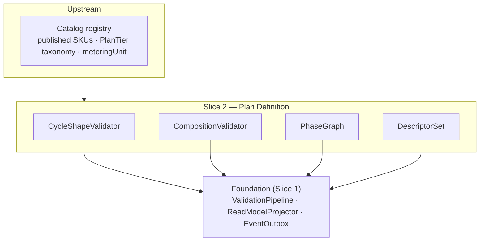

<!-- CONFLUENCE_TITLE: [BSS]: Pricing — Plan Definition, Billing Cycles & Composition (Design, Slice 2) -->
<!-- Related: ../PRD.md, ../DESIGN.md, ./01-foundation.md | Owners: BSS Product Catalog team -->

# DESIGN — Plan Definition, Billing Cycles & Composition (Slice 2)

<!-- toc -->

- [1. Context](#1-context)
  - [1.1 Overview](#11-overview)
  - [1.2 Purpose](#12-purpose)
  - [1.3 Actors](#13-actors)
  - [1.4 References](#14-references)
  - [1.5 Scope](#15-scope)
  - [1.6 Constraints & Assumptions](#16-constraints--assumptions)
  - [1.7 Naming & Design-Introduced Names](#17-naming--design-introduced-names)
  - [1.8 Context & Dependencies](#18-context--dependencies)
- [2. Actor Flows (CDSL)](#2-actor-flows-cdsl)
  - [Author a Plan](#author-a-plan)
  - [Publish a Plan](#publish-a-plan)
- [3. Processes / Business Logic (CDSL)](#3-processes--business-logic-cdsl)
  - [Billing-Cycle Shape Validation](#billing-cycle-shape-validation)
  - [Plan Composition Validation](#plan-composition-validation)
  - [Phase Schedule Validation](#phase-schedule-validation)
  - [Billing Descriptor Completeness](#billing-descriptor-completeness)
- [4. States (CDSL)](#4-states-cdsl)
  - [Plan Lifecycle State Machine](#plan-lifecycle-state-machine)
- [5. API Surface](#5-api-surface)
- [6. Data Model](#6-data-model)
- [7. Events & Alarms](#7-events--alarms)
- [8. Definitions of Done](#8-definitions-of-done)
  - [Billing-Cycle Matrix](#billing-cycle-matrix)
  - [Plan Composition & PlanTier](#plan-composition--plantier)
  - [Phases](#phases)
  - [Descriptors](#descriptors)
- [9. Acceptance Criteria](#9-acceptance-criteria)
- [10. Non-Functional Considerations](#10-non-functional-considerations)

<!-- /toc -->

## 1. Context

### 1.1 Overview

This slice owns the **shape of a Plan**: the billing-cycle matrix (one-time / recurring /
usage-based / hybrid), custom frequency, per-seat quantity provenance, the optional one-time
setup row, mandatory `PlanTier`, meter injectivity, add-on rules, plan phases with
`convertsToPhaseId`, and the billing descriptor set. It registers its validation rules into
the Foundation's fail-closed pipeline and its fields into the read-model projection; it owns
**no publish mechanics** — everything publishes through the Foundation
([`01-foundation.md`](./01-foundation.md) §4.2).

**Traces to**: `cpt-cf-bss-pricing-fr-billing-cycles`, `cpt-cf-bss-pricing-fr-custom-frequency`,
`cpt-cf-bss-pricing-fr-hybrid-completeness`, `cpt-cf-bss-pricing-fr-per-seat`,
`cpt-cf-bss-pricing-fr-one-time-setup`, `cpt-cf-bss-pricing-fr-plantier-mandatory`,
`cpt-cf-bss-pricing-fr-meter-injective`, `cpt-cf-bss-pricing-fr-addon-rules`,
`cpt-cf-bss-pricing-fr-billing-descriptors`, `cpt-cf-bss-pricing-fr-plan-phases`

### 1.2 Purpose

Give Finance/Product a self-service way to author every launch commercial shape on one
`planId` — recurring base + usage + optional setup, per-seat with explicit quantity
provenance, phased trial→intro→evergreen — such that an invalid or ambiguous shape **cannot
publish** and a published shape is completely resolvable by Subscriptions/Tariffs/Billing
without defaults.

### 1.3 Actors

| Actor | Role in Slice |
|-------|---------------|
| `cpt-cf-bss-pricing-actor-finance-manager` | Authors plans, cycles, phases; submits for publish |
| `cpt-cf-bss-pricing-actor-product-manager` | Configures add-on rules and composition |
| `cpt-cf-bss-pricing-actor-catalog-registry` | Supplies published SKUs, `PlanTier` taxonomy, `meteringUnit` declarations |
| `cpt-cf-bss-pricing-actor-subscriptions` | Consumes phase map, `displayTrialDays`, sellability inputs |
| `cpt-cf-bss-pricing-actor-rating` | Consumes the meter mapping (injectivity guarantee) |
| `cpt-cf-bss-pricing-actor-billing` | Consumes billing descriptors via `CatalogVersion` |

### 1.4 References

- **PRD**: [PRD.md](../PRD.md) — §6.1, §6.3, §17.1 (billing-cycle matrix), §17.3 (composition rules)
- **Design**: [01-foundation.md](./01-foundation.md) — publish contract (§4.2), scope key (§4.1), schema ownership
- **Dependencies**: Foundation (Slice 1). Co-required with price-structure (Slice 3): a rateable plan needs both a shape and a model kind.

### 1.5 Scope

**In scope**: billing cycles + custom frequency metadata; hybrid completeness; per-seat
quantity provenance concept (persistence + validation of `quantitySource`: Slice 3); one-time
setup row validation; `PlanTier` mandatory + SKU-equality check;
meter injectivity; add-on rules (dependency, bounds, override reference); phases (ordering,
`convertsToPhaseId`, terminal phase, `displayTrialDays`); billing descriptor completeness.

**Out of scope**: tier bands / model kinds (Slice 3); bundles (Slice 8); windows/sellability
enforcement (Slice 7); trial runtime, entitlement enforcement, proration math (Subscriptions);
`PlanTier` taxonomy and `meteringUnit` declaration (registry); charge computation (Tariffs).

### 1.6 Constraints & Assumptions

Inherits Foundation C-set (fail-closed, append-only, UTC, ISO 4217, tenant isolation). Slice-2-specific:

| # | Topic | Assumption (default) | Source |
|---|-------|----------------------|--------|
| P1 | Custom interval cap | `customEveryN{Days\|Months}(n)`: `n > 0` and `n ≤` a tenant-configured cap; over-cap config rejected at authoring (no silent clamp) | PRD §6.1 |
| P2 | Custom-frequency anchoring | `customEveryN Days(n)` MUST anchor on `subscription_start` (a `calendar_month`/`fixed_day` anchor fails publish). `customEveryN Months(n)` MAY anchor `subscription_start` or `calendar_month`; a `subscription_start` day beyond the target month clamps to its last day (K2 rule) with the **anchor day preserved** per period (no drift: 31→28→31); UTC; joint anchor fixture with Subscriptions (D-20) | PRD §6.1; D-20 |
| P3 | PlanTier equality | Plan `PlanTier` = parent SKU `PlanTier` unless an explicit, audited override is declared (default equal, no silent divergence) | PRD §17.3 |
| P4 | Localization | Plan-owned display content (names, labels, descriptors) is single-language at launch; per-locale authoring is an open registry-owned item | PRD §15 (F-37) |
| P5 | Descriptor minimum field set | The Billing/ERP minimum descriptor field list is open with Billing/Payments; the manifest §4.1 set (line template, tax category, GL code, itemization) is the working baseline | PRD §15 |

### 1.7 Naming & Design-Introduced Names

Reuses the PRD glossary and inherits engine mechanics from the Foundation (`ScopeKey`,
`DraftStateMachine`, `ValidationPipeline`, `ReadModelProjector`, `EventOutbox`). Not restated.

Design-introduced names (Slice 2):

| Name | Meaning |
|------|---------|
| `CycleShapeValidator` | Registered rule set validating the billing-cycle matrix (§17.1) per plan |
| `CompositionValidator` | Registered rule set for `PlanTier`, meter injectivity, add-on rules (§17.3) |
| `PhaseGraph` | The ordered phase set with `convertsToPhaseId` edges; validated acyclic with exactly one terminal phase |
| `DescriptorSet` | The per-plan billing descriptor aggregate checked for completeness at publish |

### 1.8 Context & Dependencies

**Consumed:** published `skuId` + SKU `PlanTier` + `meteringUnit` declarations (registry).
**Produced:** the plan-shape portion of the read model (cycle, frequency metadata, phase map +
`displayTrialDays`, add-on rules, descriptor set — `quantitySource` is persisted/validated by
Slice 3), validated fail-closed at publish.

## 2. Actor Flows (CDSL)

### Author a Plan

- [ ] `p1` - **ID**: `cpt-cf-bss-pricing-flow-plan-author`

**Actor**: `cpt-cf-bss-pricing-actor-finance-manager`, `cpt-cf-bss-pricing-actor-product-manager`

**Success Scenarios**:
- A draft Plan is created against a **published** SKU with a billing cycle from the §17.1 matrix; add-on rules, phases, and descriptors attach incrementally in `draft`
- A recurring plan persists `frequency` (`monthly|quarterly|semiannual|annual|customEveryN{Days|Months}(n)`) as metadata

**Error Scenarios**:
- Draft/unknown parent SKU → `SKU_NOT_PUBLISHED` (422)
- Non-positive or over-cap custom interval `n` → `INVALID_CUSTOM_INTERVAL` (422)
- Stale ETag → conflict (Foundation optimistic concurrency)

**Steps**:
1. [ ] - `p1` - API: POST /v1/pricing/plans (draft; idempotency key honored) - `inst-pa-create`
2. [ ] - `p1` - Validate the parent `skuId` is **published** in the registry read model - `inst-pa-sku`
3. [ ] - `p1` - Persist cycle + frequency metadata (`n` validated > 0 and ≤ cap, P1) - `inst-pa-cycle`
4. [ ] - `p1` - Attach add-on rules / phases / descriptors via PATCH while `draft` - `inst-pa-attach`
5. [ ] - `p1` - **RETURN** 201 (draft plan, ETag); `PlanCreated` emitted by the Foundation outbox - `inst-pa-return`

### Publish a Plan

- [ ] `p1` - **ID**: `cpt-cf-bss-pricing-flow-plan-publish`

**Actor**: `cpt-cf-bss-pricing-actor-finance-manager` (approval per governance slice)

**Success Scenarios**:
- Publish runs the Foundation pipeline with this slice's registered rules; on success the plan shape freezes into the read model and `PlanPublished` carries the pending version ref

**Error Scenarios**:
- Any §17.1/§17.3 violation → 422 with the enumerated validation report (fail-closed; no event, no warm)

**Steps**:
1. [ ] - `p1` - API: POST /v1/pricing/plans/{planId}/publish - `inst-pp-api`
2. [ ] - `p1` - Foundation `ValidationPipeline` executes `CycleShapeValidator` + `CompositionValidator` + `PhaseGraph` + `DescriptorSet` rules (this slice) alongside Slice-3 price rules - `inst-pp-validate`
3. [ ] - `p1` - On success: Foundation freezes the shape into the read model + snapshot, emits the frozen events, requests `CatalogVersion` ([`01-foundation.md`](./01-foundation.md) §4.2 steps 3–5) - `inst-pp-freeze`
4. [ ] - `p1` - **RETURN** 202 (publish accepted / pending approval) or 422 (validation report) - `inst-pp-return`

## 3. Processes / Business Logic (CDSL)

### Billing-Cycle Shape Validation

- [ ] `p1` - **ID**: `cpt-cf-bss-pricing-algo-cycle-shape`

**Input**: a draft plan + its price rows (rows authored via Slice 3)
**Output**: pass, or enumerated fail-closed violations

**Steps**:
1. [ ] - `p1` - **One-time**: exactly one `one_time` base row **per sold `(currency, region)`**; optional purchase qty min/max (`purchase_min_qty ≤ purchase_max_qty` when both set) + availability dates (a past `availableFrom` is rejected — the Slice 5 historical-import path is the only sanctioned backdating); recurring-only add-ons rejected - `inst-cs-onetime`
2. [ ] - `p1` - **Recurring**: ≥ 1 recurring base row per sold `(currency, region)`; `billingTiming` REQUIRED on every recurring row; frequency metadata present; optional `one_time_setup` row allowed - `inst-cs-recurring`
3. [ ] - `p1` - **Usage-based**: parent SKU `meteringUnit` required; `billingGranularity` on **all** usage rows; `tierAggregationWindow` when tiered - `inst-cs-usage`
4. [ ] - `p1` - **Hybrid**: BOTH ≥ 1 recurring **and** ≥ 1 usage row on the same `planId` (distinct `chargeKind` keys); missing either part fails publish; optional `one_time_setup` allowed - `inst-cs-hybrid`
5. [ ] - `p1` - **Custom frequency**: `customEveryN Days(n)` MUST anchor `subscription_start`; `customEveryN Months(n)` MAY anchor `subscription_start` or `calendar_month` with month-end clamp + preserved anchor day (P2, D-20); non-positive/over-cap `n` fails - `inst-cs-customfreq`
6. [ ] - `p1` - **Setup row**: `chargeKind=one_time_setup` allowed only on recurring/hybrid plans; validated as one-time — no recurrence, no `billingTiming`, no tier fields; first-class row (participates in approval/snapshot/preview), never a synthetic add-on SKU - `inst-cs-setup`
7. [ ] - `p1` - **Setup charge timing (normative):** the setup row charges **once per subscription lifetime** — at activation, or for a plan with a `trial` phase at entry into the **first non-trial phase** (trial conversion; a cancelled trial is never charged setup). A plan change or `PlanLink` migration **never re-charges** the target plan's setup row (Slice 11 honors this in the migration contract). The timing is published in the read model for Subscriptions/Billing - `inst-cs-setup-timing`

### Plan Composition Validation

- [ ] `p1` - **ID**: `cpt-cf-bss-pricing-algo-composition`

**Input**: a draft plan (PlanTier, meter mapping, add-on rules)
**Output**: pass, or enumerated fail-closed violations

**Steps**:
1. [ ] - `p1` - **PlanTier**: declared before publish (optional at draft); MUST equal the parent SKU's `PlanTier` unless an **explicit, audited override** is declared (P3, no silent divergence); the effective tier lands in the read model - `inst-cmp-plantier`
1a. [ ] - `p1` - **PlanTier drift after publish:** the equality check at publish is not enough — the registry can change the SKU's tier later. The catalog consumes the registry's SKU-tier-change signal and flags every affected **published** plan `tier_divergent` in the read model (+ the `pricing.plan.tier_divergent` alarm); remediation is a re-publish (re-validating equality) or an explicit audited override. Downstream consumers keep resolving the frozen published tier — the flag is a remediation signal, never a silent retro-change (part of the registry joint contract, PRD §15) - `inst-cmp-tier-drift`
2. [ ] - `p1` - **Meter injectivity**: each usage plan revision maps **exactly one** `meteringUnit` — one priced line per `(meter, dimensionKey)` **per scope-key slice** (`currency`/`region`/`priceOverlay`/`phase`/`priceEligibility` legitimately multiply rows); ambiguity fails publish. Multi-meter offerings route to a derived (composite) meter (Slice 10) or separate single-meter SKUs composed via bundle/add-ons (Slice 8) - `inst-cmp-injective`
3. [ ] - `p1` - **Add-on rules**: add-on SKUs published + compatible with the base SKU; the dependency/conflict **edges are plan-authored** (D-16): each rule row MAY declare `depends_on` / `conflicts_with` sets referencing **other add-ons of the same plan's set** (an edge pointing outside the set fails; conflicts are normalized symmetric); dependency **cycles** fail publish (graph walk over `depends_on`), conflicting pairs fail when both marked required; a required add-on has `maxQty ≥ 1`; an optional price-override reference persists on the plan snapshot - `inst-cmp-addons`
4. [ ] - `p1` - **Override home (normative):** `price_override_ref` resolves to a **published `priceId` on a plan of the add-on SKU itself** (an alternative row authored there — it is a normal price row with its own scope key, windows, and coverage). Publish of the base plan validates the reference exists, is published, and covers every `(currency, region)` the base plan sells (Slice 4 case i); the resolved mapping freezes into the base plan's `pricingSnapshotRef`. No override price is ever authored as a detached number on the base plan - `inst-cmp-override-home`

### Phase Schedule Validation

- [ ] `p1` - **ID**: `cpt-cf-bss-pricing-algo-phases`

**Input**: a phased plan's `PhaseGraph`
**Output**: a published phase→price map, ordering, successors, `displayTrialDays`

**Steps**:
1. [ ] - `p1` - Each phase id maps to its price-row references (rows carry the `phase` scope-key axis); ordering persisted - `inst-ph-map`
2. [ ] - `p1` - `convertsToPhaseId` edges validated: no dangling target, no cycle; **exactly one terminal phase** (`evergreen`, no successor) - `inst-ph-graph`
3. [ ] - `p1` - **Phase duration (normative):** every **non-terminal** phase MUST author `phaseDurationDays > 0` — `convertsToPhaseId` says *where* a phase converts, the duration says *when*; a non-terminal phase without a duration (or a terminal phase with one) fails publish. Subscriptions enforces phase runtime from these published durations (single source) - `inst-ph-duration`
3a. [ ] - `p1` - **Phase coverage (D-15):** every phase id MUST be referenced by ≥ 1 published **recurring** price row for every `(currency, region)` the plan sells — an uncovered phase fails publish (`PHASE_UNCOVERED`): a phase conversion must never resolve to nothing (the row-based Slice 7 coverage check cannot see a phase that has no rows at all) - `inst-ph-coverage`
3b. [ ] - `p1` - **Usage rows are phase-invariant by default (D-15):** one usage row (on the **terminal `phase_id`** — D-19) covers **all** phases; an explicit phase-scoped usage row overrides it **for its phase** (phase-specific wins — a published resolution rule of the same class as most-specific-wins eligibility, adopted verbatim by Tariffs; joint fixture). Free trial usage = an explicit trial-phase usage row at 0 — never a silent default - `inst-ph-usage-invariant`
4. [ ] - `p1` - A `trial` phase publishes `displayTrialDays` = its `phaseDurationDays` (the PRD-named alias for preview/quoting; one value, two projections) - `inst-ph-trial`
5. [ ] - `p1` - **Axis typing (D-19):** the `phase` axis is always a `phase_id`. Every plan gets a terminal phase row — authored (phased plans) or **auto-created implicit** (kind `evergreen`; non-phased/one-time plans) at plan creation; non-phased/one-time/setup rows carry that terminal `phase_id` (Foundation §4.1 defaults). The literal `evergreen` is a phase *kind*, never an axis value - `inst-ph-default`

### Billing Descriptor Completeness

- [ ] `p1` - **ID**: `cpt-cf-bss-pricing-algo-descriptors`

**Input**: the plan's `DescriptorSet`
**Output**: pass (set frozen into `CatalogVersion`), or a report listing missing fields

**Steps**:
1. [ ] - `p1` - Required per manifest §4.1: invoice line template, tax category, GL code, composition/itemization rules; publish blocks on any missing field with the field named in the report - `inst-ds-required`
2. [ ] - `p1` - The frozen set MUST be sufficient for Billing/ERP to post without re-querying mutable rows; the minimum field list is confirmed with Billing (P5) and the validator's required-set is config-extensible without a schema change - `inst-ds-sufficient`

## 4. States (CDSL)

### Plan Lifecycle State Machine

- [ ] `p1` - **ID**: `cpt-cf-bss-pricing-state-plan-lifecycle`

**States**: draft, published, retired
**Initial State**: draft (mutable, deletable; optional `PlanTier`)

**Transitions**:
1. [ ] - `p1` - **FROM** draft **TO** published **WHEN** the Foundation pipeline passes (this slice's rules included) and approval (governance slice) completes; shape freezes into the read model - `inst-pl-publish`
2. [ ] - `p1` - **FROM** published **TO** retired **WHEN** the lifecycle slice retires the plan (Slice 11; blocks new subscriptions, preserves snapshots) - `inst-pl-retire`
3. [ ] - `p1` - Published plans never return to draft; a change is a **new revision** through the Foundation's versioning (append-only) - `inst-pl-norollback`

## 5. API Surface

| Method | Path | Purpose | Idempotency |
|--------|------|---------|-------------|
| `POST` | `/v1/pricing/plans` | Create a draft plan | client idempotency key |
| `PATCH` | `/v1/pricing/plans/{planId}` | Update draft shape (cycle, phases, add-ons, descriptors) | ETag |
| `POST` | `/v1/pricing/plans/{planId}/publish` | Run fail-closed validation + submit for approval/publish | per plan revision |
| `GET` | `/v1/pricing/plans/{planId}` | Read (draft for authors; published via read model) | — |

**Problem responses (RFC 9457):** `SKU_NOT_PUBLISHED` (422), `INVALID_CUSTOM_INTERVAL` (422),
`HYBRID_INCOMPLETE` (422), `PLANTIER_MISSING`/`PLANTIER_DIVERGENT` (422), `METER_AMBIGUOUS`
(422), `ADDON_CYCLE`/`ADDON_INCOMPATIBLE` (422), `ADDON_OVERRIDE_UNRESOLVED` (422 —
`price_override_ref` unpublished or not covering a sold `(currency, region)`),
`PHASE_GRAPH_INVALID` (422), `PHASE_DURATION_INVALID` (422 — non-terminal phase without
`phaseDurationDays`, or a terminal phase with one), `PHASE_UNCOVERED` (422 — a phase with no
covering recurring row for a sold `(currency, region)`, D-15), `SETUP_ROW_INVALID` (422 — setup row on a
one-time plan, or carrying recurrence/`billingTiming`/tier fields),
`PURCHASE_QTY_RANGE_INVALID` (422 — `purchase_min_qty > purchase_max_qty`),
`AVAILABLE_FROM_IN_PAST` (422 — outside the historical-import path),
`DESCRIPTOR_INCOMPLETE` (422). Concrete error taxonomy is refined at implementation; names
follow the fail-closed report contract (every violation enumerated).

## 6. Data Model

This slice extends the Foundation-owned `pricing_plan` with shape tables (tenant-scoped, SecureORM;
draft rows mutable, published rows append-only per Foundation §4.3):

**`pricing_plan` (Foundation-owned; Slice-2 columns)** — columns physically declared in
Foundation §3.7 with capability semantics owned here: `billing_cycle`
(`one_time|recurring|usage|hybrid`), `frequency` + `custom_interval_n`/`custom_interval_unit`,
`plan_tier`, `plan_tier_override` (bool, audited), `available_from`/`available_to`,
`purchase_min_qty`/`purchase_max_qty` (nullable; one-time plans).

**`pricing_plan_phase`** (PK `phase_id`; FK `plan_id`). Every plan holds ≥ 1 row: phased plans author theirs; non-phased/one-time plans get one **implicit terminal row** (kind `evergreen`) auto-created at plan creation — the default `phase` axis value (D-19):

| Column | Type | Notes |
|--------|------|-------|
| `phase_id` | `uuid` | PK; referenced by the `phase` scope-key axis |
| `plan_id` | `uuid` | FK |
| `plan_revision` | `int` | the plan revision this phase row belongs to |
| `kind` | `enum` | `trial \| intro \| evergreen` |
| `ordinal` | `int` | phase ordering |
| `converts_to_phase_id` | `uuid` | successor; NULL only on the terminal phase |
| `phase_duration_days` | `int` | REQUIRED > 0 on non-terminal phases; forbidden on the terminal phase |
| `display_trial_days` | `int` | trial phases: projection of `phase_duration_days` under the PRD name (preview + runtime single source) |

**`pricing_plan_addon_rule`** (FK `plan_id`): `addon_sku_id`, `required` (bool), `min_qty`/`max_qty`/`step_qty`,
`price_override_ref` (nullable), `depends_on_addon_sku_id[]` / `conflicts_with_addon_sku_id[]`
(D-16 — values MUST be members of the same plan's add-on set; conflicts stored normalized
symmetric). Cycle/conflict checks run over these plan-authored edges at publish.

**`pricing_plan_descriptor_set`** (FK `plan_id`): `invoice_line_template`, `tax_category`, `gl_code`,
`itemization_rule` (+ config-extensible required-field registry, P5).

Key constraints: at most one terminal phase per plan revision (partial unique on
`(plan_id, plan_revision) WHERE converts_to_phase_id IS NULL`; **existence** of exactly one
terminal phase is the PhaseGraph pipeline rule — an index cannot enforce the ≥ 1 half);
`custom_interval_n > 0` CHECK; `purchase_min_qty <= purchase_max_qty` CHECK; add-on rule
`max_qty >= 1 WHERE required`; meter injectivity enforced as a unique `(plan_revision,
currency, region, price_overlay, phase, price_eligibility, meter, dimension_key)` over active
usage rows — one priced line per `(meter, dimensionKey)` **per scope-key slice**
(`meter`/`dimension_key` are Slice-3 usage-row columns; the CompositionValidator restates the
same rule in the pipeline).

## 7. Events & Alarms

Alarm: `pricing.plan.tier_divergent` (Warn — a registry SKU-tier change diverged from a published plan's frozen tier; remediation = re-publish or audited override). No new event names: this slice rides the Foundation's frozen set — `PlanCreated`,
`PlanUpdated` on authoring; `PlanPublished` on successful publish (shape included in the
warmed read model). Validation failures are synchronous 422 reports, not events. Alarms:
publish-blocked-by-validation is surfaced as an authoring outcome + the validation-catch-rate
metric (§10), not an operational alarm.

## 8. Definitions of Done

### Billing-Cycle Matrix

- [ ] `p1` - **ID**: `cpt-cf-bss-pricing-dod-billing-cycles`

The system **MUST** support authoring and fail-closed publish of the §17.1 cycle matrix —
one-time, recurring (incl. `customEveryN{Days|Months}(n)` with `n > 0` ≤ cap and
`subscription_start` anchoring for custom-days), usage-based, and hybrid (both parts required)
— with the optional first-class `one_time_setup` row validated as one-time, and its charge
semantics (once per subscription lifetime; at activation, or at trial conversion for trialed
plans; never re-charged on plan change/`PlanLink` migration) projected into the read model.

**Implements**: `cpt-cf-bss-pricing-algo-cycle-shape`, `cpt-cf-bss-pricing-flow-plan-author`

**Touches**:
- API: `POST/PATCH /v1/pricing/plans`, `POST /v1/pricing/plans/{planId}/publish`
- DB: `pricing_plan` (cycle/frequency columns)
- Entities: `CycleShapeValidator`

### Plan Composition & PlanTier

- [ ] `p1` - **ID**: `cpt-cf-bss-pricing-dod-composition`

The system **MUST** enforce at publish: parent SKU published; `PlanTier` present and equal to
the SKU's unless an explicit audited override; exactly one `meteringUnit` per usage plan
revision (per-row `(meter, dimensionKey)` injectivity); add-on SKUs published + compatible,
no conflicting pairs, no dependency cycles, required add-ons `maxQty ≥ 1`; add-on
`price_override_ref`s published and covering every sold `(currency, region)`. A post-publish
registry SKU-tier change **MUST** flag affected published plans `tier_divergent` (+ the
`pricing.plan.tier_divergent` alarm; remediation = re-publish or audited override).

**Implements**: `cpt-cf-bss-pricing-algo-composition`

**Touches**:
- DB: `pricing_plan`, `pricing_plan_addon_rule`
- Entities: `CompositionValidator`

### Phases

- [ ] `p1` - **ID**: `cpt-cf-bss-pricing-dod-phases`

The system **MUST** publish, for a phased plan, the phase→price map, ordering, and
`convertsToPhaseId` successors — rejecting dangling/cyclic successors, requiring exactly one
terminal phase, `phaseDurationDays > 0` on every non-terminal phase (publish fails on a
non-terminal phase without a duration), and **recurring coverage of every phase per sold
`(currency, region)`** (`PHASE_UNCOVERED` otherwise; usage rows are phase-invariant by
default with phase-specific override — D-15), and publishing `displayTrialDays` on `trial`
phases as the single source for Subscriptions runtime.

**Implements**: `cpt-cf-bss-pricing-algo-phases`

**Touches**:
- DB: `pricing_plan_phase`
- Entities: `PhaseGraph`

### Descriptors

- [ ] `p1` - **ID**: `cpt-cf-bss-pricing-dod-descriptors`

The system **MUST NOT** publish without the complete billing descriptor set (manifest §4.1);
the validation report **MUST** name each missing field; the frozen set **MUST** be sufficient
for Billing/ERP posting without re-querying mutable rows.

**Implements**: `cpt-cf-bss-pricing-algo-descriptors`

**Touches**:
- DB: `pricing_plan_descriptor_set`
- Entities: `DescriptorSet`

## 9. Acceptance Criteria

Delta over the Foundation testing architecture (levels + mocking inherited).

Unit:

- [ ] Cycle-matrix validation per §17.1 (each cycle's required/forbidden fields); custom-`n` bounds + anchoring; hybrid completeness; setup-row one-time constraints; one-time purchase-qty range (`minQty > maxQty` rejected) + past-`availableFrom` rejection; PlanTier equality/override; add-on cycle detection over plan-authored `depends_on` edges (an edge outside the plan's add-on set fails; conflict symmetry normalized; two required conflicting add-ons fail); add-on override-home resolution (unpublished ref or uncovered `(currency, region)` fails); phase-graph acyclicity + single terminal + non-terminal duration required; descriptor required-set

Integration (testcontainers):

- [ ] A hybrid plan (recurring + usage + setup) publishes; removing either mandatory part fails publish with the part named
- [ ] A plan against a draft SKU fails publish (`SKU_NOT_PUBLISHED`)
- [ ] `customEveryN Days(30)` with `calendar_month` anchor fails publish
- [ ] A phased plan trial→intro→evergreen publishes its phase map + `displayTrialDays`; a cyclic `convertsToPhaseId` fails
- [ ] The same plan with **zero intro-phase recurring rows** fails publish (`PHASE_UNCOVERED`, naming the phase + market); a single phase-invariant usage row satisfies all phases, and an explicit trial-phase usage row at 0 wins over it for the trial phase
- [ ] A published plan's shape change creates a new revision (append-only), never mutates in place
- [ ] The published read model exposes the setup row's charge-timing semantics (once per lifetime; trial-conversion; never re-charged on migration)
- [ ] A registry SKU-tier change flags the affected published plan `tier_divergent` and raises the alarm; the frozen tier keeps resolving

API:

- [ ] RFC 9457 mapping for the §5 problem codes; the 422 validation report enumerates **all** violations, not the first

## 10. Non-Functional Considerations

- **Performance**: validation is authoring-path (not rating-path); the full pipeline on a worst-case plan (max phases/add-ons/currencies) must fit the publish interaction budget; plan/tier size caps are a **provisional NFR** to ratify before Design lock ([`../PRD.md`](../PRD.md) §14).
- **Observability / metrics**: `pricing_publish_validation_failures_total{rule}`, `pricing_publish_total`, validation-catch-rate (goal: 100% of known-invalid configs blocked — PRD §1.3 success metric).
- **Security & AuthZ**: authoring requires the catalog-authoring scope; PlanTier override and descriptor changes are audited mutations (governance slice owns the trail).
- **Risks & open items**: minimum descriptor field set open with Billing (P5); localization owner for plan-owned display fields open (P4); upstream SKU retirement/unpublish joint contract open — a published plan referencing a retired SKU needs the registry's remediation signal (PRD §15). If the registry later declares **intrinsic SKU compatibility** metadata, it becomes an additional validation input (plan-authored edges checked against it) — additive, no migration (D-16).
