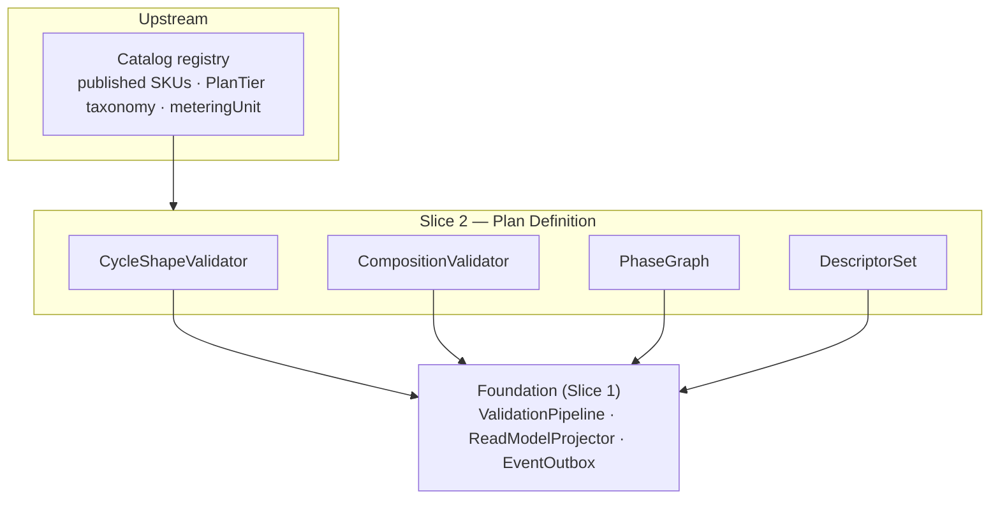

<!-- CONFLUENCE_TITLE: [BSS]: Pricing — Plan Definition, Billing Cycles & Composition (Design, Slice 2) -->
<!-- Related: ../PRD.md, ../DESIGN.md, ./01-foundation.md | Owners: BSS Product Catalog team -->

# DESIGN — Plan Definition, Billing Cycles & Composition (Slice 2)

<!-- toc -->

- [1. Context](#1-context)
  - [1.1 Overview](#11-overview)
  - [1.2 Purpose](#12-purpose)
  - [1.3 Actors](#13-actors)
  - [1.4 References](#14-references)
  - [1.5 Scope](#15-scope)
  - [1.6 Constraints & Assumptions](#16-constraints--assumptions)
  - [1.7 Naming & Design-Introduced Names](#17-naming--design-introduced-names)
  - [1.8 Context & Dependencies](#18-context--dependencies)
- [2. Actor Flows (CDSL)](#2-actor-flows-cdsl)
  - [Author a Plan](#author-a-plan)
  - [Publish a Plan](#publish-a-plan)
- [3. Processes / Business Logic (CDSL)](#3-processes--business-logic-cdsl)
  - [Billing-Cycle Shape Validation](#billing-cycle-shape-validation)
  - [Plan Composition Validation](#plan-composition-validation)
  - [Phase Schedule Validation](#phase-schedule-validation)
  - [Billing Descriptor Completeness](#billing-descriptor-completeness)
- [4. States (CDSL)](#4-states-cdsl)
  - [Plan Lifecycle State Machine](#plan-lifecycle-state-machine)
- [5. API Surface](#5-api-surface)
- [6. Data Model](#6-data-model)
- [7. Events & Alarms](#7-events--alarms)
- [8. Definitions of Done](#8-definitions-of-done)
  - [Billing-Cycle Matrix](#billing-cycle-matrix)
  - [Plan Composition & PlanTier](#plan-composition--plantier)
  - [Phases](#phases)
  - [Descriptors](#descriptors)
- [9. Acceptance Criteria](#9-acceptance-criteria)
- [10. Non-Functional Considerations](#10-non-functional-considerations)

<!-- /toc -->

## 1. Context

### 1.1 Overview

This slice owns the **shape of a Plan**: the billing-cycle matrix (one-time / recurring /
usage-based / hybrid), custom frequency, per-seat quantity provenance, the optional one-time
setup row, mandatory `PlanTier`, meter injectivity, add-on rules, plan phases with
`convertsToPhaseId`, and the billing descriptor set. It registers its validation rules into
the Foundation's fail-closed pipeline and its fields into the read-model projection; it owns
**no publish mechanics** — everything publishes through the Foundation
([`01-foundation.md`](./01-foundation.md) §4.2).

**Traces to**: `cpt-cf-bss-pricing-fr-billing-cycles`, `cpt-cf-bss-pricing-fr-custom-frequency`,
`cpt-cf-bss-pricing-fr-hybrid-completeness`,
`cpt-cf-bss-pricing-fr-one-time-setup`, `cpt-cf-bss-pricing-fr-plantier-mandatory`,
`cpt-cf-bss-pricing-fr-meter-injective`, `cpt-cf-bss-pricing-fr-addon-rules`,
`cpt-cf-bss-pricing-fr-billing-descriptors`, `cpt-cf-bss-pricing-fr-plan-phases`
(per-seat `quantitySource` persistence + validation live in Slice 3, matching §1.5 —
`fr-per-seat` is claimed there, one owner per FR; 2026-07-31 P2 fix)

### 1.2 Purpose

Give Finance/Product a self-service way to author every launch commercial shape on one
`planId` — recurring base + usage + optional setup, per-seat with explicit quantity
provenance, phased trial→intro→evergreen — such that an invalid or ambiguous shape **cannot
publish** and a published shape is completely resolvable by Subscriptions/Tariffs/Billing
without defaults.

### 1.3 Actors

| Actor | Role in Slice |
|-------|---------------|
| `cpt-cf-bss-pricing-actor-finance-manager` | Authors plans, cycles, phases; submits for publish |
| `cpt-cf-bss-pricing-actor-product-manager` | Configures add-on rules and composition |
| `cpt-cf-bss-pricing-actor-catalog-registry` | Supplies published SKUs, `PlanTier` taxonomy, `meteringUnit` declarations |
| `cpt-cf-bss-pricing-actor-subscriptions` | Consumes phase map, `displayTrialDays`, sellability inputs |
| `cpt-cf-bss-pricing-actor-rating` | Consumes the meter mapping (injectivity guarantee) |
| `cpt-cf-bss-pricing-actor-billing` | Consumes billing descriptors via `CatalogVersion` |

### 1.4 References

- **PRD**: [PRD.md](../PRD.md) — §6.1, §6.3, §17.1 (billing-cycle matrix), §17.3 (composition rules)
- **Design**: [01-foundation.md](./01-foundation.md) — publish contract (§4.2), scope key (§4.1), schema ownership
- **Dependencies**: Foundation (Slice 1). Co-required with price-structure (Slice 3): a rateable plan needs both a shape and a model kind.

### 1.5 Scope

**In scope**: billing cycles + custom frequency metadata; hybrid completeness; per-seat
quantity provenance concept (persistence + validation of `quantitySource`: Slice 3); one-time
setup row validation; `PlanTier` mandatory + SKU-equality check;
meter injectivity; add-on rules (dependency, bounds, override reference); phases (ordering,
`convertsToPhaseId`, terminal phase, `displayTrialDays`); billing descriptor completeness.

**Out of scope**: tier bands / model kinds (Slice 3); bundles (Slice 8); windows/sellability
enforcement (Slice 7); trial runtime, entitlement enforcement, proration math (Subscriptions);
`PlanTier` taxonomy and `meteringUnit` declaration (registry); charge computation (Tariffs).

### 1.6 Constraints & Assumptions

Inherits Foundation C-set (fail-closed, append-only, UTC, ISO 4217, tenant isolation). Slice-2-specific:

| # | Topic | Assumption (default) | Source |
|---|-------|----------------------|--------|
| P1 | Custom interval cap | `customEveryN{Days\|Months}(n)`: `n > 0` and `n ≤` a tenant-configured cap; over-cap config rejected at authoring (no silent clamp) | PRD §6.1 |
| P2 | Custom-frequency anchoring | `customEveryN Days(n)` MUST anchor on `subscription_start` (a `calendar_month`/`fixed_day` anchor fails publish). `customEveryN Months(n)` MAY anchor `subscription_start` or `calendar_month`; a `subscription_start` day beyond the target month clamps to its last day (K2 rule) with the **anchor day preserved** per period (no drift: 31→28→31); UTC; joint anchor fixture with Subscriptions (D-20) | PRD §6.1; D-20 |
| P3 | PlanTier equality | Plan `PlanTier` = parent SKU `PlanTier` unless an explicit, audited override is declared (default equal, no silent divergence) | PRD §17.3 |
| P4 | Localization | Plan-owned display content (names, labels, descriptors) is single-language at launch; per-locale authoring is an open registry-owned item | PRD §15 (F-37) |
| P5 | Descriptor minimum field set | **Pinned (D-48, 2026-07-28; composition revised by D-110, 2026-07-31)**: descriptor-set entity = line template, GL code, itemization rule; **two** elements of the v1 five **ride the price row** — `billingTiming` (2026-07-28) and `taxCategory` = the row's `tax_category_ref` (D-110 — a per-plan column could not mirror a per-row source of truth); v1 content unchanged, additive-only extension; Billing countersigns at its gear PRD | PRD §15, D-48, D-110 |

### 1.7 Naming & Design-Introduced Names

Reuses the PRD glossary and inherits engine mechanics from the Foundation (`ScopeKey`,
`DraftStateMachine`, `ValidationPipeline`, `ReadModelProjector`, `EventOutbox`). Not restated.

Design-introduced names (Slice 2):

| Name | Meaning |
|------|---------|
| `CycleShapeValidator` | Registered rule set validating the billing-cycle matrix (§17.1) per plan |
| `CompositionValidator` | Registered rule set for `PlanTier`, meter injectivity, add-on rules (§17.3) |
| `PhaseGraph` | The ordered phase set with `convertsToPhaseId` edges; validated acyclic with exactly one terminal phase |
| `DescriptorSet` | The per-plan billing descriptor aggregate checked for completeness at publish |

### 1.8 Context & Dependencies

```mermaid
flowchart TB
    subgraph upstream["Upstream"]
        REG["Catalog registry<br/>published SKUs · PlanTier taxonomy · meteringUnit"]
    end
    subgraph s2["Slice 2 — Plan Definition"]
        CSV["CycleShapeValidator"]
        CMP["CompositionValidator"]
        PHG["PhaseGraph"]
        DSC["DescriptorSet"]
    end
    FND["Foundation (Slice 1)<br/>ValidationPipeline · ReadModelProjector · EventOutbox"]
    REG --> s2
    CSV --> FND
    CMP --> FND
    PHG --> FND
    DSC --> FND
```

**Consumed:** published `skuId` + SKU `PlanTier` + `meteringUnit` declarations (registry).
**Produced:** the plan-shape portion of the read model (cycle, frequency metadata, phase map +
`displayTrialDays`, add-on rules, descriptor set, `invoiceGroupingKey` (D-96) —
`quantitySource` is persisted/validated by Slice 3), validated fail-closed at publish.

## 2. Actor Flows (CDSL)

### Author a Plan

- [ ] `p1` - **ID**: `cpt-cf-bss-pricing-flow-plan-author`

**Actor**: `cpt-cf-bss-pricing-actor-finance-manager`, `cpt-cf-bss-pricing-actor-product-manager`

**Success Scenarios**:
- A draft Plan is created against a **published** SKU with a billing cycle from the §17.1 matrix; add-on rules, phases, and descriptors attach incrementally in `draft`
- A recurring plan persists `frequency` (`monthly|quarterly|semiannual|annual|customEveryN{Days|Months}(n)`) as metadata

**Error Scenarios**:
- Draft/unknown parent SKU → `SKU_NOT_PUBLISHED` (422)
- Non-positive or over-cap custom interval `n` → `INVALID_CUSTOM_INTERVAL` (422)
- Stale ETag → conflict (Foundation optimistic concurrency)

**Steps**:
1. [ ] - `p1` - API: POST /v1/pricing/plans (draft; idempotency key honored) - `inst-pa-create`
2. [ ] - `p1` - Validate the parent `skuId` is **published** in the registry read model - `inst-pa-sku`
3. [ ] - `p1` - Persist cycle + frequency metadata (`n` validated > 0 and ≤ cap, P1) - `inst-pa-cycle`
4. [ ] - `p1` - Attach add-on rules / phases / descriptors via PATCH while `draft` - `inst-pa-attach`
5. [ ] - `p1` - **RETURN** 201 (draft plan, ETag); `PlanCreated` emitted by the Foundation outbox - `inst-pa-return`

### Publish a Plan

- [ ] `p1` - **ID**: `cpt-cf-bss-pricing-flow-plan-publish`

**Actor**: `cpt-cf-bss-pricing-actor-finance-manager` (approval per governance slice)

**Success Scenarios**:
- Publish runs the Foundation pipeline with this slice's registered rules; on success the plan shape freezes into the read model and `PlanPublished` carries the pending version ref

**Error Scenarios**:
- Any §17.1/§17.3 violation → 422 with the enumerated validation report (fail-closed; no event, no warm)

**Steps**:
1. [ ] - `p1` - API: POST /v1/pricing/plans/{planId}/publish - `inst-pp-api`
2. [ ] - `p1` - Foundation `ValidationPipeline` executes `CycleShapeValidator` + `CompositionValidator` + `PhaseGraph` + `DescriptorSet` rules (this slice) alongside Slice-3 price rules - `inst-pp-validate`
3. [ ] - `p1` - On success: Foundation freezes the shape into the read model + snapshot, emits the frozen events, requests `CatalogVersion` ([`01-foundation.md`](./01-foundation.md) §4.2 steps 3–5) - `inst-pp-freeze`
4. [ ] - `p1` - **RETURN** 202 (publish accepted / pending approval) or 422 (validation report) - `inst-pp-return`

## 3. Processes / Business Logic (CDSL)

### Billing-Cycle Shape Validation

- [ ] `p1` - **ID**: `cpt-cf-bss-pricing-algo-cycle-shape`

**Input**: a draft plan + its price rows (rows authored via Slice 3)
**Output**: pass, or enumerated fail-closed violations

**Steps**:
1. [ ] - `p1` - **One-time**: exactly one `one_time` base row **per sold `(currency, region)`**; optional purchase qty min/max (`purchase_min_qty ≤ purchase_max_qty` when both set) + availability dates (past-`availableFrom` rule: `inst-cs-availability`); recurring-only add-ons rejected - `inst-cs-onetime`
2. [ ] - `p1` - **Recurring**: ≥ 1 recurring base row per sold `(currency, region)`; `billingTiming` REQUIRED on every recurring row (the requirement is **Slice 6's registered rule** — cross-referenced here, never re-registered; single owner, 2026-07-28 review fix); frequency metadata present; optional `one_time_setup` row allowed - `inst-cs-recurring`
3. [ ] - `p1` - **Usage-based**: parent SKU `meteringUnit` required; `billingGranularity` on **all** usage rows; `tierAggregationWindow` when tiered **or `package`** (Slice 3 `inst-pk-window`, D-58 — block round-up is non-linear in the window; the "when tiered" wording had excluded the `package` case D-70 propagated everywhere else, 2026-07-31 review fix). **Per-market line completeness (D-84):** every `(meter, dimensionKey)` line the plan prices MUST have a row in every sold `(currency, region)` of the plan (the union of its usage rows' markets) — `USAGE_MARKET_INCOMPLETE` otherwise, same rule and rationale as `inst-cs-hybrid` - `inst-cs-usage`
4. [ ] - `p1` - **Hybrid**: BOTH ≥ 1 recurring **and** ≥ 1 usage row on the same `planId` (distinct `chargeKind` keys); missing either part fails publish; optional `one_time_setup` allowed. **Per-market completeness (D-84, 2026-07-30 review fix):** the usage part is required **per sold market**, not merely anywhere — every `(meter, dimensionKey)` line the plan prices (evaluated over its phase-invariant terminal-phase rows; phase-scoped overrides are additive and exempt) MUST have a published usage row in **every** `(currency, region)` where a recurring row exists, else publish fails (`USAGE_MARKET_INCOMPLETE`, 422, meter/dimension/market named). Otherwise a hybrid selling recurring in EUR+USD with usage only in EUR is sellable in USD, and the USD subscriber's usage events fail closed — the "sold but unrateable" state D-15/D-17 declare impossible by construction. A market where usage is genuinely free is an explicit `$0` row (Slice 3 Q5), never an absence - `inst-cs-hybrid`
5. [ ] - `p1` - **Custom frequency**: `customEveryN Days(n)` MUST anchor `subscription_start`; `customEveryN Months(n)` MAY anchor `subscription_start` or `calendar_month` with month-end clamp + preserved anchor day (P2, D-20); non-positive/over-cap `n` fails - `inst-cs-customfreq`
6. [ ] - `p1` - **Setup row**: `chargeKind=one_time_setup` allowed only on recurring/hybrid plans; validated as one-time — no recurrence, no `billingTiming`, no tier fields; first-class row (participates in approval/snapshot/preview), never a synthetic add-on SKU - `inst-cs-setup`
7. [ ] - `p1` - **Setup charge timing (normative):** the setup row charges **once per subscription lifetime** — at activation, or for a plan with a `trial` phase at entry into the **first non-trial phase** (trial conversion; a cancelled trial is never charged setup). A plan change or `PlanLink` migration **never charges the target plan's setup row at all** — whether or not the origin plan carried one: setup is tied to **subscription activation**, not plan entry, so a plan-change entrant who never paid any setup is still not charged (Slice 11 honors this in the migration contract; wording sharpened 2026-07-30 review fix). The timing is published in the read model for Subscriptions/Billing - `inst-cs-setup-timing`
8. [ ] - `p1` - **Availability dates (cycle-independent):** a past `availableFrom` is rejected on **every** billing cycle (`AVAILABLE_FROM_IN_PAST`) — the Slice 5 historical-import path is the only sanctioned backdating (rule hoisted from the one-time step, 2026-07-28 review fix, confirmed 2026-07-31). The rule binds **newly set or changed** values only (2026-07-31 review fix): a revision re-publishing an **unchanged** `availableFrom` that has legitimately passed since the original publish is not backdating and passes — otherwise every later re-publish (a descriptor fix, a new market) of a once-future-dated plan would be blocked until the operator erased the date - `inst-cs-availability`

### Plan Composition Validation

- [ ] `p1` - **ID**: `cpt-cf-bss-pricing-algo-composition`

**Input**: a draft plan (PlanTier, meter mapping, add-on rules)
**Output**: pass, or enumerated fail-closed violations

**Steps**:
1. [ ] - `p1` - **PlanTier**: declared before publish (optional at draft); MUST equal the parent SKU's `PlanTier` unless an **explicit, audited override** is declared (P3, no silent divergence); the effective tier lands in the read model - `inst-cmp-plantier`
1a. [ ] - `p1` - **PlanTier drift after publish:** the equality check at publish is not enough — the registry can change the SKU's tier later. The catalog consumes the registry's SKU-tier-change signal and flags every affected **published** plan `tier_divergent` **in the operator-plane flag store (`pricing_operator_flag`, D-85, 2026-07-30 review fix — never the versioned read model: a drift flag has no publish unit, and a frozen `CatalogVersion` never mutates)** (+ the `pricing.plan.tier_divergent` alarm); remediation is a re-publish (re-validating equality) or an explicit audited override. Downstream consumers keep resolving the frozen published tier — the flag is an operator remediation signal on the authoring surfaces, never a silent retro-change (part of the registry joint contract, PRD §15) - `inst-cmp-tier-drift`
2. [ ] - `p1` - **Meter injectivity (restated, D-103, 2026-07-31 review fix):** the invariant is **one priced line per `(meter, dimensionKey)` per scope-key slice** (`currency`/`region`/`priceOverlay`/`phase`/`priceEligibility`/`cohort` legitimately multiply rows — the `cohort` axis is what lets a second cutover add another grandfathered generation of the same usage line without violating injectivity, ADR-0002); a **duplicate line** within one slice is the ambiguity that fails publish (`METER_AMBIGUOUS`). A usage plan **MAY** price **several** `meteringUnit`s (a PaaS plan pricing cloudlets, storage and egress is one plan, not three) — the earlier "each usage plan revision maps **exactly one** `meteringUnit`" was the stronger claim, and it was contradicted by three rules of this set and enforced by none: D-84's per-market completeness ranges over "every `(meter, dimensionKey)` line the plan prices", this slice's own D-84 integration AC exercises a plan pricing M1 and M2, D-43's grant `applicability` scopes to "a **set** of published `meteringUnit` ids … usage lines of the grant-bearing plan", and the enforcing partial `UNIQUE` (§6) carries both `meter` and `dimension_key` — i.e. it always implemented the per-line reading. A derived (composite) meter (Slice 10) remains the way to price **several units as one billable line** (vCPU + RAM → one output unit), and separate single-meter SKUs composed via bundle/add-ons (Slice 8) remain available — neither is now the *only* multi-meter path - `inst-cmp-injective`
2a. [ ] - `p1` - **Usage-source binding (UC3 seam adoption, 2026-07-28 review fix, confirmed 2026-07-31):** every usage row's `meteringUnit` MUST resolve to a registry metering-unit declaration that carries a **`usageTypeRef`** (the usage-collector `gts_id` supplying the meter — products `fr-metering-unit-declaration`, rating SEAMS UC3(a)); a meter with no binding fails publish (`METER_USAGE_TYPE_UNBOUND`) — an unbound meter is unrateable, since Rating quarantines usage it cannot attribute rather than guessing. The **dimension set** the plan prices over that meter (its authored `dimensionKey` values) MUST be a subset of the UsageType's declared `metadata_fields` keys, which the registry holds equal to the meter's declared dimension set (UC3(c) cross-validation); pricing a dimension the source never emits fails publish (`METER_DIMENSION_UNDECLARED`, offending keys named). The **`dimension_key = ''` empty-tuple sentinel is exempt** from the subset check (2026-07-31c review fix): an undimensioned row prices the whole meter and declares no dimension — `''` is never a `metadata_fields` key, so reading the subset rule literally would fail every undimensioned row on a bound meter. Both checks read the frozen registry declaration through the same joint contract as `inst-cmp-tier-drift`. **Post-publish drift (2026-07-31 review fix — the tier-drift treatment applied symmetrically):** a later registry change to the meter's `usageTypeRef` binding or declared dimension set flags every affected **published** plan `meter_binding_divergent` in the operator-plane flag store (`pricing_operator_flag`, D-85) + raises `pricing.plan.meter_binding_divergent` (Warn); consumers keep resolving the frozen mapping; remediation = re-publish (re-running this check) - `inst-cmp-usagetype`
3. [ ] - `p1` - **Add-on rules**: add-on SKUs published + compatible with the base SKU; the dependency/conflict **edges are plan-authored** (D-16): each rule row MAY declare `depends_on` / `conflicts_with` sets referencing **other add-ons of the same plan's set** (an edge pointing outside the set fails; conflicts are normalized symmetric); dependency **cycles** fail publish (graph walk over `depends_on`), conflicting pairs fail when both marked required; a required add-on has `maxQty ≥ 1`; an optional price-override reference persists on the plan snapshot - `inst-cmp-addons`
4. [ ] - `p1` - **Override home (normative):** `price_override_ref` resolves to a **published `priceId` on a plan of the add-on SKU itself** (an alternative row authored there — it is a normal price row with its own scope key, windows, and coverage). **The ref binds that row's canonical scope key — as the key *family* modulo the market axes, not the id (D-97, amended by D-116, 2026-07-31):** the bound object is `(addon planId, priceOverlay = base, phase, priceEligibility = all_subscriptions, chargeKind, cohort = none)` with `(currency, region)` **free** — a single canonical key fixes one market and cannot itself serve a multi-market base plan (the pre-D-116 wording required one key to "cover every market", which is unsatisfiable). The subscriber's bound `(currency, region)` selects the member key; resolution at `t` follows **that member** through windows exactly as any row resolves, so a supersession's successor legitimately serves the override (supersession is transparent to consumers, and the D-82/D-98 unit guard keeps each member key's meaning stable) — the frozen mapping never dangles on a routine price change of the add-on plan. Publish of the base plan validates a published, covering **member** exists for every `(currency, region)` the base plan sells (Slice 4 case i, per pair — D-95); the resolved mapping freezes into the base plan's `pricingSnapshotRef`. No override price is ever authored as a detached number on the base plan - `inst-cmp-override-home`

### Phase Schedule Validation

- [ ] `p1` - **ID**: `cpt-cf-bss-pricing-algo-phases`

**Input**: a phased plan's `PhaseGraph`
**Output**: a published phase→price map, ordering, successors, `displayTrialDays`

**Steps**:
1. [ ] - `p1` - Each phase id maps to its price-row references (rows carry the `phase` scope-key axis); ordering persisted - `inst-ph-map`
2. [ ] - `p1` - `convertsToPhaseId` edges validated: no dangling target, no cycle; **exactly one terminal phase** (`evergreen`, no successor). **The chain is linear (2026-07-31 review fix):** phases are ordered by `ordinal`, the **entry phase is the lowest ordinal** (normative — D-39's "first non-trial phase" and the setup-timing "first non-trial phase" both read this order), and every non-terminal phase's `convertsToPhaseId` MUST target the next phase in ordinal order — a skip, a tree, or an unreachable phase fails publish (`PHASE_CHAIN_NONLINEAR`, 422): acyclicity + single-terminal alone admit dead phases that still demand coverage rows and leave "first" undefined. **The terminal phase's `kind` MUST be `evergreen`** (`TERMINAL_PHASE_KIND_INVALID`, 422; 2026-08-01 review fix, C-4): the constraint was carried only by a parenthetical here while terminality is structural (`converts_to_phase_id IS NULL`) and the column admits `trial | intro | evergreen`, so nothing rejected a `trial`- or `intro`-terminal chain — and a `trial` terminal leaves "the **first non-trial phase**" undefined for both setup timing (`inst-cs-setup-timing`) and migration entry (D-39), while colliding with the `display_trial_days = phase_duration_days` CHECK (duration is forbidden on the terminal phase). "Intro pricing forever" is authored as an `evergreen` terminal phase at the intro price, not as an `intro` terminal - `inst-ph-graph`
3. [ ] - `p1` - **Phase duration (normative):** every **non-terminal** phase MUST author `phaseDurationDays > 0` — `convertsToPhaseId` says *where* a phase converts, the duration says *when*; a non-terminal phase without a duration (or a terminal phase with one) fails publish. Subscriptions enforces phase runtime from these published durations (single source) - `inst-ph-duration`
3a. [ ] - `p1` - **Phase coverage (D-15):** on a plan whose billing cycle carries a **recurring part** (`recurring`/`hybrid` — one-time and usage-only plans are outside the rule's scope, whose literal reading would otherwise block them via their implicit terminal phase; 2026-07-28 review fix, confirmed 2026-07-31), every phase id MUST be referenced by ≥ 1 published **recurring** price row for every `(currency, region)` the plan sells — an uncovered phase fails publish (`PHASE_UNCOVERED`): a phase conversion must never resolve to nothing (the row-based Slice 7 coverage check cannot see a phase that has no rows at all) - `inst-ph-coverage`
3b. [ ] - `p1` - **Usage rows are phase-invariant by default (D-15):** one usage row (on the **terminal `phase_id`** — D-19) covers **all** phases; an explicit phase-scoped usage row overrides it **for its phase** (phase-specific wins — a published resolution rule of the same class as most-specific-wins eligibility, adopted verbatim by Tariffs; joint fixture). Free trial usage = an explicit trial-phase usage row at 0 — never a silent default. **An override requires its base (D-117, 2026-07-31 review fix):** a phase-scoped usage row MUST have the phase-invariant terminal-phase row of its `(meter, dimensionKey)` line — an **orphan** override fails publish (`PHASE_OVERRIDE_ORPHANED`, 422, the line and phase named). Without the base, the D-89 unit guard has no comparison target, D-84's per-market completeness exempts the line entirely ("phase-scoped overrides are additive"), and after the phase converts the line resolves to **nothing** — usage that continues fails closed on a published, sellable plan ("sold but unrateable" through the override door). Phase-limited-only metering is a named Future gate (it needs its own completeness rule and defined conversion-to-nothing semantics before it can be authorable — the D-53 posture) - `inst-ph-usage-invariant`
3c. [ ] - `p1` - **Override unit guard (normative, D-89, 2026-07-31 review fix):** the tier counter `Q` is keyed `(subscription, meter, dimensionKey, window)` — **phase-blind** (S3 `inst-tb-window-continuity`) — so a phase conversion **never resets `Q`**, and the row that serves the meter after conversion inherits the continued counter. A phase-scoped usage override therefore MUST carry the **same unit/counter-determining fields** as the phase-invariant terminal-phase row of its `(meter, dimensionKey)` line — `model_kind`, `billingGranularity`, `aggregationFunction`, `aggregationGranularity`, `tierAggregationWindow`, `tierQualificationWindow`, **`package_size`** (the D-82/D-98 list, extended by D-122 — block math is non-linear in the window, so a mid-window size change re-buckets the accumulated `used`) — else publish fails (`PHASE_OVERRIDE_UNIT_MISMATCH`, 422, offending fields named). Without it a `per_hour` trial row converting into a `per_day` evergreen row mid-window applies an hours-denominated continued `Q` to day-denominated bands (the D-77/D-82 ×24 class through the phase axis), and differing window values silently reset the counter. Free-trial pricing stays fully expressible — a `$0` rate or band set **at the same denomination**. The supersession-continuity fixture carries the phase-conversion-mid-window scenario - `inst-ph-override-units`
4. [ ] - `p1` - A `trial` phase publishes `displayTrialDays` = its `phaseDurationDays` (the PRD-named alias for preview/quoting; one value, two projections) - `inst-ph-trial`
5. [ ] - `p1` - **Axis typing (D-19):** the `phase` axis is always a `phase_id`. Every plan gets a terminal phase row — authored (phased plans) or **auto-created implicit** (kind `evergreen`; non-phased/one-time plans) at plan creation; non-phased/one-time/setup rows carry that terminal `phase_id` (Foundation §4.1 defaults). The literal `evergreen` is a phase *kind*, never an axis value - `inst-ph-default`
5a. [ ] - `p1` - **Terminal-phase stability across revisions (normative, D-64, 2026-07-29 review fix):** D-56 pins phase **ids**, but the scope-key default (`inst-ph-default`) and usage phase-invariance (`inst-ph-usage-invariant`) are both defined relative to *which* phase is terminal — so a revision that re-terminalizes silently moves them. Therefore: (a) a revision MUST NOT re-terminalize an existing phase or introduce a **different** terminal phase — the terminal `phase_id` is immutable for the life of the plan (`TERMINAL_PHASE_CHANGED`, 422); (b) a revision MUST re-attach every `phase_id` referenced by a current published `pricing_price` row — dropping such a phase fails publish (`PHASE_IN_USE`, 422). Without (a), a usage-only plan published non-phased (metered row on the implicit terminal `T0`) can be revised to add a trial plus a new evergreen `E`: `T0` becomes non-terminal, the metered row is no longer phase-invariant, a subscription in `E` resolves **no** usage row, and Tariffs fails closed on a published sellable plan. `inst-ph-coverage` cannot catch this — since the 2026-07-28 fix it is scoped to recurring rows on `recurring`/`hybrid` plans, so usage-only plans are entirely unguarded. This is the "sold but unrateable" state D-15 exists to prevent, reintroduced through revisioning - `inst-ph-terminal-stable`

### Billing Descriptor Completeness

- [ ] `p1` - **ID**: `cpt-cf-bss-pricing-algo-descriptors`

**Input**: the plan's `DescriptorSet`
**Output**: pass (set frozen into `CatalogVersion`), or a report listing missing fields

**Steps**:
1. [ ] - `p1` - Required per manifest §4.1 / D-48 v1: invoice line template, GL code, composition/itemization rules on the descriptor set — plus the two **row-borne** elements: `billingTiming` on every recurring row (validated by Slice 6's rule) and `taxCategory` as each row's `tax_category_ref` (Slice 4 `inst-td-persist`, sole source of truth per D-110); publish blocks on any missing element with the field and, for the row-borne ones, the row named in the report - `inst-ds-required`
2. [ ] - `p1` - The frozen set MUST be sufficient for Billing/ERP to post without re-querying mutable rows; the minimum field list is confirmed with Billing (P5) and the validator's required-set is config-extensible without a schema change - `inst-ds-sufficient`

## 4. States (CDSL)

### Plan Lifecycle State Machine

- [ ] `p1` - **ID**: `cpt-cf-bss-pricing-state-plan-lifecycle`

**States**: draft, published, superseded, retired (per **revision row** — D-56/D-90)
**Initial State**: draft (mutable, deletable; optional `PlanTier`)

**Transitions**:
1. [ ] - `p1` - **FROM** draft **TO** published **WHEN** the Foundation pipeline passes (this slice's rules included) and approval (governance slice) completes; shape freezes into the read model - `inst-pl-publish`
1a. [ ] - `p1` - **FROM** published **TO** superseded **WHEN** the plan's next revision publishes (D-90, 2026-07-31 review fix — the flip happens inside the successor revision's publish commit, mirroring the price rows' flip-at-commit): at most one revision per plan is ever **current** (partial `UNIQUE … WHERE lifecycle_state IN ('published', 'retired')` — widened by D-128 so the predicate keeps holding a row after retirement), so "the current revision" is unique by construction for the projector (D-83), the sellability lifecycle predicate, and every truth-side referential check; superseded revision rows are immutable history - `inst-pl-supersede`
2. [ ] - `p1` - **FROM** published **TO** retired **WHEN** the lifecycle slice retires the plan (Slice 11; blocks new subscriptions, preserves snapshots) — the flip targets the plan's **single current published revision** (D-90) and is itself a **publish unit** (D-128: pending `CatalogVersion` ref + plan-subject re-projection, `lifecycle_state` being a projected field the sellability gate reads at the pin). The retired row stays the plan's **current** revision — the partial `UNIQUE` covers `IN ('published', 'retired')` and the projector sources it (Foundation §3.7/§4.4) — so in-flight subscribers keep resolving a warm delta - `inst-pl-retire`
3. [ ] - `p1` - Published plans never return to draft; a change is a **new revision** through the Foundation's versioning (append-only) - `inst-pl-norollback`

## 5. API Surface

| Method | Path | Purpose | Idempotency |
|--------|------|---------|-------------|
| `POST` | `/v1/pricing/plans` | Create a draft plan | client idempotency key |
| `PATCH` | `/v1/pricing/plans/{planId}` | Update draft shape (cycle, phases, add-ons, descriptors) | ETag |
| `POST` | `/v1/pricing/plans/{planId}/publish` | Run fail-closed validation + submit for approval/publish | per plan revision |
| `GET` | `/v1/pricing/plans/{planId}` | Read (draft for authors; published via read model) | — |

**Problem responses (RFC 9457):** `SKU_NOT_PUBLISHED` (422), `INVALID_CUSTOM_INTERVAL` (422),
`HYBRID_INCOMPLETE` (422), `USAGE_MARKET_INCOMPLETE` (422 — a priced `(meter, dimensionKey)`
line missing a usage row for a sold `(currency, region)`; D-84), `PLANTIER_MISSING`/`PLANTIER_DIVERGENT` (422), `METER_AMBIGUOUS`
(422), `ADDON_CYCLE`/`ADDON_INCOMPATIBLE` (422), `ADDON_OVERRIDE_UNRESOLVED` (422 —
`price_override_ref` unpublished or not covering a sold `(currency, region)`),
`PHASE_GRAPH_INVALID` (422), `PHASE_CHAIN_NONLINEAR` (422 — a `convertsToPhaseId` chain that
skips the ordinal order, branches, or leaves a phase unreachable from the entry phase;
2026-07-31 review fix), `TERMINAL_PHASE_KIND_INVALID` (422 — a terminal phase whose `kind` is
not `evergreen`; C-4, 2026-08-01 — a `trial` terminal leaves "the first non-trial phase"
undefined for setup timing and D-39), `PHASE_DURATION_INVALID` (422 — non-terminal phase without
`phaseDurationDays`, or a terminal phase with one), `PHASE_UNCOVERED` (422 — a phase with no
covering recurring row for a sold `(currency, region)`, D-15),
`PHASE_OVERRIDE_UNIT_MISMATCH` (422 — a phase-scoped usage override changing the
unit/counter-determining fields (`model_kind`, granularities, aggregation/qualification
windows, `package_size` — D-122) of the terminal-phase row it overrides; D-89 — the continued
`Q` keeps its denomination across phase conversion; offending fields named),
`PHASE_OVERRIDE_ORPHANED` (422 — a phase-scoped usage row with no phase-invariant
terminal-phase row of its `(meter, dimensionKey)` line; D-117 — without the base the D-89
guard has no referent, D-84 completeness never sees the line, and the line resolves to nothing
after conversion),
`TERMINAL_PHASE_CHANGED` (422 — a revision re-terminalizing an existing phase or introducing a
different terminal phase, `inst-ph-terminal-stable`), `PHASE_IN_USE` (422 — a revision dropping
a phase still referenced by a current published price row), `SETUP_ROW_INVALID` (422 — setup row on a
one-time plan, or carrying recurrence/`billingTiming`/tier fields),
`PURCHASE_QTY_RANGE_INVALID` (422 — `purchase_min_qty > purchase_max_qty`),
`AVAILABLE_FROM_IN_PAST` (422 — outside the historical-import path),
`METER_USAGE_TYPE_UNBOUND` (422 — the row's meter carries no registry `usageTypeRef`; UC3),
`METER_DIMENSION_UNDECLARED` (422 — a priced `dimensionKey` outside the UsageType's declared
`metadata_fields` keys; UC3),
`DESCRIPTOR_INCOMPLETE` (422). Concrete error taxonomy is refined at implementation; names
follow the fail-closed report contract (every violation enumerated).

## 6. Data Model

This slice extends the Foundation-owned `pricing_plan` with shape tables (tenant-scoped, SecureORM
per Foundation §2.2 authz-gate + S5 `inst-rb-pep`; `pricing_` prefix per Foundation §3.7;
draft rows mutable, published rows append-only per Foundation §4.3):

**`pricing_plan` (Foundation-owned; Slice-2 columns)** — extends the Foundation-owned table
with **slice-declared columns** (capability semantics owned here): `billing_cycle`
(`one_time|recurring|usage|hybrid`), `frequency` + `custom_interval_n`/`custom_interval_unit`,
`plan_tier`, `plan_tier_override` (bool, audited), `available_from`/`available_to`,
`purchase_min_qty`/`purchase_max_qty` (nullable; one-time plans), `invoice_grouping_key`
(nullable string; NULL/empty = no grouping — the PRD-glossary Plan field, homed here by D-96,
2026-07-31 review fix: a Billing layout hint projected into the read model, shape-checked only,
never overriding the single-currency-per-invoice invariant — Slice 4 `inst-cb-boundary`).

**`pricing_plan_phase`** (PK **`(phase_id, plan_revision)`** — copy-on-new-revision, D-83; FK `plan_id`). Every plan revision holds ≥ 1 row: phased plans author theirs; non-phased/one-time plans get one **implicit terminal row** (kind `evergreen`) auto-created at plan creation — the default `phase` axis value (D-19). The `phase_id` half is **stable across plan revisions**: a new revision **copies** the phase rows under its own `plan_revision`, ids never re-minted — so the `phase` scope-key axis of continuing price rows (which reference the bare `phase_id`) and same-key supersession are unchanged, while phase **attributes** resolve per revision. A published revision's rows are immutable with it; the open draft edits **its own copies** (D-56 + D-83, 2026-07-30 review fix, confirmed 2026-07-31):

| Column | Type | Notes |
|--------|------|-------|
| `phase_id` | `uuid` | PK; referenced by the `phase` scope-key axis |
| `plan_id` | `uuid` | FK |
| `plan_revision` | `int` | PK half — the revision this copy belongs to (copy-on-new-revision, D-83; `phase_id` stable across revisions — D-56) |
| `kind` | `enum` | `trial \| intro \| evergreen` |
| `ordinal` | `int` | phase ordering |
| `converts_to_phase_id` | `uuid` | successor; NULL only on the terminal phase |
| `phase_duration_days` | `int` | REQUIRED > 0 on non-terminal phases; forbidden on the terminal phase |
| `display_trial_days` | `int` | trial phases: projection of `phase_duration_days` under the PRD name (preview + runtime single source); the equality CHECK below guards drift between the two persisted columns (2026-07-28 review fix) |

**`pricing_plan_addon_rule`** (PK **`(plan_id, plan_revision, addon_sku_id)`** — copy-on-new-revision, D-83; the `addon_sku_id` discriminator restored by **D-105**, 2026-07-31 review fix: the earlier "keyed by `(plan_id, plan_revision)`" admitted **one** add-on rule per revision, which makes the `depends_on` cycle walk, the symmetric-conflict normalization and "two required conflicting add-ons fail" all unsatisfiable — `pricing_plan_phase`'s `(phase_id, plan_revision)` shows the correct shape): `addon_sku_id`, `required` (bool), `min_qty`/`max_qty`/`step_qty`,
`price_override_ref` (nullable), `depends_on_addon_sku_id[]` / `conflicts_with_addon_sku_id[]`
(D-16 — values MUST be members of the same plan's add-on set; conflicts stored normalized
symmetric). Cycle/conflict checks run over these plan-authored edges at publish.

**`pricing_plan_descriptor_set`** (keyed by `(plan_id, plan_revision)` — copy-on-new-revision, D-83; genuinely 1:1 per revision, so the key needs no discriminator): `invoice_line_template`, `gl_code`,
`itemization_rule` (+ config-extensible required-field registry, P5). **Two** of the D-48 v1
contract's five elements are deliberately **not** columns here — `billingTiming` (2026-07-28) and
now `taxCategory` (**D-110**, 2026-07-31 review fix: a per-plan column cannot mirror the per-row
`tax_category_ref` Slice 4 makes the source of truth, and the promised publish-time consistency
check was undefined whenever two rows of a plan carried different categories) — both ride
`pricing_price` and are delivered with the row.

Key constraints: at most one terminal phase per plan revision (partial unique on
`(plan_id, plan_revision) WHERE converts_to_phase_id IS NULL`; **existence** of exactly one
terminal phase is the PhaseGraph pipeline rule — an index cannot enforce the ≥ 1 half);
`custom_interval_n > 0` CHECK; `purchase_min_qty <= purchase_max_qty` CHECK;
`CHECK (display_trial_days IS NULL OR display_trial_days = phase_duration_days)` (the
persisted projection may never drift — 2026-07-28 review fix); add-on rule
`max_qty >= 1 WHERE required`; meter injectivity enforced as a partial unique `(tenant_id, plan_id,
currency, region, price_overlay, phase, price_eligibility, cohort, meter, dimension_key)` over
**current** published usage rows (the same `WHERE lifecycle_state = 'published'`
predicate as the Foundation's scope-key partial unique — sufficient under flip-at-commit,
2026-07-30 review fix; originally 2026-07-28 review fix: the earlier
spelling named a `plan_revision` column `pricing_price` does not have and omitted
`tenant_id`/`plan_id`; the FR's "per plan revision" scoping is realized as
current-rows-per-plan, historical revisions retaining theirs through the supersession chain) —
one priced line per `(meter, dimensionKey)` **per scope-key slice**
(`meter`/`dimension_key` are Slice-3 usage-row columns — `dimension_key` is
`NOT NULL DEFAULT ''`, the empty-tuple sentinel, so undimensioned rows **collide** in this
index instead of passing as distinct NULLs (2026-07-28 review fix, confirmed 2026-07-31);
`cohort` — `none` on non-grandfathered
rows — is the ADR-0002 generation axis: without it a second cutover on the same usage key
would collide with the first generation; the CompositionValidator restates the
same rule in the pipeline).

## 7. Events & Alarms

Alarms: `pricing.plan.tier_divergent` (Warn — a registry SKU-tier change diverged from a published plan's frozen tier; remediation = re-publish or audited override); `pricing.plan.meter_binding_divergent` (Warn — a registry metering-unit `usageTypeRef`/dimension-set change diverged from a published plan's frozen mapping, `inst-cmp-usagetype`; remediation = re-publish; 2026-07-31 review fix). No new event names: this slice rides the Foundation's frozen set — `PlanCreated`,
`PlanUpdated` on authoring; `PlanPublished` on successful publish (shape included in the
warmed read model). Validation failures are synchronous 422 reports, not events. Alarms:
publish-blocked-by-validation is surfaced as an authoring outcome + the validation-catch-rate
metric (§10), not an operational alarm.

## 8. Definitions of Done

### Billing-Cycle Matrix

- [ ] `p1` - **ID**: `cpt-cf-bss-pricing-dod-billing-cycles`

The system **MUST** support authoring and fail-closed publish of the §17.1 cycle matrix —
one-time, recurring (incl. `customEveryN{Days|Months}(n)` with `n > 0` ≤ cap and
`subscription_start` anchoring for custom-days), usage-based, and hybrid (both parts required
— the usage part **per sold market and per priced `(meter, dimensionKey)` line**,
`USAGE_MARKET_INCOMPLETE` otherwise, D-84)
— with the optional first-class `one_time_setup` row validated as one-time, and its charge
semantics (once per subscription lifetime; at activation, or at trial conversion for trialed
plans; never charged on plan change/`PlanLink` migration, whether or not the origin plan
carried one) projected into the read model.

**Implements**: `cpt-cf-bss-pricing-algo-cycle-shape`, `cpt-cf-bss-pricing-flow-plan-author`

**Touches**:
- API: `POST/PATCH /v1/pricing/plans`, `POST /v1/pricing/plans/{planId}/publish`
- DB: `pricing_plan` (cycle/frequency columns)
- Entities: `CycleShapeValidator`

### Plan Composition & PlanTier

- [ ] `p1` - **ID**: `cpt-cf-bss-pricing-dod-composition`

The system **MUST** enforce at publish: parent SKU published; `PlanTier` present and equal to
the SKU's unless an explicit audited override; **one priced line per `(meter, dimensionKey)` per
scope-key slice** — a usage plan MAY price several `meteringUnit`s (D-103); add-on SKUs published + compatible,
no conflicting pair with **both sides required** (other conflict pairs publish as
selection-time constraints), no dependency cycles, required add-ons `maxQty ≥ 1`; add-on
`price_override_ref`s published and covering every sold `(currency, region)`. Injectivity is
**per `(meter, dimensionKey)` line per scope-key slice** — a plan MAY price several meters
(D-103); a duplicate line within one slice fails (`METER_AMBIGUOUS`). A post-publish
registry SKU-tier change **MUST** flag affected published plans `tier_divergent` in the
operator-plane flag store — never the versioned read model (D-85) — (+ the
`pricing.plan.tier_divergent` alarm; remediation = re-publish or audited override).

**Implements**: `cpt-cf-bss-pricing-algo-composition`

**Touches**:
- DB: `pricing_plan`, `pricing_plan_addon_rule`
- Entities: `CompositionValidator`

### Phases

- [ ] `p1` - **ID**: `cpt-cf-bss-pricing-dod-phases`

The system **MUST** publish, for a phased plan, the phase→price map, ordering, and
`convertsToPhaseId` successors — rejecting dangling/cyclic successors, requiring exactly one
terminal phase, `phaseDurationDays > 0` on every non-terminal phase (publish fails on a
non-terminal phase without a duration), and — on plans whose cycle carries a recurring part
(`recurring`/`hybrid`, per `inst-ph-coverage`) — **recurring coverage of every phase per sold
`(currency, region)`** (`PHASE_UNCOVERED` otherwise; usage rows are phase-invariant by
default with phase-specific override — D-15, the override preserving the terminal row's
unit/counter-determining fields incl. `package_size` — `PHASE_OVERRIDE_UNIT_MISMATCH`,
D-89/D-122 — and requiring its terminal-phase base line to exist —
`PHASE_OVERRIDE_ORPHANED`, D-117), and publishing
`displayTrialDays` on `trial` phases as the single source for Subscriptions runtime.

**Implements**: `cpt-cf-bss-pricing-algo-phases`

**Touches**:
- DB: `pricing_plan_phase`
- Entities: `PhaseGraph`

### Descriptors

- [ ] `p1` - **ID**: `cpt-cf-bss-pricing-dod-descriptors`

The system **MUST NOT** publish without the complete billing descriptor set (manifest §4.1 /
D-48 v1: the **three** descriptor-set fields, with `billingTiming` and `taxCategory` riding the
price row — D-110); the validation report **MUST** name each missing field; the frozen set **MUST** be
sufficient for Billing/ERP posting without re-querying mutable rows.

**Implements**: `cpt-cf-bss-pricing-algo-descriptors`

**Touches**:
- DB: `pricing_plan_descriptor_set`
- Entities: `DescriptorSet`

## 9. Acceptance Criteria

Delta over the Foundation testing architecture (levels + mocking inherited).

Unit:

- [ ] Cycle-matrix validation per §17.1 (each cycle's required/forbidden fields); custom-`n` bounds + anchoring; hybrid completeness; setup-row one-time constraints; one-time purchase-qty range (`minQty > maxQty` rejected) + past-`availableFrom` rejection (any cycle — `inst-cs-availability`); PlanTier equality/override; add-on cycle detection over plan-authored `depends_on` edges (an edge outside the plan's add-on set fails; conflict symmetry normalized; two required conflicting add-ons fail); add-on override-home resolution (unpublished ref or uncovered `(currency, region)` fails); phase-graph acyclicity + single terminal + non-terminal duration required + **linear chain** (a skip/branch/unreachable phase fails, `PHASE_CHAIN_NONLINEAR`; the entry phase = lowest ordinal — L-3 fix); a phase-scoped usage override changing `billingGranularity`/`model_kind`/a window/`package_size` vs its terminal-phase row fails (`PHASE_OVERRIDE_UNIT_MISMATCH`, D-89/D-122) while a `$0` same-denomination trial override passes; a phase-scoped usage row whose `(meter, dimensionKey)` line has **no** terminal-phase row fails (`PHASE_OVERRIDE_ORPHANED`, D-117); a revision re-publishing an **unchanged** now-past `availableFrom` passes while setting a new past value fails (`inst-cs-availability`); descriptor required-set

Integration (testcontainers):

- [ ] A hybrid plan (recurring + usage + setup) publishes; removing either mandatory part fails publish with the part named
- [ ] A hybrid selling recurring in two markets with a usage line priced in only one fails publish (`USAGE_MARKET_INCOMPLETE`, meter + market named); adding the missing row — a `$0` amount is legal — unblocks; a usage-only plan pricing meter M1 in two markets and M2 in one fails the same way (D-84) — and **publishes** once M2's second market is added, because a plan pricing several meters is legal (D-103): only a **duplicate** `(meter, dimensionKey)` line within one scope-key slice fails, with `METER_AMBIGUOUS`
- [ ] A plan carrying **three** add-on rules round-trips: all three persist under the revision (D-105 — the key carries `addon_sku_id`), the `depends_on` cycle walk sees all three edges, and a draft revision's edit copies all three under the new `plan_revision`
- [ ] A plan against a draft SKU fails publish (`SKU_NOT_PUBLISHED`)
- [ ] `customEveryN Days(30)` with `calendar_month` anchor fails publish
- [ ] A phased plan trial→intro→evergreen publishes its phase map + `displayTrialDays`; a cyclic `convertsToPhaseId` fails
- [ ] The same plan with **zero intro-phase recurring rows** fails publish (`PHASE_UNCOVERED`, naming the phase + market); a single phase-invariant usage row satisfies all phases, and an explicit trial-phase usage row at 0 wins over it for the trial phase
- [ ] A published plan's shape change opens a new `draft` revision row and publishes it as a new revision — append-only applies to plan-revision rows and price/audit rows (the published revision row never mutates in place; D-56); the publish commit flips the predecessor revision `published → superseded` (D-90): exactly one revision reads `published` afterwards, and retire flips that single current revision
- [ ] The draft revision's phase/add-on/descriptor edits land on **its own copies** (D-83): after the edit the published revision's child rows are unchanged, and a re-warm re-drive of the published version reflects none of the draft's changes
- [ ] The published read model exposes the setup row's charge-timing semantics (once per lifetime; trial-conversion; never re-charged on migration)
- [ ] A registry SKU-tier change flags the affected published plan `tier_divergent` and raises the alarm; the frozen tier keeps resolving

API:

- [ ] RFC 9457 mapping for the §5 problem codes; the 422 validation report enumerates **all** violations, not the first

## 10. Non-Functional Considerations

- **Performance**: validation is authoring-path (not rating-path); the full pipeline on a worst-case plan (max phases/add-ons/currencies) must fit the publish interaction budget; plan/tier size caps are committed launch defaults (100 bands/row, 500 rows/plan soft — ratified 2026-07-28, [`../PRD.md`](../PRD.md) §14).
- **Observability / metrics**: `pricing_publish_validation_failures_total{rule}`, `pricing_publish_total`, validation-catch-rate (goal: 100% of known-invalid configs blocked — PRD §1.3 success metric).
- **Security & AuthZ**: authoring requires the catalog-authoring scope; PlanTier override and descriptor changes are audited mutations (governance slice owns the trail).
- **Risks & open items**: descriptor field set **pinned** (D-48 v1, P5 — Billing countersigns at its gear PRD); localization owner for plan-owned display fields open (P4/F-37, tracked Future); SKU retirement/unpublish joint contract **closed by cross-reference** (D-47 — the registry's `SkuReferenceCount` fail-closed predicate + this side's deprecation-signal flagging, PRD §15). If the registry later declares **intrinsic SKU compatibility** metadata, it becomes an additional validation input (plan-authored edges checked against it) — additive, no migration (D-16).
