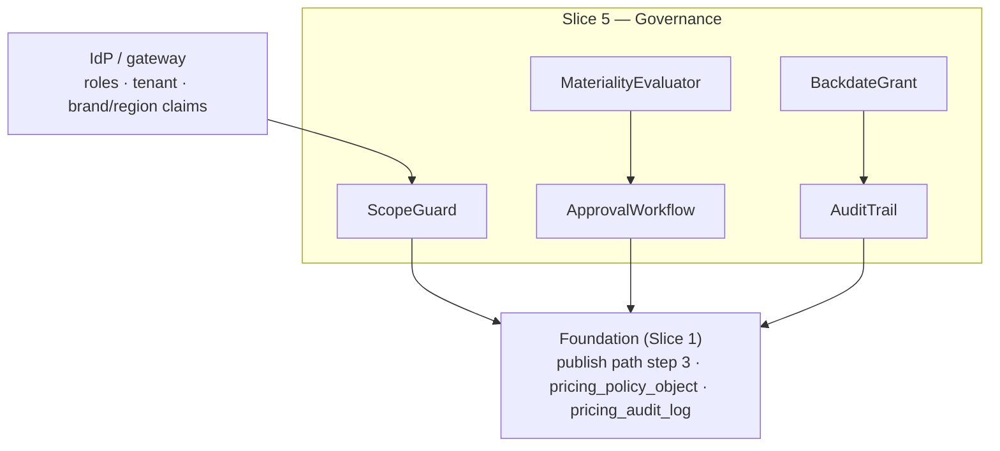

<!-- CONFLUENCE_TITLE: [BSS]: Pricing — Approval, Governance & Access Control (Design, Slice 5) -->
<!-- Related: ../PRD.md, ../DESIGN.md, ./01-foundation.md | Owners: BSS Product Catalog team -->

# DESIGN — Approval, Governance & Access Control (Slice 5)

<!-- toc -->

- [1. Context](#1-context)
  - [1.1 Overview](#11-overview)
  - [1.2 Purpose](#12-purpose)
  - [1.3 Actors](#13-actors)
  - [1.4 References](#14-references)
  - [1.5 Scope](#15-scope)
  - [1.6 Constraints & Assumptions](#16-constraints--assumptions)
  - [1.7 Naming & Design-Introduced Names](#17-naming--design-introduced-names)
  - [1.8 Context & Dependencies](#18-context--dependencies)
- [2. Actor Flows (CDSL)](#2-actor-flows-cdsl)
  - [Approve or Reject a Material Change](#approve-or-reject-a-material-change)
  - [Historical Import (Backdating)](#historical-import-backdating)
- [3. Processes / Business Logic (CDSL)](#3-processes--business-logic-cdsl)
  - [Materiality Evaluation](#materiality-evaluation)
  - [Two-Person Rule Enforcement](#two-person-rule-enforcement)
  - [RBAC and Scope Enforcement](#rbac-and-scope-enforcement)
  - [AuthZ Resource and Action Catalog (normative)](#authz-resource-and-action-catalog-normative)
  - [Audit Trail and Retention](#audit-trail-and-retention)
- [4. States (CDSL)](#4-states-cdsl)
  - [Approval State Machine](#approval-state-machine)
- [5. API Surface](#5-api-surface)
- [6. Data Model](#6-data-model)
- [7. Events & Alarms](#7-events--alarms)
- [8. Definitions of Done](#8-definitions-of-done)
  - [Two-Person Rule](#two-person-rule)
  - [Threshold Policy](#threshold-policy)
  - [RBAC & Isolation](#rbac--isolation)
  - [Backdating Governance](#backdating-governance)
  - [Audit Completeness](#audit-completeness)
- [9. Acceptance Criteria](#9-acceptance-criteria)
- [10. Non-Functional Considerations](#10-non-functional-considerations)

<!-- /toc -->

## 1. Context

### 1.1 Overview

This slice owns the **who-may-do-what layer** that gates every publish: **materiality
evaluation** against the per-currency tenant threshold policy (fail-safe: no threshold ⇒
everything is material; first publish ⇒ always material), the **two-person rule** (submitter
+ ≥ 1 independent approver, self-approval rejected and audited), **RBAC deny-by-default**
over both mutate and read/preview surfaces (with the explicit catalog-preview grant and the
restricted historical-import grant), **tenant/brand/region isolation** with the pricing
`region` decoupled from the IdP authz-region claim, and the **append-only, tamper-evident
audit trail** with ≥ 7-year jurisdiction-configurable retention. It plugs into the
Foundation's publish path as the approval step ([`01-foundation.md`](./01-foundation.md)
§4.2 step 3).

**Traces to**: `cpt-cf-bss-pricing-fr-approval-two-person`,
`cpt-cf-bss-pricing-fr-approval-threshold-policy`, `cpt-cf-bss-pricing-fr-rbac-deny-by-default`,
`cpt-cf-bss-pricing-fr-tenant-brand-isolation`, `cpt-cf-bss-pricing-fr-historical-import-governance`,
`cpt-cf-bss-pricing-fr-audit-completeness`

### 1.2 Purpose

Make an unauthorized or self-approved price change — the financial-fraud vector this domain
carries — structurally impossible: no principal can both submit and approve a material
change, no change slips under an unset threshold, no preview leaks pricing to an unlisted
role, backdating exists only as a restricted, justified, audited, downstream-side-effect-free
path, and every mutation leaves an immutable trail an auditor can rely on for 7+ years.

### 1.3 Actors

| Actor | Role in Slice |
|-------|---------------|
| `cpt-cf-bss-pricing-actor-finance-manager` | Submits publishes |
| `cpt-cf-bss-pricing-actor-finance-reviewer` | The independent approver; rejects with reason; configures the approval-threshold policy (`approval_policy × write` — deliberately not CatalogAdmin's, see the role-matrix note) |
| `cpt-cf-bss-pricing-actor-catalog-admin` | Configures roles/grants and the config plane (taxonomies, tax-display); runs governed historical imports |
| `cpt-cf-bss-pricing-actor-auditor` | Reads immutable history + approval trails; exports |
| `cpt-cf-bss-pricing-actor-partner` | Holds (only) the catalog-preview read grant |

### 1.4 References

- **PRD**: [PRD.md](../PRD.md) — §6.7 (approval subset), §6.12, §17.6 (tenant policy objects), §7.1 (audit/retention NFRs), §15 (retention-maximum open item)
- **Design**: [01-foundation.md](./01-foundation.md) — publish contract step 3 (§4.2), `pricing_policy_object`, `pricing_audit_log`
- **Dependencies**: Foundation (Slice 1). The approval step gates the publish flows of every capability slice; the backdating grant is exercised by lifecycle snapshot synthesis (Slice 11).

### 1.5 Scope

**In scope**: materiality evaluation (per-currency absolute/percent deltas, any-row-trips
rule, first-publish rule); the approval workflow (submit → approve/reject with reason →
publish); self-approval rejection + audit; RBAC deny-by-default on mutate **and**
read/preview (preview grant; backdating grant); tenant/brand/region scope enforcement (authz
region ≠ pricing region); audit-record completeness, tamper-evidence (in-DB hash chain,
D-14) and retention.

**Out of scope**: what *makes* a change (versioning/supersession — Foundation §4.3); IdP/role
administration itself (platform IdP; this slice consumes claims); the backdating *use case*
of legacy snapshot synthesis (Slice 11 — it invokes the grant + audit defined here);
customer-group membership changes' materiality semantics (Slice 9 registers its material
triggers — immediate re-resolutions and bulk group moves — into this slice's evaluator;
renewal-aligned single-membership changes are audit-only).

### 1.6 Constraints & Assumptions

Inherits Foundation C-set. Slice-5-specific:

| # | Topic | Assumption (default) | Source |
|---|-------|----------------------|--------|
| G1 | Fail-safe materiality | No configured threshold ⇒ **all** changes material; first publish (no baseline) ⇒ **always** material; auto-publish only below an explicitly configured threshold and not a first publish | PRD §1.4 |
| G2 | Two distinct principals | Submitter ≠ approver as **principals** (not roles): one human with both roles still cannot self-approve | PRD §6.7 |
| G3 | Multi-currency materiality | Each affected row's delta compares in its **own** currency; the rule trips if **any** row exceeds its threshold | PRD §6.7 |
| G4 | Tamper-evidence mechanism | **Hash-chained audit rows in the same database** (D-14; ledger precedent): the audit row commits inside the mutation's ACID transaction — no lost records on crash, and an unavailable audit store cannot exist separately from an unavailable database (fail-closed by construction). A periodic verification job walks the chain (`pricing_audit_chain_verified`); the chain head MAY be **asynchronously anchored** to external WORM/object-lock storage as hardening — never on the mutation path | PRD §6.12; D-14 |
| G5 | Retention | ≥ 7 years, tenant/jurisdiction-configurable as the **maximum applicable minimum**; jurisdictions imposing a storage-limitation **maximum** are an open Legal item | PRD §15 |

### 1.7 Naming & Design-Introduced Names

Reuses the PRD glossary; inherits Foundation mechanics. Not restated.

Design-introduced names (Slice 5):

| Name | Meaning |
|------|---------|
| `MaterialityEvaluator` | Computes the per-currency delta vs baseline and applies G1/G3; called by the Foundation publish path |
| `ApprovalWorkflow` | The submitted → approved/rejected state machine with the two-person invariant (G2) |
| `ScopeGuard` | Request-time RBAC + tenant/brand/region scope enforcement (deny-by-default; authz region ≠ pricing region) |
| `BackdateGrant` | The distinct restricted grant + mandatory-reason + audit contract for historical import |
| `AuditTrail` | Writer over `pricing_audit_log` guaranteeing actor / before-after / approval completeness + tamper evidence (G4) |

### 1.8 Context & Dependencies

**Consumed:** IdP claims (roles, tenant, brand/region authz scope); the approval-threshold
policy (`pricing_policy_object`). **Produced:** the approve/reject gate on every publish; the
audit trail every other slice's mutations flow through; the preview/backdating grants.

## 2. Actor Flows (CDSL)

### Approve or Reject a Material Change

- [ ] `p1` - **ID**: `cpt-cf-bss-pricing-flow-approval`

**Actor**: `cpt-cf-bss-pricing-actor-finance-reviewer`

**Success Scenarios**:
- A submitted material change is approved by an independent principal → the Foundation publish proceeds (events, version request)
- A rejection (with mandatory reason) returns the Plan to `draft` and notifies the submitter

**Error Scenarios**:
- Approver = submitter → `SELF_APPROVAL_FORBIDDEN` (403, audit-logged)
- Approver lacks FinanceReviewer → denied (403, audit-logged)

**Steps**:
1. [ ] - `p1` - Publish submit (any slice) runs `MaterialityEvaluator`; a non-material change (explicit threshold, below it, not first publish) auto-publishes with no approver - `inst-ap-materiality`
2. [ ] - `p1` - Material → an approval record opens (`submitted`) **pinning the exact content**: `subject_ref` + a content hash of the submitted revision; submitter identity + timestamp logged - `inst-ap-open`
2a. [ ] - `p1` - **Post-submit mutation voids the approval (TOCTOU guard):** any mutation of the subject while `submitted` invalidates the pending approval (subject returns to `draft`, the record closes `voided`, a fresh submit opens a new record); approve re-verifies the pinned content hash and rejects on mismatch (`APPROVAL_CONTENT_MISMATCH`, 409) — a reviewer can only ever approve exactly what they saw; a decision on a `voided`/already-decided record is rejected (`APPROVAL_NOT_PENDING`, 409) - `inst-ap-pin`
3. [ ] - `p1` - API: POST /v1/pricing/approvals/{id}/approve | reject (reason mandatory on reject) - `inst-ap-decide`
4. [ ] - `p1` - `ApprovalWorkflow` enforces G2 (two distinct principals; self-approval rejected + audited) - `inst-ap-twoperson`
4a. [ ] - `p1` - **Approver scope:** the approver's authz claims MUST cover every region/brand touched by the pinned change set (an EU-scoped reviewer cannot approve a US repricing); an out-of-scope approve is denied + audited like any scope violation - `inst-ap-scope`
5. [ ] - `p1` - **RETURN** approve → Foundation continues (§4.2 steps 4–5); reject → Plan back to `draft`, submitter notified - `inst-ap-return`

### Historical Import (Backdating)

- [ ] `p1` - **ID**: `cpt-cf-bss-pricing-flow-backdating`

**Actor**: `cpt-cf-bss-pricing-actor-catalog-admin` (holding the distinct `BackdateGrant`)

**Success Scenarios**:
- A historical import with past `availableFrom`/effective dates lands as **reference data** with a mandatory reason, fully audited; used e.g. for legacy snapshot synthesis (Slice 11, `migrated-origin`)

**Error Scenarios**:
- Principal without the backdating grant → denied (403, audited); the grant is never part of a default role
- Import that would generate or re-open a downstream billable charge window → rejected (`BACKDATE_SIDE_EFFECT`)
- A row failing the row-shape pipeline subset (unknown region, bad precision, duplicate scope key, malformed modelKind/eval-policy) → rejected with the enumerated report (D-13)
- Import applied without an independent approval → impossible: every import is an always-material approval unit (D-13)

**Steps**:
1. [ ] - `p1` - API: POST /v1/pricing/historical-imports (grant-gated; `reason` REQUIRED) - `inst-bd-api`
2. [ ] - `p1` - Validate zero downstream billable effect: imported rows are reference/history only — no window scheduling, no event that warms a rateable state for past periods - `inst-bd-noeffect`
2a. [ ] - `p1` - **Row-shape pipeline (D-13):** every imported row runs the fail-closed pipeline's row-shape subset — taxonomy membership, ISO 4217 minor-unit precision, scope-key uniqueness (incl. vs other imported rows), modelKind/evaluation-policy shape; window-coverage, sellability and `CatalogVersion`-addressability checks do **not** apply (reference rows are resolved only via snapshot-synthesis provenance, never via window resolution). An import can never create a row regular authoring would reject - `inst-bd-pipeline`
2b. [ ] - `p1` - **Two-person (D-13):** every historical import is an **always-material approval unit** (registered trigger): the `BackdateGrant` holder submits, an independent FinanceReviewer approves — the rows land only on approval (standard pin/void semantics). Rationale: backdated rows shape `migrated-origin` snapshots that rating consumes going forward; "zero billable effect" holds for past periods, not future rating - `inst-bd-twoperson`
3. [ ] - `p1` - `AuditTrail` records actor, reason, full row set, provenance (+ the approval trail) - `inst-bd-audit`
4. [ ] - `p1` - **RETURN** 202 (submitted for approval) → 201-equivalent completion on approval (reference rows) — the **only** sanctioned backdated path - `inst-bd-return`

## 3. Processes / Business Logic (CDSL)

### Materiality Evaluation

- [ ] `p1` - **ID**: `cpt-cf-bss-pricing-algo-materiality`

**Input**: the submitted change set + the tenant approval-threshold policy + the prior published baseline (if any)
**Output**: `material` | `auto_publishable`

**Steps**:
1. [ ] - `p1` - No explicitly configured threshold → **material** (G1, fail-safe) - `inst-mat-failsafe`
2. [ ] - `p1` - First publish (no prior baseline — no delta computable) → **material** (G1) - `inst-mat-first`
3. [ ] - `p1` - Otherwise compute per-row deltas **in each row's own currency** (absolute or percent per policy); **any** row over its threshold trips the whole change (G3); a row whose currency has **no threshold entry** in the configured policy is **material** (the G1 fail-safe applies per currency, not per policy object). Materiality is evaluated **once at submit**; a later threshold-policy change neither re-evaluates nor voids a pending approval - `inst-mat-percurrency`
3a. [ ] - `p1` - **A row without its own baseline is material:** adding a new row to a published plan (a new currency/region/phase/chargeKind key) has no prior row to delta against — per the G1 fail-safe it is **always material**, regardless of thresholds - `inst-mat-newrow`
4. [ ] - `p1` - Registered material-change sources beyond price deltas — **always-material triggers**: `grandfatherUntil` tightening (Foundation §4.3), grandfathering cutovers (Slice 7), **plan retirement while a cutover unit is pending/approved-not-yet-effective** (Slice 11 — the retirement unwinds the approved unit, D-05), **immediate** membership re-resolutions and bulk group discounts/moves (Slice 9 — renewal-aligned single-membership changes are audit-only, not material), **historical imports** (this slice, D-13 — every import, since backdated rows shape `migrated-origin` snapshots), and **approval-threshold-policy mutations themselves** (this slice, D-10 — direction-agnostic: any policy diff needs an independent second FinanceReviewer; the two-person rule's foundation must not be single-person-editable. Bootstrap is fail-safe: a single-reviewer tenant simply leaves the policy unset ⇒ everything material). Grant-price changes (Slice 10) are **not** always-material: they are evaluated as ordinary price deltas under the per-currency threshold policy - `inst-mat-registered`

### Two-Person Rule Enforcement

- [ ] `p1` - **ID**: `cpt-cf-bss-pricing-algo-two-person`

**Input**: an approval decision request
**Output**: accepted decision, or a rejected + audited violation

**Steps**:
1. [ ] - `p1` - Approver principal MUST differ from the submitter principal (G2 — identity comparison, not role) - `inst-tp-distinct`
2. [ ] - `p1` - A self-approval attempt is rejected **and** written to `pricing_audit_log` (attempted-violation record) - `inst-tp-selfaudit`
3. [ ] - `p1` - Submitter and approver identities + timestamps land on the approval record and in the audit trail; a rejection carries its mandatory reason - `inst-tp-record`

### RBAC and Scope Enforcement

- [ ] `p1` - **ID**: `cpt-cf-bss-pricing-algo-rbac`

**Input**: every request (mutate, read, preview) + IdP claims
**Output**: allow, or deny (audited)

**Steps**:
1. [ ] - `p1` - **PEP/PDP model (platform-standard, ledger precedent):** every ctx-bearing service path calls the shared `access_scope` gate (`authz_resolver_sdk::PolicyEnforcer`) with a `(resource_type, action)` pair from the §AuthZ catalog **before** touching the repository; the PDP-compiled `AccessScope` is the SQL filter SecureORM binds to `tenant_id` (reads) and the write-target membership assertion (writes). Stub type-schemas for every label register at gear init so RBAC role-definitions can target them - `inst-rb-pep`
2. [ ] - `p1` - **Deny-by-default, both directions**: mutate APIs permit exactly the roles the role matrix grants the relevant `(resource, action)` — e.g. `plan × write`: ProductManager/FinanceManager/CatalogAdmin — never a hardcoded role list; read/preview APIs deny an unlisted-role principal unless it holds the explicit **catalog-preview read grant** (`plan × preview`, region/brand-scoped by claims) - `inst-rb-deny`
3. [ ] - `p1` - Denied attempts are audit-logged (actor, surface, claim set) - `inst-rb-audit`
4. [ ] - `p1` - **Tenant isolation** (SecureORM, Foundation) + brand/region **authz scoping** at the gateway; mutating a price row whose pricing `region` the caller's authz scope does not grant is denied + audited — pricing `region` is a commercial axis, never conflated with the authz-region claim - `inst-rb-region`
5. [ ] - `p1` - The **backdating grant** (`historical_import × write`) is a distinct restricted resource, never included in a default role (`BackdateGrant`) - `inst-rb-backdate`

### AuthZ Resource and Action Catalog (normative)

- [ ] `p1` - **ID**: `cpt-cf-bss-pricing-algo-authz-catalog`

**Input**: every API surface of every slice (2–12)
**Output**: the single `(resource_type, action)` catalog the PEP enforces and RBAC roles target

**Resource-type labels** — GTS ids `gts.cf.bss.pricing.<noun>.v1~`, all **OUTSIDE**
`gts.cf.resources.*` (pricing data is commercially sensitive: the built-in
Reader/Contributor/Owner roles do NOT auto-cover it; access requires explicit catalog
roles). Each action sits on its **real object** (a noun), never an authz tier:

| Label | Object | Actions |
|-------|--------|---------|
| `gts.cf.bss.pricing.plan.v1~` | Plans + price rows + row-attached primitives (the authoring data plane) | `write` (draft create/update/clone/delete-draft, cutover, `grandfatherUntil` tighten), `publish` (submit for publish), `retire`, `migrate` (schedule/cancel a migration), `read` (authoring read incl. drafts), `preview` (the partner-facing base-price preview grant) |
| `gts.cf.bss.pricing.bundle.v1~` | Bundle composition + rev-share | `write`, `read` |
| `gts.cf.bss.pricing.price_overlay.v1~` | `PriceOverlays` (all scopes) | `write`, `read` |
| `gts.cf.bss.pricing.customer_group.v1~` | Group taxonomy + per-payer membership (payer-level commercial data — its OWN resource, more sensitive than plan authoring) | `write`, `read` |
| `gts.cf.bss.pricing.approval.v1~` | Approval decisions | `approve` (approve/reject; `preparer ≠ approver` enforced server-side), `read` |
| `gts.cf.bss.pricing.approval_policy.v1~` | The tenant approval-threshold policy — deliberately a **SEPARATE** resource from `config` (segregation of duties: a config admin must not weaken its own approval thresholds; ledger `dual_control_policy` precedent), and its mutation is **itself two-person** (always-material approval unit — D-10) | `write`, `read` |
| `gts.cf.bss.pricing.config.v1~` | Tax-display policy + region/brand taxonomies (the tenant config plane) | `write`, `read` |
| `gts.cf.bss.pricing.historical_import.v1~` | Governed backdated reference import — its OWN resource so the restricted `BackdateGrant` is targetable without any other authority | `write` |
| `gts.cf.bss.pricing.audit.v1~` | Audit/history read + export — its OWN resource so a forensic/audit role carries no read of live pricing and no write authority | `read`, `export` |

**Endpoint → `(resource, action)` mapping** — every REST surface declared by Slices 2–12:

| Surface (slice) | Resource × Action |
|-----------------|-------------------|
| `POST/PATCH /v1/pricing/plans*`, `POST /v1/pricing/plans/{id}/prices*`, `DELETE …/prices/{id}` (S2/S3) | `plan × write` |
| `POST /v1/pricing/plans/{id}/publish` (S2) | `plan × publish` |
| `GET /v1/pricing/plans*`, `GET …/prices`, `GET …/coverage`, `GET …/sellability`, `GET /v1/pricing/migrations/{id}`, `GET /v1/pricing/bulk-imports/{id}`, `GET /v1/pricing/repricing-runs/{id}` (S2/S3/S7/S11/S12) | `plan × read` |
| `GET /v1/pricing/plans/{id}/preview` (S4) | `plan × preview` |
| `POST /v1/pricing/plans/{id}/cutovers`, `PATCH /v1/pricing/prices/{id}/grandfather-until` (S7) | `plan × write` (+ material approval) |
| `POST /v1/pricing/prices/{id}/windows`, `PATCH/DELETE /v1/pricing/price-windows/{id}` (S7 — owned window machinery, D-03) | `plan × write` (a window is an attribute of the row's sellable life) |
| Plan retirement / `POST` migration schedule / cancel (S11) | `plan × retire` / `plan × migrate` |
| `POST/PATCH /v1/pricing/bundles*` (S8 authoring) | `bundle × write` |
| `POST /v1/pricing/bundles/{id}/publish` (S8) | `plan × publish` **only** (D-11) — the composition was authored under `bundle × write` and is protected by the approval content pin at publish time; component checks inside publish are validations, not caller authz |
| `POST/PATCH /v1/pricing/price-overlays*` (S9) | `price_overlay × write`; `GET` → `price_overlay × read` |
| `/v1/pricing/customer-groups/*` (S9: taxonomy + membership) | `customer_group × write` / `read` |
| `GET/POST /v1/pricing/approvals*` (S5) | `approval × read` / `approve` |
| `GET/PUT /v1/pricing/config/approval-threshold-policy` (S5) | `approval_policy × read` / `write` |
| `GET/PUT /v1/pricing/config/taxonomies/{region,brand}`, `GET/PUT /v1/pricing/config/tax-display-policy` (S4) | `config × read` / `write` — the customer-group taxonomy is **not** here: it lives at `/v1/pricing/customer-groups/taxonomy` under `customer_group` (more sensitive) |
| `POST /v1/pricing/historical-imports` (S5/S11) | `historical_import × write` |
| `GET /v1/pricing/audit` (S5) | `audit × read` / `export` — **Auditor-only** (actor trails, before/after, approval decisions; D-12) |
| `GET /v1/pricing/history`, `POST /v1/pricing/history/export` (S12) | `plan × read` — price history is plan/price data (chronological view over append-only rows), Finance-readable by construction (D-12) |
| Bulk import / mass repricing / clone (S12) | the **same** `plan × write` / `publish` — bulk is authoring at scale, no new authority |
| Published read model (Tariffs/Rating/Subscriptions/Billing) | service-to-service identities with `plan × read` scoped by the platform service trust; never the human preview grant |

**Role → permission matrix** (targeted via the registered label type-schemas):

| Role / grant | Permissions |
|--------------|-------------|
| **ProductManager** | `plan × write/read`, `bundle × write/read` |
| **FinanceManager** | `plan × write/publish/read`, `bundle × read`, `price_overlay × read` |
| **CatalogAdmin** | `plan × write/publish/retire/migrate/read`, `bundle × write/read`, `price_overlay × write/read`, `customer_group × write/read`, `config × write/read`, `approval × read` |
| **FinanceReviewer** | `approval × approve/read`, `approval_policy × write/read`, `plan × read` |
| **Auditor** | `audit × read/export`, `plan × read` |
| **Preview grant** (partner) | `plan × preview` only (region/brand-scoped) |
| **BackdateGrant** | `historical_import × write` only — never bundled into the roles above |

Notes: **no role carries both `plan × publish` and `approval × approve`** in the default
matrix at the *principal* level — the two-person rule additionally enforces
`submitter ≠ approver` server-side even when a custom role grants both. CatalogAdmin
deliberately lacks `approval_policy × write` (it cannot weaken thresholds it operates
under) and `approval × approve` (it publishes, it does not approve itself).

### Audit Trail and Retention

- [ ] `p1` - **ID**: `cpt-cf-bss-pricing-algo-audit`

**Input**: every plan/price mutation, approval decision, denied attempt, backdated import
**Output**: an immutable, tamper-evident audit record

**Steps**:
1. [ ] - `p1` - Record completeness: actor, timestamp, **before/after version refs**, approval trail (submitter/approver/decision/reason), correlation id - `inst-au-complete`
1a. [ ] - `p1` - **PII minimization:** the audit trail stores **pseudonymous principal ids**, never display names/emails — the 7-year retention then holds no directly-identifying operator PII and GDPR erasure of a departed operator stays an IdP concern, not an audit rewrite - `inst-au-pii`
2. [ ] - `p1` - Tamper evidence per G4 (D-14): append-only role + triggers (as the Foundation tables) **plus** in-DB hash-chained rows committed in the mutation transaction; a periodic job verifies the chain (`pricing_audit_chain_verified`), and the chain head MAY be async-anchored to external WORM/object-lock storage — prior versions cannot be mutated or deleted within retention - `inst-au-tamper`
3. [ ] - `p1` - Retention ≥ 7 years, tenant/jurisdiction-configurable as the **maximum applicable minimum** (G5); the storage-limitation-maximum question is an open Legal item — the retention engine takes a per-jurisdiction config, not a hardcoded value - `inst-au-retention`
4. [ ] - `p2` - Auditor read surface: the **audit trail** (actor + before/after + approval decisions) under **Auditor-only** filters (`audit × read`); Finance's chronological **price history** is the separate Slice 12 surface under `plan × read` (D-12); export p95 ≤ 5s / 100 records applies to both - `inst-au-read`

## 4. States (CDSL)

### Approval State Machine

- [ ] `p1` - **ID**: `cpt-cf-bss-pricing-state-approval`

**States**: submitted, approved, rejected, voided
**Initial State**: submitted (opened by a material publish; submitter recorded)

**Transitions**:
1. [ ] - `p1` - **FROM** submitted **TO** approved **WHEN** an independent FinanceReviewer approves (G2 holds) → the Foundation publish continues - `inst-as-approve`
2. [ ] - `p1` - **FROM** submitted **TO** rejected **WHEN** the reviewer rejects with a mandatory reason → the Plan returns to `draft`, the submitter is notified. For **non-plan subjects**, reject returns the change set to its slice-defined pre-submit state (cutover unit discarded, membership change not applied, batch not committed) — the owning slice defines the surface; this slice defines the record - `inst-as-reject`
3. [ ] - `p1` - **FROM** submitted **TO** voided **WHEN** the pinned subject mutates post-submit (TOCTOU guard, `inst-ap-pin`); a fresh submit opens a new record - `inst-as-void`
4. [ ] - `p1` - Approval records are immutable once decided (append-only; a re-submit opens a **new** record) - `inst-as-immutable`

## 5. API Surface

| Method | Path | Purpose | Idempotency |
|--------|------|---------|-------------|
| `GET` | `/v1/pricing/approvals` | List pending/decided approvals (reviewer scope) | — |
| `POST` | `/v1/pricing/approvals/{id}/approve` | Approve (independent principal only) | per decision |
| `POST` | `/v1/pricing/approvals/{id}/reject` | Reject with mandatory reason | per decision |
| `GET/PUT` | `/v1/pricing/config/approval-threshold-policy` | Tenant threshold policy (per-currency; unset ⇒ two-person always). The PUT opens an **always-material approval unit** — the diff applies only after an independent FinanceReviewer approves (D-10) | ETag + approval unit |
| `POST` | `/v1/pricing/historical-imports` | Governed backdated reference import (`BackdateGrant` + reason) | client idempotency key |
| `GET` | `/v1/pricing/audit` | Auditor read (filters; export) | — |

**Problem responses (RFC 9457):** `SELF_APPROVAL_FORBIDDEN` (403), `APPROVAL_ROLE_REQUIRED`
(403), `APPROVAL_CONTENT_MISMATCH` (409 — the pinned content hash no longer matches at
decision time, `inst-ap-pin`), `APPROVAL_NOT_PENDING` (409 — decision on a voided/decided
record), `REASON_REQUIRED` (422), `BACKDATE_GRANT_REQUIRED` (403), `BACKDATE_SIDE_EFFECT`
(422), `REGION_SCOPE_DENIED` (403), `THRESHOLD_INVALID` (422).

## 6. Data Model

Slice-owned tables (tenant-scoped, SecureORM; `pricing_` prefix per Foundation §3.7):

**`pricing_approval`** (PK `approval_id`; immutable once decided):

| Column | Type | Notes |
|--------|------|-------|
| `approval_id` | `uuid` | PK |
| `tenant_id` | `uuid` | RLS scope |
| `subject_ref` | `uuid` | the plan revision / change set under approval |
| `content_hash` | `bytes` | hash of the pinned submitted content; approve re-verifies it (TOCTOU guard). For a **batch** subject (bulk import / mass repricing) the pin is a **per-row hash set** and this column holds its digest — enabling Slice 12's subset-commit + unchanged-row approval reuse |
| `state` | `enum` | `submitted \| approved \| rejected \| voided` |
| `submitter_principal` | `string` | identity, not role |
| `approver_principal` | `string` | NULL until decided; `CHECK (approver_principal <> submitter_principal)` |
| `reason` | `text` | mandatory on reject |
| `materiality` | `jsonb` | evaluator output: per-currency deltas, tripped rows, trigger source |
| `submitted_at` / `decided_at` | `timestamptz` | UTC |

**Approval-threshold policy** — a `pricing_policy_object` entry (Foundation-owned):
per-currency `{absolute_minor | percent}` thresholds; **unset ⇒ two-person rule always** (G1).

**`pricing_audit_log` (Foundation-owned; this slice is the writer contract)** — actor,
timestamp, before/after version refs, approval trail, correlation id, denied-attempt records,
backdate provenance; append-only + tamper evidence (G4); per-jurisdiction retention config (G5).

**Grants** — the catalog-preview read grant and the `BackdateGrant` are IdP/gateway-managed
claims; this slice defines their semantics and enforcement points, not their administration.

## 7. Events & Alarms

No new frozen event names (approval outcomes gate `PlanPublished` emission; they do not add
events). Alarms: `pricing.governance.self_approval_attempt` (Warn — audited violation
attempts), `pricing.governance.denied_mutation_burst` (Warn — potential probing),
`pricing.audit.chain_gap` (Critical — tamper-evidence verification failure, G4).

## 8. Definitions of Done

### Two-Person Rule

- [ ] `p1` - **ID**: `cpt-cf-bss-pricing-dod-two-person`

A material change **MUST** require one independent approver (two distinct principals) before
`PlanPublished`; self-approval **MUST** be rejected and audit-logged; identities + timestamps
**MUST** be recorded; rejection returns the plan to `draft` with reason + notification. The
submission **MUST** pin the content hash; post-submit mutation voids the approval; approve
verifies the pin and the approver's region/brand scope over the pinned change.

**Implements**: `cpt-cf-bss-pricing-flow-approval`, `cpt-cf-bss-pricing-algo-two-person`, `cpt-cf-bss-pricing-state-approval`

**Touches**:
- API: `POST /v1/pricing/approvals/{id}/approve|reject`
- DB: `pricing_approval`
- Entities: `ApprovalWorkflow`

### Threshold Policy

- [ ] `p1` - **ID**: `cpt-cf-bss-pricing-dod-threshold`

Materiality **MUST** evaluate per-currency (absolute/percent, any-row-trips), with the
fail-safe defaults: unset threshold ⇒ all material; first publish ⇒ always material;
auto-publish only below an explicit threshold and never on a first publish; a row whose
currency lacks a threshold entry is material. Registered always-material triggers
(grandfather tightening, cutovers, retirement-with-live-cutover, immediate membership
re-resolutions / bulk group moves, **threshold-policy mutations themselves — D-10**) **MUST**
route through the same evaluator; grant-price changes evaluate as ordinary price deltas.

**Implements**: `cpt-cf-bss-pricing-algo-materiality`

**Touches**:
- API: `GET/PUT /v1/pricing/config/approval-threshold-policy`
- DB: `pricing_policy_object`, `pricing_approval` (materiality)
- Entities: `MaterialityEvaluator`

### RBAC & Isolation

- [ ] `p1` - **ID**: `cpt-cf-bss-pricing-dod-rbac`

Mutate **and** read/preview surfaces **MUST** be deny-by-default (preview needs the explicit
grant, region/brand-scoped); denied attempts audit-logged; tenant isolation enforced; a
mutation scoped to a pricing `region` outside the caller's authz scope **MUST** be denied +
audited (authz region never conflated with pricing region). Every surface **MUST** enforce
through the shared PEP gate with its catalogued `(resource, action)` pair; the label
type-schemas **MUST** register at gear init; the label set and the endpoint mapping are
normative per the AuthZ catalog.

**Implements**: `cpt-cf-bss-pricing-algo-rbac`, `cpt-cf-bss-pricing-algo-authz-catalog`

**Touches**:
- DB: `pricing_audit_log` (denial records)
- Entities: `ScopeGuard` (PEP gate + `resource_types`/`actions` catalog + label type-schema registration)

### Backdating Governance

- [ ] `p1` - **ID**: `cpt-cf-bss-pricing-dod-backdating`

Historical import **MUST** require the distinct restricted grant + a mandatory reason, run
the row-shape pipeline subset (an import can never create a row regular authoring would
reject), route through an **always-material approval** (independent second person — D-13), be
fully audited (incl. the approval trail), and produce **zero** downstream billable effect
(reference/history rows only) — the only sanctioned backdated path.

**Implements**: `cpt-cf-bss-pricing-flow-backdating`

**Touches**:
- API: `POST /v1/pricing/historical-imports`
- DB: `pricing_audit_log`
- Entities: `BackdateGrant`, `AuditTrail`

### Audit Completeness

- [ ] `p1` - **ID**: `cpt-cf-bss-pricing-dod-audit`

Every mutation **MUST** record actor/timestamp/before-after/approval trail — the actor as a
**pseudonymous principal id** (no display names/emails); history retained
≥ 7 years (jurisdiction-configurable, maximum applicable minimum) in append-only,
tamper-evident storage (in-DB hash chain, committed in the mutation transaction; optional
async WORM anchoring — D-14) — no mutation or deletion within retention.

**Implements**: `cpt-cf-bss-pricing-algo-audit`

**Touches**:
- API: `GET /v1/pricing/audit`
- DB: `pricing_audit_log`
- Entities: `AuditTrail`

## 9. Acceptance Criteria

Delta over the Foundation testing architecture.

Unit:

- [ ] Materiality matrix: unset policy ⇒ material; first publish ⇒ material; below explicit threshold ⇒ auto; multi-currency any-row-trips (one row over its own-currency threshold trips); registered always-material triggers route through
- [ ] Two-person: same-principal approve rejected (even with both roles); distinct principal passes
- [ ] RBAC: each surface × role matrix; unlisted role denied on read without the preview grant

Integration (testcontainers):

- [ ] A material publish blocks until an independent approval; self-approval attempt returns 403 **and** lands an audit record
- [ ] Mutating a subject while its approval is `submitted` voids the approval (record closes `voided`; a fresh submit is required)
- [ ] An approve carrying a stale pinned hash is rejected (`APPROVAL_CONTENT_MISMATCH`, 409)
- [ ] An approver whose region/brand scope does not cover the pinned change is rejected (403) and the attempt audited
- [ ] A below-threshold non-first publish auto-publishes with no approver; a row in a currency with no threshold entry is material
- [ ] A threshold-policy PUT opens an always-material approval unit: the diff applies only after an **independent** FinanceReviewer approves (self-approval 403); a policy mutation while the unit pends voids it (pin semantics); in-flight submissions keep their submit-time materiality
- [ ] A backdated import without the grant → 403; with the grant but no reason → 422; a valid one lands **only after an independent approval** (always material) and produces reference rows, an audit record incl. the approval trail, and **no** window/event side effects
- [ ] An import row with an unknown region / over-precision amount / duplicate scope key is rejected by the row-shape pipeline (enumerated report) — parity with regular authoring
- [ ] A mutation on a pricing region outside the caller's authz scope → 403 + audit record
- [ ] Audit rows resist UPDATE/DELETE (role + trigger); the tamper-evidence check detects a manually corrupted row (G4 mechanism)

API:

- [ ] RFC 9457 mapping for the §5 codes; audit export p95 ≤ 5s / 100 records

## 10. Non-Functional Considerations

- **Performance**: `ScopeGuard` is a per-request claims check (no DB read); `MaterialityEvaluator` reads the prior baseline from the read model — publish-path only. Audit writes share the mutation transaction (no lost records on crash).
- **Observability / metrics**: `pricing_approvals_pending` gauge, `pricing_approval_decision_seconds`, `pricing_self_approval_attempts_total`, `pricing_denied_requests_total{surface}`, `pricing_audit_chain_verified` (G4 verification job).
- **Security & AuthZ**: this slice **is** the security surface; its own config mutations are audited and role-split per the SoD note in the AuthZ catalog — taxonomy/tax-display (`config × write`, CatalogAdmin); the approval-threshold policy (`approval_policy × write`, FinanceReviewer — never CatalogAdmin); rate-limiting/mutation quotas are a platform/gateway NFR (deferred there, PRD §15).
- **Risks & open items**: retention maximum-vs-minimum conflict (open with Legal, G5 — engine is config-driven to absorb the answer); G4 is **decided** (in-DB hash chain, D-14) — the optional external anchor cadence is an implementation knob.
