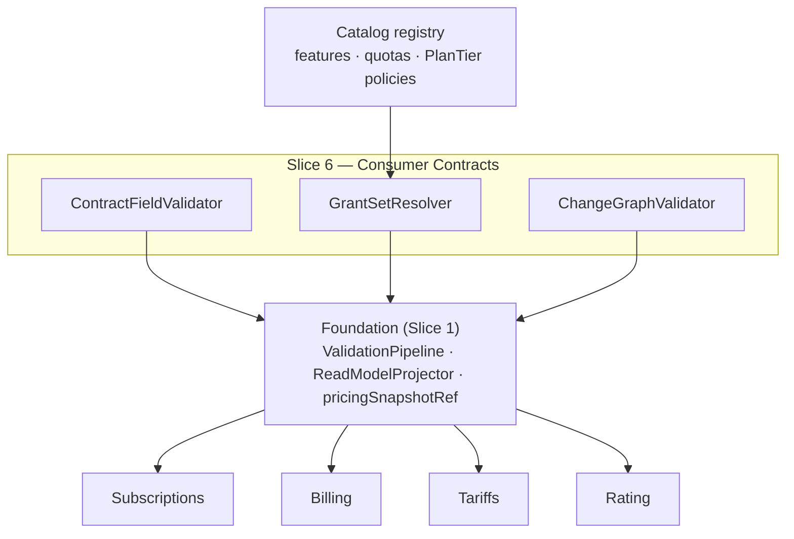

<!-- CONFLUENCE_TITLE: [BSS]: Pricing — Consumer Contracts (Design, Slice 6) -->
<!-- Related: ../PRD.md, ../DESIGN.md, ./01-foundation.md | Owners: BSS Product Catalog team -->

# DESIGN — Consumer Contracts (Slice 6)

<!-- toc -->

- [1. Context](#1-context)
  - [1.1 Overview](#11-overview)
  - [1.2 Purpose](#12-purpose)
  - [1.3 Actors](#13-actors)
  - [1.4 References](#14-references)
  - [1.5 Scope](#15-scope)
  - [1.6 Constraints & Assumptions](#16-constraints--assumptions)
  - [1.7 Naming & Design-Introduced Names](#17-naming--design-introduced-names)
  - [1.8 Context & Dependencies](#18-context--dependencies)
- [2. Actor Flows (CDSL)](#2-actor-flows-cdsl)
  - [Resolve Consumer Contracts from the Read Model](#resolve-consumer-contracts-from-the-read-model)
- [3. Processes / Business Logic (CDSL)](#3-processes--business-logic-cdsl)
  - [Proration Input Contract](#proration-input-contract)
  - [Billing Timing](#billing-timing)
  - [Entitlement Grant Set](#entitlement-grant-set)
  - [Plan-Change Contract](#plan-change-contract)
  - [Rating Compatibility Contract](#rating-compatibility-contract)
- [4. States (CDSL)](#4-states-cdsl)
- [5. API Surface](#5-api-surface)
- [6. Data Model](#6-data-model)
- [7. Events & Alarms](#7-events--alarms)
- [8. Definitions of Done](#8-definitions-of-done)
  - [Proration Inputs](#proration-inputs)
  - [Billing Timing on Recurring Rows](#billing-timing-on-recurring-rows)
  - [Entitlement Grants](#entitlement-grants)
  - [Plan Change](#plan-change)
  - [Rating Compatibility](#rating-compatibility)
- [9. Acceptance Criteria](#9-acceptance-criteria)
- [10. Non-Functional Considerations](#10-non-functional-considerations)

<!-- /toc -->

## 1. Context

### 1.1 Overview

This slice owns the **frozen read-model fields downstream systems compute from** — the
contracts that make Subscriptions' proration, Billing's deferral, and Rating's resolution
deterministic without a single defaulted field: the **proration input contract**
(`billingAnchorPolicy`, the canonical `prorationBasis` enum, `creditOnDowngrade`),
**`billingTiming`** on every recurring row, the **entitlement grant set** (or its
`PlanTier`-resolved reference), the **plan-change contract** (`allowedChangeTargets`,
`comparabilityRank` — absence = no self-service change), and the **rating compatibility
contract** (`{skuId, planId, priceId}` + evaluation-policy completeness). The catalog
publishes inputs; the math and enforcement live downstream.

**Traces to**: `cpt-cf-bss-pricing-fr-proration-input-contract`,
`cpt-cf-bss-pricing-fr-billing-timing`, `cpt-cf-bss-pricing-fr-entitlement-grant-set`,
`cpt-cf-bss-pricing-fr-plan-change-contract`, `cpt-cf-bss-pricing-fr-rating-compatibility`

### 1.2 Purpose

Kill the enum-drift and default-substitution failure class across three consumer seams: the
same frozen `prorationBasis` value drives Subscriptions' and Tariffs' math (one enum, owned
here, adopted verbatim); Billing's deferral derives from an explicit frozen `billingTiming`;
plan changes only happen along Finance-approved edges. Every field is publish-validated —
absence fails publish, so a consumer can rely on presence.

### 1.3 Actors

| Actor | Role in Slice |
|-------|---------------|
| `cpt-cf-bss-pricing-actor-subscriptions` | Computes proration/plan-change/trial/entitlements from the published inputs |
| `cpt-cf-bss-pricing-actor-billing` | Derives deferral policy from `billingTiming` |
| `cpt-cf-bss-pricing-actor-rating` | Adopts `prorationBasis` verbatim; evaluates evaluation-policy fields; resolves `{skuId, planId, priceId}` deterministically (consolidated gear — rating ADR-0002) |
| `cpt-cf-bss-pricing-actor-catalog-registry` | Defines the features/quotas/`PlanTier` policies the grant set references |
| `cpt-cf-bss-pricing-actor-finance-manager` | Authors anchor/proration/change-target values |

### 1.4 References

- **PRD**: [PRD.md](../PRD.md) — §6.9, §17.6 (consumer contracts detail), §1.4 (Glossary: `prorationBasis`, `billingAnchorPolicy`, `billingTiming`, `allowedChangeTargets`, `comparabilityRank`)
- **Design**: [01-foundation.md](./01-foundation.md) — read model + snapshot (§4.4); [02-plan-definition.md](./02-plan-definition.md) — the rows/phases these fields attach to
- **Dependencies**: Foundation, plan-definition, price-structure (Slices 1–3): the contract fields attach to their rows and freeze in their snapshot.

### 1.5 Scope

**In scope**: authoring + publish validation + read-model projection of the five contracts;
the canonical `prorationBasis` enum ownership; the cross-boundary (currency/region/frequency)
mid-cycle rejection marker; grant-set referential validation against the registry.

**Out of scope**: proration **math**, plan-change execution, trial runtime, entitlement
**enforcement** (Subscriptions); deferral execution (Billing); formula evaluation (Tariffs);
the golden proration fixture content (jointly owned, gated in Slice 3's fixture registry
pattern); `PlanLink` migration (Slice 11).

### 1.6 Constraints & Assumptions

Inherits Foundation C-set. Slice-6-specific:

| # | Topic | Assumption (default) | Source |
|---|-------|----------------------|--------|
| K1 | Canonical proration enum | `prorationBasis ∈ {calendar_days_actual, calendar_days_30, by_second, whole_unit, none}` — owned here, adopted **verbatim** by Tariffs; any extension is a versioned contract change | PRD §1.4 |
| K2 | Anchor month-end/UTC | `billingAnchorPolicy ∈ {calendar_month, subscription_start, fixed_day(d)}`; `fixed_day(d)` — and a `subscription_start` anchor under monthly-granular cycles incl. `customEveryN Months(n)` (D-20) — with a day > month length anchors on the **last day of the month**, the **anchor day preserved** across periods (independent per-period clamp: 31→28→31, no drift); all anchor math UTC | PRD §1.4; D-20 |
| K3 | Cross-boundary changes | Mid-cycle changes crossing currency/region/frequency are **not supported at launch** → cancel + new subscription; the contract publishes **no** cross-boundary credit basis; written sign-off (Subscriptions + Finance + GTM) is an open item | PRD §17.6 |
| K4 | Rank vs PlanTier | `PlanTier` alone is **not** an ordering unless published as authoritative; otherwise `comparabilityRank` is REQUIRED for any plan in self-service change | PRD §1.4 |
| K5 | Proration fixture | The joint proration golden fixture (catalog + Subscriptions + Tariffs) exists before code; publish-contract sign-off gates on it | PRD §13 |

### 1.7 Naming & Design-Introduced Names

Reuses the PRD glossary; inherits Foundation mechanics. Not restated.

Design-introduced names (Slice 6):

| Name | Meaning |
|------|---------|
| `ContractFieldValidator` | Registered rules: presence/placement of the five contracts' fields at publish |
| `GrantSetResolver` | Validates the entitlement grant set (or `PlanTier` reference) against registry definitions; projects the resolved set |
| `ChangeGraphValidator` | Validates `allowedChangeTargets` (published targets only) + `comparabilityRank` presence per K4 |

### 1.8 Context & Dependencies

**Consumed:** registry feature/quota/`PlanTier` definitions. **Produced:** the five frozen
contracts in the read model + `pricingSnapshotRef` — the fields Subscriptions/Billing/
Tariffs/Rating compute from.

## 2. Actor Flows (CDSL)

### Resolve Consumer Contracts from the Read Model

- [ ] `p1` - **ID**: `cpt-cf-bss-pricing-flow-contract-resolution`

**Actor**: `cpt-cf-bss-pricing-actor-subscriptions`, `cpt-cf-bss-pricing-actor-billing`, `cpt-cf-bss-pricing-actor-rating`

**Success Scenarios**:
- A consumer pins a committed `CatalogVersion` and reads the contract fields exactly as published (Foundation §4.4): proration inputs on recurring rows, `billingTiming`, the grant set, the change contract, `{skuId, planId, priceId}`
- Absence semantics are trustworthy: a missing `allowedChangeTargets` **means** no self-service change (fail-safe), never "unknown"

**Error Scenarios**:
- A consumer requesting a field on a plan published before this contract existed → the field is **absent by version**, and the consumer's own fail-safe applies (no catalog-side default synthesis)

**Steps**:
1. [ ] - `p1` - Consumer resolves via `pricingSnapshotRef` / the read-model API (Foundation `cpt-cf-bss-pricing-interface-catalog-read-model`) - `inst-cr-resolve`
2. [ ] - `p1` - No default substitution: every REQUIRED field was publish-validated present; optional fields carry defined absence semantics (fail-safe) - `inst-cr-nodefault`
3. [ ] - `p1` - **RETURN** the frozen contract set, stable for the pinned version - `inst-cr-return`

## 3. Processes / Business Logic (CDSL)

### Proration Input Contract

- [ ] `p1` - **ID**: `cpt-cf-bss-pricing-algo-proration-inputs`

**Input**: every recurring price row at publish
**Output**: `billingAnchorPolicy` + `prorationBasis` + `creditOnDowngrade` frozen in the read model / snapshot

**Steps**:
1. [ ] - `p1` - All three fields REQUIRED on recurring rows; absence fails publish - `inst-pi-required`
1a. [ ] - `p1` - **`creditOnDowngrade` semantics (normative):** on a downgrade the governing value is the **source** row's flag (the row whose prepaid period is surrendered), read from the **subscription's frozen snapshot** — never the target row and never the live catalog - `inst-pi-credit-source`
1b. [ ] - `p1` - **Cross-field consistency:** `creditOnDowngrade = true` on a row with `prorationBasis = none` is a contradiction (credit granted but no basis to compute a partial period) — publish rejects it - `inst-pi-credit-none`
2. [ ] - `p1` - `prorationBasis` values per K1 — the canonical enum is **owned here**; Tariffs adopts verbatim; Subscriptions computes the amount from the same frozen value (one source, no drift) - `inst-pi-enum`
3. [ ] - `p1` - `billingAnchorPolicy` per K2: `fixed_day(d)` beyond month length anchors last-of-month; the same clamp + preserved-anchor-day rule applies to `subscription_start` under `customEveryN Months(n)` (D-20); all anchor math UTC; `customEveryN Days(n)` plans MUST carry `subscription_start` (cross-checked with Slice 2's cycle rule); the anchor math rides the joint proration/anchor fixture - `inst-pi-anchor`
4. [ ] - `p1` - **Cross-boundary marker (K3):** the contract publishes no cross-currency/region/frequency credit basis; such a mid-cycle change is rejected for in-place proration (cancel + new subscription; operator warned that in-place credit is forfeited — enforcement in Subscriptions). The published artifact is a **contract-level pair of read-model fields**: `crossBoundaryChangePolicy = cancel_plus_new` + `crossBoundaryWarningText`, projected into `pricing_read_model` (§6) - `inst-pi-crossboundary`

### Billing Timing

- [ ] `p1` - **ID**: `cpt-cf-bss-pricing-algo-billing-timing`

**Input**: recurring/usage rows at publish
**Output**: explicit frozen `billingTiming` per recurring row

**Steps**:
1. [ ] - `p1` - `billingTiming ∈ {in_advance, in_arrears}` REQUIRED on every recurring row; absence fails publish (also enforced in Slice 2's recurring-cycle rule — one rule, registered once, referenced by both) - `inst-bt-required`
2. [ ] - `p1` - Usage rows are implicitly `in_arrears` (not authored, projected constant); a hybrid MAY mix `in_advance` base + `in_arrears` usage - `inst-bt-usage`
3. [ ] - `p1` - Frozen in `pricingSnapshotRef`; Billing derives deferral policy from it — never from heuristics - `inst-bt-frozen`

### Entitlement Grant Set

- [ ] `p1` - **ID**: `cpt-cf-bss-pricing-algo-grant-set`

**Input**: the plan's grant set (feature flags, quotas) or its `PlanTier`-resolved reference
**Output**: the resolved grant set in the read model

**Steps**:
1. [ ] - `p1` - Publish fails if a referenced feature, quota, or `PlanTier` policy is **undefined in the registry** (`GrantSetResolver` referential check) - `inst-gs-referential`
2. [ ] - `p1` - Published shape per §17.6: `featureFlag: bool` entries + `quotaKey: value` entries (Subscriptions consumes them as Entitlements); semantics are not defined here - `inst-gs-shape`
3. [ ] - `p1` - A `PlanTier`-resolved reference publishes the **resolved** set (so Subscriptions provisioning does not re-derive from the taxonomy at runtime) plus the reference for auditability - `inst-gs-resolved`
3a. [ ] - `p1` - **Grant-set drift (D-27):** the registry can change a `PlanTier`'s feature/quota policy after publish — the catalog consumes the registry's tier-policy-change signal and flags every affected **published** plan `grants_divergent` in the read model (+ the `pricing.contracts.grants_divergent` alarm, Warn); remediation is a re-publish (re-resolving the set); consumers keep the frozen resolved set meanwhile — a flag, never a silent retro-change (mirrors S2 `inst-cmp-tier-drift`; the signal scope is part of the registry joint contract, PRD §15) - `inst-gs-drift`

### Plan-Change Contract

- [ ] `p1` - **ID**: `cpt-cf-bss-pricing-algo-plan-change`

**Input**: `allowedChangeTargets` (list or rule) + `comparabilityRank` on plans participating in self-service change
**Output**: the change contract in the read model; fail-safe absence semantics

**Steps**:
1. [ ] - `p1` - `allowedChangeTargets` entries MUST be **explicit published `planId`s** — rule-based targets are **not authorable at launch** (D-23: a rule resolves only at read time, defeating every publish-time guarantee below; the designed extension — read-time fail-safe resolution with a `partially_resolvable` marker — is §17.8 Future); a dangling target fails publish. An edge whose target is **later retired** is **inert**: Subscriptions MUST re-check the target's lifecycle state at change time (D-24) - `inst-pc-targets`
1a. [ ] - `p1` - **Mutual comparability:** for every listed target, publish validates the target carries a `comparabilityRank` (or an authoritative published `PlanTier` ordering covers both) — otherwise the runtime classification A→B is uncomputable; ranks are a single **tenant-wide scale** (authoring discipline: documented on the read model), not per-plan-local numbers - `inst-pc-mutual`
2. [ ] - `p1` - **Absence = no self-service change** (fail-safe), never any-to-any - `inst-pc-failsafe`
3. [ ] - `p1` - `comparabilityRank` REQUIRED for any plan in self-service change unless an authoritative `PlanTier` ordering is published (K4); rank semantics: higher = upgrade, lower = downgrade, equal = switch (drives proration sign/credit in Subscriptions) - `inst-pc-rank`
4. [ ] - `p1` - **Edge boundary classification (D-25):** publish classifies every change edge as `in_place` (target covers the source's `(currency, region)` set and matches frequency) or `cancel_plus_new` (crosses a K3 boundary) and **publishes the classification on the edge** — Subscriptions and the storefront disclose credit forfeiture on `cancel_plus_new` edges instead of discovering it at execution; the classification re-computes on either side's re-publish - `inst-pc-boundary`
4. [ ] - `p1` - Change-target edits are plan mutations → versioned, approvable (Slice 5 materiality applies) - `inst-pc-governed`

### Rating Compatibility Contract

- [ ] `p1` - **ID**: `cpt-cf-bss-pricing-algo-rating-compat`

**Input**: the publishing plan's full row set
**Output**: the §17.6 rating-compatibility guarantees, checked as one registered rule bundle

**Steps**:
1. [ ] - `p1` - Stable `{skuId, planId, priceId}` exposed on all downstream artifacts; ids never re-used across revisions (append-only rows guarantee this structurally, Foundation §4.3) - `inst-rc-ids`
2. [ ] - `p1` - Completeness cross-check (delegating to the owning slices' rules; this bundle asserts the **union**): `modelKind` + `quantitySource` + `packageSize`/`packagePrice` (Slice 3), `tierAggregationWindow`/`billingGranularity` on usage rows (Slice 3), meter injectivity (Slice 2), descriptors (Slice 2) - `inst-rc-union`
3. [ ] - `p1` - No monetary charge computed here — the contract is inputs-only (Foundation principle) - `inst-rc-nocompute`

## 4. States (CDSL)

No slice-owned state machine: contract fields ride the plan/price lifecycle (draft →
published → superseded/retired) owned by the Foundation and Slices 2/3. Absence semantics
(`allowedChangeTargets` missing = no self-service change) are **values**, not states.

## 5. API Surface

No new endpoints: the contracts are fields of the Foundation read-model API
(`cpt-cf-bss-pricing-interface-catalog-read-model`) and are authored through the Slice 2/3
plan/price authoring surfaces. This slice contributes:

| Concern | Where it lands |
|---------|----------------|
| Proration inputs, `billingTiming` | recurring-row fields on `POST/PATCH /v1/pricing/plans/{planId}/prices` |
| Grant set / grant reference | plan fields on `POST/PATCH /v1/pricing/plans/{planId}` |
| Change contract | plan fields on `POST/PATCH /v1/pricing/plans/{planId}` |

**Problem responses (RFC 9457):** `PRORATION_INPUTS_MISSING` (422),
`PRORATION_INPUTS_CONTRADICTORY` (422 — `creditOnDowngrade = true` with
`prorationBasis = none`, `inst-pi-credit-none`), `BILLING_TIMING_MISSING`
(422), `GRANT_REF_UNDEFINED` (422), `CHANGE_TARGET_UNPUBLISHED` (422),
`COMPARABILITY_RANK_REQUIRED` (422).

## 6. Data Model

This slice adds columns to Foundation-owned tables (no new tables; `pricing_` prefix per
Foundation §3.7):

**`pricing_price` (Slice-6 columns, recurring rows)**:

| Column | Type | Notes |
|--------|------|-------|
| `billing_anchor_policy` | `enum` | `calendar_month \| subscription_start \| fixed_day`; + `anchor_day` (`int`, for `fixed_day`) |
| `proration_basis` | `enum` | `calendar_days_actual \| calendar_days_30 \| by_second \| whole_unit \| none` (K1) |
| `credit_on_downgrade` | `bool` | catalog-sanctioned downgrade credit eligibility |
| `billing_timing` | `enum` | `in_advance \| in_arrears`; NOT NULL on published recurring rows |

**`pricing_plan` (Slice-6 columns)**:

| Column | Type | Notes |
|--------|------|-------|
| `entitlement_grants` | `jsonb` | `featureFlag`/`quotaKey` entries, or the `PlanTier` reference + the resolved set |
| `allowed_change_targets` | `jsonb` | explicit `planId` list or rule; NULL = no self-service change (fail-safe) |
| `comparability_rank` | `int` | required when participating in self-service change (K4) |

Key constraints: `CHECK (billing_timing IS NOT NULL)` enforced at the publish transition (not
on drafts); `anchor_day BETWEEN 1 AND 31` with last-of-month semantics per K2 documented on
the read model; grant/target referential checks are application-level at publish (registry /
published-plan lookups).

**`pricing_read_model` (contract-level fields)**: `crossBoundaryChangePolicy`
(`cancel_plus_new` — the K3 marker) + `crossBoundaryWarningText` (the operator/storefront
warning that in-place credit is forfeited), projected once per contract version.

## 7. Events & Alarms

No new event names — contract fields ride `PlanPublished`/`PriceCreated`/`PriceUpdated` into
the warmed read model. Alarms: `pricing.contracts.grants_divergent` (Warn — a registry
tier-policy change diverged from a published plan's frozen grant set; remediation =
re-publish, D-27); `pricing.contracts.enum_drift` (Critical) — the CI-level
conformance check (K1/K5 fixtures) that Tariffs'/Subscriptions' adopted enums match the
canonical set; drift is a build-time block, the alarm covers runtime registry divergence.

## 8. Definitions of Done

### Proration Inputs

- [ ] `p1` - **ID**: `cpt-cf-bss-pricing-dod-proration-inputs`

Every recurring row **MUST** publish `billingAnchorPolicy` (month-end/UTC semantics per K2),
`prorationBasis` (the canonical K1 enum, adopted verbatim downstream), and
`creditOnDowngrade`, frozen in `pricingSnapshotRef`; `creditOnDowngrade = true` with
`prorationBasis = none` is a publish-rejected contradiction; cross-boundary mid-cycle changes
carry no credit basis and are rejected for in-place proration (cancel + new — the
`crossBoundaryChangePolicy`/`crossBoundaryWarningText` read-model fields carry the marker).

**Implements**: `cpt-cf-bss-pricing-algo-proration-inputs`, `cpt-cf-bss-pricing-flow-contract-resolution`

**Touches**:
- DB: `pricing_price` (proration columns)
- Entities: `ContractFieldValidator`

### Billing Timing on Recurring Rows

- [ ] `p1` - **ID**: `cpt-cf-bss-pricing-dod-billing-timing`

`billingTiming` **MUST** be present on every published recurring row (absence fails publish),
usage rows are implicitly `in_arrears`, hybrids may mix, and the frozen value is Billing's
sole deferral input.

**Implements**: `cpt-cf-bss-pricing-algo-billing-timing`

**Touches**:
- DB: `pricing_price.billing_timing`
- Entities: `ContractFieldValidator`

### Entitlement Grants

- [ ] `p1` - **ID**: `cpt-cf-bss-pricing-dod-grants`

The read model **MUST** carry the plan's grant set (or its `PlanTier`-resolved reference +
resolved set); publish **MUST** fail on a feature/quota/`PlanTier` policy undefined in the
registry.

**Implements**: `cpt-cf-bss-pricing-algo-grant-set`

**Touches**:
- DB: `pricing_plan.entitlement_grants`
- Entities: `GrantSetResolver`

### Plan Change

- [ ] `p1` - **ID**: `cpt-cf-bss-pricing-dod-plan-change`

`allowedChangeTargets` **MUST** reference published plans only; absence **MUST** mean no
self-service change; `comparabilityRank` **MUST** be present for participating plans (unless
an authoritative `PlanTier` ordering is published); target edits are governed mutations.

**Implements**: `cpt-cf-bss-pricing-algo-plan-change`

**Touches**:
- DB: `pricing_plan` (change-contract columns)
- Entities: `ChangeGraphValidator`

### Rating Compatibility

- [ ] `p1` - **ID**: `cpt-cf-bss-pricing-dod-rating-compat`

The publish **MUST** assert the §17.6 union — stable ids, model-kind completeness,
evaluation-policy presence on usage rows, meter mapping, descriptors — as one registered rule
bundle over the owning slices' rules; no charge computation.

**Implements**: `cpt-cf-bss-pricing-algo-rating-compat`

**Touches**:
- DB: `pricing_read_model`
- Entities: `ContractFieldValidator`

## 9. Acceptance Criteria

Delta over the Foundation testing architecture.

Unit:

- [ ] Recurring row missing any of the three proration fields / `billingTiming` fails publish; `creditOnDowngrade=true` with `prorationBasis=none` fails publish (`PRORATION_INPUTS_CONTRADICTORY`); usage row projects `in_arrears`; `fixed_day(31)` in a 30-day month resolves last-of-month (UTC); dangling change target fails; rank-required matrix (K4); grant referential failure per undefined feature/quota/PlanTier

Integration (testcontainers):

- [ ] A hybrid plan publishes `in_advance` base + implicit `in_arrears` usage; both visible in the read model exactly as authored
- [ ] The published `prorationBasis` value round-trips byte-identical through snapshot → read model → consumer read (no normalization drift)
- [ ] A plan without `allowedChangeTargets` reads as no-self-service-change (field absent, not defaulted)
- [ ] Grant set resolved from `PlanTier` publishes both the reference and the resolved set
- [ ] The read model exposes `crossBoundaryChangePolicy = cancel_plus_new` + `crossBoundaryWarningText` at the contract level

Conformance (joint, K5):

- [ ] The shared proration golden fixture passes against the published fields (catalog side); publish-contract sign-off gates on it

## 10. Non-Functional Considerations

- **Performance**: all validation is publish-path; the contracts add columns to existing read-model rows — no extra read-path lookups.
- **Observability / metrics**: `pricing_contract_validation_failures_total{contract}`; the conformance-fixture status gauge (shared with Slice 3's registry).
- **Security & AuthZ**: contract fields are plan/price mutations — Slice 5 RBAC + materiality apply (a change-target edit can widen who may move where; it is governed).
- **Risks & open items**: enum drift across Subscriptions/Tariffs (PRD risk — mitigated by K1 ownership + K5 fixtures before code); cross-boundary cancel+new written sign-off open (K3; Subscriptions + Finance + GTM); the proration fixture is jointly owned and MUST exist before implementation (PRD §13 gate).
