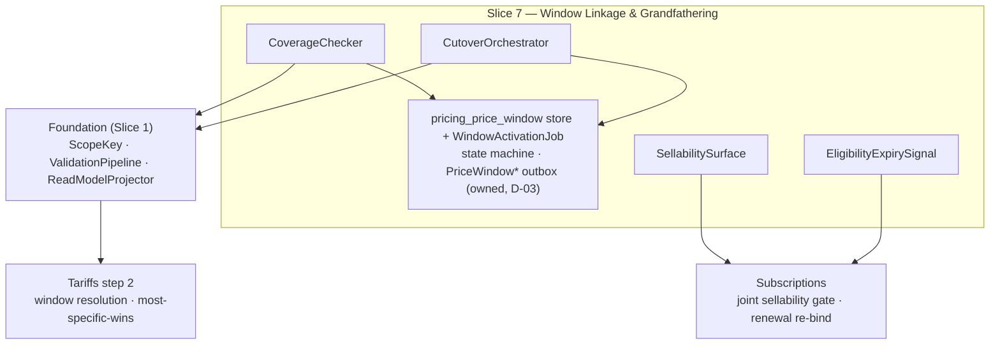

<!-- CONFLUENCE_TITLE: [BSS]: Pricing — PriceWindow Linkage, Coverage & Grandfathering (Design, Slice 7) -->
<!-- Related: ../PRD.md, ../DESIGN.md, ./01-foundation.md | Owners: BSS Product Catalog team -->

# DESIGN — PriceWindow Linkage, Coverage & Grandfathering (Slice 7)

<!-- toc -->

- [1. Context](#1-context)
  - [1.1 Overview](#11-overview)
  - [1.2 Purpose](#12-purpose)
  - [1.3 Actors](#13-actors)
  - [1.4 References](#14-references)
  - [1.5 Scope](#15-scope)
  - [1.6 Constraints & Assumptions](#16-constraints--assumptions)
  - [1.7 Naming & Design-Introduced Names](#17-naming--design-introduced-names)
  - [1.8 Context & Dependencies](#18-context--dependencies)
- [2. Actor Flows (CDSL)](#2-actor-flows-cdsl)
  - [Execute a Grandfathering Cutover](#execute-a-grandfathering-cutover)
- [3. Processes / Business Logic (CDSL)](#3-processes--business-logic-cdsl)
  - [Publish-Time Window Coverage](#publish-time-window-coverage)
  - [Future-Gap Detection](#future-gap-detection)
  - [Sellability Gate](#sellability-gate)
  - [Grandfathering Eligibility Resolution](#grandfathering-eligibility-resolution)
  - [Grandfathering Cutover (atomic unit)](#grandfathering-cutover-atomic-unit)
- [4. States (CDSL)](#4-states-cdsl)
  - [Price Window State Machine](#price-window-state-machine)
  - [Grandfathered Row Eligibility State Machine](#grandfathered-row-eligibility-state-machine)
- [5. API Surface](#5-api-surface)
- [6. Data Model](#6-data-model)
- [7. Events & Alarms](#7-events--alarms)
- [8. Definitions of Done](#8-definitions-of-done)
  - [Window Coverage](#window-coverage)
  - [Window Lifecycle](#window-lifecycle)
  - [Future Gaps](#future-gaps)
  - [Sellability](#sellability)
  - [Grandfathering](#grandfathering)
- [9. Acceptance Criteria](#9-acceptance-criteria)
- [10. Non-Functional Considerations](#10-non-functional-considerations)

<!-- /toc -->

## 1. Context

### 1.1 Overview

This slice owns the **time axis of published prices** — including the `PriceWindow`
machinery itself (D-03): the window tables and state machine, **scheduling**, the UTC
**activation/expiration job** (a coordination-lease singleton), and the `PriceWindow*`
**event emission** from the gear outbox; plus the publish-time **window-coverage check**
(every billable row linkable to an active/scheduled `PriceWindow` on its canonical scope key,
base `priceOverlay`), **future-gap detection** across scheduled windows, the **sellability
gate** inputs (active window + committed `CatalogVersion` + `availableFrom`/`availableTo` +
plan lifecycle state + the GA-gate flags), the **grandfathering eligibility** read-model
surface (`priceEligibility`, `cohort`, `grandfatherUntil`, most-specific-wins), and the
**grandfathering cutover** as one atomic approval unit. The legacy **effective-dating
price-windows use case is consolidated here** (PRD §15 — decided 2026-07-10): windows live
in this gear's database, so the cutover's multi-window unit is a **local ACID transaction**,
not a cross-component protocol; the UC document remains scenario source material.

**Traces to**: `cpt-cf-bss-pricing-fr-pricewindow-coverage`,
`cpt-cf-bss-pricing-fr-future-gap-coverage`, `cpt-cf-bss-pricing-fr-sellability-gate`,
`cpt-cf-bss-pricing-fr-grandfathering-eligibility`

### 1.2 Purpose

Guarantee Tariffs step 2 always resolves: no billable row publishes without window coverage,
no gap between scheduled windows silently fails rating for everyone inside it, nothing sells
before it is both windowed and version-addressable, and a legacy price survives a cutover as
an immutable, concurrently-active, deterministically-selected row — with a bounded or
indefinite lifetime the operator controls via `grandfatherUntil`.

### 1.3 Actors

| Actor | Role in Slice |
|-------|---------------|
| `cpt-cf-bss-pricing-actor-finance-manager` | Schedules/cancels windows (owned here), runs cutovers |
| `cpt-cf-bss-pricing-actor-rating` | Resolves the active window per scope key at `t` (step 2); applies most-specific-wins |
| `cpt-cf-bss-pricing-actor-subscriptions` | Enforces the sellability gate jointly; re-binds at `grandfatherUntil` expiry |
| `cpt-cf-bss-pricing-actor-finance-reviewer` | Approves the cutover (one approval unit; Slice 5) |

### 1.4 References

- **PRD**: [PRD.md](../PRD.md) — §6.5, §17.5 (grandfathering-cutover mechanism), §1.4 (Glossary: `priceEligibility`, `grandfatherUntil`), §17.3 (window-coverage + sellability composition rules)
- **Design**: [01-foundation.md](./01-foundation.md) — scope key (§4.1), immutability + cutover mechanics (§4.3); [04-currency-tax.md](./04-currency-tax.md) — `not_sellable_ga` input to the gate
- **Dependencies**: Foundation + Slices 2/3 (rows to cover); Slice 5 (the cutover approval unit); Slice 11's retirement invokes **this slice's** window-cancellation flow. The legacy effective-dating UC (`UC-effective-dating-price-windows-202601121200`) is **consolidated into this slice** (D-03) and retained as scenario source only.

### 1.5 Scope

**In scope**: the `PriceWindow` entity, state machine, scheduling/cancellation API, the UTC
activation/expiration singleton job, and `PriceWindow*` event emission (consolidated, D-03);
publish-time coverage on the base-`priceOverlay` scope key; future-gap rejection; the
sellability gate **inputs** (joint rule with Subscriptions); `priceEligibility` + `cohort` +
`grandfatherUntil` read-model exposure with most-specific-wins documentation; the cutover
transaction (shorten + two schedules as one **local ACID** approval unit); the
`grandfatherUntil` expiry signal.

**Out of scope**: the scheduler/timeline **UI** (Frontend DESIGN); FX rate-lock from the
legacy UC (**rejected here** — the catalog performs no FX; Tariffs/PLAL owns rates, Future
scope); subscription/revenue impact preview from the legacy UC (needs Subscriptions data —
out of catalog scope, joint item if revived); the purchase-time enforcement itself
(Subscriptions, joint rule); Tariffs' step-2 resolution algorithm (consumes what we publish).

### 1.6 Constraints & Assumptions

Inherits Foundation C-set (UTC everywhere). Slice-7-specific:

| # | Topic | Assumption (default) | Source |
|---|-------|----------------------|--------|
| W1 | Window SoR | `PriceWindow` rows + their state machine are **owned by this slice** (consolidated per D-03 / ADR `cpt-cf-bss-pricing-adr-pricewindow-consolidation`; PRD §15 answered) — same gear, same database as the price rows: coverage checks read the owned tables directly (no mirror), and multi-window units commit in one local transaction | PRD §2.1; D-03 |
| W2 | Non-overlap key | Window non-overlap is per **canonical scope key** (ADRs `cpt-cf-bss-pricing-adr-canonical-scope-key`, `…-grandfathering-cohort-axis`); a grandfathered generation + successor — and any number of prior generations (distinct `cohort`s) — at the same `t` are distinct keys, never an overlap violation | PRD §2.2 |
| W3 | Most-specific-wins | When several eligibility classes hold active windows on the same remaining axes: `existing_grandfathered` > `new_subscriptions_only` > `all_subscriptions` (applied by Tariffs step 2 **after** eligibility matching). Class ordering only — **within** `existing_grandfathered` the generation is selected by the subscription's bound `cohort` (the cohort of its pinned price id) → unique row | PRD §1.4 |
| W4 | Cutover atomicity | Shorten current `all_subscriptions` window `effectiveTo` + schedule the grandfathered copy + schedule the successor = **one approval unit**; active windows are shortened, not cancelled; `PriceWindowCancelled` only for not-yet-active windows of the old key | PRD §17.5 |
| W5 | Deferred publish | "Publish at T" is out of launch scope; `availableFrom`/`availableTo` are purchasability dates validated against coverage, not a publish scheduler | PRD §6.5 |

### 1.7 Naming & Design-Introduced Names

Reuses the PRD glossary; inherits Foundation mechanics. Not restated.

Design-introduced names (Slice 7):

| Name | Meaning |
|------|---------|
| `CoverageChecker` | Publish-time rule: every billable row's scope key has an active/scheduled window; gap detection across scheduled windows |
| `SellabilitySurface` | The read-model composite the joint gate evaluates: active-window flag + committed-version flag + `availableFrom/To` + plan lifecycle state + the GA-gate flags (`not_sellable_ga`, prepaid-execution) |
| `CutoverOrchestrator` | Builds the W4 atomic unit (shorten + grandfathered copy + successor) as one approval + one **local ACID** transaction |
| `EligibilityExpirySignal` | The published signal that a row's `grandfatherUntil` passed — Subscriptions re-binds at next renewal |
| `WindowScheduler` | The owned scheduling/cancellation surface: creates `scheduled` windows (overlap-validated per scope key), cancels not-yet-active ones, adjusts a future `effectiveTo` (D-03) |
| `WindowActivationJob` | Coordination-lease singleton: flips `scheduled → active` at `effectiveFrom` and `active → expired` at `effectiveTo` (UTC, idempotent, ordered per `(tenant, plan)`), emitting `PriceWindowActivated`/`Expired` from the outbox |

### 1.8 Context & Dependencies

**Owned:** the `pricing_price_window` store + state machine, the `WindowActivationJob`, and
`PriceWindowScheduled/Activated/Cancelled/Expired` emission (D-03; previously consumed from the effective-dating UC).
**Produced:** the coverage guarantee, the sellability surface, eligibility fields +
most-specific-wins semantics, the cutover unit, the expiry signal.

## 2. Actor Flows (CDSL)

### Execute a Grandfathering Cutover

- [ ] `p1` - **ID**: `cpt-cf-bss-pricing-flow-grandfathering-cutover`

**Actor**: `cpt-cf-bss-pricing-actor-finance-manager` (approval via Slice 5 — a cutover is always material)

**Success Scenarios**:
- One approval unit atomically: shortens the current `all_subscriptions` window to the cutover instant, schedules the immutable `existing_grandfathered` copy as a **new `cohort` generation** (`cohort` = the cutover instant; prior generations' rows and windows are untouched), schedules the `all_subscriptions` successor — **no coverage gap opens** at any instant; cutovers are **repeatable** per key (ADR-0002)
- Optionally sets `grandfatherUntil` (UTC) on the copy; null = indefinite

**Error Scenarios**:
- A composed unit whose parts no longer form a gap-free set at compose/commit (copy-window bound violation per `inst-co-bounds`, or the owned window state changed between compose and commit) → rejected (`CUTOVER_GAP`)
- A cutover instant in the past at submit, or an instant that passes while the approval pends → rejected (`CUTOVER_INSTANT_PASSED`, 422); the unit is recomposed
- Attempt to supersede or reprice an `existing_grandfathered` row → rejected (Foundation §4.3; only tightening `grandfatherUntil` is allowed, as a material change)

**Steps**:
1. [ ] - `p1` - API: POST /v1/pricing/plans/{planId}/cutovers (cutover instant, successor row ref, optional `grandfatherUntil`) - `inst-gc-api`
2. [ ] - `p1` - `CutoverOrchestrator` composes the W4 unit and validates gap-freeness across the three window operations **before** submission; the cutover instant MUST be in the future at submit **and** still in the future at approval commit (`CUTOVER_INSTANT_PASSED` otherwise) - `inst-gc-compose`
3. [ ] - `p1` - Approval (Slice 5, material) → **one local ACID transaction** over the slice-owned window tables (D-03): shorten `effectiveTo` + two window schedules + the two new rows commit or roll back together — no cross-component protocol, no partial state. The grandfathered copy and the successor **pass the Foundation validation pipeline and the commit requests `CatalogVersion` addressability exactly as a supersession publish does** (PRD §17.5) — the successor is sellable only after `CatalogVersionPublished` + warm-completion. Events: `PriceCreated` ×2 (copy + successor) + `PriceWindowScheduled` ×2; `PriceWindowExpired` fires at cutover; `PriceWindowCancelled` only for not-yet-active windows of the old key - `inst-gc-commit`
4. [ ] - `p1` - **RETURN** 202 (cutover scheduled); the grandfathered copy is immutable in price from birth - `inst-gc-return`

## 3. Processes / Business Logic (CDSL)

### Publish-Time Window Coverage

- [ ] `p1` - **ID**: `cpt-cf-bss-pricing-algo-window-coverage`

**Input**: a publishing plan's billable rows + their window linkage refs
**Output**: pass, or a fail-closed violation directing the operator to schedule a window

**Steps**:
1. [ ] - `p1` - Every billable row's **canonical scope key** (resolved on the base `priceOverlay`) MUST have an active or scheduled `PriceWindow`; absence fails publish — no silent fallback (Tariffs step 2 would resolve nothing) - `inst-wc-required`
2. [ ] - `p1` - Distinct keys hold windows independently: a hybrid's `recurring`/`usage`/`one_time_setup` components and a grandfathered row + successor each carry their own coverage (W2) - `inst-wc-perkey`
3. [ ] - `p1` - `availableFrom`/`availableTo` (when set) validate **against** window coverage: a purchasability interval reaching outside all coverage fails publish (W5 — dates gate purchase, they do not schedule publish) - `inst-wc-availability`

### Future-Gap Detection

- [ ] `p1` - **ID**: `cpt-cf-bss-pricing-algo-future-gap`

**Input**: ≥ 2 active/scheduled windows on one scope key
**Output**: pass, or the uncovered interval named

**Steps**:
1. [ ] - `p1` - Sort windows by `effectiveFrom`; any uncovered interval between one window's end and the next's start over billable periods → reject, naming `[gapStart, gapEnd)` and the scope key - `inst-fg-detect`
2. [ ] - `p1` - The check runs at publish **and** inside every window-mutating operation (schedule, cancel, `effectiveTo` adjustment, cutover, retirement-triggered cancellation) — windows are slice-owned (D-03), every mutation goes through `WindowScheduler`/`CutoverOrchestrator`, and there is **no side door**: the window tables carry the same REVOKE + column-whitelist trigger discipline as `pricing_price`, so a gap can never be introduced past validation - `inst-fg-when`

### Sellability Gate

- [ ] `p1` - **ID**: `cpt-cf-bss-pricing-algo-sellability`

**Input**: a purchase-time check for `(planId, scope key, t)` — executed by Subscriptions against our surface
**Output**: sellable / not-sellable with the failing predicate

**Steps**:
1. [ ] - `p1` - The read model exposes per key: **active**-window-at-`t` (scheduled is NOT sellable), committed-`CatalogVersion` addressability (pending fan-out is NOT sellable), `availableFrom`/`availableTo`, plan **lifecycle state** (`retired` is NOT sellable — Slice 11 retirement blocks through this gate), and the **GA-gate flags** (`not_sellable_ga` — Slice 4, evaluated **per scope key / market**, not per plan; the prepaid-execution gate — Slice 10 — is published as the same flag mechanism) - `inst-sg-surface`
2. [ ] - `p1` - The gate is a **joint rule with Subscriptions**: purchase MUST NOT create while any predicate fails; catalog publishes the surface, Subscriptions enforces at order time - `inst-sg-joint`
2a. [ ] - `p1` - **Renewal is not a purchase:** the gate governs the creation of **new** subscriptions only — a renewal of an existing subscription is never blocked by it (a retired plan or a passed `availableTo` does not kill in-flight renewals; their lifecycle is owned by the grandfathering/migration mechanics) - `inst-sg-renewal`
2b. [ ] - `p1` - **Bundle conjunction:** for a `bundle`-type plan the gate is the **conjunction** — every referenced component key passes all five predicates at `t` (and, for `own_price` bundles, the bundle's own rows too), plus the bundle's own `availableFrom`/`availableTo`; the `SellabilitySurface` exposes the frozen component key set for this walk (composition rules normative in Slice 8, `inst-bc-sellability`) - `inst-sg-bundle`
3. [ ] - `p1` - All five predicates are point-in-time evaluable from the pinned read model (no live catalog query at order time beyond the version-pinned read) - `inst-sg-pinned`
4. [ ] - `p1` - **Launch boundary — segment plans are not self-service.** All five predicates are **payer-independent**: the gate does not check group membership, so a plan whose pricing targets a specific customer group as a **separate `planId`** (different tier structure — the F-88 Future path) MUST NOT be sold through a self-service checkout at launch; its sales channel is operator-only (RBAC is the gate). Segment **discounts** need no plan of their own — they are `customerGroup` overlays resolved server-side from the authenticated payer (Slice 9), so there is no discounted `planId` to leak - `inst-sg-segment-boundary`
5. [ ] - `p2` - **Group-scoped plan eligibility (designed, implementation-gated — F-88).** The designed extension that lifts the launch boundary: a plan-level `eligibleCustomerGroups` set (taxonomy-validated, snapshot-frozen; authored via Slice 9) and a **sixth predicate** — `payer's resolved group ∈ eligibleCustomerGroups(plan) at t`. This is the first **payer-dependent** predicate: `sellability(plan, t)` becomes `sellability(plan, payer, t)`, the payer identity derives from the authenticated caller's claims (never a request parameter), and sellability responses MUST NOT be cached payer-agnostically once it lands — implementations of the five-predicate gate MUST keep the surface extensible for this (no global sellability cache keyed by plan alone). Industry precedent: catalog/price-book assignment per buyer (Shopify B2B catalogs, Salesforce Price Books, Kill Bill PriceOverlays). Activation requires reopening F-88 (Product) + the Slice 9 policy decisions - `inst-sg-eligibility-gated`

### Grandfathering Eligibility Resolution

- [ ] `p1` - **ID**: `cpt-cf-bss-pricing-algo-eligibility`

**Input**: the eligibility axes on published rows
**Output**: the read-model fields + semantics Tariffs step 2 resolves deterministically

**Steps**:
1. [ ] - `p1` - The read model exposes `priceEligibility` (`all_subscriptions | new_subscriptions_only | existing_grandfathered`), the row's `cohort` (generation; `none` unless grandfathered), and `grandfatherUntil` (UTC, null = indefinite) per row - `inst-el-fields`
2. [ ] - `p1` - **Most-specific-wins (W3)** documented on the read model: after eligibility matching, `existing_grandfathered` > `new_subscriptions_only` > `all_subscriptions` — class ordering only; new subscriptions never bind to a grandfathered row - `inst-el-msw`
2a. [ ] - `p1` - **Generation selection (ADR-0002):** within `existing_grandfathered`, Tariffs resolves the row whose `cohort` equals the cohort of the subscription's **pinned price id** (`pricingSnapshotRef` already pins it — no separate binding store); generations coexist, each with its own window and `grandfatherUntil`; the resolved row is always unique - `inst-el-generation`
3. [ ] - `p1` - The successor row in a cutover carries `all_subscriptions`, so a grandfathered subscription re-bound at expiry resolves to it naturally — regardless of which generation expired - `inst-el-successor`
4. [ ] - `p1` - `EligibilityExpirySignal`: a bound subscription renewing on/after **its generation's** `grandfatherUntil` MUST be signalled no-longer-eligible; the expiry flag is **derived at read time** (`now ≥ grandfatherUntil` against the published bound) — never stored, no job, no new event (§7 holds); Subscriptions executes the re-bind at next renewal — the catalog never rebinds - `inst-el-expiry`

### Grandfathering Cutover (atomic unit)

- [ ] `p1` - **ID**: `cpt-cf-bss-pricing-algo-cutover`

**Input**: current `all_subscriptions` row/window + successor definition + cutover instant
**Output**: the W4 three-operation unit, gap-free, as one approval + one transaction

**Steps**:
1. [ ] - `p1` - **Shorten** the current window's `effectiveTo` to the cutover (active windows are shortened, never cancelled) - `inst-co-shorten`
2. [ ] - `p1` - **Schedule** the `existing_grandfathered` **copy** (immutable in price; carries the pre-cutover amount) effective at cutover for pre-cutover subscribers — on `cohort` = the cutover instant, i.e. a **new generation key**; prior generations are untouched, and an instant equal to an existing generation's `cohort` is rejected at compose (`DUPLICATE_SCOPE_KEY`) - `inst-co-copy`
3. [ ] - `p1` - **Schedule** the `all_subscriptions` successor effective at cutover - `inst-co-successor`
4. [ ] - `p1` - Validate gap-freeness across all three (every instant covered for the `all_subscriptions` key and the **new generation's** key; prior generations' coverage is untouched by construction); commit as one transaction under one approval; the only later mutation permitted on a copy is **tightening** its `grandfatherUntil` (material change, Slice 5) - `inst-co-atomic`
5. [ ] - `p1` - **Bound consistency (normative, D-04):** the grandfathered copy carries two clocks — its window and `grandfatherUntil` — and the window MUST cover through **`grandfatherUntil` + the longest billing cycle sold on that key** (open-ended when null). The margin exists because re-bind happens only at the **next renewal** after expiry: a bound period that started before `grandfatherUntil` keeps rating (usage/arrears) against the generation's key until that renewal — with the margin, no legitimate bound interval is ever uncovered; without it, a window ending at `grandfatherUntil` strands subscribers for up to one full cycle. The row sells nothing new past expiry (new subscriptions never bind grandfathered rows), so the margin leaks nothing. Cutover validation rejects a violating unit, and a later `effectiveTo` adjustment below the bound is likewise rejected (`WINDOW_HISTORICAL_IMMUTABLE`/`CUTOVER_GAP` semantics) - `inst-co-bounds`
6. [ ] - `p1` - **One pending unit per key:** at most one pending approval unit (cutover or supersession) may exist per canonical scope key — a second submit on the same key while one is `submitted` returns 409 (`PENDING_CHANGE_UNIT_EXISTS`); a cutover unit pends **both** keys it touches (the `all_subscriptions` key and the **new generation's** key — prior generations are not pended). ETag protects rows, this rule protects **change units** from approving contradictory window operations - `inst-co-single-pending`
7. [ ] - `p1` - **Retirement unwind (D-05):** plan retirement with a live cutover unit **unwinds** it inside the retirement transaction (one ACID scope, D-03): the predecessor window's `effectiveTo` is restored to its recorded pre-cutover value (a legal future-`effectiveTo` adjustment), the scheduled copy/successor windows are cancelled (`PriceWindowCancelled` each), and the unit closes as `unwound` (audit keeps both the approval and the unwind); a merely `submitted` unit is voided per the standard Slice 5 pin semantics. Without the unwind, the shortened predecessor + cancelled schedules would strand in-flight subscribers uncovered at the cutover instant — the trailing void no gap check can see. Retirement with a live cutover is **always material** (registered into the Slice 5 evaluator); prior generations are untouched (active windows run out per retirement semantics) - `inst-co-retirement-unwind`

## 4. States (CDSL)

### Price Window State Machine

- [ ] `p1` - **ID**: `cpt-cf-bss-pricing-state-price-window`

**States**: scheduled, active, expired, cancelled
**Initial State**: scheduled (created by `WindowScheduler`/`CutoverOrchestrator`; overlap-validated per canonical scope key at creation)

**Transitions**:
1. [ ] - `p1` - **FROM** scheduled **TO** active **WHEN** `now ≥ effectiveFrom` (the `WindowActivationJob` flips it and emits `PriceWindowActivated`; idempotent, ordered per `(tenant, plan)`) - `inst-ws-activate`
2. [ ] - `p1` - **FROM** active **TO** expired **WHEN** `now ≥ effectiveTo` (job flips it and emits `PriceWindowExpired`; an open-ended window — `effectiveTo = null` — never expires; **no fallback pricing exists**: a key without a successor window fails closed downstream, per the coverage doctrine) - `inst-ws-expire`
3. [ ] - `p1` - **FROM** scheduled **TO** cancelled **WHEN** cancelled before activation (retirement flow, cutover unwind, or operator cancellation; emits `PriceWindowCancelled`); an **active or historical window is never cancelled or deleted** — active windows are only shortened via `effectiveTo` - `inst-ws-cancel`
4. [ ] - `p1` - **Historical immutability:** once `effectiveFrom` has passed, `effectiveFrom` and the window↔price binding are immutable; the only permitted mutation of an `active` window is moving its **future** `effectiveTo` (shorten/extend, overlap- and coverage-validated — cutover's shorten uses this path); `expired`/`cancelled` windows are immutable history (7y retention with the audit store) - `inst-ws-immutable`

### Grandfathered Row Eligibility State Machine

- [ ] `p1` - **ID**: `cpt-cf-bss-pricing-state-grandfathered`

**States**: active_indefinite (`grandfatherUntil = null`), active_bounded, expired
**Initial State**: per the cutover's `grandfatherUntil` (null → active_indefinite). One machine
per generation row — generations expire independently (ADR-0002)

**Transitions**:
1. [ ] - `p1` - **FROM** active_indefinite **TO** active_bounded **WHEN** `grandfatherUntil` is set (tightening only; material change) - `inst-gs-bound`
2. [ ] - `p1` - **FROM** active_bounded **TO** active_bounded **WHEN** `grandfatherUntil` is tightened further (never loosened, never the price) - `inst-gs-tighten`
3. [ ] - `p1` - **FROM** active_bounded **TO** expired **WHEN** `now ≥ grandfatherUntil`: the `EligibilityExpirySignal` raises (a read-time-derived condition — no stored state flips, no job); bound subscriptions re-bind at their next renewal (Subscriptions); the row itself stays immutable history - `inst-gs-expire`

## 5. API Surface

| Method | Path | Purpose | Idempotency |
|--------|------|---------|-------------|
| `POST` | `/v1/pricing/prices/{priceId}/windows` | Schedule a window (overlap-validated; D-03 owned surface) | client idempotency key |
| `PATCH` | `/v1/pricing/price-windows/{windowId}` | Adjust a future `effectiveTo` (shorten/extend; coverage-validated) | ETag |
| `DELETE` | `/v1/pricing/price-windows/{windowId}` | Cancel a not-yet-active window (emits `PriceWindowCancelled`) | — |
| `POST` | `/v1/pricing/plans/{planId}/cutovers` | Compose + submit the atomic grandfathering cutover — **single- or multi-key** (D-28): the payload carries a scope-key selector; all selected keys cut over at **one instant** as **one approval unit** / one local ACID transaction (per-key generations created; the unit pends every touched key; the S5 per-row hash pin covers the whole set) | per `(planId, key-set hash, cutover instant)` |
| `PATCH` | `/v1/pricing/prices/{priceId}/grandfather-until` | Tighten `grandfatherUntil` (material change) | ETag |
| `GET` | `/v1/pricing/plans/{planId}/sellability?at=&currency=&region=` | The sellability surface for the joint gate | — |
| `GET` | `/v1/pricing/plans/{planId}/coverage` | Coverage/gap report per scope key (operator remediation) | — |

**Problem responses (RFC 9457):** `WINDOW_COVERAGE_MISSING` (422, names the scope key),
`WINDOW_GAP` (422, names `[gapStart, gapEnd)`), `WINDOW_OVERLAP` (409 — the scheduled/adjusted
window overlaps an existing one on the same canonical scope key), `WINDOW_HISTORICAL_IMMUTABLE`
(409 — mutation of a past `effectiveFrom`, an expired/cancelled window, or the window↔price
binding), `WINDOW_NOT_CANCELLABLE` (409 — DELETE on an active/historical window),
`CUTOVER_GAP` (422),
`CUTOVER_INSTANT_PASSED` (422 — instant in the past at submit or at approval commit),
`PENDING_CHANGE_UNIT_EXISTS` (409 — a pending unit already holds one of the touched keys),
`GRANDFATHER_LOOSEN_FORBIDDEN` (422), `GRANDFATHERED_ROW_IMMUTABLE` (409),
`AVAILABILITY_OUTSIDE_COVERAGE` (422).

## 6. Data Model

Slice-owned window store (windows are owned here per D-03/W1; `pricing_` prefix per Foundation §3.7):

**`pricing_price_window`** (PK `window_id`; tenant-scoped, SecureORM):

| Column | Type | Notes |
|--------|------|-------|
| `window_id` | `uuid` | PK |
| `tenant_id` | `uuid` | RLS scope |
| `price_id` | `uuid` | FK `pricing_price` — binds the window to its row (and thereby its canonical scope key); immutable after creation |
| `effective_from` / `effective_to` | `timestamptz` | UTC, half-open `[from, to)`; `effective_to = null` = open-ended |
| `state` | `enum` | `scheduled \| active \| expired \| cancelled` (state machine §4) |
| `reason_code` | `string` | operator-supplied change reason (audit; from the legacy UC scenarios) |
| `created_by` / `created_at`, `activated_at` / `expired_at` / `cancelled_at` | — | audit timestamps |

**`pricing_price` (Slice-7 columns)** — `price_eligibility` (scope-key axis, Foundation) and
`grandfather_until` (`timestamptz`, tighten-only) are already Foundation-declared; this slice
owns their **semantics + validation** and the projected eligibility/expiry flags in
`pricing_read_model`.

**Cutover** — not a table: an approval-unit composition over existing rows/windows,
recorded in `pricing_approval` (Slice 5) with the three-operation payload, and auditable via
`pricing_audit_log`.

Key constraints: `grandfather_until` may only decrease (application-enforced tighten-only,
audited); a grandfathered generation's window `effective_to` MUST stay ≥ `grandfather_until`
+ the longest billing cycle sold on the key (D-04 — enforced at cutover and on every
`effectiveTo` adjustment); half-open intervals `[from, to)` — adjacent windows share a boundary legally;
**non-overlap per canonical scope key** enforced inside every mutation (`WINDOW_OVERLAP`);
historical immutability via the same `REVOKE` + column-whitelist trigger discipline as
`pricing_price` (permitted UPDATEs: state-machine transitions, future `effective_to`
adjustment; DELETE always rejected — cancel is a state, not a deletion); coverage/gap checks
read the owned table directly (no mirror — D-03).

## 7. Events & Alarms

No new frozen event names — the manifest §4.1 `PriceWindow*` set is now **produced by this
gear's outbox** (D-03; previously consumed from the effective-dating UC): `PriceWindowScheduled`
on schedule, `PriceWindowActivated`/`PriceWindowExpired` from the `WindowActivationJob`
(ordered per `(tenant, plan)`, idempotency-keyed, at-least-once), `PriceWindowCancelled` on
cancellation. The cutover emits `PriceCreated` ×2 (copy + successor) + `PriceWindowScheduled`
×2 / `PriceWindowExpired` / `PriceWindowCancelled` per W4.
Alarms: `pricing.window.activation_overdue` (Warn — a `scheduled` window past `effectiveFrom`
(or an `active` one past `effectiveTo`) not yet transitioned beyond the job SLO; the lease
singleton is stalled), `pricing.grandfather.expiry_signal_backlog` (Warn —
expired-but-still-bound rows reported back by Subscriptions past one renewal cycle; the exact
re-bind feedback mechanism is part of the §10 joint contract).

## 8. Definitions of Done

### Window Coverage

- [ ] `p1` - **ID**: `cpt-cf-bss-pricing-dod-window-coverage`

Publish **MUST** fail for any billable row whose canonical scope key (base `priceOverlay`) lacks
an active/scheduled window, directing the operator to schedule one; distinct keys carry
independent coverage; `availableFrom`/`availableTo` validate against coverage.

**Implements**: `cpt-cf-bss-pricing-algo-window-coverage`

**Touches**:
- API: `GET /v1/pricing/plans/{planId}/coverage`
- DB: `pricing_price_window`
- Entities: `CoverageChecker`

### Window Lifecycle

- [ ] `p1` - **ID**: `cpt-cf-bss-pricing-dod-window-lifecycle`

The slice **MUST** own the full `PriceWindow` lifecycle (D-03): schedule (overlap-validated
per canonical scope key), activate/expire via the coordination-lease singleton at the UTC
boundaries (idempotent; events ordered per `(tenant, plan)`; within the activation SLO),
cancel only not-yet-active windows, adjust only a future `effectiveTo`; historical windows
are immutable (7y retention); `PriceWindow*` events emit from the gear outbox under the
frozen manifest names. **No fallback pricing exists** — expiry without a successor fails
closed downstream.

**Implements**: `cpt-cf-bss-pricing-state-price-window`

**Touches**:
- API: `POST /v1/pricing/prices/{priceId}/windows`, `PATCH/DELETE /v1/pricing/price-windows/{windowId}`
- DB: `pricing_price_window`, `pricing_outbox`
- Entities: `WindowScheduler`, `WindowActivationJob`

### Future Gaps

- [ ] `p1` - **ID**: `cpt-cf-bss-pricing-dod-future-gap`

With ≥ 2 scheduled windows on one scope key, publish **MUST** reject any uncovered billable
interval, naming the gap and the key.

**Implements**: `cpt-cf-bss-pricing-algo-future-gap`

**Touches**:
- DB: `pricing_price_window`
- Entities: `CoverageChecker`

### Sellability

- [ ] `p1` - **ID**: `cpt-cf-bss-pricing-dod-sellability`

The read model **MUST** expose the six sellability predicates (active window — not merely
scheduled; committed version; availability dates; plan lifecycle state — `retired` blocks;
the GA-gate flags: `not_sellable_ga` / prepaid-execution; the registry `sellable` flag —
standalone lines only, D-46) point-in-time evaluable
from a pinned version; the purchase-time gate is a joint rule enforced by Subscriptions. For a
`bundle`-type plan the surface additionally exposes the frozen component key set and the gate
evaluates the **conjunction** over it on predicates (1)–(5) — components are exempt from (6)
(own rows too for `own_price`; Slice 8).

**Implements**: `cpt-cf-bss-pricing-algo-sellability`

**Touches**:
- API: `GET /v1/pricing/plans/{planId}/sellability`
- DB: `pricing_read_model`
- Entities: `SellabilitySurface`

### Grandfathering

- [ ] `p1` - **ID**: `cpt-cf-bss-pricing-dod-grandfathering`

The read model **MUST** expose `priceEligibility` + `cohort` + `grandfatherUntil` with
most-specific-wins class semantics and generation selection by the pinned price id's cohort
(unique resolved row; new subscriptions never bind grandfathered); the cutover **MUST** be one
gap-free atomic approval unit (shorten + copy-as-new-generation + successor), **repeatable**
per key — prior generations untouched; each copy is immutable in price with tighten-only
`grandfatherUntil`; a generation's expiry raises the re-bind signal executed by Subscriptions
at renewal.

**Implements**: `cpt-cf-bss-pricing-flow-grandfathering-cutover`, `cpt-cf-bss-pricing-algo-eligibility`, `cpt-cf-bss-pricing-algo-cutover`, `cpt-cf-bss-pricing-state-grandfathered`

**Touches**:
- API: `POST /v1/pricing/plans/{planId}/cutovers`, `PATCH /v1/pricing/prices/{priceId}/grandfather-until`
- DB: `pricing_price` (eligibility axes), `pricing_price_window`, `pricing_approval`
- Entities: `CutoverOrchestrator`, `EligibilityExpirySignal`

## 9. Acceptance Criteria

Delta over the Foundation testing architecture.

Unit:

- [ ] Coverage matrix per key (hybrid components covered independently); gap detection across 2/3 scheduled windows incl. touching-boundary (no false positive at `effectiveTo = next.effectiveFrom`); availability-outside-coverage rejection; most-specific-wins ordering; tighten-only `grandfatherUntil` (loosen and price change rejected); copy-window bound (`effectiveTo ≥ grandfatherUntil + longest sold cycle`) rejected at cutover and on `effectiveTo` adjustment (D-04)

Integration (testcontainers):

- [ ] Publishing a billable row without a window fails (`WINDOW_COVERAGE_MISSING`); scheduling a window via the owned API then re-publishing passes
- [ ] A scheduled window activates at `effectiveFrom` within the job SLO and `PriceWindowActivated` emits ordered per `(tenant, plan)`; a killed-and-restarted job (lease takeover) activates exactly once (idempotent)
- [ ] Overlap on the same canonical scope key is rejected at scheduling (`WINDOW_OVERLAP`); adjacent windows (`effectiveTo = next.effectiveFrom`) pass
- [ ] Mutating a historical window (past `effectiveFrom`, or expired/cancelled) is rejected (`WINDOW_HISTORICAL_IMMUTABLE`); DELETE of an active window is rejected (`WINDOW_NOT_CANCELLABLE`); cancelling a scheduled window emits `PriceWindowCancelled`
- [ ] A cutover produces: shortened current window, scheduled grandfathered copy (new `cohort` generation) + successor, no instant uncovered for either touched key; the copy rejects supersession/reprice
- [ ] A **second** cutover on the same remaining axes produces a second coexisting generation: three concurrently-active rows (two generations + successor), each cohort's subscription resolving its own generation's price; a cutover instant equal to an existing generation's `cohort` is rejected at compose
- [ ] At a generation's `grandfatherUntil` passing, the expiry signal appears in the read model for that generation only (siblings unaffected); the row remains readable immutable history
- [ ] Sellability: scheduled-but-not-active window → not sellable; pending (uncommitted) version → not sellable; retired plan / out-of-dates / GA-flagged market → not sellable; all five predicates satisfied → sellable
- [ ] Bundle conjunction: one unsellable component key (any failing predicate) → the bundle is not sellable; an `own_price` bundle additionally requires its own rows sellable
- [ ] The cutover transaction is atomic: a simulated failure on the successor-schedule step rolls back the shorten and both schedules (no partial window state at any instant)

API:

- [ ] RFC 9457 mapping for the §5 codes; the coverage report names every uncovered key/interval

## 10. Non-Functional Considerations

- **Performance**: coverage/gap checks are publish-path over the indexed owned `pricing_price_window` table; the activation job scans by `(state, effective_from)` index in batches; the sellability surface is a pinned read-model lookup (order-time hot path — inside the read p95 < 100ms budget).
- **Observability / metrics**: `pricing_window_coverage_blocks_total`, `pricing_window_gap_blocks_total`, `pricing_window_activation_lag_seconds` (job SLO), `pricing_windows{state}` gauge, `pricing_grandfathered_rows{state}` gauge.
- **Security & AuthZ**: cutovers and `grandfatherUntil` changes are material (Slice 5 two-person rule); window scheduling/cancellation/adjustment is `plan × write` through the shared PEP gate (Slice 5 catalog — same authority as price authoring; the window is an attribute of the row's sellable life).
- **Risks & open items**: the consolidation decision (D-03; PRD §15 answered) needs the formal Architecture ack — the legacy UC doc is banner-marked as absorbed; its FX rate-lock and subscription-impact-preview scenarios are dispositioned out (§1.5); the activation job's SLO value rides the provisional-NFR ratification (PRD §14).
