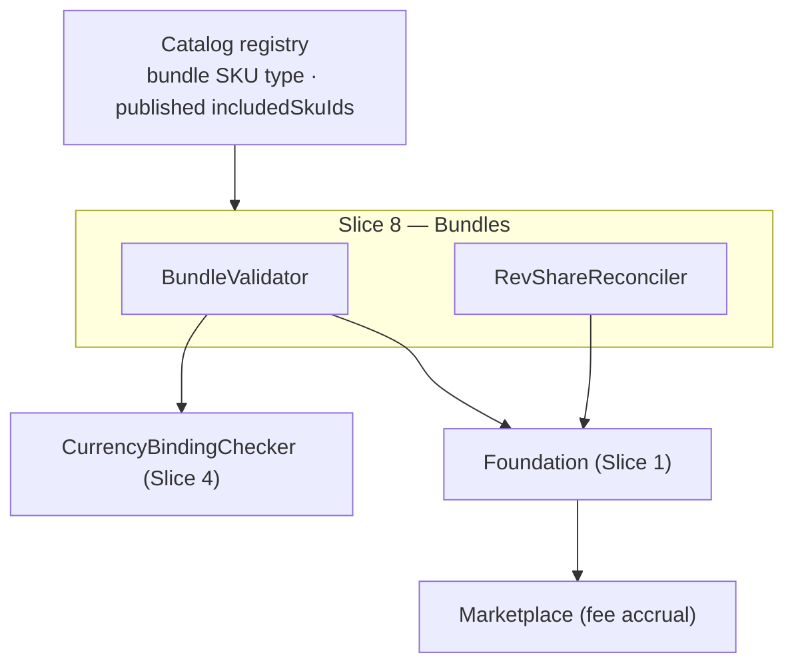

<!-- CONFLUENCE_TITLE: [BSS]: Pricing — Bundles & Marketplace Composition (Design, Slice 8) -->
<!-- Related: ../PRD.md, ../DESIGN.md, ./01-foundation.md | Owners: BSS Product Catalog team -->

# DESIGN — Bundles & Marketplace Composition (Slice 8)

<!-- toc -->

- [1. Context](#1-context)
  - [1.1 Overview](#11-overview)
  - [1.2 Purpose](#12-purpose)
  - [1.3 Actors](#13-actors)
  - [1.4 References](#14-references)
  - [1.5 Scope](#15-scope)
  - [1.6 Constraints & Assumptions](#16-constraints--assumptions)
  - [1.7 Naming & Design-Introduced Names](#17-naming--design-introduced-names)
  - [1.8 Context & Dependencies](#18-context--dependencies)
- [2. Actor Flows (CDSL)](#2-actor-flows-cdsl)
  - [Author and Publish a Bundle](#author-and-publish-a-bundle)
- [3. Processes / Business Logic (CDSL)](#3-processes--business-logic-cdsl)
  - [Price-Basis Validation](#price-basis-validation)
  - [Component Coverage Validation](#component-coverage-validation)
  - [Rev-Share Reconciliation](#rev-share-reconciliation)
- [4. States (CDSL)](#4-states-cdsl)
- [5. API Surface](#5-api-surface)
- [6. Data Model](#6-data-model)
- [7. Events & Alarms](#7-events--alarms)
- [8. Definitions of Done](#8-definitions-of-done)
  - [Bundle Composition](#bundle-composition)
  - [Rev-Share](#rev-share)
- [9. Acceptance Criteria](#9-acceptance-criteria)
- [10. Non-Functional Considerations](#10-non-functional-considerations)

<!-- /toc -->

## 1. Context

### 1.1 Overview

This slice owns **bundle composition**: the price basis (`sum_of_parts` referencing component
**`planId`s** vs `own_price`), component publication + per-`(currency, region)` coverage
validation (reusing Slice 4's `CurrencyBindingChecker`), **rev-share reconciliation**
(sum-to-100% per included vendor SKU, explicit platform cut, bundle-level residual absorber
— default the platform — with ±1 bp authoring tolerance normalized to an exact split at
publish, D-07), and `invoiceItemization` (`aggregate | itemize`) preserving per-SKU
rev-share for Marketplace accrual. The `bundle` SKU **type** is registry-owned; this slice
authors what the bundle *contains and how it prices*.

**Traces to**: `cpt-cf-bss-pricing-fr-bundle-composition`,
`cpt-cf-bss-pricing-fr-invoice-currency-binding`

### 1.2 Purpose

Make marketplace bundles unambiguous and reconcilable: a `sum_of_parts` bundle can never sum
rows that don't exist or mix frequencies; a rev-share split always reconciles to 100% with a
deterministic owner of the rounding residual; itemization choice never loses the per-SKU
split Marketplace accrues fees from.

### 1.3 Actors

| Actor | Role in Slice |
|-------|---------------|
| `cpt-cf-bss-pricing-actor-product-manager` | Authors bundles, constraints, rev-share |
| `cpt-cf-bss-pricing-actor-marketplace` | Consumes rev-share rules for fee accrual |
| `cpt-cf-bss-pricing-actor-catalog-registry` | Owns the `bundle` SKU type + published `includedSkuIds` |
| `cpt-cf-bss-pricing-actor-billing` | Consumes `invoiceItemization`; single-currency invariant |

### 1.4 References

- **PRD**: [PRD.md](../PRD.md) — §6.3 (bundle composition), §17.3 (bundle rules), §5.1
- **Design**: [01-foundation.md](./01-foundation.md); [04-currency-tax.md](./04-currency-tax.md) — `CurrencyBindingChecker` (cases ii/iii)
- **Dependencies**: Slices 1–4 (published component plans/rows to reference).

### 1.5 Scope

**In scope**: bundle price basis + persistence; component `planId` referencing (not bare
SKUs) for `sum_of_parts`; coverage validation per sold `(currency, region)` + matching
`frequency`; rev-share model + residual tolerance; `invoiceItemization` persistence.

**Out of scope**: the `bundle` SKU type/flag (registry); marketplace fee **accrual**
(Marketplace); the summed **amount** at quote time (Tariffs — the catalog persists the
basis, not the sum); listing eligibility rules (Future, §17.8).

### 1.6 Constraints & Assumptions

Inherits Foundation C-set. Slice-8-specific:

| # | Topic | Assumption (default) | Source |
|---|-------|----------------------|--------|
| B1 | Component identity | `sum_of_parts` references component **`planId`s** — bare `skuId`s are ambiguous per `(currency, region)` | PRD §1.4 |
| B2 | Rev-share residual | Sum = 100% per included vendor SKU; authoring tolerance **±1 bp** (= 0.01%); publish **normalizes** the nominated absorber's effective share to an exact 10000 bp split (typed values audited); absorber default = the **platform** (D-07) | PRD §6.3; D-07 |
| B3 | Itemization | `aggregate \| itemize` persisted; either preserves per-SKU rev-share for accrual | PRD §6.3 |

### 1.7 Naming & Design-Introduced Names

| Name | Meaning |
|------|---------|
| `BundleValidator` | Registered rules: basis, component publication, coverage (via `CurrencyBindingChecker`), frequency match |
| `RevShareReconciler` | The 100%-per-vendor-SKU check + residual **normalization** onto the bundle-level absorber (D-07) |

### 1.8 Context & Dependencies

## 2. Actor Flows (CDSL)

### Author and Publish a Bundle

- [ ] `p2` - **ID**: `cpt-cf-bss-pricing-flow-bundle-author`

**Actor**: `cpt-cf-bss-pricing-actor-product-manager` (authoring — `bundle × write`); the publish step requires **`plan × publish` only** (D-11) — held by `cpt-cf-bss-pricing-actor-finance-manager` / `cpt-cf-bss-pricing-actor-catalog-admin` (Slice 5 role matrix); the composition is protected by the approval content pin, and component checks at publish are validations, not caller authz

**Success Scenarios**:
- A bundle (on a registry `bundle`-type SKU) declares its basis, published `includedSkuIds`, component `planId`s (`sum_of_parts`), rev-share, and `invoiceItemization`; publish validates coverage + reconciliation; `BundleUpdated` emits

**Error Scenarios**:
- Unpublished included SKU / component plan → 422; component row missing for a sold `(currency, region)` or mismatched `frequency` → `CURRENCY_NOT_COVERED` / `FREQUENCY_MISMATCH` (422); rev-share off by more than 1 bp per vendor SKU → `RESIDUAL_OVER_TOLERANCE` (422); structurally missing platform cut / malformed shares → `REVSHARE_UNBALANCED` (422)

**Steps**:
1. [ ] - `p2` - API: POST/PATCH /v1/pricing/bundles (draft; idempotency key) - `inst-ba-author`
2. [ ] - `p2` - Publish: `BundleValidator` + `RevShareReconciler` run in the Foundation pipeline - `inst-ba-validate`
3. [ ] - `p2` - **RETURN** 202; `BundleUpdated` emitted; composition frozen into the read model / snapshot - `inst-ba-return`

## 3. Processes / Business Logic (CDSL)

### Price-Basis Validation

- [ ] `p2` - **ID**: `cpt-cf-bss-pricing-algo-bundle-basis`

**Steps**:
1. [ ] - `p2` - Basis MUST be declared: `sum_of_parts` or `own_price`; the basis and any explicit price persist and freeze - `inst-bb-declared`
2. [ ] - `p2` - `sum_of_parts`: component **`planId`s** referenced (B1), each published; a component `planId` MUST NOT itself be a `bundle`-type plan — flat composition at launch, nesting is Future scope (`COMPONENT_IS_BUNDLE`; re-composition is re-validated, so a cycle can never form); the summing itself is Tariffs' — the catalog persists the reference set only - `inst-bb-sum`
3. [ ] - `p2` - `own_price`: the bundle's own price rows live on the canonical scope key like any plan's (Slices 3/4 rules apply); a matching-currency component set is still required (Slice 4 case iii) - `inst-bb-own`

### Component Coverage Validation

- [ ] `p2` - **ID**: `cpt-cf-bss-pricing-algo-bundle-coverage`

**Steps**:
1. [ ] - `p2` - Every referenced component MUST have a covering **published** row in each `(currency, region)` the bundle sells in — the currency axis delegates to `CurrencyBindingChecker` case ii; the `region` axis is the BundleValidator's own extension of the same rule - `inst-bc-coverage`
2. [ ] - `p2` - Recurring components MUST match `frequency` (a monthly + annual mix cannot sum onto one invoice line set) - `inst-bc-frequency`
3. [ ] - `p2` - A missing or ambiguous component row fails publish naming the component + `(currency, region)` - `inst-bc-fail`
4. [ ] - `p1` - **Bundle sellability (normative):** the Slice 7 gate evaluates a bundle as the **conjunction** over its components — sellable at `t` iff **every** referenced component key passes all gate predicates at `t` (plus the bundle's own `availableFrom`/`availableTo`). For `sum_of_parts` there are no own rows, so components are the only inputs; for `own_price` the bundle's **own** rows must pass **and** the component keys too (the matching-currency component set is part of the offer). One unsellable component makes the bundle unsellable, never partially-sellable - `inst-bc-sellability`

### Rev-Share Reconciliation

- [ ] `p2` - **ID**: `cpt-cf-bss-pricing-algo-revshare`

**Steps**:
1. [ ] - `p2` - When set, rev-share MUST sum to **100% per included vendor SKU**, with an explicit platform cut - `inst-rs-sum`
2. [ ] - `p2` - **Residual normalization (B2, D-07):** authoring accepts `|Σ(share_bp) + platform_cut_bp − 10000| ≤ 1 bp`; at publish the bundle-level **`residual_absorber`** (a vendor SKU or the **platform** — default platform, so an "unnominated" state cannot exist) has its **effective** share adjusted by the residual, and the read model publishes effective shares summing to **exactly 10000 bp** (typed values retained for audit, the adjustment recorded). A residual over 1 bp fails publish (`RESIDUAL_OVER_TOLERANCE`) — e.g. a six-way even split (6 × 1666 bp = 9996) must be reconciled by the operator. Monetary (cent-level) rounding at settlement is a separate downstream rule and also lands on the absorber - `inst-rs-residual`
3. [ ] - `p2` - `invoiceItemization` (`aggregate | itemize`) persists and MUST preserve per-SKU rev-share either way (Marketplace accrues per SKU regardless of invoice layout) - `inst-rs-itemization`

## 4. States (CDSL)

No slice-owned state machine: bundles ride the plan lifecycle (draft → published → retired)
of Slices 2/11 on their `bundle`-type SKU.

## 5. API Surface

| Method | Path | Purpose | Idempotency |
|--------|------|---------|-------------|
| `POST/PATCH` | `/v1/pricing/bundles` | Author bundle composition (draft) | idempotency key / ETag |
| `POST` | `/v1/pricing/bundles/{bundleId}/publish` | Validate + publish | per revision |

**Problem responses (RFC 9457):** `BASIS_MISSING` (422), `COMPONENT_UNPUBLISHED` (422),
`COMPONENT_IS_BUNDLE` (422 — flat composition at launch; nesting is Future),
`CURRENCY_NOT_COVERED` (422), `FREQUENCY_MISMATCH` (422), `REVSHARE_UNBALANCED` (422 —
structurally malformed shares / missing explicit platform cut), `RESIDUAL_OVER_TOLERANCE`
(422 — `|Σ − 10000| > 1 bp`; D-07).

## 6. Data Model

Slice-owned tables (`pricing_` prefix per Foundation §3.7):

**`pricing_bundle`** (PK `bundle_id`; FK to the registry `bundle`-type SKU): `price_basis`
(`sum_of_parts | own_price`), `invoice_itemization` (`aggregate | itemize`), lifecycle refs.

**`pricing_bundle_component`** (FK `bundle_id`): `included_sku_id`, `component_plan_id`
(required for `sum_of_parts`, B1), constraints (min/max qty).

**`pricing_bundle_revshare`** (FK `bundle_id`): `vendor_sku_id`, `party`, `share_bp` (typed,
basis points), `effective_share_bp` (published; absorber-adjusted at publish),
`platform_cut_bp`. The absorber lives on the bundle: **`pricing_bundle.residual_absorber`**
(`platform` sentinel or a `vendor_sku_id`; default `platform` — D-07).

Key constraints: authoring accepts `|SUM(share_bp) + platform_cut_bp − 10000| ≤ 1 bp` per
`(bundle_id, vendor_sku_id)`; publish normalizes onto the absorber so
`SUM(effective_share_bp) + platform_cut_bp = 10000` **exactly** (D-07); a residual over 1 bp
fails (`RESIDUAL_OVER_TOLERANCE`). Downstream consumers read only the effective shares.

## 7. Events & Alarms

`BundleUpdated` (frozen set) on composition change. No slice alarms — validation failures are
synchronous; accrual mismatches are Marketplace-side reconciliation.

## 8. Definitions of Done

### Bundle Composition

- [ ] `p2` - **ID**: `cpt-cf-bss-pricing-dod-bundle-composition`

A bundle **MUST** declare its basis, reference published SKUs and (for `sum_of_parts`)
component `planId`s covering every sold `(currency, region)` with matching `frequency`;
a missing/ambiguous component fails publish naming it.

**Implements**: `cpt-cf-bss-pricing-flow-bundle-author`, `cpt-cf-bss-pricing-algo-bundle-basis`, `cpt-cf-bss-pricing-algo-bundle-coverage`

**Touches**:
- API: `POST/PATCH /v1/pricing/bundles`
- DB: `pricing_bundle`, `pricing_bundle_component`
- Entities: `BundleValidator`

### Rev-Share

- [ ] `p2` - **ID**: `cpt-cf-bss-pricing-dod-revshare`

Rev-share **MUST** sum to 100% per vendor SKU with an explicit platform cut; authoring
accepts a residual of ≤ 1 bp, which publish **normalizes** onto the bundle-level absorber
(default the platform) so published **effective shares sum to exactly 10000 bp** — typed
values audited, over-tolerance rejected (D-07); `invoiceItemization` **MUST** preserve
per-SKU rev-share for Marketplace accrual under either layout.

**Implements**: `cpt-cf-bss-pricing-algo-revshare`

**Touches**:
- DB: `pricing_bundle_revshare`
- Entities: `RevShareReconciler`

## 9. Acceptance Criteria

Unit:

- [ ] Basis matrix (`sum_of_parts` without component planIds fails; `own_price` without matching-currency components fails); a component `planId` that is itself a `bundle`-type plan fails (`COMPONENT_IS_BUNDLE`); a 33.33%×3 split (9999 bp) publishes with the platform absorber's effective share normalized to an exact 10000 (adjustment recorded); a residual over 1 bp fails (`RESIDUAL_OVER_TOLERANCE`); frequency mismatch fails

Integration (testcontainers):

- [ ] A two-vendor `sum_of_parts` bundle over two currencies publishes only when every component covers both; dropping one component row blocks with the component + currency named
- [ ] `itemize` and `aggregate` both project per-SKU rev-share into the read model

## 10. Non-Functional Considerations

- **Performance**: coverage validation is O(components × currencies) at publish; read model exposes the frozen composition flat.
- **Observability**: `pricing_bundle_validation_failures_total{rule}`.
- **Risks & open items**: upstream SKU retirement while a bundle references it — joint remediation contract open with the registry (PRD §15); marketplace listing-eligibility rules deferred (§17.8). **Component-retirement guard**: retiring a plan referenced as a bundle component is blocked/reported by Slice 11 (`inst-re-references`) until the bundle is remediated.
