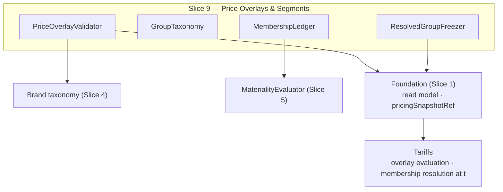

<!-- CONFLUENCE_TITLE: [BSS]: Pricing — Price Overlays & Customer-Group Segment Pricing (Design, Slice 9) -->
<!-- Related: ../PRD.md, ../DESIGN.md, ./01-foundation.md | Owners: BSS Product Catalog team -->

# DESIGN — Price Overlays & Customer-Group Segment Pricing (Slice 9)

<!-- toc -->

- [1. Context](#1-context)
  - [1.1 Overview](#11-overview)
  - [1.2 Purpose](#12-purpose)
  - [1.3 Actors](#13-actors)
  - [1.4 References](#14-references)
  - [1.5 Scope](#15-scope)
  - [1.6 Constraints & Assumptions](#16-constraints--assumptions)
  - [1.7 Naming & Design-Introduced Names](#17-naming--design-introduced-names)
  - [1.8 Context & Dependencies](#18-context--dependencies)
- [2. Actor Flows (CDSL)](#2-actor-flows-cdsl)
  - [Author a PriceOverlay](#author-a-priceoverlay)
  - [Manage Customer-Group Membership](#manage-customer-group-membership)
- [3. Processes / Business Logic (CDSL)](#3-processes--business-logic-cdsl)
  - [PriceOverlay Authoring Validation](#priceoverlay-authoring-validation)
  - [Customer-Group Taxonomy and Membership](#customer-group-taxonomy-and-membership)
  - [Membership-Change Materiality](#membership-change-materiality)
- [4. States (CDSL)](#4-states-cdsl)
  - [Membership Record State Machine](#membership-record-state-machine)
- [5. API Surface](#5-api-surface)
- [6. Data Model](#6-data-model)
- [7. Events & Alarms](#7-events--alarms)
- [8. Definitions of Done](#8-definitions-of-done)
  - [PriceOverlay Authoring](#priceoverlay-authoring)
  - [Customer-Group Pricing](#customer-group-pricing)
- [9. Acceptance Criteria](#9-acceptance-criteria)
- [10. Non-Functional Considerations](#10-non-functional-considerations)

<!-- /toc -->

## 1. Context

### 1.1 Overview

This slice owns **`PriceOverlay` authoring and validation** — scope
(partner/orgTier/brand/region/customerGroup/global), adjustment (`markup | discount |
fixed`), **explicit precedence** (duplicate precedence within one scope class rejected), own
`[effectiveFrom, effectiveTo)` dating, declared tax basis — and the **customer-group segment
pricing** capability: the BSS-owned **group taxonomy**, the **effective-dated, audited
membership** record on the payer's commercial profile (resolved via `payerTenantId`), and the
freezing of the **resolved group** into `pricingSnapshotRef`. Precedence/stacking
**evaluation** is Tariffs'; base price rows always stay `priceOverlay = base` (Foundation §4.1).

**Traces to**: `cpt-cf-bss-pricing-fr-priceoverlay-authoring`,
`cpt-cf-bss-pricing-fr-priceoverlay-referential-integrity`,
`cpt-cf-bss-pricing-fr-customer-group-pricing`

### 1.2 Purpose

Give commercial teams governed overlays — partner, brand, and segment pricing — without
cloning SKUs or adding price-row axes: one base row set plus validated, precedence-ordered
adjustment overlays. Customer groups are a **BSS commercial projection** (trial/beta/VIP/…)
that never touches tenant topology, with membership as an auditable, effective-dated,
snapshot-frozen record so a payer's segment price is always reproducible.

### 1.3 Actors

| Actor | Role in Slice |
|-------|---------------|
| `cpt-cf-bss-pricing-actor-catalog-admin` | Authors PriceOverlays, the group taxonomy, memberships |
| `cpt-cf-bss-pricing-actor-rating` | Evaluates overlays (precedence/stacking); resolves membership at `t` |
| `cpt-cf-bss-pricing-actor-finance-reviewer` | Approves membership changes / group moves (material) |
| `cpt-cf-bss-pricing-actor-auditor` | Reads membership audit history |

### 1.4 References

- **PRD**: [PRD.md](../PRD.md) — §6.6, §17.7 (customer-group detail), §1.4 (Glossary: `brand`, `customerGroup`)
- **Design**: [01-foundation.md](./01-foundation.md) — scope key (`priceOverlay = base` on rows); [04-currency-tax.md](./04-currency-tax.md) — brand taxonomy rule; [05-governance.md](./05-governance.md) — materiality registration
- **Dependencies**: Slices 1, 4, 5. Consumed by Tariffs (evaluation) and frozen by the Foundation snapshot.

### 1.5 Scope

**In scope**: `PriceOverlay` CRUD + validation (scope, adjustment, precedence uniqueness per
scope class, effective dating, tax-basis declaration, referential integrity to published
targets); the customer-group taxonomy (BSS-governed); effective-dated audited membership on
`payerTenantId`; resolved-group snapshot freezing; membership-change governance
(renewal-aligned default; immediate = explicit material change).

**Out of scope**: precedence/stacking **evaluation** and overlay math (Tariffs); contract
overrides (Contracts); per-group **different tier structures** (Future — separate plans);
AMS/tenant topology (membership is a BSS projection, never a tenant attribute).

### 1.6 Constraints & Assumptions

Inherits Foundation C-set. Slice-9-specific:

| # | Topic | Assumption (default) | Source |
|---|-------|----------------------|--------|
| L1 | Overlay, not axis | `PriceOverlay` rows are overlays evaluated by Tariffs; price rows authored in this gear always carry `priceOverlay = base`; publish-time coverage resolves on base | PRD §2.2 |
| L2 | Precedence explicit | Integer `precedence`, unique within one scope class; ties are authoring errors, not runtime resolution | PRD §6.6 |
| L3 | Membership dating | Membership is effective-dated `[from, to)`; the group resolved at `t` via `payerTenantId`; renewal-aligned re-resolution by default | PRD §17.7 |
| L4 | Materiality | A group discount/move affecting many payers and any **immediate** re-resolution are material changes (registered into Slice 5's evaluator) | PRD §17.7 |
| L5 | Tax basis | A `PriceOverlay` MUST declare its tax basis or explicitly delegate to Tariffs — silence fails publish | PRD §6.6 |
| L6 | Overlay disclosure | Every `PriceOverlay` carries `disclosure ∈ {restricted (default), public}`. `restricted` = the overlay (including its **existence**) is never exposed on any consumer-facing enumeration or preview and resolves only inside the member payer's own evaluation context; `public` = Presentation/Tariffs preview MAY disclose the adjusted price to anyone. Fail-closed default. *(Backfilled into PRD §6.6 / fr-priceoverlay-authoring.)* | Design (this slice) |
| L7 | Membership scope | At launch, membership resolves for the **direct** `payerTenantId` only. **Needs-decision:** subtree inheritance — a membership on a parent payer covering its payer-subtenants (proposal: resolve by walking the payer hierarchy upward, most-specific/nearest membership wins; record + freeze the `inherited_via` chain in the snapshot for auditability; a parent-membership change then cascades materiality over the subtree). Without it, "the whole client's structure gets the discount" requires enrolling every payer-subtenant individually. Owner: Product + Architecture. | Design (this slice) |

### 1.7 Naming & Design-Introduced Names

| Name | Meaning |
|------|---------|
| `PriceOverlayValidator` | Registered rules: scope validity (incl. brand via Slice 4's taxonomy rule), adjustment shape, precedence uniqueness, effective-interval sanity, tax-basis declaration, referential integrity |
| `GroupTaxonomy` | The BSS-governed customer-group value set (like region/brand) |
| `MembershipLedger` | The effective-dated, audited membership records per payer commercial profile |
| `ResolvedGroupFreezer` | The **joint contract name** (D-30), not a catalog runtime component: the catalog publishes membership into the read model; **Tariffs** performs the interval resolution at activation/renewal and freezes the resolved group into the `pricingSnapshotRef` **it composes** (composition SoR) |

### 1.8 Context & Dependencies

## 2. Actor Flows (CDSL)

### Author a PriceOverlay

- [ ] `p1` - **ID**: `cpt-cf-bss-pricing-flow-priceoverlay-author`

**Actor**: `cpt-cf-bss-pricing-actor-catalog-admin`

**Success Scenarios**:
- A `PriceOverlay` with scope, adjustment, unique precedence, optional effective interval, and declared tax basis validates and lands in the read model for Tariffs evaluation

**Error Scenarios**:
- Duplicate `precedence` within the scope class → `PRECEDENCE_DUPLICATE` (409)
- Scope referencing an unpublished plan/SKU → `TARGET_UNPUBLISHED` (422, not exposed in the read model)
- Unknown `brand`/`customerGroup` value → taxonomy failure (422)
- Missing tax basis (no declaration, no explicit delegation) → `TAX_BASIS_UNDECLARED` (422)

**Steps**:
1. [ ] - `p1` - API: POST/PATCH /v1/pricing/price-overlays (idempotency key / ETag) - `inst-pl-author`
2. [ ] - `p1` - `PriceOverlayValidator` runs the L2/L5 + referential + taxonomy rules - `inst-pl-validate`
3. [ ] - `p1` - **RETURN** 201/200; the committed overlay is a **publish unit through the Foundation engine** (D-06): validation → pending `CatalogVersion` ref → read-model warm — consumer-visible only at `CatalogVersionPublished` + warm-completion, the same monotonic pinning as plan content (evaluation downstream) - `inst-pl-return`

### Manage Customer-Group Membership

- [ ] `p1` - **ID**: `cpt-cf-bss-pricing-flow-group-membership`

**Actor**: `cpt-cf-bss-pricing-actor-catalog-admin` (approval per L4 where material)

**Success Scenarios**:
- A payer's membership record (`payerTenantId`, group, `[from, to)`) is created/ended; audited; renewal-aligned by default — the subscription's pinned snapshot keeps the old group until renewal
- An **immediate** re-resolution is executed as an explicit material change (Slice 5 approval)

**Error Scenarios**:
- Unknown group value → taxonomy failure (422); overlapping membership intervals for one payer in one group → `MEMBERSHIP_OVERLAP` (409)

**Steps**:
1. [ ] - `p1` - API: POST /v1/pricing/customer-groups/{group}/members (payer, effective interval) - `inst-gm-api`
2. [ ] - `p1` - `MembershipLedger` validates interval non-overlap per `(payer, group)`; every change audited (actor, before/after, reason) - `inst-gm-ledger`
3. [ ] - `p1` - Material paths (L4) route through Slice 5 approval before commit - `inst-gm-material`
4. [ ] - `p1` - **RETURN** 201; the committed membership mutation is a **publish unit through the Foundation engine** (D-06 — pending ref → warm; registry batching coalesces bulk enrollments), so a renewal after the commit always sees it; **Tariffs** resolves the group at `t` and freezes it into the snapshot it composes (`ResolvedGroupFreezer` = the joint contract, D-30 — the catalog has no per-subscription snapshot participation and no resolve-for-payer endpoint) - `inst-gm-return`

## 3. Processes / Business Logic (CDSL)

### PriceOverlay Authoring Validation

- [ ] `p1` - **ID**: `cpt-cf-bss-pricing-algo-priceoverlay-validate`

**Steps**:
1. [ ] - `p1` - Scope ∈ {partner, orgTier, brand, region, customerGroup, global}; scope values validated against their taxonomies (brand → Slice 4; customerGroup → `GroupTaxonomy`) - `inst-plv-scope`
2. [ ] - `p1` - Adjustment ∈ {markup, discount, fixed}. A **percent** magnitude is a single basis-points value (currency-neutral). An **amount-based** magnitude (`fixed`, absolute markup/discount) is money and therefore exists only **per currency** (D-08, no-implicit-FX): the adjustment carries a `pricing_price_overlay_amount` value set that MUST cover **every currency the overlay's target scope sells** — each value validated at its currency's ISO 4217 minor unit; a missing currency fails save/publish (`ADJUSTMENT_CURRENCY_NOT_COVERED`). A base row in a **new** currency published later flags affected amount-based overlays `coverage_incomplete` (+ alarm; the uncovered market resolves without the overlay — normal precedence semantics — until the operator adds the value) - `inst-plv-adjustment` — *D-42 (PROPOSED 2026-07-13, flagged for veto): a `PriceOverlay` MAY instead hold **per-plan adjustment lines** keyed `(planId, targetSku?)`, each with its own kind + magnitude (most-specific-wins within a list). Prototyped in Pricing Studio; the per-currency coverage rule above then re-attaches **per line**. Not normative until Product/Finance rule.*
3. [ ] - `p1` - `precedence` unique within one scope class (L2); duplicate rejected at save - `inst-plv-precedence`
3a. [ ] - `p1` - **Cross-class tie-break (joint contract):** `precedence` is unique only within a class, so overlays from **different** classes can tie. The read model publishes the normative **class-specificity order** — `customerGroup > partner > orgTier > brand > region > global` — as the tie-break Tariffs MUST adopt verbatim (the most-specific-wins doctrine, mirroring grandfathering eligibility); authoring additionally **warns** on an equal-precedence cross-class pair with overlapping targets so the operator sees the tie before relying on the break - `inst-plv-class-tiebreak`
4. [ ] - `p1` - Optional `[effectiveFrom, effectiveTo)` validated per scope + adjustment target (its own interval — **not** on the canonical price-row key; overlays are not price rows); overlapping intervals for one `(scope, target)` pair are rejected at authoring (`OVERLAY_INTERVAL_OVERLAP`, 409) — the overlay analogue of window non-overlap - `inst-plv-dating`
5. [ ] - `p1` - Tax basis declared or explicitly delegated to Tariffs (L5); silence fails - `inst-plv-taxbasis`
6. [ ] - `p1` - Referential integrity: a scope referencing an unpublished plan/SKU is rejected and never exposed in the read model. **Retirement of a targeted plan does not block on overlays** (D-31): the overlay goes **dangling-and-flagged** — read-model flag + `pricing.priceoverlay.target_retired` (Warn); in-flight subscribers legitimately keep resolving retired plans' rows, so the overlay stays evaluable for them; remediation = end or retarget the overlay - `inst-plv-referential`
7. [ ] - `p1` - **Disclosure (L6):** `disclosure` defaults to `restricted` — the overlay is excluded from every consumer-facing enumeration and from the base-price preview (Slice 4 returns base + disclaimer only, regardless), and materializes only in the member payer's own Tariffs evaluation/quote/invoice; `public` overlays MAY be disclosed by Presentation / the Tariffs effective-price preview (F-34). Operator/service reads (`price_overlay × read`) are unaffected — the flag governs **consumer-facing** exposure only - `inst-plv-disclosure`
8. [ ] - `p1` - **Member-scoped storefront rendering (joint contract):** "each payer sees their own price" is delivered by the **Tariffs effective-price evaluation in the caller's payer context**, where the payer identity **MUST derive from the authenticated caller's claims (gateway), never from a client-supplied `payerTenantId` parameter** — otherwise a non-member could query another payer's restricted price. The catalog contributes base rows + overlay definitions + membership; checkout submits `planId` only (no client-supplied price), and the resolved group frozen in the snapshot is what rating charges. The Tariffs member-scoped preview (F-34) is required **before restricted segment pricing sells self-service** — a tracked **GA gate** on F-34 (owner: Tariffs + GTM; program board per PRD §13, D-33) — the slice itself does not hold on it - `inst-plv-member-preview`

### Customer-Group Taxonomy and Membership

- [ ] `p1` - **ID**: `cpt-cf-bss-pricing-algo-group-membership`

**Steps**:
1. [ ] - `p1` - `GroupTaxonomy` is BSS-owned and governed like region/brand (values validated at authoring; retire guarded by referential checks) - `inst-cg-taxonomy`
2. [ ] - `p1` - Membership is an **effective-dated, audited BSS record** on the payer's commercial profile keyed by `payerTenantId` — AMS supplies identity only; tenant topology is never modified - `inst-cg-record`
3. [ ] - `p1` - Resolution: the group at `t` = the membership interval covering `t` — **at most one active membership per payer across all groups** (D-09): a second enrollment while one is active is rejected (`MEMBERSHIP_CONFLICT`, names the active one), so the resolved group is unique **by construction**; a transfer is the atomic **move** operation (end current + start new in one audited mutation; renewal-aligned by default, immediate = material per `inst-mm-*`); Tariffs applies the `customerGroup` `PriceOverlay` per group × region - `inst-cg-resolve`
4. [ ] - `p1` - **Determinism:** the resolved group freezes into `pricingSnapshotRef`; a pinned subscription keeps its frozen group until renewal re-resolution (L3) - `inst-cg-freeze`
5. [ ] - `p2` - **Membership scope (L7):** resolution matches the **direct** `payerTenantId` at launch; subtree inheritance (parent membership covering payer-subtenants via a payer-hierarchy walk, nearest-wins, `inherited_via` frozen in the snapshot) is a recorded **needs-decision** — until decided, per-subtenant enrollment is the supported path (automatable off AMS subtenant-creation events as an ops concern) - `inst-cg-subtree`
6. [ ] - `p1` - **Segment-pricing routing rule (normative):** a segment needing a **price adjustment** (±%, fixed) on the base structure → `customerGroup` overlay (this slice; server-side resolution, no leakable id); a segment needing a **different structure** (other tiers/counts/mechanics) → a **separate plan**, operator-channel only until group-scoped plan eligibility lands (Slice 7 `inst-sg-eligibility-gated`); **negotiated per-account terms** → Contracts (out of catalog). Free-for-internal groups → a separate `$0`-row plan (Slice 3 Q5) - `inst-cg-routing`
7. [ ] - `p2` - **Eligibility-gate policy set (needs-decision, gates F-88 activation):** (a) membership ends while a subscription lives — default proposal: the subscription continues to renewal, then re-binds/migrates (mirrors `grandfatherUntil` semantics); (b) operator sale outside the group — explicit audited override vs enroll-first (proposal: enroll-first, no override); (c) interaction with `allowedChangeTargets` — a self-service change INTO an eligibility-gated plan requires **both** the change edge and membership. Owner: Product + Finance; MUST be decided before `eligibleCustomerGroups` activates - `inst-cg-eligibility-policy`

### Membership-Change Materiality

- [ ] `p1` - **ID**: `cpt-cf-bss-pricing-algo-membership-materiality`

**Steps**:
1. [ ] - `p1` - Default: a membership change is **renewal-aligned** — no approval needed beyond audit; the price effect lands at each subscription's next renewal re-resolution - `inst-mm-renewal`
2. [ ] - `p1` - **Immediate** re-resolution is an explicit **material change** → Slice 5 two-person rule - `inst-mm-immediate`
3. [ ] - `p1` - A group discount change or group move affecting many payers is **material** (registered as an always-material trigger in Slice 5's evaluator) - `inst-mm-bulk`
4. [ ] - `p1` - All membership changes audited (Slice 5 `AuditTrail`) - `inst-mm-audit`

## 4. States (CDSL)

### Membership Record State Machine

- [ ] `p2` - **ID**: `cpt-cf-bss-pricing-state-membership`

**States**: scheduled (`from > now`), active (`from ≤ now < to`), ended (`to ≤ now`)
**Initial State**: scheduled or active per the authored interval

**Transitions**:
1. [ ] - `p1` - Time-driven (`from`/`to` passing); records are never mutated in place — ending early = setting `to` (audited); history retained - `inst-ms-time`
1a. [ ] - `p1` - **Move (D-09):** transferring a payer between groups is one atomic audited mutation — end the active membership + create the new one at the same instant (no gap, no overlap); it follows the standard materiality rules (renewal-aligned default; immediate = material) - `inst-ms-move`
2. [ ] - `p2` - A pinned subscription's **frozen** group is unaffected by transitions until renewal (L3) - `inst-ms-pinned`

## 5. API Surface

| Method | Path | Purpose | Idempotency |
|--------|------|---------|-------------|
| `POST/PATCH` | `/v1/pricing/price-overlays` | Author/validate an overlay | idempotency key / ETag |
| `GET` | `/v1/pricing/price-overlays` | List overlays (admin/Tariffs read) | — |
| `GET/PUT` | `/v1/pricing/customer-groups/taxonomy` | The BSS group taxonomy | ETag |
| `POST` | `/v1/pricing/customer-groups/{group}/members` | Create an effective-dated membership | idempotency key |
| `PATCH` | `/v1/pricing/customer-groups/{group}/members/{id}` | End/adjust an interval (audited) | ETag |
| `POST` | `/v1/pricing/customer-groups/{group}/members/{payerId}/move` | Atomic transfer from the payer's active group (end + start, one audited mutation; D-09) | idempotency key |

**Problem responses (RFC 9457):** `PRECEDENCE_DUPLICATE` (409), `OVERLAY_INTERVAL_OVERLAP`
(409 — overlapping effective intervals for one `(scope, target)` pair), `TARGET_UNPUBLISHED`
(422), `TAX_BASIS_UNDECLARED` (422), `ADJUSTMENT_CURRENCY_NOT_COVERED` (422 — an
amount-based adjustment missing a value for a currency its target scope sells, D-08),
`GROUP_UNKNOWN` (422), `MEMBERSHIP_OVERLAP` (409 — overlapping intervals within one group),
`MEMBERSHIP_CONFLICT` (409 — the payer already holds an active membership in another group;
use the move operation — D-09).

## 6. Data Model

Slice-owned tables (`pricing_` prefix per Foundation §3.7):

**`pricing_price_overlay`** (PK `price_overlay_id`):

| Column | Type | Notes |
|--------|------|-------|
| `scope_class` | `enum` | `partner \| org_tier \| brand \| region \| customer_group \| global` |
| `scope_value` | `string` | taxonomy-validated per class |
| `adjustment_kind` | `enum` | `markup \| discount \| fixed` |
| `adjustment_value` | `int` | **basis points; percent adjustments only** — amount-based magnitudes live in `pricing_price_overlay_amount` (D-08) |
| `precedence` | `int` | `UNIQUE (tenant_id, scope_class, precedence)` (L2) |
| `effective_from` / `effective_to` | `timestamptz` | optional overlay dating (own interval) |
| `tax_basis` | `enum` | `inclusive \| exclusive \| delegated_tariffs`; NOT NULL (L5) |
| `disclosure` | `enum` | `restricted (default) \| public` — consumer-facing exposure of the overlay (L6); NOT NULL |
| `target_ref` | `jsonb` | plan/SKU targets; referential-validated |

**`pricing_price_overlay_amount`** (FK `price_overlay_id`; amount-based adjustments only, D-08):
`currency` (ISO 4217), `value_minor` (`bigint`, validated at the currency's minor unit);
`UNIQUE (price_overlay_id, currency)`. The value set MUST cover every currency the overlay's
target scope sells (`ADJUSTMENT_CURRENCY_NOT_COVERED` otherwise); rows exist only when
`adjustment_kind` is amount-based.

**`pricing_customer_group_taxonomy`** — like region/brand (Slice 4 pattern): `(tenant_id,
value)`, `state`, retire guarded.

**`pricing_group_membership`** (PK `membership_id`):

| Column | Type | Notes |
|--------|------|-------|
| `payer_tenant_id` | `uuid` | the payer's commercial profile key |
| `group_value` | `string` | FK-like to the taxonomy |
| `effective_from` / `effective_to` | `timestamptz` | `[from, to)`; non-overlap per `(payer, group)` **and at most one active membership per `payer_tenant_id` across all groups** (D-09) enforced at write |
| `reason` / `actor` | — | audit surface (full trail in `pricing_audit_log`) |

## 7. Events & Alarms

No new frozen event names — every committed overlay/membership mutation is its **own publish
unit through the Foundation engine** (D-06): it requests `CatalogVersion` addressability and
warms the read model without a dedicated event (consumers observe `CatalogVersionPublished`
+ the warmed content; the registry's batching coalesces chatty membership traffic; the
increment-trigger taxonomy line rides the open §15 Registry item). Membership changes are
audited mutations. Alarms:
`pricing.segment.membership_renewal_backlog` (Info — memberships ended/changed whose
subscriptions have not yet re-resolved at renewal; expected steady-state visibility),
`pricing.priceoverlay.amount_coverage_incomplete` (Warn — a base row in a new currency
published after an amount-based overlay left it without a value for that market; the market
resolves without the overlay until remediated, D-08),
`pricing.priceoverlay.target_retired` (Warn — a published overlay targets a retired plan;
dangling-and-flagged, remediation = end/retarget the overlay, D-31 — mirrors the
`discountRef` pattern).

## 8. Definitions of Done

### PriceOverlay Authoring

- [ ] `p1` - **ID**: `cpt-cf-bss-pricing-dod-priceoverlay`

The catalog **MUST** author/validate `PriceOverlays`: scope + taxonomy-validated values,
adjustment shape, unique precedence per scope class, optional own-interval dating, declared
tax basis (or explicit delegation), referential integrity to published targets — with
evaluation staying in Tariffs and base rows staying `priceOverlay = base`. Every committed
overlay mutation **MUST** be its own publish unit through the Foundation engine
(version-pinned visibility, D-06). Amount-based adjustments carry **per-currency** values
covering every currency of the target scope (no implicit FX; fail-closed at authoring,
flag-and-remediate on later currency additions — D-08).

**Implements**: `cpt-cf-bss-pricing-flow-priceoverlay-author`, `cpt-cf-bss-pricing-algo-priceoverlay-validate`

**Touches**:
- API: `POST/PATCH /v1/pricing/price-overlays`
- DB: `pricing_price_overlay`
- Entities: `PriceOverlayValidator`

### Customer-Group Pricing

- [ ] `p1` - **ID**: `cpt-cf-bss-pricing-dod-customer-group`

The catalog **MUST** own the BSS customer-group taxonomy and the effective-dated, audited,
non-overlapping membership record on `payerTenantId`, freeze the resolved group in
`pricingSnapshotRef`, default membership changes to renewal-aligned, and route immediate
re-resolution and bulk group moves through the material-change policy; a payer holds **at
most one active membership across all groups** (conflicting enrollment rejected; transfer =
the atomic move — D-09). Every committed
membership mutation **MUST** be its own publish unit through the Foundation engine
(version-pinned visibility; registry batching coalesces bulk enrollments, D-06).

**Implements**: `cpt-cf-bss-pricing-flow-group-membership`, `cpt-cf-bss-pricing-algo-group-membership`, `cpt-cf-bss-pricing-algo-membership-materiality`, `cpt-cf-bss-pricing-state-membership`

**Touches**:
- API: `/v1/pricing/customer-groups/*`
- DB: `pricing_customer_group_taxonomy`, `pricing_group_membership`
- Entities: `GroupTaxonomy`, `MembershipLedger`, `ResolvedGroupFreezer`

## 9. Acceptance Criteria

Unit:

- [ ] Precedence uniqueness per scope class (duplicate across classes allowed); overlapping effective intervals for one `(scope, target)` pair rejected (`OVERLAY_INTERVAL_OVERLAP`); tax-basis silence fails; an amount-based adjustment missing a currency of its target scope rejected (`ADJUSTMENT_CURRENCY_NOT_COVERED`) while a percent adjustment needs no currency values; per-currency amount precision follows the ISO 4217 minor unit; unpublished target rejected + hidden from the read model; membership interval overlap rejected; a cross-group concurrent enrollment rejected (`MEMBERSHIP_CONFLICT`) while the atomic move transfers with no gap/overlap instant; group-taxonomy retire guarded while referenced

Integration (testcontainers):

- [ ] A `customerGroup` PriceOverlay (group × region adjustment) publishes; a payer's membership resolves the group at `t`; the resolved group appears frozen in a new snapshot
- [ ] A membership change mid-subscription does **not** alter the pinned snapshot's group; renewal re-resolution picks the new group
- [ ] An immediate re-resolution requires approval (material); a bulk group discount routes material
- [ ] An overlay/membership committed while **no plan publishes** becomes rateable via its own publish unit at the next `CatalogVersionPublished` batch (within the propagation SLO); a renewal after that commit resolves the new membership — never "waits for an unrelated plan publish"
- [ ] Publishing a base row in a **new** currency flags targeting amount-based overlays `coverage_incomplete` (+ alarm); the new market resolves at base price until the operator adds the per-currency value

## 10. Non-Functional Considerations

- **Performance**: membership resolution is an indexed interval lookup per `(payer, group)` at snapshot/renewal time (not per rating call — the frozen group rides the snapshot).
- **Observability**: `pricing_priceoverlay_validation_failures_total{rule}`, `pricing_group_membership_changes_total{material}`.
- **Security & AuthZ**: taxonomy/membership mutation is admin-scoped, audited; material paths two-person (Slice 5).
- **Risks & open items**: per-group different tier structures deliberately Future (separate plans + group-scoped eligibility); this was a MAJOR launch-scope decision (2026-07-04, F-88) — the adjustment-only overlay is the committed shape. **D-42 (PROPOSED 2026-07-13, flagged for veto)** reopens only the *single-magnitude* part: a per-plan adjustment **line set** (one adjustment per `(planId, target)`, most-specific-wins within a list; class rank still stacks across lists) prototyped in Pricing Studio — still strictly adjustment-only (different *structures* stay Future). Not normative until Product/Finance rule. **Needs-decision (L7)**: membership subtree inheritance over the payer hierarchy (nearest-wins walk, `inherited_via` frozen; cascade materiality on parent-membership changes) vs per-subtenant enrollment — Owner: Product + Architecture. **L6 backfilled into the PRD** (§6.6); the Tariffs member-scoped effective-price preview (F-34) — where `restricted` overlays become visible to their own members — is REQUIRED for storefront UX (inst-plv-member-preview).
