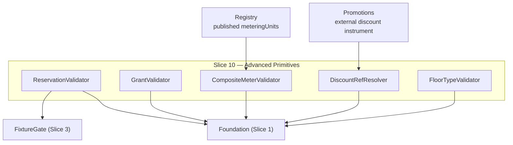

<!-- CONFLUENCE_TITLE: [BSS]: Pricing — Advanced Pricing Primitives (Design, Slice 10) -->
<!-- Related: ../PRD.md, ../DESIGN.md, ./01-foundation.md | Owners: BSS Product Catalog team -->

# DESIGN — Advanced Pricing Primitives (Slice 10)

<!-- toc -->

- [1. Context](#1-context)
  - [1.1 Overview](#11-overview)
  - [1.2 Purpose](#12-purpose)
  - [1.3 Actors](#13-actors)
  - [1.4 References](#14-references)
  - [1.5 Scope](#15-scope)
  - [1.6 Constraints & Assumptions](#16-constraints--assumptions)
  - [1.7 Naming & Design-Introduced Names](#17-naming--design-introduced-names)
  - [1.8 Context & Dependencies](#18-context--dependencies)
- [2. Actor Flows (CDSL)](#2-actor-flows-cdsl)
  - [Author Advanced Primitives](#author-advanced-primitives)
- [3. Processes / Business Logic (CDSL)](#3-processes--business-logic-cdsl)
  - [Reserved-Capacity Attributes](#reserved-capacity-attributes)
  - [Prepaid Credit Grant](#prepaid-credit-grant)
  - [Derived (Composite) Meter](#derived-composite-meter)
  - [Discount Reference Hook](#discount-reference-hook)
  - [Minimum-Quantity Floor Typing](#minimum-quantity-floor-typing)
  - [Trailing-Tier Qualification (Tier Rate-Lock)](#trailing-tier-qualification-tier-rate-lock)
- [4. States (CDSL)](#4-states-cdsl)
- [5. API Surface](#5-api-surface)
- [6. Data Model](#6-data-model)
- [7. Events & Alarms](#7-events--alarms)
- [8. Definitions of Done](#8-definitions-of-done)
  - [Reserved Capacity](#reserved-capacity)
  - [Prepaid Grant](#prepaid-grant)
  - [Derived Meter](#derived-meter)
  - [Discount Hook & Floor Typing](#discount-hook--floor-typing)
  - [Trailing-Tier Qualification](#trailing-tier-qualification)
- [9. Acceptance Criteria](#9-acceptance-criteria)
- [10. Non-Functional Considerations](#10-non-functional-considerations)

<!-- /toc -->

## 1. Context

### 1.1 Overview

This slice owns the four advanced authoring primitives and one typing rule:
**reserved-capacity pricing** as attributes on the single usage row (`reservedRate` +
`reservationFlavor`, p1 — launch scope), the **prepaid credit grant** (definition only —
`category`, materialized usage-line `applicability`, drawdown-rank default (D-43); balance
execution GA-gated on Billing/Rating), the **derived (composite) meter**
(formula-as-**data** over ≥ 2 published units, one output unit), the **`discountRef`
day-1 hook** (referential integrity only), and the **typed `minQtyThreshold`** floor
(`purchase` vs `usage`). Every primitive freezes into `pricingSnapshotRef`; every piece of
math it implies is evaluated downstream.

**Traces to**: `cpt-cf-bss-pricing-fr-reserved-capacity`,
`cpt-cf-bss-pricing-fr-prepaid-credit-grant`, `cpt-cf-bss-pricing-fr-derived-composite-meter`,
`cpt-cf-bss-pricing-fr-discount-ref-hook`, `cpt-cf-bss-pricing-fr-min-qty-floor`

### 1.2 Purpose

Cover the launch commercial shapes beyond plain rows — committed-rate IaaS selling, wallet
prepay, multi-unit composite pricing (VM = vCPU + RAM as one line), day-1 discounts —
without breaking the two structural rules that keep rating unambiguous: one priced line per
`(meter, dimensionKey)` (reservation = attributes, composite = one output unit) and zero
computation in the catalog.

### 1.3 Actors

| Actor | Role in Slice |
|-------|---------------|
| `cpt-cf-bss-pricing-actor-finance-manager` | Authors reserved rates, grants, floors |
| `cpt-cf-bss-pricing-actor-rating` | Evaluates reservation (step 6), composite formulas; sources from the snapshot |
| `cpt-cf-bss-pricing-actor-billing` | Owns prepaid balance/drawdown/auto-recharge execution (GA gate) |
| `cpt-cf-bss-pricing-actor-promotions` | Owns the external discount instrument `discountRef` resolves to |
| `cpt-cf-bss-pricing-actor-catalog-registry` | Declares the constituent `meteringUnit`s composites build on |
| `cpt-cf-bss-pricing-actor-contracts` | Owns negotiated RI-style rates (boundary) |
| `cpt-cf-bss-pricing-actor-subscriptions` | Enforces the `purchase`-type floor at order time |

### 1.4 References

- **PRD**: [PRD.md](../PRD.md) — §6.10, §17.7 (primitives detail), §17.2 (reservation fixture row), §17.4 (prepaid/floor validation rules)
- **Design**: [01-foundation.md](./01-foundation.md); [03-price-structure.md](./03-price-structure.md) — the usage row + `FixtureGate` these primitives extend
- **Dependencies**: Slices 1–3 (rows), Slice 5 (grant-price materiality), registry (`meteringUnit` declarations).

### 1.5 Scope

**In scope**: authoring + publish validation + snapshot freezing of the five primitives;
the reservation-variant registration into Slice 3's `FixtureGate`; grant-price scoping per
`(currency, region)`; composite formula-as-data schema + referential/self-reference checks;
`discountRef` resolution check; floor typing + placement warning.

**Out of scope**: reservation evaluation/matching (Tariffs step 6); balance ledger,
drawdown, zero cut-off, auto-recharge execution (Billing/Rating — **GA gate** for the
sellable path); composite formula evaluation (Tariffs); discount authoring/evaluation/
stacking (Promotions/Tariffs); negotiated RI rates (Contracts); floor enforcement
(Subscriptions for `purchase`; Tariffs/Rating for `usage`).

### 1.6 Constraints & Assumptions

Inherits Foundation C-set. Slice-10-specific:

| # | Topic | Assumption (default) | Source |
|---|-------|----------------------|--------|
| A1 | Reservation = attributes | `reservedRate`/`reservationFlavor` live **on** the usage row (never a second row) so `(meter, dimensionKey)` stays injective; aligned field-for-field with Tariffs `reservationMatch` | PRD §17.7 |
| A2 | Reserved row is a usage row | `billingGranularity` REQUIRED; `tierAggregationWindow` REQUIRED only when tiered (the usage-only placement rule applies normally) | PRD §17.7 |
| A3 | Grant is not a Price row | The prepaid grant is a **plan-attached primitive** with its own per-`(currency, region)` price — no `chargeKind`, not on the canonical scope key | PRD §17.7 |
| A4 | Formula as data | Composite formula = operands + operator/weights as data (never executable code); versioned with the plan revision | PRD §17.7 |
| A5 | Prepaid GA gate | Grants are definable/publishable but **not sellable** until Billing/Rating balance execution exists (tracked GA gate) | PRD §13 |

### 1.7 Naming & Design-Introduced Names

| Name | Meaning |
|------|---------|
| `ReservationValidator` | Registered rules: A1/A2 shapes; fixture registration for the reservation variant |
| `GrantValidator` | Registered rules: grant fields, expiry set, published `creditUnit`, per-`(currency, region)` price scoping (`category = prepaid`), promotional shape (no price rows, no auto-recharge), `applicability` (published usage meters of the plan, `creditUnit` consistency, materialized default) |
| `CompositeMeterValidator` | Registered rules: ≥ 2 published constituents, formula-as-data well-formedness, no self-reference, one output unit |
| `DiscountRefResolver` | Referential-integrity check against the registered external instrument |
| `FloorTypeValidator` | `purchase` vs `usage` typing + in-band placement warning |

### 1.8 Context & Dependencies

## 2. Actor Flows (CDSL)

### Author Advanced Primitives

- [ ] `p1` - **ID**: `cpt-cf-bss-pricing-flow-primitives-author`

**Actor**: `cpt-cf-bss-pricing-actor-finance-manager`

**Success Scenarios**:
- A usage row gains `reservedRate`/`reservationFlavor`; a plan gains a prepaid grant or a composite-meter definition; a row gains `discountRef` or a typed `minQtyThreshold` — each validated at publish, frozen in the snapshot

**Error Scenarios**:
- Reservation on a non-usage row → 422; grant without `expiryPolicy` / with unpublished `creditUnit` / unscoped price on a multi-market plan / promotional carrying a price or auto-recharge / `applicability` naming an unpublished or non-usage meter → 422; composite with < 2 or unpublished constituents / self-reference → 422; unresolvable `discountRef` → 422; untyped floor → 422

**Steps**:
1. [ ] - `p1` - Primitives author through the Slice 2/3 plan/price PATCH surfaces (plan-attached: grant, composite; row-attached: reservation, discountRef, floor) - `inst-ad-author`
2. [ ] - `p1` - Publish: the five validators run in the Foundation pipeline; the reservation variant additionally passes Slice 3's `FixtureGate` - `inst-ad-validate`
3. [ ] - `p1` - **RETURN** definitions frozen in `pricingSnapshotRef`; evaluation/execution downstream - `inst-ad-return`

## 3. Processes / Business Logic (CDSL)

### Reserved-Capacity Attributes

- [ ] `p1` - **ID**: `cpt-cf-bss-pricing-algo-reserved`

**Steps**:
1. [ ] - `p1` - `reservedRate` (≥ 0, row currency) + `reservationFlavor` (`consumption | capacity`) are attributes **on the single usage row**, alongside the on-demand price/tiers (A1 — never a second row, never a second `(meter, dimensionKey)` line) - `inst-rv-attrs`
2. [ ] - `p1` - The row remains a usage row (A2): `billingGranularity` REQUIRED; `tierAggregationWindow` REQUIRED only when tiered - `inst-rv-usage`
3. [ ] - `p1` - The reserved/allocated **quantity** is runtime input (OSS/Contracts entitlement); the catalog neither meters nor allocates nor computes the charge; Tariffs step 6 sources the self-service rate from the snapshot - `inst-rv-runtime`
3a. [ ] - `p1` - **Reservation × tiers (normative, money-affecting):** the matched/allocated reserved quantity is **excluded** from the on-demand tier counter `Q` — only the on-demand **remainder** enters the row's bands (150K used with a 100K reservation: 100K at `reservedRate`, the remainder's `Q` starts at 0, not 100K). Frozen semantics; the reservation joint fixture MUST include a tiered-remainder scenario - `inst-rv-tier-q`
4. [ ] - `p1` - The reservation variant requires its own joint golden fixture before publish (registered into Slice 3's `FixtureGate`); negotiated RI-style rates stay in Contracts (boundary) - `inst-rv-fixture`

### Prepaid Credit Grant

- [ ] `p2` - **ID**: `cpt-cf-bss-pricing-algo-prepaid-grant`

**Steps**:
1. [ ] - `p2` - Grant fields: `grantAmount > 0`; `creditUnit` = ISO 4217 currency **or** a **published** `meteringUnit` (unpublished fails); `expiryPolicy` explicitly `never` or `days(N>0)` (no implicit never; **`days(N)` anchors at grant issuance** — the purchase or recharge instant, UTC); `autoRechargeAllowed` bool - `inst-pg-fields`
1a. [ ] - `p2` - **`category` (D-43)**: `prepaid` (default — purchased; the `inst-pg-price` rules apply) or `promotional` (issued **free** — grant-price rows MUST be absent, `GRANT_PROMO_PRICE_FORBIDDEN`; `autoRechargeAllowed` MUST be false, `GRANT_PROMO_AUTORECHARGE` — a recharge is a purchase); publish **warns** on `promotional` + `expiryPolicy = never` (`GRANT_PROMO_NO_EXPIRY` — likely authoring error); frozen in the snapshot - `inst-pg-category`
1b. [ ] - `p2` - **`applicability` (D-43)**: which of the plan's charge lines the credit may offset at drawdown — `all_usage` (default) or an explicit set of **published** `meteringUnit` ids; every target MUST be a usage line of the grant-bearing plan (credit never offsets `one_time_setup` or recurring rows — launch rule); when `creditUnit` is a `meteringUnit`, the set MUST stay within that unit's meters (absent ⇒ that unit's meters). Publish **materializes** the resolved set into the snapshot — the executor never infers scope - `inst-pg-applicability`
1c. [ ] - `p2` - **`drawdownPriority` (D-43)**: optional int ≥ 0 (lower draws first) — an authored **default rank**, frozen in the snapshot. The **effective** cross-grant order at drawdown is **Billing-owned**, resolved over frozen inputs by the normative tie-break chain: `drawdownPriority` → category (`promotional` before `prepaid`) → earlier expiry → earlier issuance → `grantId` (a deterministic total order; the catalog never orders live balances) - `inst-pg-priority`
2. [ ] - `p2` - (`category = prepaid` only) Grant **price** is authored per `(currency, region)` like a price row scope — but the grant is a plan-attached primitive with **no** `chargeKind`, not on the canonical scope key (A3); a single unscoped price on a multi-`(currency, region)` plan fails publish, and the grant-price set MUST cover **every** `(currency, region)` the plan publishes sellable rows for — a missing market fails publish (`GRANT_PRICE_NOT_COVERED`) - `inst-pg-price`
3. [ ] - `p2` - Grant-price changes — and `category` / `applicability` / `drawdownPriority` changes on a published grant — flow through the **same material-change policy** (registered into Slice 5's evaluator) - `inst-pg-material`
4. [ ] - `p2` - The catalog **never** persists balance or computes drawdown; the definition freezes into the snapshot; the sellable path is **GA-gated** on Billing/Rating balance execution (A5) — publishable now, with a **prepaid-execution GA-gate flag** on the read model consumed by the Slice 7 sellability gate. **Mechanics (D-29):** the flag derives at publish from the named platform/tenant GA signal **"prepaid balance execution GA"** (owner: Billing/Rating; tracked on the program board per PRD §13); it applies to **every scope key of the grant-bearing plan** (plan-level — matching PRD AC #87); clearing follows the Slice 4 pattern (`inst-td-clear`): a **re-publish through the pipeline + approval** once the signal is GA — never a silent flag flip - `inst-pg-gagate`

### Derived (Composite) Meter

- [ ] `p2` - **ID**: `cpt-cf-bss-pricing-algo-composite-meter`

**Steps**:
1. [ ] - `p2` - Persist ≥ 2 **published** constituent `meteringUnit` ids (registry-declared); any unpublished constituent fails publish - `inst-cm-constituents`
2. [ ] - `p2` - Persist the formula **as data** (A4): operands + operator/weights — a declarative schema, not executable code; self-reference (output unit among constituents, direct or transitive) fails - `inst-cm-formula`
2a. [ ] - `p2` - **Output-unit ownership (D-32):** the derived output unit is **declared to the registry like any `meteringUnit`** (one meter namespace — Rating recognizes it through the same registry lookup as base units); the catalog persists the registry-declared unit id + the formula binding, never a catalog-private unit name. Part of the registry joint contract (PRD §15) - `inst-cm-output-unit`
3. [ ] - `p2` - One declared **output unit**: the price row rates the composite as **one line**, satisfying Slice 2's meter injectivity as one output unit - `inst-cm-output`
4. [ ] - `p2` - The definition freezes into `pricingSnapshotRef`; Tariffs evaluates — the catalog never computes the formula result - `inst-cm-frozen`

### Discount Reference Hook

- [ ] `p2` - **ID**: `cpt-cf-bss-pricing-algo-discount-ref`

**Steps**:
1. [ ] - `p2` - Optional `discountRef` validates **referential integrity only**: it must resolve to a registered external instrument (Promotions/Tariffs-owned); absence never blocks publish - `inst-dr-referential`
2. [ ] - `p2` - The catalog does not author, evaluate, or stack the discount; the ref persists on the snapshot; a clone copies it only if it still resolves (else dropped with an operator notice — Slice 12 clone rule) - `inst-dr-boundary`

### Minimum-Quantity Floor Typing

- [ ] `p2` - **ID**: `cpt-cf-bss-pricing-algo-floor-typing`

**Steps**:
1. [ ] - `p2` - A `minQtyThreshold` MUST declare its floor type: `purchase` (Subscriptions rejects orders below — not silently zero) or `usage` (Tariffs/Rating treats below-floor usage as ineligible, failing closed — never silent zero-rating); untyped fails publish - `inst-ft-typed`
1a. [ ] - `p2` - **The fallback is authored, not implied:** a `usage` floor MUST declare its fallback on the row; at launch the only supported value is **`exception`** — the below-floor usage line fails closed into the rating exception path (visible, resolvable), never silently zero-rated and never silently charged. Richer fallbacks (e.g. an alternative row) are Future; the declared fallback freezes in the snapshot - `inst-ft-fallback`
2. [ ] - `p2` - Both MAY be set on one row (distinct fields); type + value freeze in the snapshot - `inst-ft-both`
3. [ ] - `p2` - Publish **warns** when a floor falls inside a non-zero-priced band (likely authoring error: the floor hides paid quantity) - `inst-ft-warn`

### Trailing-Tier Qualification (Tier Rate-Lock)

- [ ] `p2` - **ID**: `cpt-cf-bss-pricing-algo-trailing-tier`

**Steps**:
1. [ ] - `p2` - A tiered usage row MAY set **`tierQualificationWindow`** (`current` | `trailing_month`) — a **third, distinct window** from `tierAggregationWindow` (when the in-window `Q` counter resets) and `billingGranularity` (billing cadence). `current` (default) preserves Slice 3 behaviour exactly (tier from this window's own `Q`) - `inst-tt-window`
2. [ ] - `p2` - `trailing_month`: the **rate tier is qualified by the prior calendar month's total** `Q`, not the current window — the band the trailing total falls into (single-band **volume**-style selection) sets **one rate for the whole current period**; billing then applies that locked rate to actual usage at `billingGranularity`. Canonical case: PaaS egress where last month's volume sets `$/GiB` and the current month is billed hourly on actual traffic - `inst-tt-qualify`
3. [ ] - `p2` - The qualified rate is a **period rate-lock** frozen into `pricingSnapshotRef` for the current period (the tier analogue of the FX rate-lock): Tariffs applies the locked rate; the catalog authors the window and never computes the qualification or the trailing aggregate (Rating supplies the trailing total) - `inst-tt-lock`
4. [ ] - `p2` - `trailing_month` is **usage-tiered only** (`graduated`/`volume`); presence on `flat`/`per_unit`/`package` or any non-usage row fails publish (`TIER_QUAL_ON_NON_TIERED`, 422) - `inst-tt-forbidden`
5. [ ] - `p2` - **Bootstrap** (first period, no trailing history) resolves to the **lowest tier** unless the plan authors an explicit bootstrap tier; the resolved bootstrap choice freezes in the snapshot so replay is deterministic - `inst-tt-bootstrap`
6. [ ] - `p2` - The qualification window and the resolved locked rate are part of the **joint Rating contract** (PRD §consumer-contracts): Rating computes the trailing aggregate and re-qualifies at each period boundary; Tariffs reads the locked rate from the pin - `inst-tt-joint`

## 4. States (CDSL)

No slice-owned state machine. The prepaid grant's sellability rides the GA-gate flag
(Slice 4 pattern, `inst-pg-gagate`); primitives otherwise ride the row/plan lifecycle.

## 5. API Surface

No new endpoints: primitives author through the Slice 2/3 surfaces (plan PATCH: grant,
composite; price-row PATCH: reservation, `discountRef`, floors).

**Problem responses (RFC 9457):** `RESERVATION_ON_NON_USAGE` (422),
`GRANT_EXPIRY_MISSING` (422), `CREDIT_UNIT_UNPUBLISHED` (422), `GRANT_PRICE_UNSCOPED` (422),
`GRANT_PRICE_NOT_COVERED` (422 — a sold `(currency, region)` without a grant price),
`GRANT_PROMO_PRICE_FORBIDDEN` (422 — a `promotional` grant carrying price rows),
`GRANT_PROMO_AUTORECHARGE` (422 — a `promotional` grant with `autoRechargeAllowed`),
`GRANT_APPLICABILITY_UNPUBLISHED` (422 — an applicability meter unknown or unpublished),
`GRANT_APPLICABILITY_INELIGIBLE` (422 — a target that is not a usage line of the plan, or an
empty resolved set), `GRANT_APPLICABILITY_UNIT_MISMATCH` (422 — a metered-`creditUnit` grant
scoped outside that unit's meters),
`COMPOSITE_CONSTITUENT_UNPUBLISHED` (422), `COMPOSITE_SELF_REFERENCE` (422),
`DISCOUNT_REF_UNRESOLVED` (422), `FLOOR_TYPE_MISSING` (422), `FLOOR_FALLBACK_MISSING` (422),
`TIER_QUAL_ON_NON_TIERED` (422 — `tierQualificationWindow = trailing_month` on a non-tiered or non-usage row); warnings:
`FLOOR_INSIDE_PRICED_BAND`, `GRANT_PROMO_NO_EXPIRY` (a `promotional` grant with `expiryPolicy = never`).

## 6. Data Model

Columns on Foundation-owned tables + one slice table (`pricing_` prefix per Foundation §3.7):

**`pricing_price` (Slice-10 columns)**:

| Column | Type | Notes |
|--------|------|-------|
| `reserved_rate_minor` | `bigint` | ≥ 0; usage rows only |
| `reservation_flavor` | `enum` | `consumption \| capacity`; present iff `reserved_rate_minor` is |
| `discount_ref` | `string` | optional; referential-validated |
| `min_qty_purchase` | `bigint` | purchase floor (order-time, Subscriptions) |
| `min_qty_usage` | `bigint` | usage floor (eligibility, Tariffs/Rating) |
| `min_qty_usage_fallback` | `enum` | REQUIRED when `min_qty_usage` set; launch: `exception` only (rating exception path); frozen in snapshot |

**`pricing_plan` (Slice-10 columns)** — `prepaid_grant` (`jsonb`: `grantAmount`,
`creditUnit`, `expiryPolicy`, `autoRechargeAllowed`, `category` — `prepaid | promotional`,
default `prepaid`; `applicability` — the **materialized** usage-meter id set or `all_usage`;
`drawdownPriority` — optional int ≥ 0) + **`pricing_grant_price`** rows.

**`pricing_grant_price`** (FK `plan_id`): `currency`, `region`, `price_minor` (≥ 0) — the
grant's purchase price per market (A3: not on the canonical scope key, no `chargeKind`); rows
REQUIRED iff `category = prepaid` (price rows on a `promotional` grant fail publish).

**`pricing_composite_meter`** (PK `composite_id`; FK `plan_id`): `output_unit`,
`constituent_units` (`jsonb`, ≥ 2 published ids), `formula` (`jsonb` — operands +
operator/weights, A4), `revision`.

Key constraints: `CHECK (reservation_flavor IS NULL) = (reserved_rate_minor IS NULL)`;
`CHECK (grant fields complete when prepaid_grant set)` at publish; composite self-reference
check application-level (graph walk over `constituent_units` vs `output_unit`).

## 7. Events & Alarms

No new frozen event names (primitives ride `PlanUpdated`/`PriceUpdated`). Alarms:
`pricing.prepaid.ga_gate_active` (Info gauge — published grants awaiting balance execution,
mirrors Slice 4's GA-gate visibility), `pricing.discount.ref_dangling` (Warn — a published
`discountRef` whose instrument was retired upstream; surfaced for remediation, rating is
unaffected since evaluation is downstream), `pricing.composite.constituent_retired` (Info — a
published composite meter references a constituent `meteringUnit` retired upstream; the next
publish is blocked per the composite AC, this alarm surfaces the already-published case for
remediation via re-publish with a corrected formula).

## 8. Definitions of Done

### Reserved Capacity

- [ ] `p1` - **ID**: `cpt-cf-bss-pricing-dod-reserved`

A usage row **MUST** support `reservedRate`/`reservationFlavor` as same-row attributes
(usage-row rules intact; quantity runtime-supplied; charge computed by Tariffs step 6 from
the snapshot), with the reservation variant fixture-gated before publish and negotiated RI
rates left to Contracts.

**Implements**: `cpt-cf-bss-pricing-algo-reserved`, `cpt-cf-bss-pricing-flow-primitives-author`

**Touches**:
- DB: `pricing_price` (reservation columns)
- Entities: `ReservationValidator`

### Prepaid Grant

- [ ] `p2` - **ID**: `cpt-cf-bss-pricing-dod-prepaid`

A plan **MAY** declare a prepaid grant with complete fields (explicit expiry, published
`creditUnit`, per-`(currency, region)` price for `category = prepaid`; a `promotional` grant
is free — no price rows, no auto-recharge), a **materialized** usage-line `applicability`
scope, and an optional `drawdownPriority` default rank; all frozen in the snapshot,
grant-price/`category`/`applicability`/rank changes material, **no** balance/drawdown or
cross-grant ordering here (the effective order is Billing's per the D-43 tie-break chain),
and the sellable path GA-gated on Billing/Rating execution.

**Implements**: `cpt-cf-bss-pricing-algo-prepaid-grant`

> **D-45 consumer**: an `includedAllowance.rolloverPolicy = carry(maxPeriods)` on a usage row
> publish-materializes into this grant machinery (a free per-period grant, `applicability` = the
> row's meter, expiry = the carry horizon) — the allowance never introduces a second drawdown path.

**Touches**:
- DB: `pricing_plan.prepaid_grant`, `pricing_grant_price`
- Entities: `GrantValidator`

### Derived Meter

- [ ] `p2` - **ID**: `cpt-cf-bss-pricing-dod-composite`

A composite meter **MUST** persist ≥ 2 published constituents, the formula as data, and one
output unit (injectivity preserved); self-reference and unpublished constituents fail; the
frozen definition is evaluated by Tariffs only.

**Implements**: `cpt-cf-bss-pricing-algo-composite-meter`

**Touches**:
- DB: `pricing_composite_meter`
- Entities: `CompositeMeterValidator`

### Discount Hook & Floor Typing

- [ ] `p2` - **ID**: `cpt-cf-bss-pricing-dod-discount-floor`

`discountRef` **MUST** validate referential integrity only (absence never blocks);
`minQtyThreshold` **MUST** declare `purchase`/`usage` typing (untyped fails; in-band
placement warns) and a `usage` floor **MUST** declare its fallback (launch: `exception`);
all freeze in the snapshot with enforcement downstream.

**Implements**: `cpt-cf-bss-pricing-algo-discount-ref`, `cpt-cf-bss-pricing-algo-floor-typing`

**Touches**:
- DB: `pricing_price` (discount/floor columns)
- Entities: `DiscountRefResolver`, `FloorTypeValidator`

### Trailing-Tier Qualification

- [ ] `p2` - **ID**: `cpt-cf-bss-pricing-dod-trailing-tier`

A tiered usage row **MAY** set `tierQualificationWindow` (`current` | `trailing_month`),
distinct from `tierAggregationWindow` and `billingGranularity`. `trailing_month` qualifies the
rate tier from the **prior month's total** (single-band selection), locks that rate for the
current period into `pricingSnapshotRef`, and bills actual usage at `billingGranularity`;
`trailing_month` on a non-tiered/non-usage row fails publish; first-period bootstrap resolves to
the lowest tier (or an authored bootstrap) and freezes. Tariffs applies the locked rate; Rating
supplies the trailing aggregate and re-qualifies at each period boundary.

**Implements**: `cpt-cf-bss-pricing-algo-trailing-tier`

**Touches**:
- DB: `pricing_price` (`tier_qualification_window` column)
- Entities: `TierQualificationValidator`

## 9. Acceptance Criteria

Unit:

- [ ] Reservation shape matrix (non-usage row rejected; flavor without rate rejected; granularity still required); grant field matrix (implicit-never rejected; unpublished creditUnit rejected; unscoped price on 2-market plan rejected; a 3-market plan with grant prices for only 2 rejected — `GRANT_PRICE_NOT_COVERED`; a `promotional` grant with a price row or auto-recharge rejected; an applicability naming an unpublished meter or a non-usage line rejected; metered-`creditUnit` applicability outside the unit rejected; `promotional` + `never` expiry warns); composite self-reference (direct + transitive) rejected; untyped floor rejected; `usage` floor without a declared fallback rejected; in-band floor warns

Integration (testcontainers):

- [ ] A reserved usage row publishes only with the reservation fixture green (FixtureGate); the snapshot carries rate + flavor
- [ ] A prepaid grant publishes with per-market prices; a grant-price change routes material (Slice 5); a `promotional` grant publishes with **no** price rows; the snapshot carries `category`, `drawdownPriority`, and the **materialized** `applicability` (authored `all_usage` resolved to the plan's usage meters)
- [ ] A composite (vCPU + RAM → one output unit) publishes as one priced line (injectivity holds); retiring a constituent upstream blocks the next publish
- [ ] A `discountRef` to a nonexistent instrument fails; removing the ref publishes fine

## 10. Non-Functional Considerations

- **Performance**: all validation publish-path; composite formula size is bounded by the plan/tier size caps (provisional NFR).
- **Observability**: `pricing_primitive_validation_failures_total{primitive}`, the two §7 gauges.
- **Security & AuthZ**: grant-price and reserved-rate changes are price mutations — Slice 5 materiality; composite definitions are structural (versioned + approvable).
- **Risks & open items**: prepaid balance execution absent (A5 — grants definable, not sellable; tracked GA gate with named owner per PRD §13) — when it lands, Billing MUST mirror the D-43 drawdown tie-break chain and the materialized `applicability` scope as a joint-contract line (drawdown placement vs discounts/tax is the same open — STRIPE-GAP-ANALYSIS G-4); Tariffs must land the sourcing change for self-service reserved rates (snapshot, not Contracts) + the joint fixture (PRD §17.2); the Promotions PRD still does not exist — `discountRef` is the committed day-1 hook, the durable owner remains Future.
