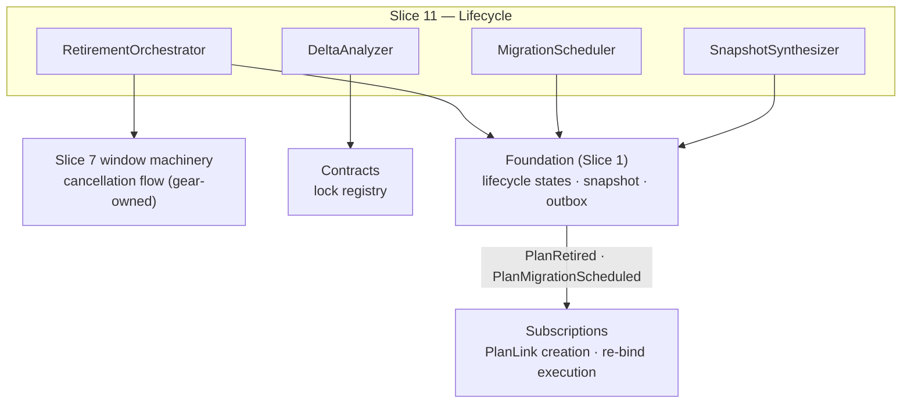

<!-- CONFLUENCE_TITLE: [BSS]: Pricing — Lifecycle: Retirement & Migration (Design, Slice 11) -->
<!-- Related: ../PRD.md, ../DESIGN.md, ./01-foundation.md | Owners: BSS Product Catalog team -->

# DESIGN — Lifecycle: Retirement & Migration (Slice 11)

<!-- toc -->

- [1. Context](#1-context)
  - [1.1 Overview](#11-overview)
  - [1.2 Purpose](#12-purpose)
  - [1.3 Actors](#13-actors)
  - [1.4 References](#14-references)
  - [1.5 Scope](#15-scope)
  - [1.6 Constraints & Assumptions](#16-constraints--assumptions)
  - [1.7 Naming & Design-Introduced Names](#17-naming--design-introduced-names)
  - [1.8 Context & Dependencies](#18-context--dependencies)
- [2. Actor Flows (CDSL)](#2-actor-flows-cdsl)
  - [Retire a Plan](#retire-a-plan)
  - [Schedule a Migration](#schedule-a-migration)
- [3. Processes / Business Logic (CDSL)](#3-processes--business-logic-cdsl)
  - [Retirement](#retirement)
  - [Scheduled Migration](#scheduled-migration)
  - [Migration Safety Deltas](#migration-safety-deltas)
  - [Legacy Snapshot Synthesis](#legacy-snapshot-synthesis)
  - [Contract-Lock Protection](#contract-lock-protection)
- [4. States (CDSL)](#4-states-cdsl)
  - [Migration Schedule State Machine](#migration-schedule-state-machine)
- [5. API Surface](#5-api-surface)
- [6. Data Model](#6-data-model)
- [7. Events & Alarms](#7-events--alarms)
- [8. Definitions of Done](#8-definitions-of-done)
  - [Retirement DoD](#retirement-dod)
  - [Migration DoD](#migration-dod)
  - [Snapshot Synthesis DoD](#snapshot-synthesis-dod)
  - [Contract Lock DoD](#contract-lock-dod)
- [9. Acceptance Criteria](#9-acceptance-criteria)
- [10. Non-Functional Considerations](#10-non-functional-considerations)

<!-- /toc -->

## 1. Context

### 1.1 Overview

This slice owns the **end of a plan's life**: **retirement** (block new subscriptions,
preserve in-flight snapshots, trigger the Slice 7-owned window-cancellation flow for
not-yet-active windows — never merely marking them invalid), **scheduled migration** to a
published target (`PlanMigrationScheduled` → Subscriptions creates effective-dated
`PlanLink`s; idempotent retry; cancellable before the effective date), **migration safety
deltas** (contract-locked exclusion, entitlement/add-on blocking deltas), and **legacy
snapshot synthesis** (`migrated-origin` — freezing a `pricingSnapshotRef` for subscriptions
that never had one). Posted invoices are never mutated; every path is snapshot/`PlanLink`
only.

**Traces to**: `cpt-cf-bss-pricing-fr-plan-retirement`,
`cpt-cf-bss-pricing-fr-scheduled-migration`, `cpt-cf-bss-pricing-fr-migration-safety`,
`cpt-cf-bss-pricing-fr-contract-locked-protection`

### 1.2 Purpose

Let operators sunset and consolidate plans — the PRD's lifecycle-safety goal — with three
hard guarantees: an in-flight subscriber's economics never silently change (frozen snapshot
or explicit migration), a posted invoice is never touched, and a contract lock is never
broken. Industry-standard grandfathering/notice policies compose from this slice + Slice 7's
cutover, without SKU cloning.

### 1.3 Actors

| Actor | Role in Slice |
|-------|---------------|
| `cpt-cf-bss-pricing-actor-catalog-admin` | Orchestrates retirement + migration (`plan × retire` / `plan × migrate`) |
| `cpt-cf-bss-pricing-actor-finance-manager` | Confirms cancelled-window warnings; picks targets |
| `cpt-cf-bss-pricing-actor-subscriptions` | Consumes `PlanMigrationScheduled`; creates `PlanLink`s; executes re-binds |
| `cpt-cf-bss-pricing-actor-contracts` | Supplies contract locks (excluded set) |
| `cpt-cf-bss-pricing-actor-billing` | Never re-queried for posted periods (immutability boundary) |

### 1.4 References

- **PRD**: [PRD.md](../PRD.md) — §6.8, §17.5 (change mechanisms), §15 (migration notice-period open item)
- **Design**: [01-foundation.md](./01-foundation.md) — versioning/immutability (§4.3); [07-pricewindow-linkage.md](./07-pricewindow-linkage.md) — grandfathering, window mechanics; [05-governance.md](./05-governance.md) — `plan × retire/migrate` authz, `historical_import` grant
- **Dependencies**: Slices 1–7 (published plans, windows, grandfathering, governance). Retirement invokes Slice 7's window-cancellation flow (windows are gear-owned per D-03).

### 1.5 Scope

**In scope**: retirement (state transition + window-cancellation trigger + operator warning);
migration scheduling/cancellation + idempotent retry semantics; blocking-delta computation
(contract locks, entitlement overflow, add-on validity); `migrated-origin` snapshot synthesis
with provenance.

**Out of scope**: `PlanLink` **execution** and subscription state (Subscriptions); the window
cancellation **mechanics** (Slice 7 owns the window machinery — we invoke); posted-invoice anything
(Billing); the grandfathering cutover itself (Slice 7 — a migration alternative);
customer-notice lead-time policy (open business item — the schedule carries the effective
date, policy sets it).

### 1.6 Constraints & Assumptions

Inherits Foundation C-set. Slice-11-specific:

| # | Topic | Assumption (default) | Source |
|---|-------|----------------------|--------|
| M1 | No invoice mutation | 100% of migrations use snapshot/`PlanLink` paths; nothing re-opens a posted period | PRD §1.3 |
| M2 | Idempotent schedule | Re-triggering a migration produces no duplicate `PlanLink` requests for already-processed subscriptions (dedup key = `(migration_id, subscription)`) | PRD §6.8 |
| M3 | Cancellation boundary | Cancel-before-effective invalidates the scheduled event without touching already-migrated subscriptions | PRD §6.8 |
| M4 | Synthesis instant | Legacy synthesis freezes the published state **as of the trigger instant (UTC), frozen at execution**; provenance recorded (`migrated-origin`) | PRD §6.8 |
| M5 | Notice period | Configurable lead time (default 60–90 days) is an open Finance/GTM item; the design takes the effective date as input | PRD §15 |

### 1.7 Naming & Design-Introduced Names

| Name | Meaning |
|------|---------|
| `RetirementOrchestrator` | The retire transition + Slice 7 window-cancellation trigger + operator warning surface |
| `MigrationScheduler` | Creates/cancels migration schedules; emits `PlanMigrationScheduled`; owns M2 idempotency |
| `DeltaAnalyzer` | Computes blocking deltas: contract-locked set, entitlement overflow, add-on validity |
| `SnapshotSynthesizer` | Builds + freezes a `migrated-origin` `pricingSnapshotRef` with provenance |

### 1.8 Context & Dependencies

## 2. Actor Flows (CDSL)

### Retire a Plan

- [ ] `p1` - **ID**: `cpt-cf-bss-pricing-flow-plan-retire`

**Actor**: `cpt-cf-bss-pricing-actor-catalog-admin` (`plan × retire`)

**Success Scenarios**:
- The plan transitions `published → retired`: new subscriptions blocked (sellability gate reads the state), existing snapshots preserved, `PlanRetired` emitted, Slice 7's cancellation flow invoked per not-yet-active window (each emitting `PriceWindowCancelled` + driving cache eviction)
- The operator is warned with the list of windows to be cancelled **before** confirm

**Error Scenarios**:
- Retire with an in-flight migration targeting this plan → `RETIRE_TARGET_OF_MIGRATION` (409)
- Retire while the plan is referenced as a bundle component or as an add-on price-override target → `RETIRE_PLAN_REFERENCED` (409, references enumerated)

**Steps**:
1. [ ] - `p1` - API: POST /v1/pricing/plans/{planId}/retire (dry-run first: returns the cancelled-window preview **and any cutover unit to be unwound**, D-05) - `inst-rt-api`
2. [ ] - `p1` - Confirm: transition the plan state; **invoke** Slice 7's window-cancellation flow for every not-yet-active window (never merely mark invalid) — one local transaction with the state flip (D-03); active windows run to their natural end for in-flight subscribers. A **live cutover unit is unwound** in the same transaction (Slice 7 `inst-co-retirement-unwind`, D-05): predecessor window restored to its pre-cutover `effectiveTo`, scheduled copy/successor cancelled, unit closed as unwound; retirement with a live cutover is **always material** (Slice 5) - `inst-rt-cancel`
3. [ ] - `p1` - Emit `PlanRetired`; the read model flags the plan not-sellable (Slice 7 gate input) - `inst-rt-event`
4. [ ] - `p1` - **RETURN** 202; existing subscription snapshots untouched (M1) - `inst-rt-return`

### Schedule a Migration

- [ ] `p1` - **ID**: `cpt-cf-bss-pricing-flow-migration-schedule`

**Actor**: `cpt-cf-bss-pricing-actor-catalog-admin` (`plan × migrate`)

**Success Scenarios**:
- A migration from a (typically retiring) plan to a **published** target is scheduled with an effective date; `DeltaAnalyzer` reports blocking deltas; `PlanMigrationScheduled` emits for Subscriptions to create effective-dated `PlanLink`s
- Retry is idempotent (M2); cancel-before-effective invalidates cleanly (M3)

**Error Scenarios**:
- Unpublished/retired target → `MIGRATION_TARGET_INVALID` (422)
- Unresolved blocking deltas (entitlement overflow, invalid add-ons) → `MIGRATION_BLOCKED` (422, deltas enumerated)

**Steps**:
1. [ ] - `p1` - API: POST /v1/pricing/migrations (**client-supplied `migration_id`**, source plan/revision, target `planId`, effective date, scope) — the create is idempotent on `migration_id` (mirroring Slice 12's `run_id` pattern): a timed-out client retry returns the original schedule, never a second one - `inst-ms-api`
2. [ ] - `p1` - `DeltaAnalyzer` computes: contract-locked subscriptions (reported, **excluded**, lock never broken), entitlement deltas, add-on deltas (invalid / missing-required) — blocking deltas must be resolved or explicitly scoped out - `inst-ms-deltas`
3. [ ] - `p1` - Emit `PlanMigrationScheduled` (idempotency key = `migration_id`; consumer dedup per `(migration_id, subscription)`, M2) - `inst-ms-emit`
4. [ ] - `p1` - Legacy subscriptions without a `pricingSnapshotRef` route through `SnapshotSynthesizer` (below) before their `PlanLink` is requested - `inst-ms-synth`
5. [ ] - `p1` - **RETURN** 202 (schedule ref); DELETE /v1/pricing/migrations/{id} before the effective date cancels (M3) - `inst-ms-return`

## 3. Processes / Business Logic (CDSL)

### Retirement

- [ ] `p1` - **ID**: `cpt-cf-bss-pricing-algo-retirement`

**Steps**:
1. [ ] - `p1` - `published → retired` blocks **new** subscriptions only; in-flight subscribers keep resolving their frozen snapshots and active windows until renewal/migration - `inst-re-block`
2. [ ] - `p1` - Not-yet-active windows: Slice 7's cancellation flow is **invoked** (each cancellation emits `PriceWindowCancelled` and drives its cache-eviction path) — marking-invalid without the event is forbidden (consumers would keep warm caches) - `inst-re-cancelflow`
3. [ ] - `p1` - The operator confirm screen lists every window to be cancelled (dry-run) - `inst-re-warn`
4. [ ] - `p1` - Retirement is a governed mutation (Slice 5): `plan × retire`, audited; retirement of a plan with active subscribers SHOULD pair with a migration schedule or an explicit grandfathering decision - `inst-re-governed`
5. [ ] - `p1` - **Referential guard:** retirement is rejected while the plan is referenced as a **bundle component** (`sum_of_parts`/`own_price` composition, Slice 8) or as an **add-on price-override target** (Slice 2) — the dry-run enumerates the referencing bundles/plans; remediation (re-compose or retire the referrer first) precedes the retire. Plans listing the retiree in `allowedChangeTargets` are enumerated as a **warning** (not a block, D-24): the edge goes inert — Subscriptions re-checks the target's lifecycle state at change time. `PriceOverlays` targeting the retiree are likewise enumerated as a **warning** (D-31): they go dangling-and-flagged (`pricing.priceoverlay.target_retired`), staying evaluable for in-flight subscribers - `inst-re-references`

### Scheduled Migration

- [ ] `p1` - **ID**: `cpt-cf-bss-pricing-algo-migration`

**Steps**:
1. [ ] - `p1` - Target MUST be a **published** plan; the schedule carries source revision, target, effective date (M5 sets policy on the date), and scope (all / filtered subscriptions) - `inst-mg-target`
2. [ ] - `p1` - The catalog emits the schedule; **Subscriptions** creates effective-dated `PlanLink`s and executes — the catalog never mutates a subscription and never touches a posted invoice (M1). A migration **never re-charges** the target plan's `one_time_setup` row (setup is once-per-subscription-lifetime — Slice 2 `inst-cs-setup-timing`), and a migrated subscription enters the target's **first non-trial phase** (D-39 — a migration never grants a new `trial`; entering an `intro` phase is allowed; the entry-phase rule rides the `PlanMigrationScheduled` contract) - `inst-mg-boundary`
3. [ ] - `p1` - **Idempotency (M2):** re-triggering the same `migration_id` re-emits without duplicating `PlanLink` requests for already-processed subscriptions (the event carries the dedup contract; Subscriptions honors `(migration_id, subscription)`) - `inst-mg-idem`
4. [ ] - `p1` - **Cancellation (M3, D-38):** the schedule invalidates via read-model state + audit (no new event name, per §7); already-migrated subscriptions are unaffected. **Propagation is a state handshake, not a wall clock**: Subscriptions MUST re-read the schedule state immediately **before beginning execution** and per processing batch thereafter — it never starts (or continues) against a cancelled record, closing the T-ε race; the catalog accepts a cancel in `scheduled`/`in_progress` and rejects only `completed` (`MIGRATION_COMPLETED`) - `inst-mg-cancel`

### Migration Safety Deltas

- [ ] `p2` - **ID**: `cpt-cf-bss-pricing-algo-migration-deltas`

**Steps**:
1. [ ] - `p2` - **Contract-locked** subscriptions: reported and **excluded** — the lock is never broken (Contracts supplies the lock set) - `inst-md-locks`
2. [ ] - `p2` - **Entitlement deltas**: target grants < source grants (overflow risk) surface as **blocking** deltas; the operator resolves (change target / scope out / accept via explicit override where policy allows) - `inst-md-entitlements`
3. [ ] - `p2` - **Add-on deltas**: subscribers whose add-ons become invalid on the target, or who lack a target-required add-on — blocking - `inst-md-addons`
3a. [ ] - `p1` - **Boundary deltas (K3 enforcement):** for every in-scope subscription, the target MUST cover the subscription's **frozen `(currency, region)` pair** with a published row of **matching frequency** — a mismatch is a **blocking** delta (cross-currency/region/frequency moves are cancel + new, never an in-place `PlanLink`). Additionally, subscribers bound to an `existing_grandfathered` row are surfaced **informationally** (migration takes them off legacy pricing — the operator sees the price impact before confirm) - `inst-md-boundary`
4. [ ] - `p2` - Deltas compute against the **published read model** of both plans (no draft reads) - `inst-md-published`

### Legacy Snapshot Synthesis

- [ ] `p2` - **ID**: `cpt-cf-bss-pricing-algo-snapshot-synthesis`

**Steps**:
1. [ ] - `p2` - For a subscription with **no** `pricingSnapshotRef`: synthesize one from the published plan state **as of the trigger instant (UTC), frozen at execution** (M4) - `inst-sy-freeze`
2. [ ] - `p2` - Provenance record: source `planId`/revision, resolved price ids, snapshot instant, trigger (`migration` | `first-rating`), acting principal — marked **`migrated-origin`** - `inst-sy-provenance`
3. [ ] - `p2` - Synthesis is the sanctioned **consumer** of the Slice 5 backdating path where historical reference rows are needed (`historical_import × write` + reason + audit + row-shape pipeline + always-material approval — D-13; zero downstream billable effect) - `inst-sy-backdate`
4. [ ] - `p1` - **`first-rating` trigger is never inline:** when Rating meets a subscription with no snapshot, the rating line **fails closed into the rating exception path**; synthesis then runs as a separate audited step (automated remediation job or operator), and rating **retries** against the frozen result. Synthesis never executes inline on the rating hot path (it is heavyweight, audited, and grant-gated) - `inst-sy-firstrating`

### Contract-Lock Protection

- [ ] `p1` - **ID**: `cpt-cf-bss-pricing-algo-contract-lock`

**Steps**:
1. [ ] - `p1` - While an active contract references a plan revision, **structural mutation is rejected** (`CONTRACT_LOCKED`, 409) directing the operator to a new revision or contract expiry - `inst-cl-reject`
2. [ ] - `p1` - Contract-locked subscriptions are excluded from every scheduled migration (per `inst-md-locks`) - `inst-cl-exclude`
3. [ ] - `p1` - The lock set resolves from Contracts at validation time **and is re-resolved at execution start** (D-36 — schedule-time state can be months stale; `inst-mst-start`); an integration boundary — a lock-registry outage fails the mutation closed - `inst-cl-source`

## 4. States (CDSL)

### Migration Schedule State Machine

- [ ] `p1` - **ID**: `cpt-cf-bss-pricing-state-migration`

**States**: scheduled, in_progress, completed, cancelled
**Initial State**: scheduled (deltas resolved, event emitted)

**Transitions**:
1. [ ] - `p1` - **FROM** scheduled **TO** in_progress **WHEN** the effective date passes and Subscriptions begins `PlanLink` execution. **Execution-time re-validation (D-36):** on this transition the catalog **re-resolves** the contract-lock set and the boundary deltas against fresh state — newly-locked subscriptions are **excluded** (appended to the completion record; a lock is never broken however stale the schedule), and a newly-broken boundary (the target lost its frozen `(currency, region)`/frequency coverage) fails that subscription's `PlanLink` **closed** into the migration exception list - `inst-mst-start`
2. [ ] - `p1` - **FROM** scheduled **TO** cancelled **WHEN** cancelled before the effective date (M3; nothing executed yet) - `inst-mst-cancel`
2a. [ ] - `p1` - **FROM** in_progress **TO** cancelled **WHEN** the operator stops a partially-executed run (D-34 — the stop-the-bleeding control): **further** `PlanLink` processing halts; already-migrated subscriptions are unaffected; the partial (migrated / not-attempted) sets are listed on the record. Only a **completed** run is uncancellable - `inst-mst-cancel-inflight`
3. [ ] - `p1` - **FROM** in_progress **TO** completed **WHEN** Subscriptions reports the scope processed (excluded contract-locked set listed on the completion record) - `inst-mst-complete`

## 5. API Surface

| Method | Path | Purpose | Idempotency | AuthZ |
|--------|------|---------|-------------|-------|
| `POST` | `/v1/pricing/plans/{planId}/retire` | Dry-run + confirm retirement | per revision | `plan × retire` |
| `POST` | `/v1/pricing/migrations` | Schedule a migration (deltas computed) | `migration_id` (M2) | `plan × migrate` |
| `DELETE` | `/v1/pricing/migrations/{id}` | Cancel a `scheduled` or `in_progress` migration (D-34; a `completed` one is uncancellable) | — | `plan × migrate` |
| `GET` | `/v1/pricing/migrations/{id}` | Schedule + delta report + progress | — | `plan × read` |

**Problem responses (RFC 9457):** `RETIRE_TARGET_OF_MIGRATION` (409),
`RETIRE_PLAN_REFERENCED` (409, references enumerated — bundle component / add-on
price-override target), `MIGRATION_TARGET_INVALID` (422), `MIGRATION_BLOCKED` (422, deltas
enumerated), `MIGRATION_COMPLETED` (409 — cancel of a completed run; replaces the pre-D-34 `MIGRATION_ALREADY_EFFECTIVE`), `CONTRACT_LOCKED` (409).

## 6. Data Model

Slice-owned tables (`pricing_` prefix per Foundation §3.7):

**`pricing_migration`** (PK `migration_id`):

| Column | Type | Notes |
|--------|------|-------|
| `source_plan_id` / `source_revision` | `uuid`/`int` | the retiring side |
| `target_plan_id` | `uuid` | MUST be published |
| `effective_at` | `timestamptz` | UTC; M5 policy feeds it |
| `scope` | `jsonb` | all / filter; excluded contract-locked set recorded |
| `state` | `enum` | `scheduled \| in_progress \| completed \| cancelled` |
| `delta_report` | `jsonb` | contract-locked / entitlement / add-on deltas at schedule time |

**`pricing_snapshot_provenance`** (PK `provenance_id`) — the `migrated-origin` record:
`subscription_ref`, `source_plan_id`/`revision`, resolved price ids, `snapshot_instant`
(UTC), `trigger` (`migration | first-rating`), `acting_principal`.

Retirement itself is the Foundation `pricing_plan.lifecycle_state` transition + audit;
window cancellations run in Slice 7's gear-owned window store (`pricing_price_window`).

## 7. Events & Alarms

Frozen names: **`PlanRetired`**, **`PlanMigrationScheduled`** (both in the Foundation event
set; the migration-cancelled signal rides the schedule's read-model state + audit, not a new
event name). Alarms: `pricing.migration.stalled` (Warn — `in_progress` past an expected
completion horizon), `pricing.migration.blocked_total` (Info counter — schedule attempts
rejected with `MIGRATION_BLOCKED`; unresolved blocking deltas never persist a schedule, so
this counts rejections, not waiting schedules).

## 8. Definitions of Done

### Retirement DoD

- [ ] `p1` - **ID**: `cpt-cf-bss-pricing-dod-retirement`

Retirement **MUST** block new subscriptions, preserve existing snapshots, emit `PlanRetired`,
and trigger Slice 7's gear-owned window-cancellation flow per not-yet-active window (one local transaction, D-03; with `PriceWindowCancelled` +
cache eviction; never mark-invalid), warning the operator with the cancellation list before
confirm.

**Implements**: `cpt-cf-bss-pricing-flow-plan-retire`, `cpt-cf-bss-pricing-algo-retirement`

**Touches**:
- API: `POST /v1/pricing/plans/{planId}/retire`
- DB: `pricing_plan.lifecycle_state`, `pricing_price_window`
- Entities: `RetirementOrchestrator`

### Migration DoD

- [ ] `p1` - **ID**: `cpt-cf-bss-pricing-dod-migration`

Scheduled migration **MUST** target a published plan, emit `PlanMigrationScheduled` for
`PlanLink` creation without posted-invoice mutation, retry idempotently (no duplicate
`PlanLink` requests), and cancel-before-effective without affecting already-migrated
subscriptions.

**Implements**: `cpt-cf-bss-pricing-flow-migration-schedule`, `cpt-cf-bss-pricing-algo-migration`, `cpt-cf-bss-pricing-state-migration`

**Touches**:
- API: `POST/DELETE /v1/pricing/migrations*`
- DB: `pricing_migration`
- Entities: `MigrationScheduler`

### Snapshot Synthesis DoD

- [ ] `p2` - **ID**: `cpt-cf-bss-pricing-dod-snapshot-synthesis`

For a legacy subscription without a snapshot, the system **MUST** synthesize and freeze a
`migrated-origin` `pricingSnapshotRef` from published state as of the trigger instant (UTC,
frozen at execution) with the full provenance record; rating a legacy subscription **before**
synthesis completes fails closed into the exception path and retries against the frozen
result (the first-rating trigger, `inst-sy-firstrating`).

**Implements**: `cpt-cf-bss-pricing-algo-snapshot-synthesis`

**Touches**:
- DB: `pricing_snapshot_provenance`
- Entities: `SnapshotSynthesizer`

### Contract Lock DoD

- [ ] `p1` - **ID**: `cpt-cf-bss-pricing-dod-contract-lock`

Structural mutation of a contract-referenced plan revision **MUST** be rejected (new revision
or contract expiry directed); contract-locked subscriptions **MUST** be excluded from every
scheduled migration (reported, never broken); a lock-registry outage fails closed. The delta
report **MUST** classify locked, entitlement, add-on, **and boundary** deltas (a target
missing the frozen `(currency, region)` or frequency row is a **blocking** delta,
`inst-md-boundary`).

**Implements**: `cpt-cf-bss-pricing-algo-contract-lock`, `cpt-cf-bss-pricing-algo-migration-deltas`

**Touches**:
- DB: `pricing_migration.delta_report`
- Entities: `DeltaAnalyzer`

## 9. Acceptance Criteria

Unit:

- [ ] Retire blocks new-subscription sellability but leaves existing snapshot resolution; migration target matrix (draft/retired target rejected); delta classification (locked/entitlement/add-on/boundary — a target missing the frozen `(currency, region)`/frequency row is blocking); cancel-after-effective rejected; synthesis provenance completeness

Integration (testcontainers):

- [ ] Retirement cancels only not-yet-active windows (active ones run out), emits `PlanRetired`, and the operator dry-run lists exactly the cancelled set
- [ ] Retiring a plan with an approved-not-yet-effective cutover unwinds it atomically: the predecessor window's `effectiveTo` is restored, copy/successor windows cancelled, the unit closed as unwound — no instant is left uncovered for in-flight subscribers; the retirement required two-person approval (always material)
- [ ] A migration re-trigger with the same `migration_id` produces no duplicate `PlanLink` requests (consumer-side dedup contract honored)
- [ ] Cancel before effective invalidates; cancelling an `in_progress` run halts further processing with the partial sets listed (already-migrated unaffected); cancel of a `completed` run → 409 (D-34)
- [ ] At execution start the lock set + boundary deltas re-resolve: a subscription locked after scheduling is excluded (appended to the record); a target that lost coverage fails that subscription's `PlanLink` closed into the exception list (D-36)
- [ ] A migrated subscription enters the target's first non-trial phase — a target with a `trial` phase never grants a new trial (D-39)
- [ ] A legacy subscription gets a `migrated-origin` snapshot with provenance; a second synthesis attempt is idempotent (same frozen ref)
- [ ] Rating a snapshot-less legacy subscription fails closed into the exception path; after synthesis the retry succeeds against the frozen ref
- [ ] Structural mutation of a contract-locked revision → 409; the same plan mutates fine after lock expiry

## 10. Non-Functional Considerations

- **Performance**: delta analysis is a batch computation at schedule time (not order-time); migration fan-out throughput is bounded by the event pipeline, with progress visible via the schedule state.
- **Observability**: `pricing_migrations{state}` gauge, `pricing_migration_excluded_locked_total`, `pricing_retirements_total`, stalled-migration alarm.
- **Security & AuthZ**: `plan × retire` / `plan × migrate` (Slice 5 catalog); retirement and migration are audited governed mutations; synthesis exercises the `historical_import` grant where backdated reference rows are needed.
- **Risks & open items**: minimum customer-notice lead time for enforced migration is an open Finance/GTM item (M5 — configurable, default 60–90 days); Subscriptions' `PlanLink` dedup contract must land jointly (the event carries the key; enforcement is theirs); upstream SKU retirement joint contract (registry) affects retiring plans whose SKU disappears first.
