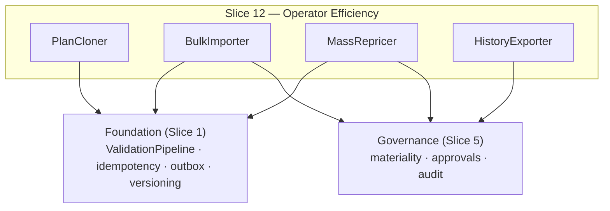

<!-- CONFLUENCE_TITLE: [BSS]: Pricing — Operator Efficiency (Design, Slice 12) -->
<!-- Related: ../PRD.md, ../DESIGN.md, ./01-foundation.md | Owners: BSS Product Catalog team -->

# DESIGN — Operator Efficiency (Slice 12)

<!-- toc -->

- [1. Context](#1-context)
  - [1.1 Overview](#11-overview)
  - [1.2 Purpose](#12-purpose)
  - [1.3 Actors](#13-actors)
  - [1.4 References](#14-references)
  - [1.5 Scope](#15-scope)
  - [1.6 Constraints & Assumptions](#16-constraints--assumptions)
  - [1.7 Naming & Design-Introduced Names](#17-naming--design-introduced-names)
  - [1.8 Context & Dependencies](#18-context--dependencies)
- [2. Actor Flows (CDSL)](#2-actor-flows-cdsl)
  - [Bulk Price Import](#bulk-price-import)
  - [Mass Repricing Run](#mass-repricing-run)
- [3. Processes / Business Logic (CDSL)](#3-processes--business-logic-cdsl)
  - [Plan Clone](#plan-clone)
  - [Bulk Import (validate-all, commit-per-row)](#bulk-import-validate-all-commit-per-row)
  - [Mass Repricing](#mass-repricing)
  - [Price History and Export](#price-history-and-export)
- [4. States (CDSL)](#4-states-cdsl)
  - [Bulk Operation State Machine](#bulk-operation-state-machine)
- [5. API Surface](#5-api-surface)
- [6. Data Model](#6-data-model)
- [7. Events & Alarms](#7-events--alarms)
- [8. Definitions of Done](#8-definitions-of-done)
  - [Clone DoD](#clone-dod)
  - [Bulk Import DoD](#bulk-import-dod)
  - [Mass Repricing DoD](#mass-repricing-dod)
  - [History & Export DoD](#history--export-dod)
- [9. Acceptance Criteria](#9-acceptance-criteria)
- [10. Non-Functional Considerations](#10-non-functional-considerations)

<!-- /toc -->

## 1. Context

### 1.1 Overview

This slice owns the **operator-scale surfaces** over everything Slices 1–11 authored:
**plan clone** (new ids, eligibility/lock state deliberately not copied), **bulk price
import** (all-or-nothing **validation**, optimistic **per-row commit** with a conflict
report), **mass repricing** (idempotent, re-run-safe, deduplicated events, coalesced
`CatalogVersion`s, throughput SLO), and **price history + export** for Auditor/Finance.
No new authority: every bulk path enforces the same `plan × write/publish` authz, the same
validation pipeline, and the same materiality/approval policy as single-row authoring —
bulk is authoring at scale, not a bypass.

**Traces to**: `cpt-cf-bss-pricing-fr-plan-clone`, `cpt-cf-bss-pricing-fr-bulk-price-import`,
`cpt-cf-bss-pricing-fr-mass-repricing`, `cpt-cf-bss-pricing-fr-mutation-idempotency`,
`cpt-cf-bss-pricing-fr-price-history-export`

### 1.2 Purpose

Hit the PRD's ≥ 90% self-service goal for standard plan operations: annual repricing over
thousands of rows must be one safe, retryable operation that cannot silently overwrite a
concurrent manual edit, cannot flood consumers with duplicate events, and leaves the same
immutable per-row history a single edit would.

### 1.3 Actors

| Actor | Role in Slice |
|-------|---------------|
| `cpt-cf-bss-pricing-actor-finance-manager` | Runs clones, imports, repricing (`plan × write/publish`) |
| `cpt-cf-bss-pricing-actor-auditor` | Reads/exports price history (`plan × read`, shared with Finance — D-12) and the audit trail (`audit × read/export`, Auditor-only) |
| `cpt-cf-bss-pricing-actor-finance-reviewer` | Approves material bulk changes (one approval per batch where policy allows) |
| `cpt-cf-bss-pricing-actor-catalog-registry` | Coalesces batched publishes into few `CatalogVersion`s |

### 1.4 References

- **PRD**: [PRD.md](../PRD.md) — §6.11, §7.1 (throughput/idempotency NFRs), §14 (provisional values)
- **Design**: [01-foundation.md](./01-foundation.md) — idempotency/ETag, outbox; [05-governance.md](./05-governance.md) — materiality on bulk, authz catalog; [10-advanced-primitives.md](./10-advanced-primitives.md) — clone's `discountRef` rule
- **Dependencies**: all prior slices (bulk operates over the full authored surface).

### 1.5 Scope

**In scope**: clone semantics (what copies, what resets); the two-phase bulk import
(validate-all → per-row optimistic commit + conflict report); mass-repricing idempotency +
event dedup + version coalescing + throughput SLO; history read/export SLO; the bulk
optimistic lock that interactive edits collide with (Foundation `fr-concurrent-edit`
counterpart).

**Out of scope**: the operator UI (wizard/tier editor/migration UI — frontend DESIGN);
approval mechanics (Slice 5 — bulk routes through the same policy); export **format**
details beyond the SLO (implementation).

### 1.6 Constraints & Assumptions

Inherits Foundation C-set. Slice-12-specific:

| # | Topic | Assumption (default) | Source |
|---|-------|----------------------|--------|
| O1 | Clone resets | `priceEligibility`/`grandfatherUntil` reset to defaults; contract locks never copy; `discountRef` copies only if it still resolves (else dropped + operator notice); `clonedFrom` recorded | PRD §6.11 |
| O2 | Import phases | Pre-commit validation is **all-or-nothing** (any invalid row blocks the batch with a per-row report); commit is **per-row** optimistic — an ETag conflict fails only that row (committed rows stand; conflicted rows listed for retry); never silent overwrite | PRD §6.11 |
| O3 | Repricing SLO | Idempotent re-run after partial failure; deduplicated events; provisional ≥ 50 rows/sec back-calculated from the tenant worst case vs the maintenance window — **ratify before Design lock** | PRD §6.11/§14 |
| O4 | Idempotency TTL | Client-key replay returns the original result within a documented TTL (value provisional); replay during an active bulk lock returns the original completed result regardless of lock state | PRD §6.11 |
| O5 | Version coalescing | A mass run MAY coalesce into one or few `CatalogVersion`s (registry batching, Foundation §4.2 step 5) | PRD §6.11 |

### 1.7 Naming & Design-Introduced Names

| Name | Meaning |
|------|---------|
| `PlanCloner` | Deep-copies a plan into `draft` with new ids under the O1 reset rules |
| `BulkImporter` | The two-phase import: batch validation → per-row optimistic commit + conflict report; holds the bulk optimistic lock |
| `MassRepricer` | The idempotent bulk adjustment run (row-level progress journal; event dedup; version coalescing) |
| `HistoryExporter` | Chronological immutable history read + export under Auditor/Finance filters |

### 1.8 Context & Dependencies

## 2. Actor Flows (CDSL)

### Bulk Price Import

- [ ] `p2` - **ID**: `cpt-cf-bss-pricing-flow-bulk-import`

**Actor**: `cpt-cf-bss-pricing-actor-finance-manager` (`plan × write`)

**Success Scenarios**:
- Phase 1 validates every row against the full pipeline; any invalid row blocks the batch with a per-row report; Phase 2 takes optimistic per-row locks and commits row-by-row; conflicted rows (stale ETag / concurrent manual edit) fail individually and are listed for retry — committed rows stand

**Error Scenarios**:
- Any Phase-1 failure → `BULK_VALIDATION_FAILED` (422, per-row report; nothing committed)
- An interactive edit hitting a row under the bulk lock → conflict naming the bulk operation (Foundation `fr-concurrent-edit`)

**Steps**:
1. [ ] - `p2` - API: POST /v1/pricing/bulk-imports (rows + client idempotency key) - `inst-bi-api`
2. [ ] - `p2` - Phase 1: all-or-nothing validation (O2); the report enumerates every violation per row - `inst-bi-validate`
3. [ ] - `p2` - A **material** batch routes through the Slice 5 policy **before any commit** — one batch approval pinning per-row content hashes (`inst-bk-approval-subset`); non-material batches proceed directly - `inst-bi-governed`
4. [ ] - `p2` - Phase 2 (post-approval): per-row optimistic commit under the bulk lock; ETag conflict fails only that row; result = `{committed[], conflicted[]}`; events emit per committed row (outbox) - `inst-bi-commit`
5. [ ] - `p2` - **RETURN** 202 (operation ref); the full per-row report is served by `GET /v1/pricing/bulk-imports/{id}`, and an idempotent replay (O4) returns the same operation ref/report; retry of the conflicted subset is a new import referencing fresh ETags - `inst-bi-return`

### Mass Repricing Run

- [ ] `p2` - **ID**: `cpt-cf-bss-pricing-flow-mass-repricing`

**Actor**: `cpt-cf-bss-pricing-actor-finance-manager` (`plan × write` at POST; `plan × publish` enforced at the run's publish step)

**Success Scenarios**:
- An adjustment over N rows (e.g. +5% on a currency segment) runs idempotently: a re-trigger after partial failure resumes from the progress journal without re-applying, events deduplicate, versions coalesce (O5), throughput meets the O3 SLO

**Error Scenarios**:
- Re-trigger with the same `run_id` while completed → returns the original result (no double apply)

**Steps**:
1. [ ] - `p2` - API: POST /v1/pricing/repricing-runs (`run_id`, selector, adjustment) - `inst-mr-api`
2. [ ] - `p2` - Expand the selector to a frozen row set; journal per-row progress (`pending → applied | failed`) keyed `(run_id, price_id)` - `inst-mr-journal`
3. [ ] - `p2` - Apply per row through the standard versioning path (new immutable rows); the new row, its outbox record, and the journal transition `pending → applied` commit in **one transaction** (a crash re-run sees a consistent journal — no double-apply, no compounding); re-runs skip `applied` rows (idempotent, O3); a per-row validation failure marks the row `failed` (+ `failure_reason`); events carry `(run_id, price_id)` dedup keys - `inst-mr-apply`
4. [ ] - `p2` - Publishes coalesce into one/few `CatalogVersion` batches (O5); materiality evaluates once per run against the policy (any row over its own-currency threshold trips the run) - `inst-mr-coalesce`
5. [ ] - `p2` - **RETURN** 202 (run ref + progress endpoint) - `inst-mr-return`

## 3. Processes / Business Logic (CDSL)

### Plan Clone

- [ ] `p2` - **ID**: `cpt-cf-bss-pricing-algo-clone`

**Steps**:
1. [ ] - `p2` - Clone creates a new `planId` in `draft` with copied configuration and **new** price ids; phase rows are copied with **new `phase_id`s** and every copied row's `phase` axis is remapped to them (D-19); `clonedFrom` recorded; source subscriptions unaffected - `inst-cl-copy`
2. [ ] - `p2` - **Resets (O1):** `priceEligibility` → `all_subscriptions`, `grandfatherUntil` → null (eligibility must be re-decided); contract locks never copy. **`existing_grandfathered` rows are lifecycle state, not configuration** (the same O1 reasoning as windows/locks) — they are **not cloned**: the `all_subscriptions` successor row carries the going-forward price, and copying both with reset eligibility would collapse two rows onto one canonical scope key (guaranteed duplicate-scope publish failure). Superseded/closed historical rows are likewise not copied - `inst-cl-resets`
3. [ ] - `p2` - `discountRef` copies only if it still resolves to a registered instrument — else dropped with an operator notice (Slice 10 resolver reused) - `inst-cl-discount`
4. [ ] - `p2` - The clone is an ordinary draft: full pipeline + approval on its first publish (always material — first publish, G1) - `inst-cl-draft`
5. [ ] - `p2` - **Windows are not configuration:** `PriceWindow` schedules are Slice 7-owned (gear-owned, D-03) runtime state and are **never cloned** — the clone's billable rows have no coverage until the operator schedules fresh windows, and the Slice 7 coverage check blocks its publish until then (expected, surfaced in the clone response) - `inst-cl-windows`

### Bulk Import (validate-all, commit-per-row)

- [ ] `p2` - **ID**: `cpt-cf-bss-pricing-algo-bulk-import`

**Steps**:
1. [ ] - `p2` - **Phase 1 — validate all-or-nothing:** every row runs the registered pipeline rules; one invalid row blocks the whole batch pre-commit with a per-row violation report (nothing partially validated sneaks through). A row whose canonical scope key holds a **pending interactive approval unit** (supersession/cutover — PRD one-pending-unit rule) fails Phase 1 **per-row**, naming the pending unit (D-35) - `inst-bk-phase1`
2. [ ] - `p2` - **Phase 2 — commit per-row optimistic:** each row commits under its own ETag; a conflict (concurrent manual edit) fails **only that row**; committed rows stand; the report lists conflicted rows for retry — silent overwrite never happens in either direction - `inst-bk-phase2`
3. [ ] - `p2` - The **bulk lock**: rows in an in-flight import are marked; an interactive edit targeting one fails with a conflict **naming the bulk operation** (Foundation `fr-concurrent-edit`) - `inst-bk-lock`
4. [ ] - `p2` - Idempotency (O4): the import's client key replays to the original report, including during/after the lock window - `inst-bk-idem`
5. [ ] - `p2` - **Approval covers the set, commit may shrink it:** the batch approval (Slice 5) pins **per-row content hashes**; Phase 2 conflicts shrink the committed subset — legal, because committed ⊆ approved and nothing outside the pin ever publishes. A retry import of conflicted rows whose content hash is **unchanged** reuses the original approval; any changed row starts a fresh approval cycle. While the batch approval is `submitted`, it **counts as the pending approval unit for every contained scope key** (D-35): an interactive supersession/cutover submit on one of those keys returns 409 (`PENDING_CHANGE_UNIT_EXISTS`, naming the bulk operation) — symmetric with Phase 1's per-row check - `inst-bk-approval-subset`

### Mass Repricing

- [ ] `p2` - **ID**: `cpt-cf-bss-pricing-algo-mass-repricing`

**Steps**:
1. [ ] - `p2` - The run journal `(run_id, price_id, state)` is the idempotency spine: re-runs after partial failure resume, never re-apply (O3) - `inst-mp-journal`
1b. [ ] - `p1` - **Pending-unit conflicts (D-35):** a selector row whose scope key holds a pending interactive unit fails **per-row** (journal `failed`, names the unit); the run's batch approval pins its keys exactly like bulk import - `inst-mp-pending`
1a. [ ] - `p1` - **Grandfathered rows are excluded:** repricing selectors structurally exclude `existing_grandfathered` rows — they are immutable in price (Foundation §4.3); an explicit attempt to include one fails that row with a per-row validation error, never a silent skip and never a reprice - `inst-mp-grandfathered`
2. [ ] - `p2` - Every applied row is a **standard** versioned change (new immutable row via the Foundation path — bulk never mutates in place); events carry dedup keys so consumers de-duplicate on redelivery + re-run - `inst-mp-standard`
3. [ ] - `p2` - Version coalescing (O5): the run requests batched addressability; `pricingSnapshotRef` pins whatever committed batch the registry emits - `inst-mp-coalesce`
4. [ ] - `p2` - Throughput: provisional ≥ 50 rows/sec, to be back-calculated from the tenant worst-case row count against the agreed maintenance window and **ratified before Design lock** (O3) - `inst-mp-slo`

### Price History and Export

- [ ] `p2` - **ID**: `cpt-cf-bss-pricing-algo-history-export`

**Steps**:
1. [ ] - `p2` - Chronological immutable price-history records (the append-only `pricing_price` rows) with actor and effective dates, under `plan × read` (D-12 — history is plan/price data, Finance-readable by construction; the separate Slice-5 audit trail stays `audit × read`, Auditor-only) - `inst-he-read`
2. [ ] - `p2` - Export (`plan × read`, D-12) within p95 ≤ 5s per 100 records - `inst-he-export`
3. [ ] - `p2` - History is a **read** over existing append-only structures — this slice adds no new history store (the Foundation's immutability IS the history) - `inst-he-nostore`

## 4. States (CDSL)

### Bulk Operation State Machine

- [ ] `p2` - **ID**: `cpt-cf-bss-pricing-state-bulk-operation`

**States**: validating, validation_failed, committing, completed, completed_with_conflicts
**Initial State**: validating (Phase 1)

**Transitions**:
1. [ ] - `p2` - **FROM** validating **TO** validation_failed **WHEN** any row fails Phase 1 (nothing committed; per-row report) - `inst-bs-fail`
2. [ ] - `p2` - **FROM** validating **TO** awaiting_approval **WHEN** all rows pass and the batch is material (the Slice 5 batch approval pins per-row hashes; rows are **not** locked while awaiting — interactive edits surface later as per-row ETag conflicts, legal since committed ⊆ approved) - `inst-bs-approval`
3. [ ] - `p2` - **FROM** validating **TO** committing **WHEN** all rows pass and the batch is non-material; **FROM** awaiting_approval **TO** committing **WHEN** approved — the bulk lock takes effect on entry to `committing` - `inst-bs-commit`
4. [ ] - `p2` - **FROM** committing **TO** completed / completed_with_conflicts **WHEN** every row committed / some rows ETag-conflicted (listed for retry; lock released either way) - `inst-bs-done`
5. [ ] - `p2` - **FROM** committing **TO** completed_with_conflicts **WHEN** the operator **aborts** a stalled run (D-37): uncommitted rows reported `not-attempted`, lock cleared; crash recovery is lease takeover + journal re-drive, not abort - `inst-bs-abort`

## 5. API Surface

| Method | Path | Purpose | Idempotency | AuthZ |
|--------|------|---------|-------------|-------|
| `POST` | `/v1/pricing/plans/{planId}/clone` | Clone into a new draft plan | client key | `plan × write` |
| `POST` | `/v1/pricing/bulk-imports` | Two-phase bulk price import | client key (O4) | `plan × write` |
| `GET` | `/v1/pricing/bulk-imports/{id}` | Batch report (per-row outcomes) | — | `plan × read` |
| `POST` | `/v1/pricing/repricing-runs` | Idempotent mass adjustment | `run_id` | `plan × write` |
| `GET` | `/v1/pricing/repricing-runs/{id}` | Run progress / result | — | `plan × read` |
| `GET` | `/v1/pricing/history` | Immutable price history (filters) | — | `plan × read` (D-12) |
| `POST` | `/v1/pricing/history/export` | History export (SLO-bound) | client key | `plan × read` (D-12) |

**Problem responses (RFC 9457):** `BULK_VALIDATION_FAILED` (422, per-row),
`BULK_ROW_CONFLICT` (reported per row in the operation report), `RUN_SELECTOR_EMPTY` (422),
`CLONE_SOURCE_NOT_FOUND` (404). Interactive-vs-bulk conflicts surface as the Foundation's
concurrent-edit conflict naming the bulk operation.

## 6. Data Model

Slice-owned tables (`pricing_` prefix per Foundation §3.7):

**`pricing_bulk_operation`** (PK `operation_id`): `kind` (`import | repricing`), `state`,
`client_key` (idempotency, O4), `report` (`jsonb` — per-row outcomes), `submitted_by`,
timestamps.

**`pricing_repricing_journal`** (PK `(run_id, price_id)`): `state`
(`pending | applied | failed`), `failure_reason` (nullable), `applied_price_id` (the new row
created), `applied_at` — the idempotency spine (O3). A run is **complete** when no `pending`
rows remain; `failed` rows are listed on the run report and are retryable only via a
corrected **new** run.

**Bulk lock** — a marker on `pricing_price` rows (`bulk_operation_id` nullable column or a
lock side-table, implementation choice) that the Foundation's concurrent-edit check reads to
name the conflicting operation. **Release path (D-37):** the bulk runner holds a
**coordination lease** (the library named in DESIGN §3.4); on crash, lease takeover
**re-drives** Phase 2 from the journal/report (idempotent); additionally an operator
**abort** (`POST /v1/pricing/bulk-imports/{id}:abort`, `plan × write`) transitions
`committing → completed_with_conflicts` — uncommitted rows reported as `not-attempted`, the
lock cleared. A crashed import can never freeze interactive authoring indefinitely.

Clone writes ordinary `pricing_plan`/`pricing_price` draft rows (+ `cloned_from` on the
plan). History/export reads existing append-only structures — no new store.

## 7. Events & Alarms

No new frozen event names: bulk paths emit the standard `PriceCreated`/`PriceUpdated` per
committed row (dedup keys `(run_id | operation_id, price_id)`) and `PlanPublished` **per
affected plan publish** (coalesced per O5 — never per row).
Alarms: `pricing.bulk.run_stalled` (Warn — a run without progress past a horizon),
`pricing.bulk.conflict_rate_high` (Info — a batch with an unusually high conflicted-row
share, signalling concurrent-editing contention).

## 8. Definitions of Done

### Clone DoD

- [ ] `p2` - **ID**: `cpt-cf-bss-pricing-dod-clone`

Clone **MUST** produce a new draft `planId` with new price ids and `clonedFrom`, resetting
eligibility state (`priceEligibility`/`grandfatherUntil`), never copying contract locks,
`existing_grandfathered` rows, superseded/closed historical rows, or `PriceWindow` schedules
(the clone's publish stays coverage-blocked until fresh windows are scheduled), copying
`discountRef` only when it still resolves (else dropped + notice), and leaving
source subscriptions untouched.

**Implements**: `cpt-cf-bss-pricing-algo-clone`

**Touches**:
- API: `POST /v1/pricing/plans/{planId}/clone`
- DB: `pricing_plan.cloned_from`
- Entities: `PlanCloner`

### Bulk Import DoD

- [ ] `p2` - **ID**: `cpt-cf-bss-pricing-dod-bulk-import`

Bulk import **MUST** validate all-or-nothing pre-commit (per-row report), route a material
batch through the Slice 5 approval **before** commit (per-row hash pin; committed ⊆ approved;
a retry of unchanged conflicted rows reuses the original approval, a changed row starts a
fresh one), commit per-row under optimistic locks (a conflict fails only that row; committed
rows stand; conflicted rows listed), never silently overwrite in either direction, and replay
idempotently to the original report.

**Implements**: `cpt-cf-bss-pricing-flow-bulk-import`, `cpt-cf-bss-pricing-algo-bulk-import`, `cpt-cf-bss-pricing-state-bulk-operation`

**Touches**:
- API: `POST/GET /v1/pricing/bulk-imports*`
- DB: `pricing_bulk_operation`
- Entities: `BulkImporter`

### Mass Repricing DoD

- [ ] `p2` - **ID**: `cpt-cf-bss-pricing-dod-mass-repricing`

A mass adjustment **MUST** be re-run-safe via the per-row journal (no re-apply; row + outbox
+ journal flip commit in one transaction), structurally exclude `existing_grandfathered` rows
(an explicit inclusion fails that row per-row, never a silent skip), emit deduplicated
events, coalesce versions per the registry batching, route materiality once per run, and meet
the (to-be-ratified) throughput SLO.

**Implements**: `cpt-cf-bss-pricing-flow-mass-repricing`, `cpt-cf-bss-pricing-algo-mass-repricing`

**Touches**:
- API: `POST/GET /v1/pricing/repricing-runs*`
- DB: `pricing_repricing_journal`
- Entities: `MassRepricer`

### History & Export DoD

- [ ] `p2` - **ID**: `cpt-cf-bss-pricing-dod-history-export`

The system **MUST** return chronological immutable price history (effective dates + amounts;
actor detail lives in the Auditor-only audit trail) under `plan × read` — serving Finance and
Auditor alike (D-12) — and export within p95 ≤ 5s per 100 records, reading existing
append-only structures only.

**Implements**: `cpt-cf-bss-pricing-algo-history-export`

**Touches**:
- API: `GET /v1/pricing/history`, `POST /v1/pricing/history/export`
- DB: (reads `pricing_price` history + `pricing_audit_log`)
- Entities: `HistoryExporter`

## 9. Acceptance Criteria

Unit:

- [ ] Clone reset matrix (eligibility/grandfather/locks/discountRef-dangling; `existing_grandfathered` and superseded rows not copied); Phase-1 single-bad-row blocks the batch; Phase-2 conflict isolation (row N conflicts, N±1 commit); journal resume skips `applied`; an explicit grandfathered inclusion fails that row per-row; idempotency replay during an active lock returns the original result (O4)

Integration (testcontainers):

- [ ] A 1k-row import with one invalid row commits nothing and reports the row; fixed, it commits with 3 concurrent-edit conflicts isolated and listed
- [ ] An interactive PATCH on a bulk-locked row fails naming the bulk operation
- [ ] A repricing run killed mid-way re-runs to completion without double-applying any row (journal-verified); events deduplicate on the consumer side by `(run_id, price_id)`
- [ ] A material bulk batch blocks in `awaiting_approval` until the batch approval lands; a retry of unchanged conflicted rows publishes without a new approval, a changed row requires one
- [ ] A clone's publish is blocked by window coverage until fresh windows are scheduled
- [ ] History export of 100 records within the SLO; entries carry actor + effective dates

NFR verification:

- [ ] Throughput load test against the ratified O3 value over the tenant worst-case row count

## 10. Non-Functional Considerations

- **Performance**: Phase-1 validation parallelizes per row (shared-nothing rules); Phase-2 commit is row-transactional; the repricing journal adds one indexed write per row. The O3 throughput value and the plan/tier caps are **provisional NFRs — ratify before Design lock** ([`../PRD.md`](../PRD.md) §14).
- **Observability**: `pricing_bulk_rows_total{outcome}`, `pricing_repricing_rows_per_second`, `pricing_bulk_conflicts_total`, run-progress gauges.
- **Security & AuthZ**: bulk carries **no new authority** — `plan × write/publish` + the same materiality/approval policy; price history/export is `plan × read` (D-12), while the audit trail stays `audit × read/export`, Auditor-only (Slice 5 catalog).
- **Risks & open items**: idempotency-key TTL and the throughput SLO are provisional (O3/O4); a mass run's coalesced `CatalogVersion` depends on the registry's batching-delay SLO (open with Registry) — a slow batch delays snapshot pinning for the whole run. **Bulk window operations**: an N-row repricing implies N supersession window open/close operations — since the window consolidation (D-03) these are local writes to the gear-owned `pricing_price_window` store inside the per-row transactions, so their throughput is part of this slice's own O3 sizing (no cross-component contract).
