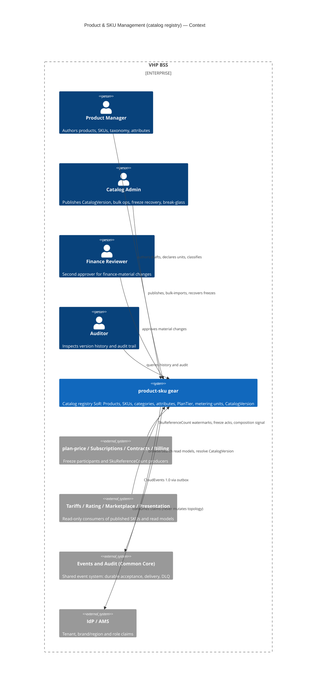
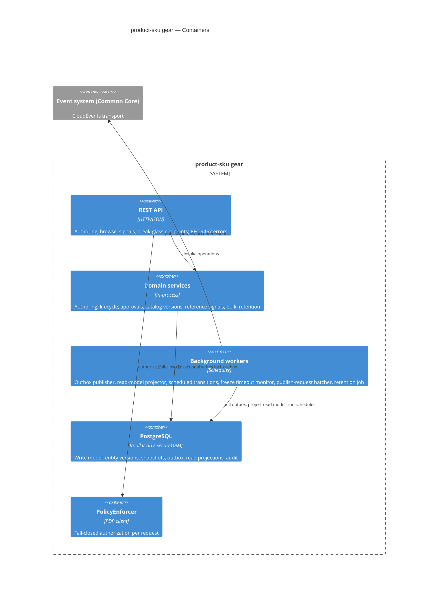
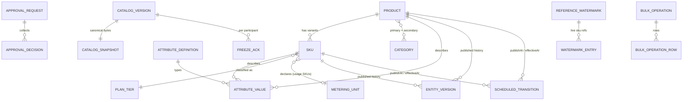

<!-- CONFLUENCE_TITLE: [BSS]: Product & SKU Management — Technical Design -->
<!-- Related: ./PRD.md | Upstream: ./PRD.md | Downstream: STORY-*, registry↔plan-price seam suite -->
<!-- Document ID: DESIGN-product-sku-management-202607141336 -->

---
refs:
  - bss/manifest/vz-arch-manifest-bss-only.md
  - bss/prd/PRD-plan-price-modeling-202605281200
  - bss/prd/PRD-tariffs-pricing-logic-202604011200
  - bss/prd/PRD-rating-engine-202604031200
  - bss/prd/PRD-subscriptions-lifecycle-202604021200
  - bss/prd/PRD-product-catalog-marketplace-202601120119
---

# Design — Product & SKU Management (Catalog Registry)

<!-- This document defines HOW: API schemas, data models, algorithms, component design.
     Business requirements (WHAT/WHY) belong in the referenced PRD (./PRD.md).
     Technology choice rationale (WHY-THIS-WAY) is inline where the PRD delegated the
     decision to Design (region algebra, snapshot representation, read-model topology). -->

**Owners:** @vstudzinskyi (BSS Billing Platform team)

- [ ] `p1` - **ID**: `cpt-cf-bss-product-sku-design-main`

## Table of Contents

1. [Overview & Scope](#1-overview--scope)
2. [C4 Context](#2-c4-context)
3. [C4 Containers & Components](#3-c4-containers--components)
4. [Component Design](#4-component-design)
5. [API Surface](#5-api-surface)
6. [Events Surface](#6-events-surface-event-types)
7. [Data Model](#7-data-model)
8. [Security & AuthZ](#8-security--authz)
9. [Feature Metrics](#9-feature-metrics)
10. [NFR Mapping](#10-nfr-mapping)
11. [Testing Architecture](#11-testing-architecture)
12. [Risks & Open Questions](#12-risks--open-questions)
13. [References](#13-references)

## 1. Overview & Scope

### Goal

Technical design of the **`product-sku` gear** (`gears/bss/product-sku`) — the multi-tenant
**catalog registry** SoR for Products, SKUs, categories, attributes/localization, `PlanTier`
taxonomy, metering-unit declarations, and immutable `CatalogVersion` snapshots, with
approval-gated publishing, CloudEvents fan-out, and a cache-first read model.
Requirements: [`PRD.md`](./PRD.md) — referenced throughout by PRD AC number; each
`cpt-cf-bss-product-sku-fr-*` ID maps 1:1 to the §12 AC of the same topic.

### Non-Goals

Everything in PRD §5.2 — pricing/plans, price resolution, rating, subscriptions,
contracts, tax computation, marketplace vendor ops, storefront UI, CPQ, media binaries.
The registry stops at the SKU (`bundle` type flag + metering-unit declaration).

### In scope (this design)

- One Rust gear following the ToolKit DDD-light layout (SDK/contract + api/domain/infra),
  registered on the platform runtime; PostgreSQL via `toolkit-db` (SecureORM).
- Authoring API, governed publish workflow, entity + catalog-wide versioning, snapshot
  engine, transactional-outbox eventing onto the shared event system (Common Core),
  in-database read-model projections, bulk import/export, clone, retention/erasure.
- Inbound integration endpoints: `SkuReferenceCount` watermarks, freeze acknowledgments,
  bundle-composition-completed signal.

### Constraints & Assumptions

- Platform gateway terminates AuthN (OIDC); tenant/brand/region/role claims come from
  IdP/AMS; AuthZ decisions are fail-closed via the platform PDP (PolicyEnforcer).
- Event transport (ordering, at-least-once, DLQ, retry) is owned by the Common Core event
  system; the registry owns emission durability (outbox) and its own projections only.
- Numeric NFR values are binding interim design targets (PRD §7 / §17.1) until the NFR
  workshop ratifies them.
- `SkuReferenceCount` producers may ship after the registry: the design boots in
  **fail-safe mode** (never-received ⇒ conservatively referenced) with the break-glass
  path and tripwire (PRD AC #4/#41).

### Decisions the PRD delegated to Design (pinned here)

| Decision | Pinned as | Where |
|---|---|---|
| Region-set algebra (PRD gate, AC #5) | Flat region-code sets; `[]` = global; overlap = both-global-or-non-empty-intersection; containment rules below. Deterministic in v1 — no indeterminate case until hierarchical regions are introduced. | §4.1.3 |
| Snapshot representation (byte-identical) | RFC 8785 (JCS) canonical JSON serialized once at publish; the stored **bytes** are the snapshot; SHA-256 over the bytes is the checksum; reads return stored bytes, never re-serialize. | §7.3 |
| `catalogVersionId` allocation (gapless, monotonic) | Per-tenant counter row locked inside the serialized publish transaction (DB sequences are gapful → not used). | §4.8, §7.3 |
| Read-model topology (v1) | Same-PostgreSQL projection tables fed asynchronously from the outbox stream + per-instance in-memory cache. No external cache/search engine in v1. | §4.10 |
| Draft-edit eventing | Draft field edits emit **no event** (explicit no-event decision, PRD AC #28): audit entry + revision bump only. Consumers are published-scope; draft churn would be an event storm. | §6 |

## 2. C4 Context



## 3. C4 Containers & Components



Component-to-container mapping: every §4 component lives in `domain` except
`EventOutboxPublisher`, `ReadModelProjector`, `TransitionScheduler`, `FreezeMonitor`,
`PublishRequestBatcher`, `RetentionJob` (in `workers`). The gear follows the ToolKit gear anatomy: an SDK/contract
crate exposes the client surface for other gears (ClientHub), the main crate hosts
api/domain/infra layers.

## 4. Component Design

<!-- Language-agnostic, declarative definitions. Canonical field semantics come from the
     PRD glossary; this section fixes structure, invariants, and operations. -->

### 4.1 Domain Model

#### 4.1.1 Core entities

#### Entity: `Product`

| Field | Type | Required | Description |
|---|---|---|---|
| `id` | UUID | Yes | `productId`, server-generated, immutable |
| `tenant_id` | UUID | Yes | Owning tenant (SecureORM scope key) |
| `product_code` | string | No | Optional operator code; same reservation rules as `sku_code` |
| `name` | string | Yes | Canonical internal name (uniqueness key input) |
| `normalized_name` | string | Yes | Case/whitespace-folded form used by the uniqueness check |
| `primary_category_id` | UUID | At publish | Exactly one; optional while `draft` |
| `brand_scope` | set<UUID> | Yes | Empty set = all brands of the tenant (§4.1.3) |
| `region_scope` | set<string> | Yes | Region codes; empty set = global (§4.1.3) |
| `lifecycle_state` | `LifecycleState` | Yes | State machine §4.5 |
| `deprecation` | `DeprecationInfo` | When deprecated | Provenance + timestamps |
| `revision` | integer | Yes | Internal revision; +1 on every save; optimistic concurrency token |
| `published_version` | integer | Yes | 0 while never published; +1 on each publish |
| `replaced_by` | UUID | No | Successor Product (SoR here) |
| `cloned_from` | UUID | No | Source of clone |
| `metadata` | map<string,string> | No | Ungoverned machine metadata (size-bounded, PII-prohibited) |
| `created_at` / `updated_at` | timestamp | Yes | Audit timestamps |

Secondary categories, attribute values and scheduled transitions are associations
(§7), not inline fields.

#### Entity: `Sku`

| Field | Type | Required | Description |
|---|---|---|---|
| `id` | UUID | Yes | `skuId`, server-generated, immutable |
| `tenant_id` | UUID | Yes | Owning tenant |
| `product_id` | UUID | Yes | Parent Product; **immutable after first publish** |
| `sku_code` | string | Yes | Operator-supplied, fixed-format, tenant-unique, atomically reserved (§4.2) |
| `type` | `SkuType` | Yes | Immutable after publish; correctable only via fresh-zero path |
| `plan_tier_code` | string | Yes at publish | Must exist in `PlanTier` taxonomy |
| `metering_unit_code` | string | No | Declaring it makes this a usage SKU; exactly one unit; immutable-but-correctable |
| `tax_category_code` | string | product/service: at publish | From the recognized set (Finance-owned) |
| `gl_code` | string | product/service: at publish | From the recognized set (Finance-owned) |
| `composition_pending` | boolean | bundle only | True when published-with-override before plan-price composes it |
| `brand_scope` / `region_scope` | sets | Yes | Must be contained within the parent Product's scopes (§4.1.3) |
| `lifecycle_state` / `deprecation` / `revision` / `published_version` | — | Yes | Same semantics as Product |
| `replaced_by` / `cloned_from` / `metadata` | — | No | Same semantics as Product |
| `created_at` / `updated_at` | timestamp | Yes | — |

#### Supporting entities (compact)

| Entity | Key fields | Notes |
|---|---|---|
| `Category` | `id`, `tenant_id`, `parent_id?`, `name`, `state (active/retired)` | Governed live entity: no draft/publish versioning; cycle-free; unique name within parent; max depth/children from policy |
| `AttributeDefinition` | `key`, `tenant_id`, `value_type (string/number/boolean/enum/uri)`, `localizable`, `enum_values?`, `state (active/deprecated)`, `well_known` | Governed live entity; backward-compatible evolution; seeded well-known display name/description defs for Product/SKU/Category |
| `AttributeValue` | `entity_ref (kind,id)`, `definition_key`, `locale?`, `brand_id?`, `region?`, `value` | Default-locale value required at publish; fallback chain §4.4; PII write-gate applies |
| `PlanTier` | `code` (stable identity), `display_name`, `state (active/deprecated/retired)` | Rename = display-only; retire blocked while a published SKU carries it; seeded neutral value `standard` |
| `MeteringUnit` | `code`, `description`, `state (active/deprecated/removed)` | Semantics immutable (no GB→GiB redefinition); deprecate-then-remove; seeded `vCPU-hours`, `GB-storage`, `GB-egress`, `request-count` |
| `TaxCategoryCode` / `GlCode` | `code`, `description`, `state` | Finance-owned recognized sets; deprecate-then-remove |
| `EntityVersion` | `entity_ref`, `published_version`, `content (canonical JSON)`, `diff`, `approval_id`, `published_at` | Immutable published-version history + diff vs previous |
| `ApprovalRequest` | `id`, `entity_ref (kind,id)` — kind spans product/sku/category/attribute-definition/plan-tier/metering-unit/accounting-code/catalog-version-stage/bulk-operation, `pinned_token` (the target's `revision` where one exists; a state hash for governed live entities; the stage id for catalog publishes), `materiality (none/material/finance_material)` — pinned at request time, `state (pending/approved/rejected/invalidated)`, `author_ref`, `change_summary/diff` | Invalidated automatically by any later change of the pinned target |
| `ApprovalDecision` | `approval_id`, `approver_ref`, `role`, `decision`, `reason` | SoD checks in §4.7 |
| `CatalogVersion` | `catalog_version_id` (per-tenant monotonic int), `tenant_id`, `checksum (sha256)`, `staged_at`, `published_at`, `participant_set (snapshot)`, `overrides[]`, `freeze_state` | Immutable after publish; §4.8 |
| `FreezeAck` | `catalog_version_id`, `participant`, `state (pending/acked/timed_out/forced_not_frozen)`, `acked_at?` | `freezeComplete` = all participants `acked`; freeze **terminal** = `freeze_complete` or force-completed. `timed_out` is set by the `FreezeMonitor` (monitoring state): a late ack transitions `timed_out → acked` unless the version was force-completed (then the ack is recorded as late, the state stays `forced_not_frozen`, alert). `freeze_complete` is recomputed inside the ack tx under a `FOR UPDATE` recount of the version's ack rows (no read-skew between the last two concurrent acks) |
| `ReferenceWatermark` | `tenant_id`, `producer`, `as_of`, `received_at` | Latest watermark per producer; entries = the complete live-reference `sku_id` set |
| `SkuCodeReservation` | `tenant_id`, `code`, `kind (sku/product)`, `holder_id`, `status (draft_hold/permanent)` | Unique `(tenant_id, kind, code)`; permanent from first publish, never reissued |
| `IdempotencyKey` | `tenant_id`, `endpoint`, `key`, `payload_hash`, `response_snapshot`, `expires_at` | Retention ≥ max(24 h, freeze timeout) |
| `ScheduledTransition` | `entity_ref`, `target_state`, `effective_at`, `approval_id`, `state (pending/applied/cancelled/failed)`, `reason`, `replaced_by?`, `must_migrate_by?` | Drives `publishAt` and retirement `effectiveAt` |
| `OutboxEvent` | `id`, `tenant_id`, `aggregate (kind,id)`, `sequence`, `type`, `dataschema`, `payload`, `correlation_id`, `causation_id`, `state (pending/accepted)` | §4.11; per-aggregate gapless `sequence` |
| `AuditEntry` | `id`, `tenant_id`, `actor_ref` (pseudonym), `action`, `entity_ref`, `reason?`, `correlation_id`, `break_glass`, `at` | Immutable, queryable; every write path, incl. rejected mutations |
| `ActorRef` | `pseudonym`, `idp_subject`, `display_hint` | Erasure = pseudonymize this map only (PRD AC #35) |
| `BulkOperation` / `BulkOperationRow` | batch key, per-row key, `row_status`, `row_error?` | Two-level idempotency; §4.9 |
| `PolicyConfig` | `key`, typed `value`, `owner`, `updated_by` | The §17.1 policy table (materiality, freshness, lead time, freeze timeout, batching delay, limits, retention); approvals evaluate against the **pinned** materiality captured on the `ApprovalRequest` at request time — a later policy edit never re-classifies an in-flight approval |

#### 4.1.2 Enums

| Enum | Values | Notes |
|---|---|---|
| `LifecycleState` | `draft`, `published`, `deprecated`, `retired`, `discarded` | `deprecated` is a governed sub-state of published (referenceable, closed to new adoption); `retired`/`discarded` terminal |
| `SkuType` | `product`, `service`, `bundle` | `bundle` = type flag + identity only |
| `DeprecationProvenance` | `direct`, `cascaded` | Un-deprecating a Product reverses only `cascaded` children |
| `Materiality` | `none`, `material`, `finance_material` | Evaluated by policy §4.7 |
| `ResolutionIntent` | `browse`, `posted_contractual` | Declared by the caller on CatalogVersion resolution |
| `WatermarkFreshness` | `fresh`, `stale`, `never_received` | Derived: `received_at` age vs freshness threshold (interim 15 min) |
| `ReferencePredicate` | `unreferenced`, `referenced`, `conservatively_referenced` | 3-state result of §4.6 |

#### 4.1.3 Scope model & region-set algebra (pinned — closes the PRD gate)

Scopes are **flat sets of codes**; there is no wildcard and no region hierarchy in v1.

| Rule | Definition |
|---|---|
| Global scope | `region_scope = []` means "all regions"; `brand_scope = []` means "all brands of the tenant" |
| Overlap(a, b) | `true` iff `a = []` or `b = []` or `a ∩ b ≠ ∅` |
| Contained(child ⊆ parent) | parent `[]` ⇒ true; child `[]` and parent ≠ `[]` ⇒ **false**; else `child ⊆ parent` |
| Name uniqueness | Two entities may share `(tenant_id, brand overlap, normalized_name)` only when their region scopes do **not** overlap |
| Indeterminate case | None exists in v1 (flat sets are always decidable). The fail-closed "indeterminate ⇒ reject" clause (PRD AC #5) is retained as a forward guard: any future scope algebra extension (hierarchy, wildcards) MUST reject comparisons it cannot decide |

Brand containment uses the same rules with brand-ID sets. Scope-narrowing publish of a
Product fails closed while any non-`retired` child SKU would fall outside (PRD AC #15).

### 4.2 Component: `AuthoringService`

Products/SKUs create, update, clone; identifier issuance; mutability enforcement.

**Dependencies:** `SkuCodeReservation` store, `ApprovalService`, `ReferenceSignalService`,
`GovernedSetsService`, `AttributeService` (PII gate), `AuditTrail`, outbox.

**Configuration:** `sku_code` format regex (fixed-format policy), metadata map size bound,
max attributes/entity.

**Operations:**

| Operation | Input | Output | Key Behavior |
|---|---|---|---|
| `create_product` | `CreateProductRequest`, ctx | `Product` (draft, v0) | Generate `id`; normalize name; name-claim check under advisory lock (§7.2); optional `product_code` reservation; audit |
| `create_sku` | `CreateSkuRequest`, ctx | `Sku` (draft, v0) | Parent must exist & be visible; atomic `sku_code` reservation (admit exactly one; PRD AC #42); per-type required-field validation; scope containment check |
| `update` (draft) | `id`, patch, `If-Match` revision | entity | All fields editable in `draft` (incl. parent link, codes — old code released); revision +1; stale revision ⇒ `412` |
| `update` (published) | `id`, patch, `If-Match` | entity (new draft-over-published revision) | Enforce the mutability matrix (§5.1 rules): bucket (i) reject; (ii) reject → correction path; (iii)/(iv) allowed, routed through approval when material. The entity row is the **working copy**: its `revision` advances and its content diverges from the last `EntityVersion` until the next publish; the read model, staging, and snapshots see published content only |
| `request_correction` | `id`, field (`type` \| `metering_unit_code`), new value, reason | `ApprovalRequest` | Allowed only when §4.6 predicate = `unreferenced` (fresh-zero); predicate re-checked inside the correction-publish tx at approval; else fail-closed; break-glass variant behind feature flag (OFF) with `SkuCorrectionOverride` audit |
| `clone` | source `id`, target codes, ctx | new draft entity | Works for draft/published/**retired** source; new ids/codes reserved atomically; copies structure/attributes/scopes/category/`PlanTier`/unit; resets lifecycle+counters; re-validates unit/tier/category against live registries (fail or force re-selection); records `cloned_from`; never copies pricing |
| `discard_draft` | `id`, reason | — | Never-published only; terminal `discarded`; releases code reservations; audited; emits discard event |

### 4.3 Component: `TaxonomyService`

**Dependencies:** `ApprovalService` (material ops), read model, audit, outbox.
**Configuration:** max depth, max children per node (policy).

| Operation | Input | Output | Key Behavior |
|---|---|---|---|
| `create` / `rename` / `re_parent` | category fields | `Category` | Name unique within parent (re-checked on rename/re-parent); cycle rejection (walk ancestor chain inside the tx); depth/children limits; two-person gate (material op); emits `Category*` event |
| `retire` / `delete` | `id` | — | Blocked while any active Product references it (primary or secondary) or active children exist (`409`); governed + audited |
| `assign_product` | product, primary + secondaries | — | Exactly one primary; read model indexes the product under every assigned category |

### 4.4 Component: `AttributeService`

**Dependencies:** `ApprovalService`, PII validator, audit, outbox.

| Operation | Input | Output | Key Behavior |
|---|---|---|---|
| `upsert_definition` | definition | `AttributeDefinition` | Governed live entity; backward-compatible changes only (type widening forbidden; enum additions allowed); deprecate-then-remove; emits `AttributeDefinitionUpdated` |
| `set_values` | entity ref, values[] | — | Validate against definition (type, enum, localizable); **PII write-gate**: pattern detector (emails, phones, person-name heuristics) fail-closed on uncertainty + curated allow-list for legitimate person-named products (the single sanctioned exception, accepted 2026-07-17 — additions two-person + audited; allow-listed names are permanently in snapshot content, PRD §6.11/AC #35); default-locale value enforced at publish |
| `resolve` | entity, locale, region, brand | resolved values | Fallback `(locale,region,brand) → (locale,brand) → (default-locale,brand) → global`; default locale per brand, falling back to tenant default |
| `set_metadata` | entity ref, map | — | Ungoverned channel: size-bounded, non-localized, excluded from read-model search, PII-prohibited (same gate), captured in snapshots |

### 4.5 Component: `LifecycleService`

State machine, cascades, scheduled transitions.

```mermaid
stateDiagram-v2
  [*] --> draft : create / clone / bulk import
  draft --> draft : save (revision++)
  draft --> published : publish (approval-gated; optional publishAt)
  draft --> discarded : discard (releases code reservation)
  published --> deprecated : deprecate (direct/cascaded) or retire-initiation (forced)
  deprecated --> published : un-deprecate (two-person)
  deprecated --> retired : effectiveAt reached (scheduled retirement)
  retired --> [*]
  discarded --> [*]
```



**Transition table:**

| From | To | Allowed | Notes |
|---|---|---|---|
| draft | published | Yes | Completeness validation (primary category, `PlanTier`, accounting codes for product/service, default-locale display values); parent must be `published` for SKUs; approval per materiality; optional `publishAt` (UTC) — approval pinned at scheduling, re-validated fail-closed at activation |
| draft | discarded | Yes | Terminal; releases reservations |
| published | deprecated | Yes | `SkuDeprecated`/`ProductDeprecated`; provenance recorded |
| deprecated | published | Yes | Two-person; Product un-deprecation reverses only `cascaded` children |
| deprecated | retired | Yes | Only via scheduled retirement at `effectiveAt` |
| published | retired | No | Retirement always passes through forced `deprecated` for the lead-time window (≥ 30 days) |
| retired / discarded | any | No | Terminal; revival only via `clone` |
| any | draft (unpublish/rollback) | No | Forward-only model — no unpublish, no in-place rollback |

**Operations:**

| Operation | Input | Output | Key Behavior |
|---|---|---|---|
| `publish_entity` | `id`, approval | new `published_version` | Writes `EntityVersion` (canonical content + diff); bumps published version; emits `*Published` |
| `deprecate` / `undeprecate` | `id`, reason | — | Sub-state tracked & queryable with provenance; consumers enforce the new-adoption block (seam suite) |
| `initiate_retirement` | `id`, `effective_at`, `reason`, `replaced_by?` | `ScheduledTransition` | Requires confirmation with the current §4.6 predicate shown; forces `deprecated` immediately; validates lead-time ≥ policy (30 d); `replaced_by` must be a `published` SKU; emits `SkuRetired`/`ProductRetired` (scheduled semantics) with `{sku_id, from_version, reason, replaced_by?, must_migrate_by?, effective_at}`; a transition taking a live `replaced_by` target out of `published` requires explicit confirmation + audit + an update on the retiring SKU's record (PRD AC #18); EOL (`must_migrate_by`) is post-v1 and feature-gated OFF |
| `cascade_retire` | product `id`, confirmation | cascade report | Partial by design: children retire with `cascaded` provenance; EOL-requiring children listed & left un-retired; never-published children auto-`discarded`; parent stays non-`retired` with deferred-retire intent tracked & queryable |
| `activate_due_transitions` | (worker tick) | applied transitions | Re-validates approval + completeness fail-closed at activation; idempotent per transition |

### 4.6 Component: `ReferenceSignalService`

Consumes `SkuReferenceCount` watermarks; computes the 3-state predicate.

**Configuration:** freshness threshold (interim 15 min), registered producer set
(governed, snapshotted symmetrically with the freeze-participant set).

| Operation | Input | Output | Key Behavior |
|---|---|---|---|
| `ingest_watermark` | producer, tenant, `as_of`, complete `sku_id` set | — | Idempotent replace of the producer's latest watermark; producer MUST equal the caller's service identity (`SIGNAL_IDENTITY_MISMATCH`); explicit tenant scope; monotonic `as_of` guard (older ⇒ rejected); only registered producers accepted |
| `predicate` | `sku_id` | `ReferencePredicate` | Per registered producer: `fresh` + absent ⇒ 0; `fresh` + present ⇒ referenced; `stale` ⇒ conservative (+ alert metric); `never_received` ⇒ conservative (distinct flag). `referenced` = boolean OR across producers; **never summed**. An **empty registered-producer set** ⇒ `conservatively_referenced` for every SKU (fail-safe boot — never a vacuous fresh-zero) |
| `register_producer` | producer id | — | Governed (two-person) + audited; onboarding never retroactively flips historical decisions (decisions record the predicate inputs used) |

### 4.7 Component: `ApprovalService`

**Configuration:** materiality policy (typed): material-field set = {`plan_tier_code`,
`metering_unit_code`, `tax_category_code`, `gl_code`}, lifecycle transitions to
deprecated/retired (a transition to `published` inherits its change-set's materiality;
non-material single-entity publish = one approver; discard = no approval — PRD §17.1),
category structural ops, material attribute-definition changes, affected-entity
count ≥ 10 (interim). Finance-material subset = {`tax_category_code`,
`gl_code`, `plan_tier_code`}.

| Operation | Input | Output | Key Behavior |
|---|---|---|---|
| `evaluate` | change set | `Materiality` | Typed policy from `PolicyConfig`; single-entity non-material change passes with one approver (interim default) |
| `request` | entity ref, revision, diff | `ApprovalRequest` | Pinned to the internal revision; any later save auto-invalidates and re-queues with the diff re-presented |
| `decide` | approval id, decision, reason | state | SoD: ≥ 2 distinct approvers, each ≠ author, each holding CatalogAdmin or FinanceReviewer; finance-material requires ≥ 1 FinanceReviewer; rejection returns entity to `draft` with reason recorded |

### 4.8 Component: `CatalogVersionService`

Stage → lint → publish → freeze; resolution with declared intent.

| Operation | Input | Output | Key Behavior |
|---|---|---|---|
| `stage` | tenant ctx | `Stage` (id + enumerated entity set + lint report) | Enumerates the current published Product/SKU set + versions + current categories/attribute definitions |
| `lint` | stage id | structured per-entity report | Override-requiring/attention conditions: uncomposed bundles, missing default-locale values, declarations against `deprecated` units (PRD AC #45) |
| `publish` | stage id, override acks[], idempotency key | `CatalogVersion` | Serialized per tenant (per-tenant advisory lock); re-validates the staged set — any entity whose **published state** changed since stage (`published_version` bump or lifecycle transition; draft-over-published edits do NOT invalidate) ⇒ fail-closed naming the entity (PRD AC #40); snapshot bytes are assembled from the immutable `entity_versions` rows at the staged version numbers, never from live entity rows; gapless `catalog_version_id` from the per-tenant counter; canonical snapshot bytes + SHA-256 (§7.3); participant set snapshotted; uncomposed bundle requires explicit two-person override ⇒ `composition_pending = true`; emits `CatalogVersionPublished`; roll-forward only |
| `resolve` | `catalog_version_id`, `intent` | snapshot content (stored bytes) | `browse` ⇒ served any time; `posted_contractual` ⇒ rejected (`409 FREEZE_NOT_COMPLETE`) until `freezeComplete`; byte-identical by construction |
| `ack_freeze` | version id, participant | freeze state | Participant MUST equal the caller's service identity (`SIGNAL_IDENTITY_MISMATCH`); only registered participants of that version's snapshot; `freezeComplete` when all acked — the last ack emits `CatalogVersionFrozen` |
| `retrigger_freeze` | version id | — | Idempotent re-fan-out of `CatalogVersionPublished` to non-acknowledging participants |
| `force_complete` | version id, two-person approvals, reason | — | Records each missing participant as `forced_not_frozen` (pinned fail-closed for that participant's content — never marked frozen); **terminates the freeze**: posted resolution opens with per-participant disclosure (§5.6 rules); emits `FreezeForceCompleted` |
| `export` | version id | deterministic export stream | Byte-deterministic for a given `catalog_version_id` |
| `clear_composition_pending` | sku id, composition signal | new published version | Driven by the plan-price signal; audited; emits `BundleCompositionCompleted`; never mutates prior frozen versions |
| `request_publish` | tenant, requester, idempotency key | pending request | Records an idempotent, audited publish-request (PRD AC #46); the `PublishRequestBatcher` worker coalesces pending requests per tenant and triggers the standard `stage → lint → publish` pipeline within the max batching-delay policy; an override-requiring condition (uncomposed bundle) ⇒ fail closed + Catalog Admin alert, never auto-override; delay-policy breach ⇒ alert (fail loud) |

Publish + freeze sequence:

```mermaid
sequenceDiagram
  participant CA as Catalog Admin
  participant API as REST API
  participant CV as CatalogVersionService
  participant DB as PostgreSQL
  participant OB as Outbox publisher
  participant EV as Event system
  participant FP as Freeze participants
  CA->>API: POST /v1/catalog-versions {stage_id, overrides}
  API->>CV: publish(stage, overrides)
  CV->>DB: tx: lock tenant counter, re-validate stage, write snapshot bytes + checksum, freeze-participant snapshot, outbox event
  DB-->>CV: commit (catalog_version_id)
  CV-->>CA: 201 Created (freeze pending)
  OB->>EV: CatalogVersionPublished (durable acceptance)
  EV->>FP: fan-out
  FP->>API: POST /v1/catalog-versions/{id}/freeze-acks
  API->>CV: ack_freeze(participant)
  CV->>DB: all acked ⇒ freezeComplete = true
  Note over CV,FP: timeout ⇒ remains non-posting-safe (fail closed); re-trigger / force-complete per §5.6
```

### 4.9 Component: `BulkOperationService`

| Operation | Input | Output | Key Behavior |
|---|---|---|---|
| `import` | batch (CSV/JSON), batch idempotency key | `BulkOperation` (202 job) | Per-row idempotency keys; rows land in `draft`; dependency-ordered apply (products before their SKUs), never committing an orphan — a row whose in-batch dependency failed fails with a distinct per-row error; per-row success/failure report; aggregated change report (counts, per-type summary, sample, lint findings) feeds the gated batch approval; one coalesced `CatalogBulkOperationCompleted` (no event storm) |
| `status` | operation id | per-row statuses | Stable, queryable; no hidden partial failure |
| `bulk_lifecycle` (p2) | entity set, target state | job | Mass deprecate/retire beyond parent cascade; same governance as single ops |

### 4.10 Component: `ReadModelService`

Cache-first projections for browse/search (PRD AC #32; NFR read latency/throughput).

**Topology (v1):** projection tables in the same PostgreSQL (per-tenant partitioned by
`tenant_id` index prefix), fed **asynchronously** by a projector consuming the outbox
stream in `(tenant, aggregate, sequence)` order; per-instance in-memory LRU cache for hot
reads. **Coherence:** projection writes denormalize parent fields by reading the parent's
projection row at apply time, and a parent-aggregate event re-projects the denormalized
columns of its child rows (cross-aggregate ordering is otherwise undefined); the LRU
carries a hard TTL ≤ 30 s (matching `Cache-Control: max-age=30`, §5.7), so no replica
serves an evicted-elsewhere row beyond one TTL. Search = PostgreSQL FTS + trigram
indexes; faceting (p2) stays SQL-based until the NFR workshop demands otherwise.

| Operation | Input | Output | Key Behavior |
|---|---|---|---|
| `project` | outbox record | — | Idempotent upsert keyed by `(aggregate, sequence)`; stamps the projection row with the source event position |
| `browse` | scope ctx, `$filter/$orderby`, cursor | page + `as_of_catalog_version` | Only `published`+`deprecated` (flagged, filterable); `retired` excluded from default browse (history query only); never exposes draft or cross-scope rows — scoping enforced in SQL via SecureORM |
| `staleness` | — | `as_of_catalog_version` + `as_of_event_position` | One machine-readable mechanism on every read-model response, also under degradation (PRD NFR #7); the event-position component (the projector's applied outbox position, stamped on every `rm_*` row) advances between catalog versions, so lag is visible even when no new `CatalogVersion` was cut |

### 4.11 Component: `EventOutboxPublisher`

| Operation | Input | Output | Key Behavior |
|---|---|---|---|
| `publish_pending` | (worker tick) | — | Reads `outbox_events` in per-aggregate `sequence` order; publishes to the Common Core event system; marks `accepted` only on **durable acceptance** (emission success is never reported before); bounded retry; bus outage ⇒ events accumulate in the outbox and the propagation clock starts at durable bus acceptance (PRD AC #39). **Coordination:** a single active publisher per deployment (advisory-lock leader election among gear replicas); on retry exhaustion of sequence N the affected aggregate's publishing **halts** (head-of-line preserved, never skipped), its events stay `pending`, and an alert fires for operator action |
| `delivery_projection` | consumer state feed | queryable projection | Surfaces per-consumer delivery/DLQ state (owned by the bus) read-only |

### 4.12 Component: `RetentionErasureService`

| Operation | Input | Output | Key Behavior |
|---|---|---|---|
| `erase_actor` | erasure request | — | Pseudonymizes the `ActorRef` map — the **only** place actor identity exists: audit, entity versions, snapshots, and `catalog_versions.overrides` store pseudonyms exclusively (write-enforced invariant), so map-only pseudonymization completes erasure without mutating append-only records; never touches immutable event streams, versions, or snapshots (PRD AC #35) |
| `retention_sweep` | (worker tick) | — | Deletes/tiers records past their class retention (statutory max); **gated**: a `catalog_version_id` with ≥ 1 live grandfathered reference — sourced from `version_liveness_registrations` (§7.2), never the SKU-level count; absent/stale data ⇒ conservatively live — is skipped fail-closed + alert (PRD AC #44) |

## 5. API Surface

Base path: the platform-standard gear mount (`/api/bss-product-sku`); paths below are
relative. All endpoints follow the REST guideline: `application/json`, RFC 9457
`application/problem+json` errors with `trace_id`, cursor pagination
(`items` + `page_info`), OData-style `$filter`/`$orderby`/`$select` on lists, `ETag`
(entity `revision`) + `If-Match` on updates, `Idempotency-Key` on mutations, snake_case
fields, UUIDv7 ids. AuthZ per §8; every mutation writes an audit entry and (per §6) an
outbox event.

**Contract source of truth:** the API is authored as OpenAPI 3.1 in
`api-contracts/virtuozzo-platform` (TypeSpec; per-module `src/` layout — a
`bss-product-sku` module is to be added there before implementation), including the
`x-odata-filter`/`x-odata-orderby`/`x-odata-select` allowlists (extension support in
the TypeSpec emitters platform-confirmed 2026-07-17); the tables below are informative
summaries of that contract.
**Gateway-enforced transport rules:** HTTPS/HSTS, response compression, the 1 MB body
cap (bulk import is a documented deviation, §5.9), the 30 s handler timeout, and rate
limiting are enforced by the platform api-gateway (system gear), which emits the
guideline-shaped `RateLimit-Policy`/`RateLimit` headers and `429` + `Retry-After` on
quota exhaustion (platform-confirmed 2026-07-17). Per-route limits are declared
through the RestApi route builder (`require_rate_limit(rps, burst, concurrency)`),
with gateway-config fallback defaults; this gear declares explicit limits for the
browse endpoints (§5.7), bulk import (§5.9), and the S2S signal endpoints (§5.10) at
implementation.
**Action-URL convention:** `/status` for lifecycle transitions; plural subresource
collections for append-records (`/corrections`, `/decisions`, `/freeze-acks`);
colon-verbs only for non-CRUD operations without record semantics (`:clone`,
`freeze:retrigger`, `freeze:force-complete`, `:cancel`).
**Termination model per resource class:** versioned entities (Products/SKUs) are
forward-only — no `DELETE`, discard via `/status`; governed live registries (units,
tiers, codes, attribute definitions) deprecate-then-remove via `/status`; Categories
additionally allow `DELETE` for an unreferenced leaf; operational registries (§5.11)
use governed member `DELETE`.
**Identifier deviations (recorded per guideline):** `catalog_version_id` is a
per-tenant monotonic integer (PRD-mandated gapless ordering — kept as the resource
identifier) and `/versions/{n}` uses the published-version ordinal; governed-set
resources (`plan-tiers`, `metering-units`, `tax-categories`, `gl-codes`,
`attribute-definitions`) are addressed by their stable business `code`/`key` — the
code IS the cross-PRD contract and rename-is-display-only keeps URLs stable. All other
resources use UUIDv7 `id`.
**Governed-set concurrency:** all governed-set and attribute-definition resources
carry `created_at`/`updated_at` and a `revision`; `GET` returns `ETag` (revision), and
`PATCH`/`/status`/`DELETE` require `If-Match` (`412 STALE_REVISION`) — the same
optimistic-concurrency contract as Products/SKUs (applies to §5.3, §5.4, §5.11).

### 5.1 Products & SKUs (authoring)

| Method | Endpoint | Description | Idempotency |
|---|---|---|---|
| `POST /v1/products` | Create draft Product | `Idempotency-Key` |
| `GET /v1/products` | List (all lifecycle states, authoring view) | — |
| `GET /v1/products/{id}` | Get with `ETag` (revision) | — |
| `PATCH /v1/products/{id}` | Update (merge patch) | Yes (`If-Match`) |
| `POST /v1/products/{id}/status` | Lifecycle transition (rules below in §5.1) | Yes (`Idempotency-Key`) |
| `POST /v1/products/{id}:clone` | Clone to new draft | `Idempotency-Key` |
| `POST /v1/skus` | Create draft SKU (`product_id` in body) | `Idempotency-Key` |
| `GET /v1/skus` | List; `$filter` incl. `product_id`, `type`, `lifecycle_state`, `plan_tier_code`, `metering_unit_code` | — |
| `GET /v1/skus/{id}` | Get with `ETag` | — |
| `PATCH /v1/skus/{id}` | Update (mutability rules below) | Yes (`If-Match`) |
| `POST /v1/skus/{id}/status` | Lifecycle transition (rules below in §5.1) | Yes (`Idempotency-Key`) |
| `POST /v1/skus/{id}:clone` | Clone (incl. retired source — revival path) | `Idempotency-Key` |
| `POST /v1/skus/{id}/corrections` | Request immutable-field correction (fresh-zero path) | `Idempotency-Key` |

There is no `DELETE` on Products/SKUs: never-published drafts are discarded via
`POST .../status {"target": "discarded"}`; everything else follows the forward-only
lifecycle.

#### `PATCH /v1/{products|skus}/{id}` — Update Rules (mutability matrix)

In `draft`: every field mutable (incl. `product_id` link and `sku_code`/`product_code`;
changing a code releases the old draft reservation).

After first publish:

| Bucket | Fields | Mutability |
|---|---|---|
| (i) structural identity | `id`, `sku_code`/`product_code`, `product_id` (SKU→parent), `created_at` | Immutable, never correctable in place — remedy is retire + clone |
| (ii) immutable-but-correctable | `type`, `metering_unit_code` | Rejected on PATCH (`422 IMMUTABLE_FIELD`); change only via `POST /corrections` under the fresh-zero rule |
| (iii) material-but-mutable | `plan_tier_code`, `tax_category_code`, `gl_code` | Allowed → new published version via materiality-gated approval |
| (iv) descriptive | name, description/display attributes, categories, scopes (containment re-checked), `replaced_by`, metadata | Allowed → new published version (two-person if the change set is material, one approver otherwise — §4.7 / PRD §17.1) |

**Preconditions (both PATCH and status):**

| Condition | Error | Description |
|---|---|---|
| Entity exists in caller scope | `404` | Cross-scope reads are 404, not 403 (no existence leak) |
| `If-Match` revision current | `412 STALE_REVISION` | Optimistic concurrency on the internal revision |
| Not `retired`/`discarded` | `409 INVALID_TRANSITION` | Terminal states immutable |
| Idempotency-key reuse w/ different payload | `409 IDEMPOTENCY_KEY_REUSE` | Same key + identical payload replays the stored response |

#### `POST /v1/{products|skus}/{id}/status` — Transition Rules

Body: `{ "target": "<state>", "reason": "...", "publish_at"?: ts, "effective_at"?: ts,
"replaced_by"?: uuid, "cascade"?: bool }` (override acks exist only on `CatalogVersion`
publish, §5.6 — entity transitions carry none).
State diagram and transition table: §4.5. Additional per-target preconditions:

| Target | Condition | Error |
|---|---|---|
| `published` | Completeness (primary category, `PlanTier`; tax/GL for product/service; default-locale display values) | `422 INCOMPLETE_ENTITY` |
| `published` (SKU) | Parent Product `published`; scope contained | `409 PARENT_NOT_PUBLISHED` / `422 SCOPE_NOT_CONTAINED` |
| `published` | Pending approval satisfied for material changes | `409 APPROVAL_REQUIRED` |
| `deprecated → published` | Two distinct approvers | `409 APPROVAL_REQUIRED` |
| `retired` | Only via scheduled retirement; `effective_at ≥ now + lead_time` | `422 LEAD_TIME_VIOLATION` |
| `retired` (Product) | `cascade: true` confirmed when non-retired SKUs exist; partial cascade leaves parent non-retired with deferred intent | `409 CASCADE_CONFIRMATION_REQUIRED` |
| `discarded` | Never published | `409 INVALID_TRANSITION` |

#### `POST /v1/skus/{id}/corrections` — Correction Rules

| Condition | Error | Description |
|---|---|---|
| Field ∉ {`type`, `metering_unit_code`} | `422 IMMUTABLE_FIELD` | Only these two fields are correctable; structural identity is never correctable in place |
| §4.6 predicate = `unreferenced` (fresh-zero across all registered producers) | `409 CORRECTION_NOT_PROVABLY_SAFE` | Stale/never-received ⇒ conservative rejection |
| Signal entirely unavailable | `409 BREAK_GLASS_REQUIRED` | Correction-override variant: feature flag (default OFF), two-person + mandatory reason, `SkuCorrectionOverride` audit recording signal-unavailability |

On approval: the fresh-zero predicate is **re-evaluated inside the correction-publish
transaction** (`409 CORRECTION_NOT_PROVABLY_SAFE` if it no longer holds — approval latency
must not stretch the PRD-accepted race window); then governed re-publish, published
version +1, `SkuImmutableFieldCorrected`.

### 5.2 Taxonomy

| Method | Endpoint | Description | Idempotency |
|---|---|---|---|
| `POST /v1/categories` | Create node | `Idempotency-Key` |
| `GET /v1/categories` | Cursor-paginated flat list (`$filter` by `parent_id`, `state`); tree traversal via `parent_id` filters — the taxonomy is depth/children-bounded | — |
| `GET /v1/categories/{id}` | Get | Yes |
| `PATCH /v1/categories/{id}` | Rename / re-parent (uniqueness + cycle re-check) | Yes (`If-Match`) |
| `POST /v1/categories/{id}/status` | Retire | Yes |
| `DELETE /v1/categories/{id}` | Delete unreferenced leaf | Yes |

Retire/delete blocked with `409 CATEGORY_IN_USE` while an active Product references the
node (primary or secondary) or active children exist. Cycles ⇒ `422 TAXONOMY_CYCLE`;
depth/children limits ⇒ `422 TAXONOMY_LIMIT_EXCEEDED`. All structural ops are material
(two-person).

### 5.3 Attribute definitions

| Method | Endpoint | Description |
|---|---|---|
| `POST /v1/attribute-definitions` | Create definition (governed) |
| `GET /v1/attribute-definitions` | List (incl. seeded well-known display defs) |
| `PATCH /v1/attribute-definitions/{key}` | Backward-compatible evolution only |
| `POST /v1/attribute-definitions/{key}/status` | Deprecate → remove once unreferenced |

Attribute **values** and the metadata map are part of the Product/SKU representation and
are edited via entity `PATCH` (`attributes: [...]`, `metadata: {...}`) so they share the
entity's revision, approval, and audit semantics.

### 5.4 Governed classification sets

| Method | Endpoint | Description |
|---|---|---|
| `GET/POST /v1/plan-tiers`, `PATCH /v1/plan-tiers/{code}`, `POST /v1/plan-tiers/{code}/status` | PlanTier taxonomy: stable `code`, rename = display-only; retire blocked while a published SKU carries the value; emits `PlanTierUpdated` |
| `GET/POST /v1/metering-units`, `POST /v1/metering-units/{code}/status` | Recognized-unit set: new unit = elevated approval; deprecate blocks new declarations; removal only once unreferenced (`409 UNIT_IN_USE`); semantics immutable |
| `GET/POST /v1/tax-categories`, `GET/POST /v1/gl-codes` (+ `/status`) | Finance-owned recognized sets; deprecate-then-remove; unknown codes rejected at authoring |

### 5.5 Approvals

| Method | Endpoint | Description |
|---|---|---|
| `GET /v1/approvals` | Pending queue (`$filter` by state, materiality, entity kind); diff + lint report included |
| `GET /v1/approvals/{id}` | Approval with pinned revision + diff |
| `POST /v1/approvals/{id}/decisions` | `{decision: approved\|rejected, reason}`; SoD enforced (§4.7): author ≠ approver, distinct approvers, `409 SOD_VIOLATION` |

Any save of the target entity invalidates a pending/granted approval (state
`invalidated`) and re-queues with the new diff.

### 5.6 Catalog versions & snapshots

| Method | Endpoint | Description | Idempotency |
|---|---|---|---|
| `POST /v1/catalog-version-stages` | Stage the current published set; returns stage + lint report | `Idempotency-Key` |
| `GET /v1/catalog-version-stages/{id}` | Stage content + lint report | Yes |
| `POST /v1/catalog-versions` | Publish from a stage (`{stage_id, override_acks[]}`) | `Idempotency-Key` (retained ≥ freeze timeout) |
| `GET /v1/catalog-versions` | List versions (`$orderby catalog_version_id desc`) | Yes |
| `GET /v1/catalog-versions/{id}` | Metadata: checksum, timestamps, participant set, freeze state, overrides | Yes |
| `GET /v1/catalog-versions/{id}/content?intent=browse\|posted_contractual` | Resolve snapshot (stored bytes; byte-identical) | Yes |
| `GET /v1/catalog-versions/{id}/export` | Deterministic export | Yes |
| `GET /v1/catalog-versions/{id}/entries` | Enumerated entity set `(entity_kind, entity_id, published_version, lifecycle_state)` — the PRD AC #13 comparison surface: a freezing module compares its bound versions against the enumerated set and fetches `GET …/versions/{n}` diffs on mismatch (re-present-vs-accept is the Contracts producer contract, PRD §15) | Yes |
| `GET /v1/catalog-versions/{id}/freeze-acks` | Per-participant ack state + `freeze_complete`/terminal summary (read side of the ack collection written via §5.10) | — |
| `POST /v1/catalog-versions/{id}/freeze:retrigger` | Idempotent re-fan-out to non-acknowledging participants | Yes |
| `POST /v1/catalog-versions/{id}/freeze:force-complete` | Two-person force-completion; missing participants recorded `forced_not_frozen`; emits `FreezeForceCompleted` | `Idempotency-Key` |

#### `POST /v1/catalog-versions` — Publish Rules

| Condition | Error | Description |
|---|---|---|
| Stage still valid (no staged entity mutated/retired since) | `409 STAGE_INVALIDATED` (names the changed entity) | Re-validation is fail-closed inside the serialized publish tx |
| Uncomposed `bundle` in the set | `409 OVERRIDE_REQUIRED` unless `override_acks` carries the explicit two-person override for that SKU | Published-with-override SKUs get `composition_pending = true` |
| Concurrent publish in tenant | serialized (waits or `409` after lock timeout) | Per-tenant advisory lock; `catalog_version_id` gapless monotonic |
| Withdrawal/rollback of a published version | `409 ROLL_FORWARD_ONLY` | Roll-forward N+1 only |

#### `GET .../content` — Resolution Rules

| Condition | Error | Description |
|---|---|---|
| `intent` missing | `400 INTENT_REQUIRED` | The caller MUST declare intent (PRD AC #21) |
| `intent=posted_contractual`, freeze not terminal (neither `freeze_complete` nor force-completed) | `409 FREEZE_NOT_COMPLETE` | Fail-closed until all participants ack or a governed force-completion terminates the freeze |
| `intent=posted_contractual` on a force-completed version | 200 with per-participant freeze states; `forced_not_frozen[]` listed | Registry content is served; consumers MUST fail closed for content owned by a `forced_not_frozen` participant (seam-verified, PRD AC #22) |
| `intent=browse` | 200 any time | Read-only browse proceeds during the freeze window |

### 5.7 Read model (browse/search)

| Method | Endpoint | Description |
|---|---|---|
| `GET /v1/browse/products` | Published+deprecated browse; `$filter` incl. any assigned category, state flag; facets (p2) |
| `GET /v1/browse/skus` | Same visibility contract; `$filter` incl. `type`, `plan_tier_code`, `metering_unit_code`, `composition_pending` |
| `GET /v1/browse/categories` | Published taxonomy (cursor-paginated flat list; `$filter` by `parent_id`) |

Every response carries `page_info.as_of_catalog_version` plus `as_of_event_position`
(and the same values in `X-As-Of-Catalog-Version` / `X-As-Of-Event-Position` headers;
the header mirrors the body — the body is authoritative) — the machine-readable
staleness mechanism, also under load-shedding; the event-position component advances
between catalog versions. `deprecated` entities carry `"deprecated": true` and are excludable
by filter; `retired` entities never appear (history endpoint only). Cache headers:
`ETag` + `Cache-Control: private, max-age=30`.

### 5.8 Version history & audit

| Method | Endpoint | Description |
|---|---|---|
| `GET /v1/{products\|skus}/{id}/versions` | Published-version timeline (cursor-paginated) |
| `GET /v1/{products\|skus}/{id}/versions/{n}` | Immutable version content + diff vs `n-1` |
| `GET /v1/audit-entries` | Tenant-scoped audit query (`$filter` by entity, actor_ref, action, time range) |
| `POST /v1/audit-exports` | Async export job (`202` + `Location`); break-glass variant audited per action |

### 5.9 Bulk operations

| Method | Endpoint | Description |
|---|---|---|
| `POST /v1/bulk-operations` | Import batch (CSV/JSON) → `202` + `Location: /v1/bulk-operations/{id}`; batch-level `Idempotency-Key` + per-row keys |
| `GET /v1/bulk-operations/{id}` | Job status: `queued/running/succeeded/failed/canceled`, aggregated change report |
| `POST /v1/bulk-operations/{id}:cancel` | Cancel a `queued`/`running` job: already-applied rows stay (they are drafts), remaining rows report `canceled` |
| `GET /v1/bulk-operations/{id}/rows` | Per-row status/error (cursor-paginated; `BULK_DEPENDENCY_FAILED` for dependent-row failures) |

Rows land in `draft`; publication goes through the standard gated publish against the
aggregated change report (PRD AC #33). Limits: ≤ 10,000 rows per batch; import payloads
are streamed uploads capped at 20 MB — a documented, gateway-negotiated deviation from
the 1 MB body cap (§5 transport rules).

### 5.10 Inbound integration signals (service-to-service)

Authenticated as platform service identities (§8); not exposed to human roles.
**Identity binding:** the `{producer}`/`{participant}` a call names MUST equal the caller's
authenticated service identity (`403 SIGNAL_IDENTITY_MISMATCH` otherwise), and every signal
carries an explicit `tenant_id` — service identities span tenants, so tenant scope is never
inferred from the caller (PRD AC #3/#21).

| Method | Endpoint | Description |
|---|---|---|
| `PUT /v1/reference-watermarks/{producer}` | Replace the producer's watermark: `{tenant_id, as_of, sku_ids[]}` — the complete live-reference set as of `as_of`; `producer` must equal the caller identity; monotonic `as_of` enforced (`409` on regression); registered producers only (`403`) |
| `POST /v1/catalog-versions/{id}/freeze-acks` | `{tenant_id, participant}` — idempotent ack; `participant` must equal the caller identity |
| `POST /v1/composition-signals` | plan-price signal `{tenant_id, sku_id, composed_at, plan_ref}` clearing `composition_pending` (new published version; `BundleCompositionCompleted`) |
| `POST /v1/catalog-version-publish-requests` | `{tenant_id, reason?}` + `Idempotency-Key` — registered commercial modules request that approved content become addressable in a `CatalogVersion` (PRD AC #46); coalesced by the `PublishRequestBatcher` (§4.8) within the max batching-delay policy |
| `PUT /v1/version-liveness/{producer}` | `{tenant_id, as_of, catalog_version_ids[]}` — the complete set of catalog versions the producer still holds live (grandfathered) references to; mirrors the watermark contract (monotonic `as_of`, producer = caller identity); feeds retention gating (PRD AC #44); stale/never-received ⇒ conservatively live |

### 5.11 Governed operational registries

| Method | Endpoint | Description |
|---|---|---|
| `GET/POST /v1/freeze-participants`, `DELETE /v1/freeze-participants/{name}` | Freeze-participant membership (two-person governed; snapshotted into each subsequent `CatalogVersion`; removal never retroactively flips historical `freeze_complete`) |
| `GET/POST /v1/reference-producers`, `DELETE /v1/reference-producers/{name}` | Registered `SkuReferenceCount` producers (same governance, snapshotted symmetrically) |
| `POST /v1/break-glass-sessions` | Platform-owner elevation: time-boxed, reason-required, alertable; session creation itself **two-person-approved or post-hoc-reviewed** (review queue + distinct alert, PRD AC #30); grants **read + audit-export only** (writes disallowed in v1); every action under the session individually audited. Distinct mechanism from the **signal-unavailable correction override** (§5.1) — a same-tenant write path with its own gating (feature flag + two-person + `SkuCorrectionOverride`), not a break-glass session |

### 5.12 Error catalog (RFC 9457)

`type` URI pattern: `https://errors.virtuozzo.com/bss/product-sku/{code}`. Every error
response carries `type`, `title`, `status`, `trace_id`; validation errors add `errors[]`.
Application codes (mapped from PRD AC #38's enumerated fail-closed cases):

| Code | HTTP | Trigger |
|---|---|---|
| `STALE_REVISION` | 412 | `If-Match` revision mismatch (optimistic concurrency) |
| `IDEMPOTENCY_KEY_REUSE` | 409 | Same key, different payload |
| `SKU_CODE_CONFLICT` | 409 | Code reserved (draft hold or permanent) / concurrent reservation lost |
| `SKU_CODE_FORMAT` | 422 | Fixed-format violation |
| `NAME_SCOPE_CONFLICT` | 409 | Same normalized name with overlapping region scope (§4.1.3) |
| `REGION_OVERLAP_INDETERMINATE` | 422 | Forward guard — undecidable scope comparison (impossible in v1 algebra) |
| `TAXONOMY_CYCLE` / `TAXONOMY_LIMIT_EXCEEDED` | 422 | Cycle / depth/children limit |
| `CATEGORY_IN_USE` | 409 | Retire/delete while referenced or has active children |
| `UNRECOGNIZED_METERING_UNIT` | 422 | Unit not in recognized set (no elevation) |
| `UNIT_DEPRECATED` | 422 | New declaration (incl. draft publish & clone) against a deprecated unit |
| `UNIT_IN_USE` | 409 | De-listing a unit still referenced by a published SKU |
| `UNRECOGNIZED_ACCOUNTING_CODE` | 422 | tax/GL code not in the recognized set |
| `INCOMPLETE_ENTITY` | 422 | Publish without required fields/codes/default-locale values |
| `IMMUTABLE_FIELD` | 422 | Bucket (i)/(ii) field in PATCH |
| `CORRECTION_NOT_PROVABLY_SAFE` | 409 | Correction without fresh-zero predicate |
| `BREAK_GLASS_REQUIRED` | 409 | Correction while the reference signal is unavailable, without the correction-override path (a system-state precondition, not a permission denial — kept out of authz-denial metrics) |
| `PARENT_NOT_PUBLISHED` | 409 | SKU publish under non-published parent |
| `SCOPE_NOT_CONTAINED` | 422 | SKU scope outside parent / narrowing publish orphaning children |
| `INVALID_TRANSITION` | 409 | State machine violation (incl. terminal states) |
| `APPROVAL_REQUIRED` / `APPROVAL_INVALIDATED` | 409 | Materiality gate unsatisfied / publish attempted with an invalidated approval (the invalidating save itself succeeds and re-queues per §5.5) |
| `SOD_VIOLATION` | 409 | Author-as-approver, duplicate approver, missing FinanceReviewer (an actor-state conflict — not fixable by editing the payload) |
| `LEAD_TIME_VIOLATION` | 422 | Retirement `effective_at` inside the lead-time window |
| `CASCADE_CONFIRMATION_REQUIRED` | 409 | Product retire with live children, no confirmed cascade |
| `COMPOSITION_PENDING` | 409 | (Consumer-side seam) adoption of an uncomposed bundle — documented for the seam suite; never returned by this API (consumers mint their own problem `type`) |
| `STAGE_INVALIDATED` | 409 | Staged entity changed between stage and publish |
| `OVERRIDE_REQUIRED` / `FREEZE_NOT_COMPLETE` | 409 | §5.6 rules |
| `INTENT_REQUIRED` | 400 | §5.6 rules — missing query parameter |
| `ROLL_FORWARD_ONLY` | 409 | Withdrawal/rollback of a published `CatalogVersion` attempted (roll-forward N+1 only) |
| `INVALID_CURSOR` / `INVALID_LIMIT` | 400 | Pagination parameter invalid (opaque-cursor mismatch / limit out of range) |
| `RETENTION_LIVE_REFERENCE` | 409 | Retention sweep would orphan a live grandfathered reference (internal sweep alert — surfaced via metrics/audit; no REST endpoint returns it in v1) |
| `PII_CONTENT_REJECTED` | 422 | PII detector hit in attribute/description/metadata free-text (fail-closed on uncertainty) |
| `SIGNAL_IDENTITY_MISMATCH` | 403 | S2S signal names a producer/participant other than the caller's authenticated service identity (§5.10) |
| `BULK_DEPENDENCY_FAILED` | (row-level) | Dependent row failed within the batch |
| `CHECKPOINT_BEFORE_TAIL` | 410 | Consumer bootstrap checkpoint predates the retained event tail (event-consumer bootstrap seam contract, not a §5 REST endpoint) |

## 6. Events Surface (event types)

Envelope: CloudEvents 1.0. `source = /bss/product-sku/{tenant_id}`;
`type = com.virtuozzo.bss.catalog.<aggregate>.<action>`; `subject = <aggregate_id>`;
`dataschema = https://schemas.virtuozzo.com/bss/catalog/<aggregate>.<action>/v{semver}`;
extensions: `correlationid`, `causationid`, `idempotencykey`, `orderingkey`
(`{tenant_id}/{aggregate_kind}/{aggregate_id}`), `sequence` (per-aggregate, gapless),
`actorref` (pseudonym only — never operator PII). Compatibility: a `vN` consumer MUST
deserialize `vN+1` (new fields optional with defaults); CI contract test on every schema
change. Bootstrap: latest `CatalogVersion` + event tail; a checkpoint older than the tail
fails loudly (`CHECKPOINT_BEFORE_TAIL`).

| Event (PRD name) | `type` suffix | Emitted on | Key payload fields |
|---|---|---|---|
| ProductCreated / SkuCreated | `product.created` / `sku.created` | Draft creation (incl. clone, bulk rows) | ids, codes, `cloned_from?`, `bulk_operation_id?` |
| ProductPublished / SkuPublished | `*.published` | Entity publish (incl. scheduled activation) | id, `published_version`, effective content ref |
| ProductDeprecated / SkuDeprecated | `*.deprecated` | Deprecation (incl. retire-initiation force) | id, provenance (`direct/cascaded`), reason |
| ProductUndeprecated / SkuUndeprecated | `*.undeprecated` | Governed un-deprecation | id, reason |
| ProductRetired / SkuRetired | `*.retired` | Retirement **initiation** (scheduled semantics) | `{sku_id, from_version, reason, replaced_by?, must_migrate_by?, effective_at}` |
| ProductRetirementEffective / SkuRetirementEffective | `*.retirement-effective` | `effective_at` flip to `retired` | id, `catalog_version` context |
| ProductDiscarded / SkuDiscarded | `*.discarded` | Draft discard (releases codes) | id, released codes |
| SkuImmutableFieldCorrected | `sku.immutable-field-corrected` | Fresh-zero correction publish | id, field, old→new, approval id |
| SkuCorrectionOverride | `sku.correction-override` | Break-glass correction | id, field, reason, signal-unavailability record |
| SkuEolSuspended (post-v1) | `sku.eol-suspended` | Lapsed EOL consumer ack | id, consumer, `must_migrate_by` |
| BundleCompositionCompleted | `sku.bundle-composition-completed` | plan-price signal clears `composition_pending` | sku id, new `published_version` |
| CategoryCreated/Renamed/Reparented/Retired/Deleted | `category.*` | Each taxonomy op | node, old/new parent or name |
| AttributeDefinitionUpdated | `attribute-definition.updated` | Definition create/evolve/deprecate | key, change kind |
| PlanTierUpdated | `plan-tier.updated` | Taxonomy add/rename/deprecate/retire | code, change kind |
| MeteringUnitUpdated | `metering-unit.updated` | Unit add/deprecate/remove | code, state |
| AccountingCodeUpdated | `accounting-code.updated` | tax/GL set change | code kind, code, state |
| ApprovalRequested/Decided/Invalidated | `approval.*` | Approval lifecycle | approval id, entity ref, pinned revision, decision |
| CatalogVersionPublished | `catalog-version.published` | Catalog publish (freeze fan-out trigger) | `catalog_version_id`, checksum, participant set, overrides |
| CatalogVersionFrozen | `catalog-version.frozen` | `freeze_complete` flips true (last ack lands) — the push signal for posting-safety | `catalog_version_id`, participant set |
| FreezeForceCompleted | `catalog-version.freeze-force-completed` | Governed force-completion | version id, `forced_not_frozen[]` |
| CatalogBulkOperationCompleted | `bulk-operation.completed` | Coalesced batch completion | op id, counts, per-type summary |
| BreakGlassSessionStarted / BreakGlassActionRecorded | `break-glass.*` | Elevation + each action | session, reason, action, correlation |

**Explicit no-event decisions** (PRD AC #28): draft field saves (revision bumps),
read-model projections, watermark ingestion, individual freeze acks (state queryable
via API; the freeze-flow events are `CatalogVersionPublished`, `CatalogVersionFrozen`
on completion, and `FreezeForceCompleted`), publish requests (audited; the outcome is
the coalesced `CatalogVersionPublished`), idempotent replays. Each is still audited
where state-changing.

Manifest §4.1's `SkuCreated/Updated` producer names map to `sku.created` /
`sku.published` respectively — published-scope updates surface as new published
versions; draft saves are deliberately silent (above).

## 7. Data Model

### 7.1 Entity Relationships



### 7.2 Database Schema

<!-- Structured, database-agnostic definitions — no raw DDL. All tables carry tenant_id
     as the SecureORM scope key unless noted; every query is tenant-bound (§8). All
     tables also carry created_at/updated_at (timestamptz) even where not shown. -->

#### Table: `products`

| Column | Type | Nullable | Default | Constraints |
|---|---|---|---|---|
| `id` | UUID | No | UUIDv7 | **PK** |
| `tenant_id` | UUID | No | — | Scope key |
| `product_code` | text | Yes | — | Reservation via `code_reservations` |
| `name` | text | No | — | Canonical internal name |
| `normalized_name` | text | No | — | Fold(name); uniqueness input |
| `primary_category_id` | UUID | Yes | — | **FK** → `categories(id)`; required at publish (app-enforced) |
| `brand_scope` | jsonb (uuid[]) | No | `[]` | `[]` = all brands |
| `region_scope` | jsonb (text[]) | No | `[]` | `[]` = global |
| `lifecycle_state` | text | No | `'draft'` | Check: draft/published/deprecated/retired/discarded |
| `deprecation_provenance` | text | Yes | — | Check: direct/cascaded; set iff deprecated |
| `deferred_retire_intent` | boolean | No | false | Partial-cascade tracking (AC #15) |
| `revision` | integer | No | 1 | Optimistic concurrency token |
| `published_version` | integer | No | 0 | +1 per publish |
| `replaced_by` / `cloned_from` | UUID | Yes | — | **FK** → `products(id)` |
| `metadata` | jsonb | No | `{}` | Size-bounded (app check) |
| `created_at` / `updated_at` | timestamptz | No | now | — |

**Indexes:** `(tenant_id, normalized_name)` non-unique (uniqueness is the §4.1.3 overlap
predicate — checked transactionally under an advisory lock on
`hash(tenant_id, normalized_name)`, since region-set disjointness is not expressible as a
unique index); `(tenant_id, lifecycle_state)` partial where state != 'retired';
`(tenant_id, primary_category_id)`.

#### Table: `skus`

| Column | Type | Nullable | Default | Constraints |
|---|---|---|---|---|
| `id` | UUID | No | UUIDv7 | **PK** |
| `tenant_id` | UUID | No | — | Scope key |
| `product_id` | UUID | No | — | **FK** → `products(id)`; immutability after first publish app-enforced (bucket i) |
| `sku_code` | text | No | — | Format-checked; reserved via `code_reservations` |
| `type` | text | No | — | Check: product/service/bundle |
| `plan_tier_code` | text | Yes | — | **FK** → `plan_tiers(code)`; required at publish |
| `metering_unit_code` | text | Yes | — | **FK** → `metering_units(code)` |
| `tax_category_code` / `gl_code` | text | Yes | — | **FK** → recognized sets; required at publish for product/service |
| `composition_pending` | boolean | No | false | Bundle-with-override marker |
| `brand_scope` / `region_scope` | jsonb | No | `[]` | Containment in parent app-enforced |
| lifecycle/revision/version/replaced_by/cloned_from/metadata/timestamps | — | — | — | Same as `products` |

**Indexes:** unique `(tenant_id, sku_code)` (backed by `code_reservations` as the
authoritative reservation); `(tenant_id, product_id)`; `(tenant_id, lifecycle_state)`
partial where state in (published, deprecated); `(tenant_id, metering_unit_code)`,
`(tenant_id, plan_tier_code)` — de-listing/retire guards.

#### Table: `code_reservations`

| Column | Type | Nullable | Default | Constraints |
|---|---|---|---|---|
| `tenant_id` | UUID | No | — | — |
| `kind` | text | No | — | Check: sku/product |
| `code` | text | No | — | — |
| `holder_id` | UUID | No | — | Entity holding the reservation |
| `status` | text | No | `'draft_hold'` | Check: draft_hold/permanent |
| `reserved_at` | timestamptz | No | now | — |

**Constraints:** **PK/unique** `(tenant_id, kind, code)` — the atomic admit-exactly-one
mechanism (insert conflict ⇒ `SKU_CODE_CONFLICT`). `draft_hold` rows are deleted on code
change/discard; `permanent` rows are never deleted (first publish upgrades the hold).

#### Table: `entity_versions`

| Column | Type | Nullable | Default | Constraints |
|---|---|---|---|---|
| `tenant_id` | UUID | No | — | — |
| `entity_kind` | text | No | — | Check: product/sku |
| `entity_id` | UUID | No | — | — |
| `published_version` | integer | No | — | — |
| `content` | jsonb | No | — | Entity content at publish — structural, **not byte-canonical** (jsonb normalizes key order/numeric form); byte-identity lives only in `catalog_snapshots.content` (§7.3) |
| `diff` | jsonb | No | — | Structured diff vs previous version |
| `approval_id` | UUID | Yes | — | **FK** → `approval_requests(id)` |
| `published_at` | timestamptz | No | now | — |

**Constraints:** **PK** `(entity_kind, entity_id, published_version)`; rows are
append-only (no UPDATE/DELETE grants; app never mutates).

#### Table: `catalog_versions` (+ `catalog_snapshots`)

| Column | Type | Nullable | Default | Constraints |
|---|---|---|---|---|
| `tenant_id` | UUID | No | — | — |
| `catalog_version_id` | bigint | No | — | Per-tenant monotonic, gapless (counter row in `tenant_counters`, locked in the publish tx) |
| `checksum` | text | No | — | SHA-256 over snapshot bytes |
| `staged_at` / `published_at` | timestamptz | No | — | — |
| `participant_set` | jsonb | No | — | Freeze-participant snapshot at publish |
| `overrides` | jsonb | No | `[]` | Per-entity override records (uncomposed bundles) incl. approver **pseudonyms** (never direct identity); denormalized from the checksummed snapshot header (§7.3) |
| `freeze_complete` | boolean | No | false | Derived from `freeze_acks`; denormalized for reads |

**Constraints:** **PK** `(tenant_id, catalog_version_id)`. `catalog_snapshots` holds
`(tenant_id, catalog_version_id)` **PK/FK**, `content` bytea (canonical JCS bytes —
returned verbatim on resolution), `size_bytes`, `storage_tier` (`hot`/`cold`;
object-storage tiering is post-v1, byte-identity preserved by moving the bytes).
`catalog_version_entries` indexes `(catalog_version_id, entity_kind, entity_id,
published_version)` for queryability without parsing the blob.

#### Table: `reference_watermarks` (+ `watermark_entries`)

| Column | Type | Nullable | Default | Constraints |
|---|---|---|---|---|
| `tenant_id` | UUID | No | — | — |
| `producer` | text | No | — | **FK** → `reference_producers` |
| `as_of` | timestamptz | No | — | Monotonic per producer (app-enforced) |
| `received_at` | timestamptz | No | now | Freshness clock input |

**Constraints:** **PK** `(tenant_id, producer)` — latest watermark only;
`watermark_entries` `(tenant_id, producer, sku_id)` **PK**, replaced atomically with the
watermark (transactional swap). Index `(tenant_id, sku_id)` for per-SKU predicate lookups.

#### Table: `outbox_events`

| Column | Type | Nullable | Default | Constraints |
|---|---|---|---|---|
| `id` | UUID | No | UUIDv7 | **PK** |
| `tenant_id` | UUID | No | — | — |
| `aggregate_kind` / `aggregate_id` | text/UUID | No | — | Ordering-key components |
| `sequence` | bigint | No | — | Per-aggregate gapless (allocated from `aggregate_sequences` row lock in the same tx as the mutation) |
| `type` / `dataschema` | text | No | — | CloudEvents attrs |
| `payload` | jsonb | No | — | Event data (pseudonymous actors) |
| `correlation_id` / `causation_id` / `idempotency_key` | text | Yes | — | Propagated |
| `state` | text | No | `'pending'` | Check: pending/accepted |
| `accepted_at` | timestamptz | Yes | — | Durable bus acceptance |

**Indexes:** `(state, id)` for the publisher scan; unique
`(aggregate_kind, aggregate_id, sequence)`.

#### Supporting tables (compact)

| Table | Purpose | Key constraints |
|---|---|---|
| `categories` | Taxonomy nodes | PK id; unique `(tenant_id, parent_id, name)` **with `NULLS NOT DISTINCT`** (root nodes have `parent_id` NULL — plain SQL uniqueness would admit duplicate root names); cycle/depth checked in-tx |
| `product_categories` | Product↔Category assignment | PK `(product_id, category_id)`; `is_primary` bool; unique partial `(product_id)` where is_primary |
| `attribute_definitions` | Governed defs | PK `(tenant_id, key)`; `well_known` seeded rows |
| `attribute_values` | Values incl. localization | PK `(entity_kind, entity_id, definition_key, coalesce(locale,''), coalesce(brand_id,∅), coalesce(region,''))` |
| `plan_tiers`, `metering_units`, `tax_categories`, `gl_codes` | Recognized sets | PK `(tenant_id, code)`; `state` check; retire/de-list guards via referencing indexes |
| `approval_requests` / `approval_decisions` | Governance | PK id; decision unique `(approval_id, approver_ref)`; pinned `(entity_kind, entity_id, pinned_token)` — kinds beyond product/sku per the §4.1.1 `ApprovalRequest` list |
| `scheduled_transitions` | publishAt / effectiveAt | PK id; index `(state, effective_at)` for the worker; unique partial one pending per entity |
| `freeze_participants` / `reference_producers` | Governed registries | PK `(tenant_id, name)`; changes audited two-person |
| `freeze_acks` | Per-version acks | PK `(tenant_id, catalog_version_id, participant)` |
| `idempotency_keys` | Replay store | PK `(tenant_id, endpoint, key)`; `payload_hash`, `response_snapshot`, `expires_at` (≥ max(24 h, freeze timeout)); sweeper honors retention; the key row commits **in the same transaction** as the mutation (crash-safe replay) and the PK serializes concurrent first-time requests (the loser replays or conflicts) |
| `audit_entries` | Immutable audit | PK id; append-only; index `(tenant_id, entity_kind, entity_id, at)`, `(tenant_id, actor_ref, at)` |
| `actor_refs` | Pseudonym map | PK `pseudonym`; erasure updates this row only |
| `bulk_operations` / `bulk_operation_rows` | Batch jobs | PK id / `(operation_id, row_key)`; per-row status+error |
| `catalog_publish_requests` | Pending publish-request coalescing (PRD AC #46) | PK id; index `(tenant_id, state, requested_at)`; `state` check: pending/published/alerted; `published_catalog_version_id?` backref; `requester` = service identity |
| `version_liveness_registrations` | Per-version liveness for retention gating (PRD AC #44) | PK `(tenant_id, catalog_version_id, producer)`; `state` check: live/released; fed by the per-version liveness extension of the producer watermark contract (`PUT /v1/version-liveness/{producer}`, §5.10); absent/never-received ⇒ conservatively live (sweep skips) |
| `tenant_counters` / `aggregate_sequences` | Gapless allocators | PK `(tenant_id, counter)` / `(aggregate_kind, aggregate_id)`; SELECT‑FOR‑UPDATE allocation |
| `policy_configs` | §17.1 typed policies | PK `(tenant_id?, key)` (platform defaults + per-tenant overrides where allowed); changes audited |
| `rm_products` / `rm_skus` / `rm_categories` | Read-model projections | Denormalized browse rows; PK entity id; `(tenant_id, …)` covering indexes for `$filter` fields; FTS/trigram indexes on display name/description; `as_of_position` stamp |

### 7.3 Snapshot & identity mechanics (normative)

1. **Canonicalization**: at publish, the enumerated content is serialized once via
   RFC 8785 (JCS): sorted object keys, fixed number formatting, UTF-8. Content is
   sourced from the append-only `entity_versions` rows at the staged
   `published_version`s — never from mutable entity rows — and each entry records the
   entity's lifecycle sub-state (`published`/`deprecated` + provenance) at publish, so
   historical versions reproduce the adoption-relevant state. The canonical bytes
   embed a snapshot header (freeze-participant set, override records, staged/published
   timestamps), so the SHA-256 attests governance metadata as well as content — the
   sibling `catalog_versions` columns are denormalized copies for queryability. The
   resulting bytes are stored in `catalog_snapshots.content` and are the **only**
   representation ever returned for that version. Checksum = SHA-256(bytes).
   Re-resolution therefore yields a byte-identical checksum by construction
   (PRD AC #20) — no re-serialization on any read path, ever.
2. **Gapless ids**: `catalog_version_id` comes from `tenant_counters` under
   `SELECT … FOR UPDATE` inside the publish transaction; the same transaction writes the
   snapshot — so an aborted publish never consumes an id (no gaps, no collisions;
   PRD AC #40).
3. **Publish serialization**: a per-tenant advisory lock brackets stage re-validation +
   snapshot write; concurrent publishes queue behind it.
4. **Periodic verification**: a scheduled job re-reads snapshot bytes, recomputes
   SHA-256, and compares against `checksum`; any mismatch raises a critical alert
   (`product_sku_snapshot_checksum_failures_total`) — the durability/restore-verification
   control (PRD NFR #5).

## 8. Security & AuthZ

- **AuthN**: platform gateway OIDC bearer; service-to-service endpoints (§5.10) accept
  platform service identities only. Unauthenticated ⇒ `401`.
- **AuthZ**: fail-closed PDP (PolicyEnforcer) check per request; deny ⇒ `403` (audited).
  Cross-scope object reads return `404` (no existence leak); cross-scope attempts audited
  (PRD AC #30).
- **Permission model** (registered in the platform authorization catalog):

| Permission | Granted to (default role mapping) |
|---|---|
| `bss-catalog:entities:read` (authoring view) | ProductManager, CatalogAdmin, FinanceReviewer, Auditor |
| `bss-catalog:entities:write` (draft authoring, clone) | ProductManager, CatalogAdmin |
| `bss-catalog:lifecycle:execute` (status transitions) | ProductManager (publish/deprecate), CatalogAdmin (all incl. cascade/retire) |
| `bss-catalog:approvals:decide` | CatalogAdmin, FinanceReviewer (SoD enforced on top — roles alone are insufficient) |
| `bss-catalog:catalog-versions:publish` / `:recover` | CatalogAdmin |
| `bss-catalog:governed-sets:manage` (plan tiers, units, codes, participants, producers) | CatalogAdmin (+ FinanceReviewer for tax/GL) |
| `bss-catalog:bulk:execute` | CatalogAdmin |
| `bss-catalog:browse:read` | Any authenticated tenant principal (scoped) |
| `bss-catalog:audit:read` / `:export` | Auditor, CatalogAdmin |
| `bss-catalog:signals:write` | Service identities (plan-price, subscriptions, contracts, billing); identity-bound — the named producer/participant MUST equal the caller (`SIGNAL_IDENTITY_MISMATCH`, §5.10) |
| `bss-catalog:break-glass:use` | PlatformOwner (session-gated) |

- **Tenant isolation**: every table carries `tenant_id`; all queries run through
  SecureORM tenant scoping (`WHERE tenant_id IN (…)` generated, not hand-written).
  Brand/region visibility filters from claims are applied in the read model and on
  authoring reads.
- **Separation of duties**: enforced in `ApprovalService` (author ≠ approver, ≥ 2
  distinct approvers, ≥ 1 FinanceReviewer on finance-material) — role possession alone
  never satisfies the two-person rule.
- **Break-glass**: time-boxed session objects; session creation two-person-approved or
  post-hoc-reviewed (PRD AC #30); read + audit-export only in v1; each action audited
  with reason + correlation id + distinct alert; no standing cross-tenant grants. The
  signal-unavailable correction override is a separate same-tenant control
  (`bss-catalog:lifecycle:execute` + the correction feature flag), not a break-glass
  session.
- **PII**: events and audit carry `actor_ref` pseudonyms only; the `actor_refs` map is
  the single erasure point; free-text PII blocked at write (§4.4).
- **Correlation**: `traceparent` accepted/propagated; `trace_id` in every response;
  correlation/causation stamped on events and audit.

## 9. Feature Metrics

All metrics exposed as Prometheus scrape targets, prefix `product_sku_`.

| Vector | Metric | Description | Target Threshold |
|---|---|---|---|
| **Efficiency** | `product_sku_publish_duration_seconds` | Entity + catalog publish latency (histogram, by kind) | catalog publish p95 ≤ 2 s |
| **Efficiency** | `product_sku_approval_cycle_seconds` | Request → final decision | — (informational) |
| **Efficiency** | `product_sku_bulk_rows_total{status}` | Bulk rows processed by outcome | — |
| **Performance** | `product_sku_api_request_duration_seconds{route,method}` | API latency | browse p95 ≤ 100 ms |
| **Performance** | `product_sku_read_model_convergence_seconds` | Commit → projection applied | p99 ≤ 2 s |
| **Performance** | `product_sku_event_propagation_seconds` | Commit → durable bus acceptance | p99 ≤ 3 s |
| **Performance** | `product_sku_posting_safe_seconds` | `CatalogVersion` publish commit → freezeComplete (composite SLO component) | p99 ≤ 5 s |
| **Performance** | `product_sku_publish_request_delay_seconds` | Oldest pending publish-request → `CatalogVersionPublished` (PRD AC #46 batching SLO) | ≤ max batching-delay policy; breach ⇒ alert |
| **Performance** | `product_sku_cold_resolution_seconds` | Cold snapshot re-resolution | p95 ≤ 2 s |
| **Reliability** | `product_sku_errors_total{type,operation}` | Errors by category | — |
| **Reliability** | `product_sku_outbox_backlog` | Pending outbox events gauge | alert > threshold |
| **Reliability** | `product_sku_freeze_timeouts_total` | Freeze windows expired | — |
| **Reliability** | `product_sku_snapshot_checksum_failures_total` | Periodic verification mismatches | 0 (critical alert) |
| **Reliability** | `product_sku_stale_watermark_alerts_total{producer,kind}` | stale vs never_received | — |
| **Security** | `product_sku_authz_denials_total{resource,role}` | PDP denials | — |
| **Security** | `product_sku_cross_scope_attempts_total` | Audited cross-scope attempts | — |
| **Security** | `product_sku_break_glass_sessions_total` / `product_sku_break_glass_corrections_total` | Elevations; tripwire input (> 5/30 d ⇒ escalation, PRD AC #41) | tripwire alert |
| **Security** | `product_sku_pii_write_rejections_total` | PII gate hits | — |
| **Versatility** | `product_sku_entities_total{kind,type,state}` | Catalog composition gauge | — |
| **Versatility** | `product_sku_schema_compat_failures_total` | CI/runtime `vN`→`vN+1` failures | 0 |

## 10. NFR Mapping

| PRD NFR ID | Design mechanism | Target |
|---|---|---|
| `…nfr-read-latency` | In-DB projections + covering indexes + in-process cache; tenant-partitioned index prefixes | p95 < 100 ms @ 10K SKUs, ≥ 100 readers |
| `…nfr-read-throughput` | Cache-first reads; read path independent of write path; horizontal gear replicas | ≥ 2,000 QPS/tenant partition |
| `…nfr-publication-propagation` | Transactional outbox + dedicated publisher; durable-acceptance clock | event availability < 3 s (p99) |
| `…nfr-posting-safe-budget` | Publish tx + fan-out + ack tracking; `posting_safe_seconds` metric; freeze timeout fails closed | p99 < 5 s; fail-closed on timeout |
| `…nfr-snapshot-archival-dr` | Stored canonical bytes + SHA-256; periodic checksum re-verification job; replicated storage class; cold tier preserves bytes | cold p95 < 2 s; ≥ 11 nines; verification job |
| `…nfr-scale-extensibility` | Policy-bounded limits (attributes/entity, depth, children); snapshot-size metric; per-tenant partitioning | ≥ 10K SKUs/tenant |
| `…nfr-graceful-degradation` | Load-shedding at gateway + bounded worker queues; `as_of_catalog_version` on every (incl. degraded) read | zero cross-scope/unpublished leakage |
| `…nfr-determinism-integrity` | DB constraints + in-tx invariant checks (cycles, reservation, gapless counter) + append-only versions/snapshots | 100% fail-closed |
| `…nfr-backward-compatible-evolution` | `dataschema` semver; additive-only schema policy; CI contract test (seam suite) | 100% `vN`→`vN+1` |
| `…nfr-availability-audit` | Read path (projections) survives write degradation; audit write in the same tx as every mutation (incl. rejections via dedicated audit tx) | read 99.9% / write 99.5%; 100% write audit |

## 11. Testing Architecture

### Testing Levels

| Level | Database | Network | What is real | What is mocked |
|---|---|---|---|---|
| **Unit** | No DB — in-memory trait fakes | No network | Domain services (§4.2–§4.12), state machine, scope algebra, materiality/SoD, predicate logic, canonicalization/checksum | `InMemory*` repositories, `MockEventOutbox`, `MockReferenceSignal`, `MockPolicyEnforcer`, `FixedClock` |
| **Integration** | Real PostgreSQL (testcontainers, per-test tx rollback; committed data for concurrency tests) | No network — direct repo/service calls | Repositories, constraints, reservations, gapless counters, SecureORM scoping, outbox ordering, projections | Event bus (outbox inspected directly), PDP |
| **API** | Real PostgreSQL (testcontainers) | In-process HTTP (`Router::oneshot()`) | REST handlers, domain services, repositories, DB | `PolicyEnforcer` (Allow/Deny doubles), bus (outbox), producer signals (seeded watermarks) |
| **E2E** | Real deployed stack | Real HTTP | Everything: gateway AuthN/Z, DB, event system, harness-driven producer signals | Nothing |

### Level 1: Unit Tests (Domain Layer)

**Infrastructure**: none (in-process only).

**Mock boundaries**:

| Mock | Purpose | Pattern |
|---|---|---|
| `InMemoryProductRepository` / `InMemorySkuRepository` | HashMap-backed stores keyed by id; revision counters | seed via `with_products(vec![…])` |
| `InMemoryCategoryRepository` | Tree with parent links for cycle/depth tests | `with_tree(…)` |
| `InMemoryReservationStore` | Admit-exactly-one code reservation semantics | conflict injection |
| `InMemoryGovernedSets` | plan tiers / units / tax / GL sets with states | `with_unit("GB-storage", Deprecated)` |
| `MockReferenceSignal` | Scripted 3-state predicate inputs | `.fresh_zero()` / `.fresh_refs([…])` / `.stale()` / `.never_received()` |
| `MockEventOutbox` | Captures emitted events for assertion | `.emitted()` accessor |
| `MockPolicyEnforcer` | Allow/Deny per permission | `.deny("bss-catalog:lifecycle:execute")` |
| `FixedClock` | Deterministic `publishAt`/`effectiveAt`/freshness | `.advance(days(30))` |

| What to test | What is mocked | Verification target |
|---|---|---|
| Product/SKU create happy path + per-type required fields | repos, reservations | Draft v0, ids issued, audit + `*.created` emitted |
| `sku_code` format & reservation conflict | `InMemoryReservationStore` | `SKU_CODE_FORMAT` / `SKU_CODE_CONFLICT` |
| Name-scope conflict & region algebra (§4.1.3) | repos | Overlap truth table incl. `[]`-global rows; disjoint ⇒ allowed |
| Scope containment (SKU ⊆ Product; narrowing publish) | repos | `SCOPE_NOT_CONTAINED`; child-global-under-non-global rejected |
| Mutability matrix — every bucket × state | repos | (i)/(ii) rejected, (iii)/(iv) versioned; draft fully mutable |
| Correction path — fresh-zero / referenced / stale / never-received / break-glass flag off | `MockReferenceSignal` | Allowed only on fresh-zero; `CORRECTION_NOT_PROVABLY_SAFE`; `BREAK_GLASS_REQUIRED` |
| Every state transition (valid + forbidden) from §4.5 | repos, `FixedClock` | Transition table enforced; terminal states immutable; no published→retired shortcut |
| Scheduled publish/retirement activation re-validation | `FixedClock` | Approval invalidated / completeness lost ⇒ fail-closed at activation |
| Cascade retire provenance | repos | `direct` vs `cascaded`; EOL-requiring children skipped + listed; never-published auto-discarded; deferred intent set |
| Un-deprecation provenance rule | repos | Only `cascaded` children reversed |
| Materiality evaluation + SoD | `MockPolicyEnforcer` | finance-material needs FinanceReviewer; author-as-approver rejected; approval invalidation on edit |
| Metering-unit declaration/de-listing | `InMemoryGovernedSets` | Unrecognized/deprecated unit rejected; de-list vs deprecate; semantics immutability |
| PlanTier / accounting-code validation | `InMemoryGovernedSets` | Retire-while-referenced blocked; required-at-publish |
| Attribute resolution fallback chain | repos | `(locale,region,brand)→(locale,brand)→(default,brand)→global` |
| PII write-gate | detector fake | Hit ⇒ `PII_CONTENT_REJECTED`; allow-list passes; uncertainty fails closed |
| Snapshot canonicalization determinism | — | Same content ⇒ identical bytes/checksum; key order irrelevant; different content ⇒ different checksum |
| Freeze state machine | repos | pending→acked; timeout; force-complete records `forced_not_frozen`, never frozen |
| Resolution intent gate | repos | `posted_contractual` blocked pre-freezeComplete; browse allowed |
| 3-state predicate OR semantics | `MockReferenceSignal` | Never summed; per-producer dedup; unregistered producers ignored |
| Clone field disposition | repos | Copies/resets per PRD AC #34; re-validation failures force re-selection; retired source allowed |
| Error mapping — every domain → `§5.12` code | — | Exhaustive per-variant test, 100% coverage (REST-returned codes only; seam/internal rows — `COMPOSITION_PENDING`, `CHECKPOINT_BEFORE_TAIL`, `RETENTION_LIVE_REFERENCE` — excluded) |

### Level 2: Integration Tests (Persistence Layer)

**Infrastructure**: PostgreSQL via `testcontainers` + gear migrations.
**Isolation**: per-test tx rollback; committed data + unique tenant UUIDs for concurrency
tests.

| What to test | Setup | Verification target |
|---|---|---|
| CRUD for every §7.2 table | migrations + seed | Round-trip fidelity, FK relations |
| `code_reservations` admit-exactly-one | 2 concurrent inserts, same `(tenant,kind,code)` | Exactly one wins; loser maps to `SKU_CODE_CONFLICT`; draft release frees the code; permanent never freed |
| Name-claim advisory-lock check | Concurrent same-name creates, overlapping regions | One admitted, one `NAME_SCOPE_CONFLICT`; disjoint regions both admitted |
| `tenant_counters` gapless allocation | N concurrent publishes | Strictly monotonic, no gaps/collisions; aborted tx consumes no id |
| `aggregate_sequences` outbox ordering | Interleaved mutations on one aggregate | Gapless per-aggregate `sequence`; unique constraint holds |
| Entity version append-only | Publish ×3 | History immutable; diffs vs previous; stale-revision write rejected |
| Snapshot bytes round-trip | Publish, re-read | Byte-identical content; recomputed SHA-256 = stored checksum |
| Tenant isolation (SecureORM) | Seed tenant A, query as B | Empty result; generated `WHERE tenant_id` verified |
| Partial indexes / state filters | Mixed lifecycle rows | Browse-facing partial indexes return only published/deprecated |
| Watermark transactional swap | Replace watermark under concurrent predicate reads | Readers see old or new set, never a mix; `as_of` regression rejected |
| Scheduled-transition worker query | Due + not-due rows | `(state, effective_at)` index picks exactly due rows; idempotent apply |
| Idempotency-key replay & sweep | Same key same/different payload; expiry | Replay returns stored response; mismatch ⇒ conflict; sweep honors ≥ max(24 h, freeze timeout) |
| Pagination — cursor traversal on lists | 3 pages of entities | Stable order `(created_at desc, id desc)`, no dupes/gaps; filter/order lock enforced |
| OData filter mapping | `$filter` on allowed fields | SQL matches expected subsets; unsupported field rejected |
| Read-model projection idempotency | Re-apply same outbox record | Upsert keyed `(aggregate, sequence)` — no drift |
| Migration idempotency | Apply twice | No-op second run |
| Seeding idempotency | Re-run seeds (well-known defs, neutral tier, base units) | Stable rows, no duplicates |
| Retention gating | Live grandfathered ref on version | Sweep skips + alert row; unreferenced version tiered/expired |

### Level 3: API Tests (REST Layer)

**Infrastructure**: in-process HTTP (`Router::oneshot()`) + real DB + real domain services.

**Mock boundaries**:

| Dependency | Mock | Why |
|---|---|---|
| `PolicyEnforcer` | `AllowAllPdp` / `DenyingPdp` | Isolate from AuthZ infra; assert both paths |
| Event bus | none — assert `outbox_events` rows | Outbox is the emission contract |
| Producer signals | Seeded `reference_watermarks` fixtures | Deterministic predicate |
| Database / domain services | Real | REST delegates to real stack |

| What to test | Method | Verification target |
|---|---|---|
| Create Product/SKU happy path | `POST /v1/products`, `/v1/skus` | 201 + `Location`; body matches schema; audit + outbox rows |
| Validation errors | invalid payloads | 422 Problem JSON with `errors[]` |
| Duplicate code / name conflict | repeat create | 409 `SKU_CODE_CONFLICT` / `NAME_SCOPE_CONFLICT` |
| Get + ETag | `GET /v1/skus/{id}` | 200, `ETag` = revision; `If-None-Match` ⇒ 304 |
| PATCH mutable/immutable buckets | `PATCH /v1/skus/{id}` | 200 vs 422 `IMMUTABLE_FIELD`; `If-Match` stale ⇒ 412 |
| Status transitions — every §5.1 rule row | `POST …/status` | Per-condition error codes; happy transitions 200 + event row |
| Corrections | `POST /v1/skus/{id}/corrections` | fresh-zero 201; else 409 per rules (`CORRECTION_NOT_PROVABLY_SAFE` / `BREAK_GLASS_REQUIRED`) |
| Approvals SoD | `POST /v1/approvals/{id}/decisions` | 409 `SOD_VIOLATION` matrix; approve → publish unblocked |
| Approval invalidation on edit | PATCH after approve, then publish | PATCH succeeds (approval → `invalidated`, re-queued with new diff); the subsequent publish ⇒ 409 `APPROVAL_INVALIDATED` |
| Stage → lint → publish | `POST /v1/catalog-version-stages`, `POST /v1/catalog-versions` | Lint report shape; `STAGE_INVALIDATED` when entity mutated between; 201 with checksum |
| Publish override path | uncomposed bundle | `OVERRIDE_REQUIRED` → with acks: 201 + `composition_pending=true` |
| Resolution intent | `GET …/content?intent=…` | 400 `INTENT_REQUIRED`; `posted_contractual` gated until terminal; browse open; bytes identical across calls |
| Freeze ops | acks, retrigger, force-complete | State transitions; force-complete records not-frozen and terminates the freeze; posted resolution then returns 200 with `forced_not_frozen[]` disclosed; pre-terminal posted resolution stays 409 |
| Browse visibility contract | `GET /v1/browse/*` | Only published+deprecated (flagged); `as_of_catalog_version` present; draft/retired absent |
| Pagination traversal on every list endpoint | `GET` lists | Cursor rules incl. `INVALID_CURSOR`, `INVALID_LIMIT` |
| Bulk import | `POST /v1/bulk-operations` | 202 + job; per-row statuses incl. `BULK_DEPENDENCY_FAILED`; rows in draft; coalesced completion event |
| Signals S2S | `PUT /v1/reference-watermarks/{p}`, freeze-acks, composition | Registered-only 403; monotonic `as_of` 409; composition clears flag + new version |
| AuthZ allow + deny per endpoint group | `DenyingPdp` | 403 (audited); cross-scope GET ⇒ 404 |
| Unauthenticated | no bearer | 401 |
| Idempotency replay | repeat POST with key | Same response + `Idempotency-Replayed: true`; mismatch 409 |
| RFC 9457 shape for every error category | trigger each | `type`, `title`, `status`, `trace_id` (+ `errors[]` on 422) |

### Level 4: E2E Tests (Python / pytest)

**Infrastructure**: deployed platform stack; `pytest` + `httpx`; harness test producers
emit watermarks/freeze-acks. **Planned location**: platform e2e suite,
`tests/e2e/modules/bss_product_sku/`.

| What to test | Marker | Verification target |
|---|---|---|
| Author → approve (two-person) → publish → browse | `@pytest.mark.smoke` | Full lifecycle through the real gateway; browse shows the SKU |
| CatalogVersion publish → freeze acks → posted resolution | `@pytest.mark.smoke` | posting-safe flow end-to-end incl. intent gate |
| Tenant isolation — two tenants | — | No cross-visibility on authoring, browse, history, audit |
| Auth enforcement per role | — | PM cannot approve own change; Auditor read-only; 403/404 semantics |
| Deprecate → un-deprecate → retire (short configured lead-time) | — | Forced deprecation, scheduled flip, `replaced_by` surfaced |
| Immutable-field correction with harness fresh-zero watermark | — | Correction publishes; with stale watermark — rejected |
| Bulk import 1k rows (mixed valid/invalid/dependent) | — | Per-row report; drafts only; gated batch publish |
| Clone incl. retired source with deprecated unit | — | Forced re-selection path |
| Version history & diffs; snapshot re-resolution checksum | — | Byte-identical checksum across runs |
| Erasure request | — | Actor pseudonymized in audit/events; snapshots unchanged |
| Error scenarios (state machine, freeze gate) | — | Correct status + application codes |
| Read-model staleness signal under load | — | `as_of_catalog_version` present and monotonic |

### What Must NOT Be Mocked

| Component | Why |
|---|---|
| `code_reservations` unique constraint + `tenant_counters` gapless allocation | Admit-exactly-one and gapless-monotonic are DB-transaction properties; fakes would vacuously pass |
| SecureORM tenant scoping | Must verify real generated `WHERE tenant_id IN (…)` |
| Snapshot bytes + SHA-256 round-trip | Byte-identity is a storage property, not a logic property |
| Outbox per-aggregate `sequence` uniqueness/ordering | Event-ordering contract consumed downstream |
| Append-only `entity_versions` / `audit_entries` | Immutability invariants provable only against the real schema |
| FK/unique/check constraints across §7.2 | Registry integrity NFR (`…nfr-determinism-integrity`) is DB-enforced |

### Concurrency Testing

Operations under protection: draft saves (optimistic revision), `sku_code` reservation,
per-tenant catalog publish serialization + gapless counter, watermark swap vs predicate
reads, freeze-ack races vs force-complete, scheduled-transition apply vs manual
transition.

- **Policy**: stale revision (`412`) is never auto-retried (client decision). Publish
  serialization waits on the per-tenant advisory lock with a bounded timeout ⇒ `409` on
  expiry, no partial state. Reservation conflicts surface immediately (`409`), no retry.
  Workers use short serializable/`FOR UPDATE` transactions with bounded retry (≤ 3,
  jittered backoff) on serialization failures; exhaustion ⇒ job re-queued, alert metric.
- **Test pattern**: seed a tenant; spawn N tasks with a barrier-synchronized start
  (N ≥ 8) per scenario: same-code creates, same-entity saves with the same base revision,
  parallel publishes, watermark replace during predicate evaluation, ack vs
  force-complete. Post-assertions: exactly one winner where required; counters gapless;
  no orphan reservations; deterministic error codes; invariant sweep (no cycle, no
  orphan published SKU, snapshot checksums verify).

### NFR Verification Mapping

| PRD NFR ID | Test level | How verified |
|---|---|---|
| `…nfr-read-latency` | Integration + load (nightly) | Timed browse queries on 10K-SKU seeded tenant; p95 asserted |
| `…nfr-read-throughput` | Load (nightly) | 2,000 QPS replay against read endpoints at latency target |
| `…nfr-publication-propagation` | API + E2E | Outbox accepted-timestamp deltas; e2e commit→consume timing |
| `…nfr-posting-safe-budget` | E2E | Harness acks; commit→freezeComplete p99 asserted; timeout path stays fail-closed |
| `…nfr-snapshot-archival-dr` | Integration + E2E | Checksum re-verification job test; cold-tier resolution timing; restore drill (ops runbook) |
| `…nfr-scale-extensibility` | Load (nightly) | 10K SKUs/tenant dataset; limit enforcement tests |
| `…nfr-graceful-degradation` | API + load | Shedding under synthetic overload never returns draft/cross-scope rows; staleness header always present |
| `…nfr-determinism-integrity` | Unit + Integration | Exhaustive invariant/constraint suites (above) |
| `…nfr-backward-compatible-evolution` | CI seam suite | `vN` fixtures deserialized against `vN+1` schemas on every schema change |
| `…nfr-availability-audit` | E2E + chaos (post-v1) | Read path served with write path degraded; audit row present for every mutation incl. rejected |

## 12. Risks & Open Questions

| Item | Status / follow-up |
|---|---|
| Region-set algebra | **Pinned §4.1.3** (flat sets, `[]`=global). Needs Product ratification before implementation freeze; any richer algebra must keep the fail-closed indeterminate guard |
| `SkuReferenceCount` owner + delivery date | Still a PRD gate. Design ships fail-safe mode (conservative predicate + break-glass + tripwire); producers onboard via `reference_producers` without schema change |
| Snapshot storage growth | v1 stores bytes in-DB (`hot`); object-storage `cold` tier post-v1 once the NFR workshop sets publishes/day/tenant; byte-identity preserved by moving bytes verbatim |
| Read-model ceiling | v1 same-DB projections sized for 2,000 QPS/tenant; if the workshop raises targets, the projector's outbox feed allows an external store without write-model change |
| Search/faceting (p2) | Postgres FTS/trigram first; dedicated search engine only if p2 faceting NFRs demand it |
| Event-tail retention value | Must be ≥ the bootstrap gap (PRD AC #29); value owned by Common Core — registry asserts `CHECKPOINT_BEFORE_TAIL` regardless |
| EOL (`must_migrate_by`) | Post-v1; schema fields + event slots reserved, feature-gated OFF until the subscriptions-lifecycle AC exists |
| Seam-suite home | Proposed: `api-contracts` CI (per PRD §15); owner assignment pending |
| Max batching-delay SLO (publish requests) | **Ratified 2026-07-17: ≤ 15 min**; trigger = pending requests older than the policy age (base rule only, no count-threshold/flush triggers in v1); `PublishRequestBatcher` alerts on breach and fails closed to admin on override-requiring conditions |
| Publish-tx snapshot serialization cost (memory/lock-hold at 10K+ SKUs) | Bytes can be pre-assembled from the staged immutable `entity_versions` rows **before** taking the per-tenant publish lock (the lock then brackets only re-validation + row writes); sizing + the decision to pre-assemble go to the NFR workshop |
| Platform confirmations (transport + contract) | **Confirmed 2026-07-17**: api-gateway emits `RateLimit-Policy`/`RateLimit` + `429`/`Retry-After`; the api-contracts TypeSpec emitters support `x-odata-*` extensions. Remaining follow-up: author the `bss-product-sku` TypeSpec module in `api-contracts/virtuozzo-platform` before implementation |

## 13. References

- PRD: [`./PRD.md`](./PRD.md) (Product & SKU Management) — all `cpt-cf-bss-product-sku-*` IDs
- ADRs: none yet; candidate ADRs — snapshot canonicalization format, read-model topology (extract from §1 pinned decisions if contested)
- BSS Architecture Manifest: `docs/bss/manifest/vz-arch-manifest-bss-only.md` (§4.1, §4.4, §2.1.3, §7.2)
- Sibling PRDs: plan-price (`PRD-plan-price-modeling-202605281200`), Tariffs (`PRD-tariffs-pricing-logic-202604011200`), Rating (`PRD-rating-engine-202604031200`), Subscriptions lifecycle (`PRD-subscriptions-lifecycle-202604021200`), predecessor catalog+marketplace (`PRD-product-catalog-marketplace-202601120119`)
- House patterns: Billing Ledger design ([`../../ledger/docs/DESIGN.md`](../../ledger/docs/DESIGN.md)) — outbox, toolkit-db, audit conventions
- REST API Guideline (team standard): pagination, OData filtering, RFC 9457, idempotency
- RFC 8785 (JSON Canonicalization Scheme), CloudEvents 1.0 spec
