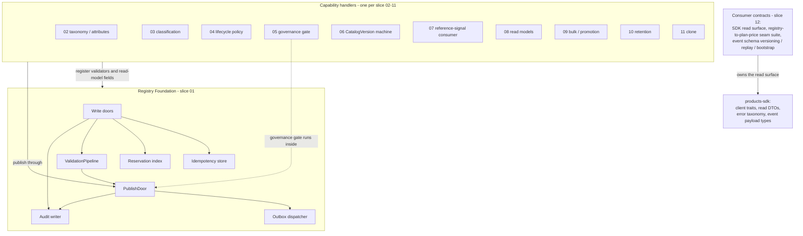

<!-- Related: ./PRD.md, ./DECISIONS.md, ./design/ | Owners: BSS Product Catalog team -->

# Technical Design — Product & SKU Registry

<!-- toc -->

- [1. Architecture Overview](#1-architecture-overview)
  - [1.1 Architectural Vision](#11-architectural-vision)
  - [1.2 Architecture Drivers](#12-architecture-drivers)
  - [1.3 Architecture Layers](#13-architecture-layers)
- [2. Principles & Constraints](#2-principles--constraints)
  - [2.1 Design Principles](#21-design-principles)
  - [2.2 Constraints](#22-constraints)
- [3. Technical Architecture](#3-technical-architecture)
  - [3.1 Domain Model](#31-domain-model)
  - [3.2 Component Model](#32-component-model)
  - [3.3 API Contracts](#33-api-contracts)
  - [3.4 Internal Dependencies](#34-internal-dependencies)
  - [3.5 External Dependencies](#35-external-dependencies)
  - [3.6 Interactions & Sequences](#36-interactions--sequences)
  - [3.7 Database schemas & tables](#37-database-schemas--tables)
  - [3.8 Deployment Topology](#38-deployment-topology)
- [4. Additional context](#4-additional-context)
- [5. Traceability](#5-traceability)
- [6. Status](#6-status)

<!-- /toc -->

- [ ] `p1` - **ID**: `cpt-cf-bss-products-design-main`

## 1. Architecture Overview

### 1.1 Architectural Vision

The **products** gear is the BSS catalog **registry**: the System of Record for Products, SKUs,
categories, attributes/localization, and immutable `CatalogVersion` snapshots — *what can be
sold and how it is described, classified, versioned, and published*. It owns no commercial
concern: Plan/Price/composition are the pricing gear's, evaluation is rating's (PRD §2.1
boundary). Requirements live in [`PRD.md`](./PRD.md); decisions in
[`DECISIONS.md`](./DECISIONS.md) (P-D-NN; the joint contracts D-46/D-47 live in the pricing
register).

The design follows the **foundation-plus-handlers** pattern proven by the pricing gear: one
shared engine slice ([`design/01-foundation.md`](./design/01-foundation.md)) owns the entity
model, identity, the lifecycle state machine, the fail-closed validation pipeline, versioning,
idempotency, eventing, and audit; every capability slice is a handler that authors draft state,
**registers its validation rules** with the pipeline, contributes read-model fields, and
publishes through the Foundation. The Foundation carries no capability policy — it does not
know what a `PlanTier` or a metering unit is.

### 1.2 Architecture Drivers

#### Requirement coverage

*All 57 requirement ids of PRD §6 and §7 — 42 `p1` and 15 `p2` — by full id, against the slice
that owns them. One row per owning slice: the design response is a property of the slice, so a
per-requirement table carried twelve distinct responses across seventy-one rows and repeated a
split note on fourteen rows where it was false. Fourteen requirements are split by clause across
two owners (thirteen) or three (`cpt-cf-bss-products-nfr-scale-extensibility`: slices 01, 02 and
06 — P-D-130); such an id appears on every row that owns a clause, and
[`design/12-consumer-contracts.md`](./design/12-consumer-contracts.md) §3.2 states the qualifier
grammar that keeps the split enumerable. This table's shape and the rest of this revision's re-cut are
P-D-143's.*

| Slice | Requirements owned (whole, or the clause the slice's §1 qualifies) | Design response |
|-------|----------------------------------------------------------------------|-----------------|
| **01** [`01-foundation`](./design/01-foundation.md) | `cpt-cf-bss-products-fr-create-product` · `cpt-cf-bss-products-fr-define-sku` · `cpt-cf-bss-products-fr-event-delivery-resilience` · `cpt-cf-bss-products-fr-expected-failure-behavior` · `cpt-cf-bss-products-fr-field-mutability-matrix` · `cpt-cf-bss-products-fr-idempotent-authoring` · `cpt-cf-bss-products-fr-identifier-contract` · `cpt-cf-bss-products-fr-lifecycle-transitions` · `cpt-cf-bss-products-fr-parent-child-integrity` · `cpt-cf-bss-products-fr-registry-eventing-audit` · `cpt-cf-bss-products-fr-revision-vs-version` · `cpt-cf-bss-products-fr-skucode-reservation-concurrency` · `cpt-cf-bss-products-nfr-determinism-integrity` · `cpt-cf-bss-products-nfr-publication-propagation` · `cpt-cf-bss-products-nfr-scale-extensibility` | The Foundation owns identity (`productId`/`skuId` minted, `skuCode` reserved atomically), the head-vs-version split with the two counters, the single fail-closed publish pipeline every slice registers its validators into, idempotency keys, the transactional outbox and the audit plane; the configured limits behind `nfr-scale-extensibility` are registered validators. **Split**: `cpt-cf-bss-products-fr-revision-vs-version`'s version-binding-at-freeze clause is slice 06's. |
| **02** [`02-taxonomy-attributes`](./design/02-taxonomy-attributes.md) | `cpt-cf-bss-products-fr-create-product` (category assignment) · `cpt-cf-bss-products-fr-localized-attributes` · `cpt-cf-bss-products-fr-manage-taxonomy` · `cpt-cf-bss-products-fr-retention-erasure` (taxonomy operands) · `cpt-cf-bss-products-nfr-scale-extensibility` (attribute and depth caps) | Taxonomy and attribute definitions are governed live entities operated through operation doors; the assignment table carries the exactly-one-primary index; localization resolves through a total fallback chain; the caps on attributes per entity and taxonomy depth are this slice's validators. |
| **03** [`03-sku-classification`](./design/03-sku-classification.md) | `cpt-cf-bss-products-fr-accounting-codes` · `cpt-cf-bss-products-fr-define-sku` (typing) · `cpt-cf-bss-products-fr-metering-unit-declaration` · `cpt-cf-bss-products-fr-metering-unit-delisting` · `cpt-cf-bss-products-fr-plantier-classification` · `cpt-cf-bss-products-fr-sku-sellable` | Typing and classification per `TypeProfile`; every closed vocabulary (tiers, units, codes) is a recognized set behind one table; the usage-type reference is resolved against the platform collector once per publish (P-D-05, P-D-141) and never stored as more than an opaque reference. |
| **04** [`04-lifecycle`](./design/04-lifecycle.md) | `cpt-cf-bss-products-fr-deprecation` · `cpt-cf-bss-products-fr-lifecycle-transitions` (policy) · `cpt-cf-bss-products-fr-parent-child-integrity` (cascade) · `cpt-cf-bss-products-fr-retirement-eol` · `cpt-cf-bss-products-fr-undeprecation` | Lifecycle policy over the Foundation's machine: the edge list, deprecation provenance, parent→child cascades with deferred intent, and retirement as a scheduled transition consumed at schedule time (P-D-139) under the joint plan-price contract (D-47). |
| **05** [`05-governance`](./design/05-governance.md) | `cpt-cf-bss-products-fr-breakglass-action-scope` · `cpt-cf-bss-products-fr-materiality-gated-publish` · `cpt-cf-bss-products-fr-tenant-isolation-breakglass` | Materiality judged at submission against the tenant's stored policy; the configured approver quorum (P-D-11/P-D-13) with the FinanceReviewer predicate; approvals pinned to a **stored** snapshot and consumed once in the act's transaction; the RBAC catalog; break-glass elevation bounded to read and audit-export. |
| **06** [`06-catalog-version`](./design/06-catalog-version.md) | `cpt-cf-bss-products-fr-bundle-adoption-guard` · `cpt-cf-bss-products-fr-catalog-publish-concurrency` · `cpt-cf-bss-products-fr-catalog-version-diff` · `cpt-cf-bss-products-fr-catalog-version-publish` · `cpt-cf-bss-products-fr-freeze-atomicity` · `cpt-cf-bss-products-fr-freeze-participant-governance` · `cpt-cf-bss-products-fr-freeze-recovery` · `cpt-cf-bss-products-fr-grandfathered-retention-coupling` · `cpt-cf-bss-products-fr-grandfathering-invariant` · `cpt-cf-bss-products-fr-prepublish-lint` · `cpt-cf-bss-products-fr-revision-vs-version` (binding at freeze) · `cpt-cf-bss-products-fr-snapshot-reproducibility` · `cpt-cf-bss-products-nfr-posting-safe-budget` · `cpt-cf-bss-products-nfr-publication-propagation` (fan-out) · `cpt-cf-bss-products-nfr-scale-extensibility` (snapshot at scale) · `cpt-cf-bss-products-nfr-snapshot-archival-dr` | `CatalogVersion` is demand-driven: request intake, the mechanical counter, full snapshots with checksums, the freeze protocol with a fail-closed timeout. Its two operator acts — the participant-set write and force-completion — are governed ceremonies (§2.1, P-D-67); the increment itself is mechanical. |
| **07** [`07-reference-signal`](./design/07-reference-signal.md) | `cpt-cf-bss-products-fr-failsafe-tripwire` · `cpt-cf-bss-products-fr-immutable-field-correction` · `cpt-cf-bss-products-fr-reference-producer-registration` · `cpt-cf-bss-products-fr-reference-signal` | Registered producers, per-producer watermarks, the three-state reference predicate, and the correction door with its three gates — fresh-zero, break-glass behind its flag, and P-D-16's unresolvable-target arm outside it. |
| **08** [`08-read-models`](./design/08-read-models.md) — **provisional** (§6) | `cpt-cf-bss-products-fr-cache-first-browse` · `cpt-cf-bss-products-fr-event-delivery-resilience` (projection replay) · `cpt-cf-bss-products-nfr-availability-audit` · `cpt-cf-bss-products-nfr-graceful-degradation` · `cpt-cf-bss-products-nfr-read-latency` · `cpt-cf-bss-products-nfr-read-throughput` | Read models are projections with a staleness stamp on every response, rebuildable from the frozen versions and the outbox. Whether browse needs a separate serving store at all is an open PRD §15 question; the slice, its tables and the two read budgets are conditional on that answer. |
| **09** [`09-bulk-promotion`](./design/09-bulk-promotion.md) | `cpt-cf-bss-products-fr-bulk-import-export` | Bulk import, export and environment promotion run per row through the Foundation publish door under one batch-scoped approval whose pin is the batch's ledger digest (P-D-127). |
| **10** [`10-retention-erasure`](./design/10-retention-erasure.md) | `cpt-cf-bss-products-fr-expected-failure-behavior` (retention refusals) · `cpt-cf-bss-products-fr-grandfathered-retention-coupling` · `cpt-cf-bss-products-fr-retention-erasure` · `cpt-cf-bss-products-nfr-snapshot-archival-dr` (retention class) | Retention clocks per class; the identity-ref map as the single erasure operand; a collector that never forces a collection and releases financial records only by stamp (P-D-137); the PII write-block detector at every door (P-D-136, P-D-140). |
| **11** [`11-clone`](./design/11-clone.md) | `cpt-cf-bss-products-fr-clone` | Clone copies content and never identity, resets lifecycle and both counters, and reserves new codes atomically through the create door. |
| **12** [`12-consumer-contracts`](./design/12-consumer-contracts.md) | `cpt-cf-bss-products-fr-deprecation` (consumer duty) · `cpt-cf-bss-products-fr-event-versioning-replay` · `cpt-cf-bss-products-fr-freeze-atomicity` (seam suite) · `cpt-cf-bss-products-fr-monetization-traceability` · `cpt-cf-bss-products-fr-plan-price-seam` · `cpt-cf-bss-products-nfr-backward-compatible-evolution` | The consumer surface: the SDK, the event compatibility corpus, the obligation register with its `SchemaPin`, and the coverage lints over this design set. |

#### Functional Drivers

- Financial-grade governance: SoD approvals at the tenant's **configured approver quorum**
  (P-D-11: default 2, floor 0 — "two-person" is a retained name, never a fixed count; P-D-13
  enumerates where the shorthand reaches), pinned to stored revision snapshots (PRD §6.7);
  forward-only lifecycle, no unpublish (§6.5).
- Byte-identical reproducibility: `CatalogVersion` full snapshots + checksum + freeze protocol
  (§6.6) — the anchor posted invoices and contracts resolve against.
- Stable downstream identity: immutable `skuId`, permanently reserved `skuCode` (§6.1) — every
  sibling gear binds to it.
- Registry-upstream-of-commercial: a SKU publishes before any plan references it; mechanical
  `CatalogVersion` increments serve pricing's D-47 lanes (P-D-02).

#### NFR Allocation

The ten PRD §7 requirements, each allocated to the slice that answers it and each with the way
it is (or is not yet) verified. Two budgets have **no measurement owner**: PRD §15 carries *"Who
measures the < 3 s propagation budget, and against which meter?"* and *"NFR workshop: named DRI,
SLO table ratified"* as open rows, so the rows below say "workshop" where the number is a target
nobody is yet accountable for measuring.

| NFR ID | NFR summary | Allocated to | Design response | Verification approach |
|--------|-------------|--------------|-----------------|-----------------------|
| `cpt-cf-bss-products-nfr-read-latency` | browse/search p95 < 100 ms within a tenant partition at 10K SKUs | slice 08 (provisional) | cache-first projection partitioned by tenant; the head tables serve reads until the projection exists | **Uncalibrated target** (PRD §15); no meter, no load test today — workshop |
| `cpt-cf-bss-products-nfr-read-throughput` | ≥ 2 000 read QPS per tenant partition at the latency target | slice 08 (provisional) | same projection; reads never join the write path | **Uncalibrated target**; workshop |
| `cpt-cf-bss-products-nfr-publication-propagation` | downstream event availability < 3 s after an approved publish | slice 01 outbox + broker producer (P-D-47); slice 06 fan-out | outbox row in the mutation's transaction; the broker SDK's producer drains it; `CatalogVersionPublished` fans out from the freeze machine | The budget spans four hops — commit → outbox dispatch → durable broker accept → consumer visibility — each with a timestamp the gear can read (row `created_at`, dispatch, accept); the per-hop split and the meter are the workshop's, so today nothing regression-tests the number |
| `cpt-cf-bss-products-nfr-posting-safe-budget` | write commit → posting-safe p99 < 5 s, freeze timeout fail-closed | slice 06 freeze machine | `freezeComplete` acks from registered participants; a bounded fail-closed timeout; force-completion as a governed ceremony (P-D-67) | The timeout arm and the ack handshake are exercised by slice 06's tests; the end-to-end 5 s figure has no meter — workshop |
| `cpt-cf-bss-products-nfr-snapshot-archival-dr` | byte-identical cold re-resolution (interim p95 < 2 s); snapshot durability and DR | slice 06 snapshots; slice 10 retention class | full snapshot + checksum per version; catalog versions are a financial record released only by a retention stamp (P-D-137) | Checksum reproducibility: golden vectors on both engines; retention release: the slice-10 tests. **RPO/RTO are open** (PRD §15 "Snapshot durability / DR targets") — workshop |
| `cpt-cf-bss-products-nfr-scale-extensibility` | ≥ 10K SKUs/tenant within configured limits | slices 01, 02, 06 (P-D-130) | limits are registered validators (01), attribute/depth caps (02), snapshot writes sized per version (06) | Each limit's refusal has a probe with a positive control; the 10K scale point is not load-tested — workshop |
| `cpt-cf-bss-products-nfr-graceful-degradation` | shed or queue above the ceiling; never cross-scope or unpublished content | slice 08 (provisional); slice 01 fail-closed reads | staleness stamp as a floor (P-D-07); reads fail closed on projection outage rather than serve stale-unsafe | Scope and state guards are probed at every read door; the shedding behaviour is design-level until the projection exists |
| `cpt-cf-bss-products-nfr-determinism-integrity` | immutability, acyclicity, identity uniqueness, unit validity — fail-closed | slice 01 (trigger whitelist, identity), 02 (acyclicity), 03 (unit validity) | append-only trigger whitelist on both engines (P-D-40's predicates); unique indexes on identity; registered validators | Schema-oracle goldens on both engines, poison-column probes, the Postgres tier |
| `cpt-cf-bss-products-nfr-backward-compatible-evolution` | a `vN` consumer deserializes a `vN+1` payload; a CI contract test asserts it | slice 12 | the event compatibility corpus and the `SchemaPin` over the obligation register | Specified in slice 12; **the corpus is not built**, and the owner has decided against a CI job for the seam suite (P-D-132) — the check runs in the crate's own tests when it lands |
| `cpt-cf-bss-products-nfr-availability-audit` | read 99.9 % / write 99.5 %; audit completeness | read-model/write-path separation (08/01); the audit plane (01 §4.4) | reads never block on a degraded write path; every refusal and every governed act writes an audit row | Audit completeness is probed per door; **the SLO table is unratified** — workshop |

#### Key decisions

The register [`DECISIONS.md`](./DECISIONS.md) is the current list; its table of contents is the
extent (P-D-141 at this revision) and this block does not mirror it. The entries this document
binds to most directly: **P-D-01** broker-native envelope · **P-D-02** mechanical increments,
governance at the human act · **P-D-03** `SkuReferenceCount` v1 producer = {pricing} · **P-D-05**
`usageTypeRef` resolvability-only · **P-D-07** the staleness stamp is a floor · **P-D-08** audit
sealing is a platform capability (reserved seam) · **P-D-11** the approver count is a policy
value, default 2 floor 0 · **P-D-13** the quorum shorthand's enumerated reach · **P-D-15** the
inbound machine contracts are `products-sdk` clients, not REST doors · **P-D-22** the outbox is
the toolkit's · **P-D-45** the `*_actor_ref` naming convention · **P-D-47** the broker SDK's
producer drains the outbox · **P-D-67** the two governed freeze ceremonies · **P-D-112** the
materiality policy has its own table · **P-D-130** the one triple-owned requirement · **P-D-132**
no CI job for the seam suite · **P-D-137** catalog versions are financial records released by
stamp · **P-D-141** the usage-type resolver behind a trait. Joint: D-46 (`sellable`), D-47
(increment lanes + retirement contract) — pricing register.

### 1.3 Architecture Layers

Standard ToolKit gear, mirroring the sibling BSS gears:

- **`products-sdk`** (`cf-gears-bss-products-sdk`) — consumer-facing contract crate: typed
  client traits, read DTOs (the shapes pricing's `ProductCatalogClientV1` trait and the studio
  consume), error taxonomy, event payload types.
- **`products`** (`cf-gears-bss-products`) — the gear: `contract` (REST `/bss-products/v1/…`,
  OpenAPI), `api` (OperationBuilder handlers), `domain` (entities, state machine, validation
  pipeline, uniqueness/scope rules), `infra` (SecureORM repositories, migrations, outbox,
  read-model projector).
- **Identity**: GTS **types** (never instances — §2.2), declared as
  `gts.cf.bss.products.product.v1~`, `gts.cf.bss.products.sku.v1~`,
  `gts.cf.bss.products.category.v1~`, `gts.cf.bss.products.attribute_definition.v1~`,
  `gts.cf.bss.products.catalog_version.v1~` and `gts.cf.bss.products.approval.v1~` (the name
  slice 05's RBAC catalog uses) — these six are the **domain** types exposed as API resources;
  the authz resource/action catalog of slice 05 §3.2 declares 21 GTS-typed resources and is
  enumerated there rather than duplicated here. **Registration and storage**: the gear
  registers its authz-label type schemas with the platform types registry at init
  (`TypesRegistryClient`, P-D-134); of the six domain types, `product` and `sku` are declared in
  code today and the other four land with the slice that first exposes them as a resource. The
  one GTS value the gear stores — `usageTypeRef` on a SKU — is a `text` column holding an
  **opaque outbound reference** resolved against the collector at publish (P-D-05, P-D-141),
  never a lookup key or a foreign key, which is the case `guidelines/GTS.md` §"anti-patterns"
  forbids. Tables `products_*`; dual-engine storage (SQLite + Postgres), one migration per
  table, schema-oracle goldens from day one.

#### Design set (ordered by implementation phase)

| Doc | Content (one line) | PRD §6 | Phase | Depends on |
|-----|--------------------|--------|-------|------------|
| [`01-foundation`](./design/01-foundation.md) | shared engine: entities, identity, revision-vs-version, state machine, validation pipeline, idempotency/ETag, eventing (P-D-01), audit | 6.1 core, 6.5 core, 6.7, 6.13 | 0/1 | — |
| [`02-taxonomy-attributes`](./design/02-taxonomy-attributes.md) | categories (governed live), attribute definitions + i18n fallback, metadata map, well-known seeds | 6.2, 6.4 | 1 | 01 |
| [`03-sku-classification`](./design/03-sku-classification.md) | SKU typing, `sellable`, `PlanTier`, accounting codes, metering unit + `usageTypeRef` (P-D-05), de-listing | 6.3 | 1 | 01, 02 |
| [`04-lifecycle`](./design/04-lifecycle.md) | deprecation provenance, parent-child + cascade-retire, scheduled publish/retirement, `replacedBy`, containment (P-D-04 residue) | 6.5 | 1/2 | 01; 05 and 07 at integration only |
| [`05-governance`](./design/05-governance.md) | materiality matrix, the configured approver quorum (P-D-11/P-D-13) + FinanceReviewer, **stored** pinned approval snapshot, RBAC, break-glass | 6.7, 6.8 | 1/2 | 01 |
| [`06-catalog-version`](./design/06-catalog-version.md) | CatalogVersion machine (P-D-02, D-47 lanes), checksum/reproducibility, freeze protocol, `compositionPending`, version diff | 6.6 | 2 | 01, 02, 03, 04, 05 |
| [`07-reference-signal`](./design/07-reference-signal.md) | `SkuReferenceCount` watermarks, 3-state predicate, producer registration (P-D-03), fresh-zero corrections + tripwire | 6.1 signal, 6.13 | 2 | 01, 04 (the 04 → 07 edge is integration-only, so the pair is acyclic as built) |
| [`08-read-models`](./design/08-read-models.md) — **provisional** | cache-first browse/search, per-state visibility, `asOfCatalogVersion`, degradation, NFR budgets — conditional on PRD §15's serving-store question | 6.8, §7 | 2 | 01, 06 |
| [`09-bulk-promotion`](./design/09-bulk-promotion.md) | bulk import/export, two-phase deps, change report, environment promotion (AC #33a) | 6.9 | 2/3 | 01, 05 |
| [`10-retention-erasure`](./design/10-retention-erasure.md) | retention classes, pseudonymization, PII write-block, retention↔grandfathering coupling | 6.11 | 3 | 01, 06 |
| [`11-clone`](./design/11-clone.md) | clone/templating with live re-validation | 6.10 | 3 | 01–04 |
| [`12-consumer-contracts`](./design/12-consumer-contracts.md) | seam-suite spec, event schema versioning/replay/bootstrap, §9 interfaces, traceability check | 6.12, 6.7 (replay), §9 | 2/3 | 01, 03, 06, 07 |

#### Dependency order

Phase 0/1: 01 → 02 → (03, 04, 05 in parallel) — 03 needs 02's recognized sets, so it does not
start beside it. Phase 2: 06 (needs 04 + 05), 07 (needs 04; the 04 → 07 dependency is
integration-only and runs the other way at build time), 08 (needs 06), 12 once 03/06/07 fix
their shapes. Phase 2/3: 09; Phase 3: 10, 11. The numeric prefix is implementation order, not
the PRD subsection number. [`design/README.md`](./design/README.md) points here as the canonical
table.

## 2. Principles & Constraints

### 2.1 Design Principles

#### Fail-closed everywhere

- [ ] `p1` - **ID**: `cpt-cf-bss-products-principle-fail-closed`

Every enumerated failure of PRD AC #38 **that a registry door can refuse** maps to a named
error code (slice 01 §3.3 taxonomy); no partial application; every rejection audited with reason.
Three of the fifteen AC #38 rows are outside that universe by design and enumerated in slice 12's
lint 2 — the retention-orphan **alarm**, the `compositionPending` **consumer duty** and AC #38's
**post-v1 EOL row**, whose only candidate code refuses the feature rather than the named
condition — so the principle and its lint say the same thing.

#### Two version counters, never conflated

- [ ] `p1` - **ID**: `cpt-cf-bss-products-principle-two-version-counters`

The internal revision moves on every save and backs optimistic concurrency; the published
version moves only on publish and is the only thing a consumer or `CatalogVersion` may
reference (PRD `cpt-cf-bss-products-fr-revision-vs-version`).

#### Forward-only lifecycle

- [ ] `p1` - **ID**: `cpt-cf-bss-products-principle-forward-only`

No `unpublish`, no in-place rollback; `retired`/`discarded` terminal — physically, via the
append-only trigger whitelist; revival is clone (slice 11).

#### Governance attaches to the human act

- [ ] `p1` - **ID**: `cpt-cf-bss-products-principle-governance-at-entity-publish`

(P-D-02.) Approvals, overrides and materiality attach to **human acts** — an entity publish, a
lifecycle transition, a taxonomy or set operation, a policy edit — and the `CatalogVersion`
**increment** and the read-model projections that follow are mechanical consequences with no
approval path of their own. The freeze protocol has two operator acts that *are* human and are
governed: the participant-set write (`freeze_participant × write`) and force-completion
(`catalog_version × force_complete`), both slice-05 ceremonies (P-D-67, slice 06 §2). "Mechanical"
describes the increment, not the whole slice.

#### Publish through the engine

- [ ] `p1` - **ID**: `cpt-cf-bss-products-principle-publish-through-engine`

Slices never write `published_version`, history, or outbox rows themselves; the Foundation
`PublishDoor` is the single writer, and the governance gate runs inside it — there is no path
around. The gate is invoked through the same registration interface as a validator: the
Foundation holds the call site and the `GovernanceGate` trait, slice 05 holds the policy and
the host that implements it (§1.1's "no capability policy" and this sentence are the same
fact seen from two sides).

#### Registered-validator pattern

- [ ] `p1` - **ID**: `cpt-cf-bss-products-principle-registered-validators`

Slices contribute validation rules to the Foundation pipeline; a rule pairs every refusal with
a positive control in its slice's test plan, and a rule's variant must have a green joint
fixture before the rule counts as wired.

### 2.2 Constraints

#### Registry/commercial boundary

- [ ] `p1` - **ID**: `cpt-cf-bss-products-constraint-no-commercial-concern`

No money, no price, no charge computation anywhere in this gear (PRD §2.1); `region` is
visibility/legal scope, never a pricing dimension.

#### Identity is sacred

- [ ] `p1` - **ID**: `cpt-cf-bss-products-constraint-immutable-identity`

`productId`/`skuId` server-generated and immutable; `skuCode` atomically reserved at create,
permanently reserved from first publish, released only by draft-discard; downstream binds to
`skuId` (PRD `cpt-cf-bss-products-fr-identifier-contract`).

#### Isolation before function

- [ ] `p1` - **ID**: `cpt-cf-bss-products-constraint-tenant-isolation`

Every table carries `tenant_id`; every path is tenant-scoped through SecureORM; cross-tenant is
deny-by-default + audited; PDP-gated grants per endpoint (slice 05). Three properties that
slice 05 decides are stated here because a reader of this document alone would otherwise read
them wrongly:

- **Break-glass has a platform floor tenant configuration cannot lower.** The tenant's quorum is
  a policy value (default 2, floor 0 — P-D-11), but break-glass elevation needs **a fixed floor of
  two distinct platform principals, outside the tenant's configured N entirely** (slice 05 §3.1,
  P-D-13): the acting principal is a platform owner and the subject is another tenant's data, so
  a tenant at N = 0 approves its own publishes and never an elevation into itself.
- **Read-only break-glass is enforced before the pipeline, not asserted.** An elevated call
  substitutes a read-only `AccessScope::for_tenant(target)` in the **pre-pipeline gate**; every
  write under elevation is refused there (P-D-133).
- **Completeness ships; tamper-evidence does not.** The gear writes the complete append-only
  audit trail, and until the platform sealing capability activates (P-D-08), immutability is the
  trigger whitelist on both engines and **nothing cryptographic** (slice 05 C7; P-D-46 withdrew
  the Postgres `REVOKE` arm). A financial-grade reader must know that property is absent by
  decision, not pending.

**Residual risk at N = 0**, stated once: a single operator publishes catalog content with no
second party; the self-approval refusal binds only at N ≥ 1, so it does not bind in this
configuration, and the compensating controls are entirely detective — the audit trail and the
platform-floored break-glass review.

**Authentication is the platform's, not this gear's.** Callers are authenticated by the platform
identity provider — the actor [`design/01-foundation.md`](./design/01-foundation.md) §1.3 names
`cpt-cf-bss-products-actor-oss-ams-idp` and §1.8 lists as a consumed dependency — and this gear
consumes only the resulting principal and tenant claims, through `SecurityContext`. The gear
specifies no authentication mechanism of its own.

#### Platform-delegated concerns

- [ ] `p1` - **ID**: `cpt-cf-bss-products-constraint-platform-delegated-concerns`

Four concerns a reviewer would otherwise have to guess were considered, each delegated the way
authentication is:

- **Data protection at rest and in transit** is the platform database and ingress posture; the
  gear stores no secret and no payment data, holds operator identity only as pseudonymous
  `actor_ref` values (slice 10, P-D-45), and adds no encryption layer of its own.
- **Observability and SLOs** — the gear emits the platform's structured logs, traces and the
  outbox/publish counters through the toolkit's OpenTelemetry wiring; the SLO table, its DRI and
  the propagation meter are the NFR workshop's (PRD §15), and this design allocates budgets
  without owning their measurement (§1.2).
- **Backup and disaster recovery** are the platform database's; the one gear-stated fact is that
  catalog versions are financial records whose snapshots and checksums must survive the
  platform's RPO/RTO (open in PRD §15), and the gear's own contribution is byte-identical cold
  re-resolution (slice 06).
- **Threat model** — the gear's threat surface is the registry's own doors: cross-tenant reach,
  self-approval, identity mutation and audit erasure, each answered by a constraint on this page
  (isolation, the quorum, identity, append-only). No separate STRIDE artifact exists; the
  platform's does not enumerate gear internals.

#### GTS: types, never instances

- [ ] `p1` - **ID**: `cpt-cf-bss-products-constraint-gts-types-not-instances`

GTS carries this gear's **types** — the authz resource/action catalog, the domain types as API
resources, and outbound refs to platform-global vocabularies (`usageTypeRef` today; a future
`resourceTypeRef` per PRD §15 would follow the same pattern). **A Product or SKU is never a GTS
instance**: SKUs are tenant-scoped, operator-authored business data at ≥ 10K/tenant scale with
their own identity contract (`skuId` + `skuCode`, exactly two) and their own versioning
(`CatalogVersion`); GTS instances are platform-global, governed vocabularies (UsageTypes,
model-registry models). A third identity or a data-in-type-registry inversion is refused here
by design, not by omission.

#### Events are broker-native

- [ ] `p1` - **ID**: `cpt-cf-bss-products-constraint-broker-native-events`

(P-D-01.) Durable outbox in the mutation's transaction; emission success never reported before
durable broker acceptance; every state-changing instruction names its event or records "no
event" explicitly; UTC everywhere.

## 3. Technical Architecture

### 3.1 Domain Model

**Technology**: Rust structs and enums in `products/src/domain/` behind the `RegistryEntity`
trait; GTS for the type identity of API resources (§1.3); SecureORM entities in
`products/src/infra/storage/entity/` as the persisted shape.
**Location**: column-level shape per table in [`design/01-foundation.md` §4](./design/01-foundation.md)
and each slice's §4; the wire shapes in `products-sdk`.

**Core entities** (no `entity-*` ids: no BSS gear declares them, and the table is the artifact):

| Entity | Purpose | Schema |
|--------|---------|--------|
| `Product` | Name-identified aggregate root: taxonomy links, scope, the SKU parent | [`01-foundation` §4](./design/01-foundation.md) · [`02`](./design/02-taxonomy-attributes.md) |
| `SKU` | Typed, coded, classified, optionally metered sellable unit under a Product | [`01` §4](./design/01-foundation.md) · [`03`](./design/03-sku-classification.md) |
| `EntityVersion` | The frozen post-publish image of a head at a published version — the only thing a consumer or a catalog version references | [`01` §4](./design/01-foundation.md) |
| `Category`, `AttributeDefinition`, `AttributeValue`, `Metadata` | Governed live taxonomy and attribute entities; the metadata map lives beside the entity outside frozen content (P-D-06) | [`02`](./design/02-taxonomy-attributes.md) |
| `RecognizedSet` | Every closed vocabulary (tiers, units, accounting codes) as members under a `set_kind` | [`03`](./design/03-sku-classification.md) |
| `ScheduledTransition`, `DeferredRetirement` | Lifecycle policy records: the scheduled act and the cascade's deferred intent | [`04`](./design/04-lifecycle.md) |
| `Approval`, `ApprovalDecision`, `BreakGlassSession`, `MaterialityPolicy` | The governance records: a pinned, stored-snapshot approval and its decisions; an elevation session; the tenant's materiality policy (P-D-112) | [`05`](./design/05-governance.md) |
| `CatalogVersion` (+ `Counter`, `Entry`, `Request`, `Capture`, `FreezeParticipant`, `FreezeAck`) | The immutable snapshot aggregate, its mechanical counter, per-entity entries, intake requests, participant captures and the freeze handshake | [`06`](./design/06-catalog-version.md) |
| `ReferenceProducer`, `ReferenceWatermark`, `ReferenceMember`, `CorrectionOverride` | The reference signal and the correction door's evidence | [`07`](./design/07-reference-signal.md) |
| `ReadEntity`, `ReadStamp` | The projection and its staleness stamp — provisional with slice 08 | [`08`](./design/08-read-models.md) |
| `BulkBatch`, `BulkRow` | A batch and its rows under one batch-scoped approval | [`09`](./design/09-bulk-promotion.md) |
| `IdentityRef`, `PiiAllowlist` | The single erasure operand and the reviewed PII allow-list | [`10`](./design/10-retention-erasure.md) |
| `AuditLog`, `Idempotency` | The append-only audit plane and the idempotency store | [`01` §4](./design/01-foundation.md) |

**Relationships**:

- `Product` 1 → n `SKU` (a SKU never changes parent); `Product` n ↔ n `Category` through the
  assignment table with exactly one primary.
- `Category` → `Category` (parent): a tree, acyclic by validator.
- `Product`/`SKU` head 1 → n `EntityVersion`; `published_version` on the head names exactly one of
  them (the whitelist admits the bump only where the row exists).
- `CatalogVersion` 1 → n `Entry` → `EntityVersion` (pins, never heads); `CatalogVersion` 1 → n
  `Capture` per capture kind (P-D-60); `CatalogVersion` 0..1 → `Request` that demanded it.
- `Approval` 1 → n `ApprovalDecision`, one per principal; an approval's subject is an
  `EntityRef` + revision, a governed live op, a `system_signal` (P-D-14) or a bulk batch.
- `SKU` → `usageTypeRef`: an outbound GTS reference (§1.3), no relationship in the schema.

**Invariants that hold across aggregates**: `skuId` and `productId` never change; a `skuCode` is
reserved at create and permanent from first publish; the two counters never conflate (§2.1);
every row carries `tenant_id`; a terminal state is terminal physically (trigger whitelist).

### 3.2 Component Model

Foundation-plus-handlers, as §1.1 and §1.3 state it: one shared engine, ten capability handlers
that register into it and publish through it, and the slice-12 consumer surface over
`products-sdk`.

#### Registry Foundation

- [ ] `p1` - **ID**: `cpt-cf-bss-products-component-registry-foundation`

##### Why this component exists

Every capability needs the same five things — identity, a fail-closed publish, idempotency,
durable events, an audit row — and a registry with ten places that each did them differently
would have ten publish semantics. One engine, one door.

##### Responsibility scope

Write doors (create, save, discard and the head acts), the `ValidationPipeline` that runs every
registered rule, the `PublishDoor` — the single writer of `published_version`, history rows and
outbox rows — the reservation index for `skuCode`, the idempotency store, the outbox dispatcher
(the toolkit's, P-D-22) and the audit writer every door and every refusal goes through. The
invariants of §2.1 and §2.2 are this component's.

##### Responsibility boundaries

It holds no capability policy: it does not know what a `PlanTier`, a metering unit, a quorum or
a retention class is. It exposes two registration contracts and nothing else to the handlers:
`RegisteredValidator` (a rule the pipeline runs) and the `BucketRegistry` (a slice's declaration
of which columns it owns and in which mutability bucket — 01 §1.7, P-D-28). The governance gate
is invoked through the `GovernanceGate` trait exactly as a validator is; the Foundation never
reads an approval.

##### Related components (by ID)

- `cpt-cf-bss-products-component-capability-handlers` — receives their registrations; runs their
  rules; is the only publisher they may call.
- `cpt-cf-bss-products-component-consumer-contracts` — publishes the events and the frozen
  versions its read surface projects.

#### Capability handlers

- [ ] `p1` - **ID**: `cpt-cf-bss-products-component-capability-handlers`

##### Why this component exists

The registry's behaviour is ten policies over one engine. Each policy is authored, reviewed and
built as a slice with its own doors, tables and rules; grouping them here as one component
states what they share, not that they are one thing.

##### Responsibility scope

One handler per slice 02–11 — taxonomy/attributes, classification, lifecycle policy, the
governance gate, the `CatalogVersion` machine, the reference-signal consumer, read models,
bulk/promotion, retention, clone. Each owns its own doors (§3.3), its own tables (§3.7) and the
rules it registers; each authors draft state on the shared heads within the columns its
`BucketRegistry` entry declares.

##### Responsibility boundaries

A handler never writes `published_version`, a history row or an outbox row (§2.1); it never
reaches another handler's tables except through that handler's doors; the one shared contract
between handlers is the Foundation's registration interface. The governance handler is the one
whose rule runs *inside* the publish door rather than before it, and it is still registered,
not wired.

##### Related components (by ID)

- `cpt-cf-bss-products-component-registry-foundation` — registers into it; publishes through it.
- `cpt-cf-bss-products-component-consumer-contracts` — slice 12's lints read every handler's
  declarations; the handlers' events are what its corpus pins.

#### Consumer contracts

- [ ] `p1` - **ID**: `cpt-cf-bss-products-component-consumer-contracts`

##### Why this component exists

Six sibling gears bind to this registry's identity and events; what they may rely on has to be
one artifact with one compatibility rule, not the union of ten slices' wire shapes.

##### Responsibility scope

Slice 12: the `products-sdk` read surface and client traits, the registry↔plan-price seam suite,
event schema versioning/replay/bootstrap with the `SchemaPin`, the obligation register, and the
coverage lints over this design set.

##### Responsibility boundaries

It owns no table and no door; it publishes nothing. It states what consumers may assume and
checks that the other two components keep it. Its seam suite has no CI job by the owner's
decision (P-D-132).

##### Related components (by ID)

- `cpt-cf-bss-products-component-registry-foundation` — consumes its events and frozen versions.
- `cpt-cf-bss-products-component-capability-handlers` — pins their event payloads; lints their
  declarations.

### 3.3 API Contracts

- **Interfaces** (PRD §9): `cpt-cf-bss-products-interface-authoring-publish` — the REST doors
  below; `cpt-cf-bss-products-interface-read-model` — the read doors and the `products-sdk`
  read surface (slice 12), also the surface `cpt-cf-bss-products-usecase-catalog-browser-history`
  runs on.
- **Contracts** (PRD §9): `cpt-cf-bss-products-contract-registry-events` (outbound, broker-native
  — §2.2); `cpt-cf-bss-products-contract-sku-reference-count` (inbound from pricing through the
  reference doors); `cpt-cf-bss-products-contract-bundle-composition-signal` (inbound signal,
  a `system_signal` approval subject — P-D-14); `cpt-cf-bss-products-contract-increment-request`
  and `cpt-cf-bss-products-contract-freeze-ack` (inbound machine contracts bound as `products-sdk`
  clients resolved from `ClientHub`, not as out-of-process REST doors — P-D-15; the REST intake
  and ack doors below are their operator-facing twins).
- **Technology**: REST/OpenAPI under `/bss-products/v1/…`; every operation is registered through
  the toolkit's `OperationBuilder` and contributes to the host's `OpenApiRegistry`, so the
  OpenAPI document is assembled by the platform host from the registered operations — no file
  is checked in. SDK traits mirror the read surface 1:1.
- **Conventions**: idempotency keys on every mutating verb; `If-Match` on every draft mutation
  and head act (P-D-33); resolution calls declare intent (`browse` vs `posted/contractual`, PRD
  AC #21). **Errors** are RFC 9457 problem responses whose `code` is contract — the taxonomy and
  the status mapping are slice 01 §3.3 (`APPROVAL_REQUIRED` 403, refusals by current state 409,
  content the door cannot process 422 — reaching the wire as 400 — P-D-32/P-D-33); renaming a
  code is a breaking change. **Versioning**: the path segment `/v1/` is the wire version; within
  it, payloads evolve under slice 12's compatibility rule (`nfr-backward-compatible-evolution`).

**Endpoints Overview** — the routes registered in code today (47), by owning slice; stability
`v1` throughout (the SDK's compatibility rule is the stability contract). Per-route semantics,
authz resources and refusal codes live in each slice's §3; the authz mapping in slice 05 §3.2.

| Method | Path | Description | Slice | Stability |
|--------|------|-------------|-------|-----------|
| `POST` | `/bss-products/v1/products` | create a Product draft | 01 | v1 |
| `GET` | `/bss-products/v1/products/{id}` | read a Product head with its `ETag` | 01 | v1 |
| `PATCH` | `/bss-products/v1/products/{id}` | save a draft under `If-Match`, routed by bucket tag | 01 | v1 |
| `POST` | `/bss-products/v1/products/{id}/publish` | publish under the governance gate; freezes a version | 01 | v1 |
| `POST` | `/bss-products/v1/products/{id}/discard` | discard a draft (ungoverned) | 01 | v1 |
| `POST` | `/bss-products/v1/products/{id}/deprecate` | deprecate with provenance | 04 | v1 |
| `POST` | `/bss-products/v1/products/{id}/undeprecate` | reverse a deprecation | 04 | v1 |
| `POST` | `/bss-products/v1/products/{id}/retire` | schedule retirement with lead time; cascades to children | 04 | v1 |
| `POST` | `/bss-products/v1/products/{id}/retire/cancel` | cancel a scheduled retirement | 04 | v1 |
| `POST` | `/bss-products/v1/products/{id}/retire/resume` | resume a retirement held on a child | 04 | v1 |
| `POST` | `/bss-products/v1/products/{id}/clone` | clone content into a new draft, identity re-minted | 11 | v1 |
| `POST` | `/bss-products/v1/skus` | create a SKU draft; reserves its `skuCode` atomically | 01 | v1 |
| `GET` | `/bss-products/v1/skus/{id}` | read a SKU head with its `ETag` | 01 | v1 |
| `PATCH` | `/bss-products/v1/skus/{id}` | save a draft under `If-Match`, routed by bucket tag | 01 | v1 |
| `POST` | `/bss-products/v1/skus/{id}/publish` | publish under the gate; resolves `usageTypeRef` once (P-D-141) | 01 / 03 | v1 |
| `POST` | `/bss-products/v1/skus/{id}/discard` | discard a draft; releases the reserved code | 01 | v1 |
| `POST` | `/bss-products/v1/skus/{id}/deprecate` | deprecate with provenance | 04 | v1 |
| `POST` | `/bss-products/v1/skus/{id}/undeprecate` | reverse a deprecation | 04 | v1 |
| `POST` | `/bss-products/v1/skus/{id}/retire` | schedule retirement; the approval is consumed at schedule (P-D-139) | 04 | v1 |
| `POST` | `/bss-products/v1/skus/{id}/retire/cancel` | cancel a scheduled retirement | 04 | v1 |
| `POST` | `/bss-products/v1/skus/{id}/clone` | clone a SKU into a new draft with a new code | 11 | v1 |
| `POST` | `/bss-products/v1/categories` | create a category (governed live entity) | 02 | v1 |
| `POST` | `/bss-products/v1/categories/{categoryId}/operations` | rename, re-parent, retire or delete a category | 02 | v1 |
| `PATCH` | `/bss-products/v1/categories/{categoryId}/attribute-values` | set attribute values on a category | 02 | v1 |
| `POST` | `/bss-products/v1/attribute-definitions` | define an attribute | 02 | v1 |
| `POST` | `/bss-products/v1/attribute-definitions/{key}/operations` | operate on an attribute definition | 02 | v1 |
| `POST` | `/bss-products/v1/recognized-sets/{setKind}/members` | add a member to a closed vocabulary | 03 | v1 |
| `GET` | `/bss-products/v1/scheduled-transitions` | list scheduled transitions | 04 | v1 |
| `POST` | `/bss-products/v1/scheduled-transitions/{id}/operations` | operate on a scheduled transition | 04 | v1 |
| `POST` | `/bss-products/v1/approvals` | submit an approval for a subject at a pinned revision (stored snapshot) | 05 | v1 |
| `POST` | `/bss-products/v1/approvals/{approvalId}/decisions` | record an approver's decision | 05 | v1 |
| `POST` | `/bss-products/v1/breakglass-sessions` | open a break-glass elevation (P-D-120) | 05 | v1 |
| `PUT` | `/bss-products/v1/materiality-policy` | replace the tenant's materiality policy (its own mutation is material — C4) | 05 | v1 |
| `POST` | `/bss-products/v1/catalog-version-requests` | demand a catalog version (intake) | 06 | v1 |
| `GET` | `/bss-products/v1/catalog-versions/{id}` | read a catalog version | 06 | v1 |
| `POST` | `/bss-products/v1/catalog-versions/{id}/acks` | a participant's `freezeComplete` ack | 06 | v1 |
| `POST` | `/bss-products/v1/catalog-versions/{id}/releases` | release a version's liveness (P-D-18) | 06 | v1 |
| `POST` | `/bss-products/v1/reference-producers` | register a reference producer (P-D-03) | 07 | v1 |
| `POST` | `/bss-products/v1/reference-producers/{producer}/retirements` | a producer's retirement signal | 07 | v1 |
| `POST` | `/bss-products/v1/reference-watermarks` | ingest a producer watermark | 07 | v1 |
| `POST` | `/bss-products/v1/bulk/imports` | start a bulk import batch | 09 | v1 |
| `GET` | `/bss-products/v1/bulk/batches/{id}` | read a batch and its change report | 09 | v1 |
| `POST` | `/bss-products/v1/erasure-requests` | request erasure of a pseudonymous identity | 10 | v1 |
| `GET` | `/bss-products/v1/compliance/identity-export` | export the identity-ref map | 10 | v1 |
| `GET` | `/bss-products/v1/compliance/pii-allowlist` | read the PII allow-list | 10 | v1 |
| `POST` | `/bss-products/v1/pii-allowlist-entries` | add an allow-list entry (governed, with a Legal sign-off reference — P-D-10) | 10 | v1 |
| `POST` | `/bss-products/v1/pii-allowlist-entries/{entryId}/operations` | operate on an allow-list entry | 10 | v1 |

Doors the slices specify and the code does not yet register — the catalog-version diff and
force-completion doors (06), the export door (09), the correction door (07), the read-model
doors (08) — are in their slices' §3 and not in this table; the table is a census of the
router, re-derived at each revision.

### 3.4 Internal Dependencies

All inter-gear communication goes through versioned contracts or SDK clients resolved from
`ClientHub`; no gear reaches this gear's tables, and this gear reaches nobody's.

| Dependency gear | Interface used | Purpose |
|-----------------|----------------|---------|
| `authz-resolver` | `AuthZResolverClient` → `PolicyEnforcer` (PEP) | Every door's authorization decision against the PDP; a missing client fails `init()` rather than degrade to an unguarded router |
| `types-registry` | `TypesRegistryClient` | Registers the gear's authz-label type schemas at init so custom catalog roles can target its labels (P-D-134) |
| `usage-collector` | `UsageCollectorClientV1` behind `UsageTypeResolver` | Resolves a SKU's `usageTypeRef` at publish (P-D-05); absent client → `NoCollector`, unavailable → 503 (P-D-131, P-D-141) |
| `event-broker` | `EventBrokerApi` as the outbox processor (`DbProducer`) | Drains the transactional outbox to the broker (P-D-47); absent → a holding processor that never reports success |
| `toolkit-db` | SecureORM, migrations, `toolkit_db::outbox` | Tenant-scoped persistence on both engines; the outbox table is the toolkit's (P-D-22) |
| `pricing` | consumes `products-sdk` (`ProductCatalogClientV1`, D-46/D-47); produces watermarks through `POST …/reference-watermarks` and retirements through `…/reference-producers/{producer}/retirements` under `cpt-cf-bss-products-contract-sku-reference-count`; emits `BundleCompositionCompleted` under `cpt-cf-bss-products-contract-bundle-composition-signal`; the v1 freeze participant under `cpt-cf-bss-products-contract-freeze-ack` and the increment requester under `cpt-cf-bss-products-contract-increment-request` (P-D-15) | The one registered reference producer (P-D-03) and the one freeze participant (P-D-48) |
| `rating` | consumes `products-sdk` read surface and `cpt-cf-bss-products-contract-registry-events`; UC3 binding (rating `SEAMS.md` §J) | Evaluation reads SKU identity and classification |
| `subscriptions`, `contracts`, `billing`, `marketplace`, `presentation` | `cpt-cf-bss-products-contract-registry-events` (`SkuRetired`, `CatalogVersionPublished`, …) and the read surface | Downstream consumers named by PRD §3 actors (`cpt-cf-bss-products-actor-subscriptions`, `-contracts`, `-billing`, `-marketplace`, `-presentation`) |

**Dependency rules** (project conventions): no circular dependencies — pricing is both a
consumer and a producer, and both directions run through contracts, never types; SDK modules
for every inter-gear call; no sideways table access; only integration gears talk to external
systems (this gear talks to none — §3.5); `SecurityContext` is propagated across every
in-process call and is the only carrier of principal and tenant (§2.2).

### 3.5 External Dependencies

The gear integrates with no system outside the platform. The two boundaries that exist:

#### Platform identity (OSS/AMS + IdP)

Consumed, never called: the actor `cpt-cf-bss-products-actor-oss-ams-idp` authenticates callers
and the gear reads the resulting principal and tenant claims from `SecurityContext` (§2.2). No
protocol of this gear's; no token handling.

#### Relational storage

PostgreSQL in deployment, SQLite in the test tier — the dual-engine posture with one migration
per table and schema-oracle goldens on both (§3.7). The database is the platform host's
(§3.8); the gear owns its `products_*` tables and the toolkit outbox rows in it.

Third-party services, message brokers outside the platform's, payment or tax providers: **not
applicable** — the registry is upstream of every commercial concern (§2.2) and reaches the
broker only through the platform SDK (§3.4).

### 3.6 Interactions & Sequences

Canonical sequences, each owned by its slice doc; listed here as the index with the PRD use
cases and actors each serves. No BSS gear ships `sequenceDiagram` blocks and none is added here;
the slice sections are the normative sequence text.

#### Authoring → publish

- [ ] `p1` - **ID**: `cpt-cf-bss-products-seq-authoring-publish`

**Use cases**: `cpt-cf-bss-products-usecase-product-sku-editor`,
`cpt-cf-bss-products-usecase-approval-publish`.
**Actors**: `cpt-cf-bss-products-actor-product-manager`, `cpt-cf-bss-products-actor-catalog-admin`,
`cpt-cf-bss-products-actor-finance-reviewer`.

Create/save drafts through the Foundation write doors → slice validators → the slice-05
governance gate inside the `PublishDoor` (materiality by touched columns; the stored approval
consumed in the act's transaction) → version bump + history freeze + events (slice 01 §2).

#### Publish refused (error path)

- [ ] `p1` - **ID**: `cpt-cf-bss-products-seq-publish-refused`

**Use cases**: `cpt-cf-bss-products-usecase-approval-publish`.
**Actors**: `cpt-cf-bss-products-actor-product-manager`, `cpt-cf-bss-products-actor-catalog-admin`.

The same door, three refusals, nothing written: a stale `If-Match` → `STALE_REVISION` (409)
before any write; a registered validator's refusal → its code (409 by current state or 422 →
400 on the wire) with the rule named, no version frozen; a governed act with no satisfied
record → `APPROVAL_REQUIRED` (403), the transaction rolled back and the idempotency key **not**
claimed, so the retry after approval publishes once (the door's order is resolve, then gate,
then claim — P-D-141). Every refusal writes its audit row with reason.

#### CatalogVersion increment + freeze

- [ ] `p1` - **ID**: `cpt-cf-bss-products-seq-catalog-version-freeze`

**Use cases**: `cpt-cf-bss-products-usecase-freeze-monitoring`.
**Actors**: `cpt-cf-bss-products-actor-catalog-admin`, `cpt-cf-bss-products-actor-plan-price` (the
v1 participant).

Registered downstream addressability request or the operator catalog-publish act (an entity
publish never enqueues — P-D-02/06 `inst-cv-request`) → mechanical increment over the D-47 lanes
→ snapshot + checksum → `CatalogVersionPublished` fan-out → participant acks → `freezeComplete`;
timeout → the governed force-completion ceremony (slice 06).

#### Reference-signal decision

- [ ] `p1` - **ID**: `cpt-cf-bss-products-seq-reference-signal`

**Use cases**: `cpt-cf-bss-products-usecase-lifecycle-deprecation`.
**Actors**: `cpt-cf-bss-products-actor-plan-price` (producer), `cpt-cf-bss-products-actor-catalog-admin`.

Producer watermark ingestion → freshness evaluation → 3-state predicate → retirement/correction
admission or fail-closed refusal (slice 07).

#### Deprecate → retire cascade

- [ ] `p1` - **ID**: `cpt-cf-bss-products-seq-retirement-cascade`

**Use cases**: `cpt-cf-bss-products-usecase-lifecycle-deprecation`.
**Actors**: `cpt-cf-bss-products-actor-catalog-admin`; `cpt-cf-bss-products-actor-subscriptions` and
`cpt-cf-bss-products-actor-plan-price` as consumers of `SkuRetired`.

Deprecation (provenance-tracked) → scheduled retirement with lead time, its approval consumed at
schedule (P-D-139) → cascade with deferred intent on blocked children → the flip under the
reference predicate (slice 04, slice 07).

#### Environment promotion

- [ ] `p2` - **ID**: `cpt-cf-bss-products-seq-environment-promotion`

**Use cases**: `cpt-cf-bss-products-usecase-environment-promotion`,
`cpt-cf-bss-products-usecase-bulk-operations`.
**Actors**: `cpt-cf-bss-products-actor-catalog-admin`.

Deterministic export at a `catalogVersionId` → import (identity via codes, ids re-minted, draft)
→ catalog-version diff review → gated bulk publish under one batch-scoped approval (slice 09;
PRD AC #33a).

### 3.7 Database schemas & tables

**Column-naming convention, read by a lint** (**P-D-45**): any column holding an **operator
identity** is named `*_actor_ref`. Slice 12's lint 7 asserts that exactly one table declares such
a column — 10's `products_identity_ref`, the single erasure point. Two things a reader must know
about that control: it is a review discipline, not a proof — a column named otherwise passes
silently, and **eight** such column names exist today — `created_by` (three tables), `submitter`,
`approver_principal`, `principal`, `reviewed_by`, `approver_a`/`approver_b`, `updated_by` — each
holding a pseudonymous actor ref under a name the lint does not see (`features/governance.md` §7
row 42, P-D-144: rename them or give lint 7 a declared roster; P-D-143 had counted one); and **the lint has no CI gate by the owner's decision** (P-D-132,
P-D-134) — the interim control is the review discipline and the seam suite run by hand.

**Table census — derived, not counted** (P-D-143). Two populations, read mechanically at each revision:
the tables the slices declare in their §4 sections, and the tables the migrations create
(`CREATE TABLE` statements, both engines). They differ by four rows, each explained.

**Declared by the slices — 36**, by the slice that defines each:

- **01** — `products_audit_log`, `products_entity_version`, `products_idempotency`,
  `products_product`, `products_sku` *(the outbox is the toolkit's, not a gear table — **P-D-22**)*
- **02** — `products_attribute_definition`, `products_attribute_value`, `products_category`,
  `products_metadata`, `products_product_category` (written by slice 01's create door)
- **03** — `products_recognized_set`
- **04** — `products_deferred_retirement`, `products_scheduled_transition`
- **05** — `products_approval`, `products_approval_decision`, `products_breakglass_session`,
  `products_materiality_policy` (**P-D-112** — a fourth table rather than a `ProductsConfig` home,
  because C4 makes the policy's own mutation material)
- **06** — `products_catalog_version`, `products_catalog_version_capture` (the capture store,
  P-D-60), `products_catalog_version_counter`, `products_catalog_version_entry`,
  `products_catalog_version_request`, `products_freeze_ack`, `products_freeze_participant`
- **07** — `products_correction_override`, `products_reference_member`,
  `products_reference_producer`, `products_reference_watermark`
- **08** (provisional) — `products_read_deferred_intent`, `products_read_delivery_state`,
  `products_read_entity`, `products_read_freeze_status`
- **09** — `products_bulk_batch`, `products_bulk_row`
- **10** — `products_identity_ref`, `products_pii_allowlist`

**Created by the migrations today — 34.** The difference: three slice-08 tables are **not
built** (`products_read_deferred_intent`, `products_read_delivery_state`,
`products_read_freeze_status` — provisional with the slice, §6), and slice 08's first build
created **`products_read_stamp`** (the staleness stamp, `m20260901_000024`, declared in
`features/read-models.md`) which the slice's §4 does not list — the slice owes the declaration.

All tables tenant-scoped; DDL in one-migration-per-table chains (28 migration files; a chain
migration may carry an index or a trigger for an existing table) with dual-engine schema-oracle
goldens; append-only trigger whitelists per P-D-40, with the retention `DELETE` predicates and
the `(tenant_id, entity_kind, entity_id, published_version)` index documented in
[`design/06-catalog-version.md`](./design/06-catalog-version.md) §4 and the per-table indexes in
each slice's §4.

**Sizing, stated with its assumptions** (owed in full to the NFR workshop — PRD §15 carries
"`CatalogVersion` archival economics" as TBD): a frozen SKU image is one `products_entity_version`
row of roughly 1–2 KB (twenty columns, short strings, a JSON content snapshot), so a tenant at
the 10K-SKU scale point holds 10–20 MB of frozen content per full generation of its catalog; a
catalog version adds one **entry** row per entity (pins, ~100 bytes) — ~1 MB per version at 10K
entities — plus one **capture** row per capture kind. At one catalog version per working day
that is ~250 MB/tenant/year of entries before retention releases any of it (P-D-137). What the
checksum hashes — entries or content — is slice 06 §2's, and its share of the < 5 s posting-safe
budget is not measured.

### 3.8 Deployment Topology

The gear is a **library gear**: `cf-gears-bss-products` is a workspace crate compiled into the
platform's core server, registered through `#[toolkit::gear]`, and has no binary, container or
service of its own. One host process per deployment cell serves its REST surface under
`/bss-products/v1/…` beside the other BSS gears; its tables live in the host's PostgreSQL
(SQLite only in the test tier); its background work — the scheduled-transition runner, the
retention collector, the reference-freshness activation tick (slice 07) — runs in-process, under
the toolkit's coordination lease where a runner holds one, so a multi-replica host runs it once. The outbox is drained by the broker
SDK's producer in the same process (P-D-47). Deployment specifics — replicas, ingress, database
topology, backups — are the platform's (§2.2 "Platform-delegated concerns"); the gear states no
residency constraint because its PRD carries none.

## 4. Additional context

**On ADRs — an open convention question, raised.** This gear has no `ADR/` directory. Pricing
carries three, rating two, subscriptions three, ledger one, and their `DESIGN.md` files reference
those ADR ids; contracts, products and rate-provider carry none (rate-provider keeps a
rejected-alternative record in its `DESIGN.md` instead). `docs/spec-templates/README.md`
reserves an ADR for a decision where "there was a meaningful discussion/debate and the rationale
needs to be preserved as a historical decision record", and at least three register entries have
that shape: **P-D-01** (a broker-native envelope weighed against CloudEvents 1.0), **P-D-11** (the
approver count as a policy value with floor 0) and **P-D-15** (SDK clients from `ClientHub`
against out-of-process REST doors). The checklist's own rule (`ARCH-DESIGN-NO-002`) already
places decision narratives in ADRs, and pricing — this design's pattern source — ships both an
`ADR/` directory and a numbered design set. **Owner: Architecture** — either promote those three
to ADRs under the template's naming, or record that this gear's register is its decision-record
artifact.

**Decision register & joint contracts.**

- [`DECISIONS.md`](./DECISIONS.md) — the decision register; its own table of contents is the
  current extent.
- Joint contracts consumed here: **D-46**, **D-47** (pricing register); **UC3** binding (rating
  `SEAMS.md` §J); contested-surface ownership — rating `SEAMS.md` "Ownership matrix" (five
  products rows).
- Cross-gear obligations still open against counterparts (PRD §15): pricing owes
  `BundleCompositionCompleted` (slice 06 consumes it); freeze-participant acks unregistered on
  the v1 participant, pricing (P-D-48 narrowed the set to it); Contracts' "not a quote" position
  vs the quote-snapshot delegation.

## 5. Traceability

- **PRD**: [`PRD.md`](./PRD.md)
- **ADRs**: none — the register [`DECISIONS.md`](./DECISIONS.md) holds the decisions; whether
  three of them become ADRs is the §4 question.
- **Features**: [`features/`](./features/) — one feature document per slice, each carrying the
  DoDs and their `@cpt-dod` markers; [`DECOMPOSITION.md`](./DECOMPOSITION.md) maps slices to
  features and buildable units.
- **Design set**: [`design/`](./design/) — the twelve slice documents of §1.3;
  [`design/README.md`](./design/README.md) points back here for the phased map.

*PRD §6 → slice.* 6.1 → 01 (identifiers, mutability frame) + 07 (signal, corrections); 6.2 → 02;
6.3 → 03; 6.4 → 02; 6.5 → 01 (machine) + 04 (policy); 6.6 → 06 (incl.
`cpt-cf-bss-products-fr-revision-vs-version`'s version-binding-at-freeze clause); 6.7 → 01
(idempotency, eventing) + 05 (approvals) + 12 (`cpt-cf-bss-products-fr-event-versioning-replay`);
6.8 → 05 (isolation) + 08 (read models); 6.9 → 09; 6.10 → 11; 6.11 → 10; 6.12 → 12; 6.13 →
resident per door (enumerated per slice). Every slice carries a "Traces to" list; slice 12 owns
the completeness check that every `p1`/`p2` **requirement-bearing PRD id** — `fr-*`, `nfr-*`,
§9's `interface-*`/`contract-*`, and `usecase-*` — is claimed by exactly one **owner per
clause**: one slice for a whole requirement, or one slice per scope-qualified clause where a
requirement is deliberately split (fourteen such splits today: thirteen pairs and one triple).
Slice 12 §3.2 states the qualifier grammar; the older "exactly one **slice**" reading is what
`spec-check`'s `P2/fr-multiply-claimed` still implements, which is why it reports all fourteen.

## 6. Status

| Slice | Status |
|-------|--------|
| 01-foundation | **authored + agent-reviewed**; fix wave applied (H1 head-row model, shared guard, `normalized(name)` pin) |
| 02-taxonomy-attributes | **authored + agent-reviewed**; fix wave applied (H2 category branch, M2/M5); P-D-06 **CONFIRMED** |
| 03-sku-classification | **authored + agent-reviewed**; fix wave applied (M2 operand narrowed) |
| 04-lifecycle | **authored + agent-reviewed**; fix wave applied (provenance pass-through, parent path, runner lease); the `RETIREMENT_PENDING` publish freeze was struck by P-D-20 |
| 05-governance | **authored + agent-reviewed**; fix wave applied (scheduled-act consumption model, vocabulary-op materiality, transition-fires-hook invariant); quorum strictness **resolved — P-D-11**; role-predicate question **resolved — P-D-10** |
| 06-catalog-version | **authored + agent-reviewed**; fix wave applied (satisfiedRequests handshake, lifecycle re-validation arm, stored-copy captures, operation_key bulk batching, forced-complete semantics); composition-clear **resolved** (`system_signal` — P-D-14); AC #40 reading **resolved — P-D-09** |
| 07-reference-signal | **authored**; fix wave applied (F1–F8, Blocking 3, review items 19/20/21); quorum sweep + P-D-16 applied |
| 08-read-models | **authored — provisional**; P-D-07 stamp floor **CONFIRMED** conditionally: PRD §15 asks whether browse needs a serving store at all, and three of the slice's four tables are unbuilt (§3.7) |
| 09-bulk-promotion | **authored** (coalesced-event deviation recorded as sanctioned) |
| 10-retention-erasure | **authored**; role-predicate question **resolved — P-D-10**: no gear-side Legal role, the allow-list runs the base quorum with a mandatory recorded Legal sign-off reference |
| 11-clone | **authored** (resolves the 01-flagged clone-vs-P-D-04 interaction) |
| 12-consumer-contracts | **authored + agent-reviewed**; fix wave applied (CoverageChecks incl. id-uniqueness/identity/monetization lints, status vocabulary pinned, register rows split by authorability); SchemaPin widening **resolved — P-D-12**; nine lints total |

All twelve slices are authored; **review status is per slice — read the table, not this
sentence**. Per-slice review reports are working artifacts rather than repository content, so the
table is the only in-repo record. Build status is per feature in [`features/`](./features/)
(the DoD boxes) and per slice in [`DECOMPOSITION.md`](./DECOMPOSITION.md).

**Open inputs.** No open *design* flags await the owner: the branch review's questions were
answered as P-D-06…P-D-12 and P-D-14…P-D-20 (P-D-47, P-D-48). PRD §15 carries **29 open rows**
with named owners, and nine of them are inputs this design depends on: the event-bus transport
contract owner; the platform audit-sealing capability (P-D-08, S1–S9, owned by Architecture);
event-log retention/TTL; `CatalogVersion` archival economics; snapshot durability and DR
(RPO/RTO); broker schema-version pinning; who measures the < 3 s propagation budget; the
unratified SLO table (NFR workshop DRI); and whether browse needs a serving store at all (slice
08). Where a section above depends on one of them it says so in place.
