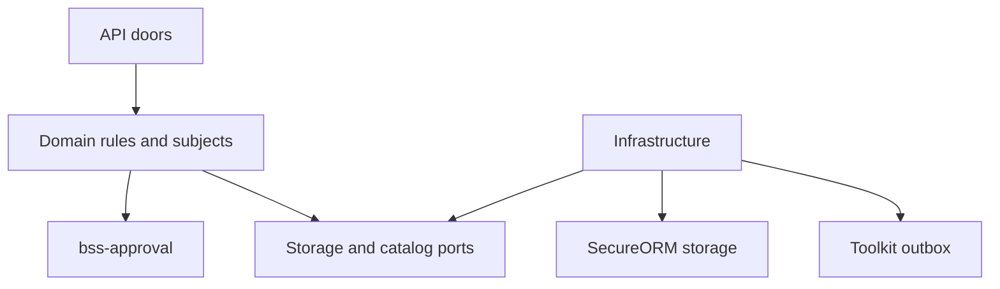
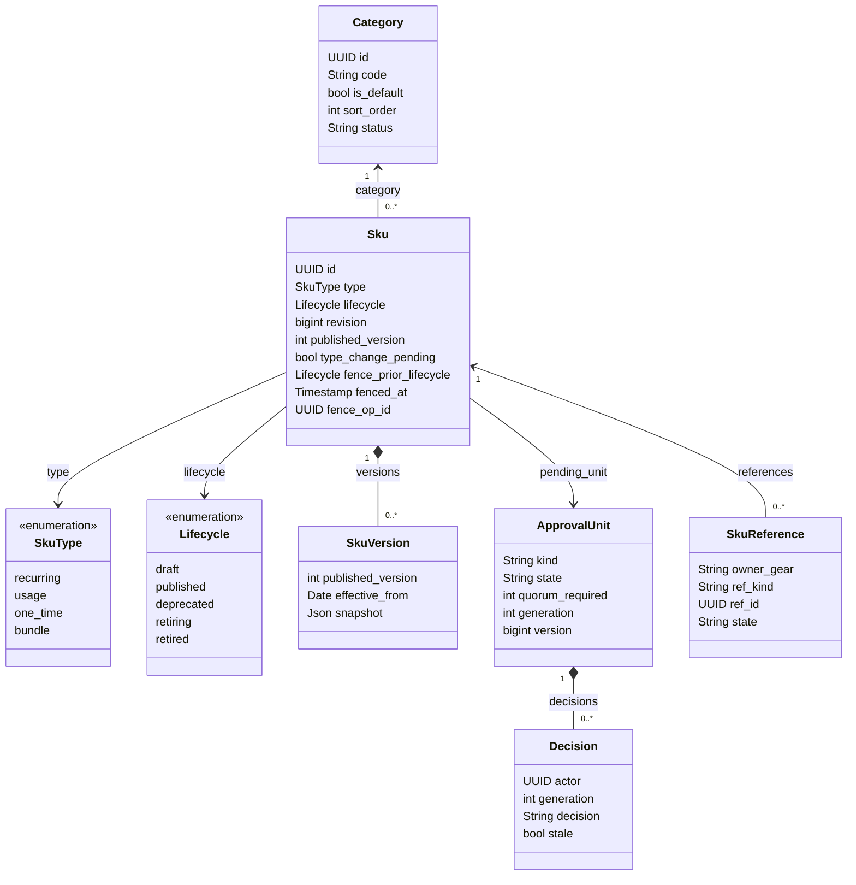
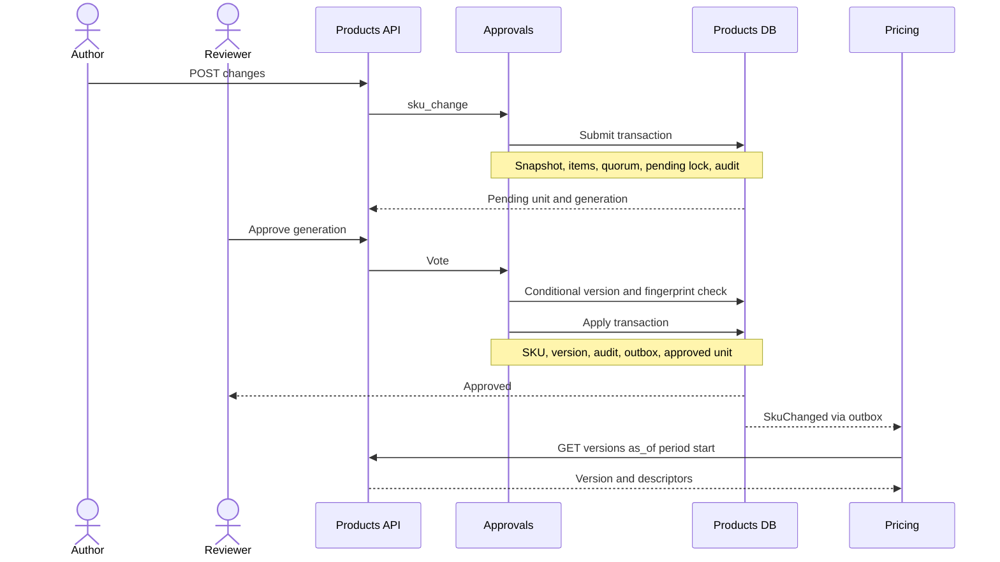
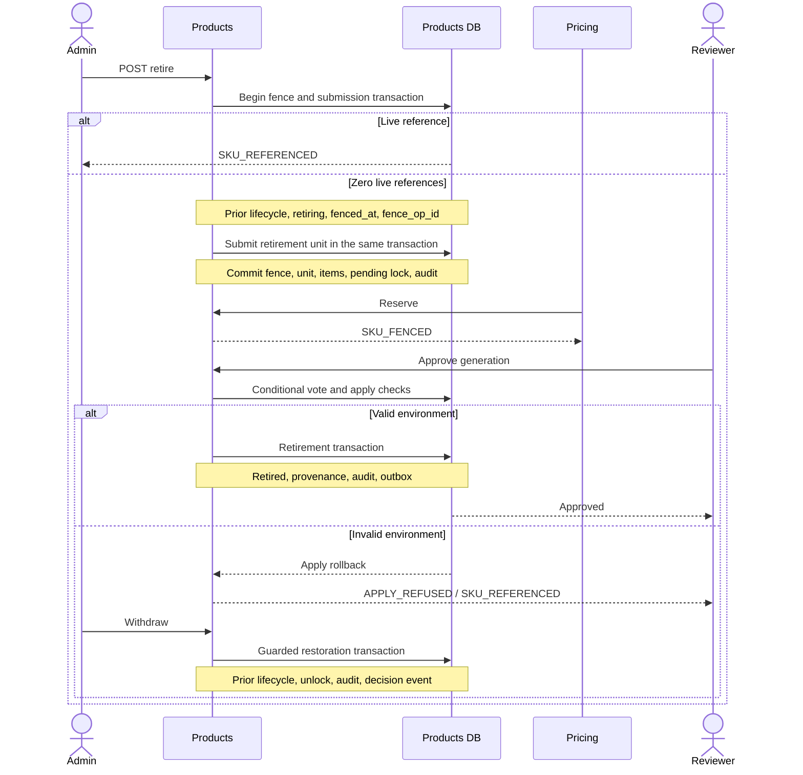
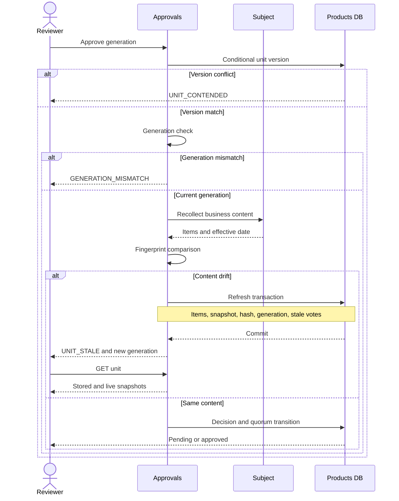
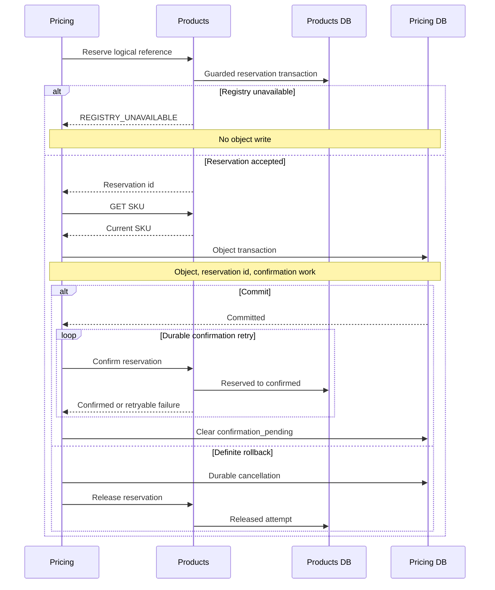

<!-- CONFLUENCE_TITLE: [BSS]: Products — Design (PriceBook rewrite) -->
<!-- Related: ./PRD.md, ./DECISIONS.md, ./design/ | Owners: BSS Product Catalog team -->

# DESIGN — Products: SKU Registry

- [ ] `p1` - **DESIGN implementation status**

<!-- toc -->

- [1. Architecture Overview](#1-architecture-overview)
  - [1.1 Architectural Vision](#11-architectural-vision)
  - [1.2 Architecture Drivers](#12-architecture-drivers)
  - [1.3 Architecture Layers](#13-architecture-layers)
- [2. Principles & Constraints](#2-principles--constraints)
  - [2.1 Design Principles](#21-design-principles)
  - [2.2 Constraints](#22-constraints)
- [3. Technical Architecture](#3-technical-architecture)
  - [3.1 Domain Model](#31-domain-model)
  - [3.2 Component Model](#32-component-model)
  - [3.3 API Contracts](#33-api-contracts)
  - [3.4 Internal Dependencies](#34-internal-dependencies)
  - [3.5 External Dependencies](#35-external-dependencies)
  - [3.6 Interactions & Sequences](#36-interactions--sequences)
  - [3.7 Database schemas & tables](#37-database-schemas--tables)
- [4. Additional context](#4-additional-context)
- [5. Traceability](#5-traceability)

<!-- /toc -->

## 1. Architecture Overview

### 1.1 Architectural Vision

Products owns two catalog entities, `Sku` and flat `Category`. A SKU is an independent definition;
publication, changes and retirement share one approval-unit shape from `bss-approval`. Append-only
`SkuVersion` snapshots preserve the descriptor history and its effective dates. Pricing owns books,
prices and plans: it reads SKU type, descriptors and metering, binds the version in force at a period's
start, and consumes `SkuChanged`. Before writing a price, plan item or sold-as relationship it reserves
that reference in Products, then confirms after its own commit. Products answers reference reads from
its own registry and fences against that registry in one local transaction (spec §2.2, §4, §6, §7.3,
§13; [DECISIONS](DECISIONS.md), P-D-185, P-D-189–194).

The requirements are [PRD](PRD.md). The content authority is
`docs/superpowers/specs/2026-09-24-pricebook-model-design.md` in the main checkout, referenced below as
“spec”. The amendments in §2.2 and decision 17 supersede earlier remote-count, row-lock and
approval-unit idempotency wording. This document specifies the phase 1 implementation, not its completion.

### 1.2 Architecture Drivers

Every PRD FR and NFR appears once in this allocation. Section references identify the design response;
§5 maps functional requirements to the four implementation slices.

| FR/NFR | Driver | Where satisfied |
| --- | --- | --- |
| `cpt-cf-bss-products-fr-sku-define` | Independent tenant-scoped identity and draft authoring | §3.1 Sku; §3.2 Registry; §3.7 unique code/name indexes |
| `cpt-cf-bss-products-fr-sku-type-frozen` | Live references exclude type changes | §2.1 Fence before count; §3.1 type fence; §3.7 registry predicates |
| `cpt-cf-bss-products-fr-sku-descriptors` | Governed, dated billing descriptors | §3.1 SkuVersion; §3.6 GL change |
| `cpt-cf-bss-products-fr-sku-metering` | Usage metering resolves at submit and apply | §3.1 type rules; §3.5 usage-type catalog |
| `cpt-cf-bss-products-fr-sku-bundle` | Bundle identity supports sold-as only | §3.1 bundle rules; §3.5 Pricing; §3.6 reserve/write/confirm |
| `cpt-cf-bss-products-fr-sku-lifecycle` | One approval shape governs lifecycle | §3.1 lifecycle; §3.2 Approvals; §3.6 fenced retirement |
| `cpt-cf-bss-products-fr-sku-versions` | Durable history determines dated truth | §3.3 dated read; §3.7 version table and ordering |
| `cpt-cf-bss-products-fr-sku-retire-fenced` | Retirement excludes new references and survives interruption | §3.1 fence state and recovery; §3.6 fenced retirement |
| `cpt-cf-bss-products-fr-category-flat` | One flat category per SKU | §3.1 Category; §3.3 category doors; §3.7 category foreign key |
| `cpt-cf-bss-products-fr-approval-units` | Quorum, SoD and reviewed generations | §2.2 approval shape; §3.2 Approvals; §3.6 stale refresh; §3.7 four approval tables |
| `cpt-cf-bss-products-fr-events` | State, audit and events commit atomically | §3.2 Events; §3.4 outbox; §3.6 terminal transactions |
| `cpt-cf-bss-products-fr-read-model` | Scoped search, card, versions and reference summary | §3.2 Read model; §3.3 reads; §3.7 read indexes |
| `cpt-cf-bss-products-fr-reference-registry` | Durable reservations close the cross-gear race | §3.2 References; §3.6 reserve/write/confirm; §3.7 reference table |
| `cpt-cf-bss-products-fr-concurrency-idempotency` | Conditional writes and one replay contract | §2.2 no row locks; §3.3 headers; §3.7 replay store |
| `cpt-cf-bss-products-nfr-authz` | Deny-by-default permissions and SoD | §3.3 permission mapping; §3.4 PolicyEnforcer; §3.2 Approvals |
| `cpt-cf-bss-products-nfr-audit` | Durable submission and terminal provenance | §3.2 Events; §3.6 stale decisions; §3.7 append-only audit |
| `cpt-cf-bss-products-nfr-tenant-isolation` | No cross-tenant reads, writes or key collisions | §3.4 SecureORM; §3.7 tenant keys and scoped child access |
| `cpt-cf-bss-products-nfr-two-backends` | Identical behavior on SQLite and Postgres | §2.2 two backends; §3.7 type mapping and transaction rules |

**Architecture decisions.** [ADR-0001](./ADR/0001-cpt-cf-bss-products-adr-no-product-entity.md) — `cpt-cf-bss-products-adr-no-product-entity`: the SKU is the catalog's unit; there is no Product entity, categories are flat, and a bundle SKU has no composition in this gear (§3.1).

### 1.3 Architecture Layers

`products-sdk` remains the public contract crate for typed clients, DTOs, errors and event payloads.
Within `products`, `contract` declares REST/OpenAPI, `api` implements authenticated doors, `domain`
owns SKU rules and the three approval subjects, and `infra` supplies repositories, migrations, outbox
and port adapters. Domain rules depend on ports; infrastructure implements them. `bss-approval` is a
shared library layer for approval rules and types, with a Products-owned store and subject implementations.



## 2. Principles & Constraints

### 2.1 Design Principles

#### One catalog entity

- [ ] `p1` - **ID**: `cpt-cf-bss-products-principle-one-entity`

The SKU is the commercial definition; Category only groups it. There is no Product parent, lifecycle
cascade, bundle composition or CatalogVersion freeze. SKU descriptors belong to dated versions and
Pricing copies them into period bindings (P-D-185–187, P-D-191; spec §4).

#### Fence before count

- [ ] `p1` - **ID**: `cpt-cf-bss-products-principle-fence-before-count`

A read-only count cannot authorize retirement or a type change. Acquire the fence using a conditional
write guarded by absence of live local references, in the same transaction that
submits its approval unit. Reserved and confirmed rows both count. Reserve performs the reciprocal
fence check in its own write transaction. The identifier names the barrier principle, not a remote
count after an unguarded fence (P-D-188–189, P-D-194; spec decision 17 and §13).

#### Business-content fingerprint

- [ ] `p1` - **ID**: `cpt-cf-bss-products-principle-business-content-fingerprint`

Fingerprint each item's proposed business content and the effective date. Exclude pending locks,
concurrency versions and other storage metadata. Re-collect before counting a vote; changed content
refreshes the unit and invalidates earlier-generation votes. Environment checks can refuse apply
without pretending the business content changed (P-D-192; spec §2.2, §6).

### 2.2 Constraints

#### Two backends

- [ ] `p1` - **ID**: `cpt-cf-bss-products-constraint-two-backends`

SQLite and Postgres implement the same schema invariants, approvals, versions and reference barrier.
Postgres reserve/fence transactions use serializable isolation; SQLite serializes writers. Retry a
Postgres serialization failure once and SQLite lock-upgrade failures through the same bounded retry
loop. Verify both storage tiers at phase gates; migrations start a new chain without stand-data migration
(spec §2 decisions 1 and 10, §2.2, §6, §10).

#### One approval shape

- [ ] `p1` - **ID**: `cpt-cf-bss-products-constraint-approval-shape`

Use `bss-approval` for `sku_publish`, `sku_change` and `sku_retire`, with Products-owned tables.
Tenant policy supplies quorum with per-kind overrides; a missing `'*'` row means quorum 1.
No materiality threshold applies. Authors and submitters cannot approve their own unit even if both
permissions are held; category and policy edits are direct operations (P-D-190; spec §6, §14).

#### No database row locks

- [ ] `p1` - **ID**: `cpt-cf-bss-products-constraint-no-row-locks`

SecureORM exposes no `FOR UPDATE`. Every unit mutation is conditional on the observed `version` and
increments it; a lost race returns `UNIT_CONTENDED`. Pending ownership is acquired conditionally on
`pending_unit_id IS NULL` and the observed SKU revision, or submit rolls back with `ROW_LOCKED_PENDING`.
A pending lock is business ownership, not a database row lock (P-D-192; spec §2.2, §6).

## 3. Technical Architecture

### 3.1 Domain Model

| Type | Fields and invariants |
| --- | --- |
| `Sku` | Tenant, id, code, name, type, category, description, sellable, lifecycle, revision (the concurrency version), published_version, descriptors, billing_timing, usage_type_ref, unit, pending_unit_id and approved_by_unit_id. Code and name are separately unique per tenant. Creator attribution supplies approval-item `created_by`. |
| `SkuType` | `recurring`, `usage`, `one_time`, `bundle`. A priced SKU's type determines charge kind. Published/deprecated type changes are fenced against live references. Drafts cannot be reserved and change type without fencing. |
| `Lifecycle` | `draft`, `published`, `deprecated`, `retiring`, `retired`. Publish takes draft to published; change governs published/deprecated content and the published ↔ deprecated edges. Retiring is a transient fence, retired is terminal. |
| `Category` | Tenant, id, code, name, is_default, sort_order, active/retired status and concurrency version. One category per SKU, no parent. Any SKU reference blocks category retirement. |
| `SkuVersion` | Tenant, sku_id, published_version, effective_from, snapshot. Immutable history appended by publication and every applied change. |
| `ApprovalUnit` | Shared crate type: kind, subject reference, state, quorum, generation, snapshot/hash, date, submitter, decision metadata and concurrency version. |
| `Decision` | Shared crate type: unit, actor, generation, approve/reject, note, timestamp and stale flag. One vote per actor per generation. |
| `SkuReference` | Tenant, id, sku_id, owner_gear, price/plan_item/sold_as kind, ref_id, reserved/confirmed/released state, timestamps, released_by and release_reason. Released attempts remain recorded. |

A usage SKU needs both `usage_type_ref` and `unit` at publication; submit and apply resolve the reference.
Metering fields are usage-only. Bundles reject metering, have no composition, and can only be sold as a
Pricing plan, never priced or included as a plan item (P-D-184–185).

The `sku` row holds the latest applied content, possibly future-effective. `revision` is the SKU concurrency
version for ETag, If-Match and compare-and-swap; `published_version` identifies each published
snapshot. A publish is effective immediately. A change defaults
`effective_from` to today and rejects a past requested date at submit. At apply, the version and
SkuChanged carry `max(requested_effective_from, apply_date)`; the unit snapshot retains the requested
date. The applied date cannot precede the latest stored version date (VERSION_ORDER); equal dates
are allowed and the higher published version wins. Consumers use the dated read, not the current SKU row (P-D-191).

Fence state on `Sku` comprises `type_change_pending`, `fence_prior_lifecycle`, `fenced_at` and
`fence_op_id`. Retirement stores the prior lifecycle before setting `retiring`; type change sets
`type_change_pending`. Both reject new reservations. Retry with a fence but no pending unit resumes
by rechecking the local registry and submitting. An orphan older than `fence_ttl_minutes` is reverted
by the next SKU request or explicit unfence; a pending unit's fence cannot be cleared this way.
Reject/withdraw clears pending ownership and fence metadata in one conditional write guarded by unit
id and fence operation id, restoring the prior lifecycle. Successful apply clears fence metadata and
pending ownership, retains `approved_by_unit_id`, and installs the result; retired SKUs remain unavailable
for new references. Apply failure rolls back the apply transaction and leaves the committed fence intact
(P-D-189, P-D-194).



### 3.2 Component Model

| Component | Responsibility | Collaborators |
| --- | --- | --- |
| Registry — `cpt-cf-bss-products-component-registry` | SKU/category authoring, uniqueness, type and metering rules, lifecycle ownership | Approvals, References, usage-type catalog |
| Approvals — `cpt-cf-bss-products-component-approvals` | Three subjects, policy, generation-aware votes, conditional unit store, apply and unlock | Registry, Versions, Events; `bss-approval` |
| Versions — `cpt-cf-bss-products-component-versions` | Append snapshots on publish/change and resolve dated history | Approvals, Read model |
| References — `cpt-cf-bss-products-component-references` | Local reservation registry, reciprocal fence checks, confirm/release and force-release | Registry, Pricing owner, Events |
| Read model — `cpt-cf-bss-products-component-read-model` | Scoped list/search, SKU card, local reference summary, dated reads and retained browse transport | Registry, Versions, References |
| Events — `cpt-cf-bss-products-component-events` | Audit and outbox writes in state transactions; outbound domain and approval events | All mutating components, toolkit-db outbox |

Component definition sites:

- [ ] `p1` - **ID**: `cpt-cf-bss-products-component-registry`
- [ ] `p1` - **ID**: `cpt-cf-bss-products-component-approvals`
- [ ] `p1` - **ID**: `cpt-cf-bss-products-component-versions`
- [ ] `p1` - **ID**: `cpt-cf-bss-products-component-references`
- [ ] `p1` - **ID**: `cpt-cf-bss-products-component-read-model`
- [ ] `p1` - **ID**: `cpt-cf-bss-products-component-events`

The approval subject implements `collect`, `validate_submit`, `lock`, `snapshot`, `apply` and `unlock`.
Submit validates, records snapshot/items/quorum and conditionally acquires pending ownership, all in
one transaction with its audit row. Quorum zero applies immediately, records an approved unit with
`decided_at = submitted_at`, and creates no decisions. Otherwise, approve/reject must name the reviewed
generation; stale generation is refused before counting any vote. Re-collection and fingerprint comparison
precede voting. Approvals below quorum stay pending; quorum applies atomically with the terminal state.
One reject closes the unit and requires a note; only the submitter can withdraw. Every terminal path
clears pending ownership and emits audit plus `ApprovalUnitDecided`. Content drift commits a refresh;
environment failure returns `APPLY_REFUSED` and rolls back (P-D-190, P-D-192–193; spec §6).

### 3.3 API Contracts

Routes are relative to `/bss-products/v1`. Fields and query parameters use snake_case, including
`as_of`, `effective_from`, `ref_id` and `reservation_id` (P-D-191 supersedes the older PRD spelling).
Responses use toolkit RFC-9457 `Problem` with domain `code`, `field` and `message`; stale-generation
responses additionally expose the current generation. All doors use authenticated OperationBuilder
registration and standardized errors.

| Surface | Routes | Contract |
| --- | --- | --- |
| SKU authoring | `POST /skus`; `PATCH /skus/{id}` | Create independent draft; patch drafts only; reject edits while pending. |
| SKU reads | `GET /skus?q&type&category&lifecycle&limit&after`; `GET /skus/{id}` | Tenant-scoped list/search by code/name and filters, bounded limit and exclusive code cursor (tenant-unique codes); SKU card. |
| Dated versions | `GET /skus/{id}/versions?as_of=<date>` | Greatest effective_from not after date, then greatest published_version; 404 before first version. Without as_of, list history. |
| Publication | `POST /skus/{id}/submit` | Submit `sku_publish`. |
| Change | `POST /skus/{id}/changes` | Published/deprecated content and/or lifecycle proposal; effective_from defaults to today; submit `sku_change`. |
| Retirement/recovery | `POST /skus/{id}/retire`; `POST /skus/{id}/unfence` | Guarded fence and `sku_retire` submission in one transaction; unfence only expired orphans. |
| Reference reads | `GET /skus/{id}/references` | products:read; live rows by default; include_released=true adds history with released_at, released_by, forced and release_reason. Live summary retains prices/plans/reserved totals and adds by_owner maps keyed by owner then kind, plus each owner’s reserved subset. |
| Reserve | `POST /skus/{id}/references/reserve { owner, kind, ref_id }` | 201 `{ reservation_id }`, or 200 existing live logical reservation; fenced SKU refuses a new reservation. |
| Confirm | `POST /references/{id}/confirm` | 200 also when already confirmed; released rows cannot reactivate. |
| Release | `DELETE /references/{id}` | Owner after durable cancellation/deletion; operator requires `force: true` and reason, with actor attribution and event. |
| Categories | `GET /categories`; `POST /categories`; `PATCH /categories/{id}`; `POST /categories/{id}/retire` | Direct edits without approvals; refuse retirement while any SKU points at it. |
| Approval reads | `GET /approval-units?state&kind&ref_id`; `GET /approval-units/{id}` | Queue and detail; detail includes stored snapshot and live recomputation. |
| Decisions | `POST /approval-units/{id}/approve`; `POST /approval-units/{id}/reject`; `POST /approval-units/{id}/withdraw` | Approve/reject carry generation; reject requires note; withdraw is submitter-only. |
| Approval policy | `GET /approval-policy`; `PUT /approval-policy` | Tenant default quorum and optional per-kind overrides; missing default is quorum 1. |
| Settings | `GET /settings`; `PUT /settings` | Tenant settings, including fence TTL; approval-policy door uses the same tenant policy store. |
| Retained browse | `GET /bss-products/v1/browse` (absolute) | Preserve `ProductCatalogClientV1` transport until phase 2; serve Published and Deprecated with lifecycle status and deprecated flag; drafts, retiring and retired are absent. |

SKU reads/writes expose `ETag` from `revision`, its concurrency version; categories use `version`. Every PATCH
requires `If-Match`; compare-and-swap guards the write and increments the version. Stale versions return
409 `STALE_REVISION`; missing required preconditions use the toolkit precondition response. Every POST
accepts optional `Idempotency-Key`, with 24-hour replay keyed by tenant, concrete endpoint and client key.
Authenticate and authorize first, then perform a read-only replay lookup before external resolution.
Claim, mutation and receipt commit in the same transaction for every POST, including decisions and
reference reserve/confirm. A keyed approval replays after the decision; a keyed reserve replays its
original attempt even after release. Policy PUT remains If-Match only. There is no approval-unit
idempotency column; reserve also deduplicates live logical references independently (P-D-193–194).

Permissions deny by default: `products:read` covers scoped reads, `products:author` draft/category and
reference mutations plus orphan recovery, `products:submit` lifecycle proposals and withdrawal,
`products:approve` decisions, and `products:settings` settings/policy writes and policy reads. Reference operations also
check the authenticated owner gear; operator force-release requires explicit operator authorization and
reason. SoD and submitter checks apply in the domain regardless of grants (spec §6, §7.3).

| Error codes | HTTP / meaning |
| --- | --- |
| `SKU_CODE_TAKEN`, `SKU_NAME_TAKEN` | 409; tenant identity conflict |
| `SKU_TYPE_FROZEN`, `SKU_REFERENCED`, `SKU_FENCED`, `REFERENCE_RELEASED` | 409; live reference, fence or terminal reservation conflict |
| `ROW_LOCKED_PENDING`, `STALE_REVISION`, `VERSION_ORDER`, `CATEGORY_IN_USE` | 409; pending ownership, concurrency, timeline or category reference conflict |
| `UNIT_CONTENDED`, `UNIT_ALREADY_DECIDED`, `DUPLICATE_VOTE` | 409; conditional unit write, terminal state or duplicate generation vote |
| `CONTENDED` | 409; a transaction still contended after its bounded retries (an approval-unit door answers `UNIT_CONTENDED`) |
| `GENERATION_MISMATCH`, `UNIT_STALE` | 400 with current/new generation; mismatch refuses vote, stale refresh commits |
| `SOD_VIOLATION`, `NOT_SUBMITTER` | 403; author/submitter approval or unauthorized withdrawal |
| `USAGE_NEEDS_METER`, `USAGE_TYPE_UNRESOLVED`, `BUNDLE_HAS_NO_METER` | Validation refusal; submit's failed subject checks are 400 with no unit created. Draft unresolved catalog reference is 400 per P-D-184. |
| `APPLY_REFUSED` | Apply failure with domain reason, including SKU_REFERENCED; transaction rolls back without success events |
| `NO_VERSION_IN_FORCE` | 404; date precedes first version |
| `SKU_RETIRING`, `ROW_SKU_DEPRECATED` | Pricing-side adoption guards for prices/items and new plan revisions |
| `REGISTRY_UNAVAILABLE` | 503 from Pricing when reserve cannot succeed; Pricing writes nothing |

An unreachable configured usage-type catalog is 503 during publication validation. The usage catalog's
authoring behavior is defined in §3.5; these codes do not turn a catalog non-answer into a draft-save outage.

### 3.4 Internal Dependencies

| Dependency | Design contract |
| --- | --- |
| `bss-approval` | Library types and state machine; Products implements subjects and the transactional Store. No shared cross-gear approval database. |
| toolkit-db / SecureORM | SecureConn and scoped transactions; PolicyEnforcer-derived AccessScope on all reads/writes, including audit, replay and child records. Conditional writes, no raw unscoped connection. |
| toolkit-db outbox | State, audit and outbox records share the same transaction; dispatch happens after commit. No success event escapes a rollback. |
| toolkit REST / PolicyEnforcer | OperationBuilder, authenticated operations, RFC-9457 errors and deny-by-default resource/action checks. |
| products-sdk / ClientHub | Public SKU/version/catalog contracts and usage-type port; consumers resolve typed clients without importing gear internals. |

Outbound events are `SkuPublished`, `SkuChanged`, `SkuRetired`, `ApprovalUnitDecided` and
`ReferenceForceReleased`. Broker events follow this gear's camelCase convention. `SkuChanged` carries
`tenantId`, `skuId`, `changed`, `effectiveFrom`, `publishedVersion` and `actorRef`, with type id
`gts.cf.core.events.event.v1~cf.bss.products.sku_changed.v1~`. It identifies the committed version;
consumers read its snapshot separately. `ApprovalUnitDecided` carries `tenantId`, `unitId`, `kind`,
`state`, `generation` and `actors`. Every terminal decision, including reject, withdraw and quorum zero,
writes audit and the decision event; successful apply adds its domain event. Submission is audited
without an event unless quorum zero also applies. Stale refresh keeps stale votes but emits no successful
apply event (P-D-193; spec §6–§7.3).

### 3.5 External Dependencies

Pricing reads SKU/type/metering and dated descriptors, consumes `SkuChanged` to refresh its read model,
and owns durable confirmation work for its references. It uses Products' reference doors, including
sold-as reservations; Products has no `SkuReferences` remote-count port. Descriptor updates draft no
Pricing unit and require no book action. Pricing's reserve/write/confirm path arrives in phase 2
(P-D-194; spec §7.3, §13).

`UsageTypeCatalog` remains the pluggable resolution/listing port in `products-sdk`, with resolution
order and provenance: registered catalog, usage-collector adapter, then configured local-development
catalog or unconfigured mode. Resolution tests resolvability only. On draft save, a changed ref's
definitive unresolved answer is 400 `USAGE_TYPE_UNRESOLVED`; a catalog non-answer does not block save.
Submit and apply revalidate, fail closed for unresolved refs, and return 503 for an unreachable configured
catalog (P-D-184, carried from P-D-183 (backup); spec §4, §15).

### 3.6 Interactions & Sequences

#### GL change

- [ ] `p1` - **ID**: `cpt-cf-bss-products-seq-gl-change`

The author proposes GL `4010-STOR` → `4012-STOR` from October 1. The diagram shows a quorum-one
approval; higher quorum commits intermediate votes without applying. The final transaction also
clears pending ownership and retains approval provenance. Pricing's existing period bindings remain
unchanged (PRD use case “Change a GL code”; P-D-190–191).



#### Fenced retirement

- [ ] `p1` - **ID**: `cpt-cf-bss-products-seq-fenced-retire`

Fence acquisition and submission commit in ONE transaction guarded by NOT EXISTS (live reference).
A fence found without a unit is resumed; an expired orphan is lifted.
The apply-reference check is defensive; ordinary reserve cannot pass the fence. Failure rolls back
only the apply transaction, preserving the pending unit and fence until reject/withdraw restores the
prior lifecycle (PRD use case “Retire a SKU”; P-D-189, P-D-194).



#### Stale refresh

- [ ] `p1` - **ID**: `cpt-cf-bss-products-seq-stale-refresh`

The generation supplied by a voter is checked inside the conditional unit transaction. A content
fingerprint change commits the refreshed snapshot/items/hash, increments generation and marks prior
decisions stale. The attempted vote does not count; reviewers read and vote again. Environmental
refusals instead roll back without a content refresh (P-D-192; spec §2.2, §6).



#### Reserve, write and confirm

- [ ] `p1` - **ID**: `cpt-cf-bss-products-seq-reserve-write-confirm`

Pricing's transaction stores the object, reservation id and confirmation work together. An unconfirmed
reservation remains live indefinitely; neither caller death nor a confirmation timeout releases it.
The same sequence covers price, plan-item and sold-as references. Release follows durable cancellation
or removal; operator force-release is audited and evented so the owner can verify and re-reserve an
object that still exists. Products cannot detect a dishonest release beneath a live owner object
(P-D-194; spec §13).



### 3.7 Database schemas & tables

The following is the Postgres schema shape for the new migration chain. Logical names in spec §4 and
§6 gain the `products_` prefix in schema `bss`. SQLite drops `bss.`, maps UUID/timestamp/date/JSONB to
text and BYTEA to blob, preserving keys, checks, indexes and transaction behavior. SecureORM scopes
every table by tenant; approval items and decisions are accessed only through their scoped parent unit.
Tenant isolation uses SecureORM scoping and scoped reads of the parent category within the write
transaction; approval children are reached through the scoped unit. Foreign keys use entity ids.
Creator attribution on SKU is included so approval items can enforce author SoD.

The four approval tables implement spec §6 with the §2.2 correction: no `idempotency_key` column or
index on `products_approval_unit`. `common_effective_date` stores the SKU change's `effective_from`.
`'*'` is the required default policy row; if absent, runtime reads fail safe to quorum 1 (P-D-190).

```sql
CREATE TABLE bss.products_category (
    id uuid PRIMARY KEY,
    tenant_id uuid NOT NULL,
    code text NOT NULL,
    name text NOT NULL,
    is_default boolean NOT NULL DEFAULT false,
    sort_order integer NOT NULL DEFAULT 0,
    status text NOT NULL CHECK (status IN ('active', 'retired')),
    created_at timestamptz NOT NULL,
    updated_at timestamptz NOT NULL,
    version bigint NOT NULL DEFAULT 1,
    UNIQUE (tenant_id, id),
    UNIQUE (tenant_id, code)
);

CREATE TABLE bss.products_approval_policy (
    tenant_id uuid NOT NULL,
    kind text NOT NULL CHECK (kind IN ('*', 'sku_publish', 'sku_change', 'sku_retire')),
    quorum integer NOT NULL CHECK (quorum >= 0),
    PRIMARY KEY (tenant_id, kind)
);

CREATE TABLE bss.products_approval_unit (
    id uuid PRIMARY KEY,
    tenant_id uuid NOT NULL,
    kind text NOT NULL CHECK (kind IN ('sku_publish', 'sku_change', 'sku_retire')),
    ref_type text NOT NULL,
    ref_id uuid NOT NULL,
    state text NOT NULL CHECK (state IN ('pending', 'approved', 'rejected', 'withdrawn')),
    common_effective_date date,
    quorum_required integer NOT NULL CHECK (quorum_required >= 0),
    generation integer NOT NULL DEFAULT 1,
    submitted_by uuid NOT NULL,
    submitted_at timestamptz NOT NULL,
    decided_at timestamptz,
    decided_note text,
    snapshot jsonb NOT NULL,
    snapshot_hash text NOT NULL,
    version bigint NOT NULL DEFAULT 1,
    UNIQUE (tenant_id, id)
);
CREATE INDEX products_approval_queue
    ON bss.products_approval_unit (tenant_id, state, kind, submitted_at);

CREATE TABLE bss.products_approval_unit_item (
    unit_id uuid NOT NULL REFERENCES bss.products_approval_unit(id),
    item_type text NOT NULL,
    item_id uuid NOT NULL,
    created_by uuid NOT NULL,
    before jsonb,
    after jsonb NOT NULL,
    PRIMARY KEY (unit_id, item_type, item_id)
);

CREATE TABLE bss.products_approval_decision (
    unit_id uuid NOT NULL REFERENCES bss.products_approval_unit(id),
    actor uuid NOT NULL,
    generation integer NOT NULL,
    decision text NOT NULL CHECK (decision IN ('approve', 'reject')),
    note text,
    at timestamptz NOT NULL,
    stale boolean NOT NULL DEFAULT false,
    PRIMARY KEY (unit_id, actor, generation)
);

CREATE TABLE bss.products_sku (
    id uuid PRIMARY KEY,
    tenant_id uuid NOT NULL,
    code text NOT NULL,
    name text NOT NULL,
    type text NOT NULL CHECK (type IN ('recurring', 'usage', 'one_time', 'bundle')),
    category_id uuid NOT NULL,
    description text,
    sellable boolean NOT NULL,
    lifecycle text NOT NULL CHECK (lifecycle IN ('draft', 'published', 'deprecated', 'retiring', 'retired')),
    revision integer NOT NULL DEFAULT 1,
    published_version integer NOT NULL DEFAULT 0,
    gl_code text,
    tax_category text,
    invoice_line_template text,
    billing_timing text CHECK (billing_timing IN ('advance', 'arrears')),
    usage_type_ref text,
    unit text,
    pending_unit_id uuid,
    approved_by_unit_id uuid,
    type_change_pending boolean NOT NULL DEFAULT false,
    fence_prior_lifecycle text CHECK (fence_prior_lifecycle IN ('draft', 'published', 'deprecated')),
    fenced_at timestamptz,
    fence_op_id uuid,
    created_by uuid NOT NULL,
    created_at timestamptz NOT NULL,
    updated_at timestamptz NOT NULL,
    UNIQUE (tenant_id, id),
    UNIQUE (tenant_id, code),
    UNIQUE (tenant_id, name),
    FOREIGN KEY (category_id) REFERENCES bss.products_category(id),
    FOREIGN KEY (pending_unit_id) REFERENCES bss.products_approval_unit(id),
    FOREIGN KEY (approved_by_unit_id) REFERENCES bss.products_approval_unit(id)
);
CREATE INDEX products_sku_browse
    ON bss.products_sku (tenant_id, lifecycle, type, category_id, id);

CREATE TABLE bss.products_sku_version (
    tenant_id uuid NOT NULL,
    sku_id uuid NOT NULL,
    published_version integer NOT NULL,
    effective_from date NOT NULL,
    snapshot jsonb NOT NULL,
    PRIMARY KEY (sku_id, published_version),
    FOREIGN KEY (sku_id) REFERENCES bss.products_sku(id)
);
CREATE INDEX products_sku_version_as_of
    ON bss.products_sku_version (tenant_id, sku_id, effective_from, published_version);

CREATE TABLE bss.products_sku_reference (
    id uuid PRIMARY KEY,
    tenant_id uuid NOT NULL,
    sku_id uuid NOT NULL,
    owner_gear text NOT NULL,
    ref_kind text NOT NULL CHECK (ref_kind IN ('price', 'plan_item', 'sold_as')),
    ref_id uuid NOT NULL,
    state text NOT NULL CHECK (state IN ('reserved', 'confirmed', 'released')),
    reserved_at timestamptz NOT NULL,
    confirmed_at timestamptz,
    released_at timestamptz,
    released_by uuid,
    release_reason text,
    FOREIGN KEY (sku_id) REFERENCES bss.products_sku(id)
);
CREATE UNIQUE INDEX products_sku_reference_live_key
    ON bss.products_sku_reference (tenant_id, owner_gear, ref_kind, ref_id)
    WHERE state <> 'released';
CREATE INDEX products_sku_reference_live_sku
    ON bss.products_sku_reference (tenant_id, sku_id, owner_gear, ref_kind)
    WHERE state <> 'released';
```

Version append and the `published_version` increment share the apply transaction. No update/delete
path is allowed for `products_sku_version`; enforce append-only storage guards on both backends.
The as-of query filters `effective_from <= :as_of`, orders by effective_from descending then
published_version descending, and takes one. `(sku_id, effective_from)` is deliberately not unique;
apply refuses earlier dates with `VERSION_ORDER` before inserting (P-D-191).

Reserve inserts only against an unfenced, non-retired SKU. Fence acquisition uses a conditional SKU
update guarded by `NOT EXISTS` on tenant/SKU references in `reserved` or `confirmed` state. The
reciprocal checks run in serializable transactions on Postgres; SQLite's writer serialization provides
the same exclusion. A same-live-reference retry returns the original reservation; after release a new
attempt gets a new id. Released rows never reactivate, and no expiry filter may exclude a live row
(P-D-189, P-D-194). Pending acquisition and all terminal SKU changes additionally guard version and
ownership; zero-row conditional writes cannot be treated as success.

Audit and replay below copy the Postgres statements from `bss/products-backup` migrations
`m20260829_000004_create_products_audit_log.rs` and `m20260829_000006_create_products_idempotency.rs`.
Column lists, types and nullability are verbatim. Only the audit table and its dependent SQL object
names change from `products_audit_log` to the Task 6 name `products_audit`; no old audit semantics are
reintroduced merely because a reserved column remains. Audit inserts use `seal_state = 'unsealed'`;
the reserved one-way sealing transition preserves every record column. Replay retains its column
shape, including nullable `entity_ref`, without reviving old clone or freeze flows (P-D-193).

```sql
CREATE TABLE bss.products_audit (
            audit_id          uuid        NOT NULL,
            tenant_id         uuid        NOT NULL,
            actor_ref         uuid        NOT NULL,
            action            text        NOT NULL,
            subject_kind      text        NOT NULL,
            subject_id        uuid,
            subject_revision  bigint,
            error_code        text,
            attempted_key     text,
            reason            text,
            correlation_id    text,
            written_at        timestamptz NOT NULL,
            session_id        uuid,
            ceremony_ref      uuid,
            seal_state        text        NOT NULL,
            chain_id          uuid,
            seq               bigint,
            prev_hash         bytea,
            row_hash          bytea,
            CONSTRAINT products_audit_pkey PRIMARY KEY (audit_id),
            CONSTRAINT chk_products_audit_seal_state CHECK (seal_state IN ('unsealed', 'sealed')),
            CONSTRAINT chk_products_audit_seal_group CHECK (
                (seal_state = 'unsealed' AND chain_id IS NULL AND seq IS NULL AND prev_hash IS NULL AND row_hash IS NULL)
                OR
                (seal_state = 'sealed' AND chain_id IS NOT NULL AND seq IS NOT NULL AND row_hash IS NOT NULL)
            ),
            CONSTRAINT chk_products_audit_seq CHECK (seq IS NULL OR seq >= 0),
            CONSTRAINT chk_products_audit_subject_ref CHECK (subject_id IS NOT NULL OR attempted_key IS NOT NULL OR session_id IS NOT NULL)
        );

CREATE INDEX idx_products_audit_tenant_time ON bss.products_audit USING btree (tenant_id, written_at);

CREATE INDEX idx_products_audit_subject ON bss.products_audit USING btree (tenant_id, subject_kind, subject_id, written_at);

CREATE INDEX idx_products_audit_actor ON bss.products_audit USING btree (tenant_id, actor_ref, written_at);

CREATE OR REPLACE FUNCTION bss.products_audit_append_only() RETURNS trigger AS $$
        BEGIN
          IF TG_OP = 'DELETE' THEN
            RAISE EXCEPTION 'products_audit is append-only: DELETE is not permitted';
          END IF;

          IF OLD.seal_state = 'unsealed'
             AND NEW.seal_state = 'sealed'
             AND NEW.chain_id IS NOT NULL
             AND NEW.seq IS NOT NULL
             AND NEW.row_hash IS NOT NULL
             AND NEW.audit_id IS NOT DISTINCT FROM OLD.audit_id
             AND NEW.tenant_id IS NOT DISTINCT FROM OLD.tenant_id
             AND NEW.actor_ref IS NOT DISTINCT FROM OLD.actor_ref
             AND NEW.action IS NOT DISTINCT FROM OLD.action
             AND NEW.subject_kind IS NOT DISTINCT FROM OLD.subject_kind
             AND NEW.subject_id IS NOT DISTINCT FROM OLD.subject_id
             AND NEW.subject_revision IS NOT DISTINCT FROM OLD.subject_revision
             AND NEW.error_code IS NOT DISTINCT FROM OLD.error_code
             AND NEW.attempted_key IS NOT DISTINCT FROM OLD.attempted_key
             AND NEW.reason IS NOT DISTINCT FROM OLD.reason
             AND NEW.correlation_id IS NOT DISTINCT FROM OLD.correlation_id
             AND NEW.written_at IS NOT DISTINCT FROM OLD.written_at
             AND NEW.session_id IS NOT DISTINCT FROM OLD.session_id
             AND NEW.ceremony_ref IS NOT DISTINCT FROM OLD.ceremony_ref
          THEN
            RETURN NEW;
          END IF;

          RAISE EXCEPTION 'products_audit is append-only: % is not permitted', TG_OP;
        END;
     $$ LANGUAGE plpgsql;

CREATE TRIGGER trg_products_audit_append_only BEFORE DELETE OR UPDATE ON bss.products_audit FOR EACH ROW EXECUTE FUNCTION bss.products_audit_append_only();
```

```sql
CREATE TABLE bss.products_idempotency (
            tenant_id       uuid        NOT NULL,
            endpoint        text        NOT NULL,
            client_key      text        NOT NULL,
            state           text        NOT NULL,
            payload_hash    bytea       NOT NULL,
            response_status integer,
            response_body   jsonb,
            expires_at      timestamptz NOT NULL,
            entity_ref      uuid,
            CONSTRAINT products_idempotency_pkey PRIMARY KEY (tenant_id, endpoint, client_key),
            CONSTRAINT chk_products_idempotency_state CHECK (state IN ('claimed', 'answered')),
            CONSTRAINT chk_products_idempotency_response_group CHECK (
                (state = 'claimed' AND response_status IS NULL AND response_body IS NULL)
                OR
                (state = 'answered' AND response_status IS NOT NULL AND response_body IS NOT NULL)
            )
        );

CREATE INDEX idx_products_idempotency_expires ON bss.products_idempotency USING btree (tenant_id, expires_at);
```

The replay store is the only client-key store, checked before fence/unit work and retained for 24
hours. `payload_hash` distinguishes request content; response status/body hold the replay result.
Claim/answer writes use the same guarded operation's transaction; resumable fence operations retain
`fence_op_id` so a resumed orphan does not permit a second independent operation. Audit records
are append-only; retention/erasure remains outside this programme. Events use the existing toolkit
outbox table rather than a second Products-specific outbox.

## 4. Additional context

The replaced design set lives only on `bss/products-backup` at `3a38f0b28` and in git history, under
`gears/bss/products/docs/`. Its shapes informed this document; its Product hierarchy, reference signals,
CatalogVersion freeze and materiality policy are not part of this design. Living decisions are
[P-D-184–194](DECISIONS.md); [ADR-0001](ADR/0001-cpt-cf-bss-products-adr-no-product-entity.md)
explains removal of Product. The usage-type catalog design of 2026-09-22 stays in force (spec §15).

The four planned slices and features are created in Tasks 7–9. Paths below are their allocation, not
claims that those later artifacts already exist; their identifiers are defined in those tasks.

| Slice | Feature | Scope |
| --- | --- | --- |
| `design/01-foundation.md` | `features/foundation.md` | New schema chain, scoped repositories, conditional unit Store, concurrency/replay, audit and outbox infrastructure on both backends. |
| `design/02-sku-categories.md` | `features/sku-categories.md` | SKU/category authoring, unique identity, type/metering/bundle rules and durable version reads. |
| `design/03-lifecycle-approvals.md` | `features/lifecycle-approvals.md` | Publish/change/retire subjects, policy, fences and recovery, generations, quorum and SoD. |
| `design/04-read-model-events.md` | `features/read-model-events.md` | Search/card/browse, reservation registry and reference summary, events and Pricing contracts. |

Implementation order is foundation → sku-categories → lifecycle-approvals → read-model-events, after
`bss-approval` is available. Registry/fence integration must pass before the Products phase gate;
Pricing's caller protocol arrives in phase 2. Phase 0 and phase 1 remain unmerged on `bss/pricebook`
until the phase 2 integration gate (spec §11). Rating, Subscriptions and Studio wiring are separate
programmes. The whole-project legacy marker and Rating-reference errors are recorded by Task 10.

Verification follows spec §10: domain rules and a fake approval subject exercise quorum 0/1/2, SoD,
duplicate votes, refreshed generations and concurrent decisions; both storage tiers verify conditional
writes, timeline ordering, scoped uniqueness and reserve/fence exclusion. Route tests pair success
with permission denial and applicable If-Match failures. Audit/outbox checks cover every terminal path,
force-release, stale refresh and rollback. Two tenants with overlapping codes and replay keys establish
isolation. These are implementation acceptance obligations, not tests run by this documentation task.

## 5. Traceability

The Architecture Drivers table allocates all FRs and NFRs to design responses. This table gives each FR
one primary slice/feature owner; shared storage and transaction infrastructure belongs to foundation.
Full paths for the numbered slices and feature slugs are in §4. No downstream feature or slice ID is
defined here.

| FR | Slice | Feature |
| --- | --- | --- |
| `cpt-cf-bss-products-fr-sku-define` | 02 | `sku-categories` |
| `cpt-cf-bss-products-fr-sku-type-frozen` | 02 | `sku-categories` |
| `cpt-cf-bss-products-fr-sku-descriptors` | 03 | `lifecycle-approvals` |
| `cpt-cf-bss-products-fr-sku-metering` | 02 | `sku-categories` |
| `cpt-cf-bss-products-fr-sku-bundle` | 02 | `sku-categories` |
| `cpt-cf-bss-products-fr-sku-lifecycle` | 03 | `lifecycle-approvals` |
| `cpt-cf-bss-products-fr-sku-versions` | 02 | `sku-categories` |
| `cpt-cf-bss-products-fr-sku-retire-fenced` | 03 | `lifecycle-approvals` |
| `cpt-cf-bss-products-fr-category-flat` | 02 | `sku-categories` |
| `cpt-cf-bss-products-fr-approval-units` | 03 | `lifecycle-approvals` |
| `cpt-cf-bss-products-fr-events` | 04 | `read-model-events` |
| `cpt-cf-bss-products-fr-read-model` | 04 | `read-model-events` |
| `cpt-cf-bss-products-fr-reference-registry` | 04 | `read-model-events` |
| `cpt-cf-bss-products-fr-concurrency-idempotency` | 01 | `foundation` |

The decision allocation is P-D-184 → metering; P-D-185–187 → SKU/category model; P-D-188–189 →
type and retirement barriers; P-D-190 → approval policy and subjects; P-D-191 → dated versions;
P-D-192 → generations and conditional writes; P-D-193 → audit/replay; P-D-194 → the reference
registry and Pricing protocol. Spec §2.2, §4, §6, §7.2–§7.3 and §13 govern the corresponding sections.
