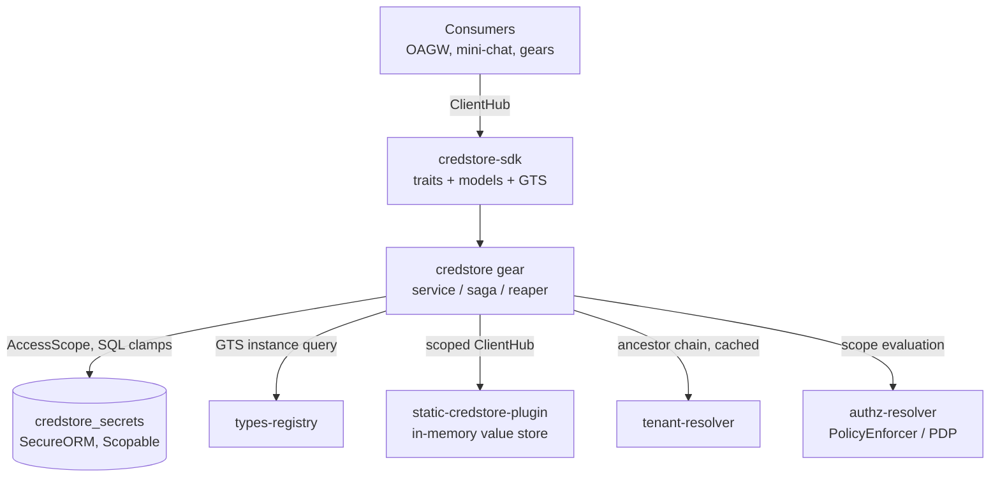
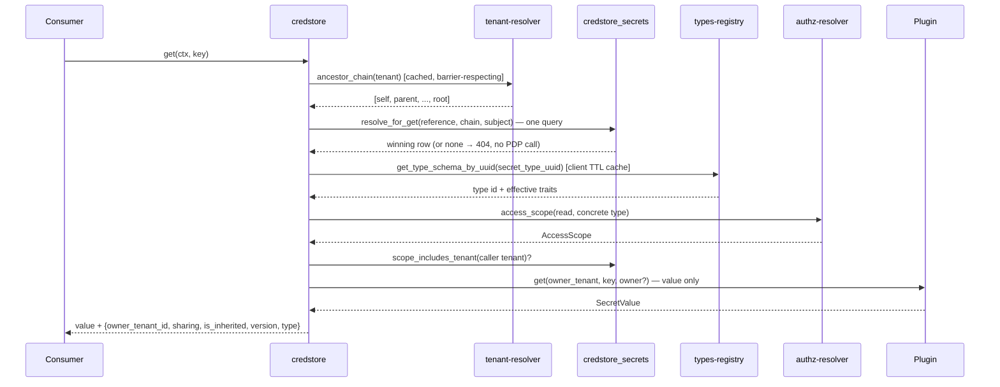
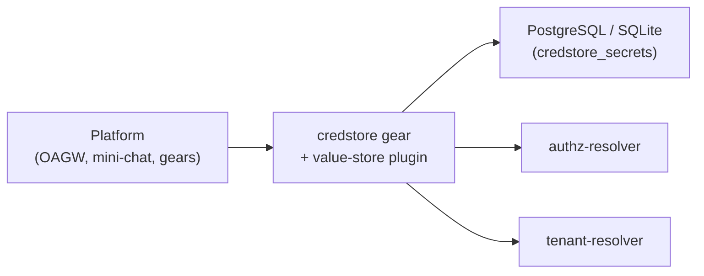

# Technical Design — CredStore


<!-- toc -->

- [1. Architecture Overview](#1-architecture-overview)
  - [1.1 Architectural Vision](#11-architectural-vision)
  - [1.2 Architecture Drivers](#12-architecture-drivers)
  - [1.3 Architecture Layers](#13-architecture-layers)
- [2. Goals / Non-Goals](#2-goals--non-goals)
  - [2.1 Goals](#21-goals)
  - [2.2 Non-Goals](#22-non-goals)
- [3. Principles & Constraints](#3-principles--constraints)
  - [3.1 Design Principles](#31-design-principles)
  - [3.2 Constraints](#32-constraints)
- [4. Technical Architecture](#4-technical-architecture)
  - [4.1 Domain Model](#41-domain-model)
  - [4.2 Component Model](#42-component-model)
  - [4.3 API Contracts](#43-api-contracts)
  - [4.4 External Interfaces & Protocols](#44-external-interfaces--protocols)
  - [4.5 Service-to-Service Pattern](#45-service-to-service-pattern)
  - [4.6 Interactions & Sequences](#46-interactions--sequences)
  - [4.7 Database schemas & tables](#47-database-schemas--tables)
  - [4.8 Deployment Topology](#48-deployment-topology)
  - [4.9 Technology Stack](#49-technology-stack)
  - [4.10 Value-Fingerprint Fence](#410-value-fingerprint-fence)
- [5. Secret Types (GTS-Based, Registry-Driven)](#5-secret-types-gts-based-registry-driven)
  - [5.1 Concept](#51-concept)
  - [5.2 Type Traits](#52-type-traits)
  - [5.3 Built-in Type Catalog (Registry Seeds)](#53-built-in-type-catalog-registry-seeds)
  - [5.4 Enforcement Points](#54-enforcement-points)
  - [5.5 Storage & API Changes](#55-storage--api-changes)
- [6. Secret Lifecycle & Sagas](#6-secret-lifecycle--sagas)
  - [6.1 Status Model](#61-status-model)
  - [6.2 Provisioning Saga](#62-provisioning-saga)
  - [6.3 Deprovisioning Saga](#63-deprovisioning-saga)
  - [6.4 Reaper](#64-reaper)
- [7. Risks / Trade-offs](#7-risks--trade-offs)
  - [7.1 Architectural Trade-offs](#71-architectural-trade-offs)
  - [7.2 Security and Performance Risks](#72-security-and-performance-risks)
- [8. Migration Plan](#8-migration-plan)
- [9. Open Questions](#9-open-questions)
- [10. Additional context](#10-additional-context)
  - [Plugin Registration](#plugin-registration)
  - [Configuration](#configuration)
  - [Error Mapping](#error-mapping)
  - [Observability](#observability)
- [11. Traceability](#11-traceability)

<!-- /toc -->

<!--
=============================================================================
TECHNICAL DESIGN DOCUMENT
=============================================================================
PURPOSE: Define HOW the system is built — architecture, components, APIs,
data models, and technical decisions that realize the requirements.

DESIGN IS PRIMARY: DESIGN defines the "what" (architecture and behavior).
ADRs record the "why" (rationale and trade-offs) for selected design
decisions; ADRs are not a parallel spec, it's a traceability artifact.

SCOPE:
  ✓ Architecture overview and vision
  ✓ Design principles and constraints
  ✓ Component model and interactions
  ✓ API contracts and interfaces
  ✓ Data models and database schemas
  ✓ Technology stack choices

NOT IN THIS DOCUMENT (see other templates):
  ✗ Requirements → PRD.md
  ✗ Detailed rationale for decisions → ADR/
  ✗ Step-by-step implementation flows → features/

DESIGN LANGUAGE:
  - Be specific and clear; no fluff, bloat, or emoji
  - Reference PRD requirements using `cpt-cf-credstore-fr-{slug}` IDs
  - Sections marked **Planned** describe target design not yet implemented;
    everything else describes the shipped implementation.
=============================================================================
-->

## 1. Architecture Overview

### 1.1 Architectural Vision

CredStore follows the ToolKit Gear + Plugins pattern: a **stateful gear** (`credstore`) owns all secret *metadata* (identity, sharing, ownership, lifecycle status, version) in its own database table, enforces authorization and hierarchical resolution, and exposes the public API; backend **plugins** are pure per-tenant *value stores* selected at runtime by GTS vendor configuration. The backend stores the secret value only — it carries no metadata schema, no sharing semantics, and no policy.

The SDK crate (`credstore-sdk`) defines two trait boundaries: `CredStoreClientV1` for consumers and `CredStorePluginClientV1` for backend implementations. Consumers depend only on the gear trait and never interact with plugins directly, which allows runtime backend selection without changing consumer code.

Because metadata is local, hierarchical resolution (the walk-up that searches for secrets across tenant ancestors) is a **single indexed SQL query** over the metadata table followed by at most **one** backend read for the winning row. Writes are **compensating sagas** over the metadata row and the backend value, made crash-safe by an explicit lifecycle status and a periodic reaper.

Authorization is delegated to the platform PDP (`authz-resolver`) via `PolicyEnforcer`: each operation evaluates an `AccessScope` that is enforced **in SQL** through SecureORM clamps on the metadata table. Tenant isolation is therefore enforced at the data layer, consistent with the rest of the platform.

### 1.2 Architecture Drivers

#### Functional Drivers

| Requirement | Design Response |
|-------------|-----------------|
| `cpt-cf-credstore-fr-put-secret` | Write saga: insert `provisioning` metadata row → plugin `put` (value only) → mark `active`; overwrite path is backend-first, then version bump |
| `cpt-cf-credstore-fr-get-secret` | Single SQL resolution over the ancestor chain, then one plugin `get` for the winning row |
| `cpt-cf-credstore-fr-delete-secret` | Deprovisioning saga: mark `deprovisioning` → backend delete → row delete (§6.3) |
| `cpt-cf-credstore-fr-tenant-scoping` | Gear derives tenant from `SecurityContext.subject_tenant_id()`; own-tenant gate + SecureORM scope clamp |
| `cpt-cf-credstore-fr-sharing-modes` | `sharing` column in the gear metadata table; partial unique indexes let private and tenant/shared coexist under one reference |
| `cpt-cf-credstore-fr-authz-pdp` | PDP `AccessScope` per operation (`read`/`write`/`delete` on the secret GTS resource type), enforced in SQL; fail-closed |
| `cpt-cf-credstore-fr-optimistic-concurrency` | Monotonic `version` column; `GET` returns a strong generation-bound `ETag` (`"<id>.<version>"`, §4.10); `PUT`/`DELETE` require `If-Match` (a validator or `*`) |
| `cpt-cf-credstore-fr-secret-types` | GTS-based secret types with enforceable traits (§5) |
| `cpt-cf-credstore-fr-deprovisioning` | `deprovisioning` status + compensating delete saga swept by the reaper (§6.3) |

#### NFR Allocation

| NFR ID | NFR Summary | Allocated To | Design Response | Verification Approach |
|--------|-------------|--------------|-----------------|----------------------|
| `cpt-cf-credstore-nfr-confidentiality` | Secret values never in logs or caches | SDK + gear + plugins | `SecretValue` wrapper with redacting `Debug`/`Display` and zeroize-on-drop; hand-written redacted `Debug` on REST DTOs; `Cache-Control: no-store` on `GET`; no lossy UTF-8 decode | Unit tests on redaction; code review |
| `cpt-cf-credstore-nfr-tenant-isolation` | No cross-tenant access outside PDP scope | Gear + repo | Scope clamps in SQL; own-tenant gate with `cross_tenant_denied` metric; barrier-respecting ancestor chain | Repo/service tests incl. barrier and scope cases |
| `cpt-cf-credstore-nfr-observability` | Operational visibility | Gear | OpenTelemetry metrics: walk-up depth, read outcome, dependency timings, saga rollback/reap counters, inventory gauge | Metrics unit tests |

#### Key ADRs

| ADR ID | Decision Summary |
|--------|------------------|
| `cpt-cf-credstore-adr-stateful-gear` | Stateful gear, value-only backend: the gear owns the `credstore_secrets` metadata table (identity, sharing, ownership, lifecycle status, version); the backend plugin stores only the value ([ADR-0001](./ADR/0001-cpt-cf-credstore-adr-stateful-gear.md)) |
| `cpt-cf-credstore-adr-deprovisioning-saga` | Delete is a saga symmetric to provisioning: a `deprovisioning` status holds the unique name until backend cleanup completes; stuck rows are swept by the reaper ([ADR-0002](./ADR/0002-cpt-cf-credstore-adr-deprovisioning-saga.md)) |
| `cpt-cf-credstore-adr-value-fingerprint-fence` | Value-fingerprint fence + generation-bound ETag: the gear stamps `value_fp = HMAC(fence_key, value)` in the same write as `sharing` and verifies it on read (fail-closed 404 on mismatch), and binds the strong ETag to `<row-id>.<version>`; closes the crosswise-PUT cross-tenant disclosure and the recreate ABA lost-update ([ADR-0003](./ADR/0003-cpt-cf-credstore-adr-value-fingerprint-fence.md)) |

### 1.3 Architecture Layers

```
┌───────────────────────────────────────────────────────────────┐
│                Consumers (OAGW, mini-chat, gears)             │
├───────────────────────────────────────────────────────────────┤
│  credstore-sdk    │ Public API traits, models, errors, GTS    │
├───────────────────────────────────────────────────────────────┤
│  credstore        │ PDP authz, resolution, write sagas, REST, │
│  (stateful)       │ reaper, metrics — owns credstore_secrets  │
├───────────────────────────────────────────────────────────────┤
│  Plugins          │ Pure per-tenant value stores              │
│  ┌────────────────────────────┐  ┌──────────────────────────┐ │
│  │ static-credstore-plugin    │  │ production vaults        │ │
│  │ (in-memory, dev/test)      │  │ (future: external store, │ │
│  │                            │  │  OS keychain, KMS-backed)│ │
│  └────────────────────────────┘  └──────────────────────────┘ │
├───────────────────────────────────────────────────────────────┤
│  Platform deps    │ authz-resolver (PDP), tenant-resolver,    │
│                   │ types-registry (GTS), toolkit-db          │
└───────────────────────────────────────────────────────────────┘
```

| Layer | Responsibility | Technology |
|-------|---------------|------------|
| SDK | Public and plugin trait definitions, models, errors, GTS type declarations | Rust crate (`credstore-sdk`) |
| Gear | PDP authorization, hierarchical resolution, sharing enforcement, write sagas, lifecycle reaper, plugin selection, REST API | Rust crate (`credstore`), Axum, SeaORM/SecureORM |
| Plugins | Backend-specific secret **value** storage (per-tenant key-value CRUD; no policy, no hierarchy, no metadata) | Rust crates |
| Platform | Policy decisions (PDP), tenant hierarchy, plugin discovery | authz-resolver, tenant-resolver, types-registry |

## 2. Goals / Non-Goals

### 2.1 Goals

- Provide secure, hierarchical secret storage for platform gears and tenant administrators
- Enable flexible sharing modes: `private` (owner-only), `tenant` (tenant-wide, default), `shared` (hierarchical)
- Support service-to-service secret retrieval (e.g., OAGW retrieving secrets on behalf of customer tenants)
- Enforce authorization via the platform PDP with SQL-level scope clamps (real tenant isolation at the data layer)
- Make writes crash-safe and self-healing (saga + reaper), and reads race-free against half-written secrets
- Enforce optimistic concurrency (version / `ETag` / mandatory `If-Match`) for lost-update detection — every update/delete states its concurrency stance; creation is the only preconditionless write
- Honour platform tenant-isolation barriers during hierarchical resolution
- Support multiple backend value stores via plugin architecture with GTS-based runtime selection
- Ensure secret values never appear in logs, error messages, debug traces, or intermediary caches
- Enable secret shadowing: child tenants can override parent credentials without breaking existing references
- Classify secrets by GTS-based *secret types* with enforceable traits (§5)
- Symmetric, crash-safe deletion via a `deprovisioning` saga (§6.3)

### 2.2 Non-Goals

The following capabilities are explicitly out of scope:

- **Granular ACL beyond hierarchical**: fine-grained per-secret ACLs (role- or attribute-based) are out of scope. The three-tier sharing model plus PDP scope covers primary use cases.
- **Secret value history / rollback**: the `version` column supports optimistic locking only; previous values are not retained.
- **Secret rotation automation**: automatic rotation is out of scope. (Secret types may carry *advisory* rotation traits, §5.2 — enforcement/automation is future work.)
- **Direct end-user access**: unauthenticated or untrusted client access is out of scope.
- **Secret templates or composition**: dynamic secret generation or derivation is out of scope.
- **Hierarchical resolution in backends**: plugins are pure per-tenant value stores — all hierarchy, sharing, and policy logic lives in the gear.
- **Secret discovery / search**: listing or searching secrets is out of scope for v1.
- **MySQL support**: migrations target PostgreSQL and SQLite; MySQL fails fast with a typed error.

## 3. Principles & Constraints

### 3.1 Design Principles

#### Stateful Gear, Value-Only Backend

- [ ] `p1` - **ID**: `cpt-cf-credstore-principle-stateful-gear`

The gear owns all secret metadata in its own `credstore_secrets` table; the backend plugin stores the value only, keyed by `(tenant_id, key, key-class)` where the key class is `private-per-owner` (`owner_id = Some`) or `tenant` (`owner_id = None`). This removes any backend metadata-schema prerequisite, eliminates encoded-external-ID collision risk, and makes resolution and authorization a single transactional query.

#### Authorization via PDP, Enforced in SQL

- [ ] `p1` - **ID**: `cpt-cf-credstore-principle-authz-pdp`

Every operation evaluates a PDP `AccessScope` for its action (`read`, `write`, `delete`) on the secret resource type (`gts.cf.core.credstore.secret.v1~`) and enforces that scope in SQL through SecureORM clamps on the metadata table. Both read and write paths additionally gate on an explicit own-tenant invariant (`scope_includes_tenant`) and emit a `cross_tenant_denied` metric. Out-of-scope access is fail-closed and surfaces as the canonical 404 (anti-enumeration) or 403. Plugins MUST NOT implement authorization.

#### Tenant from SecurityContext

- [ ] `p1` - **ID**: `cpt-cf-credstore-principle-tenant-from-ctx`

The operating tenant is always derived from `SecurityContext.subject_tenant_id()`, and the owner from `SecurityContext.subject_id()`. This reduces API surface, prevents misuse, and aligns with platform patterns. Service-to-service consumers (OAGW) construct a `SecurityContext` for the target tenant rather than passing tenant parameters.

#### Crash-Safe Writes (Saga + Reaper)

- [ ] `p1` - **ID**: `cpt-cf-credstore-principle-write-saga`

A write that spans the metadata table and the backend is a compensating saga with an explicit lifecycle status (§6). Every failure mode either rolls back, self-heals on retry, or is swept by the periodic reaper — a crash can never permanently wedge a reference or leak a readable half-written secret.

### 3.2 Constraints

#### No Secret Logging

- [ ] `p1` - **ID**: `cpt-cf-credstore-constraint-no-secret-logging`

Secret values MUST NOT appear in any log output, error messages, or debug traces. `SecretValue` implements redacting `Debug`/`Display` and zeroizes on drop; request/response DTOs carry hand-written redacted `Debug`; the `GET` response sets `Cache-Control: no-store`; non-UTF-8 values are rejected with a typed error rather than lossily decoded.

#### Canonical Error Model

- [ ] `p1` - **ID**: `cpt-cf-credstore-constraint-canonical-errors`

All trait-boundary and REST errors follow the platform canonical error model ([ADR 0005](../../../docs/arch/errors/ADR/0005-cpt-cf-adr-sdk-canonical-projection.md)): domain errors map to canonical categories with stable `reason` codes (e.g. `OPTIMISTIC_LOCK_FAILURE`), and the wire strips internal diagnostics.

## 4. Technical Architecture

### 4.1 Domain Model

**Technology**: Rust structs (`#[domain_model]`)

**Core Entities**:

| Entity | Description |
|--------|-------------|
| `SecretRef` | Validated secret reference key (e.g., `partner-openai-key`). **Format**: `[a-zA-Z0-9_-]+`, 1–255 chars; validated on construction and re-validated by a DB `CHECK`. |
| `SecretValue` | Opaque byte wrapper (`Vec<u8>`) for secret data. Redacting `Debug`/`Display`, zeroize-on-drop, deliberately not `Serialize`/`Deserialize`. |
| `SharingMode` | Enum: `Private`, `Tenant` (default), `Shared` — controls access scope within the tenant hierarchy. |
| `OwnerId` | UUID identifying the creator (`SecurityContext.subject_id()`) — access control key for `Private` mode. |
| `SecretStatus` | Lifecycle status of the metadata row: `Provisioning` (1), `Active` (2), `Deprovisioning` (3) (§6). Only `Active` rows are visible to resolution. |
| `SecretRow` | Metadata row: `{ id, tenant_id, reference, sharing, owner_id, status, version, value_fp, fp_key_id }`. `value_fp` is the internal value-fingerprint fence (§4.10), never serialized to the wire. |
| `NewSecret` | Insert shape for the create saga (always carries the fence fingerprint of the value being written). |
| `WritePrecondition` | Parsed `If-Match`, mandatory on update/delete: `Exists` (`*`, explicit last-writer-wins) or `Version { id, version }` (quoted `"<id>.<version>"`, generation-bound). |
| `GetSecretResponse` | SDK read result: `{ value, id, owner_tenant_id, sharing, is_inherited, version }`; `(id, version)` is the strong-validator pair. |
| `SecretType` | Catalog-resolved secret type binding the enforceable traits (§5); immutable per secret. |

**Relationships & uniqueness**:

- A secret belongs to exactly one tenant (`tenant_id`) and has exactly one owner (`owner_id`).
- For `tenant`/`shared` modes, `(tenant_id, reference)` is unique; for `private` mode, `(tenant_id, reference, owner_id)` is unique. Both are enforced as **partial unique indexes** (§4.7), which lets one private secret per owner and one tenant/shared secret **coexist** under the same reference.
- The uniqueness indexes ignore `status`, so an in-flight (`provisioning`) row holds the reference; failed sagas are rolled back or reaped to un-wedge it.

**Sharing-mode access control** (evaluated during SQL resolution):

| Mode | Visible to | Inherited by descendants? |
|------|-----------|---------------------------|
| `private` | Only where `owner_id` equals the caller's subject id; wins over non-private at the same tenant level | No |
| `tenant` (default) | Only the owning tenant | No |
| `shared` | The owning tenant **and** its descendants, bounded by isolation barriers (§4.6) | Yes (barrier-bounded) |

`sharing` is a **visibility** mode (who may read the secret), not a quota/limit that composes as `min(parent, child)`; resolution picks the closest accessible secret up the ancestor chain, which is how a child tenant *shadows* a parent's `shared` secret under the same reference.

### 4.2 Component Model



**Components**:

- [ ] `p1` - **ID**: `cpt-cf-credstore-component-sdk`

`credstore-sdk` — trait definitions (`CredStoreClientV1`, `CredStorePluginClientV1`), models, canonical `CredStoreError`, and the GTS declarations: the plugin spec type (`gts.cf.toolkit.plugins.plugin.v1~cf.core.credstore.plugin.v1~`) and the secret resource type (`gts.cf.core.credstore.secret.v1~`, exported as `SECRET_RESOURCE_TYPE` — the single source of truth pinned by unit tests).

- [ ] `p1` - **ID**: `cpt-cf-credstore-component-gear`

`credstore` — the stateful gear. Layers: `api/rest` (Axum routes, DTOs with redacted `Debug`, `If-Match` parsing), `domain` (service with get/put/ delete sagas, authz scope evaluation, resolver port, metrics port, plugin selector port), `infra` (SecureORM repo, migrations, tenant-resolver adapter with TTL+LRU ancestor cache, GTS plugin selector, OTel metrics, canonical error mapping). Declares `deps = [authz-resolver, tenant-resolver, types-registry]` and capabilities `system, db, rest, stateful`; its lifecycle entry runs the reaper loop (§6.4).

- [ ] `p1` - **ID**: `cpt-cf-credstore-component-static-plugin`

`static-credstore-plugin` — in-memory per-tenant value store for development and testing, optionally seeded from YAML config, writable at runtime. Registers its GTS instance and scoped `CredStorePluginClientV1` in ClientHub.

- [ ] `p2` - **ID**: `cpt-cf-credstore-component-production-backend`

Production value-store backends (external secret vault, OS keychain, KMS-backed store) — future plugins implementing the same `CredStorePluginClientV1` contract. Not part of the current codebase.

**Interactions**:

- Consumer → Gear: `CredStoreClientV1` via ClientHub (in-process) or REST.
- Gear → Repo: all metadata reads/writes clamped by the PDP `AccessScope` (SecureORM `Scopable`).
- Gear → Plugin: `CredStorePluginClientV1` via scoped ClientHub; the plugin is resolved lazily by GTS instance query filtered by the configured `vendor`.
- Gear → tenant-resolver: ancestor chain (`BarrierMode::Respect`), cached in-process with TTL + LRU eviction.
- Gear → PDP: `PolicyEnforcer.access_scope_with` per operation; capability advertisement depends on `hierarchy.tenant_closure_colocated` (§4.4).

### 4.3 API Contracts

- [ ] `p1` - **ID**: `cpt-cf-credstore-interface-clienthub`

**Technology**: Rust traits (ClientHub) + REST/OpenAPI

#### ClientHub API (in-process)

`CredStoreClientV1` (public consumer API):

| Method | Signature | Description |
|--------|-----------|-------------|
| `get` | `(ctx: &SecurityContext, key: &SecretRef) → Result<Option<GetSecretResponse>, CredStoreError>` | Hierarchical read. `Ok(None)` covers both "does not exist" and "inaccessible" (single 404 surface, anti-enumeration). |
| `put` | `(ctx, key, value: SecretValue, sharing: SharingMode, precondition: WritePrecondition) → Result<(), CredStoreError>` | Update within the target sharing class; never creates. The mandatory precondition is `Matches { id, version }` (CAS for read-modify-write) or `Exists` (explicit last-writer-wins for rotation/provisioning and fence-heal). |
| `create` | `(ctx, key, value, sharing) → Result<(), CredStoreError>` | Create-only; `Conflict` if a secret of the same sharing class exists (the 409 path behind REST `POST`). The only preconditionless write. |
| `delete` | `(ctx, key, precondition: WritePrecondition) → Result<(), CredStoreError>` | Delete the caller's own-tenant secret, guarded by the mandatory precondition. |

`CredStorePluginClientV1` (backend SPI — pure value store):

| Method | Signature | Description |
|--------|-----------|-------------|
| `get` | `(ctx, tenant_id, key, owner_id: Option<&OwnerId>) → Result<Option<SecretValue>, CredStoreError>` | `owner_id = Some` selects the owner's private key class; `None` the tenant key class. Returns the value only. |
| `put` | `(ctx, tenant_id, key, value, owner_id: Option<&OwnerId>) → Result<(), CredStoreError>` | Store the value for the addressed key class. |
| `delete` | `(ctx, tenant_id, key, owner_id: Option<&OwnerId>) → Result<(), CredStoreError>` | Delete the value; `NotFound` is treated as success by the gear (idempotent). |

**Design rationale**: the plugin returns **no metadata** — sharing, ownership, inheritance, and version all come from the gear's metadata row resolved *before* the backend is touched. This keeps every policy decision in one place and backends trivially simple.

#### 4.3.1 REST API (Gear)

Routes are registered under `/credstore/v1` (served behind the platform API gear under its public prefix, e.g. `/cf/credstore/v1/...`). All routes are authenticated; errors use the canonical `Problem` envelope.

The machine-readable API is generated from the handlers: the platform-wide OpenAPI document lives at [`docs/api/api.json`](../../../docs/api/api.json) (regenerate with `make openapi`), and a credstore-scoped rendering is at [`openapi.yaml`](./api/openapi.yaml).

| Method | Path | Success | Description |
|--------|------|---------|-------------|
| `POST` | `/credstore/v1/secrets` | `201` + `Location` | Create-only; `409` if the same sharing class already holds the reference |
| `PUT` | `/credstore/v1/secrets/{ref}` | `204` | Update only (never creates); `If-Match` mandatory |
| `GET` | `/credstore/v1/secrets/{ref}` | `200` + `ETag`, `Cache-Control: no-store` | Hierarchical read |
| `DELETE` | `/credstore/v1/secrets/{ref}` | `204` | Delete own secret; `If-Match` mandatory |

**Create Secret Request (`POST`)**:
```json
{
  "reference": "partner-openai-key",
  "value": "demo-secret-value-123",
  "sharing": "tenant",
  "type": "gts.cf.core.credstore.secret.v1~cf.core.credstore.api_key.v1~"
}
```

**Update Secret Request (`PUT`)** — same body without `reference`. `sharing` values: `"private"`, `"tenant"` (default), `"shared"`. `type` (optional): the secret type's **full GTS type id** (§5.5), built-in or custom; defaults to the generic type. `expires_at` (optional, RFC 3339) for expirable types.

**Field notes**:

- `reference` is a **caller-chosen opaque label**, not a GTS id — `^[A-Za-z0-9_-]+$`, 1–255 chars. It is deliberately free-form because it is user-facing (a human-picked name such as `partner-openai-key`); requiring a GTS identifier would be too restrictive. Uniqueness is per sharing class within one tenant (§4.7).
- `value` is carried over REST as a **UTF-8 JSON string**, but is stored as raw **bytes** end-to-end, so binary secrets (e.g. a DER certificate or a raw key) are supported — for secret types whose `utf8_only` trait is `false` (currently `generic`) and via the **SDK/ClientHub**, which carries bytes. Over REST a binary value must be text-encoded by the caller (e.g. PEM, base64). A PEM certificate is UTF-8 text and works on any type; see the `utf8_only` trait (§5.3).

**Get Secret Response (200)**:
```json
{
  "value": "demo-secret-value-456",
  "metadata": {
    "owner_tenant_id": "22222222-2222-2222-2222-222222222222",
    "sharing": "shared",
    "is_inherited": true,
    "version": 3,
    "type": "gts.cf.core.credstore.secret.v1~cf.core.credstore.api_key.v1~"
  }
}
```

- `owner_tenant_id`: tenant that owns the resolved secret (differs from the requesting tenant when inherited)
- `is_inherited`: `true` when resolved from an ancestor
- `version`: monotonic per-generation version; the strong `ETag` is the generation-bound pair `"<row-id>.<version>"` (the row UUID is minted fresh for every recreated secret, so validators never repeat across delete+recreate — no ABA lost update)
- `type`: the secret type's full GTS type id (plus `expires_at` when set)

**Optimistic concurrency**: `PUT` and `DELETE` **require** `If-Match` — either `*` (target must exist; an explicit last-writer-wins overwrite for rotation/provisioning flows that hold no version, and the healing path for a fence-poisoned reference whose `GET` fails closed) or `If-Match: "<id>.<version>"` (both the generation id and the version must match the current row). Every write states its concurrency stance; there are no unconditional overwrites, and a `PUT` never creates (creation is `POST` only). The precondition is checked before the backend write *and* re-enforced as a `version = ?` SQL filter on the metadata commit (the id is already the UPDATE key). A mismatch — including a validator minted for an earlier generation of a recreated secret — surfaces as canonical `Aborted` / **409** with reason `OPTIMISTIC_LOCK_FAILURE` (the canonical model has no 412; 409 is the deliberate platform-correct status). A malformed `If-Match` (including a bare quoted version) is a 400 (`INVALID_IF_MATCH`); a missing `If-Match` is a 400 with its own reason (`IF_MATCH_REQUIRED` — no 428 in the canonical model); a precondition on a non-existent target is a 409.

**Error Responses**:

| Status | Canonical category | Scenario |
|--------|--------------------|----------|
| 400 | `InvalidArgument` | Invalid `reference` format, malformed `If-Match` (`INVALID_IF_MATCH`), missing `If-Match` on `PUT`/`DELETE` (`IF_MATCH_REQUIRED`), unsupported sharing transition (private ↔ tenant/shared) |
| 401 | `Unauthenticated` | Invalid or missing token |
| 403 | `AccessDenied` | PDP denies the action, or the caller's scope excludes their own tenant |
| 404 | `NotFound` | Secret not found **or** inaccessible (anti-enumeration: always 404, never 403, for per-secret access) |
| 409 | `AlreadyExists` / `Aborted` | `POST` conflict; `If-Match` version conflict (`OPTIMISTIC_LOCK_FAILURE`) |
| 503 | `ServiceUnavailable` | PDP evaluation failure, types-registry outage / stored secret type unresolvable (§5.4), no storage plugin registered (with stable detail, no `retry_after`), backend outage (with `Retry-After` when hinted) |
| 500 | `Internal` | Invariant violations, non-UTF-8 stored value on `GET` (binary written via the SDK cannot cross the JSON transport); diagnostic stripped from the wire |

### 4.4 External Interfaces & Protocols

#### PDP (authz-resolver)

- [ ] `p1` - **ID**: `cpt-cf-credstore-design-interface-pdp`

**Type**: platform service (in-process client via ClientHub)

Every operation calls `PolicyEnforcer.access_scope_with(ctx, resource, action, …)` **once**, with the `owner_tenant_id` PEP property and `action ∈ {read, write, delete}`. The `resource` is always the secret's **full concrete type** — including `generic` (`…secret.v1~cf.core.credstore.generic.v1~`) — so policies can target any type without a separate base-type gate (§5.4). The type is known before the evaluation via a prefetch (post-resolution on read, post-lookup on overwrite/delete, from the requested/default type on create) followed by a types-registry resolution of the stored `secret_type_uuid` to its GTS type id (§5.4); the returned `AccessScope` is enforced in SQL. Enforcement is fail-closed: `Denied`/`CompileFailed` → 403 (404 on read, anti-enumeration), `EvaluationFailed` → 503.

**Capability advertisement** (config `hierarchy.tenant_closure_colocated`): when the shared tenant-closure table is co-located with the credstore database, the gear advertises `Capability::TenantHierarchy` and the PDP emits a structured `InTenantSubtree` predicate resolved by a closure subquery. Otherwise (default) the PDP pre-expands the subtree into a flat `In` list the gear enforces with no local closure access (degraded but correct mode). Co-located concretely means credstore and Account Management share one physical database: `tenant_closure` stays owned and migrated by AM, and credstore's DB role only needs `SELECT` on it. Sharing one database is the simplest way to satisfy the actual contract behind the flag — a correct and fresh `tenant_closure` queryable through credstore's own connection. A separate credstore database can enable the same capability when an external mechanism (e.g. logical replication / CDC of the AM-owned table) keeps a local copy populated and consistent: credstore never writes the table and does not track its freshness, so that pipeline owns integrity — closure staleness translates directly into stale subtree-authorization decisions. A standalone credstore database (no such table) is the default-supported deployment.

#### Tenant hierarchy (tenant-resolver)

- [ ] `p1` - **ID**: `cpt-cf-credstore-design-interface-tenant-resolver`

The gear fetches the requesting tenant's ancestor chain (self first, root last) with `BarrierMode::Respect`, so a `shared` secret is **not** inherited across a `self_managed` isolation barrier. The chain carries no caller-specific data and is cached in-process with a TTL (`hierarchy.ancestor_cache_ttl_secs`, default 300 s) and LRU eviction.

#### Secret-type resolution & plugin discovery (types-registry)

- [ ] `p1` - **ID**: `cpt-cf-credstore-design-interface-gts`

The types-registry is a hard `deps` of the gear (fail-closed `init` when `TypesRegistryClient` is absent from ClientHub) and serves two roles:

**Secret-type resolution** (§5): every operation resolves the secret's stored type UUID via `get_type_schema_by_uuid` — one lookup against the registry client's built-in TTL cache; credstore adds no cache of its own, so type re-registrations take effect within the client TTL. The resolver (`GtsSecretTypeResolver`, mirroring AM's `GtsTenantTypeChecker`) verifies the schema descends from the secret base type (`gts.cf.core.credstore.secret.v1~`), merges the chain's effective traits (`x-gts-traits`, leaf wins, base fills defaults), and deserializes them into `SecretTypeTraits`. Failure mapping is fail-closed: an unregistered/non-secret type is `UNKNOWN_SECRET_TYPE` (400) when the caller named it, 503 when it came from a stored row (deregistration is an operational inconsistency, not a caller error); registry outage / timeout (2 s probe) / malformed traits → 503. Calls are recorded on the `types_registry` dependency-health metrics.

**Plugin discovery**: plugins register GTS instances derived from the plugin spec type (`…~cf.core.credstore.plugin.v1~`). The gear lazily queries instances by type-id prefix, filters by the configured `vendor`, picks the highest-priority active instance, and resolves its scoped `CredStorePluginClientV1` from ClientHub. No plugin available surfaces as a non-retryable 503 ("no storage plugin registered").

#### Sharing-mode transitions

`tenant ↔ shared` is an in-place metadata update (same unique-index class). `private ↔ (tenant|shared)` crosses key classes; since private and non-private secrets coexist by design, such a "transition" has no atomic meaning and is **rejected** as `UnsupportedTransition` (400) rather than performed non-atomically. Writes always address the row of their own sharing class, so a write of one class never affects the other.

### 4.5 Service-to-Service Pattern

Two integration patterns share one API:

1. **Self-Service**: gears and tenant admins operate on their own tenant; tenant and owner derive from their `SecurityContext`.
2. **Service-to-Service**: authorized service accounts (OAGW) act on behalf of arbitrary tenants by constructing a `SecurityContext` for the target tenant (S2S client-credentials exchange) and calling the same `get`.

**Flow (OAGW)**: OAGW builds a `SecurityContext` with the target tenant, calls `get(ctx, key)`; the PDP decides whether that subject may `read` secrets in that tenant's scope; resolution and metadata behave identically to self-service. Audit/metrics record the caller subject and target tenant. OAGW consumes credstore only through the SDK client — there is no separate integration path.

**Provisioning note**: with the stateful gear a provider's backend secret may not exist at startup (secrets are created at runtime through the credstore API; there is no startup seed). Consumers that provision infrastructure from secrets at boot (e.g. mini-chat registering OAGW upstreams) treat a failed secret lookup as non-fatal: the affected provider is skipped and remains unavailable until its secret is provisioned.

### 4.6 Interactions & Sequences

#### Hierarchical read

- [ ] `p1` - **ID**: `cpt-cf-credstore-seq-hierarchical-read`



**Resolution query semantics** (single indexed query over `idx_credstore_lookup`): filter by `reference`, tenant ∈ ancestor chain, `status = active`, and sharing-class visibility (`private` rows only for the caller's `owner_id`; `tenant` rows only for the requesting tenant; `shared` rows for any chain member). The winner is picked in-process: **closest tenant wins; `private` beats non-private at the same level**. The backend is read once, for the winning row only. Walk-up depth and read outcome (own/inherited/miss) are recorded as metrics.

**Shadowing**: a child's accessible secret always wins over an ancestor's; an *inaccessible* child secret (e.g. someone else's private) does not block fallback to an ancestor's shared secret.

#### Write (create saga) — see §6.2

- [ ] `p1` - **ID**: `cpt-cf-credstore-seq-write-saga`

The full step-by-step sequence, failure handling, and the overwrite path are described in §6.2 Provisioning Saga.

#### Delete (deprovisioning saga) — see §6.3

### 4.7 Database schemas & tables

The gear owns one table, `credstore_secrets` (migration `m0001_initial_schema`; raw per-backend SQL to preserve `CHECK` and partial-index semantics; PostgreSQL and SQLite; MySQL fails fast):

```sql
CREATE TABLE credstore_secrets (
    id         UUID PRIMARY KEY,
    tenant_id  UUID NOT NULL,
    reference  TEXT NOT NULL CHECK (length(reference) BETWEEN 1 AND 255),
    sharing    SMALLINT NOT NULL CHECK (sharing IN (1,2,3)),  -- private/tenant/shared
    owner_id   UUID NOT NULL,
    status     SMALLINT NOT NULL CHECK (status IN (1,2,3)),   -- provisioning/active/deprovisioning
    created_at TIMESTAMPTZ NOT NULL DEFAULT now(),
    updated_at TIMESTAMPTZ NOT NULL DEFAULT now(),
    version    BIGINT NOT NULL DEFAULT 1,
    secret_type_uuid UUID NOT NULL DEFAULT '<generic type v5 uuid>', -- deterministic v5 of the GTS type id
    expires_at TIMESTAMPTZ NULL,                                     -- expirable types only
    value_fp   BYTEA NULL,      -- value-fingerprint fence: HMAC-SHA256(fence_key, value); internal-only
    fp_key_id  SMALLINT NULL,   -- fence-key id the fp was computed under (keyring groundwork)
    CHECK ((value_fp IS NULL) = (fp_key_id IS NULL))  -- NULL only on out-of-band seeded rows
);
-- coexistence of a private and a tenant/shared secret under one reference:
CREATE UNIQUE INDEX uq_credstore_nonprivate ON credstore_secrets (tenant_id, reference)           WHERE sharing <> 1;
CREATE UNIQUE INDEX uq_credstore_private    ON credstore_secrets (tenant_id, reference, owner_id) WHERE sharing = 1;
-- walk-up resolution, reaper sweep (all non-active rows), expiry sweep:
CREATE INDEX idx_credstore_lookup  ON credstore_secrets (reference, tenant_id, status);
CREATE INDEX idx_credstore_pending ON credstore_secrets (updated_at) WHERE status <> 2;
CREATE INDEX idx_credstore_expiry  ON credstore_secrets (expires_at) WHERE expires_at IS NOT NULL AND status = 2;
```

Created by the single `m0001_initial_schema` migration (§8). The table is a `Scopable` SecureORM entity — PDP scope clamps are applied to every query, which is what makes authorization enforceable in SQL.

### 4.8 Deployment Topology

The gear is a gear inside the platform process; it requires a database (PostgreSQL in production, SQLite in dev/e2e) via the platform DB provider, and exactly one registered value-store plugin.



Development/testing runs the in-memory `static-credstore-plugin`; production deployments substitute a real vault-backed plugin (future work) with no gear changes.

### 4.9 Technology Stack

| Layer | Technology | Rationale |
|-------|------------|-----------|
| Gear | Axum (REST), `#[toolkit::gear]` with `system, db, rest, stateful` capabilities | Platform standard |
| Persistence | SeaORM + SecureORM (`Scopable`), raw-SQL migrations | Scope clamps in SQL; partial unique indexes |
| AuthZ | `authz-resolver-sdk` `PolicyEnforcer` (PDP) | Platform policy plane |
| Hierarchy | `tenant-resolver-sdk` (`BarrierMode::Respect`) + TTL/LRU cache | Barrier-aware ancestor chains |
| Discovery & typing | `toolkit-gts` / `types-registry-sdk` | Vendor-based plugin selection; runtime secret-type resolution (uuid → type id + traits) |
| Observability | OpenTelemetry metrics (typed port) | Operational visibility |
| Serialization | `serde` | Platform standard |
| Errors | `thiserror` + toolkit canonical errors | Platform standard ([ADR 0005](../../../docs/arch/errors/ADR/0005-cpt-cf-adr-sdk-canonical-projection.md)) |

### 4.10 Value-Fingerprint Fence

> Decision: [ADR-0003](./ADR/0003-cpt-cf-credstore-adr-value-fingerprint-fence.md) (`cpt-cf-credstore-adr-value-fingerprint-fence`). Closes the cross-tenant disclosure of two crosswise concurrent last-writer-wins (`If-Match: *`) PUTs and the ABA lost-update of a recreated secret.

A secret is a **dual write**: the value goes to the external value-store backend (`plugin.put`), the metadata (`sharing`, `version`, `expires_at`) to `credstore_secrets`. No transaction spans both stores, so two concurrent last-writer-wins PUTs (`If-Match: *`) to the same reference can interleave crosswise and commit one caller's value under the other caller's sharing label — a durable cross-tenant disclosure when the surviving label is `shared`. The mandatory write precondition does not close this: `Exists` writers still race, a version-gated writer that crashes between the metadata commit and the backend write leaves the same cross-writer mismatch, and no API-level precondition can bind two transaction-less stores — only the read-side fence can. The platform's coordination primitives deliberately exclude fencing of external effects ([cluster ADR-002](../../system/cluster/docs/ADR/002-async-boundary-no-remote-in-critical-section.md): no fencing tokens, no remote calls in a lock's critical section; `coord` leases likewise), so the fence lives at the application layer, as that ADR prescribes.

**Mechanism.** Each row stores `value_fp = HMAC-SHA256(fence_key, value)` of the value its metadata was written for. Every write stamps it in the same atomic `touch`/insert as `sharing`; every read recomputes it from the value the backend returned and serves the value only when the row agrees, else fails closed as an anti-enumeration miss (404). Because the fingerprint and the sharing label are written by one writer in one UPDATE, a fingerprint match transitively proves the value and the metadata are from the same PUT — a value can never be served under a sharing label a different writer set. Metadata is not hashed into the fingerprint (the atomic write is what binds them).

**Fence key.** Deployment state, not configuration: auto-generated (OS RNG, 32 bytes) and stored in the value-store backend under the reserved entry `(tenant = nil, reference = "cfs-internal-fence-key", owner = None)`. It has no metadata row, so no API path resolves, overwrites, or deletes it (resolution requires a row; external callers always carry a real tenant). All replicas read the one shared entry; on a virgin deployment the first writer generates it (put-then-reread convergence). The service caches it in-process and, on a fingerprint mismatch, performs a one-shot re-read (a replica whose cached key went stale after a key re-creation self-heals before failing closed). Split knowledge: fingerprints live in the gear DB, the key with the values — a DB-only compromise yields HMACs under an unknown key (no offline dictionary attack), and backend compromise yields the plaintexts regardless, so the fence adds no attack surface.

**Failure semantics** are always fail-closed and self-healing: a half-completed overwrite (backend write committed, metadata `touch` failed, or vice-versa) leaves the row fingerprinting a different value than the backend holds, so reads 404 until a retried PUT lands both; a lost/replaced key makes fenced reads 404 (observable via `fence_verify{outcome="mismatch"}`) and re-PUT re-stamps each secret. The healing PUT uses `If-Match: *`: the poisoned read is a fail-closed 404, so no version validator can be obtained — which is exactly why the explicit `*` form remains part of the mandatory-precondition contract. No failure mode serves a value under mismatched metadata.

**Generation-bound validator.** The strong `ETag` is `"<row-id>.<version>"`. The row UUID is minted fresh per created secret, so a validator from a deleted-and-recreated secret's earlier generation never matches the new row even when the restarted version counters coincide (closing the ABA lost-update). `version` stays the per-generation optimistic-lock counter and the row-level CAS still gates on it (the id is already the UPDATE key).

**Out-of-band seeding.** A row provisioned directly in the DB with `value_fp = NULL` (value placed directly in the backend) is served on trust and its fingerprint backfilled — lazily on first read, or by the reaper's bounded sweep for rows nobody reads (both via a `value_fp IS NULL` CAS that never bumps the version). A re-seed of an existing row must reset `value_fp` to NULL in the same operation. This is the only path that produces a NULL fingerprint; API writes always stamp.

## 5. Secret Types (GTS-Based, Registry-Driven)

> Requirement: `cpt-cf-credstore-fr-secret-types`. Implemented: registry seeds in the SDK + runtime resolution (`SecretTypeResolver`), gear trait enforcement on the resolved traits (incl. the per-type PDP gate), UUID type column in `m0001_initial_schema`.

### 5.1 Concept

Today every secret is an opaque byte string with identical semantics. The platform, however, stores materially different kinds of secrets (LLM provider API keys consumed by OAGW, OAuth2 client credentials, personal tokens, certificates), and their handling rules differ — most importantly *whether a secret may be shared down the tenant hierarchy at all*.

A **secret type** is a GTS type derived from the credstore secret base type (GTS segments are `vendor.package.namespace.type.vN`, so the derived segment carries the type name directly), e.g. for the built-in types:

```
gts.cf.core.credstore.secret.v1~cf.core.credstore.<name>.v1~
```

Each type declares a set of **traits** — machine-readable behavioral properties the gear enforces uniformly. The **types-registry is the runtime source of truth** (mirroring tenant types in Account Management): the base type `SecretV1` carries the trait vocabulary as its `x-gts-traits-schema` (generated from `SecretTypeTraits`, closed to unknown keys), every registered type derived from it declares its `x-gts-traits` values against that shape, and the gear resolves a type's effective traits from the registry per operation (§5.4). The compiled-in SDK catalog (`credstore_sdk::SECRET_TYPE_CATALOG`) only **seeds** the built-in type schemas through the link-time inventory; unit tests pin the seeds to the catalog descriptors so the two views cannot drift.

**Adding a type requires no credstore release**: registering a GTS schema that descends from `gts.cf.core.credstore.secret.v1~` (with its `x-gts-traits`) makes the type immediately writable, trait-enforced, and addressable as a PDP resource type — enabling per-type RBAC (e.g., a role that may read `api-key` secrets but not `certificate` secrets) without new authorization machinery.

The type of a secret is chosen at creation (REST field `type`: the secret type's full GTS type id), defaults to `generic`, and is **immutable** for the lifetime of the secret (rejected with `TYPE_IMMUTABLE`, mirroring the private ↔ non-private rule).

### 5.2 Type Traits

| Trait | Type | Semantics (gear-enforced unless noted) |
|-------|------|-------------------------------------------|
| `allow_sharing` | list of `SharingMode` | Sharing modes permitted for secrets of this type. A `put`/`create` with a mode outside the list is rejected (400, `SHARING_NOT_ALLOWED_FOR_TYPE`) — including a disallowed mode change on update. The traits schema constrains entries to the `SharingMode` enum, so a typo fails at registration. |
| `value_schema` | embedded JSON Schema (optional) | Structural validation of the (JSON) value on write (400, `VALUE_SCHEMA_VIOLATION`); violation details never echo the value. Absent ⇒ opaque value. Carried in `x-gts-traits` like every other trait; the validator is compiled per write (schemas are dynamic; the registry client caches the resolution). A registered schema that fails to compile is a broken registration → 503, not 400. |
| `max_size_bytes` | integer (optional) | Upper bound on value size (400, `VALUE_TOO_LARGE`); absent ⇒ platform default only. |
| `expirable` | bool | Whether secrets of this type may carry `expires_at` (else 400, `EXPIRY_NOT_SUPPORTED_FOR_TYPE`; a past expiry is `EXPIRY_IN_THE_PAST`); expired secrets resolve as 404 (read-time SQL filter) and are moved into the deprovisioning saga by the reaper (§6.4). |
| `rotation_period_secs` | integer (optional, advisory) | Recommended rotation cadence; metadata-only — rotation automation stays a non-goal. |
| `utf8_only` | bool | Whether the value must be valid UTF-8 (400, `VALUE_NOT_UTF8`; only `generic` currently allows binary, reachable via the SDK). |

Trait values resolve through the GTS chain merge (`effective_traits`): leaf-declared values win, ancestors fill the rest — the base type declares generic values for every trait, so a derived type only states what it restricts. Traits are enforced in the gear domain layer at well-defined points (§5.4); plugins remain trait-agnostic value stores.

### 5.3 Built-in Type Catalog (Registry Seeds)

Built-in types seeded into the registry by the SDK (REST name → derived GTS segment uses `_`, e.g. `api-key` → `…~cf.core.credstore.api_key.v1~`):

| Type | `allow_sharing` | `value_schema` | Notes |
|------|-----------------|----------------|-------|
| `generic` | private, tenant, shared | — | Default; fully backward-compatible with existing secrets (binary allowed). |
| `api-key` | private, tenant, shared | — | Third-party provider keys (OpenAI etc.) — the core hierarchical-sharing use case (OAGW). |
| `personal-token` | **private only** | — ; `expirable` | Personal access tokens; the flagship `allow_sharing` restriction — can never be shared tenant-wide or inherited. |
| `oauth2-client` | tenant, shared | `{client_id, client_secret, [token_url, scopes]}` | Structured; consumed by OAGW OAuth2 client-credentials auth. |
| `basic-auth` | private, tenant, shared | `{username, password}` | Structured HTTP basic credentials. |
| `bearer-token` | private, tenant | — ; `expirable` | Short-lived tokens; expiry enforced on read. |
| `certificate` | tenant, shared | — ; `expirable`, `rotation_period_secs` = 90 d advisory | TLS material; `not_after` maps to `expires_at`. Format (PEM) checks deferred. |
| `ssh-key` | private, tenant | — | Deploy/automation keys. Format checks deferred. |
| `webhook-hmac` | tenant, shared | — | Webhook signing secrets shared with descendant integrations. |
| `connection-string` | tenant | — ; `max_size_bytes` = 4 KiB | DSNs; tenant-local by policy (contain embedded endpoints/credentials). |

Adding a **built-in** type (shipped with the platform, with a short REST name) = adding a catalog entry + its seed registration in the SDK (one release). Adding a **custom** type = registering a GTS schema derived from the secret base type — no release; the type is addressed by its full GTS id on the API. The enforcement code changes only when a new *trait* is introduced.

### 5.4 Enforcement Points

1. **Type resolution** (every operation): the type UUID — from the stored row (read/overwrite/delete prefetch) or from the request (create; default `generic`) — is resolved through `SecretTypeResolver` against the types-registry: envelope check (must descend from `gts.cf.core.credstore.secret.v1~`) + effective-traits merge (§4.4). Unknown/non-secret type: `UNKNOWN_SECRET_TYPE` (400) on create, 503 for a stored row; registry outage/timeout/malformed traits: 503. No credstore-side cache — the registry client's TTL cache bounds both latency and staleness.
2. **Create / put**: validate `sharing ∈ allow_sharing`, value against the `value_schema` trait (compiled per write), size against `max_size_bytes`, UTF-8 against `utf8_only`, and the expiry gate — all on the **resolved traits**, before any side effect. Violations → 400 (`InvalidArgument`) with the stable per-trait reason (§5.2).
3. **Update**: type immutable (`TYPE_IMMUTABLE` when an explicit differing `type` is sent — compared by UUID; absent `type` inherits the row's); the new value/sharing/expiry re-validated against the resolved traits. A PUT is a whole-value replace: omitting `expires_at` clears a stored expiry.
4. **Read**: rows with `expires_at <= now` are filtered out in the resolution SQL (404); `type` (and `expires_at`, when set) are returned in response metadata.
5. **Authorization**: a **single** PDP evaluation per operation targets the secret's **full concrete GTS type** — including `generic` — as returned by the type resolution (step 1). Its `AccessScope` is enforced in SQL and its gate must include the **caller's** tenant (hierarchical visibility of inherited/shared secrets is decided by the resolver, not the PDP). Denial surfaces as the anti-enumeration 404 on read and 403 on write/delete; a PDP outage is 503. Every type (incl. `generic` and custom types) reaches the PDP, so a per-type policy can be added with no credstore change. On read the PDP is consulted only for a secret that resolves (a missing secret is a 404 without a PDP or registry call).
6. **Reaper**: each tick first flips expired `active` rows into the ordinary deprovisioning saga (`mark_expired_deprovisioning`), which then cleans the backend value and releases the reference via the pending sweep (§6.4). The reaper never resolves types — sweeping is type-agnostic.

### 5.5 Storage & API Changes

- `credstore_secrets` carries `secret_type_uuid UUID NOT NULL DEFAULT '<generic v5 uuid>'` — the deterministic v5 UUID of the type's GTS id (`GtsID::to_uuid`, pinned as `credstore_sdk::GENERIC_TYPE_UUID_STR`), like AM's `tenants.tenant_type_uuid` — and `expires_at TIMESTAMPTZ NULL`, plus the partial expiry-sweep index (§4.7, §8). The stored UUID is opaque to the storage layer; only the type resolution interprets it.
- REST: optional `type` (the secret type's full GTS type id) and `expires_at` (RFC 3339) on `POST`/`PUT`; `GET` metadata returns `type` (the resolved full GTS type id) and `expires_at`.
- SDK: `CredStoreClientV1` gains `put_opts`/`create_opts` taking `WriteOptions { secret_type: Option<GtsId>, expires_at }` — the gear resolves the `GtsId` to the type's deterministic UUID; `put`/`create` are provided methods delegating with defaults. The write precondition is a required `put`/`put_opts`/`delete` argument, not a `WriteOptions` field. `GetSecretResponse.secret_type` is the resolved full GTS type id.
- Plugin SPI: **unchanged** — types are a metadata/policy concern.

## 6. Secret Lifecycle & Sagas

### 6.1 Status Model

```
                 create saga                     delete saga
  ┌──────────────┐  plugin.put OK  ┌────────┐  mark deprovisioning  ┌────────────────┐
  │ provisioning ├────────────────►│ active ├──────────────────────►│ deprovisioning │
  └──────┬───────┘                 └────────┘                       └───────┬────────┘
         │ backend failure → rollback (row deleted)                         │ plugin.delete OK
         │ stuck → reaped                                                   │ → row deleted
         ▼                                                                  ▼ stuck → reaped
       (gone)                                                             (gone)
```

| Status | smallint | Visible to resolution | Holds unique index | Swept by reaper |
|--------|----------|----------------------|--------------------|-----------------|
| `provisioning` | 1 | no | yes | yes (after `provisioning_timeout_secs`) |
| `active` | 2 | **yes** | yes | no |
| `deprovisioning` | 3 | no | yes | yes (after `deprovisioning_timeout_secs`) |

Only `active` rows are returned by `resolve_for_get`; a secret therefore becomes visible atomically at saga commit and invisible atomically at delete start.

### 6.2 Provisioning Saga

Sequence ID: `cpt-cf-credstore-seq-write-saga` (declared in §4.6).

**Create path** (no row of the target sharing class exists):

1. Fail fast if no plugin is available (before any metadata side effect).
2. `INSERT` row with `status = provisioning` (scope-clamped).
3. `plugin.put(tenant, key, value, owner-class)`.
4. `UPDATE status = active` (`mark_active`).

**Failure handling**:

- Step 3 fails → **compensate**: best-effort delete of the provisioning row (metric `provisioning_rollback`); a failed cleanup defers to the reaper. The reference is never permanently wedged.
- Step 4 fails → the backend value exists but the row stays `provisioning`: never readable; a client retry overwrites it; otherwise reaped — and the reaper issues a best-effort `plugin.delete` for every row it reaps (§6.4), so the orphaned backend value is reconciled rather than leaked.
- **Create race** (unique-index conflict on step 2): a retryable 409. Only create-only specs reach the insert — an update fails earlier on its mandatory precondition — so the loser's own retry (or the caller's create→put fallback) resolves the race once the winner marks active.

**Overwrite path** (row of the target class exists): the ordering of the backend write vs the version-gated `touch` (version bump + sharing update + fence stamp) depends on the precondition kind. **`If-Match: *`** (explicit last-writer-wins): backend `plugin.put` first, then `touch` — a plugin failure leaves metadata untouched; a `touch` failure after a committed backend write fails closed (fence mismatch → 404) until the next put retries; a row that vanished concurrently (delete won) is reported as a retryable 409 so the caller re-runs the put. **Version validator** (optimistic concurrency): the version-gated `touch` claims the CAS **before** `plugin.put`, so a losing writer (0-row `touch` → 409) never reaches the backend and cannot clobber the winner's value; a backend failure after the claim fails closed the same way until the caller retries against the new version.

### 6.3 Deprovisioning Saga

> Requirement: `cpt-cf-credstore-fr-deprovisioning`. Status-driven saga symmetric to provisioning (statuses ship in `m0001_initial_schema`); replaced the earlier backend-first delete design.

**Delete path**:

1. `find_own` + version pre-check (`If-Match`, mandatory — `*` gates on existence only), as today.
2. `UPDATE status = deprovisioning` gated by `version = ?` when a version validator was given. From this instant the secret is invisible to resolution (single-status filter — no read/delete race), while the row keeps holding the partial unique index.
3. `plugin.delete(tenant, key, owner-class)` — `NotFound` is success (idempotent).
4. `DELETE` the metadata row.

**Failure handling**:

- Step 3/4 fails → the row stays `deprovisioning`; the caller gets the mapped error (503 for an unavailable backend, 500 for an internal plugin fault) and can retry. A **retry of `DELETE` resumes the saga**: `find_own` sees the `deprovisioning` row and re-runs steps 3–4 (both idempotent). Absent a retry, the reaper completes it.
- Crash between 2 and 4 → same recovery: reaper or client retry finishes cleanup. No state leaves a readable secret or a permanently held reference.

**Concurrent create during deprovisioning**: the row keeps the unique index until step 4, so a `POST`/`PUT` for the same reference conflicts (409, retryable) until cleanup completes. This is deliberate: releasing the index earlier would let a new secret's backend value be deleted by the old row's lagging step 3 (the backend key is identical). The window is bounded by the reaper cadence.

**Interface impact**: REST/SDK signatures unchanged (`DELETE` stays 204 on success); `SecretStatus` has `Deprovisioning = 3` (status `CHECK` in §4.7); config has `reaper.deprovisioning_timeout_secs` (default 300 s); metric `deprovisioning_reaped` mirrors `provisioning_reaped`.

### 6.4 Reaper

The gear's lifecycle entry (`serve`) runs a cancellable loop on `reaper.tick_secs` (default 60 s; delayed missed-tick behavior). Each tick:

1. **Expiry sweep**: flip expired `active` rows (`expires_at <= now`) into the deprovisioning saga (they already stopped resolving at read time; this cleans the backend value and releases the reference).
2. **List stale non-active rows** (bounded batch) older than `provisioning_timeout_secs` / `deprovisioning_timeout_secs` (both default 300 s), via the pending partial index.
3. **Backend reconciliation**: issue a best-effort `plugin.delete` for every stale row (closing the orphaned-value debt of §6.2); `NotFound` counts as success.
4. **Remove rows**: `provisioning` rows unconditionally (the reference must not stay wedged); `deprovisioning` rows only after a successful backend delete — otherwise the row (and the name it holds) waits for the next tick. Counts → `provisioning_reaped` / `deprovisioning_reaped`.
5. **Refresh inventory gauges** (row counts per status).

Errors are logged, never propagated — the reaper must survive transient DB or plugin outages.

## 7. Risks / Trade-offs

### 7.1 Architectural Trade-offs

#### Stateful gear (metadata table) vs stateless pass-through

**Decision**: the gear owns metadata; backends store values only.

- ✅ Hierarchical resolution and authorization in one transactional, indexed SQL query — latency independent of hierarchy depth on the metadata side
- ✅ No backend metadata-schema prerequisite; any dumb value store qualifies as a backend
- ✅ Sharing/uniqueness rules enforced by partial unique indexes rather than by backend-specific behavior
- ✅ No encoded-external-ID collision surface
- ❌ The gear needs a database and migrations (`stateful` capability)
- ❌ Metadata and backend value can diverge transiently — mitigated by the saga + reaper design (§6) and idempotent retries

#### Authorization via PDP scope in SQL (not permission strings)

**Decision**: PDP `AccessScope` + SecureORM clamps instead of coarse `Secrets:Read`/`Secrets:Write` permission checks.

- ✅ Real tenant-subtree isolation enforced at the data layer, consistent with platform RBAC/PDP
- ✅ Degraded flat-`In` mode keeps correctness when the tenant closure is not co-located
- ❌ Every operation pays a PDP evaluation (timed as a dependency metric; 503 on PDP outage — fail-closed)

#### Three-tier sharing model (not RBAC/ABAC per secret)

Unchanged from the original design: simple to reason about, covers the primary use cases; per-secret ACLs remain out of scope. Secret types add a *type-level* restriction axis (`allow_sharing`, §5) without introducing per-secret ACLs.

#### 404 for inaccessible secrets (not 403)

Unchanged: prevents enumeration; per-secret access failures are indistinguishable from absence. 403 is reserved for PDP-level denial of the *operation* (e.g., subject may not `read` at all) and the own-tenant gate.

#### PUT-as-guarded-update + POST-as-create-only

`PUT` is an update of an existing secret with a mandatory `If-Match` (a version validator, or `*` as the explicit last-writer-wins opt-in) and never creates; `POST` is create-only with 409 on same-class conflict — the one preconditionless write. Blind create-or-replace flows compose the two: `POST`, and on 409 `PUT` with `If-Match: *` (retrying on 409 if the reference is deleted concurrently).

### 7.2 Security and Performance Risks

#### Risk: Secret values leaked through logs or caches

**Mitigation**: `SecretValue` redaction + zeroize; hand-written redacted `Debug` on DTOs; `Cache-Control: no-store`; no lossy UTF-8 decode; code review. **Likelihood**: Medium | **Impact**: Critical | **Priority**: P1

#### Risk: Metadata/backend divergence (saga partial failure)

**Impact**: value-less rows (404 until re-put), orphaned backend values (storage leak, never readable), wedged references behind the unique index.

**Mitigation**: compensating rollback on create; backend-first ordering on overwrite; the deprovisioning saga + reaper backend reconciliation (§6.3, §6.4); configurable timeouts; rollback/reap metrics for operational visibility.

**Likelihood**: Medium | **Impact**: Medium | **Priority**: P1

#### Risk: PDP or tenant-resolver outage

**Impact**: all operations fail (503) — fail-closed by design.

**Mitigation**: ancestor-chain TTL cache absorbs short tenant-resolver blips; dependency latency/outcome metrics; PDP evaluation is per-request with no local policy cache (deliberate: policy freshness over availability).

**Likelihood**: Low | **Impact**: High | **Priority**: P1

#### Risk: Ancestor-chain cache staleness

**Impact**: up to `ancestor_cache_ttl_secs` (300 s) of stale hierarchy — a re-parented tenant may briefly resolve secrets along the old chain.

**Mitigation**: short TTL + LRU; the chain carries no caller-specific data (safe to share across security contexts); PDP scope still clamps every query, so a stale chain can widen *candidate rows* but never *authorized rows*.

**Likelihood**: Low | **Impact**: Medium | **Priority**: P2

#### Risk: Reference wedged by stuck saga rows

**Impact**: 409 on create for up to the reaper timeout after a crashed write (or delete, once deprovisioning ships).

**Mitigation**: bounded create-race retries; rollback-before-reaper on the common failure path; configurable `provisioning_timeout_secs` / `deprovisioning_timeout_secs`; `provisioning_reaped` alerting.

**Likelihood**: Low | **Impact**: Low | **Priority**: P2

## 8. Migration Plan

Schema is managed by SeaORM migrations (raw per-backend SQL, PostgreSQL + SQLite, MySQL fails fast). The stateful gear, the deprovisioning saga, and secret types shipped together — before any deployment of this gear — so the gear starts from one consolidated migration:

- **`m0001_initial_schema`**: the full `credstore_secrets` table of §4.7 — lifecycle statuses `(1,2,3)`, the monotonic `version`, `secret_type_uuid` (default = the generic type's v5 UUID) + `expires_at`, partial unique indexes, and the lookup / pending-sweep / expiry-sweep indexes.

Future schema changes are additive migrations on top. **Backward compatibility** for clients: untyped writes behave exactly as before (`generic` type, all sharing modes, no expiry). Rollback = revert the gear and run the migration `down`.

## 9. Open Questions

1. **Batch retrieval** (from PRD): should `get` support batch retrieval (multiple references in one call) for OAGW efficiency? Design impact: `POST /secrets/batch`; single resolution query already amortizes well.
2. **Human vs service access** (P2, from PRD): restrict human users to metadata-only for inherited shared secrets while service accounts read values?
3. **Audit trail** (P2, from PRD): emit structured audit events (actor, tenant, outcome — never values) to a platform audit sink.
4. **List/metadata endpoint** (P2): a metadata-only list (no values) becomes cheap with local metadata; interacts with the anti-enumeration stance and per-type authorization — needs a dedicated design pass.

(The former "dynamic type descriptors" question is resolved: types are registry-driven per §5, with the fail-closed semantics of §5.4.)

## 10. Additional context

### Plugin Registration

Following the ToolKit plugin pattern:

1. The SDK's `CredStorePluginSpecV1` schema reaches types-registry automatically via the `toolkit-gts` link-time inventory (no per-init registration).
2. Each plugin registers its GTS instance and its scoped `CredStorePluginClientV1` in ClientHub.
3. The gear lazily resolves the active plugin: instance query by type-id prefix → filter by configured `vendor` → highest-priority active instance.

**Exactly one storage plugin is active per deployment** (vendor match). The gear handles all cross-cutting concerns; plugins are per-tenant value stores only.

**GTS Types:**
- Plugin spec: `gts.cf.toolkit.plugins.plugin.v1~cf.core.credstore.plugin.v1~`
- Secret resource type: `gts.cf.core.credstore.secret.v1~` (= `SECRET_RESOURCE_TYPE`, the PDP resource type; registered with an empty property set — authorization needs only the type id)
- Secret types: derived from the secret base type — built-ins `gts.cf.core.credstore.secret.v1~cf.core.credstore.<name>.v1~` (one seed per catalog entry, traits as `x-gts-traits`), plus any custom registered descendant; §5

### Configuration

```yaml
gears:
  credstore:
    database:
      server: "postgres_main"        # platform DB provider reference
    config:
      vendor: "virtuozzo"            # selects the value-store plugin by GTS vendor (default: "virtuozzo")
      hierarchy:
        ancestor_cache_ttl_secs: 300 # ancestor-chain cache TTL (> 0)
        tenant_closure_colocated: false  # advertise TenantHierarchy PDP capability (opt-in)
      reaper:
        tick_secs: 60                      # reaper cadence (> 0)
        provisioning_timeout_secs: 300     # stuck-provisioning sweep threshold (> 0)
        deprovisioning_timeout_secs: 300   # stuck-deprovisioning sweep threshold (> 0)
```

Config is validated at init (`deny_unknown_fields`; non-empty vendor; all periods > 0); an invalid config fails gear startup.

### Error Mapping

Domain → canonical (wire) mapping (`sdk_error_mapping`, pinned by tests):

| DomainError | Canonical category | HTTP |
|-------------|--------------------|------|
| `InvalidSecretRef`, `InvalidPrecondition`, `UnsupportedTransition` | `InvalidArgument` | 400 |
| `NotFound` | `NotFound` | 404 |
| `Conflict` | `AlreadyExists` | 409 |
| `VersionConflict` | `Aborted` (`OPTIMISTIC_LOCK_FAILURE`) | 409 |
| `AccessDenied` | `AccessDenied` | 403 |
| `ServiceUnavailable` (incl. "no storage plugin registered") | `ServiceUnavailable` (+ `Retry-After` when hinted) | 503 |
| `Internal` | `Internal` (diagnostic stripped from the wire) | 500 |

Plugin-layer `CredStoreError`s are normalized by `map_plugin_err`; a plugin returning `UnsupportedTransition` or `InvalidSecretRef` is a contract violation surfaced as `Internal`.

### Observability

Typed OpenTelemetry metrics via `CredStoreMetricsPort`:

- `walkup_depth` — ancestor distance of the winning row
- `read_outcome` — own / inherited / miss
- `dependency` — latency + outcome per dependency (PDP evaluate, tenant-resolver chain, types-registry type resolution, plugin get/put/delete)
- `cross_tenant_denied` — own-tenant gate rejections
- `provisioning_rollback`, `provisioning_reaped`, `deprovisioning_reaped` — saga health
- inventory gauge — row counts per status, refreshed by the reaper

## 11. Traceability

- **PRD**: [PRD.md](./PRD.md)
- **ADRs**: [ADR/](./ADR/) — [ADR-0001 stateful gear](./ADR/0001-cpt-cf-credstore-adr-stateful-gear.md), [ADR-0002 deprovisioning saga](./ADR/0002-cpt-cf-credstore-adr-deprovisioning-saga.md)
- **Features**: features/ (planned)
