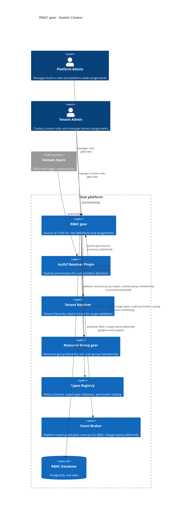
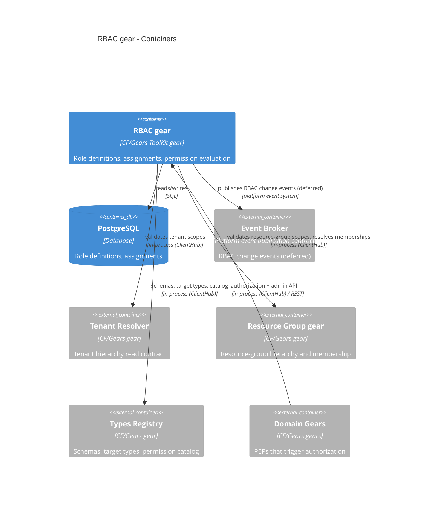
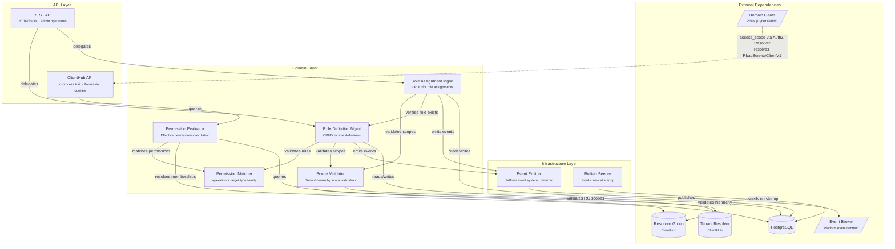
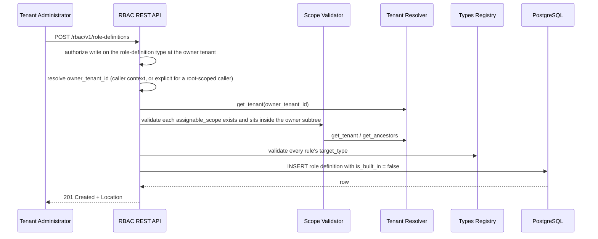
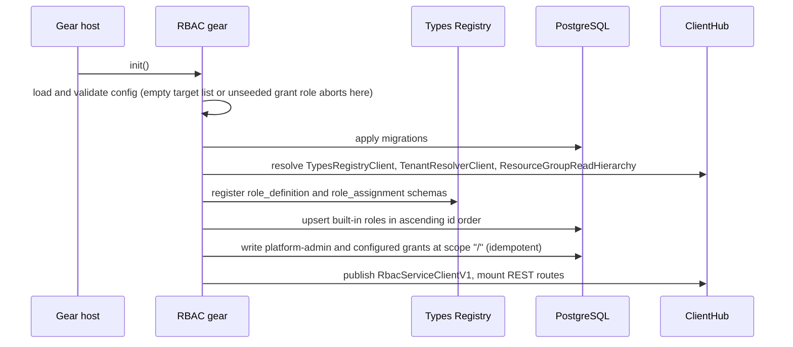
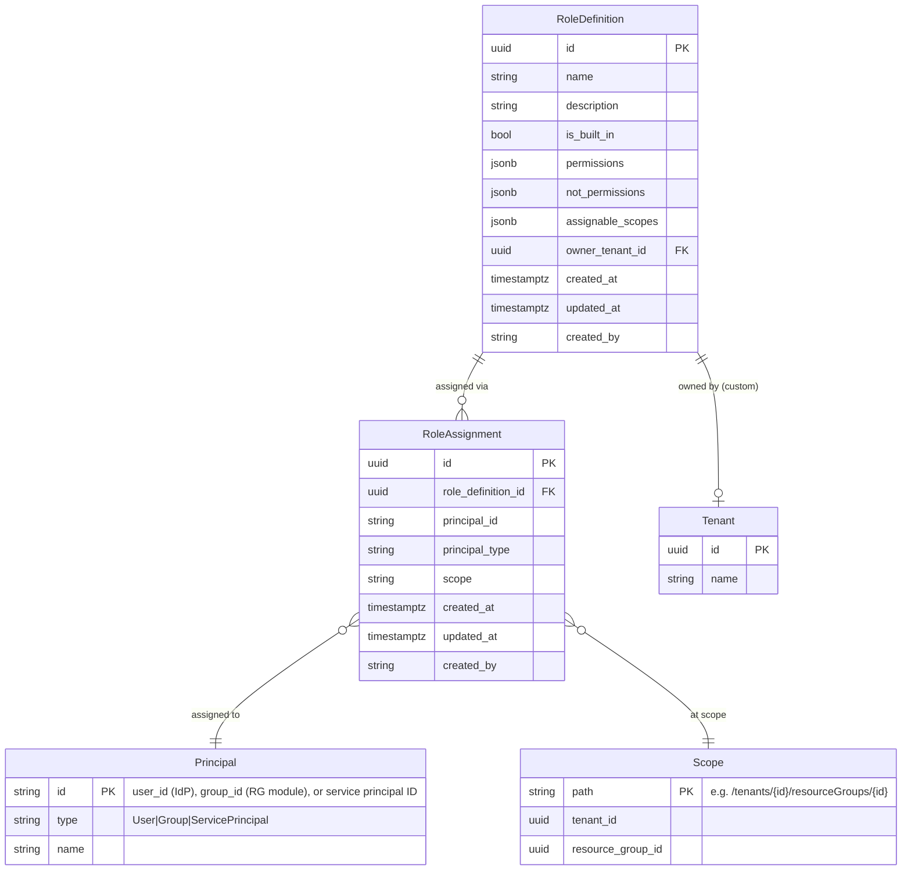

Created:  2026-08-20 by Constructor Fabric

# Technical Design — RBAC

- [ ] `p1` - **ID**: `cpt-cf-rbac-design-rbac`

<!-- toc -->

- [1. Architecture Overview](#1-architecture-overview)
  - [1.1 Architectural Vision](#11-architectural-vision)
  - [1.2 Architecture Drivers](#12-architecture-drivers)
  - [1.3 Architecture Layers](#13-architecture-layers)
- [2. Principles & Constraints](#2-principles--constraints)
  - [2.1 Design Principles](#21-design-principles)
  - [2.2 Constraints](#22-constraints)
- [3. Technical Architecture](#3-technical-architecture)
  - [3.1 Domain Model](#31-domain-model)
  - [3.2 Component Model](#32-component-model)
  - [3.3 API Contracts](#33-api-contracts)
  - [3.4 Internal Dependencies](#34-internal-dependencies)
  - [3.5 External Dependencies](#35-external-dependencies)
  - [3.6 Interactions & Sequences](#36-interactions--sequences)
  - [3.7 Database schemas & tables](#37-database-schemas--tables)
  - [3.8 Events Surface (deferred)](#38-events-surface-deferred)
  - [3.9 Configuration](#39-configuration)
  - [3.10 Security Architecture](#310-security-architecture)
  - [3.11 Observability & Metrics](#311-observability--metrics)
  - [3.12 Performance Architecture](#312-performance-architecture)
  - [3.13 Testing Architecture](#313-testing-architecture)
  - [3.14 Deployment Topology](#314-deployment-topology)
- [4. Additional Context](#4-additional-context)
  - [4.1 Risks](#41-risks)
  - [4.2 Open Questions](#42-open-questions)
  - [4.3 Resolved Design Decisions](#43-resolved-design-decisions)
  - [4.4 References](#44-references)
- [5. Traceability](#5-traceability)

<!-- /toc -->

> Requirements (WHAT and WHY) are in [PRD.md](./PRD.md). This document defines HOW:
> architecture, components, API contracts, data model, and algorithms. Requirement
> references use `cpt-cf-rbac-fr-*` / `cpt-cf-rbac-nfr-*` ids from that PRD.

## 1. Architecture Overview

### 1.1 Architectural Vision

The gear is the platform's source of truth for role-based access control: it stores role
definitions and role assignments, and answers two questions for a policy decision point —
which roles a subject holds in a tenant context, and whether one
`{ operation, resource_type }` is permitted there. Permissions are structured rules
(`{ operation, target_type }`) rather than synthetic action strings, user groups are
resource-group-backed, and domain gears keep the explicit PEP style: short action constants
plus resource-type constants passed to a policy enforcer.

Four choices shape everything downstream. Evaluation is **additive** — the union of a
subject's roles, with `not_permissions` subtracting inside their own role only — so
composing roles has a predictable outcome. Inheritance is **unconditional and downward**,
so a scope grant needs no per-assignment opt-out flag. The permission-query contract is
**in-process only**, resolved through `ClientHub`, so no partial authorization API leaks
onto the network. And what the built-in roles *grant* comes from **configuration** while
their ids and names stay fixed, so the role model is reusable across deployments that
publish their own resource types.

Responsibility boundaries are as important as the capabilities. The gear does not decide
requests (the PDP does), does not generate SQL constraints (the PDP does), does not
maintain hierarchy closure tables (the tenant and resource-group resolvers do), does not
manage user identity (the identity provider does), does not own user-group CRUD (the
Resource Group gear does — groups are consumed here as RBAC principals), and does not own
tenant hierarchy (Account Management does). Scope boundaries are enumerated in
[PRD.md](./PRD.md#4-scope).

### 1.2 Architecture Drivers

#### Functional Drivers

| Requirement | Design Response |
|-------------|-----------------|
| `cpt-cf-rbac-fr-role-definition-structure` | `RoleDefinition` / `PermissionRule` entities (§3.1) persisted as JSONB rule arrays (§3.7) |
| `cpt-cf-rbac-fr-builtin-roles` | Built-in Roles Seeder with fixed UUIDs and idempotent upsert (§3.2, §3.7 Built-in Roles Data) |
| `cpt-cf-rbac-fr-builtin-role-targets` | `TargetSpec` slots in the role catalog filled from `builtin_role_targets` at seed time (§3.7, §3.9) |
| `cpt-cf-rbac-fr-startup-grants` | Bootstrap step writing configured grants at scope `/`, with config validated before any write (§3.10 Bootstrap Problem) |
| `cpt-cf-rbac-fr-custom-roles` | Role Definition Management invariants plus partial unique indexes for per-tenant and built-in name uniqueness (§3.2, §3.7) |
| `cpt-cf-rbac-fr-role-assignment`, `cpt-cf-rbac-fr-assignable-scopes` | Role Assignment Management with Scope Validator checks and the `uq_assignment` constraint (§3.2, §3.7) |
| `cpt-cf-rbac-fr-type-family-wildcard`, `cpt-cf-rbac-fr-operation-wildcard` | Permission Matcher wildcard semantics on `operation` and `target_type` (§3.2) |
| `cpt-cf-rbac-fr-not-permissions`, `cpt-cf-rbac-fr-role-scoped-exclusion` | `not_permissions` evaluated before `permissions` within a single role, never across roles (§3.2) |
| `cpt-cf-rbac-fr-scope-inheritance`, `cpt-cf-rbac-fr-rg-subtree-grant` | Two-phase scope query: ancestor scopes plus context-tenant resource-group prefix (§3.2 Permission Evaluator) |
| `cpt-cf-rbac-fr-scope-taxonomy`, `cpt-cf-rbac-fr-reserved-direct-membership` | Open `PermissionScopeType` enum with Reserved variants never produced in v1 (§3.1, §3.3) |
| `cpt-cf-rbac-fr-additive-union`, `cpt-cf-rbac-fr-deterministic-evaluation` | Scope-aggregation algorithm over surviving grants, ordered in SQL by scope depth (§3.2) |
| `cpt-cf-rbac-fr-entity-schemas`, `cpt-cf-rbac-fr-reserved-event-types` | Schema registration at `init()`; reserved event schemas pinned on disk (§3.7, §3.8) |
| `cpt-cf-rbac-fr-unauthenticated`, `cpt-cf-rbac-fr-insufficient-permission` | Authentication ahead of authorization, canonical error taxonomy (§3.3, §3.10) |
| `cpt-cf-rbac-fr-permission-catalog` | Permission catalog read through the types-registry with a short-TTL snapshot cache (§3.3) |
| `cpt-cf-rbac-fr-principal-role-visibility` | `principal_id` / `principal_type` filters on the assignment list endpoint (§3.3) |
| `cpt-cf-rbac-fr-read-display-names` | Display-Name Hydrator resolves principal, author and role names on the read path; unresolved names stay `null` rather than failing the read (§3.1 Decoration, §3.2) |
| `cpt-cf-rbac-fr-name-resolution-bounded` | One batched lookup per tenant per page, bounded by a tenant cap and a wall-clock deadline; rows past a bound are served unnamed (§3.2, §3.9 `principal_names`) |
| `cpt-cf-rbac-fr-role-assignment-counts` | `assignment_count` aggregated under the caller's own visibility on role-definition reads, `null` when no honest number exists; built-in / custom / total from the summary endpoint (§3.1 Decoration, §3.3) |

#### NFR Allocation

| NFR ID | NFR Summary | Allocated To | Design Response | Verification Approach |
|--------|-------------|--------------|-----------------|----------------------|
| `cpt-cf-rbac-nfr-permission-query-latency` | In-process query p95 ≤ 5 ms, p99 ≤ 10 ms | Permission Evaluator, `role_assignments` indexes | One combined `SELECT` per query; `scope_depth` generated column so deepest-first ordering is index-backed (§3.2, §3.7) | `rbac_permission_query_duration_seconds` histogram; micro-benchmark and load test (§3.12, §3.13) |
| `cpt-cf-rbac-nfr-rest-latency` | REST p95 ≤ 50 ms, p99 ≤ 100 ms | REST layer | Cursor pagination, indexed filters, no `total_count` (§3.3, §3.7) | `rbac_rest_request_duration_seconds` histogram (§3.12) |
| `cpt-cf-rbac-nfr-availability` | ≥ 99.95 % over 30 days | Deployment topology | PostgreSQL HA plus stateless gear replicas (§3.14) | `rbac_service_up` aggregated over a rolling window (§3.11) |
| `cpt-cf-rbac-nfr-concurrency` | ≥ 5,000 in-process queries and ≥ 500 in-flight REST requests per instance | Connection pool, query plan | Constant round-trip count per query regardless of group count (§3.2) | Concurrency load tests at both surfaces (§3.13) |
| `cpt-cf-rbac-nfr-delegation-invariants` | Built-in immutability, assignable-scope enforcement | Role Definition Management, Seeder, Scope Validator | Immutability rejected at the handler and re-asserted post-upsert; scope checks on every write (§3.2, §3.10) | Unit, integration, and API suites (§3.13) |

#### Key Decisions

This gear records no ADRs. Its settled decisions — the additive model, in-process-only
evaluation, unconditional inheritance, tenant-owned custom roles, the closed
`PrincipalType` enum, and the rest — are tabled in
[§4.3 Resolved Design Decisions](#43-resolved-design-decisions), each with its rationale.

### 1.3 Architecture Layers

- [x] `p1` - **ID**: `cpt-cf-rbac-tech-layers`

| Layer | Responsibility | Technology |
|-------|---------------|------------|
| API | REST admin surface and the in-process permission-query client | Axum via `OperationBuilder`, `ClientHub` trait |
| Domain | Role definition and assignment management, permission matching, evaluation, scope validation, seeding | Rust domain services, transport-free |
| Infrastructure | Repositories, migrations, types-registry and resource-group adapters, metrics | SecureORM / SeaORM, PostgreSQL, SQLite |
| Contract (SDK) | Public in-process contract consumed through `ClientHub` | `rbac-sdk` crate — no HTTP, ORM, or migrations |

#### System Context



#### Containers



## 2. Principles & Constraints

### 2.1 Design Principles

#### Additive composition, role-local subtraction

- [x] `p1` - **ID**: `cpt-cf-rbac-principle-additive-composition`

A subject's effective permissions are the union of their roles, and `not_permissions`
subtract only inside the role that declares them. There is no global explicit-deny stage.
A global deny would make an outcome depend on roles the subject holds elsewhere, which is
exactly the unpredictability the additive model exists to remove.

#### Inheritance is unconditional and downward

- [x] `p1` - **ID**: `cpt-cf-rbac-principle-unconditional-inheritance`

Every active scope variant propagates downward with no per-assignment opt-out, no
`excluded_scopes`, and no tenant-direct variant in v1. Barrier semantics — which subtrees a
subject may *see* — belong to the PDP's constraint generation, which is what lets this
model stay this simple. See
[§4.3 Resolved Design Decisions](#43-resolved-design-decisions).

#### Evaluation stays in-process

- [x] `p1` - **ID**: `cpt-cf-rbac-principle-in-process-evaluation`

Permission evaluation is exposed only through the `ClientHub` trait. A public REST
permission-check endpoint would expose a partial authorization API that omits token-scope
intersection, barrier handling, and PEP property enforcement — an answer that looks
authoritative and is not.

#### Contract fixed, reach configured

- [x] `p1` - **ID**: `cpt-cf-rbac-principle-contract-vs-configuration`

Built-in role ids and names are a cross-deployment contract and are not configurable. What
those roles grant is configuration. Compiling in a vendor wildcard would leave three of the
four core roles authorizing nothing on any platform that does not publish under that
vendor.

#### Fail closed on missing dependencies

- [x] `p1` - **ID**: `cpt-cf-rbac-principle-fail-closed-startup`

Each required client is resolved at `init()`, and a missing one is a startup error rather
than a degraded runtime mode. Invalid configuration — an empty target list, a grant naming
an unseeded role — aborts before any write. A gear that starts half-configured serves
authorization data nobody can trust.

#### Explicit PEP calls over generated wrappers

- [x] `p1` - **ID**: `cpt-cf-rbac-principle-explicit-pep`

Domain gears declare action and resource-type constants and call the policy enforcer
explicitly. Generated wrappers and registration manifests add complexity without changing
the runtime contract, and the explicit style already matches the surrounding gears.

### 2.2 Constraints

#### PostgreSQL primary storage

- [x] `p1` - **ID**: `cpt-cf-rbac-constraint-postgres`

Role definitions and assignments live in PostgreSQL. SQLite is supported for tests,
development, and embedded demos, but the migrations drop the GIN / `pg_trgm` /
`text_pattern_ops` indexes there, so `LIKE` filtering degrades to full scans.

#### No event bus in v1

- [x] `p1` - **ID**: `cpt-cf-rbac-constraint-no-event-bus`

RBAC change events are deferred: GTS type identifiers and schema placeholders are reserved,
publication waits on the Event Broker integration (§3.8).

#### In-process contract through `ClientHub`

- [x] `p1` - **ID**: `cpt-cf-rbac-constraint-clienthub`

The gear is a ToolKit gear registered in `ClientHub`; the PDP reaches it in-process through
`RbacServiceClientV1` with no network hop (§3.3).

#### Scope-provider contracts

- [x] `p1` - **ID**: `cpt-cf-rbac-constraint-scope-providers`

Scope paths are validated against the tenant hierarchy through `TenantResolverClient`, with
Account Management remaining the tenant source of truth behind the resolver. Resource-group
existence, tenant ownership, and membership come from `ResourceGroupReadHierarchy`, adapted
behind the gear's own narrow port (§3.2 Gear Packaging & Lifecycle, §3.4).

#### Permission vocabulary and scope grammar

- [x] `p1` - **ID**: `cpt-cf-rbac-constraint-vocabulary`

Role definitions store `{ operation, target_type }` rules. A request carries a short
operation string in `action.name` and a concrete GTS `resource.type`. Scopes are `/`,
`/tenants/{id}`, or `/tenants/{id}/resourceGroups/{id}` — a grammar chosen so inheritance
is a prefix query.

#### REST contract

- [x] `p1` - **ID**: `cpt-cf-rbac-constraint-rest-contract`

Administrative operations follow the shared DNA REST contract: `snake_case` fields, UUIDv7
identifiers, ISO-8601 UTC timestamps, cursor pagination with no `total_count`, and
conditional writes through `ETag` / `If-Match` (§3.3).

## 3. Technical Architecture

### 3.1 Domain Model

#### GTS Type Constants

| Constant | GTS Type Identifier |
|----------|---------------------|
| Role Definition Type | `gts.cf.core.rbac.role_definition.v1~` |
| Role Assignment Type | `gts.cf.core.rbac.role_assignment.v1~` |
| Effective Permission Type | `gts.cf.core.rbac.effective_permission.v1~` |
| Permission Result Type | `gts.cf.core.rbac.permission_result.v1~` |

#### Entity: `RoleDefinition`

RBAC role definition: each permission is a pair of short `operation` plus target `resource.type` family.

| Field | Type | Required | Description |
|-------|------|----------|-------------|
| `id` | UUID | Yes | Unique role definition ID (UUIDv7) |
| `name` | string (1..256) | Yes | Human-readable role name (e.g., "Virtual Machine Contributor"). Length capped at 256 characters to match the JSON Schema (§3.7 GTS JSON Schema Definitions) and DB column (§3.7) |
| `description` | string (0..4096) | No | Role description. Length capped at 4096 characters to match the JSON Schema (§3.7 GTS JSON Schema Definitions) and DB column (§3.7) |
| `is_built_in` | boolean | Yes | Whether this is a built-in role (immutable) |
| `permissions` | `PermissionRule[]` | Yes | Allowed permissions. Each rule is `{ operation, target_type }` |
| `not_permissions` | `PermissionRule[]` | Yes | Subtractive rules applied within the same role |
| `assignable_scopes` | string[] | Yes | Scopes where this role can be assigned. Valid forms: `/`, `/tenants/{id}`, or `/tenants/{id}/resourceGroups/{id}` |
| `owner_tenant_id` | UUID | No | Owning tenant for custom roles. MUST be non-`NULL` for custom roles; `NULL` is reserved for built-ins |
| `created_at` | `timestamptz` | Yes | Creation timestamp, serialized as UTC |
| `updated_at` | `timestamptz` | Yes | Last modification timestamp, serialized as UTC |
| `created_by` | string | Yes | Creator subject ID (for audit) |
| `assignment_count` | integer | No | Assignments of this role the caller can see, on reads only. `null` when no honest number exists — see *Decoration* below |

#### Entity: `PermissionRule`

| Field | Type | Required | Description |
|-------|------|----------|-------------|
| `operation` | string | Yes | Short operation verb carried in SDK `action.name` (for example `read`, `write`, `delete`, `start`). `*` means any operation |
| `target_type` | string | Yes | GTS target type or type family matched against request `resource.type`. Supports GTS wildcard matching such as `gts.vendor.resources.compute.*` |

#### Entity: `RoleAssignment`

The Principal + Role + Scope triplet.

| Field | Type | Required | Description |
|-------|------|----------|-------------|
| `id` | UUID | Yes | Unique assignment ID (UUIDv7) |
| `role_definition_id` | UUID | Yes | Role definition being assigned |
| `principal_id` | string | Yes | Principal receiving the role (user, group, or service principal) |
| `principal_type` | `PrincipalType` | Yes | Type of principal |
| `scope` | string | Yes | Scope at which the role is assigned. Permissions inherit to child scopes |
| `created_at` | `timestamptz` | Yes | Assignment creation timestamp, serialized as UTC |
| `updated_at` | `timestamptz` | Yes | Last modification timestamp, serialized as UTC |
| `created_by` | string | Yes | Creator subject ID (for audit) |
| `principal_name` | string | No | Display name of `principal_id`, on reads only. `null` when unresolved — see *Decoration* below |
| `created_by_name` | string | No | Display name of `created_by`, on reads only |
| `role_definition_name` | string | No | Name of the granted role, on reads only |

#### Decoration: names and counts

Three names on a read assignment and one count on a read role definition are
*decoration*: resolved after the authorized row set exists, and never able to change it. A
name or a count MUST NOT alter an HTTP status, a row set, or a pagination cursor. That is
why they are nullable and why the count path carries no error channel at all — its return
type is `Option`, not `Result`, so nothing on it can fail the surrounding read even by
accident.

`null` therefore means one of two honest things, and the API does not distinguish them
because a reader cannot act on the difference: no name exists (a service principal has no
`subject_id` to `client_id` reverse lookup on the platform), or one could not be produced
within the request's budget (§3.9 `principal_names`). For `assignment_count`, `null`
additionally covers "no number would be honest" — a caller who can read no assignments at
all would otherwise see every role reported as unused.

Names are resolved through the `PrincipalNameReader` port: `User` and author names come
from account management, `Group` names from the resource-group gear, and the role name from
RBAC's own table. The account-management client is resolved lazily from `ClientHub` rather
than declared as a gear dependency — account management declares `deps = [authz_resolver,
...]` and the authz resolver consumes RBAC, so a `deps` edge here would close a cycle. Its
absence degrades to "no names".

#### Enum: `PrincipalType`

| Value | Description |
|-------|-------------|
| `User` | Human user identity |
| `Group` | User group (managed by the Resource Group gear, tenant-scoped) |
| `ServicePrincipal` | Machine/service identity |

**Why a closed enum, not a GTS type identifier.** `PrincipalType` is deliberately a closed enum stored as the short semantic tag (`User` / `Group` / `ServicePrincipal`) rather than a GTS identifier such as `gts.cf.core.security.subject_user.v1~`. GTS identifiers are used at the PEP/PDP contract (`subject.type` on AuthZEN requests, `SecurityContext.subject_type`) and the AuthZ Resolver Plugin maps them to `PrincipalType` before calling into RBAC — see the [AuthZ Resolver Plugin design](../../authz-resolver/plugins/authz-resolver-plugin/docs/DESIGN.md) §3.5 for the classification rules. The plugin boundary is the correct seam because:

1. **`principal_type` is not an open set.** Each value gates hard-coded behavior in RBAC: `Group` requires RG-backed existence, cannot be assigned at `/`, and triggers membership expansion in `get_subject_roles` (§3.2 Permission Evaluator); `User` / `ServicePrincipal` are opaque IDs with distinct group-expansion semantics. Adding a new kind is a code change (new validation, new query branch), not a registry change — so a closed enum honestly reflects the contract.
2. **Fail-closed semantics.** Unknown enum values are rejected at deserialization. Accepting arbitrary GTS identifiers would let RBAC persist a principal type it cannot evaluate, silently producing `Denied { NoMatchingPermission }` for every query against those rows.
3. **Row identity stability.** `principal_type` participates in `uq_assignment (role_definition_id, principal_type, principal_id, scope)` and `idx_role_assignments_principal` (§3.7). The short tag is version-neutral; a subject-type version bump (`subject_user.v1~` → `subject_user.v2~`) does not fragment existing assignments or require an equivalence map.
4. **Layering.** Open type vocabularies belong on public contracts (`PermissionRule.target_type`, event envelope `type`, AuthZEN `subject.type` / `resource.type`) where the type universe is genuinely owned by other modules. `principal_type` is owned by RBAC. The asymmetry with `target_type` — which *is* a GTS wildcard because resource types are an open set — is intentional and preserved by this split.

Consequently, `principal_type` is serialized as the short tag on the entity, REST surface, events, in-process `ClientHub` contract, and DB column. New SDK subject types are absorbed at the AuthZ Resolver Plugin (map to an existing variant or, if a new kind of principal is needed, add a new `PrincipalType` variant via a normal design change).

#### Entity: `EffectivePermission`

Single contributing grant returned from permission evaluation.

| Field | Type | Required | Description |
|-------|------|----------|-------------|
| `matched_permission` | `PermissionRule` | Yes | Specific permission rule that matched the request |
| `role_definition_id` | UUID | Yes | Role definition that contributed the grant |
| `role_assignment_id` | UUID | Yes | The role assignment that grants this permission |
| `role_name` | string | Yes | The role definition name |
| `assignment_scope` | string | Yes | The scope at which the granting role is assigned |
| `is_inherited` | boolean | Yes | `true` when `assignment_scope` is an ancestor of the request's `context_tenant_id`; `false` when the grant was assigned directly at that scope. Carries the same semantics as `SubjectRole.is_inherited` below but is scoped to a single contributing `EffectivePermission` inside a `PermissionResult::Allowed` response |

#### Enum: `PermissionResult`

| Value | Payload | Description |
|-------|---------|-------------|
| `Allowed` | `grants: EffectivePermission[]`, `scope_type: PermissionScopeType` | Permission granted with one or more contributing grants plus aggregated scope information. Built only through `PermissionGranted::from_grants`, so `scope_type` is always the canonical aggregate of `grants` (§3.2 scope aggregation) |
| `Denied` | `reason: DenyReason` | Permission denied (no matching permission or excluded by `not_permissions`) |

#### Enum: `PermissionScopeType`

The SDK enum MUST be declared `#[non_exhaustive]` (Rust) or equivalently as an open/extensible enum in other bindings. This allows future scope variants (e.g., the prospective `TenantDirect` noted in §4.3) to be added without breaking downstream builds. Consumers MUST match on known variants and fall through to a safe default (see §3.3 In-Process API for the mandatory consumer contract).

| Value | v1 Status | Payload | Description |
|-------|-----------|---------|-------------|
| `TenantSubtree` | Active | `root_tenant_id: UUID` | Access to tenant subtree |
| `TenantDirect` | Reserved | `tenant_id: UUID` | Access to exactly one tenant, without subtree inheritance. Reserved for future use — v1 does not produce this variant. Counterpart to the reserved `ExplicitGroups` variant for RGs; see §4.3 for the future extension path. Consumers MUST treat any v1-era `TenantDirect` value arriving from a mismatched module version as `Denied { reason: NoMatchingPermission }` (see §3.3 In-Process API) |
| `GroupSubtree` | Active | `root_group_ids: UUID[]` | Access to resource group subtrees (`cpt-cf-rbac-fr-rg-subtree-grant`). Each root group ID is extracted from a role assignment scope `/tenants/{t}/resourceGroups/{rg}`. Scope inheritance applies below that point, so RG-scoped assignments include child groups. The AuthZ plugin passes `root_group_ids` to RG Resolver `get_group_subtree_resource_ids` to materialize resource IDs (see the [AuthZ Resolver Plugin design](../../authz-resolver/plugins/authz-resolver-plugin/docs/DESIGN.md) §3.6). v1: all RG-scoped assignments produce `GroupSubtree` |
| `ExplicitGroups` | Reserved | `group_ids: UUID[]` | Access to flat group membership only, without subtree expansion (`cpt-cf-rbac-fr-reserved-direct-membership`). Reserved for future use — v1 does not produce this variant. Intended for fine-grained scoping mechanisms (e.g., ABAC conditions) that limit access to direct group members without including child group hierarchies. The AuthZ plugin passes `group_ids` to RG Resolver `get_group_member_resource_ids` |
| `Global` | Active | — | Global access (platform admin) |
| `Combined` | Active | `scopes: PermissionScopeType[]` | Multiple access paths (OR'd). Returned when subject has roles at multiple scopes yielding different scope types. AuthZ Resolver Plugin unions the constraint sets |

#### Enum: `DenyReason`

| Value | Description |
|-------|-------------|
| `NoMatchingPermission` | No role grants the requested `operation` on the requested `resource.type`. Also the reason returned when the subject has no assignments visible from `context_tenant_id` (inaccessible scopes yield no assignments) |
| `NotPermissionExclusion` | Request excluded by a `not_permissions` rule in an otherwise matching role |

#### Entity: `SubjectRole`

> **Note:** Tenant barrier enforcement (`BarrierMode`) is handled by the AuthZ Resolver Plugin during constraint generation via Tenant Resolver queries, not by the RBAC Service scope walk. See the plugin's [barrier and status filtering requirement](../../authz-resolver/plugins/authz-resolver-plugin/docs/PRD.md#55-constraint-generation) and its [design](../../authz-resolver/plugins/authz-resolver-plugin/docs/DESIGN.md#36-materialization--constraint-generation).

Subject role with resolved role definition details (used in permission evaluation).

| Field | Type | Required | Description |
|-------|------|----------|-------------|
| `assignment_id` | UUID | Yes | Role assignment ID |
| `role_definition_id` | UUID | Yes | Role definition ID |
| `role_name` | string | Yes | Resolved role name |
| `permissions` | `PermissionRule[]` | Yes | Resolved permission rules |
| `not_permissions` | `PermissionRule[]` | Yes | Resolved subtractive permission rules |
| `scope` | string | Yes | Assignment scope |
| `is_inherited` | boolean | Yes | Whether this assignment is inherited from an ancestor scope rather than assigned directly at the context tenant/resource-group scope. Same semantics as `EffectivePermission.is_inherited` — the two fields are intentionally named identically because they describe the same concept at different projection levels (`SubjectRole` = one assignment row; `EffectivePermission` = one contributing grant inside an `Allowed` result) |
| `principal_id` | string | Yes | Principal ID |
| `principal_type` | `PrincipalType` | Yes | Principal type |

### 3.2 Component Model

The gear is one deployable unit; the components below are its internal boundaries. Each
owns a slice of the model, and the dependency direction is strictly API → domain →
infrastructure.



Domain gear integration (the PEP pattern for `actions` / `resources` modules) is not an internal RBAC component — it is the *consumer-side* integration pattern documented below under Domain Gear Integration. The dashed edge above shows the indirect path: domain modules call `PolicyEnforcer.access_scope(...)`, which the AuthZ Resolver Plugin translates into `RbacServiceClientV1` queries resolved through `ClientHub`.

**Component relationships (by ID):**

| Component | Depends on |
|-----------|------------|
| `cpt-cf-rbac-component-role-definition-management` | `cpt-cf-rbac-component-scope-validator`, `cpt-cf-rbac-component-permission-matcher` |
| `cpt-cf-rbac-component-role-assignment-management` | `cpt-cf-rbac-component-scope-validator`, `cpt-cf-rbac-component-role-definition-management` |
| `cpt-cf-rbac-component-permission-evaluator` | `cpt-cf-rbac-component-permission-matcher`, `cpt-cf-rbac-component-scope-validator` |
| `cpt-cf-rbac-component-scope-validator` | Tenant Resolver and Resource Group read contracts (§3.4) |
| `cpt-cf-rbac-component-builtin-roles-seeder` | PostgreSQL only — deliberately no validator dependency, so seeding cannot be blocked by an unavailable resolver |
| `cpt-cf-rbac-component-event-emitter` | Event Broker contract (§3.8) — not invoked in v1 |
| `cpt-cf-rbac-component-name-hydrator` | `cpt-cf-rbac-component-role-definition-management` (role names), the `PrincipalNameReader` port and the Resource Group read contract (§3.4) |
| `cpt-cf-rbac-component-packaging-lifecycle` | every component above, plus `ClientHub` |

#### Role Definition Management

- [x] `p1` - **ID**: `cpt-cf-rbac-component-role-definition-management`

**Dependencies:** `ScopeValidator`, `PermissionMatcher`, PostgreSQL

**Operations:**

| Operation | Input | Output | Key Behavior |
|-----------|-------|--------|--------------|
| `create_role_definition` | `CreateRoleDefinitionRequest`, `SecurityContext` | `RoleDefinition` | 1. Validate actor has create permission on the target owner tenant. 2. Resolve `owner_tenant_id`: tenant-scoped caller derives it from caller tenant context; root-scoped caller acting only through `/` MUST provide it. 3. Verify the owner tenant exists. 4. Validate each assignable scope exists via Scope Validator. 5. Verify every assignable scope is at or below the resolved owner tenant subtree. 6. Validate each permission rule via Permission Matcher. 7. Set `is_built_in = false`. 8. Insert to DB. Reserved mutation event contracts remain deferred in v1. |
| `update_role_definition` | `role_id`, `UpdateRoleDefinitionRequest`, `SecurityContext` | `RoleDefinition` | Reject if built-in (`CannotModifyBuiltInRole`). Validate actor permission on the role's `owner_tenant_id`. Apply partial update for supplied fields (`name`, `description`, `permissions`, `not_permissions`, `assignable_scopes`). Re-validate permission rules and ensure updated assignable scopes remain within the immutable owner tenant subtree. Update `updated_at`. Reserved mutation event contracts remain deferred in v1. |
| `delete_role_definition` | `role_id`, `SecurityContext` | — | Reject if built-in. Validate actor permission. Reject if role has existing assignments (`RoleHasAssignments`). Hard-delete from DB. Reserved mutation event contracts remain deferred in v1. **Concurrency safety:** The application-level assignment check is advisory — a concurrent `create_role_assignment` could succeed between the check and the delete. The FK constraint `role_assignments.role_definition_id → role_definitions(id) ON DELETE RESTRICT` is the authoritative safety net: the `DELETE` statement fails with a constraint violation if assignments exist at execution time. The application MUST handle this FK error gracefully (map to `409 RoleHasAssignments`). |
| `get_role_definition` | `role_id` | `RoleDefinition` | Direct lookup by ID. |
| `list_role_definitions` | filter, pagination | `RoleDefinition[]` | Filter by `is_built_in`, `owner_tenant_id`, `name` (contains). Paginated. |

**Invariants:**
- Built-in roles are immutable (cannot update or delete)
- Custom roles MUST have non-`NULL` `owner_tenant_id`; only built-ins may use `NULL`
- Custom roles can only have assignable scopes within their `owner_tenant_id` subtree
- Tenant-scoped callers create custom roles only for their current tenant context
- Root-scoped platform admins may create tenant-owned custom roles only by explicitly supplying `owner_tenant_id`
- The DB has no default for `assignable_scopes`; the application layer MUST always supply it. The `create_role_definition` operation validates scopes before insert
- Role name must be unique within tenant (globally unique for built-in)
- Custom role names MUST NOT collide with built-in role names. The application layer rejects `create_role_definition` if the requested name matches any existing built-in role name (case-insensitive). This prevents ambiguity when built-in and custom roles appear in the same result set

#### Permission Matcher

- [x] `p1` - **ID**: `cpt-cf-rbac-component-permission-matcher`

Implements permission matching. Requests are evaluated as:

- `operation`: short string from SDK `action.name`
- `resource_type`: concrete GTS type from SDK `resource.type`
- role rules: `{ operation, target_type }`

Matching at evaluation time requires no registry lookup: it runs purely against role data
plus the request tuple, which is what keeps it inside the permission-query latency budget.
Rule *validation* is the exception — on create and update, `target_type` is checked against
the types-registry (see Role Definition Management above and §3.4), because a rule naming a
type nobody registered is a role that will never match anything.

**Operations:**

| Operation | Input | Output | Key Behavior |
|-----------|-------|--------|--------------|
| `validate_permission_rule` | `rule: PermissionRule` | — (or error) | Validate `operation` as a non-empty short verb or `*`. Validate `target_type` as a valid GTS identifier or GTS wildcard expression. Reject empty fields |
| `matches_operation` | `rule_operation: string`, `requested_operation: string` | `boolean` | Exact string match or `*` wildcard |
| `matches_target_type` | `target_type: string`, `requested_resource_type: string` | `boolean` | Exact GTS type match or wildcard match using GTS OP#4 semantics |
| `is_permission_allowed` | `RoleDefinition`, `requested_operation: string`, `requested_resource_type: string` | `PermissionMatchResult` | Check `not_permissions` first within the same role. Then check `permissions`. Return `ExcludedByNotPermission`, `Allowed`, or `NoMatch` |

##### Enum: `PermissionMatchResult`

| Value | Payload | Description |
|-------|---------|-------------|
| `Allowed` | `matching_rule: PermissionRule` | Request matched by a role permission |
| `ExcludedByNotPermission` | `matching_rule: PermissionRule` | Request excluded by a role `not_permissions` rule |
| `NoMatch` | — | No matching permission rule |

#### Role Assignment Management

- [x] `p1` - **ID**: `cpt-cf-rbac-component-role-assignment-management`

**Dependencies:** `RoleDefinitionManagement`, `ScopeValidator`, PostgreSQL, `RbacRgRead`

**Operations:**

| Operation | Input | Output | Key Behavior |
|-----------|-------|--------|--------------|
| `create_role_assignment` | `CreateRoleAssignmentRequest`, `SecurityContext` | `RoleAssignment` | 1. Verify role definition exists. 2. Validate scope exists via Scope Validator. 3. Validate principal semantics. `principal_type = Group` MUST resolve to an existing RG-backed group, MUST NOT be assigned at `/`, and the group's owning tenant MUST match the tenant encoded in the assignment scope. `User` and `ServicePrincipal` IDs are treated as opaque identifiers in v1 and are not existence-checked by RBAC. 4. Validate scope is within the role's `assignable_scopes` (root `/` allows anywhere; scope must be at or below an assignable scope). 5. Validate actor has assignment permission at scope. 6. Reject duplicate (same role + principal + scope). 7. Insert to DB. Reserved mutation event contracts remain deferred in v1. |
| `delete_role_assignment` | `assignment_id`, `SecurityContext` | — | Validate actor has assignment permission at the assignment's scope. Hard-delete from DB. Reserved mutation event contracts remain deferred in v1. |
| `get_role_assignment` | `assignment_id` | `RoleAssignment` | Direct lookup by ID. |
| `list_role_assignments` | `RoleAssignmentFilter`, `SecurityContext` | `RoleAssignment[]` | Filter by `principal_id`, `principal_type`, `role_definition_id`, `scope` (exact), `scope_prefix` (inheritance). Paginated via `cursor`/`limit`. Ordered by `created_at DESC, id DESC` (stable sort per DNA REST guidelines). |

**`RoleAssignmentFilter` fields:** `principal_id`, `principal_type`, `role_definition_id`, `scope`, `scope_prefix`, `limit`, `cursor`

**Principal validation rules:**
- `User` and `ServicePrincipal` IDs are opaque in v1. RBAC persists and evaluates them without standalone identity-existence lookups
- `Group` principals are validated via the RG module and may only be assigned within their owning tenant subtree
- Root-scope (`/`) assignments to `Group` principals are invalid because groups are tenant-scoped RBAC principals

#### Permission Evaluator

- [x] `p1` - **ID**: `cpt-cf-rbac-component-permission-evaluator`

Provides in-process API for AuthZ Resolver Plugin permission queries via `ClientHub`.

**Dependencies:** `PermissionMatcher`, `ScopeValidator`, PostgreSQL, `TenantResolverClient`, `RbacRgRead` (the gear's own narrow RG read port, backed by `ResourceGroupReadHierarchy` from `ClientHub` — see §3.2 Gear Packaging & Lifecycle)

**Operations:**

| Operation | Input | Output | Key Behavior |
|-----------|-------|--------|--------------|
| `get_subject_roles` | `subject_id`, `principal_type`, `context_tenant_id`, `include_group_roles` | `SubjectRole[]` | Two-phase scope query issued as a single combined SQL statement. Phase 1: ancestor scope paths for the tenant context (root + tenant-level ancestors). Phase 2: RG-scoped assignments under the **context tenant only** via prefix match (`scope LIKE '/tenants/{context_tenant_id}/resourceGroups/%'`). RG-scoped assignments under ancestor tenants are excluded — they are children of those tenants, not ancestors of the context tenant. If `include_group_roles` and `principal_type = User`, the subject's group memberships are resolved once via the RG module and folded into the same query using `principal_id = ANY($group_ids)` — no per-group round trip. Assignments ordered by `scope_depth DESC, id DESC` (deepest first, stable tiebreaker). `scope_depth` is the generated column on `role_assignments` (see §3.7), so the sort is index-backed and does not call `char_length` on the hot path |
| `evaluate_permission` | `subject_id`, `principal_type`, `operation`, `context_tenant_id`, `resource_type` | `PermissionResult` | Additive evaluation algorithm. 1. Collect all role assignments via `get_subject_roles(...)`. 2. For each role, evaluate the requested `{ operation, resource_type }` against `permissions` and `not_permissions` using Permission Matcher. 3. Union all matching grants across roles. 4. If any role grants the request, return `Allowed` with all contributing grants plus aggregated `scope_type`; otherwise return `Denied`. `not_permissions` subtract only within the same role and do not create a global explicit deny |
| `determine_scope_type` | `scope`, `context_tenant_id` | `PermissionScopeType` | `/` → `Global`. `/tenants/{id}` → `TenantSubtree { root_tenant_id: id }` regardless of whether `id` is the context tenant or an ancestor. `/tenants/{id}/resourceGroups/{rg_id}` → `GroupSubtree { root_group_ids: [rg_id] }` (scope inheritance includes child groups). |

**Principal lookup boundary:** `evaluate_permission` does not perform standalone identity-existence checks for `User` or `ServicePrincipal` IDs in v1. If no assignments are found, the method returns `Denied { reason: NoMatchingPermission }`.

**Trusted-input contract:** `evaluate_permission` is an in-process-only contract accessed through `ClientHub` (see §3.3 In-Process API). The caller (the AuthZ Resolver Plugin) is responsible for resolving `subject_id`, `principal_type`, and `context_tenant_id` from the authenticated request. RBAC trusts these arguments and does not re-derive them, because re-deriving them would require the full PEP request context that only the AuthZ Resolver Plugin owns. Any future in-process consumer MUST document how it populates `context_tenant_id`; mis-supplying it silently narrows scope walking and is therefore a release-gated review item.

**`get_subject_roles` two-phase query algorithm:**

| Step | Action | Detail |
|------|--------|--------|
| 1 | Build ancestor scope list | Call `get_ancestor_scopes("/tenants/{context_tenant_id}")`. Result: `["/", "/tenants/{root}", ..., "/tenants/{context_tenant_id}"]` |
| 2 | Build context-tenant RG scope pattern | Derive a single LIKE pattern for the context tenant: `"/tenants/{context_tenant_id}/resourceGroups/%"` |
| 3 | Resolve group memberships (if applicable) | If `include_group_roles` and `principal_type = User`: call the `RbacRgRead` membership lookup once to obtain the full `group_ids` list for the subject within the context tenant. If `principal_type != User` or `include_group_roles = false`, skip this step |
| 4 | Combined query (single SQL) | Issue exactly one `SELECT` that returns both user-principal and group-principal assignments in one round trip: `SELECT * FROM role_assignments WHERE ((principal_type = $user_type AND principal_id = $user_id) OR (principal_type = 'Group' AND principal_id = ANY($group_ids))) AND (scope IN (:ancestor_scopes) OR scope LIKE :context_rg_pattern) ORDER BY scope_depth DESC, id DESC`. Phase 1 (`IN`) matches tenant-level and root scopes — these are true ancestors of the context tenant. Phase 2 (`LIKE`) matches RG-scoped assignments under the context tenant only. Uses `idx_role_assignments_scope_prefix` (B-tree `text_pattern_ops`) and `idx_role_assignments_principal`; the `ORDER BY` is backed by `idx_role_assignments_scope_depth` (see §3.7). `scope_depth DESC` yields deepest-scope-first; `id DESC` is a stable tiebreaker. When `group_ids` is empty (no group expansion), the `ANY($group_ids)` branch collapses to `false` and only the user-principal branch evaluates |

**Why a single combined query:** issuing one `SELECT` per group principal would be an N+1 pattern that linearly degrades the in-process permission-query latency budget (p95 ≤ 5 ms) with group-membership count. A single `principal_id = ANY(ARRAY[...])` query keeps the DB round trips constant regardless of group count. Application-layer merging of user vs. group results is not required.

**Why both phases are needed:** A role assignment at `/tenants/{t}/resourceGroups/{rg1}` is a child of `/tenants/{t}`, not an ancestor. Phase 1's ancestor walk from `/tenants/{context_tenant_id}` up to `/` never visits RG child scopes. Phase 2 adds a prefix-match query for RG scopes under the context tenant so that RG-scoped assignments are visible.

**Why Phase 2 is scoped to the context tenant only:** `/tenants/{ancestor}/resourceGroups/{rg}` is a child of the ancestor tenant — it is *not* an ancestor of `/tenants/{context_tenant_id}`. Including RG-scoped assignments from ancestor tenants would grant cross-branch access outside the documented scope tree. Tenant-level inheritance is already covered by Phase 1: a role assigned at `/tenants/{ancestor}` inherits to child tenants. RG-scoped narrowing should apply only within the tenant where the assignment was made.

**`evaluate_permission` scope aggregation:**

After confirming the requested `{ operation, resource_type }` is granted, `evaluate_permission` aggregates `scope_type` from all granting assignments:

1. For each granting role assignment, call `determine_scope_type(assignment.scope, context_tenant_id)`
2. Collect all distinct scope types
3. If all granting assignments have the same scope type → return that type directly
4. If granting assignments span multiple scope types (e.g., one at tenant level, one at RG level) → wrap in `Combined { scopes }`
5. For `GroupSubtree` specifically: merge all RG-scoped grants into a single `GroupSubtree { root_group_ids: [rg1, rg2, ...] }` (extracting the RG UUID from each `/tenants/{t}/resourceGroups/{rg}` scope string). By construction, every RG-scoped grant reaching this step lives under the same tenant as `context_tenant_id`, because Phase 2 of `get_subject_roles` only admits RG scopes under the context tenant. RG-scoped grants under a different tenant branch cannot appear in the aggregation, so `Combined { scopes: [GroupSubtree(...), GroupSubtree(...)] }` from different tenants is impossible in v1

The aggregation itself lives in the SDK — `PermissionScopeType::from_assignment_scope` for
one scope, `aggregate` for a set, and `PermissionGranted::from_grants` as the single
construction point for an `Allowed`. Two reasons it is not private to the evaluator. It
makes `Global` unreachable unless a contributing grant is actually root-scoped, because the
only way to build an allow is from its grants. And it lets the consumer check what the
producer claimed: `validate_scope_provenance` re-derives the aggregate from the same grants,
so the PDP can refuse an allow whose scope does not follow from them (see the
[AuthZ resolver plugin design](../../authz-resolver/plugins/authz-resolver-plugin/docs/DESIGN.md#35-policy-evaluator))
instead of two components maintaining two classifiers that can drift.

The aggregate is canonical, not merely correct: group roots are sorted, duplicates are
dropped, and the union is ordered by variant and UUID, so two equivalent grant sets produce
byte-for-byte equal scope values at the producer and at every consumer. An empty grant set
aggregates to nothing at all rather than to a default — a caller that has an `Allowed` with
no contributing assignment has a contract violation, and inventing a scope there is how a
bug becomes an escalation.

**Alignment with the Resource Group gear:** the platform does not model a second full "RG resolver" beside the Resource Group gear; the RG implementation exposes specialized client surfaces over one underlying service, of which `ResourceGroupReadHierarchy` is the narrow read contract. Earlier revisions of this design proposed a second contract (`ResourceGroupReadMembership`) exposing exactly the reads RBAC needs. That contract was never introduced. Instead the narrowing lives on this gear's side of the boundary: the `RbacRgRead` port ([`rg_adapter.rs`](../rbac/src/infra/rg_adapter.rs)) adapts `ResourceGroupReadHierarchy` into group existence, tenant ownership, and membership resolution — which keeps RBAC decoupled from RG write APIs without asking the RG gear to publish a second interface.

#### Scope Validator

- [x] `p1` - **ID**: `cpt-cf-rbac-component-scope-validator`

**Dependencies:** `TenantResolverClient`, `RbacRgRead` (both in-process; the RG port is backed by `ResourceGroupReadHierarchy` from `ClientHub`)

**Operations:**

| Operation | Input | Output | Key Behavior |
|-----------|-------|--------|--------------|
| `validate_scope_exists` | `scope: string` | — (or error) | Root `/` always exists. Parse scope path. For `/tenants/{id}`, verify tenant via `TenantResolverClient.get_tenant(...)`. For `/tenants/{tenant_id}/resourceGroups/{group_id}`, verify tenant exists via `TenantResolverClient.get_tenant(...)`, load the RG through the `RbacRgRead` port (`get_group`), and verify the returned RG belongs to `tenant_id`. Returns `404 ScopeNotFound` if tenant or resource group does not exist, or if the RG exists under a different tenant. Reject unknown formats with `400 InvalidScopeFormat` |
| `get_ancestor_scopes` | `scope: string` | `string[]` | Return all ancestor scopes for role inheritance. Always includes root `/`. For tenant scopes, query `TenantResolverClient.get_ancestors(...)` and build scope paths. For resource group scopes, include parent tenant scope hierarchy plus the scope itself. |
| `is_ancestor` | `potential_ancestor: UUID`, `descendant: UUID` | `boolean` | Self is ancestor of self (returns true). Otherwise delegates to `TenantResolverClient.is_ancestor(...)`. |

#### Built-in Roles Seeder

- [x] `p1` - **ID**: `cpt-cf-rbac-component-builtin-roles-seeder`

**Dependencies:** PostgreSQL

**Operations:**

| Operation | Input | Output | Key Behavior |
|-----------|-------|--------|--------------|
| `seed` | `include_integration`, `targets` | — | Upsert the built-in roles at service startup — the four core roles always, the two integration roles only when `seed_integration_roles` is on. The seeder uses `INSERT ... ON CONFLICT (id) DO UPDATE` targeting the fixed built-in UUIDs declared in §3.7 Built-in Roles Data. Conflict resolution on `id` (not on `name`) lets a future release rename a built-in role without leaving orphan rows. The seeder also validates, post-upsert, that `is_built_in = true` and `owner_tenant_id IS NULL` for each seeded row |

**Invariant — lock ordering:** The seeder issues the four upserts in ascending `id` order (the fixed UUIDv7 IDs from §3.7 Built-in Roles Data). Every service instance uses the same order, so concurrent seeders acquire row locks in a consistent sequence and cannot deadlock on disjoint pairs like `(A→B)` vs `(B→A)`. The concurrency test C-4 in §3.13 asserts this by observing `pg_stat_database.deadlocks` across parallel runs.

#### Display-Name Hydrator

- [x] `p2` - **ID**: `cpt-cf-rbac-component-name-hydrator`

**Dependencies:** `PrincipalNameReader` (account management, resolved lazily from
`ClientHub`), `RbacRgRead` (group names), the role-definition repository (role names)

**Operations:**

| Operation | Input | Output | Key Behavior |
|-----------|-------|--------|--------------|
| `hydrate` | `ctx`, `rows: RoleAssignment[]`, role visibility | `HydratedRoleAssignment[]` | One batched pass for the whole input, mapping 1:1 over it. Groups ids by lookup tenant, resolves user, author, group and role names within the request's budgets (§3.9), and returns every row either way |

**Why batched, not per row:** naming a user is not a point read. Account management serves a
user listing out of the tenant's group membership and re-drains that membership per call, so
a lookup per row would be an N+1 whose cost is set by page size. The hydrator pages once per
lookup tenant and caches what it saw; ids a *budget-truncated* pass did not cover fall back
to point lookups, themselves capped.

**Why most-ids-first:** tenants are visited in descending id count, ties broken by id. Not
cosmetic — `HashMap` iteration order varies per process, so an arbitrary order would spend
the budget on a different subset of tenants on every request and a row would be named or
unnamed at random across two renders of the same page. Most-ids-first also buys the most
named rows per upstream call.

**Degradation:** every bound degrades to "no name". Exhausting the tenant cap, the page
budget or the deadline leaves the remaining rows carrying their ids; so does an upstream
outage, a denied read, or an id upstream has no name for. None of them can change the row
set, the status code, or the cursor (§3.1 *Decoration*).

**Role names are the local case:** they come from RBAC's own `role_definitions` table under
the caller's own visibility, narrowed in the scope the row was authorized in. A root-scope
grant still projects to unrestricted, so a platform admin is not narrowed by reading a
tenant-scoped row. Visibility that cannot be derived resolves no names at all rather than
falling back to an unnarrowed read: a decoration must never be the reason a read discloses
something.

#### Event Emitter (deferred)

- [ ] `p3` - **ID**: `cpt-cf-rbac-component-event-emitter`

> **Deferred.** Event emission through the platform Event Broker is deferred in v1. RBAC v1 persists only current state; it does not provide a dedicated mutation audit trail. This section reserves the future event contract so later implementation does not need to rename event types or payload shapes.

**Dependencies:** Event Broker (future platform contract; event envelope format and underlying transport are owned by the platform event system)

**Operations:**

| Operation | Input | Output | Key Behavior |
|-----------|-------|--------|--------------|
| `emit` | `RbacEvent` | — (or error) | Future behavior once the Event Broker contract exists: hand the event payload to the platform event system for publication under the reserved GTS type identifier. The event envelope format and underlying transport are owned by the platform and are outside the RBAC contract. This operation is not invoked in v1. |

##### GTS Event Type Identifiers

| Event Variant | GTS Type |
|---------------|----------|
| `RoleDefinitionCreated` | `gts.cf.core.events.event.v1~cf.core.rbac.role_definition_created.v1~` |
| `RoleDefinitionUpdated` | `gts.cf.core.events.event.v1~cf.core.rbac.role_definition_updated.v1~` |
| `RoleDefinitionDeleted` | `gts.cf.core.events.event.v1~cf.core.rbac.role_definition_deleted.v1~` |
| `RoleAssignmentCreated` | `gts.cf.core.events.event.v1~cf.core.rbac.role_assignment_created.v1~` |
| `RoleAssignmentDeleted` | `gts.cf.core.events.event.v1~cf.core.rbac.role_assignment_deleted.v1~` |

##### Event Payloads

| Event | Payload Fields |
|-------|---------------|
| `RoleDefinitionCreated` | `role_definition_id: UUID`, `name: string`, `owner_tenant_id: UUID` |
| `RoleDefinitionUpdated` | `role_definition_id: UUID`, `name: string`, `owner_tenant_id: UUID` |
| `RoleDefinitionDeleted` | `role_definition_id: UUID`, `name: string`, `owner_tenant_id: UUID` |
| `RoleAssignmentCreated` | `role_assignment_id: UUID`, `role_definition_id: UUID`, `principal_id: string`, `principal_type: PrincipalType`, `scope: string` |
| `RoleAssignmentDeleted` | `role_assignment_id: UUID`, `role_definition_id: UUID`, `principal_id: string`, `scope: string` |

#### Domain Gear Integration

- [x] `p1` - **ID**: `cpt-cf-rbac-component-domain-gear-integration`

Domain services follow the existing Cyber Fabric PEP style used in modules such as mini-chat:

- A service-local `resources` module declares `ResourceType` constants with concrete GTS `resource.type` identifiers and `supported_properties`
- A service-local `actions` module declares short operation constants such as `read`, `write`, `delete`, `start`
- Service methods call `PolicyEnforcer.access_scope()` or `access_scope_with()` explicitly
- Repositories consume the resulting `AccessScope` for SQL-level filtering and TOCTOU-safe writes

The baseline architecture does **not** include code generation or declarative annotations. Generated wrappers and registration manifests add complexity without changing the runtime contract, while explicit calls already match the upstream Cyber Fabric style and support both host-owned code and existing Cyber Fabric modules.

**Domain service module shape:**

| Module | Purpose | Example constants |
|--------|---------|-------------------|
| `resources` | Concrete resource types and supported properties | `VM`, `DISK` |
| `actions` | Short operation constants | `READ`, `WRITE`, `DELETE`, `START` |
| `access` | Optional `AccessRequest` factory helpers for CREATE or cross-tenant flows | `create_vm_request(req)` |

**PEP call patterns:**

| Scenario | Parameters |
|----------|------------|
| Point read | `enforcer.access_scope(ctx, VM, READ, id)` |
| List | `enforcer.access_scope(ctx, VM, READ, none)` |
| Create with overrides | `enforcer.access_scope_with(ctx, VM, WRITE, none, create_vm_request(req).require_constraints(false))` |
| Domain operation | `enforcer.access_scope(ctx, VM, START, id)` |

**Request semantics sent through the PEP chain:**

| SDK field | Value |
|-----------|-------|
| `action.name` | Short operation string such as `read`, `write`, `delete`, `start` |
| `resource.type` | Concrete GTS resource type such as `gts.vendor.resources.compute.vm.v1~` |

**Runtime contract:**

| Layer | Responsibility |
|-------|----------------|
| Domain service | Choose the correct `operation`, `resource.type`, `resource_id`, and optional `AccessRequest` overrides |
| AuthZ Resolver Plugin | Convert `{ operation, resource.type }` into PDP evaluation and constraints |
| RBAC Service | Match `{ operation, resource.type }` against role `permissions` and `not_permissions` |
| Repository layer | Apply `AccessScope` to SELECT/UPDATE/DELETE statements |

**Inventory publication:** a canonical published inventory of operations and resource types may still be desirable for UI and documentation purposes, but it is not part of the baseline authorization architecture. That publication mechanism remains an open question.

#### Gear Packaging & Lifecycle

- [x] `p1` - **ID**: `cpt-cf-rbac-component-packaging-lifecycle`

RBAC follows the standard CF/Gears two-crate shape: a transport-free SDK carrying the
in-process contract, and the gear implementing it.

| Crate | Package name | Path | Purpose |
|-------|--------------|------|---------|
| SDK | `cf-gears-rbac-sdk` (lib `rbac_sdk`) | `gears/system/rbac/rbac-sdk` | Public in-process contract consumed through `ClientHub` |
| Gear | `cf-gears-rbac` (lib `rbac`) | `gears/system/rbac/rbac` | ToolKit gear: REST, DB, lifecycle, local client, migrations |

**`rbac-sdk` responsibilities:**

| Area | Responsibility |
|------|----------------|
| API contract | `RbacServiceClientV1` trait |
| Models | Request/response DTOs and shared enums used by in-process consumers |
| Errors | `RbacServiceError` exposed to consumers |

The SDK crate is infrastructure-free: no HTTP framework, ORM, migrations, or REST handler
code. A `forbidden_deps` test asserts this rather than leaving it to review.

**`rbac` responsibilities:**

| Area | Responsibility |
|------|----------------|
| Gear declaration | `#[toolkit::gear]` registration, dependency resolution, `ClientHub` registration |
| Configuration | `RbacServiceConfig` — see §3.9 |
| Local client adapter | Translates domain errors to SDK errors |
| REST routes | Versioned REST route registration through `OpenApiRegistry` |
| DB migrations | Migrations for `role_definitions` and `role_assignments` |
| Domain / infra services | Repositories, permission evaluation, scope validation, seeding |

**Gear declaration** ([`module.rs`](../rbac/src/module.rs)):

| Property | Value |
|----------|-------|
| Gear name | `rbac` |
| Capabilities | `db`, `rest` |
| Dependencies | `types_registry`, `tenant_resolver`, `resource_group` |

There is no `system` capability: ordering is expressed through `deps`, and consumers that
need `RbacServiceClientV1` at their own `init()` — the AuthZ Resolver Plugin does — declare
`rbac` among their dependencies, which is what actually guarantees the client is published
first.

**Lifecycle:**

| Step | Responsibility |
|------|----------------|
| Config | Load and validate `RbacServiceConfig`; an invalid grant or role target aborts `init()` before any write |
| Migrations | Apply RBAC schema migrations (Postgres and SQLite variants) |
| Clients | Resolve `TypesRegistryClient`, `TenantResolverClient`, and `ResourceGroupReadHierarchy`; a missing one is a startup error, not a degraded mode |
| Schemas | Register the RBAC entity schemas in types-registry |
| Seeding | Upsert the built-in roles (§3.7 Built-in Roles Data) |
| Bootstrap | Platform-admin and configured grants (§3.10 Bootstrap Problem) |
| Publish | Register `RbacServiceClientV1` in `ClientHub` and mount REST routes — last, so a failed `init()` never leaves a half-built runtime observable |

**Types-registry integration:**

- Entity schemas are registered during `init()` via `TypesRegistryClient`
- No ready-mode plugin discovery: RBAC consumes no plugin instances and publishes none
- Deferred RBAC events keep their GTS identifiers reserved in this design; runtime event
  publication stays disabled until the Event Broker integration is enabled

**Resource-group contract.** RBAC consumes `ResourceGroupReadHierarchy` from `ClientHub`
and adapts it behind its own narrow `RbacRgRead` port
([`rg_adapter.rs`](../rbac/src/infra/rg_adapter.rs)) — group existence, tenant ownership,
and membership resolution. The separate `ResourceGroupReadMembership` contract that earlier
revisions of this design proposed was never introduced; the port lives on RBAC's side of
the boundary instead, which keeps RBAC decoupled from RG write APIs without asking the RG
gear to publish a second interface.

### 3.3 API Contracts

All RBAC Service REST APIs MUST follow the shared DNA REST contract:

- JSON field names use `snake_case`
- Resource identifiers use UUIDv7, and timestamps use ISO-8601 UTC with milliseconds
- All list endpoints use cursor pagination (`cursor`, `limit`) and return `{ "items": [...], "page_info": { ... } }`
- List endpoints do not return `total_count`
- `POST` returns `201 Created` with `Location`; `GET` on updatable resources returns `ETag`; `PATCH` and `DELETE` use `If-Match`

#### REST API — Role Definitions

- [x] `p1` - **ID**: `cpt-cf-rbac-interface-rest-role-definitions`

- **Contracts**: `cpt-cf-rbac-contract-permission-query` (in-process), `cpt-cf-rbac-interface-rest-api` (PRD)
- **Technology**: REST / OpenAPI, published at `/openapi.json`

| Method | Endpoint | Description | Idempotency |
|--------|----------|-------------|-------------|
| `POST` | `/rbac/v1/role-definitions` | Create a new custom role definition | No |
| `GET` | `/rbac/v1/role-definitions` | List built-in and custom role definitions (paginated, filterable) | Yes |
| `GET` | `/rbac/v1/role-definitions/{id}` | Retrieve a specific role definition | Yes |
| `PATCH` | `/rbac/v1/role-definitions/{id}` | Update a custom role definition (built-in roles are immutable) | Yes (with ETag) |
| `DELETE` | `/rbac/v1/role-definitions/{id}` | Delete a custom role definition (built-in roles are immutable) | Yes |
| `GET` | `/rbac/v1/role-definitions/summary` | Built-in / custom role counts under the caller's own visibility | Yes |

**Create Role Definition — Request Body (`POST /rbac/v1/role-definitions`):**

| Field | Type | Required | Description |
|-------|------|----------|-------------|
| `name` | string | Yes | Human-readable role name (e.g., "VM Operator") |
| `description` | string | No | Role description |
| `permissions` | `PermissionRule[]` | Yes | Allowed permission rules |
| `not_permissions` | `PermissionRule[]` | No | Subtractive permission rules |
| `assignable_scopes` | string[] | Yes | Scopes where this role can be assigned |
| `owner_tenant_id` | UUID | No | Owning tenant for the new custom role. Required when the caller acts only through a global `/` grant. Omitted for tenant-scoped callers, in which case the server derives it from caller tenant context |

**Create Role Definition — Response (`201 Created`, `Location: /rbac/v1/role-definitions/{id}`):**

Returns the full `RoleDefinition` resource (see §3.1) including server-generated fields: `id`, `is_built_in` (= false), validated `owner_tenant_id`, `created_at`, `updated_at`.

##### `POST /rbac/v1/role-definitions` — Create Rules

**Preconditions:**

| Condition | Error | Description |
|-----------|-------|-------------|
| Actor has permission | `403` | Requires `write` operation on `gts.cf.core.rbac.role_definition.v1~` |
| `owner_tenant_id` resolved | `400` | Root-scoped callers acting only through `/` MUST provide `owner_tenant_id` |
| Owner tenant permitted for actor | `403` | Tenant-scoped callers may create roles only for their current tenant context; only root-scoped callers may target arbitrary tenants |
| Owner tenant exists | `404` | The resolved `owner_tenant_id` must reference an existing tenant |
| Permission rules valid | `400` | Validation error: each rule's `operation` must be a non-empty verb or `*`; `target_type` must be a valid GTS identifier or wildcard |
| Assignable scopes exist | `404` | Each scope validated via Scope Validator (tenant or RG must exist) |
| Scopes within owner tenant subtree | `400` | Every `assignable_scope` for a custom role must be at or below the resolved `owner_tenant_id` subtree |
| Name unique within tenant | `409` | `RoleNameConflict` — role name must be unique per `owner_tenant_id` |
| Name does not collide with built-in | `409` | `RoleNameConflict` — custom role name must not match any built-in role name (case-insensitive) |

**Side effects:**

| Effect | Timing | Description |
|--------|--------|-------------|
| Reserved event contract | Deferred | No mutation event or dedicated audit trail is produced in v1. `RoleDefinitionCreated` remains a reserved future event type |

**List Role Definitions (`GET /rbac/v1/role-definitions`):**

Query parameters:
- `$filter=is_built_in eq true`
- `$filter=owner_tenant_id eq '{uuid}'`
- `$filter=contains(name,'VM')`
- `$orderby=created_at desc, id desc`
- `limit`
- `cursor`

**Response:** Standard paginated response with `items` (array of `RoleDefinition`) and `page_info` (`next_cursor`, optional `prev_cursor`, `limit`).

Invalid `limit` and invalid `cursor` both return `400` (`InvalidLimit` / `InvalidCursor` ride in `context.field_violations[].reason`).

##### `GET /rbac/v1/role-definitions` — Visibility Rules

The endpoint applies authorization visibility first, then the caller's OData filter over the visible set. It never returns `403` for the list endpoint itself.

**Authorization visibility (applied first):**

| Caller authorization | Built-in roles | Custom roles |
|----------------------|----------------|--------------|
| Any authenticated user (no RBAC `read` permission) | Visible | Not visible |
| User with `read` on `gts.cf.core.rbac.role_definition.v1~` | Visible | Visible within caller's tenant subtree |

**OData filter (applied second, over the visible set):**

After authorization narrows the candidate set, the caller's `$filter`, `$orderby`, `cursor`, and `limit` parameters apply normally. Filters exclude rows from the visible set — they do not inject rows that authorization excluded.

Examples:
- Caller without `read` permission, no filter → response contains built-in roles only
- Caller without `read` permission, `$filter=is_built_in eq false` → response is empty (custom roles are not visible)
- Caller with `read` permission, `$filter=is_built_in eq false` → response contains custom roles only (built-ins filtered out by the OData predicate)
- Caller with `read` permission, no filter → response contains both built-in and custom roles

**Single-resource GET:**

`GET /rbac/v1/role-definitions/{id}` follows the same authorization rule: any authenticated user can retrieve a built-in role by ID; custom roles require `read` permission within the owning tenant subtree. The response includes an `ETag` header because the resource supports conditional `PATCH` and `DELETE`. Returns `404` (not `403`) for unauthorized custom roles to avoid information leakage.

##### `PATCH /rbac/v1/role-definitions/{id}` — Update Rules

**Preconditions:**

| Condition | Error | Description |
|-----------|-------|-------------|
| Role exists | `404` | Role definition not found |
| Not built-in | `409` | `CannotModifyBuiltInRole` — built-in roles are immutable |
| `If-Match` present | `400` | Conditional updates require `If-Match`; the response carries `context.violations[].type = PRECONDITION_REQUIRED`, `subject = If-Match` |
| ETag matches | `400` | Optimistic concurrency via `If-Match`; a stale validator carries `context.violations[].type = PRECONDITION_FAILED` and echoes the current ETag in `description` |
| Actor has permission | `403` | Requires `write` operation on `gts.cf.core.rbac.role_definition.v1~` |

**Mutable fields** (only supplied fields are changed):

| Field | Mutable | Notes |
|-------|---------|-------|
| `name` | Yes | Must be unique within tenant |
| `description` | Yes | Free text |
| `permissions` | Yes | Re-validated via Permission Matcher |
| `not_permissions` | Yes | Re-validated via Permission Matcher |
| `assignable_scopes` | Yes | Re-validated via Scope Validator; must remain within the immutable `owner_tenant_id` subtree |

**Immutable fields** (rejected if included):

| Field | Reason |
|-------|--------|
| `id` | System-generated; immutable |
| `is_built_in` | System-set; immutable |
| `owner_tenant_id` | Set at creation; immutable |
| `created_at` | Audit field; set once |
| `created_by` | Audit field; set once |

##### `DELETE /rbac/v1/role-definitions/{id}` — Deletion Rules

**Preconditions:**

| Condition | Error | Description |
|-----------|-------|-------------|
| Role exists | `404` | Role definition not found |
| Not built-in | `409` | Built-in roles cannot be deleted |
| No active assignments | `409` | Must remove all assignments first (`RoleHasAssignments`) |
| `If-Match` present | `400` | Conditional deletes require `If-Match`; the response carries `context.violations[].type = PRECONDITION_REQUIRED`, `subject = If-Match` |
| ETag matches | `400` | Conditional delete via `If-Match`; a stale validator carries `context.violations[].type = PRECONDITION_FAILED` and echoes the current ETag in `description` |
| Actor has permission | `403` | Requires the `delete` operation on `gts.cf.core.rbac.role_definition.v1~` |

##### `GET /rbac/v1/role-definitions/summary` — Catalog Counts

A plain summary of the rows `GET /rbac/v1/role-definitions` would page through: no
`$filter`, no pagination, no cursor.

**Response (`200 OK`):**

| Field | Type | Description |
|-------|------|-------------|
| `built_in` | integer | The shared built-in catalog, visible to every authenticated caller |
| `custom` | integer | Custom roles the caller may read |
| `total` | integer | `built_in + custom` |

Counted under the caller's own visibility, using the same projection the list endpoint
applies (§3.3 Visibility Rules) — a summary a caller cannot reconcile with the list it can
read would be worse than no summary. Like the list endpoint it never returns `403`: a
caller who can read no custom roles sees the built-in count and `custom = 0`.

The route is a fixed segment under the collection, so it is registered before
`/{id}` — otherwise `summary` would parse as a role-definition identifier and 400 on the
UUID.

#### REST API — Role Assignments

- [x] `p1` - **ID**: `cpt-cf-rbac-interface-rest-role-assignments`

| Method | Endpoint | Description | Idempotency |
|--------|----------|-------------|-------------|
| `POST` | `/rbac/v1/role-assignments` | Create a role assignment for a principal at a scope | Yes (409 on duplicate) |
| `GET` | `/rbac/v1/role-assignments` | List role assignments (paginated, filterable) | Yes |
| `GET` | `/rbac/v1/role-assignments/{id}` | Retrieve a specific role assignment | Yes |
| `DELETE` | `/rbac/v1/role-assignments/{id}` | Delete a role assignment | Yes |

**Create Role Assignment — Request Body (`POST /rbac/v1/role-assignments`):**

| Field | Type | Required | Description |
|-------|------|----------|-------------|
| `role_definition_id` | UUID | Yes | Role definition to assign |
| `principal_id` | string | Yes | Principal receiving the role |
| `principal_type` | `PrincipalType` | Yes | Type of principal (`User`, `Group`, `ServicePrincipal`) |
| `scope` | string | Yes | Scope at which the role is assigned |

**Response (`201 Created`, `Location: /rbac/v1/role-assignments/{id}`):** Returns the full `RoleAssignment` resource (see §3.1) including `id`, `created_at`, `updated_at`.

##### `POST /rbac/v1/role-assignments` — Create Rules

**Preconditions:**

| Condition | Error | Description |
|-----------|-------|-------------|
| Role definition exists | `404` | Referenced `role_definition_id` must exist |
| Scope exists | `404` | `ScopeNotFound` — tenant or RG verified via Scope Validator |
| Group principal exists | `404` | `principal_type = Group` requires an existing RG-backed group |
| Group principal scope compatible | `400` | `principal_type = Group` is tenant-scoped: the assignment scope cannot be `/`, and the group must belong to the tenant encoded in the assignment scope |
| Scope within assignable scopes | `400` | Validation error: assignment scope must be at or below one of the role's `assignable_scopes` (root `/` allows anywhere) |
| Actor has permission | `403` | Requires `write` operation on `gts.cf.core.rbac.role_assignment.v1~` at the assignment scope |
| No duplicate | `409` | `DuplicateAssignment` — same `role_definition_id` + `principal_type` + `principal_id` + `scope` triplet already exists |

**Side effects:**

| Effect | Timing | Description |
|--------|--------|-------------|
| Reserved event contract | Deferred | No mutation event or dedicated audit trail is produced in v1. `RoleAssignmentCreated` remains a reserved future event type |

**List Role Assignments (`GET /rbac/v1/role-assignments`):**

Query parameters:
- `principal_id`
- `principal_type`
- `role_definition_id`
- `scope`
- `scope_prefix`
- `$orderby=created_at desc, id desc`
- `limit`
- `cursor`

**Response:** Standard paginated response with `items` (array of `RoleAssignment`) and `page_info` (`next_cursor`, optional `prev_cursor`, `limit`).

Each item carries `principal_name`, `created_by_name` and `role_definition_name` when they
resolve (§3.1 *Decoration*). Resolution is one batched pass over the whole page, not one
lookup per row, and the page envelope is the one the list produced either way: a naming
failure or an exhausted budget leaves rows carrying their ids.

Invalid `limit` and invalid `cursor` both return `400` (`InvalidLimit` / `InvalidCursor` ride in `context.field_violations[].reason`).

##### `GET /rbac/v1/role-assignments` — Read Rules

The endpoint **auto-filters** the visible set by the caller's `read` permission on `gts.cf.core.rbac.role_assignment.v1~`: only assignments at scopes the caller can read are returned. Callers with no RBAC read permission receive `200` with an empty `items` array. Providing `scope` or `scope_prefix` further narrows that auto-filtered set; it does not bypass authorization. This matches the `GET /rbac/v1/role-definitions` behavior (§3.3 Visibility Rules) so SDK consumers see one consistent model for list endpoints.

**Authorization:**

| Condition | Result | Description |
|-----------|--------|-------------|
| Caller has `read` on `gts.cf.core.rbac.role_assignment.v1~` somewhere in the queried scope | `200` | Assignments at readable scopes are returned subject to filters and pagination |
| Caller has no `read` permission anywhere | `200` with empty `items` | The endpoint never returns `403`. Empty result is indistinguishable from "no assignments exist in the readable subset", which is the documented visibility contract. Single-resource `GET /rbac/v1/role-assignments/{id}` still returns `404` (not `403`) for unauthorized assignments to prevent existence leakage |

**Filter rules:**

| Filter | Behavior |
|--------|----------|
| `principal_id` | Exact match on principal identifier |
| `principal_type` | Exact match on `User`, `Group`, or `ServicePrincipal`; narrows `principal_id` matches when supplied |
| `role_definition_id` | Exact match on role definition |
| `scope` | Exact scope match |
| `scope_prefix` | Prefix match for subtree-style queries |

**Single-resource GET:**

`GET /rbac/v1/role-assignments/{id}` returns the full `RoleAssignment` resource plus an `ETag` header. It requires `read` permission on `gts.cf.core.rbac.role_assignment.v1~` at the assignment scope. If the assignment does not exist, or the caller is not authorized to view it, the endpoint returns `404` to avoid leaking assignment existence.

##### `DELETE /rbac/v1/role-assignments/{id}` — Deletion Rules

**Preconditions:**

| Condition | Error | Description |
|-----------|-------|-------------|
| Assignment exists | `404` | Role assignment not found |
| `If-Match` present | `400` | Conditional deletes require `If-Match`; the response carries `context.violations[].type = PRECONDITION_REQUIRED`, `subject = If-Match` |
| ETag matches | `400` | Conditional delete via `If-Match`; a stale validator carries `context.violations[].type = PRECONDITION_FAILED` and echoes the current ETag in `description` |
| Actor has permission | `403` | Requires `delete` operation on `gts.cf.core.rbac.role_assignment.v1~` at the assignment's scope |

**Side effects:**

| Effect | Timing | Description |
|--------|--------|-------------|
| Hard delete | Immediate | Row removed from `role_assignments` |
| Reserved event contract | Deferred | No mutation event or dedicated audit trail is produced in v1. `RoleAssignmentDeleted` remains a reserved future event type |

**Permission evaluation surface:** v1 does **not** expose public REST endpoints for permission queries or permission checks. Permission evaluation remains an in-process-only contract on `RbacServiceClientV1`, consumed through the standard AuthZ Resolver Plugin flow. This avoids exposing a partial authorization API that does not include token-scope intersection, barrier handling, and PEP property enforcement.

#### REST API — Permission Catalog

- [x] `p2` - **ID**: `cpt-cf-rbac-interface-rest-permissions`

| Method | Endpoint | Description | Idempotency |
|--------|----------|-------------|-------------|
| `GET` | `/rbac/v1/permissions` | List every permission declared by a registered gear | Yes |

**Query parameters:** `action` (exact match), `resource_type_prefix` (prefix match),
`limit` (default 50, max 200), `cursor` (opaque base64url).

**Response:** standard paginated response with `items` and `page_info`. Each item carries
`id`, `resource_type`, `action`, and `display_name`.

**Authorization:** any authenticated caller. The endpoint deliberately enforces **no** RBAC
`read` permission of its own — permissions are platform metadata, and gating them would
create a recursive bootstrap in which the catalog must grant `read` on itself. The
authentication guard is still explicit, so a mis-wired deployment missing the upstream
AuthN middleware cannot expose the catalog anonymously.

**Pagination:** catalog entries have no `created_at`, so the cursor is id-only: results sort
by `id` ascending and the cursor encodes the last-seen `id`, with the next page starting at
the first strictly greater id. This is the one list endpoint in the gear that does not use
the `(created_at, id)` cursor shape.

**Source and caching:** entries come from the types-registry as
`gts.cf.toolkit.authz.permission.v1~` instances, declared at compile time by each gear and
registered at process startup. Because the set cannot change within a running deployment,
the read is served through a short-TTL snapshot cache (default 30 s) with a bounded
staleness budget: beyond TTL a failed refresh serves the stale snapshot with a warning while
its age is under the threshold (default twice the TTL), and surfaces a dependency error
after that. Sustained registry outages therefore become loud at the API surface instead of
serving indefinitely stale authorization metadata.

RBAC itself declares six catalog entries — `read`, `write`, and `delete` on each of its two
resource types. Each is **enforced** by the path that performs it: in particular both
delete paths call `PolicyEnforcer::enforce` with `actions::DELETE`, so a `write`-only grant
cannot destroy a role definition or a role assignment, and a `delete`-only grant is
actually consulted:

| Permission instance id suffix | Action | Resource type |
|-------------------------------|--------|---------------|
| `cf.core.rbac.role_definition_read.v1` | `read` | `gts.cf.core.rbac.role_definition.v1~` |
| `cf.core.rbac.role_definition_write.v1` | `write` | `gts.cf.core.rbac.role_definition.v1~` |
| `cf.core.rbac.role_definition_delete.v1` | `delete` | `gts.cf.core.rbac.role_definition.v1~` |
| `cf.core.rbac.role_assignment_read.v1` | `read` | `gts.cf.core.rbac.role_assignment.v1~` |
| `cf.core.rbac.role_assignment_write.v1` | `write` | `gts.cf.core.rbac.role_assignment.v1~` |
| `cf.core.rbac.role_assignment_delete.v1` | `delete` | `gts.cf.core.rbac.role_assignment.v1~` |

#### Error Response Format (REST APIs)

All 4xx/5xx responses from RBAC Service REST APIs MUST use `Content-Type: application/problem+json` per DNA REST guidelines (RFC 9457 Problem Details).

RBAC mints **no error type ids of its own**. Every error carries a `type` from the platform's canonical error taxonomy — `gts.cf.core.errors.err.v1~cf.core.err.<category>.v1~`, one of the 16 categories in [`docs/arch/errors`](../../../../docs/arch/errors/) — stamped by the `#[resource_error]` factories in `api/rest/error.rs`. The RBAC-specific part of the payload is `context.resource_type`, which carries `gts.cf.core.rbac.role_definition.v1~` or `gts.cf.core.rbac.role_assignment.v1~` so SDK clients can branch on the resource without parsing prose.

**Required fields:**

| Field | Type | Description |
|-------|------|-------------|
| `type` | `string` (URI) | Canonical error-category URI in `gts://...` form |
| `title` | `string` | Short human-readable summary |
| `status` | `integer` | HTTP status code |
| `trace_id` | `string` | Correlation ID for distributed tracing |
| `context.resource_type` | `string` | GTS type id of the RBAC resource the error is about |

**Additional rules:**
- Multi-field validation failures ride in `context.field_violations[]` (`field` / `description` / `reason`), not in a bespoke `errors` array
- A conditional `PATCH`/`DELETE` missing `If-Match` and one carrying a stale `If-Match` share a status, so callers distinguish them by `context.violations[].type` — `PRECONDITION_REQUIRED` vs `PRECONDITION_FAILED` — and the stale case echoes the current server-side ETag in `description`

**Status mapping.** The taxonomy category decides the status; the table below is
the shipped mapping (`api/rest/error.rs`, pinned by `error_tests.rs`), and it is
the only place in this document that states one:

| Condition | Category | Status |
|-----------|----------|--------|
| Unauthenticated request | `unauthenticated` | `401` |
| Caller lacks the required permission | `permission_denied` | `403` |
| Role definition / assignment / scope / group principal not found, or not visible to the caller | `not_found` | `404` |
| Duplicate assignment, role name taken, name reserved by a built-in | `already_exists` | `409` |
| Any validation failure — invalid permission rule, bad scope format, scope outside `assignable_scopes`, group principal at `/`, group tenant mismatch, immutable field, missing `owner_tenant_id`, invalid `limit` / `cursor`, invalid `principal_type` | `invalid_argument` | `400` |
| Missing `If-Match` on a conditional write | `failed_precondition` (`PRECONDITION_REQUIRED`) | `400` |
| Stale `If-Match` on a conditional write | `failed_precondition` (`PRECONDITION_FAILED`) | `400` |
| Built-in role not modifiable, role definition still has assignments | `failed_precondition` | `400` |
| Upstream dependency unavailable (tenant resolver, resource group, types registry) | `service_unavailable` | `503` |
| Anything unexpected | `internal` | `500` |

Two consequences worth stating because earlier revisions of this document got
them wrong: there is **no `422`** — validation failures are `400` with
`context.field_violations[]` — and there is **no `412` / `428`**, since the
canonical taxonomy does not model them.

**Example — validation failed (`invalid_argument`, `400`):**

```json
{
  "type": "gts://gts.cf.core.errors.err.v1~cf.core.err.invalid_argument.v1~",
  "title": "Invalid Argument",
  "status": 400,
  "trace_id": "01JXYZ...",
  "context": {
    "resource_type": "gts.cf.core.rbac.role_definition.v1~",
    "field_violations": [
      {
        "field": "assignable_scopes[0]",
        "description": "scope must be inside owner_tenant_id subtree",
        "reason": "outside_owner_tenant"
      }
    ]
  }
}
```

**Example — missing `If-Match` (`failed_precondition`, `400`):**

```json
{
  "type": "gts://gts.cf.core.errors.err.v1~cf.core.err.failed_precondition.v1~",
  "title": "Failed Precondition",
  "status": 400,
  "trace_id": "01JXYZ...",
  "context": {
    "resource_type": "gts.cf.core.rbac.role_definition.v1~",
    "violations": [
      {
        "type": "PRECONDITION_REQUIRED",
        "subject": "If-Match",
        "description": "conditional request requires an If-Match header"
      }
    ]
  }
}
```

#### In-Process API — Permission Queries

- [x] `p1` - **ID**: `cpt-cf-rbac-interface-in-process-query`

The gear registers its client in `ClientHub`, and the AuthZ Resolver Plugin resolves
`RbacServiceClientV1` from `ClientHub` during its own `init()` phase.

The in-process API follows the standard two-crate split (§3.2 Gear Packaging & Lifecycle):

- `rbac-sdk` (package `cf-gears-rbac-sdk`) exports `RbacServiceClientV1`, the typed
  request/response models, and `RbacServiceError`
- `rbac` (package `cf-gears-rbac`) implements the local client adapter and registers
  `RbacServiceClientV1` in `ClientHub`
- The SDK contract is transport-free; REST remains a separate surface for admin operations

**`RbacServiceClientV1` trait:**

| Method | Input | Output | Description |
|--------|-------|--------|-------------|
| `get_subject_roles` | `GetSubjectRolesRequest` | `GetSubjectRolesResponse` | Returns all role assignments for a subject in a tenant context, including RG-scoped assignments |
| `evaluate_permission` | `EvaluatePermissionRequest` | `EvaluatePermissionResponse` | Evaluates a single permission check |

**Request/Response types:**

| Type | Fields | Description |
|------|--------|-------------|
| `GetSubjectRolesRequest` | `subject_id: String`, `principal_type: PrincipalType`, `context_tenant_id: String`, `include_group_roles: bool` | Query for subject's roles |
| `GetSubjectRolesResponse` | `roles: SubjectRole[]` | List of role assignments resolved for the subject in the current context |
| `SubjectRole` | `assignment_id`, `role_definition_id`, `role_name`, `permissions: PermissionRule[]`, `not_permissions: PermissionRule[]`, `scope`, `is_inherited`, `principal_id`, `principal_type: PrincipalType` | Single role assignment with expanded permissions and inheritance marker |
| `EvaluatePermissionRequest` | `subject_id`, `principal_type: PrincipalType`, `operation`, `context_tenant_id`, `resource_type` | Single permission evaluation |
| `EvaluatePermissionResponse` | `result: PermissionGranted \| PermissionDenied`, plus `allowed()` derived from it | Evaluation result with details. `allowed` is a METHOD, not a stored field: a public `allowed: bool` beside `result` could be reassigned or deserialized into `{allowed: true, result: Denied}`, handing a caller that trusted the bool a deny it read as an allow. Deriving it from the discriminant makes the contradiction unrepresentable |
| `PermissionGranted` | `grants: EffectivePermission[]`, `scope_type: PermissionScopeType` | One or more contributing grants plus aggregated scope information |
| `PermissionDenied` | `reason: DenyReason` | Deny reason |
| `DenyReason` | `NoMatchingPermission`, `NotPermissionExclusion` | Denial categories |
| `PermissionScopeType` | `TenantSubtree(root_tenant_id)`, `TenantDirect(tenant_id)`, `GroupSubtree(root_group_ids)`, `ExplicitGroups(group_ids)`, `Global`, `Combined(scopes[])` | Scope discriminator. Declared `#[non_exhaustive]` in the Rust SDK to allow future variants (see §3.1). v1 producers emit only `TenantSubtree`, `GroupSubtree`, `Global`, and `Combined`. `TenantDirect` and `ExplicitGroups` are Reserved in v1; v1 never produces them. Consumers (the AuthZ Resolver Plugin today, future in-process consumers tomorrow) MUST match on known variants and treat Reserved or unknown variants as `Denied { reason: NoMatchingPermission }` rather than allowing them by default. A `TenantDirect` or `ExplicitGroups` value arriving from an older or mismatched module version MUST therefore be treated as deny |

### 3.4 Internal Dependencies

All inter-gear communication goes through versioned contracts and SDK clients resolved from
`ClientHub` — never through internal types.

| Dependency gear | Interface used | Purpose |
|-----------------|----------------|---------|
| `types-registry` | `TypesRegistryClient` (SDK client) | Register the entity schemas at `init()`; validate `permissions[].target_type` and the matching `not_permissions` field on write; read the permission-catalog instances (`gts.cf.toolkit.authz.permission.v1~`) |
| `tenant-resolver` | `TenantResolverClient` (SDK client) | Tenant existence, ancestry, and ancestor-scope construction for the Scope Validator |
| `resource-group` | `ResourceGroupReadHierarchy` (SDK client), adapted behind the gear's `RbacRgRead` port | Group existence, tenant ownership, and membership resolution for `Group` principals |
| `authz-resolver-plugin` | `RbacServiceClientV1` (this gear's SDK, consumed by the plugin) | The only in-process consumer of permission queries in v1 |
| `account-management` | `AccountManagementClient` (SDK client), behind the gear's `PrincipalNameReader` port | Display names for `User` principals and row authors (§3.1 *Decoration*) |

**Dependency rules** (per repository conventions):

- No circular dependencies. The PDP depends on this gear; this gear never calls the PDP.
- Inter-gear communication only through SDK crates.
- No cross-category sideways dependencies except through contracts.
- Only integration and adapter gears talk to external systems.
- `SecurityContext` is propagated across all in-process calls.

There is no `system` capability on the gear declaration: ordering is expressed through
`deps`, and a consumer that needs `RbacServiceClientV1` in its own `init()` — the PDP does —
declares `rbac` among its dependencies, which is what actually guarantees the client is
published first.

`account-management` is the one dependency deliberately *not* in `deps`. Account management
declares `deps = [authz_resolver, ...]` and the authz resolver consumes this gear, so a
`deps` edge from here would close a dependency cycle. The client is therefore resolved
lazily from `ClientHub` at first use, and its absence is not an error: names degrade to
ids. That is only acceptable because the read it backs is decoration — a hard dependency
would be the wrong shape for a feature that must never fail a read.

### 3.5 External Dependencies

#### PostgreSQL

- **Contract**: `cpt-cf-rbac-constraint-postgres`

The only external system on the write path. Accessed through SecureORM with
`SecurityContext`-based scoping; schema and indexes are in §3.7. SQLite is supported for
tests and embedded demos with the index caveat noted in §2.2.

#### Event Broker (deferred)

- **Contract**: `cpt-cf-rbac-constraint-no-event-bus`

Not integrated in v1. The event envelope and transport are owned by the platform event
system, so this design fixes only the RBAC payloads and their reserved GTS identifiers
(§3.8).

### 3.6 Interactions & Sequences

#### Permission query from the PDP

**ID**: `cpt-cf-rbac-seq-permission-query`

**Use cases**: `cpt-cf-rbac-usecase-authorize-request`

**Actors**: `cpt-cf-rbac-actor-pdp`, `cpt-cf-rbac-actor-resource-group`

```mermaid
sequenceDiagram
    participant PDP as AuthZ Resolver Plugin
    participant RBAC as RBAC (in-process client)
    participant RG as Resource Group
    participant DB as PostgreSQL

    PDP ->> RBAC: evaluate_permission(subject, principal_type, operation, resource_type, context_tenant_id)
    RBAC ->> RBAC: get_ancestor_scopes("/tenants/{context}")
    opt principal_type = User and include_group_roles
        RBAC ->> RG: list_memberships(subject, context_tenant_id)
        RG -->> RBAC: group_ids
    end
    RBAC ->> DB: one SELECT — ancestor scopes IN (...) OR context-tenant RG prefix LIKE, ORDER BY scope_depth DESC, id DESC
    DB -->> RBAC: applicable assignments with resolved rules
    RBAC ->> RBAC: per role — not_permissions first, then permissions; union survivors
    RBAC ->> RBAC: aggregate scope_type across granting assignments
    RBAC -->> PDP: Allowed { grants, scope_type } or Denied { reason }
```

**Description**: The hot path. The single combined `SELECT` and the index-backed
deepest-first ordering are what keep it inside `cpt-cf-rbac-nfr-permission-query-latency`;
the group-membership read is the only conditional round trip, and it happens once rather
than once per group.

#### Custom role creation

**ID**: `cpt-cf-rbac-seq-create-custom-role`

**Use cases**: `cpt-cf-rbac-usecase-delegate-in-tenant`

**Actors**: `cpt-cf-rbac-actor-tenant-admin`, `cpt-cf-rbac-actor-types-registry`



**Description**: Validation order is deliberate — authorization, then owner resolution, then
scope existence, then rule validity — so the most common rejection costs the fewest
round trips. A wildcard `target_type` that matches nothing registered yet passes with a
warning rather than a rejection, because a family may legitimately cover types not
registered yet.

#### Startup: seed, bootstrap, publish

**ID**: `cpt-cf-rbac-seq-startup`

**Use cases**: `cpt-cf-rbac-usecase-bootstrap`

**Actors**: `cpt-cf-rbac-actor-platform-operator`



**Description**: Publication is last on purpose — a failed `init()` never leaves a
half-built runtime observable. The seeder issues its upserts in ascending id order so
concurrent instances take row locks in the same sequence and cannot deadlock.

### 3.7 Database schemas & tables

- [x] `p1` - **ID**: `cpt-cf-rbac-db-schema`

#### Entity Relationships



#### Tables

> **Timestamp management:** Timestamp columns use `TIMESTAMPTZ`. REST responses serialize timestamps as ISO-8601 UTC with milliseconds. ETags are opaque to clients and derived from the normalized UTC representation of the row's latest write timestamp.
>
> - `role_definitions` supports `PATCH`, so its repository `UPDATE` statements MUST include `SET updated_at = NOW()`. The `ETag` is derived from `updated_at`.
> - `role_assignments` is **create-and-delete only** in v1 — there is no `PATCH` endpoint. `updated_at` is therefore set once at insert (equal to `created_at`) and never changes. The `ETag` for an assignment is derived from `created_at`; conditional `DELETE /rbac/v1/role-assignments/{id}` via `If-Match` is still required by the REST contract (§3.3) but its ETag is effectively immutable for a given assignment row. If a future release introduces a mutable role-assignment field, the repository layer must switch to maintaining `updated_at` on every write before that field ships.

##### Table: `role_definitions`

**ID**: `cpt-cf-rbac-dbtable-role-definitions`

| Column | Type | Nullable | Default | Constraints |
|--------|------|----------|---------|-------------|
| `id` | UUID | No | auto-generated | **PK** |
| `name` | `varchar(256)` | No | — | Length capped at 256 to match the JSON Schema (§3.7 GTS JSON Schema Definitions) and the §3.1 entity table. Uniqueness is not enforced at the column level. See the Unique constraints block below — `uq_role_name_per_tenant` and `uq_role_name_builtin` are partial unique indexes covering the `owner_tenant_id IS NOT NULL` and `owner_tenant_id IS NULL` branches respectively |
| `description` | `varchar(4096)` | Yes | — | Length capped at 4096 to match the JSON Schema (§3.7 GTS JSON Schema Definitions) and the §3.1 entity table |
| `is_built_in` | boolean | No | `false` | |
| `permissions` | JSONB | No | `'[]'` | Array of `{ operation, target_type }` |
| `not_permissions` | JSONB | No | `'[]'` | Array of subtractive `{ operation, target_type }` rules |
| `assignable_scopes` | JSONB | No | — | `NOT NULL`, `CHECK(jsonb_array_length(assignable_scopes) > 0)`. Note: the DB constraint only validates the array is non-empty; scope format validation (e.g., `/`, `/tenants/{uuid}`) is enforced by the application layer (`ScopeValidator`). Direct DB inserts bypassing the application MUST independently validate scope format |
| `owner_tenant_id` | UUID | Yes | — | `CHECK ((is_built_in AND owner_tenant_id IS NULL) OR (NOT is_built_in AND owner_tenant_id IS NOT NULL))` |
| `created_at` | `timestamptz` | No | current timestamp | |
| `updated_at` | `timestamptz` | No | current timestamp | |
| `created_by` | text | No | — | |

**Unique constraints:**

| Name | Columns | Notes |
|------|---------|-------|
| `uq_role_name_per_tenant` | `name`, `owner_tenant_id` | Unique name within tenant; applies only where `owner_tenant_id IS NOT NULL` (partial unique index) |
| `uq_role_name_builtin` | `name` | Unique name for built-in roles; applies only where `owner_tenant_id IS NULL` (partial unique index). Required because `NULL != NULL` in standard SQL — a composite unique constraint on `(name, owner_tenant_id)` does not enforce uniqueness for NULL values |

**Indexes:**

| Name | Columns | Notes |
|------|---------|-------|
| `idx_role_definitions_owner_tenant` | `owner_tenant_id` | |
| `idx_role_definitions_is_built_in` | `is_built_in` | |
| `idx_role_definitions_name` | `name` | GIN trigram index (`pg_trgm`) for OData `contains()` substring matching |
| `idx_role_definitions_permissions` | `permissions` | GIN for JSONB queries (debugging/admin) |
| `idx_role_definitions_assignable_scopes` | `assignable_scopes` | GIN for JSONB queries |

##### Table: `role_assignments`

**ID**: `cpt-cf-rbac-dbtable-role-assignments`

| Column | Type | Nullable | Default | Constraints |
|--------|------|----------|---------|-------------|
| `id` | UUID | No | auto-generated | **PK** |
| `role_definition_id` | UUID | No | — | **FK** → `role_definitions(id)` ON DELETE RESTRICT |
| `principal_id` | text | No | — | |
| `principal_type` | text | No | — | Check: `User`, `Group`, `ServicePrincipal` |
| `scope` | text | No | — | Scope format enforced by application (`ScopeValidator`) and by the JSON Schema (§3.7 GTS JSON Schema Definitions). DB-level format check is intentionally absent — application is the canonical validator |
| `scope_depth` | integer | No | generated | `GENERATED ALWAYS AS (char_length(scope)) STORED`. Materialized so the `get_subject_roles` deepest-first ordering (§3.2 Permission Evaluator, query step 4) is backed by a plain B-tree index instead of a per-query `char_length(scope)` call. Present for index support only; not exposed on the REST surface or in the JSON Schema |
| `created_at` | `timestamptz` | No | current timestamp | |
| `updated_at` | `timestamptz` | No | current timestamp | |
| `created_by` | text | No | — | |
| `created_by_type` | text | Yes | — | Principal kind of `created_by`. No DB-level check: the accepted set is the `PrincipalType` enum, enforced at the application layer, so adding a kind never needs DDL. The read mapper parses it leniently — an unrecognized tag reads as "no author identity" — so an older node can serve rows a newer one wrote |
| `created_by_tenant_id` | UUID | Yes | — | Tenant the author belonged to when the row was written. Naming a user is a per-tenant read (§3.1 *Decoration*), so without this the author's name could not be resolved at all. Nullable because rows written before the column existed have no answer, and a decoration must not invent one |

**Unique constraints:**

| Name | Columns | Notes |
|------|---------|-------|
| `uq_assignment` | `role_definition_id`, `principal_type`, `principal_id`, `scope` | One assignment per principal identity + role + scope |

Both author-identity columns are added by
`m20260824_000003_add_role_assignment_author_identity`, whose two `ALTER`s are separate
statements rather than one transaction. They are therefore written `ADD COLUMN IF NOT
EXISTS` / `DROP COLUMN IF EXISTS`: a crash between them would otherwise leave the first
column added with the migration unrecorded, and the next startup would fail permanently on
`column "created_by_type" already exists` with no way forward but manual DDL.

**Indexes:**

| Name | Columns | Notes |
|------|---------|-------|
| `idx_role_assignments_principal` | `principal_type`, `principal_id` | Principal lookup must discriminate user/group/service principal namespaces |
| `idx_role_assignments_role` | `role_definition_id` | |
| `idx_role_assignments_scope_prefix` | `scope` | B-tree with `text_pattern_ops` — supports both equality (`=`) and prefix (`LIKE 'x%'`) queries. A separate default-collation B-tree index on `scope` is not needed because `text_pattern_ops` handles both patterns |
| `idx_role_assignments_scope_depth` | `scope_depth DESC, id DESC` | B-tree covering the `get_subject_roles` ordering (§3.2 Permission Evaluator, query step 4). Keeps the deepest-first sort on the p95 ≤ 5 ms hot path index-backed instead of evaluating `char_length(scope)` per row |

#### Built-in Roles Data

| ID | Name | Description | `permissions` | `not_permissions` | `assignable_scopes` |
|----|------|-------------|-------------|----------------|------------------|
| `0195f2b6-0001-7000-8000-000000000001` | Owner | Grants full access to platform resources | `{ operation: "*", target_type: "gts.cf.*" }` | — | `/` |
| `0195f2b6-0002-7000-8000-000000000002` | Contributor | Grants broad management access to platform resources, but not RBAC administration | `{ operation: "*", target_type: "gts.cf.resources.*" }` | — | `/` |
| `0195f2b6-0003-7000-8000-000000000003` | Reader | View resources without mutating them | `{ operation: "read", target_type: "gts.cf.resources.*" }` | — | `/` |
| `0195f2b6-0004-7000-8000-000000000004` | User Access Administrator | Manage role assignments and inspect role definitions | `{ operation: "*", target_type: "gts.cf.core.rbac.role_assignment.v1~" }`, `{ operation: "read", target_type: "gts.cf.core.rbac.role_definition.v1~" }` | — | `/` |
| `0195f2b6-0005-7000-8000-000000000005`¹ | Credstore Secret Operator | Read, write, and delete credential-store secrets (system service-principal grant) | `{ operation: "read" \| "write" \| "delete", target_type: "gts.cf.core.credstore.secret.v1~" }` | — | `/` |
| `0195f2b6-0006-7000-8000-000000000006`¹ | Usage Emitter | Create usage records and read the usage-type catalog (metering service-principal grant) | `{ operation: "create", target_type: "gts.cf.core.uc.usage_record.v1~" }`, `{ operation: "read", target_type: "gts.cf.core.uc.usage_type.v1~" }` | — | `/` |

¹ **Integration roles — seeded only when `seed_integration_roles` is on.** Their targets are
another gear's resource types, so a deployment without credstore or usage-collector would
otherwise inherit roles that authorize types nobody registered. Both exist to give an
in-process or out-of-process system actor a real grant, so its writes are authorized through
ordinary policy instead of a PEP bypass. `Usage Emitter`'s `create` is spelled as a literal
rather than `write`: the matcher compares operations by exact equality and the PDP
canonicalizes only `get`/`list` to `read`, so a `write` rule there would silently deny every
record.

All built-in roles have `is_built_in = true`, `owner_tenant_id = NULL`, and `created_by = "system"`. Seeded via idempotent upsert. The roster is the code in [`builtin_roles_catalog.rs`](../rbac/src/domain/service/builtin_roles_catalog.rs) (`CANONICAL_BUILTIN_ROLES`), pinned field-by-field by `roster_matches_normative_spec`; this table mirrors it.

> **Three of those targets are configuration, not code.** The `target_type` values shown for `Owner`, `Contributor`, and `Reader` are what the **default** config resolves. The catalog stores a slot (`TargetSpec::Platform`, `TargetSpec::ResourcesFamily`) and `RbacServiceConfig::builtin_role_targets` fills it at seed time — a deployment publishing under its own vendor points them at its own families, and a compiled-in wildcard would leave those three roles authorizing nothing. `User Access Administrator`'s targets are RBAC's own types and are **not** configurable.
>
> Both settings are lists, and a rule over a slot expands into one permission rule per entry. That is what lets a fork cover its own vendor *and* keep `gts.cf.*` — necessary in practice, because RBAC's own `role_definition` / `role_assignment` types are `gts.cf.core.…` whatever the deployment publishes under. A `platform` list that omits them yields an `Owner` who cannot administer role assignments; `init()` logs a warning when no entry covers `gts.cf.core.rbac.role_assignment.v1~`.

> **One vendor wildcard in the defaults, by decision.** The default `Owner` grant is `gts.cf.*` and nothing else. An earlier revision compiled in a second rule over a house-vendor namespace so that `Owner@/` would pass PDP checks for resources published outside `gts.cf.*` — the Central Monitoring metric/config/source types, and the tenant types the BSS ledger matches on. That hardcoded grant is gone: the platform recognises a single vendor authority (`cf`) in its defaults, which is what `guidelines/GTS.md` §3.1 describes and what the `make gts-docs` and DE0901 vendor sets assume.
>
> **Consequence, stated plainly.** With the defaults, a platform admin has no authorisation over those types. The PDP denies rather than mis-grants, so the effect is a visible `403` and not a silent privilege hole. A deployment that needs the reach now has a supported way to take it — add the family to `builtin_role_targets.platform` — but that is a deliberate, auditable choice in config rather than something RBAC decides for every installation. Re-homing those identifiers under `gts.cf.*` remains the cleaner fix and belongs to the services that own them.

**Tenant Administrator clarification:** "Tenant Admin" is a platform persona, not a separate built-in role in v1. It is realized by a tenant-scoped `Owner` assignment or by a delegated custom role that includes role-definition management permissions (`write`/`delete` on `gts.cf.core.rbac.role_definition.v1~`). The built-in `User Access Administrator` remains limited to role-assignment management plus role-definition read.

#### Illustrative Resource Type Families

These examples illustrate the intended shape of the cross-domain `resource.type` taxonomy. They are not the final canonical inventory.

| Domain | Example concrete type | Example family used in roles |
|--------|------------------------|------------------------------|
| Compute | `gts.vendor.resources.compute.vm.v1~` | `gts.vendor.resources.compute.*` |
| Storage | `gts.vendor.resources.storage.volume.v1~` | `gts.vendor.resources.storage.*` |
| Network | `gts.vendor.resources.network.vnet.v1~` | `gts.vendor.resources.network.*` |
| RBAC control plane | `gts.cf.core.rbac.role_definition.v1~` | `gts.cf.core.rbac.*` |

#### GTS JSON Schema Definitions

RBAC domain entities have canonical JSON Schemas with GTS-compliant `$id` identifiers for type-safe validation and schema registry integration. The canonical schema files live under [`schemas/`](./schemas/). In v1, the RBAC module MUST register the entity schemas during module initialization through `TypesRegistryClient.register(...)`. All five reserved event schemas exist on disk as placeholders; event-schema registration is deferred together with event emission so all five payload shapes land in one Event Broker integration change rather than growing ad-hoc.

| Schema | GTS `$id` | v1 Status | File |
|--------|-----------|-----------|------|
| Role Definition | `gts://gts.cf.core.rbac.role_definition.v1~` | Registered at module init | [role_definition.v1.schema.json](./schemas/role_definition.v1.schema.json) |
| Role Assignment | `gts://gts.cf.core.rbac.role_assignment.v1~` | Registered at module init | [role_assignment.v1.schema.json](./schemas/role_assignment.v1.schema.json) |
| Role Definition Created Event | `gts://gts.cf.core.events.event.v1~cf.core.rbac.role_definition_created.v1~` | Placeholder on disk; not registered | [role_definition_created.v1.schema.json](./schemas/role_definition_created.v1.schema.json) |
| Role Definition Updated Event | `gts://gts.cf.core.events.event.v1~cf.core.rbac.role_definition_updated.v1~` | Placeholder on disk; not registered | [role_definition_updated.v1.schema.json](./schemas/role_definition_updated.v1.schema.json) |
| Role Definition Deleted Event | `gts://gts.cf.core.events.event.v1~cf.core.rbac.role_definition_deleted.v1~` | Placeholder on disk; not registered | [role_definition_deleted.v1.schema.json](./schemas/role_definition_deleted.v1.schema.json) |
| Role Assignment Created Event | `gts://gts.cf.core.events.event.v1~cf.core.rbac.role_assignment_created.v1~` | Placeholder on disk; not registered | [role_assignment_created.v1.schema.json](./schemas/role_assignment_created.v1.schema.json) |
| Role Assignment Deleted Event | `gts://gts.cf.core.events.event.v1~cf.core.rbac.role_assignment_deleted.v1~` | Placeholder on disk; not registered | [role_assignment_deleted.v1.schema.json](./schemas/role_assignment_deleted.v1.schema.json) |

**Naming convention:** RBAC entity type identifiers use the canonical `gts.<vendor>.<package>.<namespace>.<type>.v<MAJOR>~` shape from [`guidelines/GTS.md`](../../../../guidelines/GTS.md) §2.1 — vendor `cf` (§3.1: every Constructor Fabric type, system gears included), package `core` (§3.2: core platform services), namespace `rbac`, giving `gts.cf.core.rbac.<type>.v1~` for `role_definition` and `role_assignment`. This matches the sibling system gears (`gts.cf.core.am.tenant.v1~`, `gts.cf.core.events.event.v1~`, `gts.cf.core.oagw.route.v1~`). Events are **not** minted in the RBAC namespace with an `event_` prefix — they derive from the platform event base type (see below). Errors carry no RBAC-specific type ids at all: the canonical taxonomy owns them (§3.3).

All five event schemas are placeholders today (`"type": "object"`, no envelope composition) because the Event Broker contract has not landed. When it does, each will compose the envelope via `allOf`: a first subschema `$ref`s the platform event base type `gts://gts.cf.core.events.event.v1~`, and a second subschema constrains `type` (as `const`) plus the `data` payload with `additionalProperties: false`. Sibling `properties` alongside `allOf` are deliberately avoided because sibling keywords do not merge into the referenced schema — the `allOf` composition is the only pattern that makes the override effective.

**Schema dialect:** per [`guidelines/GTS.md`](../../../../guidelines/GTS.md) §12.12, all seven hand-written schemas target Draft-07 (`"$schema": "http://json-schema.org/draft-07/schema#"`) and use `definitions` — not `$defs` — for local reusable subschemas.

The files under [`schemas/`](./schemas/) are a mirror of the vendored copies the module compiles in (`rbac/schemas/`, `include_str!`d by `src/module.rs`). `rbac/build.rs` fails the build if the two trees diverge byte-for-byte, or if a vendored `$id` drifts from the `ROLE_DEFINITION_GTS_ID` / `ROLE_ASSIGNMENT_GTS_ID` constants — edit the vendored copy and re-copy it here, never the other way round.

**GTS `$id` convention for derived types:** When a schema derives from a base type (via `allOf`/`$ref`), the `$id` uses the composite form `gts://<base_type_id><derived_suffix>` — e.g., `gts://gts.cf.core.events.event.v1~cf.core.rbac.role_definition_created.v1~`. The base type prefix encodes the derivation lineage in the identifier itself, consistent with other platform schemas (see Tenant Service `tenant_created` and AuthZ Resolver Plugin schemas). Entity schemas that do not derive from a base type use the standalone form `gts://gts.cf.core.rbac.<name>.v1~`.

### 3.8 Events Surface (deferred)

> **Deferred.** All event emission and consumption through the platform Event Broker is deferred in v1. The event envelope format and underlying transport are owned by the platform event system and are intentionally outside the RBAC service contract. GTS event type identifiers and payload schemas below are **reserved for future use**.

#### Events Emitted

The following type identifiers are reserved for the future RBAC event surface. v1 does not emit them. When eventing is enabled, event types MUST be **derived** types of the platform event base type — `gts.cf.core.events.event.v1~<vendor>.<package>.<namespace>.<type>.v<MAJOR>[.<MINOR>]~` ([`guidelines/GTS.md`](../../../../guidelines/GTS.md) §2.2) — so that Event Broker subscription filters can match RBAC events by family (`gts.cf.core.events.event.v1~cf.core.rbac.*`).

| Event Type (GTS) | Description | Payload Fields |
|------------------|-------------|----------------|
| `gts.cf.core.events.event.v1~cf.core.rbac.role_definition_created.v1~` | Custom role created | `role_definition_id`, `name`, `owner_tenant_id` |
| `gts.cf.core.events.event.v1~cf.core.rbac.role_definition_updated.v1~` | Custom role updated | `role_definition_id`, `name`, `owner_tenant_id` |
| `gts.cf.core.events.event.v1~cf.core.rbac.role_definition_deleted.v1~` | Custom role deleted | `role_definition_id`, `name`, `owner_tenant_id` |
| `gts.cf.core.events.event.v1~cf.core.rbac.role_assignment_created.v1~` | Role assigned to principal | `role_assignment_id`, `role_definition_id`, `principal_id`, `principal_type`, `scope` |
| `gts.cf.core.events.event.v1~cf.core.rbac.role_assignment_deleted.v1~` | Role assignment removed | `role_assignment_id`, `role_definition_id`, `principal_id`, `scope` |

#### Event Envelope

This design defines only the RBAC event **payloads** (listed in §3.8 and detailed in §3.2 Event Emitter, Event Payloads) and their reserved GTS type identifiers. The **event envelope** — event identifier, timestamp, source, content type, and any transport metadata — is owned by the platform event system and is not fixed by this design. The RBAC service integrates with whatever envelope the platform Event Broker exposes when its contract becomes available.

#### Events Consumed

> **Deferred.** Event consumption is deferred until the platform Event Broker is available. In v1, tenant lifecycle handling (default assignments, scope cleanup) is triggered via synchronous calls or administrative operations.

| Event Type | Source | Purpose | Status |
|------------|--------|---------|--------|
| tenant-created (identifier TBD) | Account Management | Pre-populate default role assignments for new tenants | Deferred |
| tenant-deleted (identifier TBD) | Account Management | Clean up role assignments for deleted tenant scopes | Deferred |

The identifiers are deliberately left unnamed: Account Management owns tenant lifecycle events and has not published their GTS types yet. When it does, they will be derived types of the platform event base — `gts.cf.core.events.event.v1~cf.core.am.<name>.v1~` — and this table must cite the published identifiers rather than inventing them.

### 3.9 Configuration

- [x] `p2` - **ID**: `cpt-cf-rbac-design-configuration`

Every field is optional and the whole section may be `{}`; each carries a deliberate
default. The operational reference is the [gear README](../rbac/README.md) — this section
records why the surface has the shape it does.

| Setting | Default | Rationale |
|---------|---------|-----------|
| `platform_admin_subject_id` | none | A phantom default would hand someone the platform. Absent means the bootstrap step is skipped with a `WARN` |
| `seed_integration_roles` | `false` | The two integration roles target other gears' resource types; a platform without those gears should not inherit roles that authorize types nobody registered |
| `service_principal_grants` | empty | A grant is a privilege — RBAC never invents one. Writes `principal_type = ServicePrincipal` |
| `user_grants` | empty | Same, for principals that authenticate as human users. Writes `principal_type = User` |
| `builtin_role_targets.platform` | `["gts.cf.*"]` | What `Owner` grants — see §3.7 Built-in Roles Data |
| `builtin_role_targets.resources_family` | `["gts.cf.resources.*"]` | What `Contributor` / `Reader` grant |
| `principal_names.enabled` | `true` | Names are the ordinary read shape; `false` serves ids and resolves no upstream client at all |
| `principal_names.cache_ttl_seconds` | `30` | A rename shows up within one TTL; matches the TTL the gear's other cached upstream reader uses |
| `principal_names.cache_max_entries` | `10000` | Reaching the bound clears the cache wholesale — simpler than an LRU, and the TTL makes a cold cache self-healing |
| `principal_names.max_pages_per_tenant` | `5` | Page budget for one membership pass (200 users per page), so the first 1000 members of a tenant are named from a single pass |
| `principal_names.max_point_lookups_per_tenant` | `25` | Per-id fallbacks after a *budget-truncated* pass; each costs another membership drain upstream, so a page of principals in a huge tenant must not issue one per row |
| `principal_names.max_lookup_tenants_per_request` | `8` | The knob that turns the two per-tenant budgets into a per-request bound — N is chosen by whoever wrote the assignments, not by the operator |
| `principal_names.resolve_timeout_ms` | `5000` | Wall-clock hang-stopper for one request's naming, whatever the counts say |

Two shapes are rejected at `init()` rather than accepted and silently mis-serving: an empty
target list (a built-in role with no rules), and a grant naming a role this deployment does
not seed (a dangling assignment). Both grant lists write at scope `/` only — the bootstrap
path writes straight to the table and never reaches the scope-existence validation the REST
handler performs, so a tenant-scoped grant could name a tenant that does not exist yet.

Keeping the two grant lists separate rather than one list with a `principal_type` field is
deliberate. The type must match what the caller's token classifies as; a mistyped value
would produce a valid config whose grant is then never found by the evaluator, denying with
no diagnostic at any layer. With two lists the type cannot be mistyped, only the list
chosen wrongly — which is visible in the config itself.

The `principal_names` block bounds *upstream cost*, and every bound in it degrades to "no
name" — never to an error or a short page. The reason it needs bounds at all is that naming
a user is not a point read: account management serves a user listing out of the tenant's
group membership and re-drains that membership on every call. So the hydrator pages once
per lookup tenant and caches what it saw, and the per-tenant budgets bound one tenant.
A single page can carry principals from many tenants, which is why
`max_lookup_tenants_per_request` and `resolve_timeout_ms` exist: without them a root-scope
caller listing assignments spread over dozens of tenants would not degrade at all, it would
simply take as long as the sum of every tenant's budget.

Zero is refused for every one of those bounds at `init()`, because each zero inverts the
knob it looks like it is tuning: a zero page budget runs no membership pass and turns every
read into per-id lookups — the N+1 the pass exists to prevent — while a zero cache bound
clears the cache on every insert, and a zero TTL, tenant cap or timeout each disable naming
entirely while reading as a tuning value. A disabled block resolves nothing, so its bounds
are inert and an operator may leave values parked there.

### 3.10 Security Architecture

#### Authorization Model

| Operation | Required Permission | Scope | Unauthorized Response |
|-----------|---------------------|-------|------------------------|
| Any RBAC API call without valid authentication | Valid bearer token from AuthN Resolver | — | `401 Unauthorized`. Authentication runs before authorization; PDP and in-process `evaluate_permission` are never invoked for unauthenticated requests. Satisfies `cpt-cf-rbac-fr-unauthenticated` |
| List role definitions (`GET /rbac/v1/role-definitions`) | Any authenticated user (built-in roles auto-included); `read` on `gts.cf.core.rbac.role_definition.v1~` (for custom roles) | Global for built-ins; tenant subtree for custom | Never `403`: unauthorized callers see a filtered `200` with built-ins only (see §3.3 Visibility Rules) |
| Get role definition (`GET /rbac/v1/role-definitions/{id}`) | Any authenticated user for built-in; `read` on `gts.cf.core.rbac.role_definition.v1~` for custom | Global for built-ins; owner tenant subtree for custom | `404` (not `403`) for an unauthorized custom role, to avoid existence leakage (see §3.3) |
| Create custom role | `write` on `gts.cf.core.rbac.role_definition.v1~` | Target owner tenant (`owner_tenant_id`) | `403` |
| Update custom role | `write` on `gts.cf.core.rbac.role_definition.v1~` | Owner tenant | `403` |
| Delete custom role | `delete` on `gts.cf.core.rbac.role_definition.v1~` | Owner tenant | `403` |
| List role assignments (`GET /rbac/v1/role-assignments`) | `read` on `gts.cf.core.rbac.role_assignment.v1~` (auto-filtered) | Scope subtree | Never `403`: unauthorized callers see a filtered `200` with only assignments at scopes they can read (empty `items` if none). Mirrors `GET /rbac/v1/role-definitions` auto-filter behavior (see §3.3 Read Rules) |
| Get role assignment | `read` on `gts.cf.core.rbac.role_assignment.v1~` | Assignment scope | `404` (not `403`) for an unauthorized or missing assignment, to avoid existence leakage (see §3.3) |
| Create role assignment | `write` on `gts.cf.core.rbac.role_assignment.v1~` | Assignment scope | `403` |
| Delete role assignment | `delete` on `gts.cf.core.rbac.role_assignment.v1~` | Assignment scope | `403` |

> **Note — list endpoints never return `403`:** `GET /rbac/v1/role-definitions` auto-filters (built-in roles are always visible; custom roles appear only when the caller has `read` permission) and `GET /rbac/v1/role-assignments` auto-filters (only assignments at readable scopes are returned; callers without any RBAC `read` permission receive `200` with empty `items`). The two endpoints share one model so SDK consumers see consistent list semantics. Single-resource `GET /v1/.../{id}` still returns `404` (not `403`) for unauthorized resources to avoid existence leakage. See §3.3 Visibility Rules and §3.3 Read Rules for details.

> **Tenant Admin clarification:** In v1, "Tenant Admin" is not a dedicated built-in role. The persona is realized by a tenant-scoped `Owner` assignment or by a delegated custom role that includes role-definition management permissions. The built-in `User Access Administrator` remains intentionally narrower: it manages role assignments and can read role definitions, but it does not create, update, or delete custom roles.

#### Security Controls

| Control | Implementation |
|---------|----------------|
| Data at rest | PostgreSQL encryption (TDE) |
| Data in transit | TLS 1.3 for REST API network communication; in-process calls via ClientHub have no network boundary |
| API authentication | JWT bearer token via AuthN Resolver |
| API authorization | Self-authorization via RBAC Service (bootstrap with platform admin) |
| RBAC mutation audit trail | Deferred until the platform Event Broker and audit infrastructure are available |
| Audit logging — authorization decisions | Owned by AuthZ Resolver Plugin rather than RBAC Service. The RBAC Service's `evaluate_permission` is an internal data query; the decision audit point sits with the consumer that has full request context |
| Trusted in-process arguments | `evaluate_permission` and `get_subject_roles` are in-process-only contracts accessed through `ClientHub` (see the Trusted-input contract in §3.2 Permission Evaluator, and §3.3 In-Process API). The caller is responsible for resolving `subject_id`, `principal_type`, and `context_tenant_id` from an authenticated request; RBAC does not re-derive these arguments. Mis-supplying `context_tenant_id` silently narrows scope walking and is therefore a **release-gated review item**. Compensating measures: (1) metric `rbac_evaluate_permission_calls_total{caller_module}` labeled with the `ClientHub` caller identity; (2) structured log on every call with `caller_module`, `context_tenant_id`, and correlation ID at debug level; (3) every new `RbacServiceClientV1` consumer added to `ClientHub` MUST document its `context_tenant_id` derivation path in its design §4 — approved by the RBAC owner before ship. Tracked as a named risk in §4.1 |
| Input validation | Permission-rule validation, `owner_tenant_id` validation, scope path validation, tenant/RG scope consistency validation, group-principal scope validation |
| Built-in protection | Built-in roles marked immutable, cannot be modified/deleted |
| Tenant isolation | Custom roles scoped to owner tenant, `assignable_scopes` enforced |

#### Bootstrap Problem

RBAC Service authorization creates a chicken-and-egg problem: who can manage roles before roles exist?

**Solution: Platform Admin Bootstrap**

The bootstrap procedure runs at service startup:

| Step | Action | Details |
|------|--------|---------|
| 1 | Seed built-in roles | Upsert Owner, Contributor, Reader, User Access Administrator (idempotent). The two integration roles join them only when `seed_integration_roles` is on |
| 2 | Read platform admin ID | From environment variable or secret (`platform_admin_subject_id`) |
| 3 | Create Owner assignment at root | Assign Owner role (`0195f2b6-0001-7000-8000-000000000001`) to platform admin at scope `/` (idempotent — skip if assignment already exists) |
| 4 | Write configured grants at root | One row per entry in `service_principal_grants` (`principal_type = ServicePrincipal`) and `user_grants` (`principal_type = User`), each at scope `/`, idempotent on `uq_assignment`. Role names are resolved against the seeded roster during config validation, so an unknown or unseeded role aborts `init()` rather than writing a dangling privilege |

After bootstrap completes, the platform admin can manage all roles and assignments through normal RBAC authorization. All subsequent role management follows standard permission checks.

Because bootstrap grants the platform admin `Owner` at `/`, a platform admin creating a custom role MUST explicitly choose `owner_tenant_id`. The design does not support global custom roles; every custom role remains tenant-owned and tenant-scoped.

**Invariants:**
- Bootstrap is fully idempotent (safe to run on every restart)
- Platform admin identity is never stored in source code — injected via config/secret
- The `created_by` field for bootstrap assignments is set to `"system-bootstrap"`
- Every bootstrap-written assignment is at scope `/`. A tenant-scoped grant would name a tenant that need not exist when RBAC starts, and this path writes straight to the table without the scope-existence check the REST handler performs
- Config is authoritative across restarts: an assignment deleted through the API is recreated on the next boot if it is still listed in config

### 3.11 Observability & Metrics

All metrics exposed as Prometheus scrape targets.

| Vector | Metric | Type | Labels | Description | Target Threshold |
|--------|--------|------|--------|-------------|------------------|
| **Efficiency** | `rbac_db_query_duration_seconds` | Histogram | `operation` (`get_subject_roles`, `evaluate_permission`, `list_roles`, `create_assignment`, ...) | Database query latency per operation | p95 ≤ 5ms |
| **Performance** | `rbac_permission_query_duration_seconds` | Histogram | `operation` (`evaluate_permission`, `get_subject_roles`) | In-process permission query latency (called by AuthZ plugin) | p95 ≤ 5ms |
| **Performance** | `rbac_rest_request_duration_seconds` | Histogram | `method`, `endpoint`, `status_code` | REST API request latency | p95 ≤ 50ms |
| **Performance** | `rbac_permission_match_duration_seconds` | Histogram | `operation` | Permission-rule matching latency | p95 ≤ 1ms |
| **Reliability** | `rbac_service_up` | Gauge | `instance` | Liveness probe (`1` when the module's health check is passing, `0` otherwise). Availability SLO is computed externally by aggregating this gauge over a 30-day window — the gauge itself does not carry an SLO number. See §3.12 for the ≥ 99.95 % target | — |
| **Security** | `rbac_authz_deny_total` | Counter | `operation`, `reason` | Denied authorization attempts on RBAC management APIs | — |
| **Security** | `rbac_evaluate_unknown_subject_total` | Counter | `principal_type` | `evaluate_permission` calls where no assignments were found for the subject/principal. Independent of `rbac_authz_deny_total` so operators can distinguish "misconfigured principal ID" from "role legitimately denies" without loosening the security model (the RPC still returns `Denied { NoMatchingPermission }`) | — |
| **Security** | `rbac_role_assignment_change_total` | Counter | `change_type` (`created`, `deleted`), `scope_type` (`global`, `tenant`, `resource_group`) | Role assignment mutation rate by scope type | — |
| **Security** | `rbac_role_definition_change_total` | Counter | `change_type` (`created`, `updated`, `deleted`), `is_custom` (`true`, `false`) | Role definition mutation rate by role class | — |
| **Versatility** | `rbac_role_definitions_total` | Gauge | `is_built_in` (`true`, `false`) | Role definition count (built-in vs custom) | — |
| **Versatility** | `rbac_role_assignments_total` | Gauge | `scope_type` (`global`, `tenant`, `resource_group`) | Role assignment count by scope type | — |
| **Versatility** | `rbac_permission_rules_total` | Gauge | `is_built_in` (`true`, `false`) | Total permission rules across role definitions | — |
| **Reliability** | `rbac_principal_name_resolve_total` | Counter | `kind` (`user`, `group`, `author`, `role_definition`, `unsupported`), `outcome` (`resolved`, `degraded`, `unsupported`) | Display-name resolution on assignment reads. `degraded` is one bucket on purpose — upstream failure, a denied read and "no such name" are the same thing to a reader, and the distinguishing detail belongs in the logs. `unsupported` is a permanent platform gap (a service principal has no `subject_id` to `client_id` reverse lookup), kept apart so a dashboard cannot read it as an outage. `kind=role_definition` is the one name needing no upstream gear, so a spike there points at RBAC's own database | — |

### 3.12 Performance Architecture

#### NFR Targets and Measurement

| NFR | Target | Measurement |
|-----|--------|-------------|
| In-process permission query — single-call, low-concurrency (p95) | ≤ 5 ms | Histogram metric `rbac_permission_query_duration_seconds`. Measured on a near-idle instance at offered load well below the concurrency target; establishes the latency floor for a correctly sized service. Verified by the Integration + API micro-benchmark (§3.13 NFR Verification Mapping) |
| In-process permission query — single-call, low-concurrency (p99) | ≤ 10 ms | Same histogram; same measurement conditions |
| In-process permission query — under concurrent load (p95) | ≤ 5 ms while sustaining ≥ 5,000 in-flight calls per instance | Same histogram, sampled during the concurrency load test. `cpt-cf-rbac-nfr-concurrency`: the latency floor above MUST also hold when the service is at concurrency saturation. Verified by the API load-test entry (§3.13 NFR Verification Mapping) |
| In-process permission query — under concurrent load (p99) | ≤ 10 ms while sustaining ≥ 5,000 in-flight calls per instance | Same histogram; same load-test conditions |
| REST API latency (p95) | ≤ 50 ms | Histogram metric `rbac_rest_request_duration_seconds` |
| REST API latency (p99) | ≤ 100 ms | Histogram metric |
| Role definition CRUD (p95) | ≤ 100 ms | DB + validation |
| Database query (p95) | ≤ 5 ms | Indexed queries |
| Availability | 99.95% over a rolling 30-day window | Computed by aggregating `rbac_service_up` across instances; delivered via PostgreSQL HA and service replicas |
| Concurrent REST requests | ≥ 500 in-flight per instance | Sustainable without violating REST p95/p99 targets |

#### Optimization Strategies

1. **Indexed queries**: Primary queries use indexed columns (`principal_id`, `scope`, `role_definition_id`)
2. **Scope prefix index**: `text_pattern_ops` index enables efficient `LIKE 'scope%'` queries for inheritance
3. **Connection pooling**: Reuse PostgreSQL connections via connection pool
4. **Single-call evaluation**: In-process `evaluate_permission` is O(1) network overhead (same process)
5. **In-query ordering**: `get_subject_roles` performs `ORDER BY scope_depth DESC, id DESC` inside the SQL (see §3.2 Permission Evaluator, query step 4), backed by `idx_role_assignments_scope_depth` on the `scope_depth` generated column (§3.7). The deepest-first ordering is therefore part of the DB query budget (p95 ≤ 5 ms), index-backed, and does not add an application-side sort pass
6. **Single-round-trip subject roles**: `get_subject_roles` folds user-principal and all group-principal assignments into one `SELECT` using `principal_id = ANY($group_ids)` (see §3.2 Permission Evaluator, query step 4). Round-trip count is constant regardless of the number of groups the subject belongs to, preventing N+1 latency growth
7. **Caching in AuthZ Resolver**: Hierarchy and role assignment data cached by AuthZ Resolver Plugin with TTL. Authorization *decision* caching remains deferred in v1; the RBAC Service itself does not cache
8. **Materialized role inheritance**: Pre-compute effective permissions at assignment time (future optimization)

### 3.13 Testing Architecture

#### Testing Levels

| Level | Database | Network | What is real | What is mocked |
|---|---|---|---|---|
| **Unit** | No DB | No network | Role Definition Management, Role Assignment Management, Permission Matcher, Permission Evaluator, Scope Validator, Built-in Roles Seeder logic | `InMemoryRoleDefinitionRepository`, `InMemoryRoleAssignmentRepository`, `FakeTenantResolverClient`, `FakeRbacRgRead` |
| **Integration** | Real PostgreSQL (testcontainers) | No network | Repositories, migrations, constraints, indexes, unique indexes, FK enforcement, tenant scoping, cursor pagination, OData filtering, seeding idempotency | `FakeTenantResolverClient`, `FakeRbacRgRead` |
| **API** | Real PostgreSQL (testcontainers) | In-process HTTP (`Router::oneshot()`) | REST handlers, domain services, repositories, Permission Evaluator, Built-in Roles Seeder | `MockPolicyEnforcer` (allow/deny), `FakeTenantResolverClient`, `FakeRbacRgRead` |
| **E2E** | Real PostgreSQL | Real gear stack | Full stack: REST API, in-process `RbacServiceClientV1` via `ClientHub`, Tenant Resolver, Account Management, Resource Group gear, AuthN/AuthZ, bootstrap | Nothing — production-like stack |

#### Level 1: Unit Tests — Mock Boundaries

| Dependency | Mock / Fake Type | Seed / Builder Pattern |
|---|---|---|
| `RoleDefinitionRepository` | `InMemoryRoleDefinitionRepository` (HashMap-backed, keyed by UUID) | `RoleDefinitionBuilder::new().name("VM Operator").permissions(vec![...]).build()` pre-inserted into the map |
| `RoleAssignmentRepository` | `InMemoryRoleAssignmentRepository` (Vec-backed with in-memory filtering) | `RoleAssignmentBuilder::new().role_definition_id(id).principal_id("user-123").scope("/tenants/{t}").build()` |
| Tenant Resolver | `FakeTenantResolverClient` (HashMap of tenant UUIDs to ancestor chains) | `FakeTenantResolverClient::with_hierarchy(vec![root_id, parent_id, child_id])` |
| Resource Group (via `RbacRgRead`) | `FakeRbacRgRead` (HashMap of group_id to member lists) | `FakeRbacRgRead::with_group(rg_id, vec!["user-123", "user-456"])` |
| Time / UUIDs | `StubClock`, `StubUuidGenerator` | Fixed timestamp and deterministic UUIDv7 sequence |

#### Level 1: Unit Tests — Test Cases

| # | Test case | Component | What is mocked | Verification target |
|---|---|---|---|---|
| U-1 | Create custom role definition — happy path | Role Definition Management | `InMemoryRoleDefinitionRepository`, `FakeTenantResolverClient` (scope exists), `FakeRbacRgRead` | Role persisted with `is_built_in = false`, `owner_tenant_id` set, `created_at`/`updated_at` populated |
| U-1b | Create custom role definition — root-scoped caller missing `owner_tenant_id` | Role Definition Management | `InMemoryRoleDefinitionRepository`, `FakeTenantResolverClient` | Returns validation error (`MissingOwnerTenant`) |
| U-1c | Create custom role definition — tenant-scoped caller targets another tenant | Role Definition Management | `InMemoryRoleDefinitionRepository`, `FakeTenantResolverClient` | Returns authorization error; no row persisted |
| U-2 | Create role definition — assignable scope not found | Role Definition Management | `FakeTenantResolverClient` (tenant missing) | Returns `ScopeNotFound` error |
| U-3 | Create role definition — assignable scope outside owner tenant subtree | Role Definition Management | `FakeTenantResolverClient` (tenant exists but requested scope is outside resolved `owner_tenant_id`) | Returns validation error |
| U-4 | Create role definition — invalid permission rule (empty operation) | Role Definition Management, Permission Matcher | `InMemoryRoleDefinitionRepository` | Returns validation error; no row persisted |
| U-5 | Create role definition — invalid permission rule (empty target_type) | Permission Matcher | None (pure function) | Returns validation error |
| U-6 | Create role definition — duplicate name within same tenant | Role Definition Management | `InMemoryRoleDefinitionRepository` (pre-seeded with same name) | Returns `RoleNameConflict` error |
| U-6b | Create custom role — name collides with built-in role name | Role Definition Management | `InMemoryRoleDefinitionRepository` (seeded with built-in roles) | Returns `RoleNameConflict` error; case-insensitive match against "Owner", "Contributor", "Reader", "User Access Administrator" |
| U-7 | Update custom role definition — happy path (partial update: name only) | Role Definition Management | `InMemoryRoleDefinitionRepository` (pre-seeded) | Only `name` and `updated_at` changed; other fields unchanged |
| U-8 | Update custom role definition — all mutable fields | Role Definition Management | `InMemoryRoleDefinitionRepository` | `name`, `description`, `permissions`, `not_permissions`, `assignable_scopes` all updated |
| U-9 | Update built-in role definition — rejected | Role Definition Management | `InMemoryRoleDefinitionRepository` (Owner role seeded) | Returns `CannotModifyBuiltInRole` error |
| U-10 | Delete custom role definition — happy path | Role Definition Management | `InMemoryRoleDefinitionRepository`, `InMemoryRoleAssignmentRepository` (no assignments) | Role removed from repository |
| U-11 | Delete built-in role definition — rejected | Role Definition Management | `InMemoryRoleDefinitionRepository` (Owner role seeded) | Returns `CannotModifyBuiltInRole` error |
| U-12 | Delete role definition — has active assignments | Role Definition Management | `InMemoryRoleDefinitionRepository`, `InMemoryRoleAssignmentRepository` (assignment exists) | Returns `RoleHasAssignments` error |
| U-13 | List role definitions — filter by `is_built_in` | Role Definition Management | `InMemoryRoleDefinitionRepository` (seeded with built-in + custom) | Only built-in roles returned |
| U-14 | List role definitions — filter by `owner_tenant_id` | Role Definition Management | `InMemoryRoleDefinitionRepository` | Only roles for specified tenant returned |
| U-15 | List role definitions — filter by `contains(name, 'VM')` | Role Definition Management | `InMemoryRoleDefinitionRepository` | Substring match works correctly |
| U-16 | Create role assignment — happy path | Role Assignment Management | `InMemoryRoleAssignmentRepository`, `InMemoryRoleDefinitionRepository` (role exists), `FakeTenantResolverClient` (scope exists) | Assignment persisted with correct triplet |
| U-17 | Create role assignment — role definition not found | Role Assignment Management | `InMemoryRoleDefinitionRepository` (empty) | Returns `RoleDefinitionNotFound` error |
| U-18 | Create role assignment — scope not found | Role Assignment Management | `FakeTenantResolverClient` (tenant missing) | Returns `ScopeNotFound` error |
| U-19 | Create role assignment — scope outside assignable scopes | Role Assignment Management | Role with `assignable_scopes: ["/tenants/{t1}"]`, assignment scope `/tenants/{t2}` | Returns scope validation error |
| U-20 | Create role assignment — duplicate (same principal + role + scope) | Role Assignment Management | `InMemoryRoleAssignmentRepository` (pre-seeded with same triplet) | Returns `DuplicateAssignment` / `409 Conflict` error |
| U-21 | Create role assignment — RG scope, group validated | Role Assignment Management | `FakeRbacRgRead` (group exists) | Assignment persisted at `/tenants/{t}/resourceGroups/{rg}` |
| U-21b | Create role assignment — group principal at root rejected | Role Assignment Management | `FakeRbacRgRead` (group exists) | Returns validation error (`InvalidPrincipalScope`) |
| U-21c | Create role assignment — group principal belongs to another tenant | Role Assignment Management | `FakeRbacRgRead` (group owned by a different tenant) | Returns validation error (`InvalidPrincipalScope`) |
| U-22 | Create role assignment — RG scope, group not found | Role Assignment Management | `FakeRbacRgRead` (empty) | Returns `ScopeNotFound` error |
| U-23 | Delete role assignment — happy path | Role Assignment Management | `InMemoryRoleAssignmentRepository` (pre-seeded) | Assignment removed |
| U-24 | Delete role assignment — not found | Role Assignment Management | `InMemoryRoleAssignmentRepository` (empty) | Returns `NotFound` error |
| U-25 | List role assignments — filter by `principal_id` | Role Assignment Management | `InMemoryRoleAssignmentRepository` | Correct filtering |
| U-26 | List role assignments — filter by `scope_prefix` (inheritance) | Role Assignment Management | `InMemoryRoleAssignmentRepository` | Prefix matching returns assignments at and below scope |
| U-27 | Permission Matcher — exact operation match | Permission Matcher | None (pure function) | `matches_operation("read", "read")` returns true |
| U-28 | Permission Matcher — wildcard operation match | Permission Matcher | None (pure function) | `matches_operation("*", "delete")` returns true |
| U-29 | Permission Matcher — operation mismatch | Permission Matcher | None (pure function) | `matches_operation("read", "write")` returns false |
| U-30 | Permission Matcher — exact GTS type match | Permission Matcher | None (pure function) | `matches_target_type("gts.vendor.resources.compute.vm.v1~", "gts.vendor.resources.compute.vm.v1~")` returns true |
| U-31 | Permission Matcher — GTS wildcard match | Permission Matcher | None (pure function) | `matches_target_type("gts.vendor.resources.compute.*", "gts.vendor.resources.compute.vm.v1~")` returns true |
| U-32 | Permission Matcher — GTS wildcard no match (different family) | Permission Matcher | None (pure function) | `matches_target_type("gts.vendor.resources.storage.*", "gts.vendor.resources.compute.vm.v1~")` returns false |
| U-33 | Permission Matcher — `is_permission_allowed` with `not_permissions` exclusion | Permission Matcher | None | Role with `permissions: [{ *, compute.vm }]` and `not_permissions: [{ delete, compute.vm }]`; request `delete` on `compute.vm` returns `ExcludedByNotPermission` |
| U-34 | Permission Matcher — `is_permission_allowed` with `not_permissions` non-exclusion | Permission Matcher | None | Same role; request `read` on `compute.vm` returns `Allowed` (not_permissions does not match) |
| U-35 | Permission Matcher — `is_permission_allowed` no match | Permission Matcher | None | Role with `permissions: [{ read, compute.vm }]`; request `write` on `compute.vm` returns `NoMatch` |
| U-36 | Permission Evaluator — `evaluate_permission` allowed via direct assignment | Permission Evaluator | `InMemoryRoleAssignmentRepository`, `InMemoryRoleDefinitionRepository`, `FakeTenantResolverClient`, `FakeRbacRgRead` | Returns `Allowed` with one correct `EffectivePermission` grant and the expected `scope_type` |
| U-37 | Permission Evaluator — `evaluate_permission` denied (no matching permission) | Permission Evaluator | All in-memory fakes (no matching role) | Returns `Denied { reason: NoMatchingPermission }` |
| U-38 | Permission Evaluator — `evaluate_permission` denied via `not_permissions` | Permission Evaluator | Role with not_permissions excluding the request | Returns `Denied { reason: NotPermissionExclusion }` |
| U-39 | Permission Evaluator — additive model across multiple roles | Permission Evaluator | Two roles: one excludes `delete` via `not_permissions`, another grants `delete` | Returns `Allowed` (additive — second role grants what first excludes) |
| U-40 | Permission Evaluator — `get_subject_roles` includes group-based assignments | Permission Evaluator | `FakeRbacRgRead` returns group memberships; assignments exist for those groups | Group assignments included in result |
| U-41 | Permission Evaluator — `determine_scope_type` root scope | Permission Evaluator | None | `/` returns `Global` |
| U-42 | Permission Evaluator — `determine_scope_type` context tenant | Permission Evaluator | None | `/tenants/{context}` returns `TenantSubtree { root_tenant_id: context }` |
| U-43 | Permission Evaluator — `determine_scope_type` ancestor tenant | Permission Evaluator | `FakeTenantResolverClient` | `/tenants/{ancestor}` returns `TenantSubtree { root_tenant_id: ancestor }` |
| U-44 | Permission Evaluator — `determine_scope_type` RG scope | Permission Evaluator | None | `/tenants/{t}/resourceGroups/{rg}` returns `GroupSubtree { root_group_ids: [rg] }` |
| U-45 | Permission Evaluator — scope aggregation produces `Combined` | Permission Evaluator | Two assignments: one at tenant, one at RG scope | Returns `Combined { scopes: [TenantSubtree, GroupSubtree] }` |
| U-46 | Permission Evaluator — `GroupSubtree` merges multiple RG-scoped grants | Permission Evaluator | Two RG-scoped assignments under same tenant | Returns `GroupSubtree { root_group_ids: [rg1, rg2] }` |
| U-47 | Scope Validator — `validate_scope_exists` root | Scope Validator | None | `/` always valid |
| U-48 | Scope Validator — `validate_scope_exists` tenant scope | Scope Validator | `FakeTenantResolverClient` (tenant exists) | No error |
| U-49 | Scope Validator — `validate_scope_exists` tenant not found | Scope Validator | `FakeTenantResolverClient` (tenant missing) | Returns `ScopeNotFound` |
| U-50 | Scope Validator — `validate_scope_exists` RG scope | Scope Validator | `FakeTenantResolverClient` + `FakeRbacRgRead` (tenant exists, RG exists under that tenant) | No error |
| U-51 | Scope Validator — `validate_scope_exists` RG not found or belongs to another tenant | Scope Validator | `FakeRbacRgRead` (group missing or owned by different tenant) | Returns `ScopeNotFound` |
| U-51a | Scope Validator — `validate_scope_exists` tenant exists but the RG UUID is unknown | Scope Validator | `FakeRbacRgRead` (group missing) | Returns `ScopeNotFound` |
| U-51b | Scope Validator — `validate_scope_exists` RG owned by a different tenant | Scope Validator | `FakeRbacRgRead` (group owned by another tenant) | Returns `ScopeNotFound` |
| U-52 | Scope Validator — `validate_scope_exists` invalid format | Scope Validator | None | Returns `InvalidScopeFormat` |
| U-53 | Scope Validator — `get_ancestor_scopes` for tenant scope | Scope Validator | `FakeTenantResolverClient` (3-level hierarchy) | Returns `["/", "/tenants/{root}", "/tenants/{parent}", "/tenants/{child}"]` |
| U-54 | Scope Validator — `get_ancestor_scopes` for RG scope | Scope Validator | `FakeTenantResolverClient` | Returns tenant ancestors plus the RG scope itself |
| U-55 | Scope Validator — `is_ancestor` self | Scope Validator | `FakeTenantResolverClient` | Returns true |
| U-56 | Scope Validator — `is_ancestor` true ancestor | Scope Validator | `FakeTenantResolverClient` | Returns true |
| U-57 | Scope Validator — `is_ancestor` unrelated | Scope Validator | `FakeTenantResolverClient` | Returns false |
| U-58 | Built-in Roles Seeder — seeds the core roster | Built-in Roles Seeder | `InMemoryRoleDefinitionRepository` (empty) | The four core roles (Owner, Contributor, Reader, User Access Administrator) present after seed; the two integration roles absent unless `include_integration` |
| U-59 | Built-in Roles Seeder — idempotent re-seed | Built-in Roles Seeder | `InMemoryRoleDefinitionRepository` (already seeded) | No duplicates; mutable fields updated if changed |
| U-60 | List role assignments — filter by `principal_id` + `principal_type` | Role Assignment Management | `InMemoryRoleAssignmentRepository` (same `principal_id` reused across namespaces) | Only assignments for the requested principal namespace are returned |
| U-61 | Error mapping — `CannotModifyBuiltInRole` maps to `409` | Error mapping | None | Domain error variant produces correct HTTP status and RFC 9457 `type` field |
| U-62 | Error mapping — `RoleHasAssignments` maps to `409` | Error mapping | None | Correct HTTP status and problem details |
| U-63 | Error mapping — `ScopeNotFound` maps to `404` | Error mapping | None | Correct HTTP status and problem details |
| U-64 | Error mapping — `DuplicateAssignment` maps to `409` | Error mapping | None | Correct HTTP status and problem details |
| U-65 | Error mapping — `InvalidScopeFormat` maps to `400` (`invalid_argument`) | Error mapping | None | Correct HTTP status and problem details |
| U-66 | Display-Name Hydrator — a page is named in one batched pass per lookup tenant | Display-Name Hydrator | `FakePrincipalNameReader` counting calls | Call count is per lookup tenant, not per row |
| U-67 | Display-Name Hydrator — the tenant cap leaves the remaining rows unnamed | Display-Name Hydrator | `FakePrincipalNameReader` with more tenants than the cap | Same row count and order; uncovered rows carry ids, no error |
| U-68 | Display-Name Hydrator — the deadline serves what resolved before it | Display-Name Hydrator | Reader that stalls for one tenant | Page returned on expiry with the names already resolved |
| U-69 | Display-Name Hydrator — an unresolvable visibility resolves no role names | Display-Name Hydrator | Role repo that cannot derive visibility | No names, and no unnarrowed read attempted |
| U-70 | Role Definition Management — `assignment_count` is `null`, not `0`, when nothing is readable | Role Definition Management | `InMemoryRoleAssignmentRepository`, no readable scopes | `None` for every role in the response |
| U-71 | Config — a zero display-name bound is refused, naming the field | Configuration | None | `validate()` fails and the message names the offending key |
| U-72 | Permission Evaluator — an allow is built only from its contributing grants | Permission Evaluator | `InMemoryRoleAssignmentRepository` | `PermissionGranted::from_grants` yields the canonical aggregate; an empty grant set fails closed |
| U-65b | Error mapping — missing `If-Match` maps to `400` (`failed_precondition`) with `PRECONDITION_REQUIRED` | Error mapping | None | Correct HTTP status, marker, and problem details |

#### Level 2: Integration Tests — Test Cases

**Infrastructure:** Real PostgreSQL via testcontainers; per-test transaction rollback. All tests run migrations before first use.

| # | Test case | Table(s) | Verification target |
|---|---|---|---|
| I-1 | Role definition CRUD — insert and read back | `role_definitions` | All columns persisted and returned correctly including JSONB `permissions`, `not_permissions`, `assignable_scopes` |
| I-2 | Role definition — partial update via PATCH | `role_definitions` | Only specified fields change; `updated_at` advances; unspecified JSONB fields unchanged |
| I-3 | Role definition — hard delete | `role_definitions` | Row removed; subsequent get returns not found |
| I-4 | Role definition — `uq_role_name_per_tenant` enforced | `role_definitions` | Insert two custom roles with same `name` + `owner_tenant_id` fails with unique violation |
| I-5 | Role definition — `uq_role_name_builtin` enforced | `role_definitions` | Insert two built-in roles with same `name` (both `owner_tenant_id = NULL`) fails with unique violation |
| I-6 | Role definition — same name allowed across different tenants | `role_definitions` | Two custom roles with same `name` but different `owner_tenant_id` both succeed |
| I-7 | Role definition — `assignable_scopes` NOT NULL and non-empty CHECK | `role_definitions` | Insert with NULL `assignable_scopes` fails; insert with empty JSONB array `[]` fails CHECK constraint |
| I-7b | Role definition — custom role requires non-`NULL` `owner_tenant_id` | `role_definitions` | Insert custom role with `is_built_in = false` and `owner_tenant_id = NULL` fails CHECK constraint |
| I-8 | Role definition — `idx_role_definitions_owner_tenant` index used | `role_definitions` | EXPLAIN plan for `WHERE owner_tenant_id = $1` uses index scan |
| I-9 | Role definition — `idx_role_definitions_is_built_in` index used | `role_definitions` | EXPLAIN plan for `WHERE is_built_in = true` uses index scan |
| I-10 | Role definition — `idx_role_definitions_name` trigram substring search | `role_definitions` | `contains(name, 'VM')` filter query uses GIN trigram index (`pg_trgm`); EXPLAIN plan confirms index scan |
| I-11 | Role definition — list with cursor pagination | `role_definitions` | Seed 50 roles; paginate with `limit=10`; all 5 pages traversed without duplicates or gaps; `$orderby=created_at desc, id desc` ordering correct |
| I-12 | Role definition — filter by `is_built_in eq true` | `role_definitions` | Only built-in roles returned |
| I-13 | Role definition — filter by `owner_tenant_id` | `role_definitions` | Only roles for that tenant returned |
| I-14 | Role definition — combined filter `is_built_in eq false AND contains(name, 'Operator')` | `role_definitions` | Intersection of both predicates |
| I-15 | Role assignment CRUD — insert and read back | `role_assignments` | All columns correct including `principal_type` CHECK constraint values |
| I-16 | Role assignment — `uq_assignment` enforced (same role + principal + scope) | `role_assignments` | Duplicate insert fails with unique violation |
| I-17 | Role assignment — FK `role_definition_id` ON DELETE RESTRICT | `role_assignments`, `role_definitions` | Delete role definition with existing assignment fails with FK violation |
| I-18 | Role assignment — FK `role_definition_id` references valid role | `role_assignments` | Insert assignment with non-existent `role_definition_id` fails |
| I-19 | Role assignment — `principal_type` CHECK constraint | `role_assignments` | Insert with `principal_type = 'InvalidType'` fails |
| I-20 | Role assignment — `idx_role_assignments_principal` index used | `role_assignments` | EXPLAIN plan for `WHERE principal_type = $1 AND principal_id = $2` uses index |
| I-21 | Role assignment — `idx_role_assignments_scope_prefix` B-tree `text_pattern_ops` | `role_assignments` | EXPLAIN plan for `scope LIKE '/tenants/{tid}/resourceGroups/%'` uses index; equality `scope = '/tenants/{tid}'` also uses index |
| I-22 | Role assignment — list with cursor pagination | `role_assignments` | Seed 30 assignments; paginate with `limit=5`; ordered by `created_at DESC, id DESC`; stable traversal with no duplicates across pages |
| I-23 | Role assignment — filter by `principal_id` | `role_assignments` | Only assignments for specified principal returned |
| I-24 | Role assignment — filter by `scope` (exact) | `role_assignments` | Only assignments at exact scope |
| I-25 | Role assignment — filter by `scope_prefix` (inheritance query) | `role_assignments` | Prefix match returns assignments at scope and below |
| I-26 | Role assignment — hard delete | `role_assignments` | Row removed; subsequent get returns not found |
| I-27 | Role assignment — filter by `principal_id` + `principal_type` | `role_assignments` | Seed overlapping `principal_id` values across `User` and `ServicePrincipal`; query with both fields returns only the requested namespace |
| I-28 | Scope validation — RG scope tenant mismatch rejected | `role_assignments` + RG metadata | Scope `/tenants/{t1}/resourceGroups/{rg-from-t2}` is rejected as `ScopeNotFound` |
| I-29 | Permission evaluator — tenant-scoped assignment in current tenant returns `TenantSubtree` | `role_assignments`, `role_definitions` | Tenant-scoped grant at `/tenants/{context}` yields `TenantSubtree { root_tenant_id: context }` |
| I-30 | Migration set — dedicated RBAC mutation audit table absent in v1 | Schema metadata | Applied migrations create `role_definitions` and `role_assignments` only; no `rbac_audit_log` table |
| I-31 | Built-in roles seeding — idempotent upsert | `role_definitions` | Run `seed()` twice; the seeded roster is present once; no duplicates; `ON CONFLICT` updates mutable fields |
| I-32 | Built-in roles seeding — data correctness | `role_definitions` | Owner, Contributor, Reader, User Access Administrator match the §3.7 Built-in Roles Data table exactly (IDs, permissions, assignable_scopes) |
| I-33 | `get_subject_roles` two-phase query — tenant + context-tenant RG scopes | `role_assignments` | Seed assignments at `/`, `/tenants/{root}`, `/tenants/{child}`, `/tenants/{child}/resourceGroups/{rg1}`; query for `context_tenant_id = child`; all four returned |
| I-33b | `get_subject_roles` — RG-scoped assignments under ancestor tenants excluded | `role_assignments` | Seed assignments at `/tenants/{root}/resourceGroups/{rg1}` and `/tenants/{parent}/resourceGroups/{rg2}`; query for `context_tenant_id = child`; neither RG-scoped assignment returned (they are children of ancestor tenants, not ancestors of the context tenant) |
| I-34 | `get_subject_roles` — group role expansion | `role_assignments` | Seed group assignment for `group-1` at `/tenants/{t}`; verify user who is member of `group-1` gets that assignment via group expansion |
| I-35 | `get_subject_roles` — ordering by scope depth | `role_assignments` | Deepest scope first in results |
| I-36 | Migration idempotency | All tables | Run migrations, insert data, run migrations again; existing data unchanged; schema identical |
| I-37 | Tenant isolation — custom roles scoped to owner tenant | `role_definitions` | Seed roles for tenant A and tenant B; list for tenant A returns only tenant A roles |
| I-38 | Author-identity migration — columns added, and `up` is idempotent | `role_assignments` | `created_by_type` / `created_by_tenant_id` exist after migration; re-running `up` over a partially applied state succeeds |
| I-39 | Assignment counts agree with the list endpoint under the same visibility | `role_assignments`, `role_definitions` | The aggregate for a `Subtrees` visibility set matches counting the rows the list returns |

#### Level 3: API Tests — Mock Boundaries

| Dependency | Treatment | Type |
|---|---|---|
| PostgreSQL | **Real** (testcontainers) | Database |
| Role Definition Management | **Real** | Domain service |
| Role Assignment Management | **Real** | Domain service |
| Permission Evaluator | **Real** | Domain service |
| Permission Matcher | **Real** | Domain service |
| Scope Validator | **Real** | Domain service |
| Built-in Roles Seeder | **Real** | Domain service |
| AuthZ Enforcer / PolicyEnforcer | **Mocked** — `MockPolicyEnforcer` (configurable allow/deny) | AuthZ |
| Tenant Resolver | **Fake** — `FakeTenantResolverClient` (in-process, HashMap-backed) | Inter-module client |
| Resource Group (via `RbacRgRead`) | **Fake** — `FakeRbacRgRead` (in-process, HashMap-backed) | Inter-module client |
| AuthN / JWT | **Crafted** — signed JWTs with configurable `sub`, `tenant_id` claims | AuthN |

#### Level 3: API Tests — Test Cases

**Infrastructure:** Real PostgreSQL (testcontainers) + in-process HTTP via `Router::oneshot()`. Built-in roles seeded before each test suite.

| # | Test case | Method / Endpoint | Verification target |
|---|---|---|---|
| A-1 | Create custom role definition — happy path | `POST /rbac/v1/role-definitions` | `201 Created`; `Location` header present; response body matches request; `is_built_in = false`; `owner_tenant_id` resolved correctly |
| A-1b | Create custom role definition — root-scoped caller missing `owner_tenant_id` | `POST /rbac/v1/role-definitions` | `400`; RFC 9457 `invalid_argument` with `context.field_violations[]` |
| A-1c | Create custom role definition — root-scoped caller supplies explicit `owner_tenant_id` | `POST /rbac/v1/role-definitions` | `201 Created`; response `owner_tenant_id` matches requested tenant |
| A-1d | Create custom role definition — tenant-scoped caller targets another tenant | `POST /rbac/v1/role-definitions` | `403 Forbidden` |
| A-2 | Create role definition — invalid permission rule | `POST /rbac/v1/role-definitions` | `400`; RFC 9457 `invalid_argument` with `context.field_violations[]` |
| A-3 | Create role definition — scope not found | `POST /rbac/v1/role-definitions` | `404`; RFC 9457 `ScopeNotFound` |
| A-4 | Create role definition — duplicate name within tenant | `POST /rbac/v1/role-definitions` | `409`; RFC 9457 `RoleNameConflict` |
| A-4b | Create custom role — name collides with built-in role | `POST /rbac/v1/role-definitions` with `name: "Owner"` | `409`; RFC 9457 `RoleNameConflict`; also test case-insensitive "reader" |
| A-5 | Get role definition — exists | `GET /rbac/v1/role-definitions/{id}` | `200`; `ETag` header present; body matches stored data |
| A-6 | Get role definition — not found | `GET /rbac/v1/role-definitions/{id}` | `404`; RFC 9457 problem details |
| A-7 | List role definitions — no filter, caller has `read` permission | `GET /rbac/v1/role-definitions` | `200`; `items` includes both built-in and custom roles; `page_info` present |
| A-7b | List role definitions — no filter, caller lacks `read` permission | `GET /rbac/v1/role-definitions` | `200`; `items` includes only built-in roles; custom roles auto-filtered |
| A-7c | List role definitions — `$filter=is_built_in eq false`, caller lacks `read` | `GET /rbac/v1/role-definitions?$filter=is_built_in eq false` | `200`; empty `items` (custom roles not in visible set) |
| A-7d | List role definitions — `$filter=is_built_in eq false`, caller has `read` | `GET /rbac/v1/role-definitions?$filter=is_built_in eq false` | `200`; only custom roles; built-ins excluded by filter |
| A-8 | List role definitions — filter `is_built_in eq true` | `GET /rbac/v1/role-definitions?$filter=is_built_in eq true` | Only built-in roles in response |
| A-9 | List role definitions — filter `contains(name, 'VM')` | `GET /rbac/v1/role-definitions?$filter=contains(name,'VM')` | Substring match |
| A-10 | List role definitions — pagination traversal | `GET /rbac/v1/role-definitions?limit=2` | Full traversal across multiple pages; no duplicates |
| A-11 | Update custom role definition — happy path | `PATCH /rbac/v1/role-definitions/{id}` | `200`; `ETag` updated; only supplied fields changed |
| A-12 | Update built-in role definition — rejected | `PATCH /rbac/v1/role-definitions/{id}` (Owner role) | `409`; RFC 9457 `CannotModifyBuiltInRole` |
| A-12b | Update role definition — missing `If-Match` | `PATCH /rbac/v1/role-definitions/{id}` | `400 Failed Precondition` (`PRECONDITION_REQUIRED`) |
| A-13 | Update role definition — ETag mismatch (`If-Match`) | `PATCH /rbac/v1/role-definitions/{id}` | `400 Failed Precondition` (`PRECONDITION_FAILED`) |
| A-14 | Delete custom role definition — happy path | `DELETE /rbac/v1/role-definitions/{id}` | `204 No Content`; role no longer retrievable |
| A-15 | Delete built-in role definition — rejected | `DELETE /rbac/v1/role-definitions/{id}` (Reader role) | `409`; RFC 9457 `CannotModifyBuiltInRole` |
| A-16 | Delete role definition — has active assignments | `DELETE /rbac/v1/role-definitions/{id}` | `409`; RFC 9457 `RoleHasAssignments` |
| A-16b | Delete role definition — missing `If-Match` | `DELETE /rbac/v1/role-definitions/{id}` | `400 Failed Precondition` (`PRECONDITION_REQUIRED`) |
| A-17 | Delete role definition — ETag mismatch | `DELETE /rbac/v1/role-definitions/{id}` | `400 Failed Precondition` (`PRECONDITION_FAILED`) |
| A-18 | Delete role definition — not found | `DELETE /rbac/v1/role-definitions/{id}` | `404` |
| A-19 | Create role assignment — happy path | `POST /rbac/v1/role-assignments` | `201 Created`; `Location` header; body matches request |
| A-19b | Create role assignment — happy path (`ServicePrincipal` principal) | `POST /rbac/v1/role-assignments` | Same envelope as A-19 with `principal_type: ServicePrincipal` |
| A-20 | Create role assignment — duplicate | `POST /rbac/v1/role-assignments` | `409`; RFC 9457 `DuplicateAssignment` |
| A-21 | Create role assignment — role definition not found | `POST /rbac/v1/role-assignments` | `404`; role does not exist |
| A-22 | Create role assignment — scope not found | `POST /rbac/v1/role-assignments` | `404`; `ScopeNotFound` |
| A-22b | Create role assignment — RG belongs to different tenant than scope path | `POST /rbac/v1/role-assignments` | `404`; `ScopeNotFound` — scope path must reference an RG owned by the tenant segment in the path |
| A-22c | Create role assignment — group principal at root rejected | `POST /rbac/v1/role-assignments` | `400`; `principal_type = Group` cannot be assigned at `/` |
| A-22d | Create role assignment — group principal belongs to another tenant | `POST /rbac/v1/role-assignments` | `400`; group tenant must match the tenant encoded in `scope` |
| A-23 | Create role assignment — scope outside assignable scopes | `POST /rbac/v1/role-assignments` | `400`; scope validation error |
| A-24 | Get role assignment — exists | `GET /rbac/v1/role-assignments/{id}` | `200`; body matches stored data |
| A-25 | Get role assignment — not found | `GET /rbac/v1/role-assignments/{id}` | `404` |
| A-26 | List role assignments — filter by `principal_id` + `principal_type` | `GET /rbac/v1/role-assignments?principal_id=user-123&principal_type=User` | Only matching user assignments returned; overlapping IDs from other principal namespaces excluded |
| A-27 | List role assignments — pagination traversal | `GET /rbac/v1/role-assignments?limit=5` | Stable traversal; `created_at DESC, id DESC` ordering; no duplicates across pages |
| A-28 | Delete role assignment — happy path | `DELETE /rbac/v1/role-assignments/{id}` with valid `If-Match` | `204`; assignment no longer retrievable |
| A-28b | Delete role assignment — stale ETag | `DELETE /rbac/v1/role-assignments/{id}` with stale `If-Match` | `400 Failed Precondition` (`PRECONDITION_FAILED`) |
| A-28c | Delete role assignment — missing `If-Match` | `DELETE /rbac/v1/role-assignments/{id}` | `400 Failed Precondition` (`PRECONDITION_REQUIRED`) |
| A-29 | Delete role assignment — not found | `DELETE /rbac/v1/role-assignments/{id}` | `404` |
| A-33 | AuthZ deny — role definition create | `POST /rbac/v1/role-definitions` | `MockPolicyEnforcer` returns deny; `403 Forbidden` |
| A-34 | AuthZ deny — role assignment create | `POST /rbac/v1/role-assignments` | `MockPolicyEnforcer` returns deny; `403 Forbidden` |
| A-35 | AuthZ deny — role definition delete | `DELETE /rbac/v1/role-definitions/{id}` | `403 Forbidden` |
| A-36 | Unauthenticated request | Any endpoint (no JWT) | `401 Unauthorized` |
| A-37 | RFC 9457 error format — validation error | `POST /rbac/v1/role-definitions` (invalid body) | Response has `Content-Type: application/problem+json`; fields `type`, `title`, `status`, `trace_id` present, with `context.field_violations[]` carrying `field` / `description` / `reason` |
| A-38 | RFC 9457 error format — not found | `GET /rbac/v1/role-definitions/{nonexistent}` | Same RFC 9457 structure |
| A-39 | RFC 9457 error format — conflict | `DELETE /rbac/v1/role-definitions/{builtin}` | Same RFC 9457 structure with `status: 409` |
| A-39b | RFC 9457 error format — missing precondition | `PATCH /rbac/v1/role-definitions/{id}` without `If-Match` | Same RFC 9457 structure with `status: 400` and `context.violations[].type = PRECONDITION_REQUIRED` |
| A-40 | In-process `RbacServiceClientV1.evaluate_permission` — allowed | In-process via `ClientHub` | `EvaluatePermissionResponse { allowed: true, ... }` with correct `scope_type` |
| A-41 | In-process `RbacServiceClientV1.evaluate_permission` — denied | In-process via `ClientHub` | `EvaluatePermissionResponse { allowed: false, reason: NoMatchingPermission }` |
| A-42 | In-process `RbacServiceClientV1.get_subject_roles` — includes inherited roles | In-process via `ClientHub` | Roles from parent tenant scopes included; `is_inherited = true` for parent scope grants |
| A-43 | In-process `RbacServiceClientV1.get_subject_roles` — includes group roles | In-process via `ClientHub` | Group-based assignments included when `include_group_roles = true` |
| A-44 | `GET /rbac/v1/permissions` — full inventory sorted by `id` | `GET /rbac/v1/permissions` | `200`; every seeded pair returned in ascending `id` order, each item carrying all four DTO fields |
| A-45 | `GET /rbac/v1/permissions` — `action` filter | `GET /rbac/v1/permissions?action=read` | Only pairs whose `action` equals the filter |
| A-46 | `GET /rbac/v1/permissions` — `resource_type_prefix` filter | `GET /rbac/v1/permissions?resource_type_prefix=...` | Only pairs whose `resource_type` starts with the prefix |
| A-47 | `GET /rbac/v1/permissions` — cursor pagination | `GET /rbac/v1/permissions?limit=2` | Every entry visited exactly once across pages, no duplication; the final page reports `has_more = false` |
| A-47b | `GET /rbac/v1/permissions` — `prev_cursor` walks pages in reverse | `GET /rbac/v1/permissions?limit=2` then `prev_cursor` | Each backward page reproduces the corresponding forward page — same ids, same order |
| A-48 | `GET /rbac/v1/role-assignments` — items carry the three names | `GET /rbac/v1/role-assignments` | `principal_name`, `created_by_name`, `role_definition_name` present when resolvable; absent, with the envelope unchanged, when not |
| A-49 | `GET /rbac/v1/role-definitions/summary` — counts under the caller's visibility | `GET /rbac/v1/role-definitions/summary` | `built_in` / `custom` / `total` consistent with what the list endpoint returns for the same caller; never `403` |
| A-50 | Naming disabled serves ids with an unchanged envelope | `GET /rbac/v1/role-assignments` | `principal_names.enabled = false`: same rows, same cursors, no name fields, no upstream client resolved |

#### Level 4: E2E Tests

**Infrastructure:** Full gear stack with real PostgreSQL, real Tenant Resolver, real Account Management, real Resource Group gear, real AuthN/AuthZ. Tests use `pytest` and interact only through public REST API and observable side effects. All provisioning is idempotent for repeated runs.

**Planned location:** `testing/e2e/modules/rbac-service/`

| # | Test case | Marker | Verification target |
|---|---|---|---|
| E-1 | Full role definition CRUD lifecycle | `@pytest.mark.smoke` | Create custom role, get, update, delete — all succeed; built-in roles visible in list |
| E-2 | Full role assignment lifecycle | `@pytest.mark.smoke` | Create assignment at tenant scope, verify via get, delete — all succeed |
| E-3 | Permission evaluation — Owner role at root grants all | `@pytest.mark.smoke` | Platform admin with Owner role at `/` gets `allowed: true` for any `{ operation, resource_type }` |
| E-4 | Permission evaluation — Reader role grants only `read` | `@pytest.mark.smoke` | User with Reader role gets `allowed: true` for `read` and `allowed: false` for `write` |
| E-5 | Built-in roles seeded at startup | `@pytest.mark.smoke` | The deployment's seeded roster retrievable via `GET /rbac/v1/role-definitions?$filter=is_built_in eq true` — four rows by default, six when `seed_integration_roles` is on |
| E-6 | Bootstrap — platform admin has Owner at root | `@pytest.mark.smoke` | Platform admin's assignments include Owner role at scope `/` |
| E-6b | Platform admin creates tenant-owned custom role | — | Root-scoped platform admin calls `POST /rbac/v1/role-definitions` with explicit `owner_tenant_id`; role is created and remains visible only within that tenant subtree |
| E-7 | Custom role with `not_permissions` — `delete` excluded | — | Create "VM Operator" role with `not_permissions: [{ delete, compute.vm }]`; assign to user; user can `read` and `write` VMs but `delete` is denied |
| E-8 | Additive model across roles — `not_permissions` does not create global deny | — | User with "VM Operator" (excludes delete) + "Contributor" (grants all on resources); `delete` on `compute.vm` is allowed via Contributor |
| E-9 | Scope inheritance — parent tenant role grants access to child tenant | — | Assign role at `/tenants/{parent}`; permission check at `/tenants/{child}` returns allowed with `is_inherited: true` |
| E-10 | RG-scoped assignment — `GroupSubtree` scope type | — | Assign role at `/tenants/{t}/resourceGroups/{rg}`; permission check in context of tenant `{t}` returns `scope_type: GroupSubtree` with correct `root_group_ids` |
| E-10b | RG-scoped assignment under ancestor tenant — not inherited to child tenant | — | Assign role at `/tenants/{parent}/resourceGroups/{rg}`; permission check in context of `/tenants/{child}` returns `allowed: false` — RG scopes under ancestor tenants do not inherit across tenant boundaries |
| E-11 | Group-based role assignment — user inherits group role | — | Create group in RG module; add user to group; assign role to group; user's permission check returns allowed |
| E-11b | Group principal cannot be assigned at root | — | Attempt `POST /rbac/v1/role-assignments` with `principal_type = Group` and `scope = /`; returns `400` |
| E-12 | Tenant isolation — custom roles not visible across tenants | — | Create custom role in tenant A; list from tenant B context does not include it |
| E-12b | Visibility — caller without RBAC `read` sees only built-in roles | — | Authenticate as user with no RBAC read permission; `GET /rbac/v1/role-definitions` returns only built-in roles; custom roles excluded |
| E-12c | Visibility + filter — `$filter=is_built_in eq false` without `read` permission | — | Caller without `read` permission; `GET /rbac/v1/role-definitions?$filter=is_built_in eq false` returns empty result (custom roles not visible, built-ins excluded by filter) |
| E-12d | Custom role name collision with built-in — rejected | — | Attempt `POST /rbac/v1/role-definitions` with `name: "Owner"`; returns `409 RoleNameConflict`; also test case-insensitive variant "owner" |
| E-13 | Cannot modify built-in roles via REST | — | `PATCH` and `DELETE` on Owner role both return `409` |
| E-14 | Cannot delete role with active assignments | — | Create role, assign it, attempt delete; returns `409 RoleHasAssignments`; remove assignment, delete succeeds |
| E-15 | Optimistic locking — stale ETag rejected (role definition update) | — | Get role with ETag, update it (ETag changes), attempt update with old ETag; returns `400` with `PRECONDITION_FAILED` |
| E-15b | Optimistic locking — stale ETag rejected (role assignment delete) | — | Get assignment with ETag; delete with valid ETag succeeds (`204`); recreate; delete with stale ETag returns `400` with `PRECONDITION_FAILED` |
| E-15c | Conditional write — missing `If-Match` rejected | — | `PATCH`/`DELETE` without `If-Match` returns `400` with `PRECONDITION_REQUIRED` |
| E-16 | Pagination — large role definition list | — | Seed 100 custom roles; traverse all pages via cursor; no duplicates or gaps |
| E-17 | Pagination — large role assignment list | — | Seed 50 assignments; traverse all pages; `created_at DESC, id DESC` ordering preserved; no duplicates |
| E-18 | Error responses — all 4xx use RFC 9457 format | — | Trigger `400`, `401`, `403`, `404`, `409`, `503`; all use `application/problem+json` with required fields; validation failures include `context.field_violations[]` and precondition failures `context.violations[]` |

#### What Must NOT Be Mocked

| Component | Why |
|---|---|
| PostgreSQL constraints and indexes (integration + API + E2E) | FK `ON DELETE RESTRICT` on `role_assignments.role_definition_id` is the authoritative safety net for delete-with-assignments. Unique constraints `uq_role_name_per_tenant` and `uq_assignment` enforce domain invariants. Partial unique index `uq_role_name_builtin` handles NULL-semantics that application code cannot replicate. `CHECK(jsonb_array_length(assignable_scopes) > 0)` is a DB-level guard. GIN trigram index (`pg_trgm`) on `name` must be proven for `contains()` substring semantics. These must be proven against real PostgreSQL |
| `text_pattern_ops` B-tree index on `role_assignments.scope` | The two-phase `get_subject_roles` query relies on both equality (`scope IN (...)`) and prefix (`scope LIKE '/tenants/{context_tenant_id}/resourceGroups/%'`) hitting the same index. Correctness and performance require real PostgreSQL query planning |
| Built-in roles seeding idempotency (`ON CONFLICT` upsert) | Idempotent `seed()` behavior depends on PostgreSQL `ON CONFLICT` semantics with partial unique indexes. In-memory fakes cannot replicate this |
| Optimistic locking via `updated_at`-derived ETag | The stale-validator rejection (`400` / `PRECONDITION_FAILED`) depends on real DB `updated_at` timestamps and the conditional `UPDATE ... WHERE updated_at = $etag` pattern. Fakes cannot reproduce timing-dependent ETag mismatches |
| Tenant isolation via SQL WHERE clauses | Custom role visibility (`owner_tenant_id` filtering) and assignment scoping must be proven against real SQL execution, not in-memory filtering |
| RFC 9457 error serialization | The `application/problem+json` content type and field structure (`type`, `title`, `status`, `trace_id`, and `context.field_violations[]` for validation failures) plus precondition handling must be verified against real HTTP response serialization in API and E2E tests |

#### Concurrency Testing

The RBAC Service uses optimistic locking for role definitions (ETag derived from `updated_at`). Additionally, the `delete_role_definition` operation has a documented race with `create_role_assignment` where the FK constraint is the authoritative safety net.

**Operations requiring concurrency protection:**

1. **Role definition update (PATCH):** Two concurrent updates to the same role definition must not produce lost updates. The `If-Match` ETag (derived from `updated_at`) ensures only one writer succeeds.
2. **Role definition delete vs. role assignment create:** A concurrent `create_role_assignment` can succeed between the application-level "no assignments exist" check and the `DELETE`. The FK constraint `ON DELETE RESTRICT` is the authoritative guard.

**Serialization/retry policy:** The client receives `400` `failed_precondition` with `context.violations[].type = PRECONDITION_FAILED` on ETag mismatch. No server-side retry. The client is expected to re-fetch, re-apply the merge, and retry. No maximum retry count is enforced server-side.

**Concurrency test cases:**

| # | Scenario | Setup | Execution | Post-assertions |
|---|---|---|---|---|
| C-1 | Concurrent role definition updates | Seed one custom role; read its ETag | Spawn 10 tasks; each reads current ETag, applies a name change, sends `PATCH` with `If-Match`; use a barrier for synchronized start | Exactly one task succeeds with `200`; remaining 9 receive `400` `failed_precondition` with `context.violations[].type = PRECONDITION_FAILED`; final role name matches the single successful update; `updated_at` advanced exactly once |
| C-2 | Delete role definition vs. concurrent assignment create | Seed one custom role with no assignments | Task A: `DELETE /rbac/v1/role-definitions/{id}` with valid ETag. Task B: `POST /rbac/v1/role-assignments` referencing same role. Barrier-synchronized start | Exactly one of: (a) delete succeeds and assignment create fails with `404`/FK error, or (b) assignment create succeeds and delete fails with `409 RoleHasAssignments` (or FK violation mapped to 409). No state where both succeed leaving an orphaned assignment |
| C-3 | Concurrent duplicate assignment creation | Seed one role definition | Spawn 5 tasks; each sends identical `POST /rbac/v1/role-assignments` (same principal + role + scope); barrier-synchronized start | Exactly one task gets `201 Created`; remaining get `409 Conflict` (`DuplicateAssignment`); exactly one row in `role_assignments` |
| C-4 | Concurrent built-in role seeding (two service instances starting together) — correctness, idempotency, and lock ordering | Empty `role_definitions` table; real PostgreSQL; record `pg_stat_database.deadlocks` baseline before the run | Launch two `Built-in Roles Seeder` runs in parallel against the same database; barrier-synchronized start. Each run issues one `INSERT ... ON CONFLICT (id) DO UPDATE` per seeded role in ascending `id` order per §3.2 Built-in Roles Seeder invariant | (a) One row per seeded role in `role_definitions` after both runs complete; no unique-violation error propagates to either caller — `ON CONFLICT (id) DO UPDATE` is idempotent, and a loser on the `uq_role_name_builtin` index is treated as idempotent success; `is_built_in = true` and `owner_tenant_id IS NULL` throughout. (b) `pg_stat_database.deadlocks` delta for the test database is exactly 0, proving the ascending-`id` upsert order (§3.2 Built-in Roles Seeder) prevents the `(A→B)` vs `(B→A)` lock-wait cycle the shared rows would otherwise allow |

#### Shared Test Fixtures and Utilities

| Fixture / Utility | Purpose | Used at levels |
|---|---|---|
| `RoleDefinitionBuilder` | Fluent builder for `RoleDefinition` with sensible defaults (custom role, valid permissions, single assignable scope) | Unit, Integration, API |
| `RoleAssignmentBuilder` | Fluent builder for `RoleAssignment` with sensible defaults | Unit, Integration, API |
| `PermissionRuleBuilder` | Builder for `{ operation, target_type }` pairs | Unit, Integration, API |
| `FakeTenantResolverClient` | HashMap-backed fake; configurable tenant hierarchies via `with_hierarchy(...)` | Unit, API |
| `FakeRbacRgRead` | HashMap-backed fake; configurable groups and memberships | Unit, API |
| `MockPolicyEnforcer` | Configurable allow/deny per resource type and operation | API |
| `TestDb` | Testcontainers PostgreSQL with automatic migration and per-test transaction rollback | Integration, API |
| `test_jwt(sub, tenant_id)` | Crafted signed JWT for API-level authentication | API |
| `seed_built_in_roles(repo)` | Seeds the built-in roster into any repository (in-memory or real DB) | Unit, Integration, API |

#### Intentionally Untested Paths

| Path | Rationale |
|---|---|
| Event Broker integration (future broker-backed publication) | Deferred in v1; event publication is disabled and not asserted in tests |
| Tenant lifecycle event consumption (`tenant_created`, `tenant_deleted`) | Deferred in v1; synchronous administrative operations used instead |
| `ExplicitGroups` scope type variant | Reserved for future use; v1 does not produce this variant |
| Data-plane authorization | Out of scope per [PRD §4.2](./PRD.md#42-out-of-scope) |
| Cross-tenant role sharing | Out of scope per [PRD §4.2](./PRD.md#42-out-of-scope) |

#### Release-Gating vs. Developer-Local Suites

| Suite | Levels | Trigger | Gate |
|---|---|---|---|
| Unit tests | Level 1 | Every commit (CI) | Merge gate — must pass |
| Integration tests | Level 2 | Every commit (CI) | Merge gate — must pass |
| API tests | Level 3 | Every commit (CI) | Merge gate — must pass |
| E2E smoke tests | Level 4 (`@pytest.mark.smoke`: E-1 through E-6) | Every merge to main (CI) | Release gate — must pass |
| E2E full suite | Level 4 (all E-* tests) | Nightly / on-demand | Advisory — failures block release only if reproducible |
| Concurrency tests | C-1, C-2, C-3 | Every commit (CI) | Merge gate — must pass |
| In-process NFR load test | Level 2 (integration): 5,000-concurrent `evaluate_permission` benchmark | Every commit (CI) | Merge gate — must pass. `cpt-cf-rbac-nfr-concurrency`: p95 ≤ 5 ms, p99 ≤ 10 ms at saturation |

#### NFR Verification Mapping

| NFR | Target | Test level(s) | How verified |
|---|---|---|---|
| In-process permission query — single-call, low-concurrency (p95 ≤ 5 ms, p99 ≤ 10 ms) | Latency floor | Integration + API (micro-benchmark) | Sequential, single-in-flight `evaluate_permission` calls via `RbacServiceClientV1`; 1,000 iterations against seeded role data; assert p95 ≤ 5 ms and p99 ≤ 10 ms. Establishes the correctness of the hot-path query plan (scope-depth index, `get_subject_roles` two-phase statement) independent of saturation behavior |
| In-process permission query — under concurrent load (p95 ≤ 5 ms, p99 ≤ 10 ms at ≥ 5,000 in-flight per instance) | `cpt-cf-rbac-nfr-concurrency` | Integration (in-process load test) | Spawn 5,000 concurrent `tokio::spawn` tasks calling `RbacServiceClientV1.evaluate_permission` directly (no HTTP, no `Router::oneshot()`), backed by real PostgreSQL via testcontainers. This exercises the exact `ClientHub` in-process path the NFR targets — connection pool saturation, `get_subject_roles` query plan under contention, and `scope_depth` index throughput. Sample `rbac_permission_query_duration_seconds` histogram during steady-state; assert p95 ≤ 5 ms, p99 ≤ 10 ms, zero errors. This is the row that covers the "while sustaining N in-flight" combined requirement from §3.12 |
| REST API latency (p95) | ≤ 50 ms | API + E2E | Timed REST endpoint calls; assert p95 ≤ 50 ms |
| REST API latency (p99) | ≤ 100 ms | API + E2E | Same benchmark; assert p99 ≤ 100 ms |
| Role definition CRUD (p95) | ≤ 100 ms | API | Timed CRUD operations including DB + validation |
| Database query (p95) | ≤ 5 ms | Integration | Timed repository operations; assert p95 ≤ 5 ms for indexed queries (`get_subject_roles` two-phase query, `list_role_definitions`, `list_role_assignments`) |
| Availability | 99.95% | E2E | Health check endpoint returns `200` continuously during E2E suite; measured over nightly runs |
| Concurrent REST requests | ≥ 500 in-flight per instance | API (load test) | Sustain 500 simultaneously in-flight REST requests; REST p95/p99 targets met, no `5xx` errors |

### 3.14 Deployment Topology

- [x] `p2` - **ID**: `cpt-cf-rbac-topology-rbac`

The gear is stateless apart from its database, so the topology is deliberately dull: N gear
replicas inside the host process pool, one PostgreSQL cluster with HA behind them. That is
what `cpt-cf-rbac-nfr-availability` rests on — there is no leader, no per-instance cache to
warm, and no coordination between replicas beyond the database's own row locking.

Two consequences worth stating. Startup seeding and bootstrap run on **every** replica, so
both paths are idempotent and lock-ordered (§3.2 Built-in Roles Seeder, §3.10 Bootstrap
Problem). And since the permission-query contract is in-process, a PDP scales with its own
host rather than by adding RBAC replicas — the concurrency floor in
`cpt-cf-rbac-nfr-concurrency` is a per-instance number for exactly that reason.

## 4. Additional Context

### 4.1 Risks

| Risk | Likelihood | Impact | Mitigation |
|------|------------|--------|------------|
| RG read surface widens beyond what RBAC needs | Low | Medium | RBAC consumes only `ResourceGroupReadHierarchy` and narrows it behind its own `RbacRgRead` port (§3.2 Gear Packaging & Lifecycle), so a change to RG's write APIs cannot reach RBAC. The earlier plan for a dedicated `ResourceGroupReadMembership` contract was dropped in favour of this port |
| Bootstrap failure | Low | High | Startup bootstrap is idempotent (see §3.10 Bootstrap Problem) and gated by a readiness check. If the Owner assignment cannot be asserted, the service fails the readiness probe and the platform operator recovers via the runbook steps referenced in §3.10 Bootstrap Problem |
| Role explosion | Medium | Medium | Encourage use of built-in roles, limits on custom roles per tenant |
| Hierarchy/role data cache staleness | Medium | Medium | TTL-based cache expiration for hierarchy and role assignment data in AuthZ Resolver Plugin (v1). No authorization *decision* cache in v1. Event-driven invalidation deferred until platform Event Broker is available |
| Cross-domain `resource.type` taxonomy drift | Medium | High | Define ownership per domain and validate new role examples against the shared taxonomy |
| Scope path format changes | Low | High | Version scope format, migration path documented |
| Incorrect `context_tenant_id` from in-process callers | Medium | High | The in-process `evaluate_permission` / `get_subject_roles` contracts trust caller-supplied `subject_id`, `principal_type`, `context_tenant_id` (see the Trusted-input contract in §3.2 Permission Evaluator, and §3.10 Security Controls). A miswired consumer module can silently narrow the scope walk and produce a false `Denied` or a permissions-leaking `Allowed`. Mitigations: (1) only `ClientHub`-registered modules reach the API — transport-level isolation; (2) per-caller `rbac_evaluate_permission_calls_total{caller_module}` metric surfaces unexpected callers; (3) debug-level structured log per call includes `caller_module`, `context_tenant_id`, correlation ID; (4) the RBAC owner review-gates every new `RbacServiceClientV1` consumer against its design §4 `context_tenant_id` derivation; (5) AuthZ Resolver Plugin (v1's only in-process consumer) documents its derivation explicitly. No new consumer ships without review sign-off |

### 4.2 Open Questions

| Question | Status | Notes |
|----------|--------|-------|
| Canonical operation and resource inventory publication | TBD | Useful for admin UIs and documentation, but intentionally not part of the baseline authorization architecture |
| Cross-domain `resource.type` taxonomy completeness | TBD | A usable shared taxonomy across domains is required; rollout sequencing still needs agreement |
| Role versioning | TBD | Should custom roles have version history for rollback? |
| Condition expressions | TBD | ABAC-style conditions (future v2) — syntax, evaluation |
| Cross-tenant role sharing | TBD | Can a parent tenant share roles with children? |
| Role assignment limits | TBD | Maximum assignments per principal, per scope? |
| Soft delete for assignments | TBD | Should deleted assignments be retained for audit? |

### 4.3 Resolved Design Decisions

| Decision | Resolution | Rationale |
|----------|------------|-----------|
| Built-in vs custom storage | Single table with `is_built_in` flag | Simpler queries, unified schema |
| Scope format | `/tenants/{id}/resourceGroups/{id}` path | Matches the platform scope hierarchy and enables prefix queries for inheritance |
| Permission model | Roles store `permissions` and `not_permissions` as `{ operation, target_type }` rules | Aligns the authorization model with target `resource.type` families instead of synthetic full action strings |
| Request contract | `action.name` carries the short operation string; `resource.type` carries the authoritative concrete GTS type | Matches existing Cyber Fabric PEP usage |
| Permission evaluation surface | In-process via `ClientHub` only; no public REST permission-query/check endpoints in v1 | Avoids exposing a partial authorization API that omits token-scope, barrier, and PEP-property handling; keeps evaluation on the standard AuthZ plugin flow |
| Authorization bootstrap | Platform admin pre-configured | Avoids circular dependency |
| `not_permissions` semantics | Within-role subtraction, not global deny | Preserves additive role composition while allowing role-local exclusions |
| Group management | User groups live in the Resource Group gear | Matches the HAS direction and keeps user-group delegation aligned with RG-scoped role assignment |
| Custom role ownership | Every custom role is tenant-owned via non-`NULL` `owner_tenant_id`; only built-ins use `NULL` | Keeps custom roles tenant-scoped even when created by a root-scoped platform admin |
| User and service-principal identity lookup | `User` and `ServicePrincipal` IDs are opaque in RBAC v1; only `Group` principals are existence-checked through RG | Avoids inventing an identity read dependency that is not part of the baseline architecture while still preventing invalid cross-tenant group grants |
| Domain service integration | Explicit Cyber Fabric-style PEP calls with `actions` and `resources` modules | Matches existing upstream modules such as mini-chat and avoids introducing a second service authoring style |
| Code generation baseline | No code-generated authorization annotations in the baseline architecture | Generated wrappers and manifests add complexity without improving the runtime contract or compatibility story |
| Built-in role inventory | Four core roles always (Owner, Contributor, Reader, User Access Administrator), plus two integration roles (Credstore Secret Operator, Usage Emitter) when `seed_integration_roles` is on | The roster is [`CANONICAL_BUILTIN_ROLES`](../rbac/src/domain/service/builtin_roles_catalog.rs), pinned by `roster_matches_normative_spec`. The integration pair is gated because their targets are other gears' resource types |
| RG-scope inheritance boundary | RG-scoped assignments apply only within the tenant where the assignment was made; they do not inherit to child tenants | `/tenants/{ancestor}/resourceGroups/{rg}` is a child of the ancestor tenant, not an ancestor of the context tenant. Cross-branch inheritance would violate the scope path model |
| Unconditional downward scope inheritance | Every active v1 scope variant (Global, Tenant subtree, RG subtree) propagates downward with no per-assignment opt-out. Deny-style variants (`TenantDirect`, `excluded_scopes`, `inheritable` flag) are deferred beyond v1 | Matches Azure RBAC, GCP IAM, and Kubernetes RBAC. Recorded in this table; the future extension path is `TenantDirect`, analogous to the reserved `ExplicitGroups` RG variant |
| Role definition visibility | `GET /rbac/v1/role-definitions` auto-filters: built-in roles visible to all authenticated users; custom roles visible only with `read` permission | Avoids leaking custom roles while ensuring built-in role discovery always works |
| Tenant Administrator realization | "Tenant Admin" is realized by a tenant-scoped `Owner` assignment or by a delegated custom role with role-definition management permissions; the built-in `User Access Administrator` remains assignment-focused | Clarifies the least-privilege path for tenant-scoped role-definition management without broadening built-in roles |
| Authorization-decision audit ownership | Authorization-decision audit (subject, action, resource, decision, correlation ID) is owned by the AuthZ Resolver Plugin ([its design](../../authz-resolver/plugins/authz-resolver-plugin/docs/DESIGN.md) §3.9 Audit), not by this gear | RBAC Service's `evaluate_permission` is an internal data query; the AuthZ Resolver has the full request context needed for decision audit |
| Visibility-then-filter semantics | `GET /rbac/v1/role-definitions` applies authorization visibility first, then the caller's OData filter over the visible set | Prevents server from injecting rows the caller explicitly filtered out; maintains filter, pagination, and cursor stability |
| Cross-namespace name uniqueness | Custom role names MUST NOT collide with built-in role names (case-insensitive) | Prevents ambiguous result sets where two roles share the same display name |
| Role-assignment stable sort | `list_role_assignments` uses `created_at DESC, id DESC` (not just `created_at DESC`) | DNA REST guidelines require a unique tiebreaker for cursor stability; without `id DESC`, assignments in the same timestamp bucket can shift between pages |
| Role-assignment conditional delete | `DELETE /rbac/v1/role-assignments/{id}` requires `If-Match` (ETag) | Three reasons compound: (1) uniformity — the API surface declares `If-Match` for all PATCH/DELETE, and surfacing a per-resource exception complicates client SDKs; (2) future-proofing — if any role-assignment field becomes mutable in a later release, the contract already requires clients to send ETags, preventing a breaking API change; (3) defensive confirmation — even with an effectively immutable ETag, requiring `If-Match` forces the client to have observed the resource state before issuing the destructive DELETE, which is a useful accidental-deletion guard for cross-tenant admin operations. The tradeoff is documented in §3.7: in v1 the ETag is derived from `created_at` and cannot become stale within a single assignment row |
| Timestamp and ETag representation | Persist timestamps as `TIMESTAMPTZ`, serialize as UTC ISO-8601 with milliseconds, and derive opaque ETags from normalized UTC `updated_at` | Avoids timezone ambiguity in API payloads and optimistic locking |
| Trigram index for substring search | `idx_role_definitions_name` uses a GIN trigram index (`pg_trgm`) instead of full-text search | OData `contains(name, ...)` is substring semantics; PostgreSQL full-text GIN is lexeme-based and does not reliably support arbitrary substring matching |
| Names and counts are decoration | `principal_name`, `created_by_name`, `role_definition_name` and `assignment_count` are nullable, resolved after the authorized row set exists, and cannot change a status code, a row set, or a cursor. The count path returns `Option`, not `Result` | A read that starts failing because a *name* could not be fetched trades a working feature for a cosmetic one. Nullability is what makes every budget, outage and permanent platform gap degrade the same harmless way |
| Flat name fields, not reference objects | `principal_name` beside `principal_id`, rather than a `{ id, name }` object | A reference object is a platform-wide shape and should be introduced once, across scope paths and tenant references too — not half-introduced here for one field, leaving two conventions on one resource |
| Account management resolved lazily, not via `deps` | The AM client is fetched from `ClientHub` at first use; absence degrades to "no names" | AM declares `deps = [authz_resolver, ...]` and the authz resolver consumes RBAC, so a `deps` edge would close a cycle. A hard dependency is also the wrong shape for something that must never fail a read |
| Membership pass, not per-row lookups | Names are resolved in one batched pass per lookup tenant, with per-tenant and per-request budgets and a wall-clock deadline | Naming a user is not a point read: AM re-drains a tenant's group membership per call, so a lookup per row would make the cost of a page a function of its size. The budgets are refused at zero because a zero page budget restores exactly that N+1 |
| Scope aggregation lives in the SDK | `from_assignment_scope` / `aggregate` / `PermissionGranted::from_grants` are SDK API, and the consumer re-checks with `validate_scope_provenance` | One classifier instead of two that can drift, `Global` unreachable unless a contributing grant is root-scoped, and a PDP able to refuse an allow whose scope does not follow from its assignments |
| `assignment_count` is `null`, never `0`, when unknown | A caller who can read no assignments, an over-cap readable-scope set, or a failed aggregate query all yield `null` | `0` is a claim ("this role is unused") that a visibility-limited caller has no basis for, and acting on it means deleting a role that is in use |

### 4.4 References

#### Authoritative Design

- [Authorization DESIGN.md](../../../../docs/arch/authorization/DESIGN.md) — AuthN/AuthZ design, Tenant Resolver interface, closure table schema, `in_tenant_subtree` predicate, barrier semantics
- [TENANT_MODEL.md](../../../../docs/arch/authorization/TENANT_MODEL.md) — Tenant hierarchy for scope validation
- [RESOURCE_GROUP_MODEL.md](../../../../docs/arch/authorization/RESOURCE_GROUP_MODEL.md) — RG as policy-agnostic data source for AuthZ and external consumers
- [Resource Group DESIGN.md](../../resource-group/docs/DESIGN.md) — RG service architecture, integration-read layer, JWT vs MTLS behavior
- [Resource Group rust-traits.md](../../resource-group/docs/rust-traits.md) — `ResourceGroupClient` and `ResourceGroupReadHierarchy` trait split

#### Standards

- [Global Type System (GTS) Specification](https://github.com/GlobalTypeSystem/gts-spec) — Type identification for events and schemas
- [OpenAPI 3.0](https://www.openapis.org/) — REST API specification format
- [ToolKit contract binding](../../../../docs/arch/toolkit-contract-binding/DESIGN.md) — In-process module communication

#### PRDs

- [PRD.md](./PRD.md) — RBAC requirements and acceptance criteria

#### Related designs

- **AuthZ Resolver Plugin** — the PDP that consumes RBAC's permission queries;
  see [`gears/system/authz-resolver/plugins/authz-resolver-plugin`](../../authz-resolver/plugins/authz-resolver-plugin)
- **Account Management** — owns the tenant hierarchy RBAC validates scopes
  against; see [`gears/system/account-management/docs`](../../account-management/docs)
- **Resource Group** — owns user groups and RG membership;
  see [`gears/system/resource-group`](../../resource-group)

#### Decisions recorded elsewhere

- **Unconditional downward scope inheritance** — every active v1 scope variant
  propagates downward with no per-assignment opt-out. Rationale and the
  rejected alternatives are in §4.3.
- **Identity-provider technology** — chosen by the platform that embeds this
  gear, not by RBAC: the gear only consumes `SecurityContext` and the
  AuthN/AuthZ resolver contracts.
## 5. Traceability

- **PRD**: [PRD.md](./PRD.md)
- **Downstream PDP**: [AuthZ Resolver Plugin design](../../authz-resolver/plugins/authz-resolver-plugin/docs/DESIGN.md),
  [AuthZ Resolver Plugin PRD](../../authz-resolver/plugins/authz-resolver-plugin/docs/PRD.md)
- **Gear operations**: [rbac/README.md](../rbac/README.md)
- **Entity schemas**: [schemas/](./schemas/)
- **ADRs**: none recorded for this gear — see [§4.3 Resolved Design Decisions](#43-resolved-design-decisions)
- **Features**: no feature specifications exist for this gear yet
